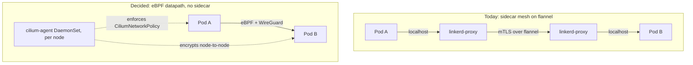

# ADR 012: Cilium Replaces Linkerd (CNI + Network Policy + Encryption)

**Author:** Joe McGinley
**Status:** Accepted
**Created:** 2026-07-05
**Supersedes:** N/A (retires the Linkerd platform component)

---

## Problem

The cluster runs Linkerd as a sidecar service mesh on top of k3s's embedded
flannel CNI. Linkerd buys us transparent mTLS and a small set of
service-to-service authorization policies, but the sidecar model imposes
standing costs that are mostly friction rather than value:

- **No native NetworkPolicy in meshed namespaces.** The Linkerd proxy owns
  port 4143, so a Kubernetes `NetworkPolicy` silently breaks meshed pods. We
  cannot express ordinary L3/L4 network policy anywhere the mesh is on, which is
  everywhere.
- **Sidecar lifecycle is a recurring source of bugs.** Pods block on the proxy
  coming up, and Job/Workflow pods never terminate because the sidecar keeps the
  pod alive. We work around this with 16 `linkerd.io/inject: disabled`
  opt-outs, a Kyverno auto-injection ClusterPolicy with an 8-namespace exclude
  list, and per-workload `config.linkerd.io/skip-inbound-ports` /
  `skip-outbound-ports` annotations (Postgres metrics 9187, Redis 6379). Almost
  none of this config *uses* the mesh; it *works around* the sidecar.
- **38 proxy sidecars** across the cluster, each a container to schedule,
  image to pull, and hop to traverse.

Separately, we want pod-to-pod traffic encrypted on the wire without the
sidecar tax. Cilium provides the CNI, native L3/L4/L7 network policy, and
transparent WireGuard encryption in one eBPF datapath, with no per-pod proxy.

Why now: the policy blindspot and the never-terminating-Workflow class of bugs
are ongoing operational drag, and adopting Cilium removes the workarounds rather
than adding more.

---

## Decision

Replace Linkerd (mesh) and flannel (CNI) with **Cilium**, providing three things
in one component: the cluster CNI, native network policy
(`CiliumNetworkPolicy`), and transparent **WireGuard** encryption of all
pod-to-pod traffic. Enable encryption and policy **cluster-wide** and delete the
injection machinery and all opt-outs, because with an eBPF datapath there is no
sidecar to bypass, block on, or exempt.

| Aspect | Today (Linkerd + flannel) | Decided (Cilium) |
| ------ | ------------------------- | ---------------- |
| CNI | flannel, embedded in k3s | Cilium (eBPF) |
| Data plane | 38 per-pod `linkerd-proxy` sidecars | none; per-node `cilium-agent` |
| Encryption | per-workload mTLS (SPIFFE, cert-manager) | node-to-node WireGuard, all pod traffic |
| Authorization identity | cryptographic workload identity (mTLS) | Cilium security identity (pod labels) |
| Network policy | none available in meshed ns (4143 conflict) | native `CiliumNetworkPolicy` everywhere |
| Injection | Kyverno ClusterPolicy + 8-ns exclude list | none |
| Opt-outs | 16 `inject: disabled` + skip-ports annotations | deleted |
| Egress control | `EgressNetwork` + `TLSRoute` (Linkerd 2025) | `CiliumNetworkPolicy` `toFQDNs` |
| Job/Workflow pods | opted out (sidecar never terminates) | no special handling |

The existing Linkerd policy surface is small and concentrated in two files, so
the rewrite is bounded:

- `projects/monolith-public/chart/templates/linkerd-policy.yaml` (4 `Server`,
  their `MeshTLSAuthentication` + `AuthorizationPolicy` pairs, 1 `EgressNetwork`
  deny-all, 1 `TLSRoute` for Cloudflare Turnstile) becomes a set of
  `CiliumNetworkPolicy` objects: label-selected ingress rules for
  gateway->frontend->backend, plus a default-deny egress with a `toFQDNs`
  allow for `challenges.cloudflare.com:443`.
- `projects/firecracker/substrate/chart/templates/linkerd-policy.yaml` (1
  `Server`, `MeshTLSAuthentication`, `AuthorizationPolicy` guarding `/invoke`)
  becomes a single `CiliumNetworkPolicy`. The `/invoke` endpoint is already
  TokenReview-gated in application code, so this policy is defense-in-depth.

### Conscious tradeoff: encryption model changes

Linkerd authorizes traffic on **cryptographic per-workload identity**: each pod
carries a cert-manager-signed SPIFFE identity and every hop is mutually
authenticated. Cilium's WireGuard mode gives **blanket node-to-node encryption**
of all pod traffic, and `CiliumNetworkPolicy` authorizes on **Cilium security
identity derived from pod labels**, not on a per-connection cryptographic
handshake.

For the homelab threat model (a single-tenant cluster behind Cloudflare, where
the goal is "nothing on the wire is plaintext" plus "services can only talk to
what policy allows") this is an acceptable substitute, and it is dramatically
simpler. We are consciously **not** adopting Cilium's SPIFFE-based mutual
authentication (a newer, less battle-tested feature) in this ADR. If a future
requirement genuinely needs per-workload cryptographic identity for authz, that
is a follow-up decision, not a blocker here.

---

## Architecture

Cilium runs as a per-node `cilium-agent` DaemonSet plus a `cilium-operator`
(2 replicas). It programs the eBPF datapath for routing, policy enforcement, and
WireGuard encryption. There is no per-pod component.

### Cluster topology

k3s is HA with embedded etcd: **node-1/2/3 are servers** (control-plane + etcd),
**node-4 is an agent** (the GPU/AI node). `flannel-backend` and
`disable-network-policy` are *server*-level settings, so they must be set on all
three server nodes; the agent only needs a k3s restart to pick up Cilium as its
CNI once the `cilium-agent` DaemonSet is scheduled onto it.

**The k3s node spec is not version-controlled in this repo.** There is no k3s
`config.yaml`, install script, or Ansible/Terraform here; k3s was installed with
defaults (flannel on) and nodes are configured by hand. The only precedent for
node-level config is `projects/platform/node-traffic-shaper`, which checks in a
systemd unit + scripts as reference artifacts applied out-of-band, explicitly
outside ArgoCD. This migration follows that pattern: it introduces the k3s
`config.yaml` fragment and the Cilium bootstrap manifest as checked-in reference
artifacts, applied to nodes by hand.

### Bootstrap ordering (the CNI chicken-and-egg)

Cilium is a **bootstrap-tier** component: the cluster has no working pod network
until it is running, so it cannot be delivered purely through ArgoCD (which
itself needs the network). On k3s this means:

1. On each server node, set `flannel-backend: none` and
   `disable-network-policy: true` in `/etc/rancher/k3s/config.yaml`, and drop the
   Cilium bootstrap manifest into `/var/lib/rancher/k3s/server/manifests/`
   (k3s auto-applies it before the API server serves user workloads).
2. Cilium's ongoing configuration (Helm values, version) is then reconciled like
   other platform charts, but the initial install and the node-level k3s config
   are node bootstrap, not GitOps, checked in as reference artifacts per the
   node-traffic-shaper precedent.

### Cutover shape

flannel and Cilium cannot both own pod networking, and pods on the two datapaths
cannot reach each other, so this is a **coordinated maintenance window**, not a
rolling swap where half the cluster runs each. The shape: set the config on all
three servers, bring Cilium up, restart k3s (servers then agent), then restart
workload pods so they trade flannel IPs for Cilium-managed ones. Existing pods
keep talking over flannel until restarted. On a 4-node homelab a short window is
acceptable. Detailed sequencing (and the rollback path to flannel + Linkerd)
belongs in a GitHub Issue, not this ADR.

---

## Alternatives Considered

- **Keep Linkerd, add Cilium as CNI only (no mesh replacement).** Rejected:
  running both doubles the datapath complexity and keeps the 4143 policy
  blindspot and the sidecar lifecycle bugs, which are the whole motivation.
- **Keep flannel, add a standalone NetworkPolicy engine (e.g. Calico policy
  only).** Rejected: solves the policy gap but not encryption or the sidecar
  tax, and adds a third networking component.
- **Cilium with IPsec transparent encryption instead of WireGuard.** Rejected as
  the default: WireGuard is simpler to operate, has fewer moving parts (no IKE,
  no cert rotation), and is the recommended path for most clusters. IPsec stays
  available if a FIPS or specific-cipher requirement ever appears.
- **Cilium SPIFFE mutual authentication to preserve Linkerd's identity model.**
  Deferred, not rejected: it is the newer, less-proven Cilium feature, and the
  homelab threat model does not require per-workload cryptographic authz. Left
  as a possible follow-up.
- **Cilium kube-proxy replacement.** Out of scope for this ADR to keep blast
  radius down; can be adopted later as an incremental Cilium config change.

---

## Security

Baseline: `docs/security.md`. Deviations from today's posture:

- **Encryption scope broadens, identity granularity narrows.** All pod-to-pod
  traffic is WireGuard-encrypted node-to-node (today only meshed traffic is
  encrypted, and GPU/inference and other opted-out pods are plaintext). We lose
  per-workload cryptographic mTLS identity; authorization moves to
  label-derived Cilium identity. See "Conscious tradeoff" above. This change to
  the service-to-service trust model is the reason this is an ADR and not a
  config PR.
- **Egress default-deny is preserved.** The monolith-public deny-all egress plus
  the Cloudflare Turnstile allowlist is re-expressed as a `CiliumNetworkPolicy`
  with `toFQDNs`, which is DNS-aware and at least as expressive as the current
  `EgressNetwork` + `TLSRoute`.
- **Policy coverage increases.** For the first time we can write default-deny
  L3/L4 policy in currently-meshed namespaces, closing the 4143 blindspot.

---

## Risks

| Risk | Likelihood | Impact | Mitigation |
| ---- | ---------- | ------ | ---------- |
| CNI cutover disrupts running workloads (flannel->Cilium is not in-place) | High | Medium | Single coordinated maintenance window; recreate pods for Cilium IPs (stateless first, stateful last); etcd snapshot as the restore point |
| Loss of per-workload mTLS identity weakens a trust property we rely on | Medium | Medium | Accepted for homelab threat model; document in security.md; SPIFFE mutual auth available as follow-up if needed |
| Bootstrap ordering mistake leaves cluster with no working CNI | Medium | High | Cilium via k3s auto-deploy manifest so it comes up before user workloads; test cutover on a spare/one node; keep flannel rollback documented |
| CiliumNetworkPolicy rewrite drops a rule the Linkerd policy enforced | Medium | Medium | Only 2 files / ~19 objects; translate 1:1 and diff intent; default-deny means a missed allow fails closed and is caught in test, not silently open |
| Memory footprint: cilium-agent + Hubble heavier than idle proxies | High | Low | Expected; resource reclaim was never the justification. Start with Hubble off or sampled |
| ArgoCD/GitOps expectation broken by out-of-band CNI bootstrap | Medium | Low | Document bootstrap-tier status explicitly (like node-4 CAKE shaper precedent); reconcile only Cilium's non-bootstrap config via chart |

---

## Open Questions

Resolved in the implementation plan (tracked via GitHub Issues):

1. **Cutover mechanism:** single coordinated window. The per-node
   `CiliumNodeConfig` migration is rejected because it assumes the old CNI is a
   standalone per-node DaemonSet, but k3s embeds flannel behind a cluster-level
   server flag, so per-node co-running fights k3s.
2. **Hubble:** enabled with a modest flow buffer; disable if memory pressure
   appears (it is what eats back the reclaimed RAM).
3. **kube-proxy replacement:** deferred; `kubeProxyReplacement=false` keeps
   k3s's kube-proxy. A later independent Cilium config change.
4. **Encryption backend:** WireGuard confirmed (`encryption.type=wireguard`,
   `nodeEncryption=true`).
5. **Rollback plan:** etcd snapshot (`k3s etcd-snapshot save`) before the
   window, plus a k3s config revert; detailed in the plan's per-task rollback
   notes.

---

## References

| Resource | Relevance |
| -------- | --------- |
| [Cilium docs: Transparent Encryption (WireGuard)](https://docs.cilium.io/en/stable/security/network/encryption-wireguard/) | The encryption mode this ADR selects |
| [Cilium docs: k3s install](https://docs.cilium.io/en/stable/installation/k3s/) | flannel-backend=none bootstrap on k3s |
| [Cilium docs: CiliumNetworkPolicy](https://docs.cilium.io/en/stable/security/policy/) | Target format for the policy rewrite |
| `projects/platform/linkerd/` | Component being retired |
| `projects/platform/kyverno/templates/linkerd-injection-policy.yaml` | Injection machinery to delete |
| `projects/monolith-public/chart/templates/linkerd-policy.yaml` | Policy to translate (4 Servers, egress, Turnstile) |
| `projects/firecracker/substrate/chart/templates/linkerd-policy.yaml` | Policy to translate (`/invoke` authz) |
| node-4 CAKE traffic shaper (systemd unit, not ArgoCD) | Precedent for node-level config living outside GitOps |
| `docs/security.md` | Baseline the trust-model change deviates from |
