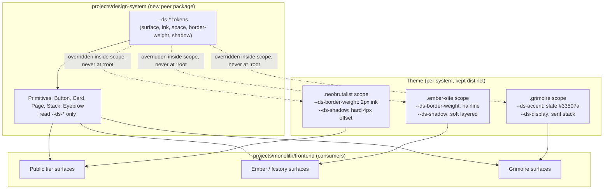

# ADR 013: A Shared Design System Contract, Three Distinct Themes

**Author:** Joe McGinley
**Status:** Accepted
**Created:** 2026-08-06

---

## Problem

The monolith frontend runs three deliberately distinct, CSS-scoped design
systems under `projects/monolith/frontend/src/lib/`: the public neobrutalist
baseline (`public/styles/design-system.css`, 301 lines), the ember mini-site
(`public/ember/ember.css`, scoped `.ember-site`, paired with the sibling
`public/fcstory/fcstory.css`), and Grimoire (`grimoire/theme.css`, scoped
`.grimoire`, 191 lines). `.impeccable.md` records why: each theme is answering
a different design question (evaluator-facing brutalist confidence, a warm
technical explainer, an arcane-ledger reading surface) and the differentiation
is documented in the files themselves, not an artifact of drift. Converging
them visually would delete real product decisions, not clean up an accident.

The problem is not the difference in appearance. Four things verified this
session are structural, not visual, and they compound with every surface
added:

1. **Token namespace collision with no isolation.**
   `src/routes/+layout.svelte` imports `$lib/global.css` on every route, and
   `global.css`'s first line `@import`s `styles/shared/tokens.css` (the
   private-tier token set). So every public page loads both `tokens.css` and
   `design-system.css` at once, and both set the same custom property names
   at the same specificity, unscoped, on `:root`: `design-system.css:7,16`
   sets `--accent: #ffde01` (yellow), `tokens.css:1,5` sets
   `--accent: #0066ff` (blue). `--coral` (`#ff7169` vs `#ff6b5b`), `--cream`
   (`#f3ede1` vs `#f1ebdc`), and `--green` (`#4ade80` vs `#5dd879`) collide the
   same way. Nothing decides the winner but CSS source order: reordering that
   one `@import` would silently flip the public accent colour from yellow to
   blue. Grimoire already shows the fix exists in this codebase today, just
   not generalized: `theme.css` never touches `:root`, it writes
   `.grimoire { --accent: var(--grim-accent); }`, so the override is scoped to
   its own subtree and cannot leak or collide. The public tier's two token
   sets never adopted that scoping discipline.
2. **No shared primitive layer, and the gap it leaves gets filled by
   reinvention, not by nothing.** There is no `Button.svelte` or
   `Card.svelte`; the shared vocabulary (`.btn`, `.btn-primary`,
   `.btn-secondary`, `.card-hard`) is CSS classes applied by hand in markup.
   Of the public tier's 104 Svelte files (`lib/public/` + `routes/public/`),
   only 3 apply it as a standalone class token: `Footer.svelte`, the homepage
   (`routes/public/+page.svelte`), and the CV page. Meanwhile, at least 12
   distinct locally invented button classes exist across the same tree:
   `aggregate-btn`, `bar-btn`, `bar-btn-primary`, `chapters-btn`,
   `collapse-btn`, `filter-btn`, `night-btn`, `pager-btn`, `picker-btn`,
   `run-btn`, `scan-btn`, `toggle-btn`. `bar-btn-primary` in particular is
   someone re-deriving the exact primary/secondary distinction
   `design-system.css` already ships, under a different name the shared
   vocabulary has no way to find.
3. **65 `nosemgrep` suppressions** of `svelte-hardcoded-color-in-style` across
   the monolith frontend. `.impeccable.md` is candid that this escape hatch is
   "well used", which is what happens when a surface needs a value and no
   token exists for it.
4. **20 hand-written `1px solid var(--rule...)` divider borders** across
   public-tier files (leaderboard tables, `HikesMap`, `StarsMap`,
   `DocsShell`), each independently re-deciding the same divider treatment
   `.impeccable.md` already names as a convention.

Why now: none of this is visible in a screenshot, so it never shows up as a
design bug, only as an increasingly fragile stylesheet and a components
directory that starts from zero every time.

---

## Decision

Split the system into two layers instead of one, and standardize only the
first:

- **Contract (shared, standardized).** One namespaced token vocabulary
  (illustrative shape: `--ds-surface`, `--ds-ink`, `--ds-space-md`,
  `--ds-border-weight`, `--ds-shadow`) plus a small set of Svelte primitives
  (`Button`, `Card`, `Page`, `Stack`, `Eyebrow`) that read only namespaced
  tokens, never a raw hex or an unnamespaced custom property. The exact token
  names and primitive set are an implementation detail for the follow-up
  GitHub issue(s), not locked here; the invariant this ADR fixes is
  namespacing plus scoping. A `--ds-*` prefix, combined with every theme
  overriding those tokens inside its own scope class (the pattern Grimoire
  already uses for `--accent`, generalized to the whole token set and applied
  to `design-system.css` and `tokens.css` too) makes the `--accent`-class
  collision structurally impossible rather than avoided by developer
  discipline.
- **Theme (per system, kept distinct).** Each of the three systems supplies a
  theme block mapping its own palette and treatments onto the contract:
  brutalist fills `--ds-border-weight` with 2px ink and `--ds-shadow` with the
  hard `4px 4px 0` offset; ember fills them with a hairline and a soft layered
  shadow; Grimoire with the slate accent and its serif display stack. Nothing
  about the perceptual differences `.impeccable.md` documents changes.

| Aspect | Today | Decided |
| ------ | ----- | ------- |
| Token scope | Two unscoped `:root` sets, same names, different values | One namespaced contract (`--ds-*`), themes override inside their own scope class |
| Collision resolution | CSS import order (silent, order-dependent) | Structurally impossible: namespaced tokens have one definition, scoped overrides can't leak |
| New surface starting point | Blank `<style>` block | Compose contract primitives, then theme |
| Primitive adoption | 3 of 104 public-tier files; 12 locally invented button classes elsewhere | Tracked as the ADR's success measure (see below) |
| Visual identity per system | Three distinct, deliberate | Unchanged; not the thing being fixed |
| `nosemgrep` escape hatch | 65 suppressions, no token to reach for | Same rule, but a contract token exists first before a suppression is reached for |

The first concrete step of this path is the token namespace cleanup on its
own (finding 1): it is a prerequisite for the rest, and worth landing before
the primitive layer exists, since a shared vocabulary is not safe to build on
a collision-prone foundation.

### Where the contract lives: `projects/design-system/`

Location is part of the decision, not an implementation detail, because it is
where the ownership ambiguity that produced finding 1 actually came from.
Today's tokens live inside `projects/monolith/frontend/src/lib/`, so any
change to them is implicitly a monolith frontend change, and that is exactly
how the private tier's `tokens.css` and the public tier's `design-system.css`
both came to independently claim `--accent`. Moving the contract to a peer
package makes its blast radius explicit, which is most of the value of moving
it at all.

The contract lands at `projects/design-system/`, not inside
`monolith/frontend/src/lib/` and not at a new top-level `./design/`.
Verified this session:

- The repo's tracked top-level entries are exclusively build tooling,
  dotfiles, and docs (`bazel/`, `buck2/`, `docs/`, `prelude/`, `projects/`,
  `tools/`, `.claude/`, `.github/`, plus root config files); there is no
  top-level product-code precedent to extend. `pnpm-workspace.yaml` also
  globs a `packages/*` slot, but no `packages/` directory exists yet, so it
  sets no precedent either and would face the identical objection.
- `.claude/CLAUDE.md` states the convention directly: "Services, operators,
  and websites live under `projects/<name>/`." A top-level `./design/` would
  contradict the repo's own documented rule.
- `projects/shared/` is the closest existing precedent: a peer package
  (currently `helm/homelab-library`, a Helm library chart, plus a README)
  holding cross-project shared assets rather than living inside the one
  project that happened to need it first.
- Plural consumers already exist, so a dedicated package is not speculative
  generality. `monolith-public` is a separate chart serving jomcgi.dev, and
  the retired standalone Grimoire frontend is a separate React app (its own `apko.yaml`,
  own `package.json`) already wired into the same pnpm workspace
  (`pnpm-workspace.yaml` lists it alongside `projects/monolith/frontend`); it
  could consume the token layer even though it cannot consume Svelte
  primitives.

**Consequences, stated honestly:**

- CSS leaving the SvelteKit `src/lib` tree means SvelteKit's built-in `$lib`
  alias (`src/lib`, unconfigured, no custom Vite alias exists today) no
  longer resolves it. The contract becomes a first-class pnpm workspace
  package (an entry added to `pnpm-workspace.yaml`'s `packages` list next to
  the retired standalone Grimoire frontend and `projects/monolith/frontend`), consumed the
  same way those two packages already depend on each other: a `js_library`
  Bazel target linked through `npm_link_all_packages`, not a raw filegroup.
  Every `$lib/...` import of a moved file becomes a package-specifier import
  instead.
- The move buys ownership clarity, **not** deploy independence.
  `monolith` and `monolith-public` build from the same frontend and share an
  image, so a token change still bumps both charts together, exactly as any
  other shared-code change does today. Nobody should read this move as
  decoupling their release trains.
- Migration is incremental by construction: the package can exist and be
  consumed by one theme before the other two move their CSS into it, so this
  is not a stop-the-world rename.

### The contract ships with a way to see it

Concretely, the failure this guards against: a contract token quietly encodes
one theme's opinion, a shadow token that assumes an offset ember's soft
shadow cannot express, or a border token that assumes an ink weight. "Keep
the vocabulary about roles, not values" is a principle, and principles do not
catch this. Rendering one primitive under all three theme scopes at once
does, because the wrong one looks wrong.

That check is nearly free, and for a reason this ADR's own decision creates:
because every theme is a scope class (`.ember-site`, `.grimoire`, the public
baseline), a single page can render one `Button` three times, each inside a
different scope wrapper, side by side on one screen. The scoping that makes
the architecture safe is the same property that makes the gallery cheap.

Two surfaces, with different jobs:

- **`jomcgi.dev/design`, an unlisted URL. The canonical surface.** CI builds
  it from the same pipeline as the app, off the same tokens and the same
  primitives, so it cannot drift from what actually ships. When the gallery
  and production disagree, the gallery is wrong and says so immediately.
- **Storybook, local development only.** Authoring ergonomics: isolation,
  controls, iterating on one primitive without navigating an app around it.

The division is deliberate. Storybook is not CI-built, so it *can* drift; that
is an accepted tradeoff rather than an oversight, and it is acceptable
precisely because Storybook is not the source of truth. `/design` is.

**Public tier consequences.** `/design` on the apex is served by
`monolith-public`, so `docs/runbooks/public-tier-checklist.md` applies to it
like any other public page:

- The public origin deliberately has **no `/api` ingress**. The gallery must
  be self-contained and must never client-fetch `/api/...`, which would work
  against the private origin in dev and fail on the real public origin. A
  component gallery renders components, not data, so it should need no fetch
  at all.
- It reads no database, which is what makes the checklist's `public_reader`
  grant and `is_global` filtering items inapplicable. Stated rather than
  assumed, because "reads no data" is the reason, not an accident.
- Every change to the gallery bumps **both** `monolith` and `monolith-public`,
  not just one.
- Public-served code importing a gazelle-excluded package raises
  `ModuleNotFoundError` only in the public image, so a new import here needs
  the public binary's BUILD glob checked by hand.

**Unlisted is not private.** Anyone with the URL can read it, and it is a
deliberate choice rather than an access control. Whether it also carries
`noindex` is an open question below. Worth noting the tradeoff runs both ways:
`.impeccable.md` records the public tier's reader as a technical audience
evaluating the work on its merits, and a design system page is good signal for
exactly that reader, so indexing may be desirable rather than merely tolerable.

**Storybook is the repo's first**, a deliberate new toolchain in a codebase
that has had none. Its cost stays proportionate by staying local: not CI-built
means no Bazel target, no apko image, and no new gating check. The expensive
part of adopting tooling here has never been the dependency, it is the build
and release wiring, and a local-only dev tool skips all of it.

One further payoff, verified while writing this ADR: the `/design-sync` skill,
which imports a design system into claude.ai/design, cannot run against this
repo today because it finds no Storybook, no `*.stories.*`, and no package
with a library entry point. Both surfaces above produce all three as a side
effect, so an external design-tool import becomes possible without that ever
being the goal.

---

## Architecture



The load-bearing rule is where the override lives. Today's collision
(`design-system.css` and `tokens.css` both writing `--accent` at `:root`) and
Grimoire's already-working pattern (`.grimoire { --accent: var(--grim-accent);
}`) are structurally the same mechanism, CSS custom property cascading; the
only difference is that one is scoped and one isn't. This decision is
generalizing Grimoire's existing pattern across all three themes and the
contract layer they'll sit on, not inventing a new mechanism. Moving the
contract to `projects/design-system/` is what makes "which side owns this
token" a question with a package boundary as its answer, instead of a
question CSS import order answers by accident.

---

## Success Measure

**Adoption of the primitive layer**: the count of files applying `.btn`,
`.btn-primary`, `.btn-secondary`, or `.card-hard` as a standalone class token
in `lib/public/` and `routes/public/`, verified this session at **3 of 104**
public-tier Svelte files, rising over time. Baseline method, so a later count
is comparable rather than an artifact of a looser pattern:

```
grep -rlE 'class="[^"]*[" ](btn|btn-primary|btn-secondary|card-hard)[" ]' \
  lib/public routes/public --include='*.svelte'
```

Matching on the bare word `btn` without the surrounding quote/space anchors
overcounts: `-` reads as a word boundary, so names like `run-btn` or
`night-btn` (see finding 2) inflate the count without anyone touching the
shared vocabulary. A primitive layer nobody reaches for is worse than no
primitive layer, because it adds a second thing to maintain without reducing
the first. Shorter stylesheets, fewer `nosemgrep` suppressions, fewer
hand-written `1px solid var(--rule)` borders, or a falling count of locally
invented button classes are not the measure on their own; they are expected
side effects if adoption rises, not proof of it on their own.

---

## Alternatives Considered

- **Full visual standardization on the neobrutalist system.** Rejected:
  deletes the documented, deliberate differentiation `.impeccable.md`
  attributes to real product reasoning (Grimoire's "arcane ledger, not a
  terminal" framing, ember's "read as one small site distinct from the
  neobrutalist jomcgi.dev baseline"), and it is the largest possible
  migration: 35 of the public tier's 104 Svelte files (`lib/public/` +
  `routes/public/`, scoped under `.ember-site`, `fcstory`, or `.grimoire`)
  would all need restyling, on top of retrofitting the remaining baseline
  files. Three
  surfaces that each look considered is a stronger signal to the target
  audience (`.impeccable.md`'s "technical audience evaluating the work on its
  merits") than one template applied three times.
- **Fix only the token collision, change nothing else.** Rejected as
  insufficient on its own: it removes the fragility in finding 1 but leaves
  every new surface starting from a blank `<style>` block, which is how the
  system arrived at 65 `nosemgrep` suppressions and 20 independently
  re-decided divider borders in the first place. Recorded above as the
  correct first step of the chosen path, not as a standalone fix, since a
  clean namespace is a prerequisite for a primitive layer worth building on.
- **Do nothing.** Rejected: the three systems function today and nothing is
  visibly broken, but findings 1 to 4 are real, verified this session, and
  each new surface added under the current pattern makes the eventual cleanup
  larger, not smaller.

Two more, on where the contract physically lives:

- **A new top-level `./design/`.** Rejected: contradicts
  `.claude/CLAUDE.md`'s documented convention that services, operators, and
  websites live under `projects/<name>/`, and has no tracked precedent to
  extend. Every existing top-level entry is build tooling, a dotfile
  directory, or docs.
- **Leave it inside `monolith/frontend/src/lib`.** Rejected: this is the
  direct cause of the ownership ambiguity that produced the `--accent`
  collision in finding 1. While the tokens are monolith frontend source,
  changing them reads as a monolith change with no visible signal that a
  second project (`monolith-public`, and potentially the retired standalone Grimoire frontend)
  depends on them too.

---

## Security

Baseline: `docs/security.md`. This decision does not change the trust model,
network posture, or auth surface; it is a frontend styling architecture
change. The one property worth carrying forward explicitly:
`.impeccable.md`'s principle 5 (WCAG 2.2 AA is the floor, contrast fixes get
recorded in the CSS) applies to contract tokens exactly as it applies to
today's per-system tokens, since a namespaced `--ds-ink`-on-`--ds-surface`
pairing needs the same contrast verification each theme's current pairing
already gets.

---

## Risks

| Risk | Likelihood | Impact | Mitigation |
| ---- | ---------- | ------ | ---------- |
| Primitive layer is built but not adopted, becoming a fourth thing to maintain | Medium | Medium | Success measure tracks adoption explicitly, not existence; if it stalls, that's a signal to revisit rather than declare done |
| Contract token names leak an implicit opinion one theme disagrees with (e.g. a shadow token assumes an offset that ember's soft shadow can't express) | Medium | Low | Keep the contract's vocabulary about roles (surface, ink, spacing, border weight, shadow), not values; each theme supplies its own value shape. The mechanism that actually catches a leak, rather than discouraging it, is the `jomcgi.dev/design` gallery rendering each primitive under all three theme scopes side by side, so a token that only works for one theme is visible immediately instead of surfacing when someone builds an ember page |
| Migrating `design-system.css` / `tokens.css` off unscoped `:root` risks a visual regression on pages that unintentionally depend on the current collision's resolution order | Low | Medium | Grimoire's scoped-override pattern is proven in production today; land the namespace fix behind the existing hermetic visual regression suite (`docs/decisions/tooling/010-hermetic-visual-regression.md`) |
| Scope creep: "standardize the contract" is read as license to also standardize appearance | Medium | Medium | This ADR explicitly rejects visual convergence; GitHub issues for the contract work should scope to tokens and primitives only |
| Extracting `projects/design-system/` as a new pnpm workspace package breaks `$lib`-relative imports or the Bazel `js_library` graph mid-migration | Medium | Medium | Migration is incremental (package exists and is consumed before every theme moves its CSS in); land behind the existing hermetic visual regression suite; the retired standalone Grimoire frontend already proves cross-package pnpm/Bazel wiring works in this repo |
| Moving code is mistaken for decoupling `monolith` and `monolith-public` releases | Low | Low | Stated explicitly in this ADR: the two charts still share an image and bump together; the move buys ownership clarity, not independent deploys |

---

## Open Questions

Resolved in follow-up GitHub issues, not here:

1. Exact `--ds-*` token names and their initial value set per theme.
2. Which primitives ship first (the ADR's illustrative list is `Button`,
   `Card`, `Page`, `Stack`, `Eyebrow`; the actual v1 set is an implementation
   call).
3. Migration order for `design-system.css` and `tokens.css` off unscoped
   `:root` writes, given the visual regression suite is the safety net.
4. Exact shape of the `projects/design-system/` package (its `package.json`,
   `BUILD` target, and `pnpm-workspace.yaml` entry) and the order in which the
   three themes' CSS moves into it versus staying a consumer of it in place.
5. Whether `jomcgi.dev/design` carries `noindex`. Unlisted is a choice about
   discoverability, not access, and the tradeoff runs both ways (see above).
6. Whether Storybook later becomes a CI-built artifact. Staying local-only
   keeps its cost proportionate but accepts that it can drift from `/design`;
   revisit if that drift starts costing more than the wiring would.

---

## References

| Resource | Relevance |
| -------- | --------- |
| `.impeccable.md` | Source of truth for why the three themes are deliberately distinct; this ADR does not restate its design context |
| `projects/monolith/frontend/src/lib/public/styles/design-system.css` | Public neobrutalist theme, source of the `--accent`/`--coral`/`--cream`/`--green` collision |
| `projects/monolith/frontend/src/lib/styles/shared/tokens.css` | Private-tier tokens, loaded on every route via `global.css`, the other half of the collision |
| `projects/monolith/frontend/src/lib/grimoire/theme.css` | Existing proof of the scoped-override pattern this ADR generalizes (`.grimoire { --accent: var(--grim-accent); }`) |
| `projects/monolith/frontend/src/lib/public/ember/ember.css` | Ember theme; states its own differentiation intent in its header comment |
| `projects/monolith/frontend/src/routes/+layout.svelte` | Where `global.css` is imported on every route |
| `docs/decisions/tooling/010-hermetic-visual-regression.md` | Regression safety net for the token-namespace migration |
| `projects/shared/README.md` | Existing precedent for a `projects/<name>/` peer package holding cross-project shared assets |
| `pnpm-workspace.yaml` | Workspace package list the new `projects/design-system` entry joins |
| `.claude/CLAUDE.md` | Source of the `projects/<name>/` convention that rules out a top-level `./design/` |
| `docs/runbooks/public-tier-checklist.md` | Applies to `jomcgi.dev/design`; the no-`/api`-on-the-public-origin rule and the both-charts-bump rule are the two that bite |
| `docs/security.md` | Baseline; unaffected by this decision |
