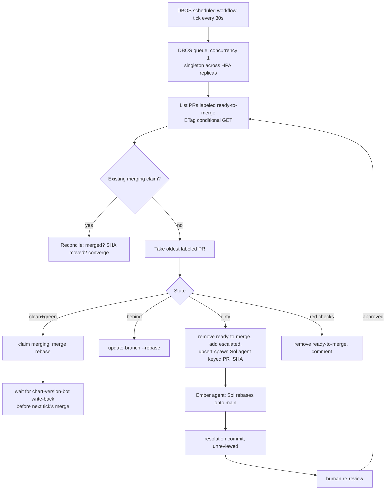

# ADR 014: A Stateless Merge-Queue Reconciler, with Deterministic Escalation to Sol

**Author:** Joe McGinley
**Status:** Accepted
**Created:** 2026-08-14
**Relates to:** [009 - Post-Merge Chart Versioning and Kargo Promotion](009-post-merge-chart-versioning-kargo-promotion.md) (the write-back commit this ADR schedules around)

---

## Problem

Required checks on this repo are strict: a PR's branch must be up to date with
`main` before it merges. Every merge lands two commits, not one: the change
itself, then the `chart-version-bot` write-back that ADR 009 moved post-merge.
Each of those two commits re-behinds every other open PR. A session that
babysits its own auto-merge has no way to see another session doing the same
thing at the same time, so two or more sessions land near-simultaneous merges,
each re-behinds the other's PR, and both chase rebases indefinitely. This has
already happened in practice (see the concurrent-Codex-dispatch and
double-re-behind incidents this repo has hit).

GitHub's native merge queue is the standard fix for exactly this shape of
problem, and it is not available: a merge queue requires an organisation-owned
repository, and this repo is user-owned. Serialising merges is therefore work
this repo has to build rather than configure.

The chosen shape has to survive two facts about this environment specifically.
First, "a session" here is not one long-lived process: the merger has to work
whether the PR was opened by an interactive session, a scheduled routine, or a
Codex dispatch that has since exited, so the mechanism cannot be "whoever
opened the PR watches it." Second, the monolith already deploys on every merge
to `main` and already runs DBOS for other scheduled and queued work, so
whatever owns serialization should live there rather than as new
infrastructure.

---

## Decision

A **stateless singleton merge-queue reconciler**: a DBOS scheduled workflow in
the monolith, ticking every 30 seconds, singleton-enforced by a DBOS queue with
concurrency 1. That enforcement holds across HPA replicas because it is
coordinated in the monolith's own Postgres, not in process memory, so scaling
the monolith does not spawn a second ticker.

GitHub is the sole source of truth. DBOS's state is disposable execution
progress, not the queue's memory: there is no startup-recovery code path,
because there is nothing to recover. Every tick runs the identical
observe-converge-exit logic, the same shape as a Kubernetes controller
reconcile loop, so a crashed or redeployed reconciler is indistinguishable
from one that has simply not ticked yet. This is why "stateless" is load
bearing and not just a description: a stateful design would need a second
mechanism to keep its state consistent with GitHub, and that mechanism is the
thing GitHub already does authoritatively for free.

### Label state machine: one writer per label

Three labels, each with exactly one writer, because a label two things can
write is a label neither can trust:

- **`ready-to-merge`**, written only by the judgment tier (the Opus reviewer
  session, or Joe) after review has actually happened. Applying it is an
  assertion that review occurred, not a request to merge. The reconciler may
  remove it, never add it: it has no way to know a PR is reviewed, only that
  someone claimed it is.
- **`merging`**, written only by the reconciler, applied *before* the side
  effect (a merge or an agent spawn) as a write-ahead claim. It is
  deliberately a claim, not a lock. An orphaned `merging` label, left behind
  by a crash mid-tick, never blocks convergence: the next tick re-derives
  whatever action current GitHub state implies, exactly as it would have with
  no label at all. Humans should read `merging` as "do not push to this
  branch right now," not as a guarantee anything is in flight.
- **`escalated`**, meaning a Sol rebase agent owns this PR. It is out of the
  queue until a human re-review re-applies `ready-to-merge`.

### One action per tick

The reconciler lists open PRs labeled `ready-to-merge` via the issues REST
endpoint (PRs are issues; the endpoint filters by label and sorts by age),
sending the prior response's ETag so an unchanged queue costs a 304 and no
rate-limit budget. It reconciles any existing `merging` claim first (merged
already? SHA moved? agent still running?), then takes the oldest remaining
labeled PR and does exactly one of:

- **Clean and green:** apply `merging`, merge with rebase.
- **Behind:** `update-branch --rebase`.
- **Dirty (rebase conflict):** remove `ready-to-merge`, add `escalated`, spawn
  the Sol rebase agent.
- **Checks red:** remove `ready-to-merge`, comment why. Re-labeling after a
  fix re-enters the queue at the PR's original age, not at the back.

After a merge, the reconciler waits for the chart-version-bot write-back to
land before touching the next PR, rather than immediately re-behinding a
second PR and creating the exact double-rebase cost this ADR exists to
remove. Merge order is PR age; where one PR genuinely depends on another,
that ordering is expressed by *when the queuer labels*, not by new machinery
in the reconciler.

One action per tick, not "drain the whole queue per tick," keeps every tick
short and keeps the reconciler cheap to reason about: a tick that does one
thing and exits either succeeded or it did not, with no partial-batch state to
recover.

### Escalation is deterministic, never a model's judgment call

A dirty rebase always spawns an Ember agent running Sol, prompted to rebase
the PR onto the current `main`. No model decides whether the conflict "looks
easy": the happy path (clean, behind, red) is fully mechanical and stays plain
code, and Sol appears only where the mechanical path cannot proceed at all.

The spawn is an idempotent upsert keyed on `(PR, head SHA)`. DBOS steps are
at-least-once by design, so a retried spawn has to find the existing session
rather than create a second one; the platform has produced duplicate sessions
from exactly this gap before (a `uuid4` generated inside a step rather than
passed in). Keying on the PR and its head SHA means every tick's spawn, while
the agent is still working the same SHA, is a natural no-op with no separate
in-flight bookkeeping. The agent's resolution commit is unreviewed code: it
goes back through the same re-review gate as any other change. The agent
never merges and never touches a label itself; it only produces a commit for
a human to re-review.

A hard cap on escalations per day bounds this until `budget_usd` enforcement
lands (#4784, deliberately deferred, see CLAUDE.md's model-routing section).
Without a cap, one bad commit on `main` can put every open PR into conflict
simultaneously, and a naive reconciler would fan out one Sol dispatch per PR
in the same tick.

---

## Architecture

---

## Alternatives Considered

- **GitHub's native merge queue.** The obvious fix, and unavailable: it
  requires an organisation-owned repository, and this is a personal,
  user-owned repo. No workaround exists short of transferring ownership.
- **Convention only: "one lander at a time," enforced by memory.** This is the
  status quo, and it is the failure. It relies on every concurrent session
  and agent remembering and honoring an unenforced rule, which is exactly the
  category of thing that silently degrades as more sessions run at once.
- **An LLM marshal (qwen or pi) judging the happy path.** Rejected: the happy
  path, clean, behind, or red, is fully deterministic. Routing it through a
  model would add latency, cost, and a new failure mode for zero judgment
  actually exercised. The model appears only where determinism runs out, on
  the conflict-resolution exception path, which is the one place a model's
  judgment is the point.
- **A long-lived, eternal DBOS workflow instead of short ticks.** The
  monolith deploys continuously (multiple times a day under normal use), and
  a long-lived workflow's recovery path has to reconcile its saved state
  against whatever code version resumes it. That is a code-version-drift
  problem this repo does not need to take on. A workflow that runs for 30
  seconds and exits has no recovery surface: the next tick starts clean on
  whatever code is live.
- **A DAG or requeue engine for ordering and retries.** Rejected as
  unnecessary complexity: the reconciler observes GitHub, which the escalated
  agent mutates directly, so GitHub is already the coordination blackboard.
  Building a requeue engine on top would duplicate state GitHub already holds
  authoritatively.

---

## Security

Follows the baseline in `docs/security.md`.

- **The reconciler's GitHub credential** can merge PRs, apply and remove
  labels, and force-push via `update-branch`. That is meaningfully more
  reach than anything the monolith holds today and is tracked as its own
  piece of implementation work (#4921), not settled by this ADR.
- **`ready-to-merge` is the review gate.** Its single-writer rule (judgment
  tier only, reconciler may only remove) is what keeps the reconciler from
  ever being the thing that decides a PR is safe to land. If that invariant
  is ever violated, unreviewed code merges automatically.
- **The Sol agent's output is never trusted code.** A rebase resolution commit
  re-enters the same review gate as anything else; the escalation path adds
  no new bypass around review, only a new *producer* of a commit that still
  needs one.

---

## Risks

| Risk | Likelihood | Impact | Mitigation |
| ---- | ---------- | ------ | ---------- |
| Orphaned `merging` label after a crash mid-merge misleads a human into thinking a merge is stuck | Medium | Low | Every tick re-derives the true state from GitHub regardless of the label; the label is documentation for humans, not an input to the reconciler's own logic |
| A bad commit on `main` conflicts with many open PRs at once, fanning out Sol dispatches | Medium | High | Hard cap on escalations per day (until #4784 lands) |
| Reconciler credential is a new high-privilege surface (merge, label, force-push) | Medium | High | Scoped credential work tracked separately (#4921); treat as production-critical, reviewed like any other secret-bearing code |
| A stalled reconciler (DBOS queue wedged, workflow silently not ticking) looks identical to an empty, healthy queue from the outside | Medium | Medium | `cd_health` carries an advisory signal for queue staleness (#4922); advisory, not paging, matching this repo's existing `cd_health` posture |
| Escalating every dirty rebase to Sol, even trivial ones, spends OpenAI quota on conflicts a human would resolve in seconds | Low | Low | Accepted cost of keeping the routing deterministic rather than model-judged; revisit if escalation volume is high enough to matter against the trial's OpenAI-quota-burn criterion (#4913) |

---

## What Would Make Us Revisit

- **`budget_usd` enforcement (#4784) lands.** The daily escalation cap is a
  blunt stand-in; once real budget enforcement exists, the cap can likely be
  replaced or loosened.
- **The reconciler's credential turns out to need broader or narrower scope**
  than #4921 assumed once implemented, which would be worth its own ADR
  rather than a silent scope change.
- **Escalation volume is high enough that the deterministic-routing bet looks
  wrong**, i.e. Sol is regularly asked to resolve conflicts a marshal model
  would have triaged away cheaper. Nothing in the current data suggests this;
  it is a hypothesis worth checking once the reconciler has run for a while.
- **GitHub ever offers a merge queue to user-owned repositories.** If that
  constraint lifts, this whole reconciler is a candidate for retirement in
  favor of the native mechanism it stands in for.

---

## References

| Resource | Relevance |
| -------- | --------- |
| [#4915](https://github.com/jomcgi/homelab/issues/4915) | The settled design this ADR records, and the parent tracking issue for implementation |
| [#4916-#4922](https://github.com/jomcgi/homelab/issues/4915) | Sub-issues carrying the implementation plan: directives/docs, idempotent spawn, credentials/egress, the reconciler, the Sol agent plumbing, observability |
| [#4784](https://github.com/jomcgi/homelab/issues/4784) | `budget_usd` enforcement, which the daily escalation cap stands in for |
| [#4913](https://github.com/jomcgi/homelab/issues/4913) | The Sol implementation-tier trial this reconciler's escalation path feeds into |
| [009 - Post-Merge Chart Versioning and Kargo Promotion](009-post-merge-chart-versioning-kargo-promotion.md) | Source of the two-commits-per-merge write-back the reconciler schedules its next action around |
| [DBOS documentation](https://docs.dbos.dev/) | Scheduled workflows, queues with concurrency limits, and at-least-once step semantics referenced throughout |
