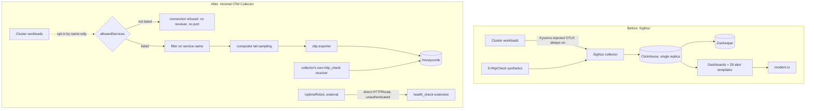

# ADR 015: Remove SigNoz, Replace with a Minimal Opt-In OTel Collector to Honeycomb

**Author:** Joe McGinley
**Status:** Accepted
**Created:** 2026-08-28
**Relates to:** [009 - Post-Merge Chart Versioning and Kargo Promotion](009-post-merge-chart-versioning-kargo-promotion.md) (the collector lives under `projects/platform/`, which deploys on merge to `main`, not on a version bump), [010 - Memory Oversubscription via Burstable QoS and a Designated-Victim PriorityClass Hierarchy](010-memory-oversubscription-burstable-priorityclass.md) (the right-sizing history this ADR concludes was treating a symptom)

---

## Problem

SigNoz's footprint was large relative to what it was used for: a full chart,
an addons operator and its CRDs, 28 alert templates, a dashboard-sidecar
image, a dashboards library, and a ClickHouse plus ZooKeeper backend to store
it all in. What the cluster actually drew from that stack was narrow: 5
HttpCheck synthetic probes routed to incident.io, a trace waterfall panel on
the demos page, and one manual span-query script in `model-bench`.

The backend was also structurally fragile, and two incidents made that
concrete rather than theoretical.

The first (#5298) took SigNoz fully down for over 30 hours from 2026-08-24.
ClickHouse refused to start: `signoz_logs.logs_v2` had 133 broken parts
against a `max_suspicious_broken_parts` default of 100, so startup aborted
with `TOO_MANY_UNEXPECTED_DATA_PARTS` and the pod sat in CrashLoopBackOff
through 2124 BackOff events. The parts totalled 0.00 B, so they were empty
rather than partially written, pointing at an unclean shutdown rather than
data corruption. The guardrail was working correctly; the problem was that
whatever wrote 133 zero-length parts was never established (#5317).

What that outage revealed matters more than its cause: everything reading
SigNoz failed closed, and failed quietly. The cluster snapshot job wrote
`alerts = {"error": ...}` instead of real data, so the private dashboard's
alerts section showed stale content for over a day. The observability stack
being down was itself only noticed while investigating an unrelated log line.

The second (#5335) showed the fragility was not confined to storage. The
collector's memory limit had been right-sized from a measured steady-state
peak, which was an accurate measurement and still the wrong number: the
pipeline had no `memory_limiter` processor, so on recovery the collector came
back, logged zero export errors, and was OOMKilled 262 times at a 1.5Gi limit
while absorbing the backlog upstream agents had queued. Raising the limit
fixed that one recovery, but the underlying gap, a telemetry pipeline with no
admission control between receiver and backend, was the same shape of problem
as the storage failure: something accepts unbounded load with no way to shed
it, and reports healthy while doing so.

Fixing either incident individually would have bought back one incident's
worth of headroom, not removed the class. Given how little of the stack's
surface area was actually load-bearing, the decision was to stop maintaining
an analytical-database-backed observability platform for that usage and build
a small collector whose only job is to be safe by construction: it cannot
admit more than it is explicitly told to.

---

## Decision

Remove SigNoz entirely, chart, addons operator, alert templates, dashboard
sidecar, dashboards library, ClickHouse, ZooKeeper, and replace it with a
small hand-written OpenTelemetry Collector at
`projects/platform/otel-collector/` that exports to Honeycomb. Executed
across four PRs against tracking issue #5362: #5364 removed the monolith's
functional dependencies on SigNoz while it kept running, #5368 stood up the
new collector additively alongside it, #5370 deleted SigNoz once the
replacement was already proving itself live, and #5371 added a direct public
health route for metamonitoring.

| Aspect | SigNoz | Decided (OTel Collector -> Honeycomb) |
| ------ | ------ | -------------------------------------- |
| Backend | ClickHouse (single replica) + ZooKeeper | none; Honeycomb is the store |
| Ingestion default | any workload with the injected endpoint could send | deny-by-default; empty allowlist |
| Trace admission | unbounded, backend-limited | `filter` on `service.name` allowlist, then composite tail sampling |
| Metrics admission | arbitrary OTLP metrics accepted | `http_check` only |
| Alerting | 28 SigNoz alert templates -> incident.io | none in-collector; Honeycomb triggers, follow-up work |
| Synthetic monitoring | 5 SigNoz HttpCheck probes | collector's own `http_check` receiver |
| Metamonitoring | SigNoz dashboard, self-hosted | UptimeRobot -> direct public route -> collector's `health_check` extension |
| Cluster-wide injection | Kyverno injects `OTEL_EXPORTER_OTLP_ENDPOINT` into every workload | disabled; opt-in only |
| Dashboards | SigNoz dashboards library + monolith `signoz-dashboards` subchart | none shipped; Honeycomb boards as needed |
| Memory admission | no `memory_limiter`; OOM was the backpressure | `memory_limiter` first in every pipeline |

### Deny-by-default is enforced in config, not convention

The collector's `allowedServices` list starts empty, and the chart renders
**no `otlp` receiver, no traces pipeline, and no OTLP ports** on the
Deployment or Service while it is empty. A service pointed at the collector
gets connection refused, not a silently accepted, silently dropped stream.
This is the direct answer to the incidents above: nothing about the new
design relies on remembering to keep ingestion bounded, because an unlisted
service cannot reach the receiver at all. Opting a service in is a one-line
values edit, visible in a PR diff, rather than a standing default anyone
could point traffic at.

Once a service is listed, three separate controls still bound what gets
through, because reachability and admission are kept as separate gates:

1. A `filter` processor drops any span whose `service.name` is absent or not
   on the list.
2. Tail sampling uses **one `composite` policy**, not several peer policies.
   `tail_sampling` ORs its policies, so a `rate_limiting` policy sitting
   beside error and latency policies would only ever admit more traces, never
   cap them. `composite` instead spends a spans-per-second budget across
   sub-policies in priority order and drops the overflow. The sharp edge:
   the budget is checked per trace against the one sub-policy that matched
   it, not against the pooled total, so a trace larger than its own
   sub-policy's allocation is dropped outright rather than falling through to
   a policy with room. The ceiling has to comfortably exceed the largest
   expected single trace, or that trace never gets sampled at all.
3. The metrics pipeline accepts `http_check` only. Arbitrary OTLP metrics are
   judged the easiest way to burn ingestion quota by accident, so no service
   gets that path even after being allowed to send traces.

### Cluster-wide injection is disabled, not repointed

Kyverno's `ClusterPolicy` injected `OTEL_EXPORTER_OTLP_ENDPOINT` into every
Deployment, StatefulSet, and DaemonSet in the cluster. Repointing that
injection at the new collector while its allowlist defaults to empty would
have every uninstrumented workload retrying against a closed port the moment
it rolled. The injection is disabled outright instead; a service opts in by
being added to the collector's allowlist by name, the same edit that opens
the receiver to it. Pods that already carry the old injected value keep it
until they next roll; OTel SDKs fail soft against an unreachable endpoint, so
that window is noisy at worst, not broken.

### Monitoring is inverted, not migrated

The old shape was SigNoz watching everything else: 5 HttpCheck synthetics
feeding an incident.io channel, from inside the same stack that had just
demonstrated it could silently deadlock for three days. The new shape has
two halves that deliberately do not share a failure domain. The collector's
own `http_check` receiver probes public URLs and ships results to Honeycomb
as ordinary telemetry. Separately, UptimeRobot watches the collector itself
from outside the cluster, at `https://jomcgi.dev/health/otel-collector`, a
direct HTTPRoute into the collector's `health_check` extension rather than a
proxy through the SvelteKit frontend the way `jomcgi.dev/health` works. The
signal that says "the watcher is alive" cannot travel through a service that
can fail independently of the watcher, or a frontend outage would make the
collector look dead and conflate two unrelated failures at exactly the
moment they need to be told apart. The route is unauthenticated by design:
Cloudflare's SecurityPolicies target routes by name, so a route UptimeRobot
must reach without credentials simply is not given one, and what it exposes
is a fixed JSON status with no data and no further auth surface.

### Data loss is accepted, deliberately

No ClickHouse migration, no alert history, no dashboard export. There is
nothing in the replacement to migrate trace data into yet: neither the demos
trace waterfall nor `model-bench/probe/spans.py`'s span probe has a query
surface to read from, only an ingest path, so both are left inoperative
(#5363) rather than pointed at a store that does not exist. Alert history has
no consumer once the incident.io routing it fed is gone.

---

## Architecture

`memory_limiter` runs first in every pipeline in the new collector, learned
directly from the recovery-headroom incident: a pipeline with no admission
control at the memory boundary OOMs on the drain after any outage, not at
steady-state peak, regardless of how correctly the steady-state number was
measured.

---

## Alternatives Considered

- **Keep SigNoz, harden ClickHouse.** Restore
  `max_suspicious_broken_parts` to its default and find what wrote 133
  zero-length parts (#5317). Rejected as necessary but not sufficient: it
  addresses one startup failure while leaving the rest of the footprint,
  addons operator, 28 alert templates, dashboard sidecar, unchanged for the
  same narrow actual usage.
- **Keep SigNoz, add a `memory_limiter` to its collector.** Rejected as a
  patch, not a fix. It is the right change in isolation, and the new
  collector adopts it, but applied to SigNoz it removes one symptom without
  touching the structural cause: a backend that can fail closed for 30 hours
  while every reader degrades quietly and reports healthy.
- **Repoint Kyverno's cluster-wide injection at the new collector
  immediately.** Rejected: paired with a deny-by-default receiver, every
  uninstrumented workload in the cluster would retry against a closed port
  the moment it rolled, for no ingestion gained.
- **Peer `tail_sampling` policies (errors, latency, rate limiting side by
  side).** Rejected: `tail_sampling` ORs its policies, so a `rate_limiting`
  policy next to the others would only ever admit more traces, never cap
  them. `composite` was the only shape that actually enforces a budget.
- **`tail_storage`, disk-offloaded tail sampling.** Rejected for now: it sits
  behind a feature gate that is off by default and documented as under
  active development, which is the wrong maturity bar for a component being
  built specifically to be simple and safe.
- **Proxy the metamonitoring route through SvelteKit, matching the
  `jomcgi.dev/health` pattern.** Rejected: that pattern exists because the
  public backend is deliberately never internet-reachable, but the collector
  health check has no such constraint, and routing it through the frontend
  would make a frontend outage look like the watcher itself is down.
- **Migrate ClickHouse trace data or alert history into the replacement.**
  Rejected: the replacement has no query surface for trace data yet, only
  ingest, so there is nowhere to migrate spans into; and alert history has no
  consumer once the incident.io routing it fed is retired in the same
  change.

---

## Security

Baseline: `docs/security.md`. Deviations from today's posture:

- **`https://jomcgi.dev/health/otel-collector` is unauthenticated by
  design.** Cloudflare's SecurityPolicies and BackendTrafficPolicies target
  routes by name, so this route inherits neither Cloudflare Access nor a
  rate limit, which is required rather than incidental: UptimeRobot has to
  reach it without credentials. What it exposes is the `health_check`
  extension's fixed JSON status, no data and no further auth surface.
- **Deny-by-default ingestion is itself a security control, not only a cost
  control.** An empty `allowedServices` list means the collector does not
  listen on 4317 or 4318 at all, closing an ingestion path that used to be
  open to any workload carrying the injected endpoint.
- **Cluster-wide OTLP injection is off**, removing a value every Deployment,
  StatefulSet, and DaemonSet in the cluster previously carried by default.
  Existing pods keep the stale injected value until their next roll; OTel
  SDKs fail soft against an unreachable endpoint, so the transition window
  is noisy, not broken.

---

## Risks

| Risk | Likelihood | Impact | Mitigation |
| ---- | ---------- | ------ | ---------- |
| Demos trace waterfall and `model-bench` span probe have no store, already realized | Certain | Low (cosmetic; frontend already treats empty as "still ingesting") | Normalized shape and correlation constraints kept in place; tracked as #5363, needs a query surface, not just ingest |
| The #4659 alert catching silent Cilium selector drift is gone with SigNoz | Medium | Medium | No replacement yet; the failure class it caught is silent again until something is rebuilt on the new pipeline |
| Composite tail-sampling budget set too low for a genuinely large trace | Low | Medium | Budget chosen to comfortably exceed the largest expected single trace at rollout; a trace exceeding it is dropped outright, not degraded, so this needs re-checking if trace shapes change |
| `/health/otel-collector` sets no cache headers, unlike `/health`'s 60s TTL | Low | Low | If UptimeRobot polls faster than any Cloudflare edge cache on that path, a stale 200 could mask a short outage; a cache rule would close it, not yet added |
| GPU stats ticker moved from a 5-minute ClickHouse average to an instantaneous DCGM scrape | Low | Low | Accepted; the averaging was an artifact of ClickHouse being in the path, not a requirement of the ticker |
| Data loss (ClickHouse history, alert history, dashboards) | Certain | Accepted | Deliberate; nothing in the replacement needed migrating into, given no query surface exists yet |

---

## What Would Make Us Revisit

- **#5363 lands without a workable query surface.** If restoring the trace
  waterfall and span probe turns out to need more than a query layer, for
  example a store with different operational properties than plain
  ingest-to-Honeycomb provides, that is worth its own decision rather than a
  quiet scope change to this one.
- **The #4659 class of silent Cilium selector drift recurs undetected.**
  Would justify rebuilding that specific check against the new pipeline
  rather than reintroducing broader dashboard coverage.
- **A stale-cache-masked outage on `/health/otel-collector` actually
  happens.** Would justify adding the cache rule flagged as an open caveat
  in #5371.
- **Honeycomb ingestion volume or cost grows meaningfully** once more
  services opt in. Would test whether the `allowedServices` gate and the
  composite sampling budget are still doing the job they were built for, or
  need tightening.

---

## References

| Resource | Relevance |
| -------- | --------- |
| [#5362](https://github.com/jomcgi/homelab/issues/5362) | Tracking issue for the removal, phased plan, and constraints found during scoping |
| [#5364](https://github.com/jomcgi/homelab/pull/5364) | Phase 1: monolith off SigNoz while it still ran (GPU ticker to DCGM, trace waterfall stubbed, firing-alerts path removed) |
| [#5368](https://github.com/jomcgi/homelab/pull/5368) | Phase 2: the new collector, stood up additively, deny-by-default by construction |
| [#5370](https://github.com/jomcgi/homelab/pull/5370) | Phase 3: SigNoz deleted with the replacement already proven live (197 files, -31,036 lines) |
| [#5371](https://github.com/jomcgi/homelab/pull/5371) | The direct, unauthenticated public health route for UptimeRobot metamonitoring |
| [#5363](https://github.com/jomcgi/homelab/issues/5363) | Follow-up: a query surface for the trace waterfall and `model-bench` span probe |
| [#4659](https://github.com/jomcgi/homelab/issues/4659) | The silent Cilium selector-drift alert this removal retires without replacement |
| [#5298](https://github.com/jomcgi/homelab/issues/5298) | The 30-hour ClickHouse outage: 133 broken parts in `signoz_logs.logs_v2` against a `max_suspicious_broken_parts` default of 100 |
| [#5317](https://github.com/jomcgi/homelab/issues/5317) | The unanswered half of that outage: what wrote 133 zero-length parts, and restoring the guardrail |
| [#5335](https://github.com/jomcgi/homelab/issues/5335) | The collector OOMKilled 262 times at 1.5Gi on recovery with zero export errors, the origin of `memory_limiter` running first here |
| [009 - Post-Merge Chart Versioning and Kargo Promotion](009-post-merge-chart-versioning-kargo-promotion.md) | Why `projects/platform/otel-collector/` deploys on merge to `main`, not a version bump |
| [010 - Memory Oversubscription via Burstable QoS and a Designated-Victim PriorityClass Hierarchy](010-memory-oversubscription-burstable-priorityclass.md) | The right-sizing history this decision concludes was addressing a symptom, not the cause |
| `docs/security.md` | Baseline this ADR's Security section deviates from |
