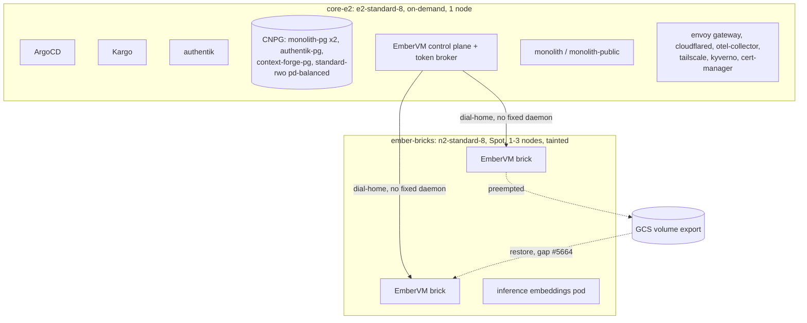

# ADR 016: The GKE Hub Runs Two Node Pools, On-Demand Core Plus Spot Bricks

**Author:** Joe McGinley
**Status:** Accepted
**Created:** 2026-09-05
**Relates to:** [009 - Post-Merge Chart Versioning and Kargo Promotion](009-post-merge-chart-versioning-kargo-promotion.md) (why none of this is a chart or a values file), [embervm/040 - Anchor-Loss Recovery, and Retiring the AWS Preemption Number](../embervm/040-anchor-loss-recovery-preemption-budget-realism.md), the GKE hub program (#4964)

---

## Problem

The GKE hub `homelab-hub` (zonal Standard, `europe-west2-a`) had drifted into
a shape that was both jumpy and expensive at once, and neither property was
buying anything.

Every platform singleton, ArgoCD, Kargo, authentik, the three CNPG clusters,
the EmberVM control plane, was living on Spot capacity in a zone with a real
preemption rate: `gcloud compute operations list --filter
operationType=compute.instances.preempted` showed 4 preemptions on 09-04, 4
on 09-03, 4 on 09-01 against the n2-standard-8 pool, plus roughly 6 more
09-01 to 09-03 on a since-replaced `workload-n2` pool and 5 more 08-29 to
08-31 on the default e2-standard-2 pool that came before that. Every one of
those singletons took a one to three minute blip per preemption while it sat
on Spot: not an outage, but a steady background flicker on the one tier that
should be the most boring part of the cluster.

The response to that flicker had been an `ember-anchor` pool
(`n2d-highmem-8`, on-demand, about $429/mo at London list price), recreated
four times in one day on 2026-09-05 to try to give stateful EmberVM volumes
a non-preemptible home. It never worked: the pool carried
`homelab.io/firecracker=true` and `enableNestedVirtualization: true`, but
the node had no `/dev/kvm`. Google's nested-virtualization support does not
extend to AMD machine types other than N4D, and not to E2 at all, so an
8gi brick replica sat at `Init:0/15` on it for three hours with `FailedMount:
/dev/kvm is not a character device`. Even if that had worked, Firecracker
snapshots are CPU-vendor keyed, so an AMD anchor could never have relit
warmth banked on the Intel-based bricks pool anyway (see EmberVM
`ARCHITECTURE.md` on relight requiring an exact snapshot/volume-generation
pair). The anchor was the most expensive node in the cluster and
structurally incapable of doing the one job it was created for.

So the actual problem was two separate things wearing one symptom: the
platform tier was on the wrong pricing tier for its risk tolerance, and the
attempted fix for EmberVM's stateful gap was targeting a machine family that
cannot run a brick at all.

---

## Decision

Two node pools, both `gcloud`-managed rather than checked into git; this ADR
is the record of the shape, not a chart:

| Pool | Machine | Pricing | Sizing | Labels / taints | Hosts |
| ---- | ------- | ------- | ------ | ---------------- | ----- |
| `core-e2` | `e2-standard-8` | on-demand | fixed at 1 | `homelab.io/core=true` | Every non-brick workload: ArgoCD, Kargo, authentik, the three CNPG clusters (monolith-pg x2 instances, authentik-pg, context-forge-pg, all on `standard-rwo` pd-balanced PVCs), the EmberVM control plane and token broker, monolith and monolith-public, envoy gateway and cloudflared, otel-collector, tailscale, kyverno, cert-manager |
| `ember-bricks` | `n2-standard-8` | Spot | autoscaling 1 to 3 | taint `embervm.jomcgi.dev/node=true`, labels `homelab.io/firecracker=true`, `embervm.io/serving=true`; nested virtualization on | EmberVM bricks and the inference embeddings pod only |

Non-brick footprint measured at decision time was 5.0 vCPU and 18.5 GiB of
requests, comfortably inside one `e2-standard-8`. Brick footprint was 4.1
vCPU and 14 GiB, fitting on one Spot node with headroom for the autoscaler
to add a second or third under load. At London Cloud Billing catalog prices
(USD, 730h): `e2-standard-8` on-demand is $252/mo, `n2-standard-8` Spot is
$70/mo, giving an all-in run rate around $360/mo (core $252, one brick $70,
disks about $40), down from roughly $550/mo with the `ember-anchor` pool
running. N2 Spot in this zone prices at 91% off list, the cheapest compute
available here, so the bricks pool was already the right shape; the money
being wasted was entirely the on-demand anchor.

The core pool is deliberately never given `embervm.io/serving=true`. The
serving-envoy DaemonSet selects on that label, and a serving envoy scheduled
onto a non-brick node crash-loops on its xDS initial-fetch timeout, so
mislabeling the core pool would not add capacity, it would add a crash
loop.

### What this buys, and what it costs

The platform tier stops seeing preemptions at all: `core-e2` is on-demand,
so ArgoCD, Kargo, authentik, and the three CNPG clusters lose the
one-to-three-minute blip they were taking several times a day. That is the
entire point of the change.

What it does not buy is a non-preemptible home for EmberVM's stateful
volumes, because there is no such thing available to buy here: E2 has no
nested virtualization, so the core pool structurally cannot host a brick,
on-demand or not. Stateful EmberVM workloads (demo-postgres today) stay on
Spot bricks and have to recover from their GCS export after a preemption.
That recovery path currently has two open gaps: #5664 (volume restore never
fires after anchor loss) and #5502 (cross-brick relight fails, guest never
comes up over tap on shared-scratch nodes). Until both land, a brick
preemption kills demo-postgres rather than resuming it. A third piece,
draining on the actual 30-second GCE preemption notice rather than a
110-second AWS-shaped number, already landed as #5561 (merged 2026-09-05),
so the notice window itself is now correct; what remains open is what
happens with that window once the drain starts.

This is an explicit acceptance, not an oversight: A1 buys the platform tier
stability today and defers EmberVM's stateful durability to the recovery
work that program already owns, rather than paying $113/mo more to paper
over it with a pool that cannot actually anchor a brick's snapshot lineage
(see Alternatives, A2).

---

## Architecture

---

## Alternatives Considered

- **A2: `n2-standard-8` on-demand core, also anchoring one brick via the
  label-selector brick floors** (`nodeFloors` in `values-gke.yaml`, merged
  2026-09-04). About $475/mo. Would make the stateful demo stable
  immediately, before #5664 or #5502 land. Rejected for now: $113/mo more
  than A1 to mask two bugs the EmberVM-on-Spot roadmap already has to fix,
  and 32 GB is tight for 18.5 GiB of platform load plus an 8gi brick with no
  slack. Recorded as the fallback if #5664 or #5502 stall.
- **B: all Spot, two heterogeneous core nodes** (2x `e2-standard-4` Spot)
  plus bricks, about $205/mo. Rejected: at this zone's preemption rate the
  platform singletons would blip several times a day, the exact problem
  being fixed, and it would need required anti-affinity on monolith-pg plus
  spread rules on cloudflared, envoy, and monolith across several charts to
  even approach today's availability. Least stable of the options
  considered.
- **C: a tiny on-demand seat for a handful of singletons, Spot for
  everything else.** Most placement rules, per chart, for about $120/mo of
  savings over A1. Ranked lowest on complexity per dollar saved and not
  pursued.
- **Keep the `ember-anchor` pool.** Cannot work: no `/dev/kvm` on AMD
  machine types other than N4D, so it can never host a brick, and it was
  also the most expensive shape on the table.

---

## Security

Baseline: `docs/security.md`. No deviation: pool composition does not change
what runs where in terms of trust boundary, only pricing tier and
preemptibility. The CNPG clusters' PVCs stay on `standard-rwo` pd-balanced
regardless of which pool schedules the pod.

---

## Risks

| Risk | Likelihood | Impact | Mitigation |
| ---- | ---------- | ------ | ---------- |
| Brick preemption before #5664 and #5502 land | High (several/day in this zone) | Demo-postgres terminates rather than resumes | Tracked by parent issue #5679 and children #5676-5678; no mitigation on the pool shape itself, the fix is in EmberVM's recovery path |
| Non-brick footprint grows past one `e2-standard-8` | Low today (5.0 vCPU / 18.5 GiB against 8 vCPU / 32 GiB) | Core pool needs resizing or a second node | Watch requests as new platform workloads land; `core-e2` is not autoscaled, so growth needs a manual pool edit |
| A future contributor labels `core-e2` with `embervm.io/serving=true` | Low | Serving envoy DaemonSet schedules there and crash-loops on xDS initial-fetch timeout | Documented here; the label is intentionally absent from the core pool |
| Spot capacity unavailable for `n2-standard-8` in this zone during a demand spike | Low | `ember-bricks` cannot scale past whatever is already running | Autoscaler falls back to Pending rather than falling over; no cross-zone fallback configured |

---

## What Would Make Us Revisit

- **#5664 and #5502 both prove out on Spot.** Then nothing changes: A1 is
  the end state, and the stateful gap was a bug, not a pricing-tier
  requirement.
- **Either #5664 or #5502 stalls past a few weeks.** Move to A2: pay the
  extra $113/mo for an on-demand-anchored brick rather than continuing to
  let the demo die on every preemption.
- **The UK rebuild (#4964) scales the hub's workload pools to zero.** At
  that point `core-e2` becomes the permanent management seat rather than a
  workload host, and should be re-sized down, `e2-standard-4` or smaller,
  since it would no longer be carrying the CNPG clusters or the monolith.

---

## References

| Resource | Relevance |
| -------- | --------- |
| [#5679](https://github.com/jomcgi/homelab/issues/5679) | Parent tracking issue: preemption honesty and resilience on the hub, the A1 follow-through |
| [#5676](https://github.com/jomcgi/homelab/issues/5676) | A brick preemption mid-turn fails the session terminally, answers 502 `retryable:false` |
| [#5677](https://github.com/jomcgi/homelab/issues/5677) | Monolith agent sessions must survive a brick preemption, resume or re-issue the turn |
| [#5678](https://github.com/jomcgi/homelab/issues/5678) | monolith-public demo pages must say a brick was preempted, not show Asleep or a psycopg reset |
| [#5664](https://github.com/jomcgi/homelab/issues/5664) | Volume restore never fires after Spot-node loss; `confirmed_anchor_gone?` gates both paths |
| [#5502](https://github.com/jomcgi/homelab/issues/5502) | Stateful relight fails cross-brick on shared-scratch nodes, guest never ready over tap |
| [#5561](https://github.com/jomcgi/homelab/pull/5561) | Merged 2026-09-05: drain on the actual 30-second GCE preemption notice, not a 110-second AWS-shaped number |
| [#5562](https://github.com/jomcgi/homelab/pull/5562) | ADR embervm/040, anchor-loss recovery and the wrong preemption number (merged 2026-09-05) |
| [#4964](https://github.com/jomcgi/homelab/issues/4964) | GKE permanent management hub program and the UK cloud transition this pool shape sits inside |
| [009 - Post-Merge Chart Versioning and Kargo Promotion](009-post-merge-chart-versioning-kargo-promotion.md) | Why this shape lives in `gcloud`, not a chart: node pools are cluster infrastructure, not a Helm-templated workload |
| EmberVM `ARCHITECTURE.md`, section 4 | "State durability through the latest completed volume export is the guarantee, connection continuity is not"; the spot-semantics contract this decision leaves in place for bricks |
| `docs/security.md` | Baseline; this ADR records no deviation |
