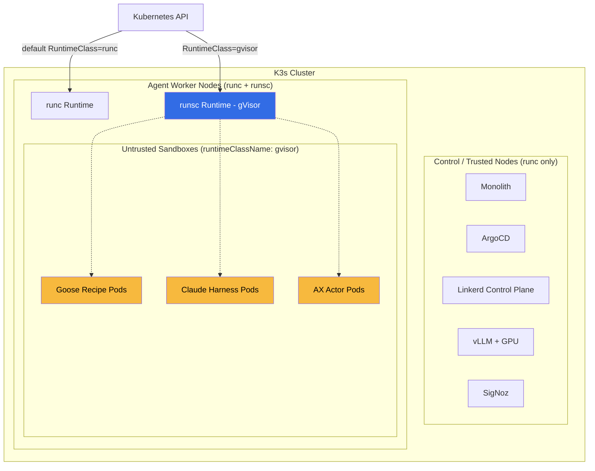

# ADR 003: gVisor RuntimeClass for Agent Sandboxes

**Author:** jomcgi
**Status:** Accepted
**Created:** 2026-05-22

---

## Problem

Agent sandbox pods execute arbitrary code on behalf of LLM-driven agents — Goose recipes, Claude harnesses, and (per [agents/014](../agents/014-ax-substrate-agent-runtime.md)) future AX actors. The current defense-in-depth stack — Cloudflare → Linkerd mTLS → Kyverno admission → non-root + dropped capabilities + `seccompProfile: RuntimeDefault` (`docs/security.md`) — does **not** isolate the host kernel. Every sandbox shares the K3s node's Linux kernel with every other workload, including the monolith, vLLM, knowledge graph, ArgoCD, Linkerd, and SigNoz.

A single kernel CVE reached through a compromised dependency, a poisoned MCP tool response, or a prompt-injection payload that smuggles a syscall sequence is enough to break out of the container and root the node — and from there, the entire cluster. The blast radius does not match the trust level of the workload: untrusted, agent-driven code shares a kernel with the most trusted services in the homelab.

Two pressures sharpen this:

1. Routine-job agents in the monolith (`monolith-agent-*` MCP surface) dispatch agents from cron-style triggers without a human in the loop. The window between "MCP tool returns a malicious payload" and "kernel exploit lands" shrinks to seconds with no checkpoint.
2. The AX/Substrate adoption brings Substrate's `ateom-gvisor` interior helper — it is built on the assumption that agent actors run under gVisor.

We need a second kernel boundary specifically for code paths that execute untrusted input.

---

## Proposal

Adopt [Google's gVisor](https://gvisor.dev/) (`runsc`) as a Kubernetes `RuntimeClass` on the K3s cluster, install `runsc` on a designated subset of agent-worker nodes, and opt sandbox pods into it via `spec.runtimeClassName: gvisor`. The default workload runtime stays `runc` for everything trusted; gVisor is **additive**, not a replacement.

`runsc` is a user-space kernel written in Go that re-implements ~200 Linux syscalls in userland and proxies (or denies) the rest. A container running under `runsc` cannot directly invoke a host kernel syscall — it hits gVisor first, which decides whether to handle it in-userland, forward it through a strictly mediated path, or fail it. The host kernel attack surface visible to the workload shrinks from ~400 syscalls (RuntimeDefault seccomp) to ~50 host syscalls that gVisor itself uses.

| Aspect                 | Today (runc only)                     | Proposed (runc + gvisor)                    |
| ---------------------- | ------------------------------------- | ------------------------------------------- |
| Sandbox kernel         | Host Linux kernel (full surface)      | gVisor user-space kernel (~200 calls)       |
| Container escape blast | Node root → cluster pivot             | gVisor process root → still sandboxed       |
| Syscall filter         | seccomp RuntimeDefault on host kernel | seccomp + userland reimplementation         |
| Workload opt-in        | Implicit (everyone shares runc)       | Explicit (`runtimeClassName: gvisor`)       |
| Compatible workloads   | All                                   | Most; GPU + some kernel-tight code excluded |
| Perf overhead          | None                                  | ~5–15% syscall, ~10–30% network             |

The agent-sandbox CRD set already exposes `runtimeClassName` in the pod spec (`projects/agent_platform/chart/agent-sandbox/crds/crds.yaml`), so the opt-in surface for sandboxes is a values-file change, not a chart change.

---

## Architecture



### Why K3s makes this cheap

`projects/platform/nvidia-gpu-operator/values.yaml` already demonstrates that K3s containerd is template-customizable at `/var/lib/rancher/k3s/agent/etc/containerd/config.toml.tmpl`. Adding gVisor is a `runsc` binary on the node, a containerd runtime stanza, and a `RuntimeClass` CR — no kernel modules, no distro extension build, no host modification beyond what the GPU operator already does.

### What runs where, and why

| Workload                                | Node class    | Runtime   | Reason                                                                     |
| --------------------------------------- | ------------- | --------- | -------------------------------------------------------------------------- |
| Monolith, ArgoCD, Linkerd, SigNoz, etc. | trusted       | runc      | Operator-controlled, no untrusted input execution; perf + privileged needs |
| vLLM, inference, embedding              | trusted (GPU) | runc      | Needs `/dev/nvidia*` mmap — gVisor cannot proxy GPU device files           |
| Goose recipe sandboxes                  | agent-worker  | **runsc** | Executes code from LLM-generated outputs                                   |
| Claude agent harness pods               | agent-worker  | **runsc** | Same                                                                       |
| AX actor pods                           | agent-worker  | **runsc** | Substrate's `ateom-gvisor` assumes gVisor; required by ADR 014             |
| MCP servers (Context Forge backends)    | trusted       | runc      | Trusted code path; tool _outputs_ are untrusted, execution is not          |

The agent-worker node class is enforced via a `node-role: agent-worker` label, an `agent-only=true:NoSchedule` taint, and a Kyverno policy requiring `runtimeClassName: gvisor` for any pod scheduling there.

---

## Security

This ADR adds a layer to the model in `docs/security.md`; it does not change anything else. After implementation, Layer 4 (Runtime Security) gains:

```
Layer 4: Runtime Security (existing)
  - readOnlyRootFilesystem, runAsNonRoot, capabilities.drop, seccompProfile
  + RuntimeClass: gvisor    ← NEW for agent-worker workloads
```

What gVisor adds:

- **Host kernel CVE protection.** A kernel exploit that would compromise the node via a sandbox now compromises the gVisor process, which is itself a non-root, dropped-capabilities, seccomp-filtered userspace process. The attacker must chain a gVisor escape _with_ a kernel CVE.
- **Tighter syscall mediation.** Where seccomp denies a syscall, gVisor reimplements it in userland. Same denial of host kernel reach, fewer compatibility breaks.
- **No new secret surface.** gVisor introduces no new auth boundaries or credentials.

What gVisor does **not** protect:

- Network-level pivots (covered by Linkerd authz policies)
- LLM prompt injection using _legitimate_ tool calls maliciously (covered by RBAC on MCP, ADR 005)
- Filesystem persistence attacks (covered by ephemeral PVCs in SandboxTemplate)
- Resource exhaustion (covered by ResourceQuota on the namespace)

---

## Risks

| Risk                                                                                                                   | Likelihood | Impact | Mitigation                                                                                                                             |
| ---------------------------------------------------------------------------------------------------------------------- | ---------- | ------ | -------------------------------------------------------------------------------------------------------------------------------------- |
| Goose recipes fail under runsc (filesystem, /proc, network quirks)                                                     | Medium     | Medium | Patch the recipe; if genuinely incompatible, allowlist with explicit justification in `docs/security.md`                               |
| Network throughput drop hurts MCP latency                                                                              | Medium     | Low    | gVisor netstack is actively improving; per-pod opt-out with `--network=host` available but must be justified                           |
| gVisor escape CVE (Google does patch these — see [GHSA history](https://github.com/google/gvisor/security/advisories)) | Low        | High   | Renovate-tracked upgrades, gvisor-security mailing list subscription; combined with seccomp so an escape still hits RuntimeDefault     |
| K3s containerd config drift across nodes                                                                               | Medium     | Medium | Bake the config template into K3s install scaffolding (precedent: nvidia-gpu-operator)                                                 |
| Operational complexity of two runtimes                                                                                 | Low        | Low    | Default stays runc; agent-worker taint + Kyverno admission make the boundary explicit                                                  |
| GPU-using agent workloads cannot use gvisor                                                                            | High       | Low    | Documented exclusion; inference + image gen stay on runc (they're trusted code paths with untrusted _inputs_ — the model can't escape) |

---

## Open Questions

1. Should `agent-worker` be a separate physical node or a labeled subset? Physical separation is the strongest isolation; labels save hardware but lean on scheduler discipline under pressure.
2. `--platform=systrap` (default, most compatible) or `--platform=kvm` (faster, needs nested virt + CPU VMX)? Measure on the actual hardware.
3. Where do `goose_agent` image builds run? `apko` build steps are syscall-heavy; build pods may stay on runc while execution of the built image runs on runsc.

---

## References

| Resource                                                                                                                          | Relevance                                                             |
| --------------------------------------------------------------------------------------------------------------------------------- | --------------------------------------------------------------------- |
| [gVisor architecture](https://gvisor.dev/docs/architecture_guide/)                                                                | How runsc reimplements syscalls in userspace                          |
| [gVisor + K3s walkthrough](https://docs.k3s.io/advanced#additional-preparation-for-k3s)                                           | K3s containerd template extension pattern                             |
| [Kubernetes RuntimeClass](https://kubernetes.io/docs/concepts/containers/runtime-class/)                                          | The opt-in mechanism                                                  |
| [gVisor compatibility docs](https://gvisor.dev/docs/user_guide/compatibility/)                                                    | Known incompatibilities to check Goose recipes against                |
| [docs/security.md](../../security.md)                                                                                             | Defense-in-depth model this ADR extends                               |
| [agents/014: AX + Substrate](../agents/014-ax-substrate-agent-runtime.md)                                                         | Depends on this ADR; Substrate's `ateom-gvisor` assumes runsc is live |
| [projects/agent_platform/chart/agent-sandbox/crds/crds.yaml](../../../projects/agent_platform/chart/agent-sandbox/crds/crds.yaml) | `runtimeClassName` field already present in CRD schema                |
| [projects/platform/nvidia-gpu-operator/values.yaml](../../../projects/platform/nvidia-gpu-operator/values.yaml)                   | Precedent for K3s containerd template customization                   |
