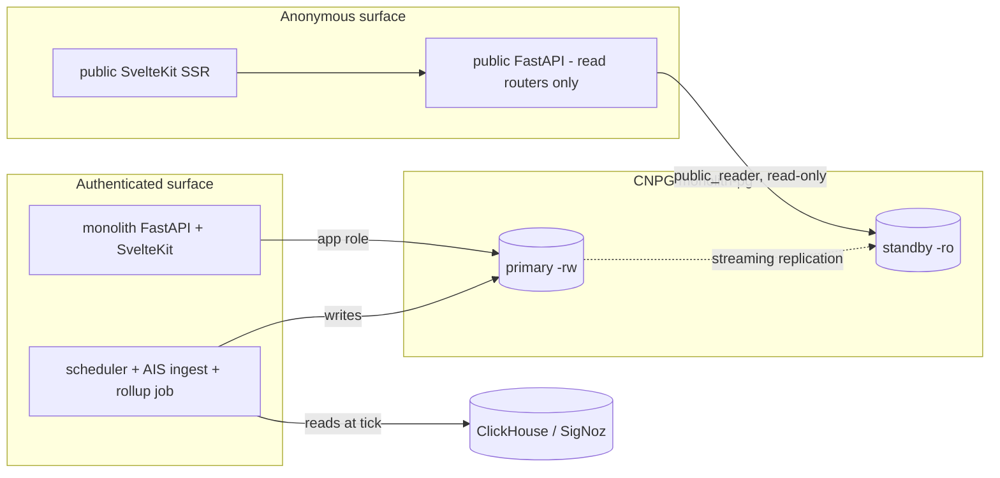
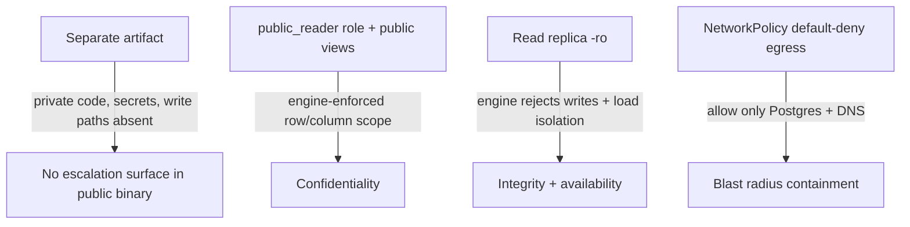
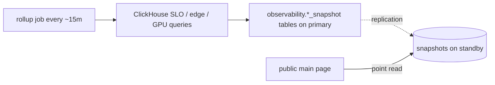

# ADR 004: Public Read-Only Service Isolation

**Author:** Joe McGinley
**Status:** Accepted
**Created:** 2026-06-14
**Accepted:** 2026-06-18
**Relates to:** [ADR 001: Cloudflare + Envoy Gateway](../../../projects/platform/ARCHITECTURE.md), [ADR 002: Path-Based Ingress Tiers](../../../projects/platform/ARCHITECTURE.md)

---

## Problem

The monolith's anonymous, internet-facing surface shares a process, a pod, and full backend credentials with the private application. The separation between "public" and "private" exists only at the ingress layer, so a compromise of the public SSR surface escalates to the entire backend.

Concretely:

1. **Frontend and backend share one pod.** The SvelteKit SSR frontend reaches the FastAPI backend over `localhost:8000`. Both `public.jomcgi.dev` and `private.jomcgi.dev` route to the same pod and the same backend process.
2. **Public/private separation is only enforced at ingress.** The public HTTPRoute scopes the public hostname to `/api/knowledge/public`, and the backend applies a `visibility='public'` filter. Neither control exists below the routing layer: any process inside the pod can call the full, unfiltered backend API on `localhost:8000`, bypassing the ingress path scoping entirely.
3. **The shared pod holds high-value secrets.** `DATABASE_URL`, `DISCORD_BOT_TOKEN`, `GITHUB_TOKEN`, `CLAUDE_CODE_OAUTH_TOKEN`, `AISSTREAM_API_KEY`, and the `VAULT_*` credentials all live in the backend container. An RCE in the internet-facing SSR runtime (for example via a Node supply-chain compromise) inherits all of them.
4. **No NetworkPolicy on the monolith namespace.** `agent_platform`, `grimoire`, and `mcp` ship default-deny NetworkPolicies; `monolith` does not. A compromised monolith pod has unrestricted cluster egress, reaching the Kubernetes API, other namespaces, and the internet.
5. **The public hot path queries ClickHouse at request time.** The public main page's topology and stats/SLO tiles run synchronous ClickHouse queries, throttled by an `asyncio.Semaphore(2)`. This couples the anonymous read path to ClickHouse and prevents the public path from scaling horizontally.

The internet-facing surface is qualitatively the highest-risk part of the system (anonymous, server-side runtime, broad dependency tree) and is currently the least isolated.

The change is feasible because the public surface is small and read-only. An inventory of the backend confirms:

- **11 public endpoints, all GET, all read-only at request time:** hikes (`/walks`, `/walks/{uuid}`), ships (`/snapshot`, `/track/{mmsi}`, `/heat`), stars (`/sites`, `/history`), public knowledge (`/public/graph`, `/public/notes/{id}`), home/observability (`/topology`, `/stats`), plus `sitemap.xml` / `robots.txt` / `llms.txt`.
- **All public datasets are written by scheduler jobs and the AIS ingest listener that live in the private monolith,** never by request handlers. The writer stays private; the public surface is a pure reader.
- **Public knowledge visibility is a single SQL predicate** (`visibility='public'`, set by the gardener).

---

## Decision

Split the public surface into a separate, purpose-built read-only service whose entire dependency set is a Postgres read replica. Isolation becomes a property of the artifact and of database permissions, not a runtime configuration that can be set wrong.

Four layers, each enforcing a distinct boundary:

**1. Separate composition, not feature flags.** A new FastAPI entrypoint (`app/main_public.py`) mounts only the read routers (hikes, ships, stars, public-knowledge, home/observability). The private routers (knowledge CRUD, tasks, gaps, chat, scheduler, ingest) are not imported, so they are absent from the binary. The public frontend is a separate SvelteKit app serving only the public routes. Shared logic and components are reused via imports, but the two services are composed and shipped as separate container images. There is no "public mode" flag to misconfigure: the private code, write paths, and secrets are simply not present in the public artifact.

**2. Confidentiality boundary = read-only role plus public views.** A `public_reader` Postgres role with read-only grants on the public surface (the `hikes`, `ships`, `stars` schemas and a `knowledge_public` view over `visibility='public'`) is defined in a migration on the primary, so it replicates to the standby. The public service connects as `public_reader`. Even an RCE in the public process cannot write and cannot read private rows, by database permission rather than application logic.

**3. Load and availability boundary = read replica.** The CNPG cluster moves to `instances: 2`. The public service reads from the `monolith-pg-ro` service; the private app and the scheduler use `-rw` (the primary). Heavy scheduler and AIS-ingest write load is isolated from public reads, and the cluster gains a hot standby.

**4. Decouple the public path from ClickHouse via a rollup job.** A scheduled job on the private monolith (every ~15 minutes, matching the current topology cache TTL) runs the ClickHouse SLO, Linkerd edge, and GPU queries and writes precomputed snapshots into Postgres (`observability.node_slo_snapshot`, `observability.edge_linkerd_snapshot`, `observability.gpu_snapshot`). Those tables live on the primary and replicate to the standby; the public service reads them from the replica. The public artifact drops `CLICKHOUSE_URL` / `CLICKHOUSE_USER` / `CLICKHOUSE_PASSWORD` and the ClickHouse client entirely, and the request-time ClickHouse fan-out plus the `Semaphore(2)` bottleneck leaves the public hot path.

**Postgres is authoritative for served note content.** The public read path reads note bodies from Postgres, never the Vault filesystem. The gardener continues reconciling the git-backed Vault into Postgres; this records Postgres as authoritative for _served_ content, not a full inversion that demotes the Vault as the editing source of truth. With this resolved, the public service's entire dependency set is the read replica.

### The critical distinction: the replica is not a confidentiality boundary

A CNPG streaming replica is a physical, byte-for-byte copy of the primary. It contains every row of every database, including private knowledge notes, Temporal, and the lakehouse. Pointing the public service at the replica provides **zero** row-level isolation on its own.

- The **replica** provides write-impossibility (a standby rejects writes at the engine level) and load/availability isolation.
- The **read-only role plus public views** provide confidentiality (which rows and columns are visible).

Both controls are required and do different jobs. Layer 3 must never be mistaken for Layer 2.

### Before / After

| Aspect                  | Today                                       | Decided                                       |
| ----------------------- | ------------------------------------------- | --------------------------------------------- |
| Public process          | Shares pod and backend with private app     | Separate service, own image                   |
| Public code surface     | Full backend present on `localhost:8000`    | Only read routers compiled in                 |
| Public/private boundary | Ingress path match + backend filter         | Separate artifact + DB role/views             |
| Public DB access        | Same role as private (read/write, all rows) | `public_reader`, read-only, public views only |
| Public secrets          | Inherits all backend secrets                | None                                          |
| Public data source      | Primary, ClickHouse at request time         | Read replica only                             |
| SLO/stats tiles         | Request-time ClickHouse, `Semaphore(2)`     | Precomputed snapshots read from replica       |
| Scheduler write impact  | Shares primary with public reads            | Isolated to primary; public reads standby     |

---

## Architecture

### Service topology

### Boundaries and what enforces them

### SLO rollup data flow

The request-time ClickHouse dependency moves to a scheduled writer on the private side:

---

## Alternatives Considered

- **Feature-flagged single image ("public mode").** Rejected: the private routers and secret references still ship in the artifact, so the isolation is a runtime config that can be set wrong. Separation of artifacts removes the failure mode entirely.
- **Frontend/backend split within one tier (four pods).** Rejected as the primary mechanism: NetworkPolicy is L3/L4 and cannot enforce "public may only call public endpoints" (that is L7). Splitting frontend from backend adds machinery without delivering the path-level guarantee; reduced DB privilege on a separate public service delivers it directly.
- **Replica as the confidentiality boundary (no read-only role).** Rejected: a physical standby replicates all rows of all databases, so it does not scope visibility. The role plus views are required regardless of the replica.
- **Keep ClickHouse on the public path.** Rejected: it couples the anonymous surface to ClickHouse credentials and the `Semaphore(2)` bottleneck, and expands the public dependency set beyond the replica.
- **Separate datastore for public (logical replica / dedicated DB).** Deferred: a shared CNPG standby with a read-only role is simpler and sufficient. A dedicated datastore only adds value if public must survive the primary database being down, which is not a current requirement.

---

## Security

Builds on the `docs/security.md` baseline (Cloudflare Tunnel perimeter, Linkerd mTLS, non-root hardened pods). This ADR tightens the runtime and secret-management layers for the highest-risk surface. Deviations and additions:

- **Least privilege at the credential layer.** The public service holds no application secrets and a read-only, view-scoped database role. This is stronger than the current model, where the public surface shares the full backend credential set.
- **NetworkPolicy gap closed.** Add a default-deny NetworkPolicy (egress restricted to Postgres and DNS) to the public service's namespace, and to the monolith namespace, which currently has none. This contains the blast radius of a pod compromise.
- **`readOnlyRootFilesystem` drift.** `docs/security.md` states a read-only root filesystem is enforced on every pod, but the monolith chart does not set it. Set `readOnlyRootFilesystem: true` on the public (and monolith) containers, with an `emptyDir` at `/tmp` for the Node runtime, and reconcile the doc with the chart.
- **Cache-Control on SSR responses.** Ensure dynamic and per-user SSR responses are not cached by the Cloudflare CDN.

---

## Risks

| Risk                                                                             | Likelihood | Impact | Mitigation                                                                                                                                                                 |
| -------------------------------------------------------------------------------- | ---------- | ------ | -------------------------------------------------------------------------------------------------------------------------------------------------------------------------- |
| Replica mistaken for a confidentiality boundary                                  | Medium     | High   | This ADR documents the distinction; the `public_reader` role plus public views are the confidentiality control and are mandatory independent of the replica                |
| Second CNPG instance pressures a memory-tight node (1Gi limit, prior OOMKills)   | Medium     | High   | Verify node memory headroom before `instances: 2`; the replica duplicates all five databases' storage, so confirm storage budget too                                       |
| Replication lag serves stale public reads                                        | High       | Low    | Public data is eventually-consistent by nature (hikes/ships/stars/notes); acceptable. Never point private read-your-writes paths at the standby                            |
| Public view drifts from the real `visibility` semantics                          | Low        | High   | Define `knowledge_public` in a primary migration alongside the gardener's visibility logic; cover with a test asserting private rows are not selectable as `public_reader` |
| SLO rollup job lag leaves the main page stale                                    | Low        | Low    | 15-minute cadence matches today's cache TTL; the page already tolerates 15-minute-old topology                                                                             |
| Shared-code refactor accidentally pulls private modules into the public artifact | Medium     | High   | Public entrypoint imports only read routers; add a build/import check (or test) asserting private modules are absent from `main_public`                                    |

---

## Open Questions

1. **Replica sequencing.** The read replica (Layer 3) is decided, but the cutover order relative to the service split and the node-capacity check is an implementation detail for the plan. The split plus `public_reader` role can land against the primary first, with the public service repointed to `-ro` once the standby is healthy.
2. **NetworkPolicy egress allow-list scope.** Final set of allowed egress targets for the public namespace (Postgres `-ro` and DNS are certain; confirm nothing else, for example OTEL export, is required from the public service).

---

## References

| Resource                                                                                                      | Relevance                                                  |
| ------------------------------------------------------------------------------------------------------------- | ---------------------------------------------------------- |
| [ADR 001: Cloudflare + Envoy Gateway](../../../projects/platform/ARCHITECTURE.md)                          | Ingress foundation this isolation sits behind              |
| [ADR 002: Path-Based Ingress Tiers](../../../projects/platform/ARCHITECTURE.md)                            | Public/private tier model and hostname scheme              |
| [ADR 001: Obsidian Vault to Monolith Migration](../platform/001-obsidian-vault-monolith-migration.md)         | Context for Postgres as the served-content store for notes |
| [ADR 006: Obsidian Decommission, Postgres Interim](../platform/006-obsidian-decommission-postgres-interim.md) | Context for Postgres authority over note content           |
| [CloudNativePG replicas and `-ro` service](https://cloudnative-pg.io/documentation/current/replica_cluster/)  | Streaming standby and read-only service endpoint behavior  |
| `docs/security.md`                                                                                            | Defense-in-depth baseline this ADR extends                 |
