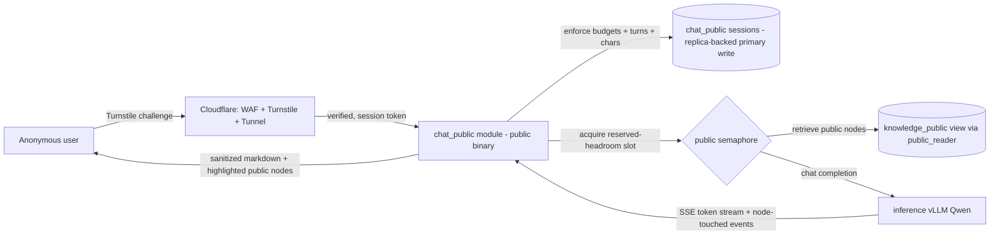
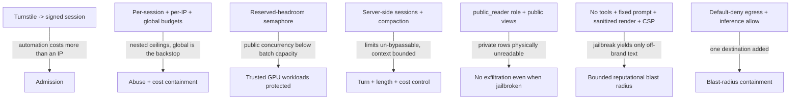
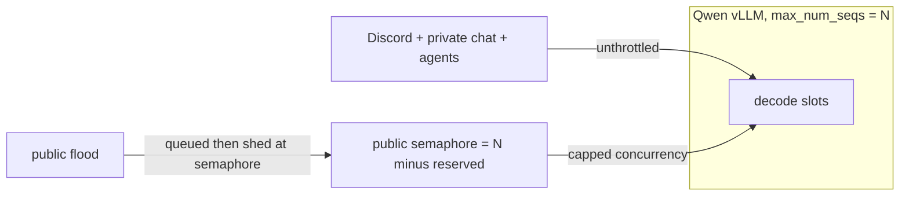

# ADR 005: Public Chat Adversarial Hardening

**Author:** Joe McGinley
**Status:** Draft
**Created:** 2026-06-16
**Relates to:** [ADR 004: Public Read-Only Service Isolation](004-public-read-only-service-isolation.md), [ADR 010: FastMonolith Modular Framework](../services/010-fastmonolith-modular-framework.md), [ADR 002: Path-Based Ingress Tiers](../networking/002-path-based-ingress-tiers.md)

---

## Problem

The public surface is gaining a chat: the landing page of the public notes app is a neo-brutalist chat box, and a user can deep-dive into the knowledge graph as an overlay that highlights the public nodes a conversation touched and expands their content. The chat is backed by the in-cluster Qwen model (vLLM, OpenAI-compatible at `inference.inference.svc.cluster.local:8080`). This is V3 of the public-notes plan (`docs/plans/2026-05-07-public-notes-visibility-design.md`), which deferred it precisely because it changes the risk profile.

A public, anonymous, internet-facing endpoint that spends GPU on demand is a qualitatively different surface from the read-only JSON endpoints ADR 004 isolated. Every other public route is a cheap point read against a replica. Chat is expensive, stateful, generative, and adversarial by default. The specific threats:

1. **GPU exhaustion (the headline availability threat).** The Qwen vLLM runs on a single 24GB GPU with `max_num_seqs` of 3, and it is *shared*: the Discord bot, the private `/explore` chat, and the agent platform all call the same endpoint. An anonymous flood of long, max-token public requests can saturate the decode slots and starve those trusted workloads. The public surface must never be able to degrade the private one.
2. **Compute and token amplification.** Short of full denial of service, an attacker can burn GPU-seconds: maximal prompts, forced max-output-tokens, many turns, many parallel sessions. The requested "generous character limit and max turns" multiplies the per-conversation cost ceiling, so it has to be bounded explicitly rather than left open.
3. **Data exfiltration through retrieval.** The chat grounds on the knowledge graph. If retrieval can reach private notes, it leaks the exact PII (colleagues, employers, job search, personal life) that the visibility work exists to protect. Confinement to the public subset must be a database property, not a prompt instruction.
4. **Prompt injection and jailbreak.** A user will try to override the system prompt, extract it, impersonate, or coax reputationally or legally damaging output attributable to the site. We cannot prevent a determined user from making a text model say off-brand things; we can bound the blast radius so that saying them achieves nothing privileged.
5. **Automation and identity-rotation abuse.** Per-IP limits alone are weak: carrier-grade NAT shares one IP across many users, and proxies/residential pools rotate IPs faster than any per-IP budget. The endpoint needs an identity that is costlier to forge than an IP.
6. **A new egress path out of the isolated public service.** ADR 004 gives the public binary a default-deny egress NetworkPolicy (Postgres read replica plus DNS only). Chat punches a hole to the inference service. That hole must be exactly one destination, or an RCE in the public path regains cluster reach.
7. **Untrusted generative output rendered in a rich overlay.** The overlay renders model output and note bodies. Model output is untrusted; rendered as raw HTML it is stored/reflected XSS.
8. **A growing store of anonymous user-submitted content.** Persisting transcripts (the chosen retention posture) accumulates content we did not author, including potential PII and abusive material, which carries privacy and legal-takedown obligations.

The decision is *not* whether to expose chat (V3 is committed) but the control stack that makes an anonymous, GPU-backed, RAG-grounded endpoint safe to operate.

---

## Decision

Ship public chat as a new **PUBLIC-tier domain module** (`chat_public`) composed into the public binary per [ADR 010](../services/010-fastmonolith-modular-framework.md), distinct from the existing private `chat` domain, behind the public ingress tier ([ADR 002](../networking/002-path-based-ingress-tiers.md)). Wrap it in a defense-in-depth stack where every limit is enforced by a mechanism the client cannot edit, and where the failure of any single control still bounds the damage. Eight layers, each owning one threat:

**1. Admission: Turnstile mints a session, the session is the identity.** A Cloudflare Turnstile challenge on first interaction mints a short-lived, server-signed session token bound to a server-side session row. No valid token, no inference. The session, not the IP, is the unit every budget is charged against. This raises the cost of automation above the cost of an IP and gives slow-drip and NAT-shared abuse a stable handle. Turnstile fits because the surface is already behind Cloudflare, and the neo-brutalist landing can style the challenge as a deliberate "start chatting" gate.

**2. Budgets: per-session, per-IP, and a global ceiling.** Three nested limits. Per-session: max turns, a generous per-message character cap, a max output-tokens-per-turn, and a max total-tokens-per-session. Per-IP: Envoy local rate limiting (existing) plus a backend counter, so one IP cannot mint sessions without bound. Global: a cluster-wide token/concurrency budget for the entire public chat surface, a circuit breaker so that even a coordinated swarm of solved challenges cannot exceed an aggregate ceiling. The global budget is the backstop that holds when layers 1 and 2 are partially defeated.

**3. GPU isolation: a reserved-headroom semaphore.** Public chat acquires a slot from a bounded concurrency semaphore sized *below* the vLLM batch capacity, deliberately reserving decode slots for the Discord bot, private chat, and the agent platform. Sizing rule: `public_concurrency + reserved_trusted_headroom <= max_num_seqs`. When the public semaphore is full, public requests queue briefly (bounded) and then shed load with a friendly "busy" state, and they never block a trusted caller. This is a client-side admission control in front of vLLM's own scheduler, defense in depth: even if the public surface is flooded, trusted workloads keep their reserved slots. A dedicated public model was considered and rejected (see Alternatives); the semaphore is simpler and sufficient until contention is observed.

**4. Server-side conversation state and compaction.** The session row holds the conversation; the client sends only a session token and the new message, never history. The server enforces max turns and the character cap authoritatively, and runs compaction: when the running context approaches a token budget, older turns are summarized into a rolling summary (reusing the existing `chat/summarizer.py` pattern) so the live context stays bounded turn over turn. Compaction is what keeps per-request GPU cost flat as a conversation grows, and server-authoritative history is what makes the turn and length limits un-bypassable. A client that forges or replays history achieves nothing because the server ignores client-supplied history entirely.

**5. Retrieval confined to the public subset by the database.** Grounding retrieval runs only over the public knowledge graph, the same `COALESCE(visibility,'private')='public'` predicate the public read endpoints use, enforced by the `public_reader` role and public views from ADR 004 / ADR 010, never by a sentence in the system prompt. The overlay's "nodes your chat touched" set *is* the set of public nodes retrieved. Private notes are physically unreadable by the public binary's role, so a perfect jailbreak still cannot surface one. Retrieved note text is injected as clearly delimited data, never as instructions, and the model has no tools, so retrieved content cannot act.

**6. Output posture: low blast radius, not prompt-based defense.** The system prompt is fixed server-side, the model is text-in/text-out with no tools and no function-calling, and it can reach nothing private. We explicitly do **not** treat prompt instructions as a security boundary. Jailbreak resistance is structural: a fully jailbroken model can emit off-brand text and nothing else. Residual reputational risk is mitigated by a constrained, clearly-scoped persona, transcript review with purge, and an optional lightweight content filter, not by trying to win the prompt-injection arms race.

**7. Egress containment: exactly one new hole.** ADR 004's default-deny egress NetworkPolicy on the public binary's namespace gains exactly one rule: egress to the `inference` service (and, if retrieval needs it, `inference-embeddings`) on its port. Postgres read replica and DNS remain the only other destinations. An RCE in the public chat path reaches the read replica (public rows only) and the inference endpoint, and nothing else in the cluster.

**8. Rendering and retention.** The overlay renders model output and note bodies as sanitized markdown with a strict CSP, never raw HTML, closing the XSS path on untrusted generative output. Transcripts are persisted in a public-tier `chat_public` schema keyed by session, with a hashed IP/Turnstile correlate for abuse review. Because indefinite retention of anonymous user content is a liability, a purge mechanism is mandatory and ships with the feature: a scheduled retention/purge job, an on-demand takedown by session or IP-hash, and a documented retention policy. Retention without a purge path is not an option.

### Before / After

| Aspect | A public read endpoint today | Public chat (decided) |
| ------ | ---------------------------- | --------------------- |
| Cost per request | One indexed point read on a replica | GPU inference, bounded by semaphore + budgets |
| Identity | None needed (cacheable) | Turnstile-minted server-signed session |
| Abuse limit | Envoy per-IP rate limit | Per-session + per-IP + global ceiling |
| GPU sharing | N/A | Reserved-headroom semaphore, trusted slots protected |
| State | Stateless | Server-side session, compaction, server-authoritative limits |
| Data scope | `public` view via `public_reader` | Same view via `public_reader`; retrieval cannot see private |
| Model authority | N/A | No tools, text-only, fixed server-side prompt |
| Egress | Postgres `-ro` + DNS | Adds inference service only |
| Output handling | JSON | Sanitized markdown + CSP in the overlay |
| User content | None stored | Transcripts persisted with mandatory purge tooling |

---

## Architecture

### Request flow

### Control layering and what enforces each

### GPU reservation

The semaphore lives in the `chat_public` module and limits how many public requests are in flight to vLLM at once, leaving the remaining batch slots for trusted callers. It is admission control on the public client side, complementary to vLLM's internal scheduler.

---

## Alternatives Considered

- **Dedicated smaller model for public chat.** Rejected for now: full GPU blast-radius isolation, but it needs more VRAM or a second node and doubles model ops. The reserved-headroom semaphore on the shared endpoint gives availability isolation for trusted workloads at near-zero cost. Revisit only if measured contention shows the semaphore starving public users or failing to protect trusted ones.
- **Share the inference endpoint with no reservation, rate limits only.** Rejected: a public spike degrades the Discord bot, private chat, and agents directly. The whole point of the public/private split is that public cannot harm private.
- **IP-only rate limiting, no Turnstile.** Rejected: NAT-shared IPs punish legitimate users while rotation defeats the limit for attackers. An anonymous generative endpoint needs an identity costlier than an IP.
- **Stateless, client-supplied conversation history.** Rejected: every limit (turns, length, total tokens) would be re-validated against an untrusted payload each turn, context could not be bounded, and max-turns could be replayed around. Server-side sessions make the limits authoritative and compaction possible.
- **Prompt-instruction data protection ("never reveal private notes").** Rejected as a boundary: prompt instructions are not a security control. The `public_reader` role plus public views make private rows physically unreadable, which holds under any jailbreak.
- **Put public chat in the private monolith behind a filter.** Rejected: it is the highest-risk anonymous surface and must live in the isolated public binary (ADR 004 / ADR 010), never co-resident with secrets and write paths.
- **Ephemeral transcripts (no persistence).** Rejected by the chosen retention posture: transcripts are kept for abuse forensics and tuning, but the liability of indefinite anonymous storage is answered by mandatory purge tooling rather than by not storing at all.
- **vLLM server-side priority/QoS scheduling instead of a client semaphore.** Deferred: a client-side reserved-headroom cap is entirely within our control and simple to reason about. Revisit if finer-grained QoS between trusted callers becomes necessary.

---

## Security

Builds on the `docs/security.md` baseline (Cloudflare Tunnel perimeter, Linkerd mTLS, non-root hardened pods) and inherits ADR 004's four-layer isolation and ADR 010's per-domain data and build boundaries. This ADR adds the controls specific to an anonymous, GPU-backed, generative surface. Deviations and additions:

- **New anonymous compute surface.** Unlike every other public route, chat spends GPU per request. The reserved-headroom semaphore plus the three-tier budget plus the global ceiling are the controls that keep that spend bounded and keep trusted workloads whole.
- **One new egress destination.** The default-deny egress policy from ADR 004 is extended with a single allow to the inference service (and embeddings if used). This is the only widening of the public binary's egress and must be reviewed as such.
- **No new secrets in the public binary.** The Turnstile *secret* key (server-side verification) is the one credential the public chat path needs; it is delivered via 1Password (`OnePasswordItem`) and is scoped to Turnstile verification only, not a backend or model credential. The Turnstile *site* key is public by design.
- **Confidentiality stays database-enforced.** Retrieval uses `public_reader` and the public view; the model has no path to private rows. This is consistent with ADR 004 and ADR 010 and is not weakened by any prompt content.
- **Untrusted output is sanitized.** Model output and note bodies render as sanitized markdown under a strict CSP. No raw HTML from model output reaches the DOM.
- **Anonymous user content is governed.** Persisted transcripts get a stated retention policy, a scheduled purge job, and an on-demand takedown path for abuse and legal requests. Access to the transcript store is private-tier only.

---

## Risks

| Risk | Likelihood | Impact | Mitigation |
| ---- | ---------- | ------ | ---------- |
| Semaphore mis-sized, public traffic still starves trusted workloads | Medium | High | Size conservatively below `max_num_seqs`; alert on public queue depth and on trusted-caller inference latency; load test the reservation before launch |
| Turnstile defeated by solver farms / token replay | Medium | Medium | Tokens short-lived and server-signed, bound to a session; per-session and global budgets cap damage even with valid tokens; monitor solve-to-abuse ratio |
| Jailbreak produces reputationally damaging output | High | Medium | Blast radius is structurally low (no tools, no private data); constrained persona; sanitized render; transcript review + purge; optional content filter; accept residual |
| Retrieval leaks a private note | Low | High | `public_reader` role + public view make private rows physically unreadable; cover with a test asserting a private note is not retrievable as `public_reader`; same guarantee as ADR 004 |
| Indirect injection embedded in note content steers the model | Low | Low | Notes are Joe's own public notes; retrieved text is delimited data, the model has no tools, so a steered model still cannot act |
| Transcript store accumulates PII / abusive content (indefinite retention) | High | Medium | Mandatory purge job + on-demand takedown by session/IP-hash + documented policy + private-tier-only access; ship purge tooling with the feature, not after |
| XSS via model output rendered in the overlay | Medium | High | Sanitized markdown only, strict CSP, no raw HTML from model output; cover the renderer with injection test cases |
| Compaction summarization adds its own GPU load | Medium | Low | Summaries run under the same semaphore and budget; cap summary frequency; a summary is far cheaper than an unbounded growing context |
| Embeddings GPU contention from public retrieval | Medium | Medium | Apply the reserved-headroom treatment to `inference-embeddings` too, or cache/precompute public-note embeddings so retrieval is a vector read, not a GPU call |
| Global ceiling set so low it blocks legitimate use, or so high it permits abuse | Medium | Medium | Start conservative, expose budget counters in dashboards, tune from real traffic; budgets are config, not code |

---

## Open Questions

1. **Budget values.** Concrete numbers for the character cap, max turns, per-turn and per-session token ceilings, semaphore size, and the global ceiling are tuning parameters resolved in the plan and a pre-launch load test, not in this ADR.
2. **Content moderation pass.** Whether to add a lightweight model-based or heuristic content filter on input and/or output, or to rely solely on the low blast radius plus transcript review. Lean to none at launch, reconsider from observed transcripts.
3. **Embeddings strategy.** Whether public-note embeddings are precomputed and cached (retrieval becomes a pure vector read, no GPU at request time) or computed live under the semaphore. Precompute is the likely answer given the public set is small and changes slowly.
4. **Retention policy specifics.** Default TTL (if any beyond on-demand purge), the takedown process, and the public-facing notice wording.
5. **Overlay node-touched transport.** Whether to reuse the existing `node_discovered` SSE event from the private `/explore` path to stream highlighted public nodes, or compute the touched set post-hoc.
6. **Session storage backend.** Whether sessions and budget counters live in Postgres (durable, simplest given the read replica is already there) or a faster store; Postgres is the default unless latency demands otherwise.

---

## References

| Resource | Relevance |
| -------- | --------- |
| [ADR 004: Public Read-Only Service Isolation](004-public-read-only-service-isolation.md) | The isolated public service this chat module is composed into; source of `public_reader`, public views, replica, and default-deny egress |
| [ADR 010: FastMonolith Modular Framework](../services/010-fastmonolith-modular-framework.md) | The module/tier/profile mechanism that makes `chat_public` a PUBLIC-tier module composed into the public binary, with private code physically absent |
| [ADR 002: Path-Based Ingress Tiers](../networking/002-path-based-ingress-tiers.md) | Public hostname and tier the chat sits behind |
| `docs/plans/2026-05-07-public-notes-visibility-design.md` | V1/V2 visibility work; this is the deferred V3 chat surface |
| `docs/plans/2026-06-16-public-chat-v3-plan.md` | Implementation plan for this decision |
| `projects/agent_platform/inference/deploy/values-prod.yaml` | The shared Qwen vLLM the semaphore reserves headroom against |
| `projects/monolith/chat/summarizer.py` | Existing rolling-summary pattern reused for compaction |
| [Cloudflare Turnstile](https://developers.cloudflare.com/turnstile/) | The admission challenge minting the session token |
| `docs/security.md` | Defense-in-depth baseline this ADR extends |
