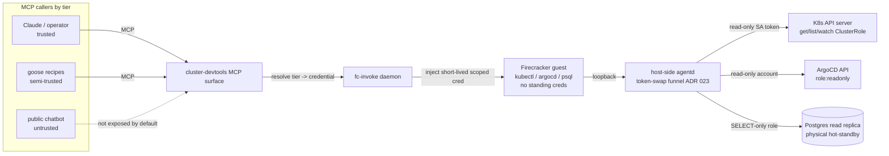

# ADR 006: Read-Only Cluster Devtools Sandbox as an MCP Endpoint

**Author:** Joe McGinley
**Status:** Draft
**Created:** 2026-07-09
**Relates to:** [ADR 030: fc-invoke Configurable Firecracker Surface](../agents/030-fc-invoke-configurable-firecracker-surface.md), [ADR 023: Egress Secret Proxy](../agents/023-egress-secret-proxy.md), [ADR 034: Per-Tier Guest MCP ACL](../agents/034-per-tier-guest-mcp-acl.md), [ADR 044: Code Executor Sandbox](../agents/044-code-executor-sandbox.md), [ADR 005: Role-Based MCP Access](../agents/005-role-based-mcp-access.md), [ADR 003: gVisor Runtime Class](003-gvisor-runtime-class.md), [ADR 004: Public Read-Only Service Isolation](004-public-read-only-service-isolation.md)

---

## Problem

Agents that reason about the cluster (Claude in this repo, the goose recipe runtime, the Discord/ambient chatbot) need to answer "what is happening in the cluster right now": is this ArgoCD app synced, why is this pod crash-looping, what does this row look like in Postgres. Today that access is a set of **hand-written MCP tool wrappers** on the monolith gateway: `monolith-k8s-get-resource`, `-list-resources`, `-get-events`, `-get-pod-logs`, `-health-summary`, `-sync-argocd-app`. Each is a Go endpoint we design, RBAC-grant, build, release, and then re-register through Context Forge (which caches tool catalogs and does not auto-refresh). The catalog is permanently behind what an operator would just type at a shell: the moment a question needs `kubectl get ... -o jsonpath`, an `argocd app diff`, or an ad-hoc `SELECT`, there is no tool and the answer is "write another wrapper."

The proposal inverts this. Instead of maintaining our own MCP surface on top of cluster endpoints, run **one sandbox with the real CLIs** (`kubectl`, `argocd`, `psql`) and expose it as a small MCP surface that executes a command and streams back its output, with the agent driving a read-eval feedback loop. The coverage problem disappears: anything the CLIs can read, the agent can ask for, with zero new code per capability.

The catch is that this is exactly the artifact our security model exists to prevent: a **general-purpose command executor holding cluster credentials, driven by an LLM, reachable over MCP by callers of differing trust**. A hand-written wrapper is safe by construction because it can only do what its Go code does; a shell is only as safe as the credential behind it. The decision this ADR records is not whether the sandbox is useful (it plainly is) but the control stack that lets a general in-cluster CLI executor be operated safely, and specifically how it keeps the safety of the wrappers while gaining the coverage of a shell.

The threats specific to this surface:

1. **Arbitrary mutation with cluster authority (the headline integrity threat).** The whole point is executing commands the model composes. If the credential behind the shell can write, a confused or jailbroken model can `kubectl delete`, `argocd app delete`, `kubectl rollout restart`, or `DROP TABLE`. The blast radius is precisely whatever the credential is permitted to do, so the credential's permission set _is_ the security boundary.
2. **Read-only enforced by string-matching is not read-only.** The naive control is to parse the command and block dangerous verbs. This is an arms race that the parser loses: `kubectl --raw` issues arbitrary API verbs, `kubectl edit`/`replace -f -` mutate via stdin, `kubectl proxy` reopens the full API, `argocd`'s own read-looking subcommands have mutating flags, and `psql` can write through `COPY ... TO PROGRAM`, `\copy`, `SECURITY DEFINER` functions, or `DO` blocks. Command allow/deny-listing cannot be the boundary.
3. **Credential theft and exfiltration.** The guest runs untrusted-by-assumption code (the CLIs process attacker-influenceable input: pod logs, object annotations, query results). A standing, long-lived kubeconfig or DSN sitting in the guest is the worst case: a single CLI RCE or injection walks the token out of the sandbox.
4. **"Read-only" is not "harmless": read access to secrets is credential disclosure.** `kubectl get secret -A` dumps every 1Password-synced secret in the cluster. `SELECT` against the wrong schema reads PII, session tokens, or other services' data. A read-only credential that can read secrets has effectively escalated to those secrets' authority. Read scope must exclude secret material explicitly, not by omission.
5. **Collapsing trust tiers into one endpoint.** The consumers span the full trust range: Claude in this repo (trusted operator proxy), goose recipes (semi-trusted runtime executing model-authored plans), and the public/ambient chatbot (untrusted, anonymous, adversarial by default per [ADR 005 security](005-public-chat-adversarial-hardening.md)). One sandbox reachable by all three with one credential grants the untrusted caller the trusted caller's reach.
6. **A new egress path out of an isolated surface.** The sandbox by definition reaches the Kubernetes API, the ArgoCD API, and Postgres. If it can reach anything else, a CLI RCE regains general cluster network reach, the same hole [ADR 004](004-public-read-only-service-isolation.md) and [ADR 005](005-public-chat-adversarial-hardening.md) spend a NetworkPolicy to close.
7. **Feedback-loop resource amplification.** An agent looping "run, read, refine" can spin: `kubectl get pods -A -o yaml` across a large cluster, an unbounded `SELECT`, or a runaway iteration count. Each turn spends real API-server, database, and guest CPU.
8. **Command output as an injection channel.** Stdout is untrusted content (pod logs, note bodies, annotations can carry adversarial text). Fed back into the model's context it can steer the next command. This cannot be prompt-filtered away; it has to be bounded structurally.

---

## Decision

Build a single **read-only cluster-devtools sandbox** as an fc-invoke workload ([ADR 030](../agents/030-fc-invoke-configurable-firecracker-surface.md)), an apko guest image carrying `kubectl`, the `argocd` CLI, and `psql`, exposed over MCP as a small execution surface (one tool per CLI: `cluster.kubectl`, `cluster.argocd`, `cluster.psql`, each taking arguments / a query and returning captured output). Safety is enforced at the **credential layer, not the command parser**, the credential is **injected per-invoke and never stored in the guest**, and its scope is **selected per calling tier** per [ADR 034](../agents/034-per-tier-guest-mcp-acl.md). This is the same move [ADR 005](005-public-chat-adversarial-hardening.md) makes for public chat: every limit is enforced by a mechanism the caller cannot edit, and the failure of any single control still bounds the damage.

**1. Read-only is a property of the credential, verified by the API server and Postgres, not by our code.** This is the load-bearing decision. The parser is removed from the trust path entirely.

- `kubectl` authenticates as a ServiceAccount bound to a `get`/`list`/`watch`-only ClusterRole, with **no** `create`/`update`/`patch`/`delete` on any resource and an **explicit exclusion of `secrets`** (and other secret-bearing resources). A jailbroken model running `kubectl delete` receives `Forbidden` from the API server; running `kubectl --raw` with a mutating verb receives `Forbidden`. There is no verb the credential lacks that a clever command string can smuggle back in.
- `argocd` runs against a read-only ArgoCD RBAC account (`p, role:readonly, ...`), so `app get`, `app diff`, `app history`, and `app manifests` work while `app sync`/`app delete`/`app set` are denied server-side.
- `psql` connects with a dedicated `readonly` Postgres role (only `USAGE` + `SELECT`, `EXECUTE` revoked on writing functions, sensitive schemas revoked entirely) **against the read replica, never the `-rw` primary**. The replica is a physical streaming standby: it is in hot-standby and _cannot_ accept a write at the instance level regardless of role grants. Write-safety here is structural, the same "database property, not a prompt instruction" guarantee ADR 005 relies on for retrieval confinement, plus it keeps expensive ad-hoc scans off the write path.

The claim this justifies: we keep the safety of the hand-written wrappers (which could only read) while gaining the coverage of a shell, because we moved the boundary from "what our Go code chooses to do" to "what the credential is permitted to do", and the second boundary is _stronger_, since it is enforced by the Kubernetes API server and Postgres rather than by our own code.

**2. The guest never holds standing credentials; they are injected short-lived per-invoke.** Reusing the egress secret proxy / vsock funnel of [ADR 023](../agents/023-egress-secret-proxy.md), the guest issues its API and database traffic at a host-side agentd shim that attaches the real credential; the token is a short-TTL `TokenRequest`-minted SA token and the psql DSN is fetched per-session, so a credential exfiltrated from a compromised guest is read-only and expires in minutes. The preferred posture is that `kubectl` and `psql` traverse the funnel so the guest never sees the token at all: agentd holds it host-side and the guest holds only a loopback endpoint. This composes with, and does not replace, control 1: the funnel hides the credential, the read-only role bounds it. Neither is asked to do the other's job.

**3. Trust tiers are separated by which credential the daemon injects.** Per [ADR 034](../agents/034-per-tier-guest-mcp-acl.md), the MCP tool resolves the authenticated caller to a tier and the daemon injects the matching credential:

- **Trusted** (Claude in this repo, operator sessions): the broad read-only role above (still secrets-excluded).
- **Semi-trusted** (goose recipes): a narrower role, e.g. a namespace allow-list, no `psql`, or `psql` on a curated view set.
- **Untrusted** (public / ambient chatbot): the tool is **not exposed at all by default**. If ever opted in, it gets the most restricted role (single namespace, no `psql`, no secret-adjacent resources), gated explicitly per ADR 034, never inheriting a trusted tier's reach.

The tier picks the credential; the credential enforces the scope. A caller cannot select its own tier because the tier is bound to the authenticated MCP identity, not to a request field.

**4. Secrets are outside the definition of "read."** `get`/`list` on `secrets`, on ConfigMaps known to hold secret material, and on secret-bearing CRDs is denied even to the trusted tier, and the `psql` `readonly` role is revoked from schemas holding tokens/PII. Read access to a secret is disclosure of that secret; the sandbox is for cluster _state_, not for cluster _secrets_. Where practical the kubectl ClusterRole is built as a resource **allow-list** (name the readable resources) rather than a deny-list, so a newly introduced secret-bearing resource is closed by default.

**5. The feedback loop is bounded.** Each command has an output-byte cap and a wall-clock timeout enforced by the MCP handler; `psql` runs under a statement timeout and a row cap. The sandbox is ephemeral per session and torn down, and its footprint is bounded by the fc-invoke workload sizing (as with the code executor and semgrep workloads). Output is returned to the model as clearly delimited **data**, never re-interpreted as instructions; because the credential is read-only, output-driven injection of the next command cannot escalate beyond more reads.

**6. Egress containment.** The guest's host-side funnel reaches exactly the Kubernetes API server, the ArgoCD API, the Postgres **read replica**, and DNS. Nothing else, default-deny, the same posture ADR 004/005 apply to the public binary. A CLI RCE inside the guest reaches those three read endpoints under a read-only credential and no other cluster destination.

### Before / After

| Aspect                    | Today (hand-written MCP wrappers)                          | Decided (one sandboxed CLI + MCP)                                     |
| ------------------------- | ---------------------------------------------------------- | -------------------------------------------------------------------- |
| Tool surface              | N bespoke Go endpoints, one per read shape                 | One tool per CLI over the real `kubectl`/`argocd`/`psql`             |
| Adding a capability       | Write wrapper + RBAC + release + Context Forge refresh     | Nothing; the CLI already supports it                                  |
| Read-only enforcement     | Implicit (the wrapper only reads; our code's promise)      | Credential-level: get/list-only RBAC + SELECT-only role on a replica |
| Credential                | Monolith's in-process ServiceAccount                       | Short-lived, per-invoke, injected; guest never holds it              |
| Trust tiers               | One (whatever the monolith gateway is)                     | Per-caller (trusted / semi / untrusted) via ADR 034                  |
| Secret exposure           | Wrapper-by-wrapper                                          | Denied by the role, secrets outside "read" by construction           |
| Blast radius of a defect  | The wrapper's fixed behavior                               | Bounded by the read-only credential, verified server-side            |
| Isolation                 | In the monolith process                                    | Firecracker microVM, ephemeral per session                           |

---

## Architecture

The daemon is the only component that mints and scopes credentials; the guest is a stateless executor; the read-only-ness is verified at the three server endpoints, not anywhere in the request path we control.

---

## Alternatives Considered

- **Keep hand-writing MCP wrappers.** Rejected: perpetual coverage lag behind what an operator would type, a per-tool RBAC + release + Context Forge-refresh tax, and read-only-ness that is our code's promise rather than a server-enforced boundary.
- **Give the model a kubeconfig / DSN directly, no sandbox.** Rejected: standing credentials in the model's reach, no isolation, no per-tier scoping, and unrestricted egress from wherever it runs.
- **Command-string allow/deny-listing as the safety layer.** Rejected: bypassable via `kubectl --raw`, `edit`/`replace -f -`, `proxy`, `argocd` mutating flags, and `psql` `COPY ... TO PROGRAM` / definer functions. String matching is not a security boundary.
- **An API-parsing proxy that inspects each call as the primary control.** Rejected as _the_ boundary (still a parser arms race). The read-only RBAC / DB role is the boundary; the ADR 023 funnel adds credential-hiding, not command-filtering.
- **Run `psql` against the primary with a read-only role.** Rejected: the read replica is physically write-incapable (structural write-safety independent of grants) and keeps ad-hoc scans off the write path.
- **One generic `run-shell` tool instead of one tool per CLI.** Rejected: per-CLI tools give each a tighter argument schema and let ADR 034 ACLs gate `psql` separately from `kubectl`, which matters for the semi-trusted tier.

---

## Security

Baseline is `docs/security.md`. Deviations and where they are justified:

- **The workload intentionally holds cluster-read authority**, more than a normal public workload. Justified because the authority is read-only (verified by the API server / ArgoCD / a physical standby), short-lived, injected rather than stored, secret-excluded, per-tier scoped, and egress-contained to three destinations.
- **Isolation is stronger than baseline, not weaker:** the executor is a Firecracker microVM (harder boundary than the gVisor runtime class of [ADR 003](003-gvisor-runtime-class.md)), ephemeral per session. Standard guest hardening still applies (non-root uid 65532, read-only rootfs, no privilege escalation, dropped capabilities).
- **The read-only ClusterRole and the `readonly` Postgres role are security-critical artifacts** and must be reviewed with the same care as ADR 004's `public_reader`: no `*` verbs, no `secrets`, allow-list resources where feasible, and a CI check guarding against verb/resource drift.

---

## Risks

| Risk                                                                     | Likelihood | Impact | Mitigation                                                                                                                     |
| ------------------------------------------------------------------------ | ---------- | ------ | ---------------------------------------------------------------------------------------------------------------------------- |
| Read-only role drifts to include a mutating verb or `secrets`            | Medium     | High   | Review the role like `public_reader`; resource **allow-list** not deny-list; CI/semgrep guard on the manifest; no `*` verbs   |
| A secret-bearing resource is readable via an overlooked CRD              | Medium     | High   | Default-deny allow-list of readable resources; new resources closed until explicitly added                                    |
| `psql` `readonly` role reaches a `SECURITY DEFINER` writer               | Low        | High   | Replica is physically write-incapable (backstop); `EXECUTE` revoked on definer functions; sensitive schemas revoked          |
| Untrusted (public) tier gains cluster read                              | Low        | High   | Tool not exposed to the untrusted tier by default; opt-in only via explicit ADR 034 grant with the most restricted role      |
| Short-lived token exfiltrated from a compromised guest                   | Low        | Low    | Token is read-only and expires in minutes; funnel keeps it host-side so the guest ideally never holds it                     |
| Feedback loop burns API-server / DB / guest resources                    | Medium     | Low    | Per-command output + wall-clock caps; `psql` statement timeout + row cap; ephemeral sandbox; fc-invoke workload sizing        |
| Command output injects instructions that steer the next command          | Medium     | Low    | Output returned as delimited data; read-only credential bounds any injected command to more reads                            |

---

## Open Questions

1. **Untrusted tier in v1?** Recommendation: expose to trusted (Claude/operator) and semi-trusted (goose) only in v1; leave the public/ambient chatbot off this tool until there is a concrete need and an ADR 034 grant.
2. **Phasing:** `kubectl` + `argocd` first (one SA token, one ArgoCD account), `psql` as phase 2 (needs the replica network path and the `readonly` role provisioned)?
3. **Funnel vs injected token per credential type:** is `kubectl`/`psql` traffic uniformly routed through the ADR 023 funnel (guest never sees the token), or is a short-lived injected token acceptable for some paths where a funnel proxy is disproportionate?
4. **Tool granularity:** three CLI-shaped tools (`cluster.kubectl` / `cluster.argocd` / `cluster.psql`) versus a single `cluster.shell`. Recommendation: three, for tighter schemas and per-CLI ACLs.

---

## References

| Resource                                                                                  | Relevance                                                            |
| ----------------------------------------------------------------------------------------- | ------------------------------------------------------------------- |
| [ADR 030: fc-invoke Configurable Firecracker Surface](../agents/030-fc-invoke-configurable-firecracker-surface.md) | The workload substrate this runs on                                 |
| [ADR 023: Egress Secret Proxy](../agents/023-egress-secret-proxy.md)                      | Token-swap / vsock funnel that keeps credentials out of the guest   |
| [ADR 034: Per-Tier Guest MCP ACL](../agents/034-per-tier-guest-mcp-acl.md)                | Per-caller tier -> credential scoping                               |
| [ADR 044: Code Executor Sandbox](../agents/044-code-executor-sandbox.md)                  | Precedent: fc-invoke sandbox exposed to agents as an MCP capability |
| [ADR 005: Role-Based MCP Access](../agents/005-role-based-mcp-access.md)                  | Tiered MCP access model                                             |
| [ADR 004: Public Read-Only Service Isolation](004-public-read-only-service-isolation.md)  | `public_reader` role + default-deny egress pattern reused here      |
| [ADR 005: Public Chat Adversarial Hardening](005-public-chat-adversarial-hardening.md)    | "Boundary is a DB/RBAC property, not a prompt" design lineage       |
| [ADR 003: gVisor Runtime Class](003-gvisor-runtime-class.md)                              | Baseline sandbox isolation this improves on with Firecracker        |
