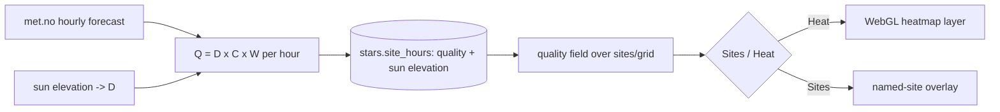

# ADR 007: Stars quality model and heatmap

**Author:** Joe McGinley
**Status:** Accepted
**Created:** 2026-06-13

---

## Problem

The `stars` domain scores each forecast hour with two independent gates: a hard
darkness cutoff (sun must be at or below nautical twilight, `-12°`) and an
additive weather score (`calculate_astronomy_score`, cloud-dominant) thresholded
at `>= 60`. This has two shortcomings:

1. **Darkness is binary.** An hour is either "dark enough" or discarded, with no
   notion of "how dark." Near the summer solstice the sun never reaches `-12°`
   anywhere in Scotland, so every site is discarded and the app is empty for
   roughly May to July. The honest empty state is correct, but it throws away
   the "best available" information (which nights are least-bad).
2. **Darkness and weather do not interact.** Real stargazers trade them off: a
   pristine, deeply dark night tolerates a little cloud and is still excellent; a
   merely-ok twilight night has to be near-spotless to be worth the drive.

We also want to render the result as a **heatmap**, which a binary gate cannot
feed (it needs a continuous value), and which is the only sensible rendering once
the light-pollution grid (ADR 006) replaces the ~30 curated markers with ~500
points.

---

## Decision

Replace the hard darkness gate plus additive score with a single **continuous
quality score `Q = D x C x W`**, where the cloud tolerance is coupled to
darkness (deeper dark forgives more cloud):

- **`D`, darkness factor (0 to 1):** `0` at civil twilight (`sun >= -6°`), ramping
  to `1` at astronomical darkness (`sun <= -18°`); nautical `-12°` lands at `~0.5`.
  Darkness becomes a continuous driver, not an on/off gate.
- **`C`, cloud factor (0 to 1):** full credit up to a darkness-scaled allowance
  `allow(D) = 5% + 5% * D` (about 5% cloud when only ok-dark, about 10% when very
  dark), then a steep falloff toward 0. This encodes "very dark + a few clouds is
  still great; ok-dark needs near-spotless."
- **`W`, weather modifier (about 0.7 to 1.0):** the existing humidity, fog, wind,
  and dew terms, folded in as a small modulation so they nudge quality without
  overpowering the darkness-and-cloud core.

`Q` is multiplicative so the ideal corner (very dark AND very clear) dominates
while "ok dark but pristine" and "very dark but lightly clouded" still earn
honest partial credit. The exact constants (allowance percentages, falloff span,
the `-6/-18` endpoints, the `W` floor) are calibration knobs, tuned against real
forecast data during implementation, not load-bearing in this decision.

This **subsumes the adaptive-darkness tiering** that was previously considered (a
discrete `-18 / -12 / -6` fallback ladder with per-site badges): a continuous `D`
degrades gracefully by season on its own, with no ladder and no special-casing.

The result is rendered as a **quality heatmap** (a WebGL fill layer, same
technique as the ships traffic heatmap) with a Sites/Heat toggle. Named curated
sites remain available as a labeled overlay.

| Aspect                     | Today                                     | Decided                                             |
| -------------------------- | ----------------------------------------- | --------------------------------------------------- |
| Darkness                   | Hard gate (`sun <= -12°`, else discarded) | Continuous factor `D` (0 at `-6°`, 1 at `-18°`)     |
| Weather                    | Additive score, hard `>= 60` floor        | Cloud factor `C` (core) + weather modifier `W`      |
| Darkness/cloud interaction | None (independent gates)                  | Coupled: cloud allowance grows with darkness        |
| Summer behaviour           | Empty (nothing reaches `-12°`)            | Cooler heatmap, the least-bad windows still surface |
| Seasonal handling          | Would need a discrete tier ladder         | Falls out of continuous `D`, no tiers               |
| Rendering                  | Discrete scored markers                   | Quality heatmap + named-site overlay                |

---

## Architecture

`Q` (and the underlying sun elevation, kept so the tier is always derivable) are
computed at refresh time and stored per hour. The read endpoint serves them; the
frontend toggles between the heatmap field and the labeled site overlay.

---

## Alternatives Considered

- **Keep the hard darkness gate plus additive score.** Rejected: binary, empty
  all midsummer, and cannot feed a heatmap.
- **Discrete adaptive-darkness tiers (`-18/-12/-6` ladder) with per-site badges.**
  Rejected: more moving parts than a continuous factor, and a heatmap wants a
  continuous value anyway. The continuous model captures the same "best available"
  intent without the ladder.
- **Independent multiplicative `D x C` with a fixed cloud curve.** Rejected: does
  not capture the darkness-coupled cloud tolerance ("deeper dark forgives more
  cloud") that matches how the sky actually reads.
- **Additive `w_d*D + w_c*C`.** Rejected: a weighted sum lets a great score come
  from being very dark OR very clear alone; multiplication requires both, which is
  the point.

---

## Security

No new surface. This is pure in-process computation on already-fetched forecast
data; no new external calls, credentials, or exposure. Baseline per
`docs/security.md`.

---

## Risks

| Risk                                                  | Likelihood | Impact | Mitigation                                                                                             |
| ----------------------------------------------------- | ---------- | ------ | ------------------------------------------------------------------------------------------------------ |
| Constants (allowances, falloff, endpoints) feel wrong | Medium     | Low    | Calibrate against several days of real forecasts during the build; they are config, not architecture   |
| Continuous `Q` changes the existing 30-site ranking   | High       | Low    | Intended: the new ranking is strictly more informative; verify it reads sensibly                       |
| Heatmap rendering cost over the ~500-point grid       | Medium     | Medium | Viewport-scoped loading and cell binning, mirroring the ships heatmap                                  |
| "Best available" in deep summer reads as falsely good | Medium     | Medium | The continuous `D` keeps summer quality genuinely low (cool heatmap); copy frames it as best-available |

---

## Open Questions

1. Whether `Q` replaces `best_score` in the `/api/stars/sites` payload or is added
   alongside it (and whether the named-site cards show `Q` or the weather score).
2. Heatmap aggregation: max `Q` per cell over the coming night versus a per-hour
   field with a time scrubber.
3. Heatmap interpolation/binning approach and how it interacts with the CDN cache
   key (static cells versus continuous interpolation).
4. Exact calibration constants (deferred to implementation against real data).

---

## References

| Resource                                               | Relevance                                                           |
| ------------------------------------------------------ | ------------------------------------------------------------------- |
| [ADR 006: Stars grid ingest](006-stars-grid-ingest.md) | The dense grid this heatmap renders; quality is the field it colors |
| `projects/monolith/stars/scoring.py`                   | The current additive score this evolves                             |
| `projects/monolith/ships/heat.py`                      | The WebGL heatmap rollup pattern to mirror                          |
| Stars-into-monolith design                             | The self-contained stars design this extends                        |
