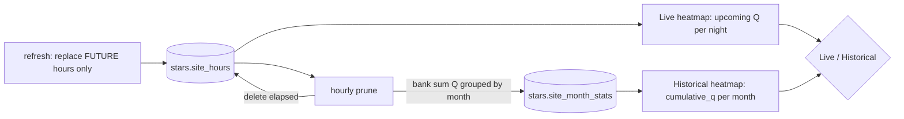

# ADR 008: Stars live and historical heatmaps via month-bucketed accumulate-at-drop

**Author:** Joe McGinley
**Status:** Superseded (in part) by [009-stars-era5-climatology-backfill](009-stars-climatology-backfill.md)
**Created:** 2026-06-13
**Supersedes:** the heatmap section of [007-stars-quality-model-and-heatmap](007-stars-quality-model-and-heatmap.md) (its quality model `Q = D x C x W` still stands)

> **Status note (superseded in part):** the live bank-at-prune accumulator
> (`stars.site_month_stats`) described below has been retired. The ERA5/CERRA
> climatology backfill (ADR 009) gives a complete, immediate multi-year seasonal
> picture, which made the slow-filling live accumulator redundant: the historical
> layer now reads `stars.site_month_climatology` alone, the `site_month_stats`
> table is dropped, and the hourly prune only deletes elapsed forecast hours (it
> no longer banks). The two-layer live/historical UX and the clear-dark metric
> below are unchanged; only the source of the historical counts moved.

---

## Problem

ADR 007 described a single quality heatmap fed by the live forecast. Two gaps:

1. **No historical signal.** The most useful question for a dark-sky site is "does
   it _reliably_ get clear, dark skies", which a snapshot forecast cannot answer.
   That history is being thrown away: the hourly prune deletes elapsed forecast
   hours and they are gone.
2. **Seasonality makes a lifetime metric muddy.** A Scottish site is astronomically
   dark all winter and never dark at midsummer, so a single all-time number blends
   "great in December" with "useless in June" into one meaningless value.

We also want per-time-period planning (which night soon, which month historically),
and the same "accumulate the signal as you drop the raw data" idea applies to the
ships traffic heatmap.

---

## Decision

Two heatmap layers, plus an accumulator that banks realized quality as forecast
hours elapse, bucketed by calendar month.

**Live layer:** the upcoming-forecast `Q` field, with a **night selector** (group
each site's future hours by night, like hikes' `viable_days`, and color by that
night's best `Q`).

**Historical layer:** accumulated realized quality per site per calendar month,
with a **month selector** (default the current month). When the **hourly prune**
drops elapsed forecast hours, it banks **sufficient statistics** (not just the Q
sum) into a month-bucketed accumulator before deleting. Storing the component sums
(`Q`, darkness, clarity) keeps the data decomposable, "is this site good because
it is often _dark_ or often _clear_", and lets us derive component averages and an
approximate re-score, rather than a single lossy number. `refresh` stores
`darkness_factor` and `cloud_factor` on each `site_hours` row (it already computes
them), so the prune banks everything in one grouped upsert:

```
INSERT INTO stars.site_month_stats
    (site_id, month, window_count, sum_q, sum_darkness, sum_clarity)
SELECT site_id, extract(month from hour_time),
       count(*), sum(score), sum(darkness_factor), sum(cloud_factor)
FROM <elapsing hours> GROUP BY site_id, extract(month from hour_time)
ON CONFLICT (site_id, month) DO UPDATE SET
  window_count = site_month_stats.window_count + EXCLUDED.window_count,
  sum_q        = site_month_stats.sum_q        + EXCLUDED.sum_q,
  sum_darkness = site_month_stats.sum_darkness + EXCLUDED.sum_darkness,
  sum_clarity  = site_month_stats.sum_clarity  + EXCLUDED.sum_clarity;
```

The headline historical metric is `sum_q` (quality-weighted frequency);
`sum_darkness / window_count` and `sum_clarity / window_count` give the
decomposition. Exact re-scoring under a _different_ Q formula would need the joint
distribution (a per-bucket histogram), since `Q = D x C x W` is a product and
marginal sums only recover marginal averages, that is deferred (see Open Questions).

For this to bank each hour **exactly once**, the prune must be the _sole_ remover of
elapsed hours: `refresh` changes to replace only **future** hours (it must not
wholesale-delete a site's rows, which would drop elapsed hours before the prune
banks them). `load_grid` additionally cleans orphaned `site_hours` for sites no
longer in the grid.

**The headline metric is the sum (`sum_q`), not the average.** Average `Q` rewards
the wrong thing, a site clear one perfect night scores higher than one clear fifty
decent nights, even though the latter is far better to plan around. The sum is
quality-weighted frequency: a site with fewer good windows accumulates less and
correctly reads as worse. `window_count` is kept for context ("47 good hours
banked"), not as the heat value. The heatmap normalizes color **relatively** (to
the current max / a percentile), so the sum growing over time is a scaling detail,
not a problem.

**Month-of-year (1-12), not year-month**, so each January accumulates across all
years into a stable seasonal climatology and the table stays bounded at 12 rows
per site (~3,700 total).

| Aspect                 | ADR 007                    | Decided                                                                                                                |
| ---------------------- | -------------------------- | ---------------------------------------------------------------------------------------------------------------------- |
| Layers                 | One (live)                 | Live + Historical                                                                                                      |
| History                | Discarded at prune         | Banked into `site_month_stats` at prune                                                                                |
| Time control           | None                       | Live: night selector; Historical: month selector                                                                       |
| Historical metric      | n/a                        | `sum_q` (quality-weighted frequency), relatively normalized; component sums (darkness, clarity) kept for decomposition |
| Seasonality            | Blended                    | Bucketed by month-of-year (bounded, climatological)                                                                    |
| refresh/prune contract | refresh wholesale-replaces | refresh replaces future only; prune is sole elapsed-remover (exactly-once banking)                                     |

---

## Architecture



The same shape generalizes across domains: **accumulate the signal into a bounded
bucket at the moment the raw data is dropped**.

| Domain | drop trigger                  | live (windowed)        | historical increment (additive)       |
| ------ | ----------------------------- | ---------------------- | ------------------------------------- |
| stars  | hourly prune of elapsed hours | upcoming `Q` per night | `+= sum(Q)` per month bucket          |
| ships  | retention partition drop      | distinct mmsi / 7d     | `+= vessel-days` per cell (follow-up) |

---

## Alternatives Considered

- **Average `Q` per good hour.** Rejected: ignores frequency, rewards rare-but-perfect
  sites over reliably-good ones, the opposite of what "good site" means.
- **Single lifetime scalar sum (no month bucket).** Rejected: blends winter darkness
  and summer twilight into one muddy number; useless given Scotland's seasonality.
- **Year-month buckets.** Rejected: grows unbounded over years; month-of-year gives a
  bounded, stable seasonal climatology.
- **Recompute history from retained raw hours.** Rejected: the prune deletes them by
  design (that is the point); we must bank at drop time, not retain raw data.
- **Decay / rolling-window recency weighting.** Deferred: nicer "recently reliable"
  signal but needs time-bucketed schema; revisit if the all-time-per-month average
  feels stale.

---

## Security

No new surface: in-process aggregation over already-stored forecast rows, plus two
new tables. Baseline per `docs/security.md`.

---

## Risks

| Risk                                                                 | Likelihood | Impact | Mitigation                                                                                                                        |
| -------------------------------------------------------------------- | ---------- | ------ | --------------------------------------------------------------------------------------------------------------------------------- |
| Double/under-counting if both refresh and prune remove elapsed hours | Medium     | High   | refresh replaces FUTURE hours only; prune is the sole elapsed-remover, banked exactly once                                        |
| New grid points under-accumulate vs older ones                       | Medium     | Low    | All sites accrue over the same wall-clock window on a stable grid; if the grid churns, normalize by hours-since-added (follow-up) |
| Historical layer is empty until it fills                             | High       | Low    | Expected: it accrues over days/weeks; the live layer is useful immediately                                                        |
| Heat saturates as sums grow                                          | Medium     | Low    | Relative color normalization, not absolute                                                                                        |

---

## Open Questions

1. Exact re-scoring of history under a different Q formula needs the joint
   distribution of factors, not marginal sums. A small per-bucket histogram of
   `Q` (or of `(D, C)`) would enable it cheaply; deferred unless we actually want
   to retune Q retroactively.
2. Decay / recency weighting for the historical layer (vs flat per-month climatology).
3. Whether the Live layer also keeps an aggregate snapshot (best night across the
   window) in addition to the per-night selection.
4. Ships rollout of the same accumulate-at-drop pattern (vessel-days at retention),
   and whether to unify the two behind a shared helper.

---

## References

| Resource                                                                      | Relevance                                                                   |
| ----------------------------------------------------------------------------- | --------------------------------------------------------------------------- |
| [007-stars-quality-model-and-heatmap](007-stars-quality-model-and-heatmap.md) | The `Q = D x C x W` model this accumulates; heatmap section superseded here |
| [006-stars-grid-ingest](006-stars-grid-ingest.md)                             | The grid the heatmaps render over                                           |
| `projects/monolith/ships/heat.py`, `ships/retention.py`                       | The ships rolling heatmap + partition drop the pattern would extend         |
