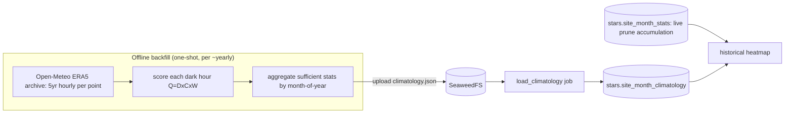

# ADR 009: Stars historical climatology backfill from ERA5

**Author:** Joe McGinley
**Status:** Accepted
**Created:** 2026-06-13

---

## Problem

ADR 008 banks realized quality into month-of-year buckets only **going forward**:
the hourly prune accumulates each forecast hour as it elapses. So the historical
(seasonal) heatmap starts empty and takes months to years to become meaningful,
the whole point of "which sites reliably get clear, dark skies" needs history that
does not exist yet.

We want an immediate, rich **~5-year seasonal climatology** so the historical layer
is useful on day one.

---

## Decision

Backfill the month-of-year buckets from **ERA5 reanalysis** (via Open-Meteo's free
historical archive API), scoring history with the exact same `Q = D x C x W` model
and storing it in a **separate, idempotently-regenerable table** that reads
alongside the live accumulator.

For each grid point, fetch ~5 years of hourly cloud cover, temperature, humidity,
wind, and dewpoint, score each dark hour with the same pipeline (`D` from `astral`
sun elevation is deterministic for any past timestamp; `C`/`W` from ERA5), and
aggregate the same sufficient statistics (`window_count`, `sum_q`, `sum_darkness`,
`sum_clarity`) by month-of-year. The heavy compute is **offline / one-shot**; only
the bounded aggregate (306 sites x 12 months) lands in the database, via the same
SeaweedFS-upload + loader-job path as the grid (ADR 006).

The backfill writes a **separate `stars.site_month_climatology` table**, not the
live `stars.site_month_stats` (ADR 008). They have identical shape and compose
additively at read time (historical heat = climatology + live), but separating
them keeps the backfill **idempotently regenerable** (wholesale-replace the
climatology without touching live-accumulated gains) and preserves **provenance**
(a "5-year typical" baseline distinct from "what actually happened recently").

| Aspect  | ADR 008 (live accumulator)     | Decided (this ADR)                               |
| ------- | ------------------------------ | ------------------------------------------------ |
| Fills   | Forward only, as hours elapse  | Immediately, from ~5yr of ERA5 history           |
| Source  | met.no forecast hours at prune | ERA5 reanalysis (Open-Meteo archive)             |
| Table   | `site_month_stats` (live)      | `site_month_climatology` (separate, regenerable) |
| Scoring | same `Q = D x C x W`           | same `Q = D x C x W` (D deterministic for past)  |
| Read    | historical layer               | historical layer = climatology + live, summed    |

---

## Architecture

`D` from `astral` is computed from lat/lon/time, so it is identical whether the
hour is a future forecast or a 2021 ERA5 record, the backfill and the live
accumulator are measuring the same quantity over the same buckets.

---

## Alternatives Considered

- **Backfill into the live `site_month_stats` table.** Rejected: not idempotently
  regenerable, re-running the backfill would double-count or require wiping
  live-accumulated gains. A separate table keeps the two independently updatable.
- **In-cluster backfill job.** Rejected: 306 points x ~5yr hourly fetch-and-score is
  heavy; the geospatial/backfill compute belongs offline (like the grid), with only
  a light loader in the cluster.
- **Copernicus CDS ERA5 directly.** Rejected: CDS registration plus GRIB/netCDF
  handling; Open-Meteo's archive API serves the same ERA5 data over simple HTTP/JSON
  by lat/lon, no key.
- **met.no frost historical station observations.** Rejected: sparse point stations,
  not gridded, and would not align with the grid points; ERA5 is gridded reanalysis
  that samples cleanly at any lat/lon.
- **Longer (10yr+) or shorter window.** ~5 years balances a representative
  climatology against fetch volume and recency; revisit if the seasonal signal is
  noisy.

---

## Security

Open-Meteo's archive API is public and key-free; the compute is offline. The loader
writes the aggregate to Postgres over the in-cluster network with 1Password-provided
credentials, no new external exposure. Baseline per `docs/security.md`.

---

## Risks

| Risk                                                       | Likelihood | Impact | Mitigation                                                                                                                                               |
| ---------------------------------------------------------- | ---------- | ------ | -------------------------------------------------------------------------------------------------------------------------------------------------------- |
| ERA5 cloud cover differs from met.no `cloud_area_fraction` | Medium     | Low    | Both are total cloud %; the climatology and live layers are read together and the difference is small relative to the seasonal signal; note in the model |
| Open-Meteo rate limits over 306-point x 5yr fetch          | Medium     | Low    | Offline, date-range per point (~306 calls), throttle/batch; not on any hot path                                                                          |
| Re-running backfill corrupts accumulated data              | Low        | Medium | Separate `site_month_climatology` table, wholesale-replaced; live `site_month_stats` untouched                                                           |
| ERA5 is modeled reanalysis, not observations               | Low        | Low    | Reanalysis is the standard for climatology; sufficient for "typical conditions"                                                                          |

---

## Open Questions

1. Whether the historical heatmap blends climatology + live into one field or
   offers a toggle ("5-year typical" vs "recent").
2. Backfill refresh cadence (re-run yearly as ERA5 extends, or one-shot).
3. Per-point light-pollution weighting (ADR 006 follow-up) would change `Q` for both
   the live and backfilled paths; the backfill should be regenerated when it lands.
4. Window length (5 vs 10 years) and whether to weight recent years more.

---

## References

| Resource                                                                    | Relevance                                                                           |
| --------------------------------------------------------------------------- | ----------------------------------------------------------------------------------- |
| [008-stars-live-historical-heatmaps](008-stars-live-historical-heatmaps.md) | The month-of-year buckets and sufficient-stats this backfills                       |
| [006-stars-grid-ingest](006-stars-grid-ingest.md)                           | The grid points scored, and the offline-compute + SeaweedFS + loader pattern reused |
| Open-Meteo Historical Weather API (ERA5 archive)                            | The key-free historical source: hourly cloud/temp/humidity/wind/dewpoint by lat/lon |
