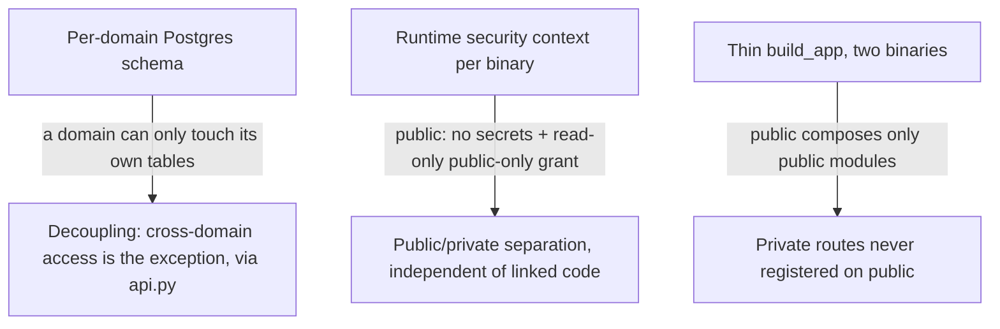
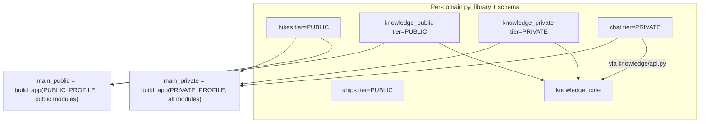

# ADR 010: FastMonolith Modular Framework

**Author:** Joe McGinley
**Status:** Accepted (implemented 2026-07-11; see Amendments)
**Created:** 2026-06-15
**Relates to:** [ADR 004: Public Read-Only Service Isolation](../security/004-public-read-only-service-isolation.md), [ADR 002: Path-Based Ingress Tiers](../networking/002-path-based-ingress-tiers.md)

---

## Problem

The monolith is already a modular monolith by convention: each domain (`hikes`, `ships`, `stars`, `knowledge`, `home`, `chat`, `scheduler`, `agent`) is a package exposing `register(app)` and `on_startup_jobs(session)`, sharing only `shared/` and `app/`, with `app/architecture_test.py` enforcing some of those rules at test time. The conventions work, but they are conventions. Three gaps:

1. **Shared data, shared credentials.** Every domain reads and writes the same Postgres schema as the same role. A bug or compromise in one domain can read or corrupt another's rows. Database permissions are the only real confidentiality control in the system (the one ADR 004 leans on), and today every domain has identical ones.
2. **Cross-domain reach.** `chat` imports `knowledge`'s store directly. Nothing marks where one domain's surface ends and another's begins, so coupling accretes silently.
3. **One bespoke composition.** [ADR 004](../security/004-public-read-only-service-isolation.md) decided to run a separate read-only public surface alongside the private monolith. Done as a one-off, that means two hand-authored entrypoints with two copies of the composition glue (lifespan, scheduler loop, OTel, MCP mount, DB engine, the `register()` sequence), which drift, and a hand-maintained list of which routers are "public."

We want domain isolation to be structural (each domain owns its data, with an explicit interface for the rare cross-domain call), the public/private separation to be enforced by the runtime's actual capabilities rather than by remembering a convention, and the composition wiring written once and reused by both deployments.

---

## Decision

Extract a small in-repo framework, **FastMonolith** (`projects/monolith/framework/`), that composes the monolith into per-tier binaries from data-isolated domain modules. The design rests on two boundaries plus a thin composition layer.

**Boundary 1: per-domain data isolation (the decoupling).** Each domain owns its own Postgres schema (`hikes`, `ships`, `knowledge`, ...). This is primarily a Postgres-side change, and the payoff is much less coupling: a domain can only touch its own tables, so the accidental shared-table dependencies that accrete today become impossible. Existing cross-domain data reads (`chat` -> `knowledge`) become the **exception, not the norm**, done only for convenience (saving a network hop) and only through that domain's published interface, never another schema.

**Boundary 2: the runtime security context (the public/private separation).** What actually keeps the anonymous public surface safe is not which code is compiled in, it is what the running process can do:

- The **public** runtime is injected with **no secrets or tokens**, and connects to Postgres as a **read-only role granted `SELECT` on public schemas and views only** (the `public_reader` role / read replica from ADR 004).
- The **private** runtime gets the full secret set and a read-write role.

Because the boundary is the credential set and the database grants, **code crossover between tiers is acceptable**: even if shared or private code is linked into the public binary, it is inert without tokens and cannot read private rows without the grant. We therefore do **not** build a build-graph exclusion test; isolation is a property of the deployment's capabilities, which hold regardless of code presence. The route surface still stays clean because the public binary only composes the public modules, so private routes are never registered (linked code != served routes).

**Composition: a thin `build_app(profile, modules)` shared by both binaries.** Each domain exports a `Module`: a frozen dataclass declaring `name`, `tier` (`PUBLIC`/`PRIVATE`), its owning `schema`, its `register(app)` callable, and what it needs from the host (scheduled jobs, secrets, ClickHouse, MCP). A single `build_app` owns the FastAPI app, the combined lifespan, the scheduler loop, OTel, the MCP mount, and the database engine, the only place that wiring lives. It binds the engine to the profile's role and validates that a module's declared needs (secrets, tier) fit the profile, so a public binary cannot be handed secrets it should not have. There are **two `py_venv_binary` targets** (`main_public`, `main_private`) composing different module sets; per-domain `py_library` targets exist for build/test modularity, not as a security wall.

**`<domain>/api.py` is the cross-domain contract, designed to become a network API.** The only legal way for one domain to call another is its `api.py`. Every function there must be shaped like a future HTTP endpoint: serializable inputs and outputs (Pydantic models / plain data), no `Session` or ORM objects crossing the boundary. The in-process call today and a network call tomorrow then have identical signatures, so `api.py` is exactly the seam where a domain could later be cut out into its own deployable service. This single contract covers all cross-domain needs: `chat` -> `knowledge`, cross-domain MCP tools, anything.

Two cross-cutting concerns stay shared framework code composed per binary, not forked into each domain:

- **Scheduler.** The SKIP-LOCKED loop stays in `framework/`, but **job rows live per-domain**: each domain owns its scheduler tables in its own schema, and the loop, started once per binary, scans the composed domains' job tables. The public binary registers no jobs and runs no loop. This keeps domains isolated on the Postgres side without duplicating the loop.
- **MCP.** The framework owns one MCP server instance; `build_app` aggregates each composed module's optional `register_mcp` onto it and mounts it once. "One MCP server, all tooling" is preserved; a standalone domain still exposes one server with just its tools. MCP is private-tier; the public binary mounts none.

A domain that serves both tiers (today only `knowledge`) splits into `<domain>_core` (shared models/logic, no routes) plus `<domain>_public` and `<domain>_private` modules.

| Aspect | Today | Decided (FastMonolith) |
| ------ | ----- | ---------------------- |
| Domain data | Shared schema, shared role | Per-domain schema; each domain owns its tables |
| Public/private separation | Ingress path match + backend filter | Runtime capability: no secrets + read-only public-only grant |
| Code crossover between tiers | N/A | Acceptable; not relied on for security |
| Cross-domain access | Direct internal imports | Exception, via `<domain>/api.py` (endpoint-shaped) only |
| Composition glue | One bespoke `main.py` | One thin `build_app`, reused by both binaries |
| Binaries | One | `main_public` + `main_private`, different module sets |
| Scheduler | One global loop over one jobs table | Shared loop composed per binary; per-domain job tables |
| MCP | Shared instance, import-side-effect registration | Framework-owned instance, `build_app` aggregates per module |
| Individual deployability | Not possible | Any module set composes a binary; `api.py` is the cut point |

This is deliberately *not* a heavyweight framework: no base classes, no DI container, no plugin auto-discovery. A module is plain data plus callables; the framework is a thin composition function plus a schema-per-domain convention plus the `api.py` contract.

---

## Architecture

### The two boundaries

### Composition model

### Relationship to ADR 004

FastMonolith implements ADR 004's public/private split as a reusable framework and keeps its decided security controls; it does not modify ADR 004.

| ADR 004 control | FastMonolith expression |
| --------------- | ----------------------- |
| Separate public composition | `main_public = build_app(PUBLIC_PROFILE, public_modules)`, sharing one `build_app` with the private binary |
| `public_reader` role + public views + read replica | `PUBLIC_PROFILE` binds the engine to that role/endpoint; per-domain schemas are what the grants are scoped to |
| Public surface holds no secrets | `PUBLIC_PROFILE` injects no secrets; `build_app` rejects a module that requires any |
| NetworkPolicy, SLO rollup job | Unchanged, consumed as decided |

The one difference in emphasis: ADR 004 frames artifact separation as the mechanism that "removes the failure mode," and suggested a build/import check to keep private modules out of the public binary. FastMonolith instead treats the **runtime capability set (no secrets + read-only public-only grant) as the load-bearing control**, so it keeps the two-binary split for cleanliness but does not add the build-graph exclusion test, and tolerates code crossover. ADR 004's role, grant, replica, and NetworkPolicy layers all still hold under this framing.

---

## Alternatives Considered

- **One image, `PROFILE` env, deployed twice.** Viable under the runtime-context framing (security would still come from secrets + grants), but two explicit binaries keep the composed surface obvious and were the chosen shape.
- **Build-graph exclusion test (`bazel cquery` that private code is absent from the public binary).** Rejected as the security control: the boundary is the runtime capability set, not artifact contents. Code crossover is acceptable, so the test would add machinery without being the thing that keeps data safe.
- **Code boundaries first, data isolation last.** Rejected: per-domain schemas are the decoupling that everything else builds on, so they lead.
- **Separate database per domain (not schemas).** Rejected as too heavy: the CNPG cluster already hosts several databases; per-domain schemas with per-role grants give the isolation at far less cost.
- **Scheduler loop forked into each domain.** Rejected: re-introduces the duplicated infra the framework removes. The loop is shared and composed per binary; only the job rows are per-domain.
- **Per-domain MCP servers behind a gateway.** Rejected for the in-process case: the goal is one server exposing all tooling; `build_app` aggregates module tools onto a single instance.
- **A heavyweight framework (base class, DI container, auto-discovery).** Rejected: re-couples every domain to the framework, the opposite of the goal.
- **One production chart per domain.** Rejected as scope: prod runs the two composed binaries. Per-domain deployability is a build/test capability, with `api.py` as the eventual cut point.

---

## Security

Builds on the `docs/security.md` baseline and ADR 004. The load-bearing controls for the public/private boundary are runtime, not build-time:

- **No secrets in the public runtime.** The public deployment is injected with no tokens or credentials; `build_app` rejects a public-profile module that declares a secret requirement.
- **Read-only, public-only database grant.** The public runtime connects as a read-only role with `SELECT` on public schemas and views only (ADR 004's `public_reader` on the replica). It cannot write, and cannot read private rows, by database permission.
- **Per-domain schemas scope the grants.** Because each domain owns a schema, grants are expressed per domain and per tier, making "what can the public role see" auditable.
- **Code crossover is explicitly tolerated.** Private or shared code linked into the public binary is inert without tokens or grants, so isolation does not depend on proving code absence.
- **Cross-domain access is an explicit, reviewable interface.** `<domain>/api.py` is the only cross-domain seam, endpoint-shaped and serializable.
- No deviations from `docs/security.md`.

---

## Risks

| Risk | Likelihood | Impact | Mitigation |
| ---- | ---------- | ------ | ---------- |
| Per-domain schema migration is invasive (moving existing tables) | High | High | Lead with it as step one, one domain at a time, each verified by CI; tables move by `SET SCHEMA` rename, not data copy |
| Cross-domain coupling surfaces late | Medium | Medium | Per-domain grants make every cross-domain read fail loudly during step one, forcing each onto an `api.py` function |
| `api.py` contracts drift from being endpoint-shaped (leak `Session`/ORM objects) | Medium | Medium | Lint/architecture test that `api.py` signatures are serializable; review treats `api.py` as a public API |
| Code crossover lulls into shipping a secret-dependent path on public | Low | High | `build_app` validates the public profile injects no secrets and the role is read-only; a path needing either fails fast |
| Scheduler composition regresses the working SKIP-LOCKED loop | Medium | High | Keep the loop in `framework/` unchanged; only scope which per-domain job tables it scans. Cover with existing scheduler tests plus a composition test |
| `knowledge` `_core` leaks private logic into the public path | Medium | Medium | `_core` holds models and pure helpers only; the read-only public-only grant remains the backstop, so a leak still cannot read private rows |

---

## Amendments (2026-07-11, at implementation)

The framework landed as decided (``framework/`` with ``Profile``, ``Module``,
``build_app``; two prod binaries composed from one root; runtime capability as
the boundary), with four adaptations to how the monolith had evolved since
this ADR was written:

1. **No scheduler composition.** The in-process SKIP-LOCKED loop was removed
   repo-wide after this ADR (scheduled jobs run as Argo CronWorkflows against
   the ``:jobs_image`` batch entrypoint), so ``Module`` carries no
   ``startup_jobs`` and ``build_app`` starts no scheduler loop. The
   leader-elected singletons (Discord bot, outbox drain, lock sweep, AIS
   ingest) took the scheduler's place as the composed background concern:
   they moved out of ``app/main.py`` into their owning domains
   (``chat/leader.py``, ``ships/leader.py``) as ``leader_start``/
   ``leader_stop`` hooks the framework drives. Each profile scopes its
   Postgres leader-election lease key (the confined monolith keeps the
   historical ``singletons`` key; domain profiles get ``singletons.<name>``),
   so a standalone domain binary deployed next to the confined monolith
   never contends for, and silently wins, the monolith's election.
2. **Both-tier domains use hooks, not package splits.** Reality converged on
   ``register(app)`` + ``register_public(app)`` hooks per domain rather than
   ``_core``/``_public``/``_private`` packages. ``Module`` carries both
   optional callables and ``build_app`` selects by the profile's tier.
3. **The profile does not own DB plumbing.** ``core.db.get_engine`` reads
   ``DATABASE_URL``, which each deployment points at the right endpoint and
   role, exactly the runtime-capability framing above; adding engine wiring
   to the profile would have changed behavior for no isolation gain.
4. **Per-domain images are a build product now.** Beyond the two prod
   binaries, ``app/main_domain.py`` composes any single domain
   (``MONOLITH_DOMAIN`` env), and ``domain_images.bzl`` fans out a build-only
   dual-arch image per domain sharing the confined monolith's layers
   (``bazel build //projects/monolith:image_domain_<name>`` or
   ``:domain_images`` for all). No push wiring and no charts: per-domain
   production deployment stays out of scope as decided; ``api.py`` remains
   the cut point when a domain graduates for real.

## Open Questions

1. **`home/observability` tiering.** It serves a public main page (precomputed snapshots per ADR 004) and private detail. Confirm whether it splits like `knowledge` or collapses to a thin `home_public` reading only snapshot tables.
2. **Shared reference data ownership.** Any table read by several domains needs an owning schema and an `api.py`; inventory during step one.
3. **`api.py` enforcement mechanism.** Whether the "serializable, endpoint-shaped" contract is enforced by an architecture test, a lint, or convention plus review.

---

## References

| Resource | Relevance |
| -------- | --------- |
| [ADR 004: Public Read-Only Service Isolation](../security/004-public-read-only-service-isolation.md) | The public/private security model FastMonolith implements as a framework |
| [ADR 002: Path-Based Ingress Tiers](../networking/002-path-based-ingress-tiers.md) | Public/private tier and hostname scheme the binaries sit behind |
| `projects/monolith/app/main.py` | The composition glue `build_app` extracts and replaces |
| `projects/monolith/app/mcp_app.py` | The single MCP instance `build_app` takes ownership of |
| `projects/monolith/shared/scheduler.py` | The SKIP-LOCKED scheduler loop composed per binary |
| `projects/monolith/app/architecture_test.py` | Existing convention enforcement FastMonolith extends |
| [aspect_rules_py `py_library` / `py_venv_binary`](https://github.com/aspect-build/rules_py) | Build-graph mechanism for per-domain libraries and the two binaries |
