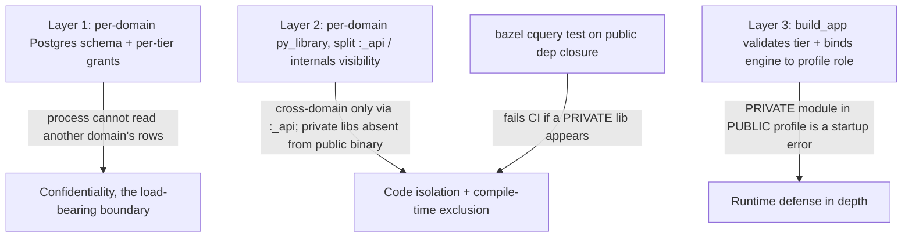
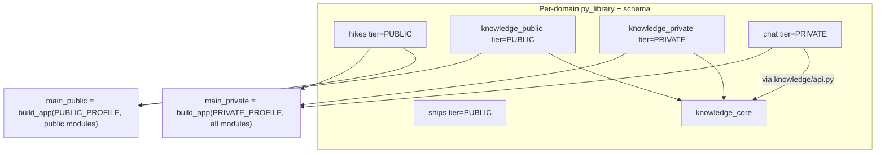

# ADR 010: FastMonolith Modular Framework

**Author:** Joe McGinley
**Status:** Draft
**Created:** 2026-06-15
**Relates to:** [ADR 004: Public Read-Only Service Isolation](../security/004-public-read-only-service-isolation.md), [ADR 002: Path-Based Ingress Tiers](../networking/002-path-based-ingress-tiers.md)

---

## Problem

The monolith is already a modular monolith by convention: each domain (`hikes`, `ships`, `stars`, `knowledge`, `home`, `chat`, `scheduler`, `agent`) is a package exposing `register(app)` and `on_startup_jobs(session)`, sharing only `shared/` and `app/`, with `app/architecture_test.py` enforcing some of those rules at test time. The conventions work, but they are conventions. Three things nothing structural prevents today:

1. **Shared data.** Every domain reads and writes the same Postgres schema with the same credentials. A bug (or a compromise) in one domain can read or corrupt another's rows. The only real confidentiality boundary in the system, the one ADR 004 leans on, is database permissions, and today every domain has the same ones.
2. **Cross-domain reach.** `chat` imports `knowledge`'s store directly. Nothing stops a domain depending on another's internals.
3. **Deployment leakage.** [ADR 004](../security/004-public-read-only-service-isolation.md) decided to split the anonymous public surface into a separate read-only artifact, but as written it is a one-off: a second hand-authored entrypoint with a hand-maintained list of "public routers," guarded by a hand-rolled import-check test. ADR 004 itself flags the failure mode:

   > Shared-code refactor accidentally pulls private modules into the public artifact... add a build/import check (or test) asserting private modules are absent from `main_public`.

That guard rots, and two entrypoints means two copies of the composition glue (lifespan, scheduler loop, OTel, MCP mount, DB engine, the `register()` sequence) that silently drift.

We want each boundary to be a property of the data model, the build graph, and the type system, not of a reviewer remembering a convention; the wiring written once and reused by every deployment; and each domain independently buildable and testable, even though prod runs them composed.

---

## Decision

Extract a small in-repo framework, **FastMonolith** (`projects/monolith/framework/`), that makes "compose a deployable binary from privilege-typed, data-isolated domain modules" a first-class operation enforced at three layers. ADR 004's public/private split becomes one instance of the general pattern.

**Layer 1 (load-bearing): per-domain data isolation.** Each domain owns its own Postgres schema (`hikes`, `ships`, `knowledge`, ...). Grants are per role and per tier: a domain's role gets DML on its own schema only; the `public_reader` role (ADR 004) gets `SELECT` on public schemas and public views and nothing else. This is the strongest boundary because it is the only one that stops a process from *reading another domain's rows* regardless of code: Bazel visibility stops accidental imports, but only Postgres grants stop data access. It is therefore **step one** of the work, ahead of any code split. Because per-domain schemas make cross-domain data access impossible by default, the legitimate cross-domain reads that exist today (`chat` -> `knowledge`) must go through a **domain public interface** (`<domain>/api.py`), never another schema or another domain's internals.

**Layer 2: build-graph boundary.** Each domain becomes its own Bazel `py_library` with two visibility tiers: `:<domain>_api` (a narrow, stable interface, widely visible) and `:<domain>` (internals, restricted to the domain's own targets, its tests, and the binaries). Cross-domain dependencies may only target `:_api`. The two production deployments are two `py_venv_binary` targets with different `deps`: the public binary lists only `tier=PUBLIC` libraries, so private domain code is *physically absent* from the public artifact, not merely unrouted. A `bazel cquery` test asserts the public binary's transitive closure contains no `tier=PRIVATE` library, replacing ADR 004's fragile import-check with a structural one a refactor cannot defeat.

**Layer 3: runtime composition contract.** Each domain exports a `Module`: a frozen dataclass declaring `name`, `tier` (`PUBLIC`/`PRIVATE`), `schema`, its `register(app)` callable, and what it needs from the host (scheduled jobs, secrets, ClickHouse, MCP tool registration). A single `build_app(profile, modules)` function owns the FastAPI app, the combined lifespan, the scheduler loop, OTel, the MCP mount, and the database engine. It is the *only* place that wiring lives. `build_app` validates that every module's tier and required capabilities are permitted by the binary's `Profile` (a `PRIVATE` module in the public profile is a startup error) and binds the engine to the profile's role, so a module cannot open its own connection or reach a schema it was not granted.

Two cross-cutting concerns are resolved by the framework owning the shared machinery and composing it per binary, rather than forking it into each domain:

- **Scheduler.** The scheduler stays shared framework code, but the loop is started per binary and scans only the jobs of the modules composed into that binary. The public binary registers no jobs and runs no loop; a single-domain binary runs a loop over just that domain. Job rows are private-tier and isolated, but the loop is *not* duplicated into every domain. This keeps the working SKIP-LOCKED design and avoids re-introducing the duplication the framework exists to remove.
- **MCP.** The framework owns one MCP server instance. `build_app` aggregates each composed module's optional `register_mcp` onto that single instance and mounts it once. "One MCP server, all tooling" is preserved, and it stays independently deployable because the aggregation is over whatever modules are present. MCP is a private-tier capability; the public binary mounts no MCP surface. A tool that needs another domain calls that domain's `api.py`, not its internals.

A domain that legitimately serves both tiers (today only `knowledge`) splits into `<domain>_core` (shared models/logic, no routes) plus `<domain>_public` and `<domain>_private` modules, keeping "module to tier" total.

| Aspect | Today | Decided (FastMonolith) |
| ------ | ----- | ---------------------- |
| Domain data | Shared schema, shared credentials | Per-domain schema, per-tier grants (Layer 1) |
| Cross-domain access | Direct internal imports (`chat` -> `knowledge`) | Through `<domain>/api.py` only |
| Module boundary | Convention + partial test | Per-domain `py_library`, split `:_api` / internals visibility |
| Public/private exclusion | Hand-maintained router list + import-check test | Disjoint binary `deps`; private code absent from public artifact |
| Privilege model | Implicit (which router got imported) | Explicit `tier` on each `Module`, validated by `build_app` |
| Composition glue | One bespoke `main.py` (would be duplicated per ADR 004) | One `build_app`, reused by every binary |
| Scheduler | One global loop over one jobs table | Shared loop composed per binary; jobs isolated, private-tier |
| MCP | Shared instance, import-side-effect registration | Framework-owned instance, `build_app` aggregates per module |
| Individual deployability | Not possible | Any module set composes a binary (used for isolated CI) |
| Boundary enforcement | Reviewer + runtime test | DB grants + `bazel cquery` test + `build_app` validation |

This is deliberately *not* a heavyweight framework: no base classes domains inherit from, no DI container, no plugin auto-discovery. A module is plain data plus callables; the framework is a composition function plus Bazel visibility plus a schema-per-domain migration convention. The value is owning the wiring once and making the build graph and the database the enforcement.

---

## Architecture

### Three enforcement layers

### Composition model

### Relationship to ADR 004

FastMonolith does not change ADR 004's security model; it is the mechanism that implements it generically.

| ADR 004 control | FastMonolith expression |
| --------------- | ----------------------- |
| Separate composition `main_public.py` | `build_app(PUBLIC_PROFILE, public_modules)` |
| Private routers absent from the binary | Public binary `deps` exclude `tier=PRIVATE` libraries |
| "Add a build/import check" guard | `bazel cquery` test on the public binary's transitive deps |
| `public_reader` role + public views | Per-domain schemas + per-tier grants (Layer 1); `PUBLIC_PROFILE` binds the engine to that role |
| Read-only, no secrets | Profile declares the allowed secret set; `build_app` rejects modules needing more |

The Postgres read replica, NetworkPolicy, and SLO rollup job remain exactly as ADR 004 decided. FastMonolith generalizes the application and data layers so the split is structural rather than a bespoke second entrypoint.

---

## Alternatives Considered

- **Keep ADR 004's bespoke `main_public.py` (no framework).** Rejected: duplicates the composition glue, rests the exclusion guarantee on a hand-maintained router list, and gives future domains no reusable path.
- **Runtime feature flags / `PUBLIC_MODE` on one binary.** Rejected (as ADR 004 did): private code and secrets still ship in the artifact, so isolation becomes a config that can be set wrong.
- **Code boundaries first, data isolation last.** Rejected: the data grant boundary is the only one that enforces confidentiality, so it leads. Splitting code while every domain still shares one schema and one credential set would ship the appearance of isolation without the substance.
- **Separate database per domain (not schemas).** Rejected as too heavy: the CNPG cluster already hosts five databases; per-domain *schemas* with per-role grants give the same row/column isolation with far less operational cost. Revisit only if a domain must survive another's database being down.
- **Scheduler loop forked into each domain.** Rejected: re-introduces the duplicated infra the framework exists to remove. The loop is shared framework code composed per binary; only the job *rows* are isolated.
- **Per-domain MCP servers aggregated by a gateway.** Rejected for the in-process case: the goal is one MCP server exposing all tooling. The framework aggregates module `register_mcp` onto a single instance; a domain deployed standalone still exposes one server with just its tools.
- **A heavyweight framework (base class, DI container, auto-discovery).** Rejected: re-couples every domain to the framework, the opposite of the goal, and over-engineered for a homelab.
- **One production chart per domain.** Rejected as scope: prod runs the composed public and private binaries. Individual deployability is retained as a build/test capability.

---

## Security

Builds on the `docs/security.md` baseline and inherits [ADR 004](../security/004-public-read-only-service-isolation.md)'s four-layer model. FastMonolith strengthens the data and build layers:

- **Confidentiality is database-enforced per domain.** Per-domain schemas plus per-tier grants mean a process can only read the schemas its role was granted. The public role sees public schemas and views only; a compromised domain cannot read another's rows even within the private binary.
- **Compile-time exclusion is structural.** A `bazel cquery` test fails CI if any `tier=PRIVATE` library enters the public binary's closure, converting ADR 004's "remember to keep private modules out" into a build invariant.
- **Defense in depth at startup.** `build_app` independently validates module tier and required secrets against the profile, and binds the engine to the profile's role, so even a mis-specified `deps` list cannot boot a public binary with private capabilities or broader grants.
- **Cross-domain access is narrowed.** Only `<domain>/api.py` is cross-domain-visible; internals and schemas are not, so the attack surface between domains is an explicit, reviewable interface.
- No deviations from `docs/security.md`; this ADR tightens the data, build, and runtime layers for the highest-risk surface.

---

## Risks

| Risk | Likelihood | Impact | Mitigation |
| ---- | ---------- | ------ | ---------- |
| Per-domain schema migration is invasive (moving existing tables) | High | High | Lead with it as step one against the primary, one domain at a time, each verified by CI; tables move by schema rename, not data copy |
| Cross-domain coupling surfaces late (e.g. undiscovered `chat`/`knowledge` reads) | Medium | Medium | Per-domain grants make every such read fail loudly during step one, forcing each onto `<domain>/api.py` before the code split |
| `bazel cquery` boundary test is flaky or hard to express | Low | Medium | Tier is a tag on each `py_library`; prototype the query first, fall back to an aspect collecting a `TierInfo` provider |
| Scheduler composition regresses the working SKIP-LOCKED loop | Medium | High | Keep the loop in `framework/` unchanged; only scope which jobs it scans by composed module. Cover with the existing scheduler tests plus a composition test |
| `knowledge` `_core` leaks private logic into the public path | Medium | High | `_core` holds models and pure helpers only; per-tier grants remain the database-enforced backstop, so a leak still cannot read private rows as `public_reader` |
| Framework abstraction ossifies | Low | Medium | Keep `Module` plain data and `build_app` thin; domains keep full control of routers, jobs, and their `api.py` |

---

## Open Questions

1. **Scheduler jobs table layout.** One framework-owned `scheduler` schema granted private-only (simpler loop), or a jobs table per domain schema (cleanest isolation, loop does a UNION over composed schemas). Lean to the former since scheduling is inherently private-tier.
2. **Cross-domain MCP tool placement.** A tool spanning domains is registered by one module but calls others via `api.py`. Confirm whether such tools live in the owning domain's module or in a thin composition-level `agent` module that may depend on multiple `:_api` targets.
3. **Tier as a Bazel tag vs. a provider.** Whether `tier=PUBLIC|PRIVATE` is a `tags` entry keyed on by `cquery`, or a `TierInfo` provider via a thin macro. Decide when prototyping the boundary test.
4. **`home/observability` tiering.** It serves a public main page (precomputed snapshots per ADR 004) and private detail. Confirm whether it splits like `knowledge` or collapses to a thin `home_public` reading only snapshot tables.
5. **Schema ownership of shared reference data.** Any table read by several domains (if any exist beyond `knowledge` notes) needs an owning schema and an `api.py`; inventory during step one.

---

## References

| Resource | Relevance |
| -------- | --------- |
| [ADR 004: Public Read-Only Service Isolation](../security/004-public-read-only-service-isolation.md) | The security model FastMonolith implements generically |
| [ADR 002: Path-Based Ingress Tiers](../networking/002-path-based-ingress-tiers.md) | Public/private tier and hostname scheme the binaries sit behind |
| `projects/monolith/app/main.py` | The composition glue `build_app` extracts and replaces |
| `projects/monolith/app/mcp_app.py` | The single MCP instance `build_app` takes ownership of |
| `projects/monolith/shared/scheduler.py` | The SKIP-LOCKED scheduler loop composed per binary |
| `projects/monolith/app/architecture_test.py` | Existing convention enforcement FastMonolith makes structural |
| [aspect_rules_py `py_library` / `py_venv_binary`](https://github.com/aspect-build/rules_py) | Build-graph mechanism for per-domain libraries and per-binary deps |
</content>
