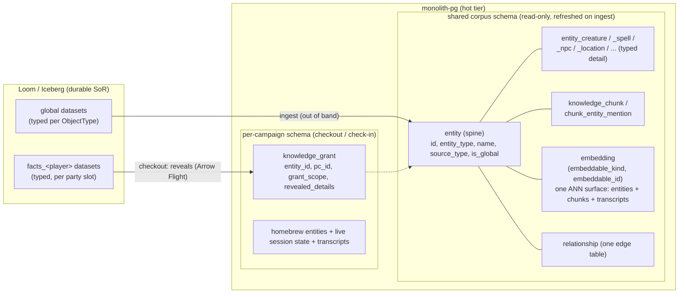

# ADR 011: Grimoire Hot-Tier Schema on Postgres

**Author:** Joe McGinley
**Status:** Accepted
**Created:** 2026-07-01
**Relates to:** [ADR 010: FastMonolith Modular Framework](010-fastmonolith-modular-framework.md), [ADR 004: D&D Sourcebook Knowledge Graph Integration](004-dnd-sourcebook-knowledge-integration.md) (Deprecated), [projects/monolith/grimoire/architecture.md](../../../projects/monolith/grimoire/architecture.md), [projects/monolith/grimoire/architecture.md](../../../projects/monolith/grimoire/architecture.md)

---

## Problem

[loom-mapping.md](../../../projects/monolith/grimoire/architecture.md) fixes the durable side of Grimoire: Loom (Iceberg) is the governed system of record, holding the campaign graph as **typed** per-entity-type datasets, each further **partitioned** into a `global` dataset plus one `facts_<player>` dataset per party slot, governed by Loom's coarse per-dataset `Read` grant. The live game never touches Loom on its hot path: at session start a working set is checked out into a fast disposable projection (the "hot tier"), which owns all live reads, writes, vector search, graph traversal, and fan-out, then checks the delta back in.

That leaves three load-bearing decisions unmade, all about **what shape the data takes when it lands in Postgres**:

1. **Where** the hot tier runs.
2. **How** a player's `global ∪ facts_<player>` view is reconstructed in Postgres (Loom's coarse dataset gate is not per-subject).
3. **What** the table schema is: Loom is typed and shredded, but Grimoire's older [data-architecture.md](../../../projects/monolith/grimoire/architecture.md) chose a single polymorphic `Entity` table with a `jsonb properties` column.

These are coupled (the schema decides how checkout loads and how visibility combines), so they are decided together here. This ADR is rationale for the target schema; the build sequence lives in [loom-mapping.md](../../../projects/monolith/grimoire/architecture.md) §7.1, not here.

---

## Decision

**1. The hot tier is the monolith's existing Postgres.** Grimoire lands as a monolith domain module (ADR 010), reusing `monolith-pg` (which already runs pgvector for the personal KG) with per-campaign schemas, the same fold-in pattern ships / trips / campsites followed. Not a standalone service, not a new datastore.

**2. Per-player visibility is a grant overlay combined at read time, not fine-grained access control.** Canonical entity/chunk/relationship tables carry a coarse `is_global` flag; a `knowledge_grant` table holds per-character reveals with a `grant_scope`. A subject's view is the predicate `is_global OR (granted to me)`, applied as an ordinary `WHERE`/`JOIN`. Loom does the coarse dataset-level `Read` gate on checkout; Postgres does the fine per-subject combine. This is exactly the `KnowledgeGrant` model Grimoire already designed, so it needs no new mechanism, and it is why Loom fine-grained ACL (loom ask A7) dissolved.

**3. The schema is typed class-table-inheritance (CTI), not polymorphic `jsonb`.** A thin type-agnostic `entity` spine (carrying `id`, `entity_type`, `name`, a `source_type` `extracted` / `homebrew` discriminator, and `is_global`) plus one typed detail table per `entity_type` (real columns for queryable scalars), with `jsonb` reserved only for genuinely irregular, display-only nested payloads (`actions[]`, `traits[]`). The two type-agnostic workloads keep their own shared tables so typing the detail does not fragment them: a single generic `embedding` table keyed by `(embeddable_kind, embeddable_id)` spanning entities, knowledge chunks, and session transcripts (one ANN surface, one index, so "search sourcebook knowledge and session history with the same vector query" is a single kNN scan), and a single `relationship` edge table. This supersedes the polymorphic-`Entity` decision in [data-architecture.md](../../../projects/monolith/grimoire/architecture.md), and it makes checkout a straight load from Loom's already-typed datasets with no un-shred transform.

| Aspect                                     | data-architecture.md (older)                            | Decided                                                                                                                   |
| ------------------------------------------ | ------------------------------------------------------- | ------------------------------------------------------------------------------------------------------------------------- |
| Hot tier location                          | Standalone Postgres (implied)                           | Monolith `monolith-pg`, per-campaign schema (ADR 010 module)                                                              |
| Entity storage                             | One polymorphic `Entity` + `jsonb properties`           | Typed CTI: `entity` spine + per-type detail tables                                                                        |
| Queryable stats (AC, CR, level, school)    | `jsonb` keys, `->>` + casts                             | Real typed columns, btree-indexable                                                                                       |
| Irregular nested (`actions[]`, `traits[]`) | `jsonb`                                                 | `jsonb` on the typed table (unchanged, this is where jsonb earns its place)                                               |
| Vector search surface                      | Per-row `embedding` columns (entity, chunk, transcript) | One generic `embedding` table keyed by `(embeddable_kind, embeddable_id)`: entities + chunks + transcripts, one ANN index |
| Graph surface                              | `Relationship` edge table                               | Unchanged: one shared `relationship` edge table                                                                           |
| Per-player visibility                      | `KnowledgeGrant` filter in app                          | Same, encoded as `is_global` + `knowledge_grant`, combined by read predicate                                              |

---

## Architecture

Loom holds typed, partitioned datasets; checkout unpacks them into typed CTI tables plus a grant overlay; queries scope themselves with one visibility predicate.



The hot tier is two schemas, matching Loom's two lifecycles ([loom-mapping.md](../../../projects/monolith/grimoire/architecture.md) §2.2): a **shared, read-only corpus schema** (sourcebook entities, chunks, embeddings, edges) refreshed out of band on new-book ingest and **not** duplicated per campaign, plus a **per-campaign schema** holding only the mutable working set (grants, homebrew entities, live character state, sessions and transcripts). A player read joins across the two (grants in the campaign schema against the shared corpus spine), which Postgres does natively across schemas.

Checkout / load mapping (no un-shred):

- Loom `global` typed dataset rows -> corpus `entity` (`is_global = true`, `source_type = extracted`) + the matching `entity_<type>` detail row + an `embedding` row (`embeddable_kind = entity`). Chunks land in `knowledge_chunk` with their own `embedding` rows (`embeddable_kind = chunk`). Edges land in `relationship`. This is the out-of-band corpus refresh, not the per-game checkout.
- Per game, Loom `facts_<player>` datasets -> `knowledge_grant` rows keyed by `(entity_id, player_character_id)`, carrying `grant_scope` (`full` / `partial` / `name_only`) and `revealed_details`; any player-exclusive entities load with `is_global = false`. Homebrew entities created live in the tier land with `source_type = homebrew` and get `embedding` rows the same way.
- In-game session transcripts get `embedding` rows (`embeddable_kind = transcript`) so history is searchable by the same kNN scan.

The player-scoped read (vector, graph, or lookup) is always the same union-as-predicate:

```sql
SELECT e.id, e.entity_type, e.name, g.grant_scope, g.revealed_details
FROM entity e
LEFT JOIN knowledge_grant g
  ON g.entity_id = e.id AND g.player_character_id = :me
WHERE e.is_global OR g.id IS NOT NULL;   -- global ∪ my slice
```

`grant_scope` drives projection at the application layer: `full` returns the joined typed detail, `partial` returns only `revealed_details`, and `name_only` is **recognition only, not retrieval**, the entity may appear in relationship context ("you are in Zadash") but is suppressed from direct lookups and vector hits, matching data-architecture.md (a `name_only` "tell me about Zadash" returns no result). Because the base predicate `is_global OR g.id IS NOT NULL` does surface `name_only` rows, the retrieval path must drop them explicitly; only the relationship-context path keeps them. The DM tier omits the predicate. Vector search runs over the generic `embedding` table (filtered to the caller's readable ids by the same join) and returns mixed entity/chunk/transcript hits; graph traversal is a recursive CTE over `relationship` that returns ids and applies the same join on hydration.

The reverse direction, check-in, serializes this schema back to Loom: `is_global` rows and `full` grants write to the `global` / per-character datasets, `partial` / `name_only` write the `revealed_details` / stub into the target `facts_<player>` dataset (the "what gets written into the slice" of [loom-mapping.md](../../../projects/monolith/grimoire/architecture.md) §3.4). The orchestration and idempotency rules live in loom-mapping.md §2.4, not here.

---

## Alternatives Considered

- **Polymorphic `Entity` + `jsonb properties` (the older data-architecture.md choice).** Rejected for the queryable scalars: no constraints or FKs, weak planner stats, heavier/less-selective GIN vs btree, and `->>`+cast smeared through every filter. Kept `jsonb` only for irregular nested display-only fields.
- **Pure per-type tables with no shared spine.** Rejected: it fragments the two type-agnostic hot paths, vector search would need a 7-way union (or a fragmented index) and graph traversal would need type knowledge mid-walk. The shared `entity_embedding` + `relationship` tables avoid this while keeping typed detail.
- **Loom fine-grained ACL for per-player reads (loom ask A7).** Rejected / dissolved: at a fixed ~6-profile party, visibility is dataset partitioning plus an in-tier grant overlay, not row policy. See loom PR #268 and [loom-mapping.md](../../../projects/monolith/grimoire/architecture.md) §3.4.
- **Spanner Omni as the hot tier.** Rejected: preview/developer edition (no TLS, no backups, 90-day write stop), and it adds a datastore the cluster does not otherwise run. `monolith-pg` already clears the bar.
- **A standalone Grimoire service with its own Postgres.** Rejected: ADR 010's module model gives isolation without a separate deployment, backups, and mesh surface.

---

## Security

Baseline per [docs/security.md](../../../docs/security.md). Two Grimoire-specific notes:

- **Player visibility is enforced in the hot tier, not the durable layer.** Between games, Loom's coarse dataset-level `Read` gates who can check out which `facts_<player>` dataset. During play, every player-scoped query must carry the `is_global OR granted-to-me` predicate; a missing predicate leaks ungranted lore (spoilers), the game-domain equivalent of a broken authz check. This must be enforced centrally (one query builder / repository layer), not per call site.
- **DM-only content.** The DM tier reads unfiltered; the split between player and DM read paths is a privilege boundary and follows ADR 010's privilege-typed module rules (public/player-facing code paths never receive the unfiltered reader).

---

## Risks

| Risk                                                                  | Likelihood | Impact                 | Mitigation                                                                                                                                                 |
| --------------------------------------------------------------------- | ---------- | ---------------------- | ---------------------------------------------------------------------------------------------------------------------------------------------------------- |
| A player-scoped query forgets the visibility predicate and leaks lore | Medium     | High (spoilers, trust) | Centralize the grant-join in one repository layer; test with a fixtures-based "player cannot see ungranted entity" assertion                               |
| Schema churn as new entity types / fields appear                      | Medium     | Low                    | Typed tables need migrations, but the type set is small and stable; homebrew of a known type reuses its table; only genuinely novel types need a new table |
| Loom typed schema and pg typed schema drift                           | Low        | Medium                 | Same typed shape both sides makes checkout a straight load; a shared type registry / generated column list keeps them aligned                              |
| `jsonb` creep back into queryable fields                              | Medium     | Medium                 | ADR rule: `jsonb` only for irregular nested display-only payloads; reviewers reject scalar filters living in `jsonb`                                       |

---

## Open Questions

1. **Embedding model + dimension.** The monolith KG runs a 1024-dim pgvector model; [data-architecture.md](../../../projects/monolith/grimoire/architecture.md) specced 3072-dim Gemini. Pick one so `entity_embedding.embedding vector(N)` and the Loom vector column agree. Tracked in [loom-mapping.md](../../../projects/monolith/grimoire/architecture.md) §9.
2. **Exact global-vs-slice split per table.** Which facts are `is_global` vs per-character grants, and how `partial` / `name_only` reveals are physically represented (a projected `revealed_details` payload vs a stub row).
3. **Nested payload boundary.** Which sub-structures stay `jsonb` on the typed table vs get promoted to child tables if we ever need to query into them (e.g. querying spells by a component). Default: `jsonb`, promote only on a real query need.
4. **Realtime + voice.** Live fan-out and the voice/transcription path ride the monolith app tier; the exact wiring is out of scope for this schema ADR (see [loom-mapping.md](../../../projects/monolith/grimoire/architecture.md) §9).

---

## References

| Resource                                                                                  | Relevance                                                                                 |
| ----------------------------------------------------------------------------------------- | ----------------------------------------------------------------------------------------- |
| [projects/monolith/grimoire/architecture.md](../../../projects/monolith/grimoire/architecture.md)           | The Loom target architecture and checkout/check-in loop this schema lands from            |
| [projects/monolith/grimoire/architecture.md](../../../projects/monolith/grimoire/architecture.md) | The older polymorphic-`jsonb` data model this ADR supersedes for storage                  |
| [ADR 010: FastMonolith Modular Framework](010-fastmonolith-modular-framework.md)          | Grimoire is a privilege-typed monolith module; the player/DM read split follows its rules |
| [loom PR #268](https://github.com/weave-hand/loom/pull/268)                               | Where the dataset-partition model (dissolving A6/A7) was settled                          |
