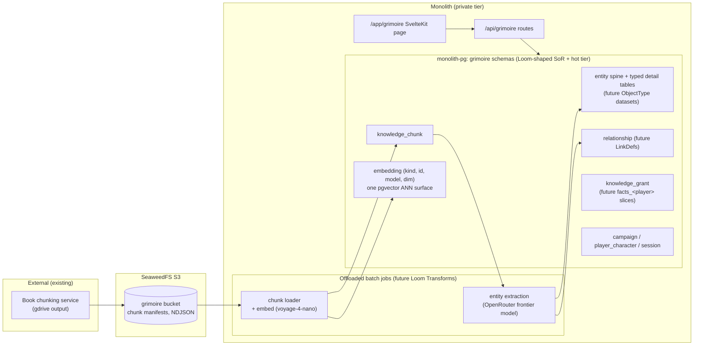

# ADR 012: Grimoire Postgres-First, Loom-Shaped

**Author:** Joe McGinley
**Status:** Accepted
**Created:** 2026-07-02
**Relates to:** [ADR 011: Grimoire Hot-Tier Schema on Postgres](011-grimoire-hot-tier-schema.md), [ADR 010: FastMonolith Modular Framework](010-fastmonolith-modular-framework.md), [projects/grimoire/loom-mapping.md](../../../projects/grimoire/loom-mapping.md)

---

## Problem

[loom-mapping.md](../../../projects/grimoire/loom-mapping.md) fixes Grimoire's target architecture: Loom (Iceberg) as the governed durable system of record, with a disposable Postgres hot tier checked out per game session. ADR 011 fixes the hot-tier schema. The implementation plan (loom-mapping §7.1) orders the build starting from the Loom side: ontology + ingest into Iceberg first, then checkout, play, check-in, monolith integration.

That ordering front-loads the slowest, least iterable work. Nothing user-visible exists until three integration seams (Loom ontology, Arrow Flight checkout, check-in orchestration) all work. Meanwhile the parts that need fast iteration (the visibility model, the API surface, the ingest data shape, retrieval quality) are all hot-tier-side and testable entirely in Postgres.

A second development since §7.1 was written: the sourcebook corpus problem is partly solved externally. A separate service already chunks D&D books; its output can be piped to S3. So v1 ingest is "load externally produced chunks and enrich them", not "build an extraction pipeline from raw PDFs".

The question: can we start Postgres-only without painting ourselves out of the Loom target?

---

## Decision

**Build Grimoire entirely in the monolith's Postgres first, keeping every schema and semantic choice Loom-shaped, and defer the Iceberg migration.** Postgres temporarily plays both roles: durable system of record and hot tier. The checkout / check-in loop degenerates to a no-op while both roles live in one database; when Loom is adopted, migration is a re-homing of the durable role, not a redesign.

"Loom-shaped" is a compatibility contract, enforced by construction:

1. **Types mirror ObjectTypes 1:1.** One typed detail table per `entity_type` (ADR 011's CTI schema), with queryable scalars as real columns, matches Loom's one-typed-Iceberg-table-per-ObjectType (loom-mapping §3.1). Irregular nested payloads (`actions[]`, `traits[]`) stay `jsonb`, the future struct columns. `KnowledgeChunk` is a first-class type with a vector column (§3.3).
2. **Relationships mirror LinkDefs.** The single `relationship` edge table with `rel_type` is exactly Loom's `LinkBacking::JoinTable` shape (§3.2). Traversal is recursive SQL in both worlds.
3. **Grants express slice membership.** The `knowledge_grant` overlay (ADR 011) is the materialized form of Loom's dataset partitioning: `is_global = true` rows are the `global` dataset, and a grant row keyed `(entity_id, player_character_id, grant_scope)` records what would be written into that character's `facts_<player>` dataset (`full` = whole row, `partial` = `revealed_details`, `name_only` = recognition stub) per §3.4. Migration serializes grant rows into per-character datasets; the read predicate `is_global OR granted-to-me` is unchanged.
4. **Embeddings carry lineage.** Every `embedding` row records `model` and `dim` alongside the vector, and its source row is addressable via `(embeddable_kind, embeddable_id)`. This is the reproducibility contract Loom's vector columns require (§5: model version + source snapshot). We reuse the monolith's existing embedding path (`shared/embedding.py`, `voyage-4-nano`, 1024-dim pgvector), which closes the §9 "embedding model + dim" open decision.
5. **Session deltas stay check-in-shaped.** Mutable writes are keyed by session where they occur, and the single-active-session-per-campaign invariant is enforced from day one. When check-in becomes real, the session delta is already a well-defined unit (loom-mapping §2.4).
6. **Ingest stages are Transform-shaped.** The enrichment pipeline (load chunks, embed, extract entities, link mentions) runs as monolith offloaded batch jobs, each stage a discrete read-snapshot / compute / write step with recorded provenance. These become Loom Transforms (§4) mechanically.

Two further decisions ride along:

**Ingest source is the external chunker via S3.** A dedicated bucket receives chunk output (NDJSON manifest per book) piped from the external chunking service. A loader job maps chunks into `knowledge_chunk` + `embedding` rows; an extraction job calls a frontier model via OpenRouter to populate typed entity tables, mentions, and relationships from those chunks. Grimoire does not build its own PDF/chunking pipeline.

**Grimoire lands as a private-tier monolith domain module** (ADR 010): `projects/monolith/grimoire/`, routes at `/api/grimoire`, registered on the private binary only, UI as an `/app/grimoire` page in the monolith frontend. Not in the public ALLOWED_PREFIXES.

| Aspect                   | loom-mapping §7.1 (target ordering)          | Decided (v1)                                                      |
| ------------------------ | -------------------------------------------- | ----------------------------------------------------------------- |
| Durable system of record | Loom / Iceberg from step 1                   | Monolith Postgres, Loom-shaped; Iceberg deferred                  |
| Checkout / check-in      | Arrow Flight hydrate + per-dataset flush     | No-op (both roles in one database); seams preserved in the schema |
| Corpus ingest            | extract -> resolve -> chunk -> embed -> link | External chunker -> S3 -> loader + OpenRouter extraction jobs     |
| Embedding model          | Open (§9)                                    | Reuse monolith KG path: `voyage-4-nano`, 1024-dim, pgvector       |
| App tier                 | Monolith module (step 5)                     | Same, built first, not last                                       |
| Realtime / voice         | Open (§9)                                    | Out of v1 scope, unchanged as an open question                    |

---

## Architecture

The read path is ADR 011's, unchanged: player-scoped queries apply `is_global OR granted-to-me`, vector search runs over the generic `embedding` table filtered to readable ids, `name_only` grants are recognition-only (suppressed from retrieval). The DM tier omits the predicate.

---

## Alternatives Considered

- **Follow §7.1's ordering (Loom first).** Slowest path to anything visible; every iteration on data shape or retrieval quality would round-trip through Loom ontology changes. Rejected for velocity; the target is unchanged.
- **Postgres-first but free-form (ignore Loom shapes, migrate "later").** Fastest week one, but re-introduces the polymorphic-jsonb drift ADR 011 explicitly closed, and turns the eventual migration into a redesign. Rejected: the compat contract costs almost nothing now.
- **Build the ingest pipeline from raw PDFs in-repo.** Duplicates the external chunking service that already works. Rejected; consume its output instead.
- **Local inference (Qwen) for extraction instead of OpenRouter.** Available, but structured extraction quality on dense rulebook text is the risk axis of the whole corpus; a frontier model via OpenRouter is a one-secret, pay-per-use way to de-risk it. Local models remain a drop-in later since extraction is one job boundary.

## Security

Baseline per `docs/security.md`. Specifics:

- **OpenRouter API key** and S3 credentials via `OnePasswordItem` CRDs, never in values files.
- **Private tier only:** `/api/grimoire` is not in the public tier ALLOWED_PREFIXES; the UI page rides Cloudflare Access on the private origin. CI's public-route test enforces this by construction.
- **Chunk content is licensed book text.** It must never be served on the public tier or embedded in public RAG surfaces; it stays in grimoire tables, separate from the `knowledge` domain's public chunks.
- Per-player visibility is game mechanics, not a security boundary; the security boundary is the private tier itself.

## Risks

| Risk                                                              | Likelihood | Impact | Mitigation                                                                                        |
| ----------------------------------------------------------------- | ---------- | ------ | ------------------------------------------------------------------------------------------------- |
| Schema drifts from Loom shapes as features iterate                | Medium     | Medium | The compat contract above; ADR 011's CTI schema is the reviewed reference on every migration      |
| Extraction quality poor on rulebook chunks                        | Medium     | Medium | Extraction is one job boundary; iterate prompts/models via OpenRouter without touching the schema |
| External chunk format churns                                      | Medium     | Low    | Loader validates a versioned manifest schema; bad rows dead-letter, not fail the batch            |
| "Deferred" Iceberg migration never happens and check-in seams rot | Medium     | Low    | Acceptable: the product works Postgres-only; the seams cost nothing to keep                       |
| Licensed text leaks to public tier                                | Low        | High   | Private-tier registration + public-route CI test; grimoire chunks kept out of `knowledge` tables  |

## Open Questions

1. Realtime fan-out and the voice path for live sessions (unchanged from loom-mapping §9; out of v1 scope).
2. Entity resolution across books (alias merging) once multiple books are loaded: v1 extracts per-chunk with name-based dedup; a proper resolve stage is a follow-up Transform-shaped job.
3. Exact trigger for the Iceberg migration (corpus size, multi-campaign scale, or Loom hosting the personal KG first).

## Amendment (2026-07-09): public tier serves open-licensed books in full, copyrighted books derived-only

The original decision above kept the whole corpus private-tier-only, on the
premise that all chunk content is licensed book text. A public read-only
Grimoire tier was subsequently built, which served every book's verbatim
text behind Turnstile plus `noindex` as an accepted demo-period compromise. That compromise does not hold up for wider sharing: reconstructing
copyrighted sourcebooks in full is a takedown risk regardless of a robots hint.

The refined policy draws the line by license, not by tier:

- **Open-licensed books are readable in full on the public tier.** Only books
  released under a redistribution license (Creative Commons CC BY 4.0 or the
  ORC License) may serve verbatim text and page images publicly: the two D&D
  System Reference Documents (5.1, 5.2), and once ingested, the Black Flag
  Reference Document (Kobold Press) and the A5E SRD (EN Publishing). The public
  Reader shows the license attribution these licenses require.
- **Copyrighted books are listed but Reader-locked.** They still appear in the
  public Library (the breadth of the corpus is the showcase) and still power
  the transformative surfaces (Entities, Explore, Chat: derived data, graph
  structure, and synthesized answers with short cited snippets, not verbatim
  reproduction). Their full text and page scans are never served publicly.
- **The gate is a data flag, fail-closed.** `grimoire.book.copyrighted_content`
  (default TRUE) is the authoritative gate, enforced in `grimoire.router_public`
  on the three reproduction endpoints (`/books/{id}/read`, `/chunks/{id}`,
  `/chunks/{id}/image`) with a 403. A newly ingested, unclassified book is
  copyrighted until proven open, so a forgotten classification locks the Reader
  rather than leaking text. `ingest.OPEN_LICENSE_BOOK_IDS` classifies the known
  open slugs at load time so future open-book ingests self-unlock.

This narrows, but does not remove, the "licensed text leaks to public tier"
risk in the table above: the leak surface is now exactly the copyrighted-book
Reader endpoints, and they are gated by construction and by test
(`grimoire/router_public_test.py::TestCopyrightGate`).

## References

| Resource                                                                | Relevance                                                |
| ----------------------------------------------------------------------- | -------------------------------------------------------- |
| [loom-mapping.md](../../../projects/grimoire/loom-mapping.md)           | Target architecture this ADR defers but stays shaped for |
| [ADR 011](011-grimoire-hot-tier-schema.md)                              | The schema being promoted from hot tier to SoR           |
| [ADR 010](010-fastmonolith-modular-framework.md)                        | Module contract Grimoire lands under                     |
| [data-architecture.md](../../../projects/grimoire/data-architecture.md) | Original domain model (partially superseded)             |
