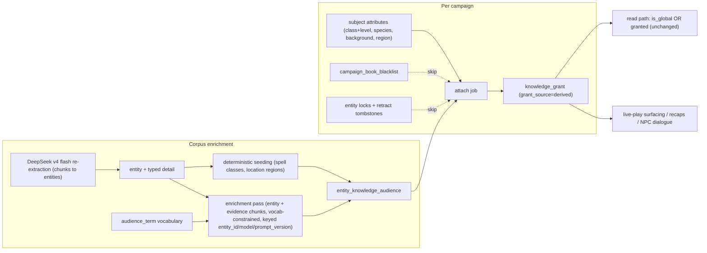

# ADR 013: Grimoire Knowledge Audiences: Corpus-Derived Character Knowledge as Compiled Grants

**Author:** Joe McGinley
**Status:** Accepted
**Created:** 2026-07-05
**Relates to:** [ADR 011: Grimoire Hot-Tier Schema on Postgres](011-grimoire-hot-tier-schema.md), [ADR 012: Grimoire Postgres-First, Loom-Shaped](012-grimoire-postgres-first-loom-shaped.md), live-play design (PR #3214)

---

## Problem

The extraction pipeline produces a flat, global corpus: every extracted entity is `is_global = true` and every player sees the same thing. But the live-play program needs to know what each **character** already knows in-fiction. A cleric of Kelemvor recognises the symbol on the door. A Baldur's Gate native knows the Flaming Fist. An elf knows things about elves that a human sailor does not. A level 9 wizard knows spells a level 1 wizard has never heard of.

Today the only per-character knowledge mechanism is the manual `knowledge_grant` row (ADR 011): the DM grants entity X to PC Y at scope `full | partial | name_only`. Nothing derives baseline knowledge from who the character is. The live-play design gestures at this (FR-CHAR-3: "background text generates personal-knowledge entities and grants") without specifying the mechanism, and the post-MVP goal of knowledge-enriched NPC interactions ("what does this innkeeper actually know?") needs the same machinery pointed at NPCs.

With the DeepSeek v4 flash re-extraction pass planned over the full 33-book corpus, this is the moment to decide how corpus-derived knowledge is represented, produced, and attached, so enrichment can run as a follow-on pass rather than a redesign.

---

## Decision

**1. Entities carry knowledge audience rules; a deterministic job compiles them into ordinary grants.** A new `entity_knowledge_audience` table is the corpus-level source of truth: rows of the form "(entity) is known to (audience term) at (scope), optionally gated by min level", with provenance (deterministic, LLM, or DM-authored) and an evidence chunk reference. A deterministic, idempotent **attach job** matches a subject's attributes (class + level, species, background, home region) against these rules and writes ordinary `knowledge_grant` rows tagged `grant_source = 'derived'`. The read predicate (`is_global OR granted-to-me`), scope projection, `name_only` suppression, DM retract ledger, and the ADR 012 Loom compat contract (grants express `facts_<player>` slice membership) are all untouched. Rules are the truth; grants are the compiled artifact; recompiling is always safe.

**2. Derived grants record character knowledge; they do not gate visibility.** The corpus stays browsable: players read the Monster Manual out-of-fiction, and the library and entity index remain global. Derived grants are the signal consumed by the surfacing lanes ("Known to you"), recap generation, and future NPC dialogue, recording what the character knows rather than what the player may see. The one deliberate visibility gate is the **per-campaign book blacklist**: the DM can blacklist a campaign book (for example the campaign's adventure module) and players in that campaign cannot browse its `is_global` entities or chunks until individual entities are revealed through grants, which override the blacklist. The attach job skips blacklisted books entirely: spoiler control always beats plausible background knowledge.

**3. Depth reuses grant scopes; audience keys come from a curated vocabulary; the knower is generic.** "Minimum" knowledge is `name_only` (recognition), "general knowledge" is `partial` (with `revealed_details` carrying the commonly-known subset), and specialist class-and-level knowledge is `full` gated by `min_level`. Audience keys (regions, species, backgrounds, classes) live in a closed, DM-extendable `audience_term` vocabulary so subject attributes and audience rules can never drift apart on spelling. The attach job takes a subject attribute tuple, not a `player_character` row: the MVP feeds it PCs, and the post-MVP NPC path feeds it tuples derived from NPC attributes to materialize "what this NPC knows" with the same rules.

**4. Rules are produced by deterministic seeding plus a separate entity-level LLM pass.** Structured columns that already encode audiences are seeded mechanically with no LLM: spell class lists and levels, location regions. Everything lore-shaped (deity devotees, faction reputations, creature folklore) comes from a dedicated enrichment pass, one call per extracted entity with its mention chunks as evidence, constrained to the vocabulary, run on a cheap model (DeepSeek v4 flash class). The pass is keyed by an `(entity_id, model, prompt_version)` marker mirroring `chunk_extraction` semantics, using the explicit prompt-version mechanism (not a raw prompt hash) so prompt iteration on main does not force a corpus-wide re-run until the version is deliberately bumped. It runs after the re-extraction pass settles and re-runs independently of it.

| Aspect | Today | Decided |
| ------ | ----- | ------- |
| What a character "already knows" | Nothing; only manual DM grants | Audience rules compiled into `derived` grants from class/level, species, background, region |
| Source of truth | n/a | `entity_knowledge_audience` rows on entities, with evidence chunk provenance |
| Read predicate | `is_global OR granted` | Unchanged (plus campaign book blacklist exclusion for spoiler control) |
| Knowledge depth vocabulary | `full / partial / name_only` grant scopes | Same scopes, reused |
| Audience taxonomy | n/a | Curated `audience_term` vocabulary, LLM constrained to it |
| Knower | PC only (`knowledge_grant`) | Generic subject attribute tuple; PCs now, NPCs post-MVP |
| Spoilers | Everything global is visible to everyone | Per-campaign book blacklist; grants override it for revealed entities |

## Entity-type to audience mapping

Which entity types carry audience rules, which audience kinds apply, and where the rules come from:

| Entity type | Audience kinds | Typical scope | Producer |
| ----------- | -------------- | ------------- | -------- |
| `spell` | class, with `min_level` from spell level | `full` | Deterministic (`entity_spell.classes`, `level`) |
| `location` | region (containing or neighbouring), background (sage, outlander) | `partial`; `name_only` for distant-but-famous places | Deterministic (`entity_location.region`) + LLM |
| `deity` | region, species, background (acolyte), class (cleric, paladin, with `min_level`) | `partial`; `full` for devoted classes | LLM |
| `faction` | region, background (soldier, criminal, guild artisan) | `partial` or `name_only` | LLM |
| `creature` | region (native habitat), species (kin and ancestral enemies), background, class (ranger favored-terrain style, with `min_level`) | `name_only` baseline; `partial` for common or local creatures | LLM |
| `npc` | region (locals know public figures) | `name_only` or `partial` | LLM |
| `item` | class, background | `name_only` or `partial` | LLM |

MVP enrichment targets only `source_type = 'extracted'` entities (all `is_global = true` today), so no DM campaign secret can leak through a derived grant. Homebrew entities carry audience rules only when the DM authors them explicitly.

---

## Architecture

Attach-job semantics that make compilation safe:

- **Idempotent upsert**, re-runnable on any trigger (subject created or attributes changed, enrichment run completed, vocabulary or rules edited). Level-up simply matches more `min_level` rules.
- **Never touches manual grants.** If a manual and a derived grant would both apply, the manual row stays authoritative; derived rows are only ever inserted or reconciled against other derived rows.
- **Respects DM control**: locked entities, retract tombstones (a DM-deleted derived grant is never re-added), and blacklisted books are all skipped.
- **Provenance**: derived grants carry `derived_from_audience_id`, so the UI can render "known because: elf" scope chips and the DM ledger can show why a card surfaced.
- **Tunable quality gates** (the known name-dedup homonym risk is mitigated here, not left implicit): LLM-origin rules compile only at or above a confidence threshold (`GRIMOIRE_ATTACH_MIN_CONFIDENCE`; deterministic and DM rules always pass), and entities that look like name-dedup merges (mentions spanning multiple source books) are treated as homonym-suspect, with derived grants capped at `name_only` until the entity is resolved. Recognition still works; merged detail cannot leak. Both gates live at attach time rather than in the read predicate because the attach job is an idempotent recompile: tuning during real play is "change the knob, re-run the job", with no query-path complexity. This mirrors the live-play per-campaign auto-reveal confidence threshold, so the DM has one mental model for "how sure must the pipeline be".

---

## Alternatives Considered

- **Evaluate audiences at read time** (predicate grows `OR audience-matches-my-attributes`): rejected because it duplicates `name_only` suppression, complicates every query, makes DM retract/lock semantics special cases, and creates knowledge that exists in no Loom `facts_<player>` slice, breaking the ADR 012 check-in contract.
- **LLM writes per-PC grants directly**: rejected because enrichment runs before PCs exist and per-PC LLM output is neither reproducible nor auditable; the rule/compile split keeps judgment (LLM emits rules with evidence) separate from mechanism (deterministic attach).
- **Fold audience emission into the re-extraction prompt**: rejected because audience judgment is entity-level (needs the whole enriched entity, not one chunk), chunk-level outputs need merge rules, and it couples two prompts' iteration cadences.
- **Deterministic derivation only, no LLM**: rejected because the MVP target (background, species, and regional lore knowledge) lives in prose, not typed columns; kept as the seeding layer where structure already exists.
- **Free-text audience keys, normalize later**: rejected because attribute-to-rule matching on unnormalized strings is exactly where silent misses come from.
- **A richer knowledge-depth enum** (heard_of / general / expert) instead of grant scopes: deferred, recorded as a future improvement to revisit when NPCs onboard and dialogue nuance needs it; MVP maps cleanly onto existing scopes with zero new projection code.
- **Character knowledge gates browsing** (players only see what their character knows): rejected as hostile to how tables actually play; the campaign book blacklist covers the real spoiler problem.

## Security

Baseline per `docs/security.md`. Specifics:

- The enrichment pass sends **corpus content only** (extracted entities and book chunks) to the extraction model; no player data, transcripts, or campaign material is included, so an external model endpoint is acceptable here even though live-play generation is in-cluster-only (NFR-3).
- The book blacklist is enforced in backend query predicates alongside the existing visibility predicate, never frontend-only (NFR-7). Full enforcement on the library/chunk read path depends on live-play Phase 1 identity (`app_user` / `campaign_member`), since today's private tier has no authenticated campaign viewpoint.
- Derived grants can only widen what a player sees within already-global content; they cannot expose `is_global = false` entities because MVP enrichment does not target them.

## Risks

| Risk | Likelihood | Impact | Mitigation |
| ---- | ---------- | ------ | ---------- |
| LLM over-grants (characters "know" too much, table feels spoiled) | Medium | Medium | Scope ceilings per entity type, confidence stored on rules, DM retract tombstones, per-entity locks, blacklist for the campaign book |
| Vocabulary gaps drop real audiences (unknown key emitted) | Medium | Low | Dropped keys are logged as vocabulary candidates for DM review, then a re-run picks them up |
| Attach-job triggers missed (stale grants after level-up) | Medium | Low | Job is idempotent and cheap; a scheduled reconcile sweep bounds staleness |
| Derived grants pollute the DM ledger | Low | Low | `grant_source` discriminator; ledger filters and renders provenance |
| Name-dedup entity spine attaches audiences to merged homonyms | Medium | Medium | Explicitly mitigated at attach time with tunable gates (see Architecture): homonym-suspect entities (mentions spanning multiple source books) capped at `name_only`, LLM rules gated by `GRIMOIRE_ATTACH_MIN_CONFIDENCE`; evidence chunk refs make bad merges auditable; re-extraction improves the spine first, and proper entity resolution (ADR 012 open question) removes the cause |

## Open Questions

1. Compound audience rules ("cleric **of Kelemvor**", "elf **from Baldur's Gate**"): MVP is single-attribute rules with optional `min_level`; revisit if single-attribute granularity proves too coarse.
2. Region taxonomy granularity (settlement vs region vs continent) and whether region containment ("Baldur's Gate is in the Sword Coast") should expand matches transitively.
3. Whether NPC subjects materialize into `knowledge_grant` with a generalized subject column or a parallel `npc_knowledge` table (decide when NPCs onboard, together with the depth enum).
4. Blacklist enforcement on the library/chunk read path is blocked on live-play Phase 1 identity; until then it can only be enforced for grant-filtered entity reads.
5. Gate defaults are guesses until real play: the initial `GRIMOIRE_ATTACH_MIN_CONFIDENCE` value and whether "mentions span multiple books" is the right homonym-suspect signal (it will flag legitimately cross-book entities like famous deities) are expected to be tuned during actual use.

## References

| Resource | Relevance |
| -------- | --------- |
| [ADR 011](011-grimoire-hot-tier-schema.md) | Grant overlay, scopes, visibility predicate this ADR compiles into |
| [ADR 012](012-grimoire-postgres-first-loom-shaped.md) | Loom compat contract that rules-compiled-to-grants preserves |
| Live-play design (PR #3214) | FR-CHAR-3, surfacing lanes, ACL matrix, auto-reveal safeguards this composes with |
| Extraction cache-key design | Marker/cache-key semantics the enrichment pass mirrors |
