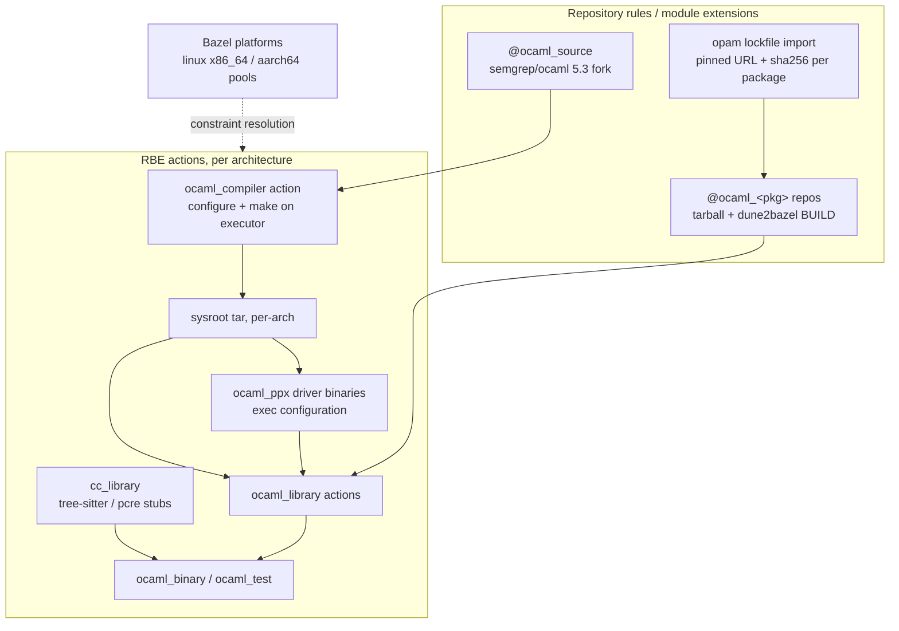

# ADR 004: Scale the custom OCaml ruleset toward Semgrep Pro

**Author:** Joe McGinley
**Status:** Accepted (superseded in part)
**Created:** 2026-06-10
**Superseded in part by:** ADR 007 -- Open Question 3 (first-party BUILD
generation) is now decided rather than deferred.

---

## Problem

The end goal of `bazel/ocaml` is building Semgrep (eventually Semgrep Pro) with
Bazel on this repo's infrastructure. That imposes two hard requirements:

1. **Many architectures.** Semgrep ships dual-arch at minimum (x86_64 +
   aarch64), matching this repo's apko convention.
2. **Standard OCaml dependency semantics.** Semgrep is a large dune workspace
   with a deep opam closure; the ruleset must consume real opam packages and
   real dune metadata, not hand-transcribed targets.

The current ruleset is a deliberate toy (one whole-library compile action,
stdlib-only `opam_deps`, a dune translator that handles a single pure
`(library)` stanza). The question is which path to scale it: grow the custom
ruleset, or adopt the existing community ruleset (obazl `rules_ocaml`).

Two infrastructure constraints frame everything:

- **BuildBuddy RBE here does not honor per-action `container-image` execution
  properties** (verified empirically; see `bazel/ocaml/toolchain.bzl`). The
  toolchain cannot live in an executor image. It must travel with the action.
- **There are no darwin executors** in the BuildBuddy `workflows` pool. Any
  macOS story is a different CI substrate, out of scope for this ADR.

### Empirical gap inventory (Semgrep CE, 2026-06-10)

`dune2bazel.py` was run over all 196 dune files in a Semgrep CE checkout.
**0 of 196 translate today.** The full field/stanza inventory:

| Finding                                            | Count                                                                            | Implication                                                        |
| -------------------------------------------------- | -------------------------------------------------------------------------------- | ------------------------------------------------------------------ |
| `(library)` stanzas                                | 188                                                                              | Library rule is the right center of gravity                        |
| `(preprocess (pps ...))`                           | 167 stanzas                                                                      | **ppx is the dominant blocker**, not an edge case                  |
| `(wrapped false)`                                  | 173 of 174 `wrapped` fields                                                      | First-party tree is flat-namespace; the flat compile model fits    |
| Top ppx                                            | `ppx_deriving.show` (159), `ppx_profiling` (52), `ppx_hash` (30), `lwt_ppx` (20) | ppxlib driver support is mandatory                                 |
| In-tree ppx rewriters                              | `commons.ppx`, `profiling.ppx`, `telemetry.ppx`                                  | ppx drivers must be buildable from source, not only from opam      |
| Codegen stanzas                                    | 12 `rule`, 10 `ocamllex`, 9 `menhir`                                             | Bounded codegen feature set, each a named rule                     |
| Direct opam deps (`semgrep.opam`)                  | ~75                                                                              | Transitive closure is hundreds; hand-pinning is untenable          |
| `tree-sitter-lang.*` libraries                     | per-language grammar packages                                                    | Large generated C with include dirs; real C stub support needed    |
| `foreign_stubs`                                    | 1 (`libs/murmur3`)                                                               | First-party C is rare; third-party C (pcre, tree-sitter) dominates |
| Virtual libraries (`virtual_modules`/`implements`) | 1 pair (`lwt_platform`)                                                          | Niche, model late                                                  |
| `inline_tests`                                     | 5                                                                                | `ppx_inline_test` runner, after ppx lands                          |

Key inversion from prior assumptions: module wrapping is **not** the wall for
Semgrep's own code (it is `(wrapped false)` flat by house style). Wrapping
matters at the **opam boundary**, where third-party dune libraries are wrapped
and ship colliding internal module names (the documented `Fmt`/`Str` collision
between `re` and `fmt` is the canary).

---

## Decision

**Scale the custom `bazel/ocaml` ruleset. Do not adopt obazl.**

The deciding constraint is hermeticity on this RBE. obazl resolves dependencies
by importing a host-built opam switch into Bazel repositories. On this
infrastructure that switch would be built on the workflow runner and executed on
the RBE executor, exactly the glibc mismatch the current toolchain design was
built to escape (compiler built _as an action, on the executor_). Adapting
obazl's import model to executor-built artifacts would mean rewriting its
foundation while inheriting its complexity and bus factor. The hard
RBE-specific problem is already solved in the custom toolchain; the remaining
work (dune translation, ppx, opam closure) must be built either way, because
obazl does not translate dune metadata itself.

The scaling path, anchored to the inventory above:

| Aspect             | Today (toy)                                          | Decided                                                                                                                                                          |
| ------------------ | ---------------------------------------------------- | ---------------------------------------------------------------------------------------------------------------------------------------------------------------- |
| ppx                | None                                                 | `ocaml_ppx` rule: ppxlib drivers built as exec-config binaries, threaded through compiles via `-ppx`; supports in-tree rewriters                                 |
| opam closure       | Hand-pinned list (1 package), stdlib-only resolution | Lockfile import: pinned universe generated from an opam solve, every package built from source via dune translation                                              |
| Module namespacing | Flat compile only                                    | Flat for `(wrapped false)` (Semgrep house style); dune-style `Lib__Module` wrapping for wrapped third-party libraries                                            |
| dune translation   | Single pure `(library)` stanza                       | Multi-stanza translator covering the inventory: `preprocess`, `modules`, `flags`, `executables`/`tests`, `rule`, `ocamllex`, `menhir`                            |
| C stubs            | Flat `.c` list, no headers, no include paths         | Delegate C compilation to `cc_library`; link via `foreign_archives` semantics (tree-sitter grammars, pcre)                                                       |
| Architectures      | Single unconstrained toolchain (executor-native)     | One executor-native toolchain **per arch** via Bazel platforms + BuildBuddy executor pools (linux x86_64 + aarch64). No cross-compilation. No macOS on this RBE. |
| Action granularity | One action per library                               | Keep per-library actions; revisit per-module only if RBE cache hit rates prove insufficient                                                                      |
| Sysroot delivery   | Full `make install` tar extracted per action         | Pruned + compressed sysroot; extract-once strategies (persistent worker) if action overhead dominates at scale                                                   |

Two sub-decisions worth making explicit:

**Multi-arch = per-arch native executors, not cross-compilation.** OCaml
cross-compilation in the 5.3 era is partially landed upstream and practically
painful (per-target compiler forks). The existing design ("build the compiler
on the executor it runs on") generalizes cleanly: one sysroot per arch, built
on that arch's executor pool, selected by `exec_compatible_with` /
`target_compatible_with` constraints. BuildBuddy provides linux arm64
executors, which covers the dual-arch requirement. This is the same shape the
repo already uses for dual-arch apko images.

**The reject-loudly translator stays.** `dune2bazel.py` exits with a precise
error on any dune feature it does not model. That property produced the gap
inventory above and keeps silent mistranslation impossible; every future
feature lands by deleting a rejection.

---

## Architecture

---

## Alternatives Considered

- **Adopt obazl `rules_ocaml`.** Rejected: its opam-switch import model is
  host-built and non-hermetic, which this RBE cannot tolerate (glibc mismatch,
  no custom executor images); effectively single-maintainer; does not solve
  dune translation, which is the bulk of the remaining work anyway.
- **Run dune itself inside one big Bazel action.** Rejected: forfeits remote
  caching and parallelism across the dependency graph, makes the opam universe
  a single opaque input, and reduces Bazel to a cron job around dune.
- **Custom RBE executor image with OCaml preinstalled.** Rejected: verified
  that this BuildBuddy deployment does not honor per-action `container-image`;
  a custom executor pool image remains a possible future optimization, not a
  dependency-semantics answer.
- **OCaml cross-compilation for multi-arch.** Rejected: upstream cross support
  is immature at 5.3; per-target compiler forks would dwarf the ruleset itself.
  Per-arch native executors achieve the same outcome with existing machinery.
- **Hand-vendoring the opam closure (status quo extended).** Rejected: ~75
  direct deps, hundreds transitive; hand-pinning does not scale and loses
  solver-consistent versions.

## Security

Baseline per `docs/security.md`. This design is from-source and pinned
throughout: the compiler is a commit-pinned clone of the Semgrep OCaml fork,
opam packages are checksum-pinned release tarballs (dune-release `.tbz` assets,
sha256-verified), and nothing executes fetched binaries. ppx rewriters execute
at build time as Bazel actions on the RBE executor (same trust boundary as any
compiler plugin); they enter the build only through the pinned lockfile.

## Risks

| Risk                                                                                 | Likelihood | Impact | Mitigation                                                                                      |
| ------------------------------------------------------------------------------------ | ---------- | ------ | ----------------------------------------------------------------------------------------------- |
| ppx driver semantics (ppxlib linking, rewriter composition) are deeper than expected | Medium     | High   | It is the first milestone; fail fast on `ppx_deriving.show`, the 159-use case                   |
| Per-action sysroot extraction dominates wall-clock at hundreds of targets            | High       | Medium | Prune + compress sysroot first; persistent workers or executor-pool image second                |
| BuildBuddy arm64 pool behaves differently (no executors, property quirks)            | Medium     | Medium | Prove the platform split on the existing toy examples before any Semgrep code                   |
| Wrapped third-party libraries hide more dune semantics (alias modules, shadowing)    | Medium     | Medium | Wrapping is implemented against real packages (`re`, `yojson`, `lwt`) with collision tests      |
| Semgrep Pro adds dune features absent from CE                                        | Medium     | Low    | The translator rejects loudly; every new feature surfaces as a named error, not silent breakage |
| Upstream Semgrep moves compiler pins / dune version                                  | Low        | Low    | Compiler source is commit-pinned; bumps are deliberate                                          |

## Open Questions

1. ~~Lockfile format: parse `opam switch export`, or maintain a curated
   `packages.bzl` generated by a small solver-driven tool?~~ **Decided at
   implementation time:** a committed `bazel/ocaml/opam/lock.json` whose
   url/sha256 pins mirror opam-repository metadata, maintained by
   `update_lock.py` (a workstation tool, never a build action). The ADR's
   "solver-consistent, pinned, from-source" requirement stands.
2. Whether `ocamlfind` ever enters the picture, or archive paths are always
   resolved structurally from package metadata. The toolchain's `use_ocamlfind`
   flag is currently dead code.
3. ~~At what scale per-library actions stop being acceptable and a per-module
   (Gazelle-style) generator pays for itself.~~ **Decided by ADR 007:**
   first-party BUILD *generation* (Gazelle) is required at the engine's scale
   and is now a committed workstream. This settles BUILD generation only --
   per-library action granularity still stands (see the decision table); the
   generator may emit per-module targets later, gated on cache-hit data.

## References

| Resource                                                                               | Relevance                                     |
| -------------------------------------------------------------------------------------- | --------------------------------------------- |
| `bazel/ocaml/README.md`                                                                | Current toy design and its rationale          |
| Prior toolchain productionization notes                                                | opam/ppx toolchain groundwork this ADR builds on |
| [semgrep/ocaml `5.3.0-semgrep`](https://github.com/semgrep/ocaml)                      | The pinned compiler fork the toolchain builds |
| [obazl rules_ocaml](https://github.com/obazl/rules_ocaml)                              | The community ruleset evaluated and rejected  |
| [Dune library docs](https://dune.readthedocs.io/en/stable/reference/dune/library.html) | Semantics the translator models               |
| [ppxlib](https://github.com/ocaml-ppx/ppxlib)                                          | Driver model for the ppx rule                 |
