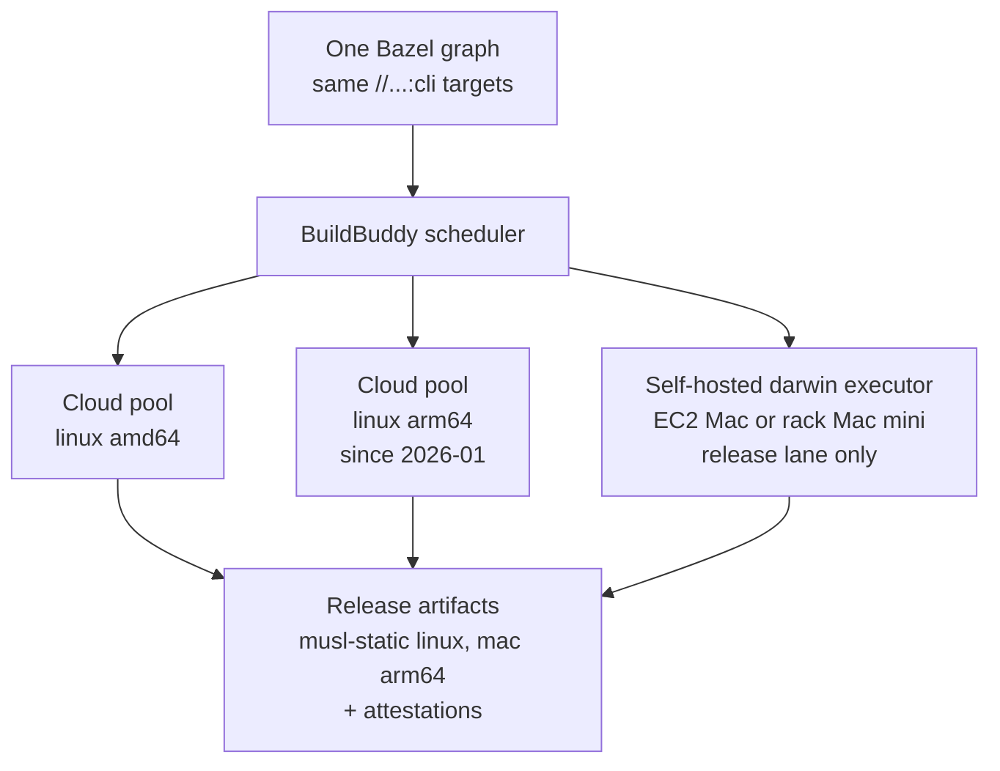

# ADR 008: CLI multi-platform distribution via native execution platforms

**Author:** Joe McGinley
**Status:** Accepted
**Created:** 2026-06-12
**Refines:** [ADR 006](006-extensible-multiarch-ocaml-toolchains.md) (extends its per-arch model to CLI distribution and resolves its pool-availability question)

---

## Problem

The OCaml ruleset (ADR 004/005/006) will eventually produce a user-distributed
CLI (Semgrep-derived), not just cluster images. That changes the target matrix:
linux x86_64/arm64, macOS arm64 (must-have within a year), possibly macOS
x86_64 and Windows later. ADR 006 fixed the per-arch mechanism for the cluster
but left distribution unaddressed, and the obvious gap was uncomfortable: OCaml
appeared to force "Bazel for linux plus a separate non-Bazel mac lane", a
fragmented release story.

Deep research (June 2026, multi-source with 3-vote adversarial verification of
the load-bearing claims) re-examined the strategy space: upstream OCaml
cross-compilation, cross tooling, wasm, QEMU emulation, and how peer OCaml
CLIs actually ship. This ADR records the verified findings and the decided
direction.

## Decision

**One Bazel graph, multiple native execution platforms, all scheduled through
BuildBuddy.** The build definition stays singular; only the execution platform
varies per target platform.

| Target | Execution | Notes |
| --- | --- | --- |
| linux x86_64 | BuildBuddy cloud executors (today's pool) | unchanged |
| linux arm64 | BuildBuddy **cloud** arm64 executors (`Arch: arm64`) | cloud pool exists since 2026-01-15, un-gating ADR 006's Phase 7 with zero infra on our side |
| macOS arm64 | **Self-hosted BuildBuddy darwin executor on genuine Apple hardware** | EC2 Mac dedicated host or a rack Mac mini; choice deferred to implementation. Release-lane platform (nightly/tag builds), not per-PR CI |
| Windows | Out of scope until demand exists | semgrep's native MinGW-on-windows-runner pipeline is a proven template for our exact C-stub stack when needed |

Supporting decisions:

- **Post-5.4 consolidation option (not a prerequisite):** vanilla OCaml 5.4+
  can build a linux-x86_64 to linux-arm64 cross compiler (upstream CI-tested).
  Once our pin moves to 5.4 (semgrep upstream is moving before EoY), linux
  arm64 *builds* can consolidate onto the amd64 pool, keeping a small arm64
  test shard. This restores the single-pool uniformity the rest of the repo
  already has (Go cross-compiles via transitions; apko assembles prebuilt
  apks), and is a contained optimization on top of this decision.
- **Distribution layer:** musl-static linux binaries (the dune/unison pattern)
  rather than a glibc/manylinux matrix; GitHub artifact attestations on
  release tarballs (the dune pattern).
- **macOS is structurally different from linux arm64, and the plan accepts
  that.** A compile target is CPU + OS + ABI/libc, not an architecture. The
  aarch64 code generator is shared, but darwin means Mach-O + ld64 + mandatory
  code signing, and compiling/linking against libSystem and the Apple SDK,
  which the Xcode EULA ties to Apple hardware. That licensing fact, not a
  technical gap, is why no clean linux-to-macOS toolchain exists in any
  language ecosystem and why mac capacity means Apple hardware (which EC2 Mac
  provides legitimately).

## Architecture

## Verified findings

Load-bearing claims were adversarially verified (3 independent votes each,
primary sources):

| Finding | Status |
| --- | --- |
| BuildBuddy launched autoscaled cloud linux/arm64 RBE executors 2026-01-15; darwin/windows executors remain self-hosted only | 3/3 confirmed |
| Upstream OCaml CI cross-builds linux-x86_64 to aarch64-linux-gnu (plus mingw64, Android); no darwin target | 3/3 confirmed |
| The simplified cross machinery (PR #13526) ships in **5.4.0+**, not vanilla 5.3 (the "5.3 cross compiler" demo used backports) | 2/3 corrected the 5.3 claim |
| No publicly available linux-to-macOS toolchain for OCaml 5.x exists (osxcross-based repos frozen at 4.14; the zig attempt died at link errors and was abandoned) | confirmed (softened from "none working": one company privately crosses a 5.2 backport to macOS, host unspecified) |
| QEMU user-mode emulation: 5-20x slowdown on compiler workloads, documented Bazel breakage, no production RBE-under-QEMU precedent | confirmed |
| wasm_of_ocaml is mature for JS hosts (~2x native; Jane Street production) but the standalone WASI runtime is still an unmerged PR; C stubs are hand-written glue; semgrep retired its JS/wasm Windows path in favor of native | 3/3 confirmed |
| Every peer OCaml CLI (semgrep, dune, flow, unison, infer, ocamlformat) ships from native runners per OS/arch; none cross-compile; semgrep's arm64 wheels build on Depot native arm builders (QEMU as enabled fallback only) | confirmed (one secondary-source detail corrected) |
| semgrep ships native Windows since Fall 2025: native windows-2022 runner + MinGW-w64 + opam, keeping PCRE2 and tree-sitter as native DLLs | confirmed |

## Alternatives Considered

- **linux-to-macOS cross-compilation:** no public OCaml 5 toolchain, the one
  serious attempt (zig cc) abandoned at link errors, and the Apple SDK is
  EULA-bound to Apple hardware. Dead for the planning horizon.
- **QEMU emulation for foreign arches:** 5-20x on compiler-heavy work plus
  documented Bazel breakage. Even semgrep keeps it only as a fallback.
- **wasm distribution:** Node-shaped today (no merged WASI runtime), manual C
  stub glue, and the closest peer retired this approach. Retained as a future
  browser/playground option only.
- **A GitHub-Actions-only release lane outside Bazel:** loses hermeticity,
  RBE caching, and the single build definition; this fragmentation concern is
  what prompted the research.
- **Dropping macOS:** fails the stated must-have.

## Security

Baseline per `docs/security.md`. New surface: a self-hosted darwin executor
joins the build plane; its BuildBuddy API key should be scoped to that
executor role and the host treated as release infrastructure (patched,
access-controlled). Release artifacts gain GitHub artifact attestations.
Distributing macOS binaries will eventually require Apple Developer ID
signing/notarization (Gatekeeper); that pipeline is deliberately out of scope
here and tracked as an open question.

## Risks

| Risk | Likelihood | Impact | Mitigation |
| --- | --- | --- | --- |
| EC2 Mac economics (24h minimum dedicated-host billing) make the mac lane expensive if treated as always-on CI | Medium | Low | Release-lane only; scheduled allocate/build/release automation, or a rack Mac mini (no minimum, one-time cost) |
| Darwin executor is a pet (macOS updates, Xcode CLT, executor upgrades) | High | Low | One host, release-lane only; AMI/snapshot the known-good image |
| BuildBuddy cloud mac RBE turns out to exist and we built self-hosted unnecessarily | Low | Low | Ask BuildBuddy before provisioning; architecture is identical either way |
| 5.4 pin bump slips (cross consolidation deferred indefinitely) | Medium | Low | Consolidation is an optimization; the arm64 cloud pool path works on 5.3 today |
| macOS signing/notarization blocks first mac release | Medium | Medium | Resolve the Developer ID question before announcing mac support |

## Open Questions

1. EC2 Mac dedicated host vs rack Mac mini for the darwin executor (ops/cost
   preference; swappable later).
2. Apple Developer ID signing + notarization pipeline for distributed mac
   binaries.
3. Whether/when Windows demand justifies replicating semgrep's MinGW pipeline.

## References

| Resource | Relevance |
| --- | --- |
| [BuildBuddy: Remote Builds on linux/arm64](https://www.buildbuddy.io/blog/arm64-support/) | cloud arm64 executors (2026-01-15) |
| [BuildBuddy RBE platforms docs](https://www.buildbuddy.io/docs/rbe-platforms/) | `Arch` exec_property; darwin self-hosted only |
| [ocaml/ocaml build-cross.yml](https://github.com/ocaml/ocaml/blob/trunk/.github/workflows/build-cross.yml) | upstream-tested cross targets |
| [ocaml/ocaml PR #13526](https://github.com/ocaml/ocaml/pull/13526) | cross-compiler build simplification (5.4.0) |
| [discuss: OCaml 5.3 cross compiler](https://discuss.ocaml.org/t/building-an-ocaml-cross-compiler-with-ocaml-5-3/15918) | 5.3 needs backports |
| [discuss: zig as OCaml cross compiler](https://discuss.ocaml.org/t/early-work-experimenting-with-zig-as-a-cross-compiler-for-ocaml/16151) | linux-to-darwin attempt abandoned |
| [semgrep v1.100.0 release workflows](https://github.com/semgrep/semgrep/tree/v1.100.0/.github/workflows) | peer pipeline: native runners per platform |
| [semgrep windows.libsonnet](https://github.com/semgrep/semgrep/blob/develop/.github/workflows/libs/windows.libsonnet) | native Windows MinGW template (our C-stub stack) |
| [Tarides: wasm_of_ocaml optimisations (2026-02)](https://tarides.com/blog/2026-02-11-announcing-new-wasm-of-ocaml-optimisations/) | WASI still an open PR |
| [dune binary-distribution](https://github.com/ocaml-dune/binary-distribution) | musl-static + attestation distribution pattern |
| [uber/hermetic_cc_toolchain](https://github.com/uber/hermetic_cc_toolchain) | zig cc for the C half of future cross consolidation |
| `docs/decisions/tooling/006-extensible-multiarch-ocaml-toolchains.md` | the per-arch mechanism this extends |
