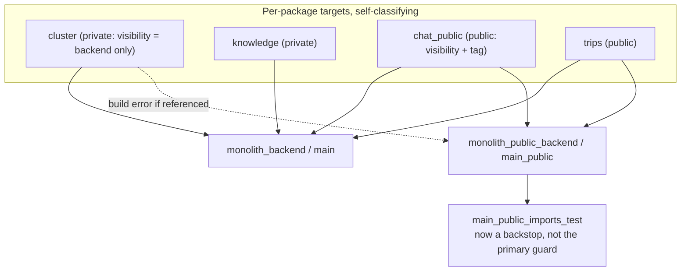

# ADR 009: Bazel-native package classification over central globs and gazelle:exclude

**Author:** Joe McGinley
**Status:** Accepted
**Created:** 2026-06-20

---

## Problem

The monolith bundles many internal packages (`agent`, `chat`, `chat_public`, `cluster`, `knowledge`, `home`, `scheduler`, ...) into two deployable tiers: the full private backend and the public read-only tier. Today, which package lands in which tier is encoded by hand in `projects/monolith/BUILD`:

- A block of `# gazelle:exclude <pkg>` directives stops gazelle from generating targets for each hand-managed package.
- The full backend (`main` binary, `monolith_backend` library) lists every package explicitly in a `srcs = glob([...])` include list.
- The public tier (`main_public` binary, `monolith_public_backend` library) repeats a curated allowlist subset, minus `_PUBLIC_PRUNE_EXCLUDE`.
- `main_public_imports_test` and `import_boundaries_test` re-enumerate package sets again to validate the prune.

This means the same classification fact (a package is private, or public-eligible, or hand-managed) is restated in four or five hand-maintained lists. Adding or moving a package requires a person, or an agent, to reason about "which globs does this belong in," and to edit each one consistently. The lists are a recurring merge-conflict surface: two branches that each add a package collide at the same anchor lines. During the rebase of the `cluster` debug-tools change (PR #2429), a conflict resolution spliced two `py_test` blocks together and shipped a Starlark syntax error (`BUILD:528: syntax error at '=': expected ]`) that only surfaced in CI. None of that reasoning should be necessary: Bazel can own membership directly.

This ADR is not about the public/private *boundary policy*, which is already sound. The public tier is an allowlist, so packages are private-by-default and a new package leaks nothing until someone deliberately opts it in, and `main_public_imports_test` enforces that at CI time. The problem is the central-enumeration *mechanism*, not the policy it encodes.

---

## Decision

Classify packages with Bazel-native, per-package declarations rather than central hand-maintained globs, and forbid `# gazelle:exclude` from regrowing the central pattern.

Each hand-managed package owns its own target(s) in its own directory, and declares its tier membership locally — through Bazel `visibility` (who is allowed to depend on it) reinforced by a `tags` marker for tooling that needs to enumerate a tier. The full backend and the public binary become thin aggregators that depend on package targets rather than globbing source trees; membership is then a property each package asserts about itself, evaluated once by Bazel, not a fact re-typed into several lists. A package that is not public-visible cannot be pulled into the public tier: the build fails closed instead of leaking at runtime or relying on a separate prune test to notice.

A CI lint rule forbids new `# gazelle:exclude` directives (and the central per-package `glob` enumeration they support) so the pattern this ADR removes cannot creep back in. Existing directives are migrated, not grandfathered indefinitely; the lint is the ratchet that keeps the migration from regressing.

| Aspect | Today | Decided |
| ------ | ----- | ------- |
| Where membership is declared | Central `BUILD` globs + `# gazelle:exclude` | Per-package target, colocated with the package |
| How a package joins the public tier | Hand-add to allowlist glob, keep prune test in sync | Mark the package public (visibility/tag); aggregator picks it up |
| Failure mode of a misclassification | Runtime leak caught by `main_public_imports_test` | Build error: private package is not visible to the public tier |
| Adding a package | Edit 4-5 central lists consistently | Add one target in the package's own dir |
| Merge behaviour | Conflicts at shared anchor lines | Additive, conflict-free |
| Agent/human cognitive load | Reason about "what goes where" | Declare once, locally; Bazel resolves |

---

## Architecture

Membership flows from each package's own declaration up into the tier aggregators, instead of down from a central list:

The full backend aggregates all package targets. The public binary aggregates only public-visible package targets; a private package referenced from the public tier is a visibility violation at build time. `main_public_imports_test` remains as defence-in-depth but is no longer the only thing standing between a misclassified package and a public leak.

---

## Alternatives Considered

- **Status quo (central globs + `# gazelle:exclude`)**: rejected; this is exactly the toil and merge-conflict surface the ADR exists to remove.
- **Single broad `glob(["**/*.py"], exclude=[...])` for the backend**: rejected; trades per-package enumeration for an exclude list with the opposite (unsafe) default, and still centralizes the decision.
- **Code-generate the central globs from a manifest**: rejected; adds a generator and a generated artifact to keep fresh, and still answers the wrong question (one central source of membership) rather than letting packages self-declare.
- **`tags` only, no visibility**: rejected as the sole mechanism; tags are advisory and queryable but do not *enforce* anything. Visibility is the enforcing primitive; a tag is a complement for tooling that must list a tier.

---

## Security

Baseline per `docs/security.md`. The public read-only isolation invariants from `security/004-public-read-only-service-isolation` are preserved and strengthened: private-by-default is retained, and a misclassification becomes a build failure rather than a runtime exposure caught only by `main_public_imports_test`. No deviation from the baseline; this moves an existing guard earlier in the pipeline.

---

## Risks

| Risk | Likelihood | Impact | Mitigation |
| ---- | ---------- | ------ | ---------- |
| `# gazelle:exclude` was load-bearing for a package that genuinely cannot be gazelle-managed | Medium | Medium | Migrate package-by-package; keep a documented, narrowly-scoped escape hatch the lint allows by explicit annotation, not silence |
| Lint forbids a legitimate transitional use during migration | Medium | Low | Land the lint after the migration, or allowlist the in-flight directories until they are converted |
| Per-package targets multiply BUILD files and dep boilerplate | Medium | Low | gazelle generates most of it once packages are no longer excluded; aggregators stay thin |
| Visibility model is more verbose than a glob for trivially-private packages | Low | Low | Default visibility keeps private packages private with no per-target annotation |

---

## Open Questions

1. Exact marker shape: Bazel `visibility` package groups alone, or `visibility` plus a `tags = ["monolith-public"]` complement for tier-enumerating tooling.
2. Whether the lint is a semgrep rule, a gazelle plugin assertion, or a dedicated build test, and whether it blocks net-new directives immediately or only after the migration completes.
3. Whether `import_boundaries_test` and `main_public_imports_test` are retired, slimmed, or kept verbatim as backstops once visibility enforces membership.

---

## References

| Resource | Relevance |
| -------- | --------- |
| security/004-public-read-only-service-isolation | The public/private boundary policy this mechanism implements |
| platform/008-monolith-module-boundaries | Module-boundary program the monolith packages belong to |
| [tooling/007-ocaml-build-file-generation-gazelle](007-ocaml-build-file-generation-gazelle.md) | Prior gazelle BUILD-generation decision in this repo |
| PR #2429 | The `cluster` debug-tools change whose BUILD merge conflict motivated this ADR |
