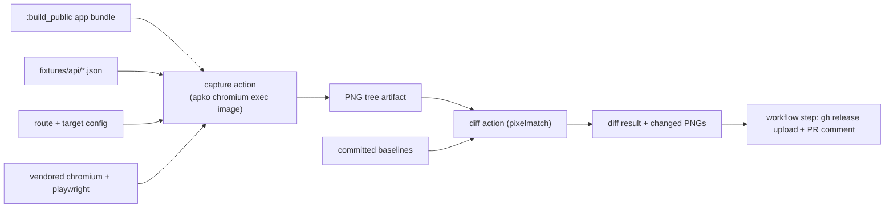

# ADR 010: Hermetic Bazel-native public-page visual regression

**Author:** Joe McGinley
**Status:** Deprecated (visual regression removed 2026-08-09)
**Created:** 2026-06-20

---

> **Deprecated 2026-08-09.** The visual regression suite was removed: it had stopped
> providing a usable signal, and its BuildBuddy action plus the `:capture` builds behind it
> cost ~176 GB/week of cache traffic (1.5% of the repo's total) while BuildBuddy was asking
> us to cut volume. Nothing replaces it; public-page rendering is covered by the BDD specs
> and by review. The rationale below is kept as the record of why the hermetic design was
> chosen, in case the capability is rebuilt.

## Problem

The public-page visual regression system (shipped in PR #2733) works: on every PR a BuildBuddy action boots the real `:build_public` SvelteKit app against committed mock data, screenshots the public pages with Playwright, diffs them against committed baselines, and posts inline before/after/diff images. But it is slow and the cost is structural, not incidental.

The action is a single workflow shell step that provisions its whole toolchain at runtime on an `ubuntu-24.04` runner: it `apt install`s Node 20, installs `gh`/`jq`, runs `playwright install-deps` (about 93 system packages, roughly 85 MB), and downloads the chromium browser bundle (roughly 263 MB), every run. On a cold runner that provisioning dominates a roughly 2m30s wall time; the Bazel build of `:build_public` itself is already RBE-cached and finishes in about 7 seconds, so it is not the bottleneck. Warm runners are faster only by luck of reuse, which gives an unpredictable cold/warm cliff.

Worse, there is no caching of the _result_. The screenshots are produced by a non-Bazel subprocess, so Bazel cannot key them on their inputs. Every PR re-runs the full capture even when it does not touch the frontend at all. The majority of PRs (backend changes, ADRs, chart bumps) cannot affect a single pixel, yet each pays the entire capture cost.

This repo is otherwise a hermetic Bazel monorepo: dependencies are vendored, builds run on RBE, container images are built with apko, and outputs are content-addressed and cached. The visual regression tool is the outlier, an imperative subprocess that re-installs the world on each run.

## Decision

Move the visual regression capture and diff into the Bazel ecosystem as hermetic, cached build actions, and reduce the workflow step to building those targets and posting the result. Keep the existing behaviour (mock-data seam, basemap interception, baselines, the PR comment); change only the execution substrate.

Concretely: vendor the JS toolchain (`@playwright/test` via `rules_js`/pnpm, Node via the existing toolchain) and the chromium binary (a Bazel repository rule over the pinned chromium build), so the browser and its driver are fetched once into the Bazel caches rather than downloaded every run. Express the screenshot capture as a Bazel action whose declared inputs are the built app bundle, the committed fixtures, the target/route configuration, and the chromium toolchain, and whose output is the PNG tree artifact. Express the pixel diff against committed baselines as a second Bazel action over those PNGs. The chromium runtime system libraries (the part `apt` provided) are supplied by a dedicated apko image used as the action's execution environment, consistent with how every other image in this repo is built.

| Aspect                       | Today (workflow subprocess)     | Decided (hermetic Bazel)          |
| ---------------------------- | ------------------------------- | --------------------------------- |
| Browser + Node + system deps | `apt`/download every run        | Vendored, fetched once, cached    |
| Capture execution            | Imperative shell step           | Bazel action with declared inputs |
| Result caching               | None (re-runs always)           | Output cache-keyed on inputs      |
| Non-frontend PR cost         | Full capture every time         | Cache hit, no capture             |
| System libraries             | `playwright install-deps` (apt) | apko exec image                   |
| Workflow step                | Install world, run, post        | `bazel build` the diff, post      |

The decisive property is caching by input. Because the capture's inputs are declared, a PR that does not change the frontend bundle, fixtures, targets, or chromium produces a cache hit and runs no browser at all. A PR that does change the frontend invalidates the capture and re-renders; it re-renders every page rather than only the visibly edited ones, because `:build_public` is a single tree artifact and a shared component or CSS token can affect any page, so whole-set invalidation is correct rather than a limitation to engineer around. The common case (most PRs touch no frontend) becomes effectively free; the case that needs the work (frontend PRs) does the work.

## Architecture

The Bazel graph ends at the diff result. Side effects that cannot be hermetic (uploading assets, posting or clearing the PR comment, committing reseeded baselines) stay in a thin workflow step that consumes the cached Bazel outputs. That step does no capture and no browser work; it runs only when the diff action reports changes.

## Alternatives Considered

- **Keep the runtime-install workflow step (status quo).** Rejected: re-installs the browser and system deps every run, caches nothing, and leaves a cold/warm cliff. It is the problem this ADR exists to remove.
- **Switch to the official Playwright container image plus a `pnpm build`.** Faster provisioning (browser baked in), but it leaves the Bazel ecosystem entirely: it forfeits the RBE build cache for the app, caches no capture output (so every PR still re-renders), and reintroduces a non-hermetic, image-pinned toolchain. It optimizes the wrong axis (per-run install time) instead of eliminating the work (output caching).
- **Rely on BuildBuddy warm-runner reuse to amortize installs.** Rejected: warm reuse is opportunistic, not guaranteed, so it cannot be a correctness or performance contract; cold runs still pay full cost and baselines must be reproducible regardless of which runner is hit.
- **Per-page input granularity (render only the edited page).** Rejected as infeasible and incorrect: the SvelteKit output is one tree artifact, and shared styles/components mean an edit can change any page, so the safe unit of invalidation is the whole bundle.

## Security

Baseline per `docs/security.md`. The new apko chromium image is a CI-execution-only image: non-root (uid 65532 convention), never internet-exposed, and used solely as the exec environment for the capture action. No new secrets are introduced; the existing PR-comment and release-asset steps continue to use the same `GHCR_TOKEN` already injected into CI. Vendoring chromium pins an exact, auditable browser build rather than fetching a floating download at runtime, which is a supply-chain improvement over the current `playwright install`.

## Risks

| Risk                                                                                        | Likelihood | Impact | Mitigation                                                                                                                                                                                                                                               |
| ------------------------------------------------------------------------------------------- | ---------- | ------ | -------------------------------------------------------------------------------------------------------------------------------------------------------------------------------------------------------------------------------------------------------- |
| Headless chromium misbehaves under the RBE/Bazel sandbox (fonts, `/dev/shm`, sandbox flags) | High       | High   | Validate browser-under-RBE early on a single page before building out rules; keep the apko image's font and runtime-lib set explicit and pinned; fall back to local (non-sandboxed) action execution for the capture if RBE sandboxing proves too costly |
| Baseline non-determinism if the exec image or chromium version drifts                       | Medium     | High   | Pin the apko exec image and the vendored chromium build by digest; baselines remain valid only against that pinned pair, regenerated via the existing sentinel flow when it changes                                                                      |
| Vendoring chromium adds toolchain maintenance (version bumps, multi-arch)                   | Medium     | Low    | Treat the chromium repo rule like other pinned tools; only the linux exec arch is needed for CI capture                                                                                                                                                  |
| Effort exceeds the value for a still-young tool                                             | Medium     | Medium | The capability already works in production; this is a substrate swap with a clear cut-over, not a rewrite, and can be staged so the current path keeps running until the hermetic path is proven                                                         |

## Open Questions (resolved in implementation)

All three were settled by the de-risking spike and the capture migration:

1. **RBE vs local exec.** RBE, with the apko image as a per-target exec environment via `exec_properties.container-image` (BuildBuddy honors the override and pulls the public image). No local-runner mount needed.
2. **apko package set.** Resolved by parsing chromium's ELF `DT_NEEDED` and mapping each `.so` to a Wolfi package: the chromium runtime libs + a shell userland (`findutils`/`grep`/`sed`/`gawk`) + `libudev` + `glib` + `cairo`/`pango`, with `fontconfig`/`freetype`/`ttf-dejavu` for fonts. swiftshader/ANGLE/Vulkan are bundled inside chromium, so no system GL stack is needed. See `projects/monolith/frontend/visual/apko.yaml`.
3. **Ruleset.** Adopted the community `rules_playwright` (BCR), pinned to Playwright 1.55.0 with `browsers_download_urls` overridden to the live `cdn.playwright.dev` mirror. Maturity caveat (it lags the latest Playwright x64 layout) handled by the version pin.

## References

| Resource                                       | Relevance                                                                                         |
| ---------------------------------------------- | ------------------------------------------------------------------------------------------------- |
| PR #2733 (visual regression shipped)           | The system this ADR moves into Bazel; current behaviour and the mock-data/basemap/baseline design |
| `projects/monolith/frontend/visual/`           | The capture/diff/mock code that becomes Bazel-action inputs                                       |
| `rules_js` / pnpm (in-repo)                    | How the JS toolchain (playwright) is vendored                                                     |
| apko + `rules_apko` (in-repo, ADR tooling/001) | How the chromium exec image is built                                                              |
| BuildBuddy RBE + `.bazelrc` `--config=ci`      | The execution and caching substrate the actions target                                            |
