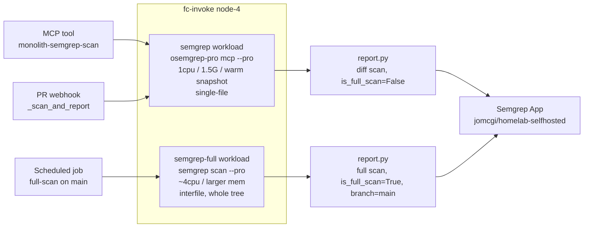

# ADR 011: Self-hosted Semgrep scan-engine tiers (fast single-file PR + scheduled interfile baseline)

**Author:** Joe McGinley
**Status:** Accepted
**Created:** 2026-07-11

---

## Problem

Self-hosted Semgrep (Route B) reports PR scans to the Semgrep App from our own
fc-invoke Firecracker guest, in parallel with Semgrep Managed Scans (SMS) for
comparison. Two gaps surfaced while validating it:

1. **No baseline on `main`.** Every scan Route B has ever sent is a PR *diff*
   scan on a feature branch (`is_full_scan: False`, `on: "pull_request"`). The
   App has never received a scan on the `main` branch for the
   `jomcgi/homelab-selfhosted` project, so its primary-branch selector is empty
   ("Nothing found") and the findings tab shows zero. Without a full scan on the
   default branch there is nothing for PR diffs to compare against and nothing to
   compare against SMS.

2. **The engine does not do interfile analysis.** The guest runs
   `osemgrep-pro mcp --experimental --pro`, a warm resident scan-server sized for
   single-file, diff-hook latency. A probe on 2026-07-11 (identical
   `flask.request -> os.system` taint submitted intrafile and split across two
   files in one batch) confirmed cross-file taint is **not** traced: only a plain
   pattern rule fired on the cross-file sink, and the run metadata reported
   `interfile_languages_used: []`. "Pro engine" is not the same as "interfile."
   Cross-file dataflow never runs in `mcp` mode, and no CPU/RAM increase changes
   that: it is an engine-mode boundary, not a resource knob.

Interfile analysis is inherently a whole-repo operation: for cross-file taint to
have anywhere to cross into, the engine needs the changed file plus its
dependency closure, which in practice means scanning the whole tree and diffing
against a baseline. So "interfile on a PR" costs roughly a full scan, not a cheap
diff. That cost profile is what forces the tiering decision below.

---

## Decision

Split Route B into **two scan paths across two Firecracker workloads**, rather
than one engine or three independent tiers:

1. **Fast single-file path (unchanged).** Keep the existing warm
   `osemgrep-pro mcp --pro` scan-server for both the ad-hoc MCP tool
   (`monolith-semgrep-scan`) and the PR webhook. PR gate stays fast (single-file,
   sub-10s) and keeps its warm-snapshot restore. It does interproc/intrafile Pro
   taint (cross-function within a file) but not cross-file.

2. **Scheduled interfile full-scan path (new).** Add a second Firecracker
   workload that runs `semgrep scan --pro` (interfile on by default) as a
   subprocess over the whole `main` tree on a schedule. This one run seeds the
   App baseline (primary branch + findings tab) and is the sole source of
   cross-file findings. It reports `is_full_scan: True` on branch `main`.

The PR gate therefore stays fast and shallow; cross-file coverage arrives on a
cadence from the scheduled baseline, not at PR time. Diff-vs-full stays a
reporting concern in `report.py` (`is_full_scan` + `base_branch_head_commit`,
with the App computing deltas server-side), not a guest concern.

| Aspect | Today | Decided |
| ------ | ----- | ------- |
| Engine paths | 1 (`mcp --pro`, single-file) | 2 (`mcp --pro` single-file + `semgrep scan --pro` interfile) |
| Firecracker workloads | 1 (`semgrep`, 1cpu/1.5G, warm) | 2 (unchanged warm + new interfile full-scan) |
| MCP tool | `mcp --pro` | `mcp --pro` (unchanged) |
| PR webhook | `mcp --pro` single-file | `mcp --pro` single-file (unchanged) |
| Cross-file findings | none | scheduled full scan on `main` |
| App baseline on `main` | none (findings tab empty) | seeded by the scheduled full scan |

---

## Architecture

The two workloads share the fc-invoke substrate and node-4 silicon; they differ
in engine invocation, footprint, warm strategy, and how the guest receives its
targets. The warm path takes file contents inline over vsock (as today). The
full path needs the tree materialized on disk in the guest for `semgrep scan`
(either a large inline batch written to a tmpdir, or hydration from the in-cluster
git mirror; see Open Questions).

---

## Alternatives Considered

- **Interfile on every PR (full-scan cost per push).** Rejected: pays whole-repo
  interfile cost (tens of seconds to minutes) on every push for depth that a
  scheduled baseline provides at near-zero PR latency. Not worth the PR-wall-time
  regression at homelab PR volume.
- **Hybrid: fast blocking check + async non-gating interfile per PR.** Rejected
  for now: best coverage but two scans per PR and out-of-band reporting
  plumbing; more moving parts than the value justifies until the scheduled
  baseline proves insufficient.
- **Tune the `mcp` scan-server to do interfile.** Not possible: `mcp` accepts
  only `--pro` (`--pro-intrafile` crashes it), and the probe showed `mcp --pro`
  never runs the interfile phase regardless of batch contents. Interfile requires
  the `semgrep scan --pro` subprocess entrypoint.
- **One workload, dynamically resized per scan.** Rejected: Firecracker
  hard-caps guest RAM at boot, so footprint is fixed per workload; tiers must be
  separate workload definitions with separate warm bases.

---

## Security

Baseline per `docs/security.md`. No new external exposure: both workloads run in
the existing fc-invoke guest on node-4 with `egressEnabled: false`, reached only
via the in-cluster daemon TokenReview gate. The full-scan path reads repository
source it already has access to (same content the PR path fetches). The
`SEMGREP_APP_TOKEN` used to report scans is unchanged and remains 1Password-managed.
If the full path hydrates from the git mirror, it uses the existing mirror
access path (ADR 041), no new credential.

---

## Risks

| Risk | Likelihood | Impact | Mitigation |
| ---- | ---------- | ------ | ---------- |
| PR gate misses cross-file bugs between scheduled runs | High (by design) | Medium | Tight-enough schedule (daily); cross-file classes are the minority; SMS parity is judged on the full scan, not the diff |
| Interfile full scan OOMs the guest (whole-tree peak exceeds memMib) | Medium | Medium | Size the new workload from a measured interfile run before committing footprint; start generous (~4cpu, mem >= observed peak) and trim |
| Whole-tree materialization in the guest is slow or awkward over vsock | Medium | Low | Prefer git-mirror hydration over a giant inline batch; scheduled path is latency-insensitive |
| Scheduled baseline drifts stale (job fails silently) | Medium | Medium | Alert on last-successful-full-scan age; the App primary-branch/findings emptiness is itself a visible signal |
| Cutover to Route B as the gate while PR path is single-file | Low | Medium | Gate remains non-blocking until the scheduled baseline + PR diff comparison matches SMS; cutover is a separate decision |

---

## Open Questions

1. **Full-workload footprint.** Exact vcpus/memMib for the interfile workload,
   sized from a measured whole-`main` `semgrep scan --pro` run (peak RSS, wall
   time). The 1536Mi warm workload was sized to a ~697Mi rule-compile peak;
   interfile over 752 files will peak much higher.
2. **How the guest receives the tree.** Large inline batch written to a guest
   tmpdir vs hydration from the in-cluster git mirror (ADR 041). The mirror avoids
   shipping ~4MB of file content over vsock per run and gives a real git checkout
   (better commit metadata for the App).
3. **Schedule cadence.** Daily is the starting assumption; revisit against how
   often `main` changes and how long a full interfile run takes.
4. **Warm strategy for the full path.** Whether the interfile workload warms a
   snapshot at all (rules compiled) or cold-boots per scheduled run, given it is
   latency-insensitive.

---

## References

| Resource | Relevance |
| -------- | --------- |
| [ADR tooling/004](004-ocaml-rules-for-semgrep.md) | The custom rules feeding the Pro packs this engine loads |
| [ADR platform/041](../agents/041-hot-git-mirror-agent-workspaces.md) | Git-mirror hydration option for materializing the tree in the guest |
| `projects/firecracker/semgrep/guest-init/internal/scandriver/driver.go` | The `osemgrep-pro mcp --pro` warm scan-server (fast path) |
| `projects/firecracker/substrate/chart/values.yaml` | fc-invoke workload footprint definitions |
| `projects/monolith/semgrep_scan/report.py` | Diff-vs-full reporting seam (`is_full_scan`, App baseline) |
