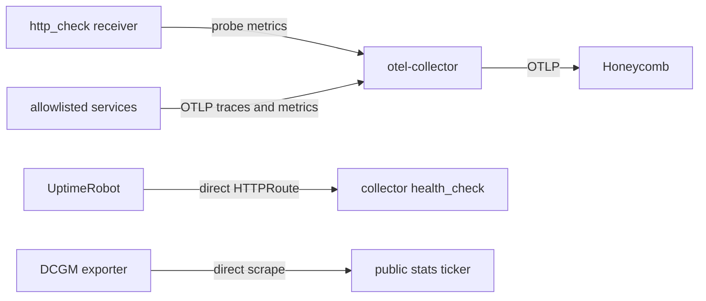

# Observability Architecture

One OpenTelemetry Collector Deployment exports admitted telemetry to Honeycomb.
Production sends synthetic probe metrics plus OTLP traces and metrics from the
services admitted by the production allowlist.

## Current signal paths

The collector's `http_check` receiver probes these public URLs every 60 seconds:

- `https://jomcgi.dev/health`
- `https://jomcgi.dev/`

The metrics pipeline accepts only the `http_check` receiver. It has no OTLP
metrics receiver, so workloads cannot send arbitrary metrics through it.

UptimeRobot metamonitors the collector at
`https://jomcgi.dev/health/otel-collector`. The `HTTPRoute` sends traffic
directly to the collector's `health_check` extension on port 13133 and rewrites
the path to `/`. The public frontend is not on this path.

The public stats ticker gets GPU utilization and frame buffer usage by scraping
the DCGM exporter directly. It does not use the collector or a telemetry store.

## Trace admission is deny-by-default

`allowedServices` defaults to an empty list in
`projects/platform/otel-collector/values.yaml`. Production currently admits
`embervm-control`, `monolith-backend`, `monolith-jobs`, and `monolith-public`.
Read `values-prod.yaml` as the source of truth for the current list.

While the list is empty the rendered collector has:

- no `otlp` receiver
- no traces pipeline
- no container or Service ports for OTLP gRPC on 4317 or OTLP HTTP on 4318

A service that dials the collector without being listed gets connection
refused. The gate is a property of the rendered config, not a convention about
what nobody has pointed at it.

Admitting a service is a one-line `allowedServices` override in
`values-prod.yaml`, using the exact OpenTelemetry `service.name`. A non-empty
allowlist renders the OTLP receiver, trace pipeline, ports, allowlist filter, and
tail sampler. The workload must also configure its exporter endpoint.

Those two edits have to agree. The filter drops any span whose `service.name` is
not on the list, so a service whose `OTEL_SERVICE_NAME` differs from its
allowlist entry exports successfully and has every span discarded, with nothing
reporting the mismatch.

When at least one trace service is admitted, the shared OTLP receiver also feeds
the metrics pipeline. The trace allowlist remains specific to the traces
pipeline.

## Automatic injection is off

Kyverno's cluster-wide OTel environment-variable injection is disabled in
`projects/platform/kyverno/values.yaml`. It was not redirected to the replacement
collector.

The OpenTelemetry Operator remains installed, but production disables its
Python, Node.js, and Go `Instrumentation` resources and configures no endpoint.

Production configures the private monolith's OTLP/HTTP trace endpoint in
`projects/monolith/deploy/values.yaml`, and admits it to the Honeycomb-backed
traces pipeline through the production allowlist above.

## Log correlation limit

The collector has no logs receiver or logs pipeline, and the platform has no
pod-log collection path. Trace IDs emitted by application log formatters remain
in pod logs rather than being ingested into Honeycomb. Operators can pivot from
a pod log line to its Honeycomb trace by `trace_id`, then pivot back by searching
pod logs for that ID. A bidirectional pivot entirely inside Honeycomb requires a
separate log-ingestion follow-up.

## Network visibility

Cilium and Hubble still provide network flow visibility from the eBPF datapath.
Their metrics are not part of the collector's `http_check`-only metrics pipeline.

## Configuration

- Collector chart and default admission policy:
  `projects/platform/otel-collector/values.yaml`
- Production overrides and probe targets:
  `projects/platform/otel-collector/values-prod.yaml`
- Disabled cluster-wide injection: `projects/platform/kyverno/values.yaml`
- Disabled language instrumentation:
  `projects/platform/opentelemetry-operator/values-prod.yaml`
