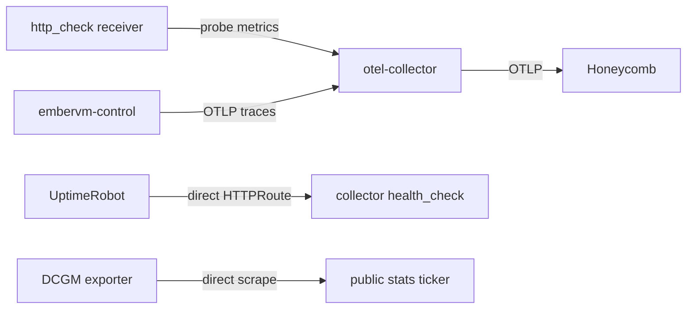

# Observability Architecture

One OpenTelemetry Collector Deployment exports admitted telemetry to Honeycomb.
Production sends synthetic probe metrics and traces from the services named in
the production or GKE `allowedServices` overlay.

## Current signal paths

The collector's `http_check` receiver probes these public URLs every 60 seconds:

- `https://jomcgi.dev/health`
- `https://jomcgi.dev/`

The metrics pipeline accepts only the `http_check` receiver. It has no OTLP
metrics receiver, so workloads cannot send arbitrary metrics through it. Service
telemetry uses the separately allow-listed traces pipeline.

UptimeRobot metamonitors the collector at
`https://jomcgi.dev/health/otel-collector`. The `HTTPRoute` sends traffic
directly to the collector's `health_check` extension on port 13133 and rewrites
the path to `/`. The public frontend is not on this path.

The public stats ticker gets GPU utilization and frame buffer usage by scraping
the DCGM exporter directly. It does not use the collector or a telemetry store.

## Trace admission is deny-by-default

`allowedServices` defaults to an empty list in
`projects/platform/otel-collector/values.yaml`. Read
`values-prod.yaml` for the services actually admitted; this document does not
list them, because that list changes and a copy here would go stale.

While the list is empty the rendered collector has:

- no `otlp` receiver
- no traces pipeline
- no container or Service ports for OTLP gRPC on 4317 or OTLP HTTP on 4318

A service that dials the collector without being listed gets connection
refused. The gate is a property of the rendered config, not a convention about
what nobody has pointed at it.

Admitting a service is a one-line `allowedServices` override in
`values-prod.yaml`, using the exact OpenTelemetry `service.name`. A non-empty
allowlist renders the OTLP receiver, trace pipeline, ports, allowlist filter, and
tail sampler. The workload must also configure its exporter endpoint.

Those two edits have to agree. The filter drops any span whose `service.name` is
not on the list, so a service whose `OTEL_SERVICE_NAME` differs from its
allowlist entry exports successfully and has every span discarded, with nothing
reporting the mismatch.

The metrics pipeline remains restricted to `http_check` after a trace service is
admitted.

## EmberVM session API request telemetry

The EmberVM control plane emits isolated root spans named
`embervm.http.request` from Bandit's request lifecycle listener. This happens at
the listener boundary, so ClusterIP, pod-IP, and loopback traffic has the same
signal, including a 500 response Bandit creates after a handler raises or exits.
Normal and exceptional completion consume the same ETS start record, which
makes the observation exactly once. Request spans carry these query fields:

| Field | Type and unit | Meaning |
| ----- | ------------- | ------- |
| `service.name` | string | `embervm-control` |
| `deployment.environment` | string | Collector-stamped environment, `homelab-hub` on GKE |
| `ember.surface` | string | `session_api` |
| `ember.http.duration_ms` | number, milliseconds | Time from Bandit request start through normal or exceptional completion |
| `ember.observation.kind` | string | `request`, or `saturation` on the marker described below |
| `ember.observation.saturated` | boolean, optional | Present and `true` only on a saturation marker |
| `ember.policy.allowed` | boolean | Whether the method and canonical path passed the session allow-list |
| `http.request.method` | string | Uppercase HTTP method |
| `http.response.status_code` | integer | Response status seen by the caller |
| `http.route` | string | Low-cardinality route template, or `unmatched` for a policy denial |

These spans are completion observations: their OpenTelemetry start timestamp is
the completion time, while `ember.http.duration_ms` retains the full measured
duration. A 15-minute create or multi-hour invoke therefore arrives inside the
current Honeycomb query window rather than being indexed at request entry.

The observer exports at most four request observations per 100 millisecond
bucket per pod. The Deployment has one replica and Kubernetes can add one surge
pod during a rolling update, so any rolling second contains at most 88 request
spans. On the first overflow in a bucket the observer emits one saturation
marker, with at most 22 markers per rolling second across two pods, and drops
the remaining observations in that bucket. The collector reserves 100
spans/second for request observations and 24 spans/second for markers. Below the
envelope the request denominator and duration distribution are complete. Above
it, every alert formula suppresses a window containing a marker instead of
evaluating biased first-arrival data.

The application and collector wiring is active in the GKE overlays: EmberVM
exports with `OTEL_SERVICE_NAME=embervm-control`, the collector admits that exact
service name, and the hub collector uses its proven OTLP/HTTP export path to
Honeycomb. The metrics receiver remains closed to arbitrary OTLP metrics.

## Automatic injection is off

Kyverno's cluster-wide OTel environment-variable injection is disabled in
`projects/platform/kyverno/values.yaml`. It was not redirected to the replacement
collector.

The OpenTelemetry Operator remains installed, but production disables its
Python, Node.js, and Go `Instrumentation` resources and configures no endpoint.

The private monolith has no production OTel endpoint. Its demo trace waterfall
returns no spans until #5363 connects a replacement span store.

## Network visibility

Cilium and Hubble still provide network flow visibility from the eBPF datapath.
Their metrics are not part of the collector's `http_check`-only metrics pipeline.

## Configuration

- Collector chart and default admission policy:
  `projects/platform/otel-collector/values.yaml`
- Production overrides and probe targets:
  `projects/platform/otel-collector/values-prod.yaml`
- Disabled cluster-wide injection: `projects/platform/kyverno/values.yaml`
- Disabled language instrumentation:
  `projects/platform/opentelemetry-operator/values-prod.yaml`
