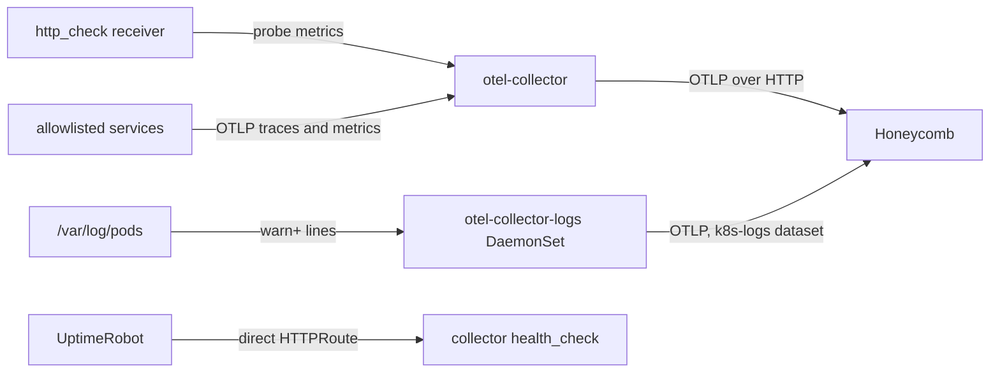

# Observability

One OpenTelemetry Collector Deployment on the GKE hub (`homelab-hub`, the only
cluster) exports admitted telemetry to Honeycomb, and a node-level DaemonSet
from the same chart ships warning-and-above pod logs. The hub sends synthetic
probe metrics plus OTLP traces and metrics from the services on its allowlist.
Alerting is one Honeycomb trigger on the public `/health` composite plus
monolith health components that post to Discord (see Alerting below).

## Signal paths

```mermaid
graph LR
    HC[http_check receiver] -->|probe metrics| OC[otel-collector]
    SVC[allowlisted services] -->|OTLP traces and metrics| OC
    OC -->|OTLP over HTTP| H[Honeycomb]
    PODS["/var/log/pods"] -->|warn+ lines| LA[otel-collector-logs DaemonSet]
    LA -->|OTLP, k8s-logs dataset| H
    UR[UptimeRobot] -->|direct HTTPRoute| HEALTH[collector health_check]
```

The collector exports over OTLP/HTTP (`honeycomb.protocol: "http"` in
`values-gke.yaml`): the hub's gRPC dials to `api.honeycomb.io` were cancelled
before completing while HTTPS from the same pod network worked.

The hub Application (`projects/platform-gke/otel-collector/application.yaml`)
applies `values.yaml` then `values-gke.yaml` from
`projects/platform/otel-collector/`. `values-prod.yaml` in the same directory
is the residual home overlay and deploys nowhere.

## Probe targets

The collector's `http_check` receiver probes these targets every 60 seconds and
ships the resulting metrics to Honeycomb:

| Target | Signal |
| ------ | ------ |
| `https://jomcgi.dev/health` | Composite public health |
| `https://jomcgi.dev/` | Public page reachability |
| `https://argocd-server.argocd.svc:443/healthz` | Argo CD, in-cluster, with the pinned serving CA from #6542 |

Targets live under `httpcheck.targets` in `values-gke.yaml`. Public targets use
HTTPS. Stage a new in-cluster target behind a dedicated default-off flag until
the service is live, and revalidate it against the destination's current
reachability and access controls. With the CA mount on, the render fails when
the pinned cert is empty or null. Turning the mount off is not guarded, so keep
it on while the `ca_file` target is enabled. The pinned Argo CD leaf expires
2027-08-30 and must be re-pinned from `argocd-secret` `tls.crt` before then.

The metrics pipeline accepts `http_check` and, when `allowedServices` is
non-empty, the shared OTLP receiver. The allowlist filters traces only.

`loom.enabled` defaults off in all overlays. When enabled after #6605, it
appends the in-cluster query-api `/docs` probe and creates a 30-minute CNPG
backup-age CronJob. Its ServiceAccount can only get the named `loom-pg`
Cluster. It emits `cnpg.backup.last_success_age_seconds` through the collector's
OTLP/HTTP Service, using cluster creation time for a never-backed-up cluster.
The flag requires HTTP probes and the shared OTLP receiver to be enabled, and
is independent of the Argo CD CA mount. The rendered upstream Loom chart has no
NetworkPolicies; reachability still needs live validation. Switch the probe and
trigger filter to `/healthz` when weave-hand/loom#694 ships. See
[Loom staged monitoring](../projects/loom/deploy/README.md#staged-monitoring-6604)
for the enable order and live acceptance checks.

## Collector metamonitoring

UptimeRobot checks `https://jomcgi.dev/health/otel-collector`. The `HTTPRoute`
sends traffic directly to the collector's `health_check` extension on port
13133 and rewrites the path to `/`. The public frontend is not on this path.

## Trace admission is deny-by-default

`allowedServices` defaults to an empty list in `values.yaml`. Read
`values-gke.yaml` for the services the hub admits; this document does not list
them, because that list changes and a copy here would go stale.

While the list is empty the rendered collector has:

- no `otlp` receiver
- no traces pipeline
- no container or Service ports for OTLP gRPC on 4317 or OTLP HTTP on 4318

A service that dials the collector without being listed gets connection
refused. The gate is a property of the rendered config, not a convention about
what nobody has pointed at it.

Admitting a service is a one-line `allowedServices` override in
`values-gke.yaml`, using the exact OpenTelemetry `service.name`. A non-empty
allowlist renders the OTLP receiver, trace pipeline, ports, allowlist filter, and
tail sampler. The workload must also configure its exporter endpoint.

Those two edits have to agree. The filter drops any span whose `service.name` is
not on the list, so a service whose `OTEL_SERVICE_NAME` differs from its
allowlist entry exports successfully and has every span discarded, with nothing
reporting the mismatch.

When at least one trace service is admitted, the shared OTLP receiver also feeds
the metrics pipeline. The trace allowlist remains specific to the traces
pipeline.

## Automatic injection is off

Kyverno's cluster-wide OTel environment-variable injection is disabled in
`projects/platform/kyverno/values.yaml`. It was not redirected to the
collector.

The OpenTelemetry Operator is not deployed on the hub: `projects/platform-gke/`
carries no Application for it, and its chart under
`projects/platform/opentelemetry-operator/` is residual home configuration.
Each workload configures its own exporter endpoint. The private monolith's
OTLP/HTTP trace endpoint is set in `projects/monolith/deploy/values.yaml`, and
the service is admitted through the allowlist above.

The public stats ticker (`/app/notes/stats`) reads a snapshot the
`observability.stats_rollup` job fills from the Kubernetes API, Postgres and
GitHub. Its GPU source scrapes a DCGM exporter (`dcgmExporterUrl`); the hub has
no GPU pool, so that source has nothing to read there. That exporter came with the home GPU
operator, retired in #6914.

## Pod logs

A node-level log agent (a DaemonSet in the same chart, enabled on the hub by
`logs.enabled` in `values-gke.yaml`) tails `/var/log/pods` for the namespaces in
`logs.namespaces` and exports warning-and-above lines directly to the Honeycomb
`k8s-logs` dataset, using the same ingest key as the gateway. It does not pass
through the gateway, so it opens no OTLP logs path for workloads.

Levels come from JSON `level`/`severity`/`levelname` fields, a leading level
token on plain-text lines (Python, zap console, Envoy, logfmt), or, for lines
with no level at all, an error/traceback heuristic whose matches are marked
`log.level_source=heuristic`. Everything below WARN is dropped at the node.
Lines carrying `trace_id` pivot to the trace datasets; pod logs from other
namespaces, and anything below WARN, still stay only in the pod logs.

## Alerting

Honeycomb's free plan allows exactly one trigger. It is spent on
`jomcgi.dev /health composite unhealthy` (`aJgkA4vC2m8`), kept as code in
[`projects/platform/honeycomb/`](../projects/platform/honeycomb/README.md)
and applied with its `sync.py`, which refuses to plan more than one trigger.
It fires when the httpcheck probe of `https://jomcgi.dev/health` is non-2xx
for two consecutive 5-minute evaluations and notifies the Discord webhook
recipient "Discord homelab alerts".

Everything else alerts from the monolith. Four health components in
`projects/monolith/factory/ops_health.py` are registered as **advisory**
components of the private `/api/health`: a failing one is listed under
`degraded` and the response stays 200. They are advisory because they describe
capacity, providers and the factory lane rather than whether the monolith can
serve. The kubelet probes hit `/healthz`, which runs no deep components, so
none of them can restart a pod. They are not composed into the public tier,
so they never move the public `/health` composite or its Honeycomb trigger.

The monolith leader evaluates them every 60 seconds and posts one Discord
message (through `shared.notify`, to `agent.discord.defaultChannelId` unless
`healthAlerts.channelId` is set) when a component flips unhealthy or recovers,
and a reminder every 6 hours while it stays unhealthy
(`projects/monolith/factory/health_alerts.py`). The last announced state
is kept in the `platform_probe` table (`health_alert.<component>`), so a leader
handover neither repeats nor drops an alert. A component whose data cannot be
read reports `status: unknown`, stays healthy and never causes a transition.
Settings are the chart's `healthAlerts` values.

| Component | Unhealthy when | Data source |
| --------- | -------------- | ----------- |
| `embervm_capacity` | Every EmberVM brick class is at 0 desired replicas, or session creates have failed continuously for more than 15 minutes (failures spanning 15 minutes with no success between) | `noded-brick` Deployments in the `embervm` namespace (monolith ClusterRole read); create outcomes each replica records in `platform_probe` (`embervm.session_create`, `embervm.session_create.failing_since`). Recorded failures: 429, 5xx, timeouts, transport errors. Other 4xx (restore denials) are the caller's and not recorded |
| `agent_turns` | For Codex (luna, terra, sol, astra) or Claude (opus, sonnet, fable, and sessions with no model): at least 2 turns attempted in the last 60 minutes and none delivered | `agent_sessions.agent_turns` joined to `agent_sessions.agent_sessions`. Delivered means a clean terminal reason (`completed`, `end_turn`, `stop`, `user_interrupt`). Interrupted turns and turns cancelled before dispatch are not attempts. Spark and pi are not covered |
| `codex_quota_fresh` | The token broker's latest Codex quota observation is older than 60 minutes (or missing, or the broker is unreachable) **and** at least one Codex turn was attempted in the last 60 minutes | Broker `GET /quota` (the monolith's existing 30-second cached poll) and the same turn counts. The demand condition keeps idle nights quiet; the cost is that a fault that stops Codex work from being attempted at all is left to `agent_turns` and `embervm_capacity` |
| `factory_stuck` | A factory receipt has been `uncertain` for more than 2 hours, or a `queued` receipt at the live policy's repo and generation is not `admission_eligible` (the #6483 trap). Intake receipts while intake is off and older-generation receipts are not flagged | `swarm.factory_receipt` and the `swarm.factory_control` policy. Uncertain age is measured from the receipt's `updated_at` |

Each check is cached for 60 seconds per process, bounded to 10 seconds with a
5-second Postgres statement timeout, and never raises.

Not covered: Kubernetes health, ArgoCD state, network-policy denials, and the
log-based conditions drafted as disabled trigger specs in #6511 (egress-proxy
request denied, EmberVM control-plane errors, Kargo promotion failed).
Container restarts in `monolith-public` are posted by the monolith's pod
restart watcher, and chart lag is the advisory `cd` component.

## Staged Loom alerts

Loom's probe, backup-age and checker-absence specs are disabled until #6605,
metric arrival and operator test-firing. They count successful 2xx probes over
600 seconds, compare backup age with 129600 seconds (36 hours), and detect
missing age datapoints over 7200 seconds. Connection errors record zero in
every `httpcheck.status` class, so counting successes covers a down endpoint.
The backup-age MAX needs its absence companion when the checker stops.
No other CNPG cluster has repository backup-age alerting; monolith-pg needs
the same checks. The specs live in `projects/platform/honeycomb/triggers/` and
are applied by hand with `sync.py` after the operator checks, never by CI.

## Configuration

- Collector chart and default admission policy:
  `projects/platform/otel-collector/values.yaml`
- Hub overrides, probe targets, pod-log namespaces and the Honeycomb protocol:
  `projects/platform/otel-collector/values-gke.yaml`
- Honeycomb trigger specs and `sync.py`: `projects/platform/honeycomb/`
- Disabled cluster-wide injection: `projects/platform/kyverno/values.yaml`
- Monolith health components and Discord alerts:
  `projects/monolith/factory/ops_health.py`,
  `projects/monolith/factory/health_alerts.py`, chart values `healthAlerts`
