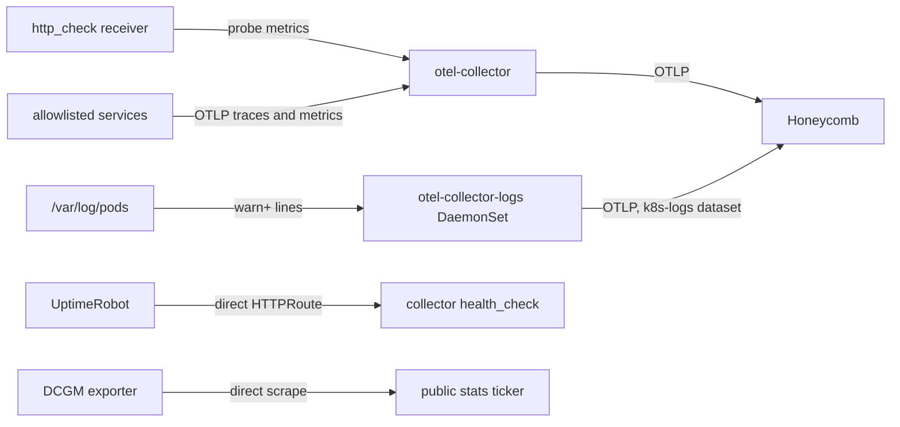

# Observability Architecture

One OpenTelemetry Collector Deployment exports admitted telemetry to Honeycomb,
and a node-level DaemonSet from the same chart ships warning-and-above pod logs.
Production sends synthetic probe metrics plus OTLP traces and metrics from the
services admitted by the production allowlist.

## Current signal paths

```mermaid
graph LR
    HC[http_check receiver] -->|probe metrics| OC[otel-collector]
    SVC[allowlisted services] -->|OTLP traces and metrics| OC
    OC -->|OTLP| H[Honeycomb]
    PODS["/var/log/pods"] -->|warn+ lines| LA[otel-collector-logs DaemonSet]
    LA -->|OTLP, k8s-logs dataset| H
    UR[UptimeRobot] -->|direct HTTPRoute| HEALTH[collector health_check]
    DCGM[DCGM exporter] -->|direct scrape| STATS[public stats ticker]
```

The collector's `http_check` receiver probes these public URLs every 60 seconds:

- `https://jomcgi.dev/health`
- `https://jomcgi.dev/`

The metrics pipeline accepts `http_check` and, when `allowedServices` is
non-empty, the shared OTLP receiver. The allowlist filters traces only.
The GKE overlay also probes Argo CD's in-cluster HTTPS health endpoint with
its pinned serving CA.

`loom.enabled` defaults off in all overlays. When enabled after #6605, it
appends the in-cluster query-api `/docs` probe and creates a 30-minute CNPG
backup-age CronJob. Its ServiceAccount can only get the named `loom-pg`
Cluster. It emits `cnpg.backup.last_success_age_seconds` through the collector's
OTLP/HTTP Service, using cluster creation time for a never-backed-up cluster.
The flag requires HTTP probes and the shared OTLP receiver to be enabled.
The rendered upstream Loom chart has no NetworkPolicies; reachability still
needs live validation. Switch the probe and trigger filter to `/healthz` when
weave-hand/loom#694 ships.

UptimeRobot metamonitors the collector at
`https://jomcgi.dev/health/otel-collector`. The `HTTPRoute` sends traffic
directly to the collector's `health_check` extension on port 13133 and rewrites
the path to `/`. The public frontend is not on this path.

The public stats ticker gets GPU utilization and frame buffer usage by scraping
the DCGM exporter directly. It does not use the collector or a telemetry store.

## Trace admission is deny-by-default

`allowedServices` defaults to an empty list in
`projects/platform/otel-collector/values.yaml`. Read
`values-prod.yaml` for the services actually admitted; this document does not
list them, because that list changes and a copy here would go stale.

While the list is empty the rendered collector has:

- no `otlp` receiver
- no traces pipeline
- no container or Service ports for OTLP gRPC on 4317 or OTLP HTTP on 4318

A service that dials the collector without being listed gets connection
refused. The gate is a property of the rendered config, not a convention about
what nobody has pointed at it.

Admitting a service is a one-line `allowedServices` override in
`values-prod.yaml`, using the exact OpenTelemetry `service.name`. A non-empty
allowlist renders the OTLP receiver, trace pipeline, ports, allowlist filter, and
tail sampler. The workload must also configure its exporter endpoint.

Those two edits have to agree. The filter drops any span whose `service.name` is
not on the list, so a service whose `OTEL_SERVICE_NAME` differs from its
allowlist entry exports successfully and has every span discarded, with nothing
reporting the mismatch.

When at least one trace service is admitted, the shared OTLP receiver also feeds
the metrics pipeline. The trace allowlist remains specific to the traces
pipeline.

## Automatic injection is off

Kyverno's cluster-wide OTel environment-variable injection is disabled in
`projects/platform/kyverno/values.yaml`. It was not redirected to the replacement
collector.

The OpenTelemetry Operator remains installed, but production disables its
Python, Node.js, and Go `Instrumentation` resources and configures no endpoint.

Production configures the private monolith's OTLP/HTTP trace endpoint in
`projects/monolith/deploy/values.yaml`, and admits it to the Honeycomb-backed
traces pipeline through the production allowlist above.

## Pod logs

A node-level log agent (a DaemonSet in the same chart, enabled on the hub by
`logs.enabled` in `values-gke.yaml`) tails `/var/log/pods` for the namespaces in
`logs.namespaces` and exports warning-and-above lines directly to the Honeycomb
`k8s-logs` dataset, using the same ingest key as the gateway. It does not pass
through the gateway, so it opens no OTLP logs path for workloads.

Levels come from JSON `level`/`severity`/`levelname` fields, a leading level
token on plain-text lines (Python, zap console, Envoy, logfmt), or, for lines
with no level at all, an error/traceback heuristic whose matches are marked
`log.level_source=heuristic`. Everything below WARN is dropped at the node.
Lines carrying `trace_id` pivot to the trace datasets; pod logs from other
namespaces, and anything below WARN, still stay only in the pod logs.

## Staged Loom alerts

Loom's probe, backup-age and checker-absence specs are disabled until #6605,
metric arrival and operator test-firing. They count successful 2xx probes over
600 seconds, compare backup age with 129600 seconds (36 hours), and detect
missing age datapoints over 7200 seconds. Connection errors record zero in
every `httpcheck.status` class, so counting successes covers a down endpoint.
The backup-age MAX needs its absence companion when the checker stops.
No other CNPG cluster has repository backup-age alerting; monolith-pg needs
the same checks. See `projects/loom/deploy/README.md` for the enable order.
The specs live in `projects/platform/honeycomb/triggers/` and are applied by
hand with `sync.py` after the operator checks.

## Network visibility

Cilium and Hubble still provide network flow visibility from the eBPF datapath.
Their metrics are not part of the collector's probe and OTLP metrics pipeline.

## Configuration

- Collector chart and default admission policy:
  `projects/platform/otel-collector/values.yaml`
- Production overrides and probe targets:
  `projects/platform/otel-collector/values-prod.yaml`
- Disabled cluster-wide injection: `projects/platform/kyverno/values.yaml`
- Disabled language instrumentation:
  `projects/platform/opentelemetry-operator/values-prod.yaml`
