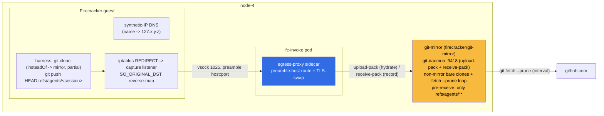

# Plan: Hot Git Mirror + Scratch-Ref Recording + Generic Egress

**Author:** jomcgi (with Claude)
**Created:** 2026-07-01
**Status:** Draft, ready for execution
**ADRs:** implements [026 - Hot Git Mirror](../decisions/agents/026-hot-git-mirror-agent-workspaces.md) (with a write-back amendment), completes the deferred generic-capture item in [023 - Egress Secret Proxy](../decisions/agents/023-egress-secret-proxy.md)

---

## Goal

Give goosecracker agents a fast, GitHub-independent workspace lifecycle:

1. **Hydrate** a workspace by fetching a branch from a hot, in-cluster git mirror (not GitHub).
2. **Record** the agent's resulting work as a scratch branch pushed back to that same mirror, under a reserved `refs/agents/**` namespace, with no credential.
3. **Generic egress with a split-horizon guardrail**: replace the fixed-port loopback capture with any-port `iptables` REDIRECT + `SO_ORIGINAL_DST` capture, and enforce **open egress to the public internet, deny-by-default to the cluster** (permit only an explicit internal allowlist). This (a) makes the plaintext `git://` mirror routable, (b) unlocks arbitrary outbound to the world, and (c) closes the cluster-pivot vector that today's `policy: allow` leaves open.

### Decisions locked (Joe, 2026-07-01)

| Fork                    | Decision                                                                                                                                                                    |
| ----------------------- | --------------------------------------------------------------------------------------------------------------------------------------------------------------------------- |
| Recording target        | **Scratch ref on the in-cluster mirror** (`refs/agents/<session>`). No GitHub push, no credential, no Basic-auth swap, no ADR 027 dependency.                               |
| Mirror serving protocol | **git-daemon `git://` on :9418** (read + hook-restricted write).                                                                                                            |
| Generic egress          | **Its own workstream, now.** Any-port `iptables` REDIRECT + `SO_ORIGINAL_DST`.                                                                                              |
| Egress posture          | **Split-horizon: external = allow, internal = deny-by-default + allowlist.** Classify on the resolved IP in the sidecar (not the guest-claimed name), resolve-once-and-pin. |
| Guest kernel            | **No rebuild.** kata `vmlinux-6.18.35-197` has netfilter/nat/conntrack/REDIRECT/TPROXY built in `=y` (verified).                                                            |

---

## Why these three combine well

- **git:// needs generic egress.** Today the egress-proxy sidecar recovers the destination host by sniffing TLS SNI or the HTTP Host header. `git://` is plaintext with neither, so it is un-routable under the current per-port model. Generic egress moves host-recovery upstream into the guest (synthetic-IP DNS + `SO_ORIGINAL_DST` reverse-map), and the guest passes `host:port` in the vsock preamble. The sidecar then _trusts the preamble_ for plaintext routes. So git:// becomes routable exactly because we do generic egress.
- **Scratch-ref recording needs no secret.** Because recording pushes to the in-cluster mirror rather than GitHub, there is no token on the write path. The `git push` Basic-auth swap (ADR 023 deferred) and ADR 027 GitHub-App roles are both out of scope here.
- **The kernel blocker is confirmed gone (verified 2026-07-01).** The guest boots the kata `vmlinux-6.18.35-197` kernel (`vmlinux.container` symlink). It was built without `CONFIG_IKCONFIG` (no embedded config), so the config was read from the uncompressed ELF's strings/initcall symbols directly. All required primitives are compiled in as `=y` (not modules, which matters since a raw Firecracker guest cannot `modprobe`): `nf_conntrack` (provides the `SO_ORIGINAL_DST` getsockopt), `nf_nat` + `net/netfilter/nf_nat_redirect.c` (the REDIRECT target), `iptable_nat`, `ip_tables`/`xt_*`, and also `nft_*` + `TPROXY`. Proof: `__initcall__kmod_iptable_nat__..._init6` / `__initcall__kmod_nf_conntrack__...` symbols exist only for built-in code. So ADR 023's "needs the guest kernel built with netfilter" is satisfied with zero kernel rebuild. TPROXY being present gives a fallback capture path if loopback `REDIRECT` + `route_localnet` is fiddly.

---

## Current state (verified 2026-07-01)

- **Read-side plumbing exists.** `AgentRequest` carries `gitMirror`/`gitRef` (`projects/firecracker/goosecracker/guest-init/internal/handler/handler.go`), the guest `git.go` capability does `clone + checkout` and has an unused `Push()` (`projects/firecracker/substrate/shim/capabilities/git.go`), and `dispatch.submit`/`runner.run_and_deliver` already thread `git_mirror`/`git_ref` through (`projects/monolith/goosecracker/{dispatch,runner}.py`). Dead `repo`/`branch` params exist in `dispatch.submit`.
- **The mirror service does not exist.** It was drafted in **PR #2900 (OPEN, never merged)** under `projects/agent_platform/git-mirror/`, but `projects/agent_platform` was deleted entirely on 2026-07-01. PR #2900 is reference material for the chart/apko shape only; its home directory is gone. New home: `projects/firecracker/git-mirror/`.
- **Egress capture is fixed-port.** `defaultEgressPorts = [80, 443, 8000, 8080, 4318]` with wildcard-DNS-to-loopback + per-port listeners tunneling over vsock `EgressPort=1025` (`projects/firecracker/goosecracker/guest-init/cmd/main.go`). Port 9418 (git://) is not captured. The sidecar recovers host by SNI/Host sniff and enforces `permits(host:port)` (`projects/firecracker/substrate/egress-proxy/cmd/{main,swap}.go`). Secret-swap (TLS terminate + placeholder swap) is live.

---

## Architecture (decided)



**Scratch-ref refresh safety.** The mirror is a _non-mirror_ bare clone (`git clone --bare`, refspec `+refs/heads/*:refs/heads/*` and `+refs/tags/*:refs/tags/*`), refreshed by `git fetch --prune origin`. Because the fetch refspec never covers `refs/agents/*`, pruning cannot delete agent scratch refs. (A `--mirror` clone would prune them, since its refspec is `+refs/*:refs/*` mirroring GitHub's ref set.)

**Write restriction.** `git daemon --enable=receive-pack` allows anonymous push over the node-local hop; a `pre-receive` hook in each bare repo rejects any pushed ref outside `refs/agents/**`, so `main` and all upstream refs remain read-only. Actor scope: only node-4 guests reach the daemon (routed through the sidecar; Service is `internalTrafficPolicy: Local`).

---

## Egress guardrail (split-horizon)

Generic egress must not mean "reach anything." The posture is **open to the world, fenced to the cluster**, enforced in the trusted sidecar on the _resolved IP_.

**Trust placement.** The guest is untrusted and chooses the `host:port` it puts in the vsock preamble. It cannot bypass the guardrail because the sidecar (host-side, trusted) independently resolves the name and classifies the IP it will actually dial. The guest picking the preamble is safe because the sidecar re-derives trust from it.

**Classification.** For each connection:

1. Resolve the preamble host to an IP set; pick one IP.
2. **Classify that IP.** Internal iff it falls in a fenced CIDR; else external.
3. **Permit:** external -> allow (world open); internal -> allow _only if_ `(host:port | ip:port)` is in `internalAllowlist`, else deny.
4. **Dial the exact pinned IP** (never re-resolve between check and connect).

This gives three robustness properties: classifying the _resolved IP_ (not the name) catches names that resolve internal (SSRF-by-name, incl. cloud metadata `169.254.169.254`); resolve-once-and-pin defeats DNS rebinding; literal-IP dests are classified directly with no name to inspect.

**Fenced CIDRs** (this cluster; baked defaults + values-configurable):

| Range                         | Meaning                               |
| ----------------------------- | ------------------------------------- |
| `10.42.0.0/16`                | k3s pod CIDR                          |
| `10.43.0.0/16`                | k3s service CIDR                      |
| `192.168.1.0/24`              | node network (node-4 = 192.168.1.195) |
| `127.0.0.0/8`, `::1`          | loopback                              |
| `169.254.0.0/16`, `fe80::/10` | link-local incl. cloud metadata       |
| `fc00::/7`                    | IPv6 ULA                              |

**Config shape** (replaces ADR 023's flat `allowlist` + `policy: allow|allowlist`):

```yaml
egress:
  external: allow # world open (future: optional denylist)
  internal:
    default: deny # cluster fenced
    allowlist: # the only internal dests agents may reach
      - inference.inference.svc.cluster.local:8080
      - monolith.monolith.svc.cluster.local:8000
      - git-mirror.<ns>.svc.cluster.local:9418
      - signoz-k8s-infra-otel-agent.signoz.svc.cluster.local:4318
      - context-forge-...-mcpgateway.mcp.svc.cluster.local:80
    cidrs: # extra fenced ranges on top of baked private/loopback/link-local
      - 10.42.0.0/16
      - 10.43.0.0/16
      - 192.168.1.0/24
```

**Orthogonal to secret-swap.** The per-secret `egressTo` (ADR 023 6b) is unchanged and independent: it controls _where a real credential materializes_, not _whether a connection is allowed_. The two external secret hosts (`api.github.com`, `openrouter.ai`) are reachable via `external: allow` and no longer need allowlist entries; they stay in `secrets[].egressTo` so the real token only materializes toward them.

**Migration risk.** Today's live default is `policy: allow` (internal reachable). Flipping to internal-deny means every live internal route (`inference:8080`, `monolith:8000`, OTLP `:4318`, MCP `:80`, plus the new mirror `:9418`) must be in `internalAllowlist` and re-verified end-to-end before merge, or default-tier agent runs break.

---

## Workstreams

Sequencing: **WS4 lands first** (git:// host-recovery + port capture is a prerequisite for WS2/WS3). WS1 (mirror service) can build in parallel with WS4 since it is a standalone deployment. WS2/WS3 (guest hydrate/record) depend on both. WS5 (ADR updates) rides along.

---

### WS4 - Generic egress (any-port capture) + split-horizon guardrail

The enabling capability. Replace fixed-port loopback listeners with synthetic-IP DNS + iptables REDIRECT + `SO_ORIGINAL_DST`; move host-classification into the sidecar (external=allow, internal=deny+allowlist).

**Task 4.0 - Behavior test (kernel already cleared).** The kata guest kernel is confirmed to support the mechanism (see Current state), so this is a wiring smoke test, not a kernel gate. Build a scratch guest apko with `iptables` + a tiny `SO_ORIGINAL_DST` reader; boot via fc-invoke; confirm `iptables -t nat -A OUTPUT -p tcp -j REDIRECT --to-ports <p>` fires, `SO_ORIGINAL_DST` returns the pre-REDIRECT dst, and `net.ipv4.conf.all.route_localnet=1` lets REDIRECT fire for `127.0.0.0/8`. If loopback REDIRECT is fiddly, evaluate the TPROXY path (also built into the kernel).

**Task 4.1 - Guest: synthetic-IP DNS responder.** Replace wildcard-DNS-to-`127.0.0.1` with a responder that allocates a unique `127.0.0.0/8` address per queried name (skip `127.0.0.1` and the capture-port address), records a `name <-> IP` bimap, and answers A queries with the synthetic IP. AAAA/others -> NODATA. (`projects/firecracker/goosecracker/guest-init/cmd/main.go`, DNS section.)

**Task 4.2 - Guest: iptables REDIRECT + single capture listener.** At init: `sysctl route_localnet=1`, add `iptables -t nat -A OUTPUT -p tcp --syn -j REDIRECT --to-ports <capturePort>` (excluding the capture port + DNS). One TCP listener; per accepted conn read `SO_ORIGINAL_DST`. If the original dst is a synthetic `127.x` -> reverse-map to name; if it is a literal IP (app dialed an IP, no DNS) -> pass the IP through. Tunnel over vsock 1025 with a **`host:port\n` preamble** (was `port\n`). Remove `defaultEgressPorts` and the per-port loop. Bring `lo` up first (existing gotcha). Cross-compile-check with `GOOS=linux`.

**Task 4.3 - Sidecar: classify + permit + pin, then route.** Rework `permits` into the split-horizon guardrail: parse the `host:port` preamble, resolve host -> IP set, pick + **pin** one IP, classify internal (fenced CIDR) vs external. External -> allow; internal -> allow only if `(host:port | ip:port)` in `internalAllowlist`, else deny. Dial the pinned IP (no re-resolve). For allowed plaintext routes, dial directly (no SNI/Host sniff). Keep SNI-sniff + TLS-terminate only on the secret-swap path (`secretFor(host)`). (`projects/firecracker/substrate/egress-proxy/cmd/{main,swap}.go`.)

**Task 4.4 - Guest apko + locks.** Add `iptables` (+ `iproute2` if needed) to the agent guest apko. Recompute the apko config checksum offline (`config.checksum = base64(sha256(apko.yaml))`; local hook won't refresh it). Regenerate package pins.

**Task 4.5 - Values migration + tests.** Replace flat `egress.allowlist` + `egress.policy` with the `egress.external` / `egress.internal.{default,allowlist,cidrs}` shape. Migrate every current internal route into `internalAllowlist` (`inference:8080`, `monolith:8000`, OTLP `:4318`, MCP `:80`, + mirror `:9418`); drop `api.github.com`/`openrouter.ai` from the allowlist (external open) but keep them in `secrets[].egressTo`. Unit tests: IP classification (each fenced CIDR + a public IP + metadata IP), name-resolves-internal denial, literal-IP denial, resolve-once-pin (no TOCTOU re-resolve), DNS bimap, preamble encode/decode, secret-swap still fires on `egressTo`.

**Verification (before merge, since this changes the live egress default):** default-tier agent still reaches Qwen `:8080`, monolith `:8000`, OTLP `:4318`, MCP `:80`; artifact-tier still reaches `openrouter.ai:443` with the secret swap; an agent reaches an arbitrary _public_ host on a non-80/443 port; an agent attempt to reach the k8s API / a non-allowlisted internal service / `169.254.169.254` is denied.

---

### WS1 - Mirror service (`projects/firecracker/git-mirror/`)

Standalone deployment; builds in parallel with WS4.

**Task 1.1 - apko image.** Wolfi base + `git`, `git-daemon`, a tiny shell/Go supervisor. Non-root where the daemon allows (git-daemon can run unprivileged; NVMe dir owned by the run user). Dual-arch. (Salvage package set from PR #2900's apko.)

**Task 1.2 - Init + refresh supervisor.** On start, for each registered repo: `git clone --bare` (non-mirror refspec) if absent, install the `pre-receive` hook (reject refs outside `refs/agents/**`), set `git config` for `receive.denyNonFastforwards=false` on `refs/agents/*` only via hook logic. Background loop: `git fetch --prune origin` per repo on an interval (default 60s). Serve: `git daemon --base-path=<dir> --export-all --enable=upload-pack --enable=receive-pack --reuseaddr` on :9418, `internalTrafficPolicy: Local`.

**Task 1.3 - Registered repos.** Static values list to start: `homelab`, `loom` (ADR 026). Structure the values so a DB-backed registry is a later swap (ADR 026 open question 2).

**Task 1.4 - Chart + ArgoCD app.** `chart/` (Deployment on node-4 via nodeSelector/toleration matching the fc-invoke workload, PVC on NVMe for the bare clones, Service :9418) + `deploy/{application.yaml,kustomization.yaml,values.yaml}`. Multi-source OCI-chart + `$values` pattern like a recent service. Regenerate home-cluster root kustomization via `format`. (Salvage chart shape from PR #2900, relocate to `firecracker/`.)

**Task 1.5 - Storage sizing + GC.** PVC sized for both mirrors' full history + scratch refs. A periodic GC of stale `refs/agents/*` (e.g. delete refs older than N days) + `git gc` to bound growth. Values-configurable retention.

**Verification:** from an in-cluster debug pod on node-4, `git clone git://<svc>:9418/homelab` succeeds; a push to `refs/agents/test` is accepted and a push to `refs/heads/main` is rejected by the hook.

---

### WS2 - Hydration wiring (goosecracker)

Flip guests to fetch from the mirror instead of GitHub.

**Task 2.1 - Inject mirror allowlist + insteadOf.** goosecracker injects the mirror `host:port` into the egress allowlist (substrate stays opaque, per ADR 025) and sets `git config url.git://<mirror>/.insteadOf https://github.com/` in the guest so recipes keep referencing github.com. (`projects/monolith/goosecracker/` env wiring + guest init.)

**Task 2.2 - Partial/shallow fetch shape.** Guest clone uses `--single-branch --depth=<n> --filter=blob:none` against the mirror for sub-second provisioning (ADR 026). Extend `git.go` Clone or the handler clone call to pass these. Keep the conditional-fallback-to-GitHub-direct path (ADR 026 risk row: missing mirror degrades, does not break).

**Task 2.3 - Remove dead params / confirm gitRef.** Clean up unused `repo`/`branch` in `dispatch.submit` (or wire them if they map to mirror repo + ref). Confirm `gitRef` selects the hydration branch.

**Verification:** an agent run hydrates `/workspace` from the mirror (egress-proxy logs the mirror route, not github.com); GitHub is untouched on the spin-up path.

---

### WS3 - Scratch-ref recording

After goose runs, commit the workspace and push a scratch ref to the mirror.

**Task 3.1 - Guest: commit + push scratch ref.** In the handler, after a successful goose run: set a bot git identity (`goosecracker <agent@jomcgi.dev>`), `git add -A`, `git commit -m "agent <session>: <summary>"` (skip if no changes), then `git push origin HEAD:refs/agents/<session>` to the mirror via the git:// funnel. Reuse the existing `Push()` capability (`projects/firecracker/substrate/shim/capabilities/git.go`), extending it to take an explicit refspec. Best-effort: a push failure does not fail the run (log + continue), matching the session-persist posture.

**Task 3.2 - Shallow-push validity.** The workspace is a shallow partial clone; pushing `refs/agents/<session>` sends only commits atop a base the mirror already has (we hydrated from it), so the push is thin and valid. Validate; if shallow push is refused, unshallow the single branch before commit or hydrate with sufficient depth.

**Task 3.3 - Surface the ref.** Return the pushed ref name in `AgentResult` (parallel to `artifactHtml`/`sessionDb`) so the runner can log/deliver "recorded: refs/agents/<session>" alongside the artifact URL. (`handler.go` + `runner.py` `_delivery_message`.)

**Verification:** an agent run that edits files pushes `refs/agents/<session>`; `git fetch git://<svc>:9418/homelab refs/agents/<session>` from a debug pod shows the agent's commit; a subsequent mirror refresh does not delete it.

---

### WS5 - ADR + docs updates

**Task 5.1 - Amend ADR 026.** Add a "Scratch-ref recording" section: the mirror accepts pushes to a reserved `refs/agents/**` namespace for agent work capture; these never sync to GitHub, never feed CI/ArgoCD/PR, and are pruned on retention. Note this narrows (does not reverse) the "push-through mirror rejected" alternative: authoritative writes still go direct to GitHub; only a non-authoritative audit/replay namespace is writable. Update the serving-protocol open question to "decided: git-daemon". Update PR reference from #2900 to this plan's PR(s).

**Task 5.2 - Update ADR 023.** Move the generic any-port capture item (line 60 / open questions) from deferred to implemented: the synthetic-IP + `SO_ORIGINAL_DST` mechanism, preamble-host sidecar routing, and the kata-kernel netfilter finding (6.18.35-197, nat/conntrack/REDIRECT/TPROXY `=y`). Add the **split-horizon egress posture** as a new (amended) decision: external=allow, internal=deny-by-default+allowlist, classified on the resolved IP in the sidecar (resolve-once-pin). This supersedes ADR 023's flat `policy: allow|allowlist` knob and is a strict hardening (closes the cluster-pivot vector). Keep decision 3 (allowlist-as-per-secret-exfil-control) intact and note it is now orthogonal to the zone policy.

**Task 5.3 - Manifests.** New `.md` docs need both manifests regenerated (`python3 projects/monolith/knowledge/tools/gen_repo_docs_manifest.py` and `gen_docs_manifest.py`); editing the ADR index bumps the public docs-manifest. Run `format`.

---

## Risks

| Risk                                                                           | Likelihood | Impact | Mitigation                                                                                                                                                                                                 |
| ------------------------------------------------------------------------------ | ---------- | ------ | ---------------------------------------------------------------------------------------------------------------------------------------------------------------------------------------------------------- |
| loopback REDIRECT + `route_localnet` proves fiddly in the guest                | Low        | Low    | TPROXY is also built into the kata kernel (verified); switch the capture mechanism without a kernel change. (The netfilter-missing risk is retired: kernel confirmed to have nat/conntrack/REDIRECT `=y`.) |
| Split-horizon flip breaks a live internal route (internal now deny-by-default) | Medium     | High   | Migrate all current internal routes into `internalAllowlist`; WS4.5 unit tests + WS4 pre-merge e2e verify Qwen/monolith/OTLP/MCP/mirror all still pass before merge.                                       |
| Guest lies about the preamble host to reach internal                           | Low        | High   | Sidecar classifies the _resolved IP_ it will dial, not the guest-claimed name; resolve-once-and-pin. A name resolving internal, or a literal internal IP, is denied regardless of what the guest claims.   |
| Mirror refresh prunes scratch refs                                             | Low        | High   | Non-mirror bare clone + explicit refspec + `git fetch --prune` (never covers `refs/agents/*`). Verified in WS1.2 / WS3 verification.                                                                       |
| Anonymous receive-pack lets a guest clobber another agent's ref / push to main | Medium     | Medium | `pre-receive` hook restricts to `refs/agents/**`; consider namespacing per session (`refs/agents/<session>`) and rejecting force-push to an existing agent ref. Single trust tier; node-local only.        |
| Shallow partial clone refuses push                                             | Medium     | Low    | WS3.2: unshallow the branch pre-commit or hydrate with depth; base exists on mirror so the delta is small.                                                                                                 |
| Scratch refs accumulate, filling the PVC                                       | Medium     | Low    | WS1.5 retention GC + `git gc`; values-configurable.                                                                                                                                                        |
| apko lock churn (config.checksum) burns a CI round-trip                        | Medium     | Low    | Recompute `base64(sha256(apko.yaml))` offline and string-replace in the lock (known recipe).                                                                                                               |
| Removing per-port listeners regresses existing HTTP/HTTPS egress               | Low        | High   | WS4.3 keeps the sidecar TLS-swap path; end-to-end verify default-tier (Qwen :8080), artifact-tier (openrouter :443), OTLP (:4318), MCP (:80) all still route before merge.                                 |

---

## Out of scope

- GitHub push / deliverable branches (would need the git-push Basic-auth swap + ADR 027 roles). Explicitly deferred by the scratch-ref decision.
- The `SecretProxy` CRD / horizontally-scaled proxy Deployment (ADR 023 Future Work).
- DB-backed dynamic repo registry (ADR 026 open question 2; static values list here).
- Context-cache prewarm overlap (ADR 026 open question 3).

---

## Execution

Subagent-driven, per repo convention. Sequence: WS4 (with WS1 in parallel) -> WS2 -> WS3 -> WS5. One comprehensive end-of-PR Opus review against the full diff. No local test loop: implement, commit (Conventional Commits), push the branch, watch BuildBuddy CI. Chart-affecting changes (git-mirror chart, guest apko in the fc-invoke chart dep closure) must wait for the chart-version-bot bump commit before merge, or bump `Chart.yaml` + `deploy/application.yaml` `targetRevision` manually in sync.
