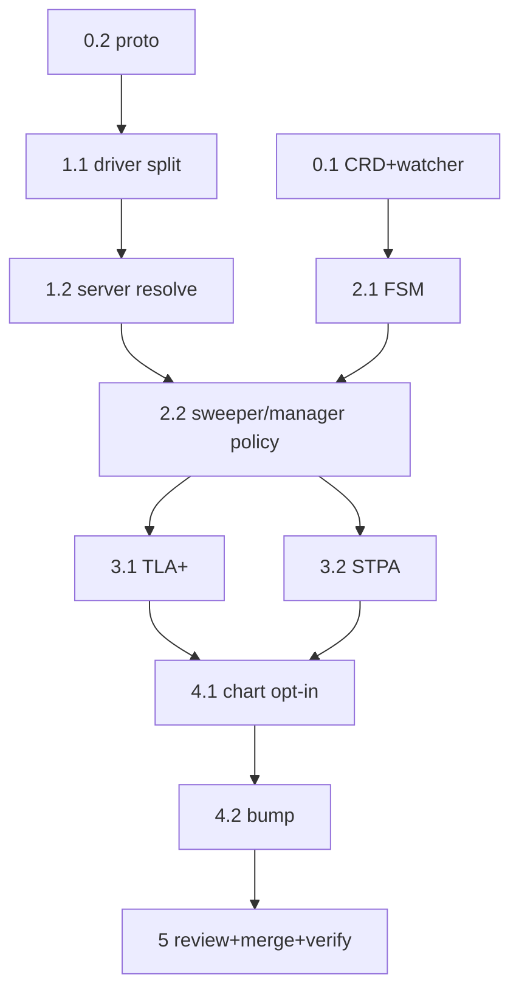

# EmberVM Interruptible Bank Implementation Plan

> **For Claude:** REQUIRED SUB-SKILL: Use superpowers:executing-plans to implement this plan task-by-task.

**Goal:** Add an opt-in, per-workload interruptible bank mode so a scale-to-zero stateful datastore never cold-boots in steady state (every wake is hot or a warm restore), per ADR embervm/008.

**Architecture:** The bank becomes two-phase and abortable, gated behind a boolean `spec.stateful.interruptibleBank` CR field (default off, atomic bank unchanged). The node daemon splits its bank into a `checkpoint` (pause + snapshot to a temp path, VM left paused and resumable) and a `resolve` (commit = destroy + record bundle, or abort = resume + discard temp snapshot). The control plane owns the commit-vs-abort decision: if a connection has parked for the workload during the snapshot it aborts (resumes the same live attach, no generation bump), otherwise it commits. A coarse flap guard forces a commit after too many consecutive aborts so a workload cannot thrash pause/resume for tens of minutes.

**Tech Stack:** Protobuf (node.proto), Go (noded driver + server, `substrate` handle), Elixir/OTP (control-plane sweeper, manager, FSM, watcher), Kubernetes CRD + Helm, TLA+ (bank-relight spec), STPA.

**Reference:** `docs/decisions/embervm/008-interruptible-bank-stateful-datastores.md`

---

## Execution notes (read before Task 1)

- **No local test loop.** Per CLAUDE.md, Go and Elixir tests run on BuildBuddy CI after push, not on a workstation. So the per-task "run the test" steps mean: write the failing test and the implementation in the task, commit, and verify at the **phase-boundary CI run** (`git push` then `gh pr checks <n> --watch`). Do not attempt `bazel test` or `mix test` locally. Within a task, use `go build` / `gofmt` and `mix compile` only as fast local sanity where available (Go builds locally; the Elixir toolchain is hermetic via Bazel and may not build on a workstation, so treat Elixir as CI-verified).
- **One PR, phase commits.** Everything lands on `feat/embervm-interruptible-bank` (worktree `/tmp/claude-worktrees/interruptible-bank`), which already carries the ADR commit. Commit per task; push at phase boundaries to get a CI signal on that slice.
- **Formatter + BUILD drift.** Run `bazel/tools/format/fast-format.sh` before each commit. It rewrites BUILD files via gazelle; per the local-gazelle-label-drift note, revert any BUILD label churn that is not a genuine new target before committing (`git checkout -- <BUILD>` for drift-only changes; keep real new-target additions).
- **Proto codegen.** Editing `node.proto` requires regenerating the Go + Elixir stubs the same way the repo already does (the proto-codegen path from the embervm build). Confirm the generated-code target and run it; do not hand-edit generated files.
- **Chart bump.** The CR/values changes need `bazel/tools/git/bump-chart.sh projects/embervm` in the same PR (Task in Phase 5).

---

## Phase 0: Contract and gating (the seam and its guards, tests first)

### Task 0.1: CRD field + watcher validation for `interruptibleBank`

**Files:**
- Modify: `projects/embervm/chart/crds/workload-crd.yaml` (the `stateful` properties block, near `idleBankSeconds`)
- Modify: `projects/embervm/control/lib/embervm/workload_watcher.ex` (`parse_stateful/1` and the `@stateful_defaults`, plus a validation that the field is boolean and only present on class `stateful`)
- Test: `projects/embervm/control/test/embervm/workload_watcher_test.exs`

**Step 1: Write the failing tests.** Add to `workload_watcher_test.exs`:
- a stateful CR with `spec.stateful.interruptibleBank: true` parses to `entry.stateful.interruptible_bank == true`;
- a stateful CR omitting the field defaults to `false`;
- a non-stateful class carrying `spec.stateful` is still rejected (unchanged), i.e. the field does not leak the block onto other classes.

**Step 2: Verify fail** (at phase CI): the parse assertion fails because `interruptible_bank` is not extracted.

**Step 3: Implement.**
- CRD: add under the stateful `properties` block:
  ```yaml
  interruptibleBank:
    type: boolean
    default: false
    description: >-
      Opt in to the two-phase interruptible bank (ADR embervm/008): a wake
      arriving during a bank resumes the paused VM (hot) instead of cold
      booting, and a clean bank commits for a warm relight. Off = the atomic
      pause-snapshot-destroy bank. Only honored for class stateful. NOTE: a
      boolean for a single alternative; a future third bank strategy is
      expected to supersede this with a `bankMode` enum.
  ```
- Watcher: add `interruptible_bank: false` to `@stateful_defaults`; in `parse_stateful/1` extract `Map.get(s, "interruptibleBank") || @stateful_defaults.interruptible_bank`. No new rejection needed beyond the existing class gate (the field lives inside `spec.stateful`, already rejected for non-stateful classes).

**Step 4: Verify pass** (phase CI).

**Step 5: Commit** `feat(embervm): interruptibleBank CR field + watcher parse (ADR 008)`

### Task 0.2: Proto two-phase StopStateful contract

**Files:**
- Modify: `projects/embervm/proto/embervm/node/v1/node.proto` (`StopStatefulMode`, `StopStatefulRequest`/`Response`, and the `StopStateful` rpc doc)
- Regenerate: Go + Elixir stubs (run the repo's proto codegen target; do not hand-edit generated output)
- Test: `projects/embervm/noded/server/stateful_test.go` (contract-shape test only here; behavior in Phase 1)

**Design decision (from ADR):** keep a single `StopStateful` rpc but make it two-phase via the mode + a phase field, so the wire surface stays one verb:
- Add `STOP_STATEFUL_MODE_CHECKPOINT = 3;` (pause + snapshot to temp, VM left paused, bundle NOT yet published) returning a `checkpoint_token` (opaque handle to the paused VM + temp snapshot).
- Add a `ResolveStateful` rpc: `rpc ResolveStateful(ResolveStatefulRequest) returns (ResolveStatefulResponse);` with `ResolveStatefulRequest { Trace trace; string vm_id; string checkpoint_token; ResolveMode mode; }` where `ResolveMode { RESOLVE_MODE_UNSPECIFIED=0; RESOLVE_MODE_COMMIT=1; RESOLVE_MODE_ABORT=2; }`. COMMIT publishes the temp snapshot as the bundle + destroys the VM (returns `{snapshot_ref, generation, size_bytes}`); ABORT resumes the paused VM + deletes the temp snapshot (returns empty).

Rationale for CHECKPOINT-on-StopStateful + separate ResolveStateful (rather than two new verbs): CHECKPOINT is a bank variant so it belongs with the other bank modes; the resolve is a genuinely new transition and reads clearest as its own verb.

**Step 1: Write the failing test.** In `stateful_test.go`, assert the generated types exist and the server rejects `ResolveStateful` with an unknown `checkpoint_token` as `FAILED_PRECONDITION` (implementation stub added in Phase 1; here the test names the contract).

**Step 2: Verify fail** (compile error / codegen).

**Step 3: Implement** the proto edits; regenerate stubs; add a minimal `ResolveStateful` server stub returning `Unimplemented` so the tree compiles.

**Step 4: Verify pass** (phase CI: proto vocabulary sync test in the ADR-006 conformance layer should also see the new verbs; update the vocabulary fixture if that test enumerates rpcs).

**Step 5: Commit** `feat(embervm): two-phase StopStateful proto (CHECKPOINT + ResolveStateful, ADR 008)`

**Phase 0 boundary:** push branch, open the PR (draft), watch CI. Fix codegen/vocabulary-sync failures before Phase 1.

---

## Phase 1: Node daemon (the mechanical two-phase, driver + server)

### Task 1.1: Driver checkpoint/resolve split

**Files:**
- Modify: `projects/embervm/noded/fcvm/driver/driver.go` (`SnapshotStateful` around line 1307; it already Pauses + CreateSnapshots and, on success, leaves the VM paused without Release, so the destroy is already separable)
- Test: `projects/embervm/noded/fcvm/driver/driver_test.go` (the fake fcclient already drives Pause/CreateSnapshot/Resume)

**Step 1: Write failing tests.** With the fake fcclient:
- `CheckpointStateful` pauses + writes the temp snapshot and returns a token WITHOUT publishing the bundle (no genfile/snapfile at the final path yet) and WITHOUT releasing the VM;
- `ResolveStatefulCommit(token)` publishes the temp files to the final bundle path (memfile, genfile, snapfile last) and Releases the VM;
- `ResolveStatefulAbort(token)` Resumes the VM and removes the temp files, publishing NO bundle;
- Abort then a later clean checkpoint+commit still yields a valid bundle (no leaked temp state).

**Step 2: Verify fail.**

**Step 3: Implement.** Refactor `SnapshotStateful` into:
- `CheckpointStateful(ctx, h, snapshotRef, generation) -> (token, err)`: the current Pause + `CreateSnapshot` to `snapTmp`/`memTmp`, but STOP before the renames. Retain the handle + temp paths + generation keyed by an in-memory `checkpointToken`. Do NOT Release on success.
- `ResolveStatefulCommit(ctx, token) -> (SnapshotRef, err)`: the current publish sequence (rename memTmp, write genfile, rename snapTmp last) + `Release(ctx, h)`; return the ref.
- `ResolveStatefulAbort(ctx, token) -> err`: `inst.client.Resume(ctx)`; on Resume failure fall back to `Release` (the driver's existing dead-handle discipline) and surface the error so the control plane commits-instead next time; `os.Remove` the temp files.
Keep the old `SnapshotStateful` as a thin wrapper (Checkpoint + immediate Commit) so the atomic path and existing callers/tests are unchanged.

**Step 4: Verify pass** (phase CI). `go build ./...` locally as a sanity check.

**Step 5: Commit** `feat(embervm): driver checkpoint/resolve split for interruptible bank`

### Task 1.2: Server `ResolveStateful` + CHECKPOINT wiring

**Files:**
- Modify: `projects/embervm/noded/server/stateful.go` (`StopStateful` switch: add CHECKPOINT case calling `stopStatefulCheckpoint`; add `ResolveStateful` handler)
- Modify: the stateful registry to track checkpoint tokens (a paused-but-not-destroyed VM must be found by `ResolveStateful`)
- Test: `projects/embervm/noded/server/stateful_test.go`

**Step 1: Write failing tests.**
- CHECKPOINT on a live stateful VM returns a token and leaves the instance discoverable as `checkpointed` (not bankable again, not destroyed);
- `ResolveStateful(COMMIT)` returns `{snapshot_ref, generation, size_bytes}` and evicts any prior bundle (the existing one-bundle-per-workload rule);
- `ResolveStateful(ABORT)` returns empty, the instance is serving again, and no bundle was recorded;
- `ResolveStateful` with an unknown token is `FAILED_PRECONDITION`;
- a second CHECKPOINT of an already-checkpointed vm is `FAILED_PRECONDITION` (mirrors the existing "stop already in flight" guard).

**Step 2: Verify fail.**

**Step 3: Implement** the CHECKPOINT case (calls `CheckpointStateful`, records the token in the registry) and `ResolveStateful` (COMMIT calls `ResolveStatefulCommit` + bundle-registry update exactly as today's `stopStatefulBank` tail does; ABORT calls `ResolveStatefulAbort` + returns the instance to the live registry). Keep `stopStatefulBank` (atomic) intact for the default path.

**Step 4: Verify pass** (phase CI).

**Step 5: Commit** `feat(embervm): noded ResolveStateful + CHECKPOINT handler`

**Phase 1 boundary:** push, watch CI (Go tests). The node daemon can now checkpoint and resolve; nothing calls it yet.

---

## Phase 2: Control plane (policy: who aborts, who commits, and the FSM)

### Task 2.1: FSM abortable-banking edges

**Files:**
- Modify: `projects/embervm/control/lib/embervm/stateful_state.ex` (add `checkpointing`/`checkpointed` states or reuse `banking` with a resolve sub-state; add edges `banking -> abort_resume -> serving` and `banking -> commit -> banked`)
- Test: `projects/embervm/control/test/embervm/stateful_state_test.exs`

**Step 1: Write failing tests** for the new legal transitions and the illegality of skipping resolve (a checkpointed instance cannot go straight to `banked` without a commit, nor to `serving` without an abort).

**Step 2: Verify fail.**

**Step 3: Implement** the FSM edges. Read the existing `@edges` map and mirror the serving/session bank-abort precedent (`{:banking, :bank_abort} => :serving` already exists for serving; add the stateful analogue driven by the resolve outcome). Keep the projection (which states are durable vs transient) consistent: a `checkpointed` instance is transient (like `banking`), not projected.

**Step 4: Verify pass** (phase CI).

**Step 5: Commit** `feat(embervm): stateful FSM abortable-banking edges`

### Task 2.2: Sweeper drives checkpoint, control plane resolves on parked-connection

**Files:**
- Modify: `projects/embervm/control/lib/embervm/stateful_sweeper.ex` (the bank worker: for an `interruptible_bank` workload, call CHECKPOINT then decide COMMIT/ABORT by re-checking the activator's parked-connection state for the workload, extending the decision-7 recheck THROUGH the snapshot window instead of only before it)
- Modify: `projects/embervm/control/lib/embervm/stateful_manager.ex` (a wake that arrives for a workload currently `checkpointed` must coalesce onto the in-flight resolve: signal ABORT and park until the resume republishes, rather than cold-booting)
- Modify: the workload catalog read so the sweeper/manager see `interruptible_bank`
- Test: `projects/embervm/control/test/embervm/stateful_sweeper_test.exs`, `stateful_manager_test.exs`

**Step 1: Write failing tests** (with the existing FakeNode/stub stubs):
- interruptible workload, no connection during checkpoint -> COMMIT -> banked bundle recorded, generation stamped;
- interruptible workload, a parked connection appears after CHECKPOINT -> ABORT -> instance back to serving, NO bundle, generation unchanged (no bump);
- a wake during `checkpointed` resolves to the resumed (hot) endpoint, never a cold boot;
- non-interruptible workload is unchanged (atomic BANK path);
- flap: N consecutive aborts-without-commit force a COMMIT on the next cycle (guard).

**Step 2: Verify fail.**

**Step 3: Implement.**
- Sweeper bank worker branches on `interruptible_bank`. Interruptible path: `CHECKPOINT` -> re-scrape parked/active state -> if a connection is waiting, `ResolveStateful(ABORT)` + republish (serving); else `ResolveStateful(COMMIT)` + record bundle (banked). The abort/commit outcome drives the FSM edge from 2.1.
- Manager: when `handle_wake` finds the workload `checkpointed`, do not cold-boot; register the caller as parked (the abort signal the sweeper reads) and reply once the resume republishes.
- Flap guard: track consecutive aborts per workload in the sweeper state; once it exceeds a coarse threshold (config, default e.g. 20 within the guard window), force `COMMIT` regardless of a parked connection so the workload settles. Log when the guard fires.
- Forced roll (max-lifetime): the lifetime path always `COMMIT`s (or DESTROYs) even with a connection waiting; assert this in a test.

**Step 4: Verify pass** (phase CI).

**Step 5: Commit** `feat(embervm): interruptible bank policy (checkpoint, resolve-on-park, flap guard)`

**Phase 2 boundary:** push, watch CI (Elixir tests). The full path works end to end in the control plane's test doubles.

---

## Phase 3: Formal + safety (invariant honesty)

### Task 3.1: TLA+ bank-relight spec delta

**Files:**
- Modify: the bank-relight TLA+/PlusCal spec under the embervm formal-spec tree (locate via ADR 006 and `ls` the spec dir; per ADR 006 the pilot scope explicitly includes session/stateful bank-relight)
- Modify: the CI vocabulary-sync fixture if it enumerates FSM states/edges or proto verbs

**Step 1:** Add the `checkpointed` state and the `abort_resume`/`commit` edges to the spec. Extend the safety invariant to encode the ADR's keep rule: NO bundle is ever recorded whose VM subsequently resumed (a committed bundle implies the VM was destroyed at commit), and a relight only ever loads a bundle whose stamped generation equals the volume generation (already modeled). Add a liveness/anti-thrash property that the flap guard forces eventual commit (a workload cannot abort forever).

**Step 2:** Run TLC via the repo's spec-check path (CI). Expected: invariants hold; if TLC finds a counterexample, it is a real design bug to fix in Phase 2 (this is the point of the spec).

**Step 3: Commit** `test(embervm): TLA+ bank-relight delta for interruptible bank`

### Task 3.2: STPA pass

**Files:**
- Modify: `projects/embervm/STPA.md` (or run the `stpa` skill against `projects/embervm`)

**Step 1:** Add unsafe-control-action rows for the new transitions: a COMMIT issued while a connection is live (violates decision-7), an ABORT that fails to resume and strands a paused VM, a resolve lost between CHECKPOINT and resolve (crash mid-bank), and a stale temp snapshot mistaken for a bundle. Confirm each is mitigated by the design (decision-7 gate, resume-fail-falls-back-to-commit, checkpoint tokens reaped on control-plane restart, publish-snapfile-last discipline) or file the gap.

**Step 2: Commit** `docs(embervm): STPA rows for interruptible bank`

**Phase 3 boundary:** push, watch CI (TLC + STPA render). Resolve any counterexample before Phase 4.

---

## Phase 4: Wire the opt-in + roll out

### Task 4.1: Chart wiring + enable for demo-postgres

**Files:**
- Modify: `projects/embervm/chart/values.yaml` (`demoPostgres.interruptibleBank: true`; `scratchPostgres` gets the value plumbed but default false until vetted)
- Modify: `projects/embervm/chart/templates/workload-demo-postgres.yaml` (render `interruptibleBank: {{ .Values.demoPostgres.interruptibleBank }}`)
- Modify: `projects/embervm/chart/templates/workload-scratch-postgres.yaml` (render the field, default false)
- Modify: `projects/embervm/deploy/values.yaml` (enable for demo-postgres; keep the aggressive `idleBankSeconds: 1` now that it is safe)

**Step 1:** `helm template embervm projects/embervm/chart/ -f projects/embervm/deploy/values.yaml | grep -A2 interruptibleBank` shows `true` for demo-postgres, `false` for scratch-postgres.

**Step 2: Commit** `feat(embervm): opt demo-postgres into interruptible bank`

### Task 4.2: Chart bump + format

**Files:** `projects/embervm/chart/Chart.yaml`, `projects/embervm/deploy/application.yaml` (via `bazel/tools/git/bump-chart.sh projects/embervm`)

**Step 1:** Run `bazel/tools/format/fast-format.sh`; revert BUILD label drift (keep genuine new-target additions). Run the chart bump. Commit `chore(embervm): bump chart for interruptible bank`.

**Phase 4 boundary:** push, watch full CI green.

---

## Phase 5: Merge + verify live

### Task 5.1: Review, merge, roll

**Steps:**
- One comprehensive Opus code review of the full diff (per CLAUDE.md's one-review-per-PR rule), focused on: the driver checkpoint/resolve state machine (no leaked paused VMs, no half-published bundles), the sweeper resolve race (a connection arriving in the gap between the scrape and the resolve), the FSM edge legality, and the flap-guard arithmetic.
- `gh pr merge --rebase` on green.
- Watch main Push images -> ArgoCD sync embervm -> noded re-bake (the postgres guest is unchanged, so no rootfs rebuild, but the control-plane/noded images roll).

### Task 5.2: Live verification (the demo)

**Steps:** the exact sequence that used to fail is the acceptance test. Via the monolith backend (runfiles python), against demo-postgres:
- fresh boot (cold, expected once), then a query -> serve;
- click again fast (mid-bank): status shows `checkpointed`/`banking` then the query returns **hot** (`classification` not `cold`), never the `no pg_hba`/cold-boot path;
- leave it idle, confirm it commits to `banked` with `pair_valid: true`;
- next query relights (warm, sub-100ms connect);
- hammer it (rapid clicks for > the flap window) and confirm it eventually settles to `banked` rather than spinning.
- Confirm scratch-postgres (opt-out) still behaves exactly as before.

**Acceptance:** demo-postgres never returns a cold classification from a steady-state wake; the flap guard settles a hammered workload; scratch-postgres unchanged.

---

## Task dependency summary


