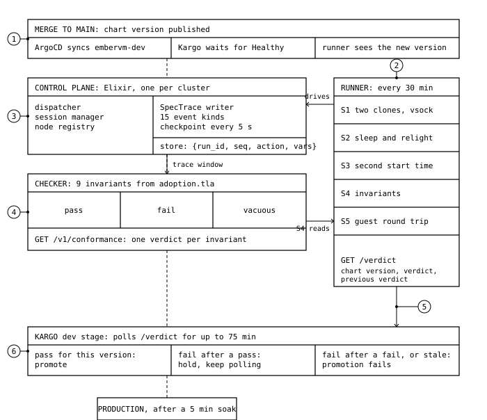

[EmberVM](https://github.com/jomcgi-org/homelab/tree/main/projects/embervm) is my Firecracker microVM orchestrator. Its control plane is modelled in TLA+ and model checked in CI, which proves the model and nothing about the Elixir that ships.

So every chart version goes to a dev copy of the cluster, a runner exercises it, and the control plane's own trace is checked against nine of the spec's invariants. The verdict decides whether the chart promotes.

## 1. The loop

| Key | Part |
|---|---|
| 1 | A merge publishes the chart; ArgoCD syncs it to dev. |
| 2 | A runner drives five scenarios every 30 min: clones, a session sleeping and relighting, a second session, the invariant check, a guest round trip. |
| 3 | The control plane writes a trace of what it did. |
| 4 | A checker replays the trace against the nine invariants. |
| 5 | One verdict per chart version. |
| 6 | Kargo promotes on a pass. Two reds in a row, or 75 min without a verdict, fails the promotion. |

## 2. One run

A scheduled run from this morning, 55 s of trace. Each VM is a bar; each rule is a cell that fills as the checker finds something to check.

### 2.1 Replay

### 2.2 The nine rules

| Rule | Asserts |
|---|---|
| No double assign | No two live tasks share a VM. |
| Dispatch provenance | Every dispatch says where its VM came from. |
| Adopt idempotent | A VM re-learned after a restart appears once. |
| Health monotonic | A node goes down and comes back through the states in order. |
| Prime before checkpoint | Every VM in a checkpoint was booted or adopted first. |
| Destroy intent first | A destroy is recorded as intended before it is recorded as done. |
| No destroy before confirm | A VM is recorded destroyed only after the node confirms it. |
| Eventually dispatched | A queued task gets a VM within two checkpoints. |
| Inventory reconciled | The VMs the node reports live are the VMs the control plane knows about. |

A cell says `pass`, `fail` or `vacuous`. Vacuous means nothing in the window gave that rule anything to check: three rules need a node to go unhealthy or a restart, and the scenarios don't cause one. It is reported as its own value and never counts as a pass. A run where every rule is vacuous fails.
