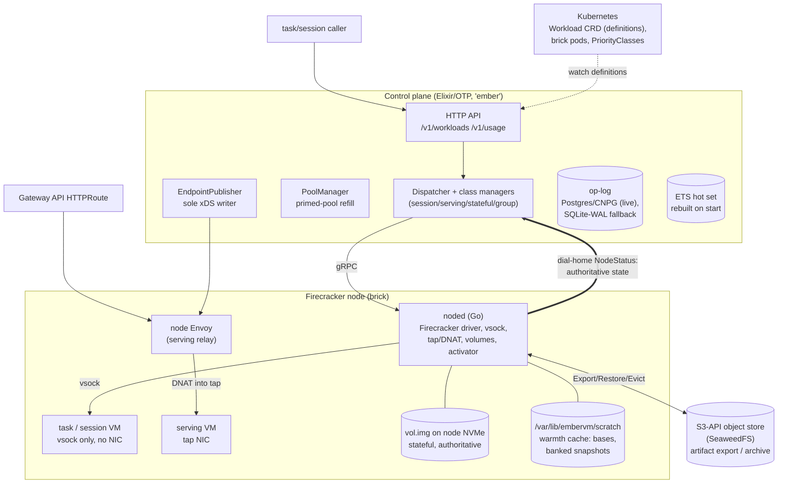
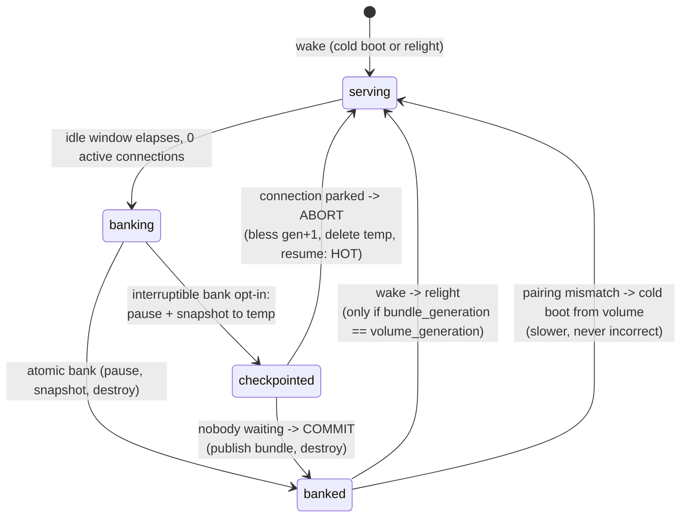

# EmberVM Architecture

A single rolled-up description of how EmberVM operates, written for a reader
who needs to reason about the system without re-reading 33 ADRs.

This document presents the complete decided vision, not only what runs
today, so every section reads as one coherent design. Three kinds of
statement appear, and anything not yet live is flagged inline where it is
claimed, never implied:

- **Built**: how the system behaves today (Accepted ADRs, shipped code).
  Accepted-but-not-built exceptions are called out in their rows: ADR 031's
  detector (#4338) and ADR 033's encryption work (#4691).
- **Decided direction** (**Planned** in tables): agreed in an ADR but not
  yet implemented or only partially landed, named with the ADR and, where
  work is scheduled, the tracking issue.
- **Accepted risk**: an eyes-open trade recorded in an ADR (for example
  the ADR 012 fleet co-location clause).

An unflagged claim means live behaviour; if reality and this document
disagree, one of them is a bug to fix.

---

## 1. What EmberVM is

Self-hosted Firecracker orchestration: **a private Lambda equivalent on
metal you own**. An organization sizes (or elastically bounds) a Firecracker
nodepool; EmberVM provides placement, fairness, isolation, metering, and
lifecycle so internal workloads get Lambda-shaped submit / scale-to-zero /
warm-serve behaviour without a hosted FaaS product, without a Kubernetes
object per invocation, and without etcd in the execution path.

This runs on a four-node homelab cluster: three Intel nodes are the cold,
CPU-rich tier and one AMD node holds the warm tier. The concrete fleet shape
is in [the fleet section](#11-the-fleet-today).

**Goals**: private Lambda ergonomics (HTTP invoke, zip or image source,
caps, quotas, internal chargeback); honest scheduling on finite capacity;
isolation by default; the control plane off the hit path; one operable
component (Elixir control plane + Go node daemon + `Workload` CRD, managed
by kubectl/Helm/ArgoCD).

**Non-goals**: a hosted multi-tenant cloud; "agent platform as the product"
(agents are dogfood consumers); every workload class as an equal pillar
(task, serving, session are the core; stateful and composite are optional
advanced classes); pretending capacity is infinite (queue depth, saturation
signals, and admission control are the product surface instead).

The displaced incumbent is Argo-Workflows-shaped orchestration, where every
job is an etcd object and every step is a pod. EmberVM keeps workload
*definitions* in Kubernetes (low churn) and execution state in its own
op-log and memory (high churn).

---

## 2. System overview

### Vocabulary

- **brick**: a fixed-size noded Deployment pod and the unit of VM capacity.
- **noded**: the Go daemon on each brick that owns Firecracker and
  node-local I/O.
- **op-log**: the durable ordered journal of lifecycle and enforcement
  actions.
- **bank / relight**: suspend a VM into a warm snapshot, then restore that
  snapshot.
- **primed / banked / cold / running**: ready pristine, snapshotted,
  fresh-boot, or actively executing instance states. Cold and warm describe
  boot mechanics only; task isolation remains no reuse, including after
  snapshot restore.
- **generation**: the volume incarnation number used to prove state
  provenance and pair a stateful volume with a memory snapshot.
- **principal**: the identity boundary a workload runs as.
- **dial-home**: noded registration and status sent to the control plane.
- **warmth**: a reusable boot artifact, such as a base or banked snapshot,
  that can make the next start faster but is never correctness-critical.

The diagrams use vsock (Firecracker's host-guest socket), DNAT (destination
network address translation), xDS (the Envoy configuration protocol), BEAM
(the Erlang virtual machine), ETS (Erlang Term Storage), and CNPG
(CloudNativePG).



**Division of labour** (each responsibility placed where it is cheapest to
make correct):

| Component | Owns | Never does |
| --------- | ---- | ---------- |
| Control plane (Elixir) | Coordination facts: queue, placement, fairness, backpressure, lifecycle decisions, xDS publication, op-log appends | Carry steady-state payloads; sit on the serving hit path |
| noded (Go, one per brick) | Payload and OS work: Firecracker process supervision, vsock relay, tap/DNAT, volume attach, snapshot byte movement, node-local wake | Make fleet-wide decisions; join the BEAM cluster (it speaks a narrow gRPC surface instead) |
| Envoy (edge + node tier) | The serving request path, health-based ejection, rate limits | Lifecycle |
| Kubernetes | Low-churn `Workload` definitions, brick pod scheduling, PriorityClasses | Per-invocation objects, execution state |
| Object store (SeaweedFS S3) | Artifact export/archive, off-node durability | Anything on a hot path (read only on deliberate restore or local miss) |

Bricks **dial home**: on start and on a jittered interval each noded POSTs
its identity `{node, pod_uid, address, boot_id}` to `/v1/nodes/register`;
the control plane adopts it keyed by `(node, pod_uid)` and streams
`WatchNode`. The control plane never lists-and-watches daemon pods. Growing
the fleet is labelling a node (`homelab.io/firecracker=true`), not a values
edit.

### How one invocation works

**A task (the all-miss case):**

1. A caller submits `POST /v1/workloads`.
2. The dispatcher assigns a primed VM from the matching pool.
3. It sends gRPC to noded on the chosen brick; the payload enters the VM
   over vsock, the result comes back, the VM is destroyed after one task,
   and the op-log records the action.

**A serving hit (the steady state):**

1. An edge HTTPRoute reaches node-local Envoy, which the control plane
   already programmed over xDS.
2. Kernel DNAT carries the request into the serving VM's tap NIC. The
   control plane is not involved.

**A wake (a serving or stateful miss):**

1. The request reaches the fallback activator endpoint and parks.
2. A single-flighted wake fires, the real endpoint is published, and bytes
   splice through to it.

The task and wake paths are the only ones on which the control plane sits.
That is the hit/miss invariant stated in section 5.

---

## 3. Workload classes

Definitions are Kubernetes `Workload` CRs (schema-validated, GitOps-synced);
`kubectl get workloads` reads back `snapshotRef`, `observedGeneration`, and
readiness. `source` is a oneOf ladder: `image` (bring an OCI image, no SDK;
contract is "listen on the declared port, answer a health path") and `zip`
(runtime base + Lambda-compatible `handler(event, context)` shim; archives
are fetched and unpacked inside the disposable guest).

| Class | Semantics | Network | State | First consumer |
| ----- | --------- | ------- | ----- | -------------- |
| **task** | Fresh VM per invocation from a pristine base, destroyed after one task. Dispatch is assignment-only from a primed pool | vsock only, no NIC | none | scan fleet (semgrep), zip functions |
| **session** | Bank/relight sandbox: idle snapshot to disk, restore on next invoke, principal-bound lineage | vsock only, no NIC | memory snapshot (+ workspace tier) | agent sandboxes |
| **serving** | Long-lived warm HTTP endpoint; Envoy routes hits, CP only on miss/wake | tap NIC | none durable | tenant web APIs, og-image |
| **stateful** | Scale-to-zero singleton datastore; L4 wake-on-connect; volume owns data, snapshot owns warmth | L4 via node Envoy | `vol.img` on node NVMe (authoritative) | demo-postgres |
| **composite** | Multi-VM group, private per-group /24, all-or-none bundle-set bank/relight; warmth only, no member volumes | per-group bridge | group snapshot set | no live consumer |

**Decided direction, not yet built:**

- **Isolated high-throughput lane** (ADR 015): Envoy routes straight to
  per-brick listeners, and each brick pops a fresh VM per request.
- **Persistence as a declared property** (ADR 027): workloads declare
  persistence flags; memory and filesystem persistence decouple from class.
- **Composition** (ADR 022 as corrected by 024/026): multi-component apps
  become independent Workloads wired by bindings rather than composite
  groups.

---

## 4. Lifecycle

### Stateful bank/relight (with the interruptible bank, ADR 008)



Facts that make this safe:

- **Bank only starts at zero active connections**; a long-lived connection
  is never severed by an idle bank (rolls are the exception, bounded by the
  two-minute preemption contract, ADR 009).
- **Resume requires an exact (memory snapshot, volume generation) pair**;
  mismatch discards warmth and cold-boots from the durable volume.
- **The interruptible bank** (`spec.stateful.interruptibleBank: true`, off
  by default) makes steady-state wakes always hot or warm, never cold. The
  three cold exceptions: genuine first boot, explicit operator reset, and
  the max-lifetime forced roll.
- **Only a snapshot taken immediately before teardown may be kept.** Any
  snapshot whose VM resumes is discarded (the abort orders bless-generation,
  delete-temp, resume, so a surviving temp is always refused by pairing).

### Generation blessing and quarantine (ADRs 011, 017, 018)

The control plane is the adjudicator of volume generations, with exactly
three legitimate issuance shapes (the canonical exception table lives in
ADR 011):

1. **CP-issued pre-dispatch**: blessed durably before a wake/attach
   (op-log-before-dispatch). The default.
2. **Checkpoint-abort auto-heal** (ADR 017): noded's resolve-timeout
   auto-abort self-bumps by exactly +1 on the same `vm_id`. A durable
   `checkpoint_dispatched{workload, vm_id, generation}` record lets a
   restarted CP prove the +1 was its own checkpoint and bless it instead of
   quarantining. Anything unproven stays quarantined; the break-glass
   runbook is `docs/runbooks/embervm-stateful-generation-quarantine.md`.
3. **Delegated advancement** (ADR 018): a durable, bounded
   `wake_grant{workload, volume_node, gen_floor, gen_ceiling, expires_at}`
   authorises the volume's anchor brick to advance the generation while the
   CP is away (Fork A: gap budget, default k=4; time-bounded class for
   sub-second-banking demos). Fork B (steady-state lease, brick-owned
   idle-bank) is the declared north star.

An advancement no grant covers is quarantined on sight. The grant changes
who may *issue* a generation, never who may *write* a volume (invariant 6).

### Wake path and the node-local activator (ADR 018, Fork A partially landed)

A request to a scaled-to-zero workload lands on a fallback endpoint, parks,
and triggers a single-flighted wake; the real endpoint is then published and
bytes splice. The activator (L7 serving, L4 stateful/composite) belongs in
noded rather than the CP pod so that a CP `Recreate` roll cannot black-hole
cold wakes: stable DNAT from the node IP, `NodeStatus` advertises the
activator endpoint, `EndpointPublisher` renders it as the fallback, and
instance ids minted node-side carry `origin: ACTIVATOR` for the CP to adopt
and backfill on reconcile. **Planned** (Fork A): partially landed, soak
ongoing.

### Sessions: the durability ladder (ADRs 016, 027, 029, 030)

| Tier | Window | Artifact | Pinning |
| ---- | ------ | -------- | ------- |
| Live | 6h continuous ceiling (`maxLifetimeSeconds`) | running VM | node-resident |
| Warm bank | 7 days from last bank | memory snapshot in S3 | CPU-vendor + base-generation |
| Durable workspace | 7 days from last use | zstd content-addressed file set | none |

Resume is one interface with four verbs: cold boot; base-snapshot restore;
warm (memory) restore; base + workspace hydration. The CP picks the cheapest
unexpired artifact; the session contract is instant for 6h, restorable for
7 days. ADR 027 amends this ladder:
capture may decouple from bank (close-triggered for no-memory-snapshot
workloads), retention becomes `latest + N`, and the workspace size cap
becomes a declared soft budget.

**The 6h ceiling is a version-convergence bound, not a data lifetime** (ADR
030). It exists so a session cannot ride a stale base image forever, since a
session pinned to an old base keeps that base's registry entry live and
blocks the retention sweep from reclaiming it. It is deliberately not raised
to buy continuity. Continuity comes from **adoption** instead: lineage is
decoupled from session generation, so `session_id == lineage_id` holds only
for the first generation, and a later generation inherits the prior
lineage's workspace rather than starting blank. That is why a lineage spans
weeks of shorter runs even though no single session may.

**Parked sessions count as disk, not against `concurrency.cap`** (ADR 029).
A session in ADR 027's `memory: false, filesystem: true` quadrant parks to
its workspace volume holding zero RAM, so counting it as live would let
idle sessions starve the cap while nothing runs. `concurrency.cap` bounds
concurrently running VMs only, and wake does not re-check it: placement's
memory admission and the per-principal wake-rate limit are what protect the
receiving node.

The S3 artifact GC uses an 8-hour TTL for stateful warmth and 7-day TTLs for
session memory, serving snapshots, session workspaces, and group sets.

---

## 5. The invariants

These are the rules everything else rests on. Every design change is judged
against them.

1. **The hit/miss invariant.** The control plane is on the invocation path
   if and only if the invocation requires a lifecycle action (create,
   restore, wake). Steady-state serving requests go Envoy to VM and never
   traverse the control plane. Task execution is the degenerate all-miss
   case (fresh VM per task by policy), so the dispatcher is on that path by
   definition, bounded by fleet restore capacity rather than by BEAM.

2. **Facts through the control plane, payloads never.** Snapshot bytes move
   node-to-store via noded; serving traffic moves through Envoy; the control
   plane carries facts. The two deliberate exceptions are lifecycle-rate:
   the parked first request after a serving miss, and task dispatch/results.

3. **No VM or snapshot lineage ever crosses a principal.** Content-addressed
   dedup across principals is forbidden (erasure would become a cross-tenant
   reference-counting problem). The workload-class table in section 3
   carries the per-class network and state boundaries.

4. **Fail closed on enforcement, fail open on warmth, and metering is not
   enforcement.** Containment (concurrency caps, fair queues, admission, the
   node-side pressure predicate, node-confirmed destruction) fails closed.
   Warmth (a missing snapshot, an unreachable store) fails open to a cold
   boot: slower, never incorrect. Metering is counting, not enforcement, and
   **fails open by design** (ADR 020 decision 6): a brick out of contact
   keeps running and keeps counting, and unreconciled spend is written off.
   Cutting off a principal is an admission action (stop minting tokens, 402
   at the edge), not a metering one.

5. **The node agent is authoritative for instance runtime state** (ADR
   014). What a brick reports over
   dial-home about its VMs, taps, and volumes is the truth; control-plane
   tables are a reconciled cache. The one carve-out is destruction: an
   instance is recorded destroyed only after the owning node confirms
   teardown, and reconciliation is fail-closed toward destruction (an
   unrecognised node VM is an orphan to destroy, unless it carries the
   `origin: ACTIVATOR` marker, in which case it is adopted and backfilled).

6. **Single-writer for stateful is a physical fact, not a protocol.** The
   storage section explains the raw sparse file, one-writable-attach rule,
   and generation-as-provenance detail; failover remains a deliberate
   operator action and the partition window is bounded by the brick silence
   timeout (ADR 023).

7. **Durable-before-observed for the journal.** Every lifecycle and
   enforcement action is an ordered op-log append; callers await their
   (group-committed) batch. The op-log doubles as the audit record.

8. **Kubernetes arbitrates pods; EmberVM arbitrates VMs; the pod is the
   ABI.** No scheduler or autoscaler code is imported and no node
   provisioning is rebuilt. The capacity section's three-layer table shows
   the levers, and a Pending brick is the scale-up signal or the fleet-full
   page.

9. **Classes are reuse semantics; substrates are lanes.** New execution
   technologies (Hyperlight, wasm) enter as lanes under existing classes,
   never as new classes. Persistence is becoming an orthogonal declared
   property too (ADR 027).

10. **Users express posture, never mechanics.** The surface is a small set
    of declared scalars in user-facing units, each under a platform ceiling
    with a non-escalation rule. Priority rungs, disruption budgets, grace
    periods, and CPU are platform-derived; users do not select those
    mechanics. The scalar details are carried by the storage and
    control-plane sections.

---

## 6. Control plane internals

- **State model**: hot working set in ETS (rebuilt on start, healed by
  adoption from node reports); durable book-of-record in the op-log behind
  the `Embervm.OpLog` behaviour. Postgres via CNPG is what the homelab
  runs; SQLite-WAL remains the zero-dependency single-node fallback, and
  `Embervm.Application.op_log_mod/0` selects between them purely on
  `EMBERVM_OPLOG_DSN` being set, so the pod spec names the live backend.
  Either adapter creates its own schema on boot, so there is nothing to
  migrate. The dispatch path never reads the durable store.
- **Retention** (ADR 002): result TTLs enforced at read time; terminal tasks
  pruned past 7 days; the ops journal prefix-compacted past a 30-day horizon
  behind a durable `compacted_through_seq` marker; PVC usage alerted at 80%.
  Long-horizon audit is SigNoz.
- **Adoption**: noded reports `primed_vm_ids`, session VMs,
  checkpoint-pending VMs, and banked artifacts on every `NodeStatus`; the
  dispatcher and managers reconcile on boot and every sweep. This is the
  standing fix for the restart-wedge bug class, and the protocols are
  model-checked (ADR 006). Three PlusCal specs live in
  `projects/embervm/specs/` and run under TLC in the build: `adoption.tla`
  (VM lifecycle and adoption), `bank_relight.tla` (session bank/relight
  generation pairing), and `quota.tla` (the fail-closed per-principal daily
  quota gate). Ten genrules drive `//bazel/tla:tlc.sh` across their cfgs, so
  a spec violation is a red build rather than a report, and the layer-1
  vocabulary guard (`vocabulary.exs`) keeps the specs honest against the
  code. Layer-2 trace validation (op-log events mapped to TLA+ actions and
  checked against a drill trace) is the part still deferred.
- **Cells** (ADR 007): the unit of horizontal scale is a cell, a complete
  single-writer control plane owning a bounded set of bricks and workloads,
  with one op-log appender (ordering is within-cell only). The seams exist
  now (`cell_id` in the schema, workload-to-cell assignment as data,
  per-cell dial-home address), with exactly one cell (`cell-0`) today. A
  thin stateless fleet layer (route + capacity roll-up) arrives only with a
  second cell.
- **Registry survives restarts**: noded persists its last-synced registry to
  NVMe marked stale; a restarting noded with an absent CP serves warm
  workloads from cache. No dependency's brief absence may turn a warm node
  into a dead one.

**Decided direction (Draft ADRs 019-021):**

- **Op-log restructuring** (ADR 019): payloads separate from facts and `ops`
  are time-partitioned, making principal-scoped erasure an indexed delete.
- **Admission-only control plane** (ADR 020): the CP admits and mints
  encrypted session-routing tokens; peers redistribute under pressure and
  metering fails open.
- **Resource model** (ADR 021): `memMib` is the only declared dial, CPU is
  derived from it, and GB-seconds is the accounting unit.

---

## 7. Capacity, bricks, and Kubernetes

**A brick is the capacity unit everywhere** (ADR 013 section 7, as amended):
a fixed-size noded Deployment pod in a T-shirt size class (v1: `small` for
dense task packing, `large` for 1-2 serving/session VMs), with honest
Guaranteed requests, sized roughly 4-8x the largest VM of its class, a
handful per node. The daemon is budget-agnostic: it reads its ceiling from
its own cgroup, so a size class is a resources block, not a code fork, and
a brick's size is fixed for its lifetime.

| Layer | Owner | EmberVM's lever |
| ----- | ----- | --------------- |
| VM to brick slot | EmberVM control plane | per-brick contiguous-headroom ledger; pack-to-empty scoring; class-exact placement (no cross-class borrowing) |
| Brick pod to node | kube-scheduler | pod shape only |
| Node provisioning | Karpenter (EKS) / nobody (homelab) | brick count vector from the single-writer controller; a Pending brick is the signal |

On the homelab's fixed four-node fleet a Pending brick **is** the fleet-full
signal: the controller flags `:fleet_full`, the dispatcher refuses placement
(503), and a human is paged, rather than overcommitting.

Priority projects onto three axes: PriorityClass ranks brick pools by lane
(occupied-capable bricks always run at default non-preempting priority;
sacrificial low-priority balloon bricks are the burst headroom); QoS is
always Guaranteed; per-workload arbitration happens only in CP dispatch.
Disruption splits workloads into preemptible posture (task, isolated lane)
and durable posture (session, stateful: continuity via banked-state
durability, not node pinning). Remaining node lifetime is a placement input;
a terminating node is a placement target for work that fits its horizon.
Karpenter behaviour is drilled against kwok (a Kubernetes workload
simulator) in CI, path-scoped to the Karpenter-facing modules.

**Brick discovery and scale**: bricks are the only source of node capacity,
so the control plane picks the brick mix from placement demand rather than
running one fixed daemon per node; discovery is dial-home, never a Service
or a per-node DaemonSet. Desired per-class counts are a values knob
reconciled by `Embervm.BrickController` through `/scale`, because ArgoCD
ignores `/spec/replicas` fleet-wide and git-declared replicas would not
sync; instance identity is the kubelet pod UID. Brick autoscale runs at
rung `up` on the `observe -> up -> full` ladder: denial-driven scale-up
acts, clamped to the chart's maxReplicas. **Planned**: promoting to `full`
adds drain-aware scale-down. The live brick mix is deployment state and
lives in the fleet section.

---

## 8. Storage, artifacts, durability

**Artifact model** (ADR 003 generalized by ADR 009): one typed verb family,
`ExportArtifact` / `RestoreArtifact` / `EvictArtifact`, over `ArtifactRef
{kind: BASE | SESSION | SERVING | STATEFUL | GROUP_SET | VOLUME}`.
Control-plane-driven, idempotent per key; evict refuses while referenced.
Keys are namespaced by workload (and vendor, below); ADR 027 adds the
principal-scoped `shared/<principal>/<sha256>` keyspace as a deliberate,
named exception.

**Vendor pinning**: Firecracker memory snapshots restore only within a CPU
vendor (and a narrow intra-vendor matrix), so all warmth artifacts are keyed
by `(vendor, template)` and never cross the boundary; the daemon refuses a
vendor-mismatched restore loudly. Volume data is fully portable. Legacy
artifacts cut before stamping existed are grandfathered: restorable on their
home node forever, never distributed.

**Decided direction (Draft ADR 025):**

- **Local disk is authoritative**: local node NVMe relight needs no network.
- **S3 is a zstd content-addressed archive**, written at bank commit, not a
  hot tier.
- **`archiveInterval`** is the user-facing durability control in
  acceptable-loss units.
- **Failover and node rotation** are deliberate planned-drain operator
  actions.

**Ownership arbitration is class-scoped** (ADR 023, Draft):

| Class | Exclusion | Two-incarnation cost | Mechanism |
| ----- | --------- | -------------------- | --------- |
| stateful | physical (one node, one writable attach) | cannot arise implicitly | none needed; grants are provenance |
| session | none exists | divergence from a common ancestor | durable relinquish record before handoff; divergence bounded, detected by generation comparison on reconnect |
| composite | none (warmth-only) | bundle-set divergence | inherits session rules, governed as one unit |
| serving / task | n/a | nothing durable | n/a |

The divergence bound is the **brick silence timeout**: a brick that has not
heard from the control plane for longer than the timeout (set in ADR 018's
grant-expiry range, ~6h, so a CP roll never trips it) stops serving
everything it holds. Token TTL is a convenience, never the correctness
parameter.

---

## 9. Identity, tenancy, security

Only `principal` and `domain` ship now. A domain is contained in exactly one
principal, so a same-domain-by-default binding can never cross the isolation
boundary. Shared platform definitions (sandbox-session, semgrep) are owned
by a reserved `platform` principal with an explicit broad instantiation
grant, the widest and most-reviewed grant in the system. The op-log's
existing `tenant` field is a deployment constant occupying the Account slot.

**Decided direction (Draft ADRs 024, 026):**

**Hierarchy**:

```text
Account      billing / grouping, NO isolation semantics
 └ Product   grouping, NO isolation semantics
    └ Principal   THE isolation boundary (ADR 001's rule)
       └ Domain   env or grouping within exactly one principal
          └ Workload
```

**Definitions at scale** (ADR 026): one product template plus N enrollment
records, one Git CR per product expanded into CP definitions, and idempotent
registration as a desired-set reconcile.

**Credential handling** (ADR 016 security contract): material may sit where
it can be stolen only if the platform can kill its validity on demand;
otherwise the request moves to the credential. Secrets are classed:
derivable short-lived (class 1, may enter trusted guests, revoked at bank),
fixed-but-rotatable (class 2, brick-lease only, injected at the egress hop),
fixed-manual (class 3, never leaves a central key-sharded swap tier). A
guest holds no credential material: the brick-local proxy on every guest
egress reads the plaintext request, sets the configured header to the real
value (mounted only in the sidecar), and originates a fresh verified TLS
connection onward. Injection fires only when the destination is in that
secret's `egressTo`, so the credential is unreachable at every other host
(`projects/firecracker/substrate/egress-proxy/cmd/swap.go`). Header
injection is used rather than placeholder substitution because a
guest-controlled placeholder can be spliced into a URL and reflect the
credential into a request line. RAM scrubbing before snapshot is rejected
as a mechanism to rely on; revocation at the validator is the control.

**Public surface hardening** (as shipped): the public routes are scoped at their
HTTPRoutes, with serving routes additionally constrained by node Envoy authority
matches and the guest shim's reserved `/shim/` prefix. The `/ember` Bazel demo
(ADR 010) serves each visitor query from a disposable CoW clone of a
warm-Skyframe snapshot: server-controlled argv, zero egress, reaped per
request.

**Guest identity**: a guest never holds a cluster credential (as
shipped, by construction: no NIC, no mounted ServiceAccount); the
platform holds real credentials and acts on the guest's behalf through
the brokered egress path. The audience-scoped projected guest token
(audience `embervm`) is ADR 024 decided direction, not yet shipped.

**Decided direction (Draft ADR agents/055):** GitHub leaves the agent egress
catalog. Host-keyed injection bounds which host a credential reaches, never
which request reaches it, so a prompt-injected guest can shape any GitHub API
call and have the token attached to it. Agent principals instead reach GitHub
through MCP tools whose URLs name the target repo, entitled per Authentik
group and backed by a per-group fine-grained PAT, so what a guest can reach is
a fixed tool set rather than an API surface. The egress broker keeps the
credentials that genuinely need host-keyed injection, the model providers
among them.

---

## 10. Threat model

EmberVM evaluates itself against the threat model published by
[agent-substrate/substrate](https://github.com/agent-substrate/substrate/blob/main/docs/threat-model.md),
adopted as the external conformance frame by ADR embervm/033. The frame is
deliberately not ours: Substrate attacks the same problem from the density
side (many actors multiplexed onto shared warm worker pods), and its threat
enumeration is the most complete public statement of what a multi-tenant
agent execution plane must defend. Scoring Ember against criteria a
competing project wrote keeps these claims falsifiable, and most of Ember's
differentiation is exactly the rows that project lists as planned work
while Ember carries them as shipped invariants.

Vocabulary mapping: their *actor* is Ember's guest workload, their *worker
pod* is a Firecracker slot on a brick, their *atelet* is noded, their
*snapshot* is Ember's warmth artifact (memory snapshot, session bundle,
volume archive). The threat numbering is ours: upstream rows are
unnumbered, so threats are numbered 1 to 43 in upstream document order as
of its 2026-06-25 revision. The enumeration is condensed below;
shared-worker threats with no Ember analogue are answered by the "no reuse
across principals" row, and five unmapped threats do bind on Ember and are
open mapping work, not implied conformance: 8 (template-author reach into
storage), 21 (worker privilege: noded runs privileged with /dev/kvm), 26
(policy propagated out of band with scheduling), 31 (image-extraction
resource limits), and 42 (detection integrations).

### Attacks from guests

| Requirement (their threat #) | Ember state |
| ---------------------------- | ----------- |
| Hardened sandbox, never bare containers (15) | **Built.** Every guest is a Firecracker microVM; there is no container lane. New execution technologies enter as lanes under existing classes (invariant 9), so the sandbox floor is a platform decision, never a workload one. |
| Default-deny actor networking (17) | **Built, stronger** for the cross-actor half: task and session guests have no NIC at all, vsock only, so no actor-to-actor network path exists. Serving guests get a tap device reachable solely via node Envoy authority matches and kernel DNAT (section 2). Egress is the deliberate exception: the brokered proxy lane defaults internal-deny but external-allow (`EGRESS_EXTERNAL: allow`), so guests read the public internet by design, and the credential boundary rather than reachability is the control there (section 9). |
| No guest access to node services, metadata, or cluster DNS (16, 19, 34) | **Built**, with two named exceptions: a vsock guest reaches the shim contract plus the two deliberate holes in the split-horizon egress guardrail, inference and monolith:8091 (`deploy/values.yaml` records that adding an entry is a security decision). No host network namespace, no metadata service, no cluster DNS inside the guest. |
| No Kubernetes or management-API escalation from guests (20, 22) | **Built** where it binds: a guest holds no cluster credential by construction (no NIC, no mounted ServiceAccount). The audience-scoped projected guest token is ADR 024 (Draft), decided direction rather than shipped. Definitions are CP-owned and there is no self-modification verb. |
| Worker state fully reset between actors (18, 27, 30) | **Built by construction.** Ember never reuses an execution environment across principals: a task gets a fresh VM, a session restores only its own lineage, and no VM or snapshot lineage ever crosses a principal (invariant 3). There is no scrubbed-shared-worker path to get wrong, placement is CP-owned, never guest-chosen, and each VM's rootfs and scratch are private to it: no filesystem is shared between guests. |
| Credentials never inside the sandbox by default (28, 29) | **Built.** The brick-local egress proxy holds the real credential and injects it only at the sidecar hop, only for hosts in that secret's `egressTo`; revocation at the validator is the control, and RAM scrubbing is rejected as a mechanism (section 9). **Planned:** per-principal grants at the broker (ADR agents/047) and request-scoped GitHub tool mediation replacing host-keyed injection (ADR agents/055). |
| Quotas and rate limits on creation and spend (9, 33) | **Built** as enforcement machinery: admission fails closed, a configured quota of 0 is a hard stop at submit, and metering rides the operation (invariant 4). The per-principal daily budget is deliberately unset in the reference deployment (`deploy/values.yaml`), so spend is bounded by admission caps and concurrency, not by a per-principal quota, until a budget is set. |
| Snapshot theft, substitution, or self-written snapshots (23, 24, 25, 32) | **Planned** (ADR 033, #4691): per-principal envelope encryption of mutable warmth, digest-verified manifests, and restore authorized by the tuple (principal, lineage, brick, workload, generation, lease), never by storage ACL alone. Today the boundary is store ACLs plus the fail-closed vendor stamp, which defends against accidents, not against an adversary with store access. |

### Attacks from clients and the internal network

| Requirement (their threat #) | Ember state |
| ---------------------------- | ----------- |
| No direct internet exposure of guests, nodes, or the CP (1, 2, 3) | **Built.** Nothing faces the internet directly; ingress rides Cloudflare, public routes are scoped at their HTTPRoutes, and the serving shim's reserved `/shim/` prefix is unreachable from outside (section 9). |
| Mutual authentication and encrypted transport between components (4, 10) | **Planned** (#4693, deferred at R0): noded's gRPC currently runs open on the pod network. The bearer token is designed but disabled (`noded.bearerTokenSecret` ships empty, the CP attaches no metadata), and no network policy selects noded today (the only CiliumNetworkPolicy rendered covers the tokenbroker). mTLS/SPIFFE is a declared additive upgrade path (`proto/embervm/node/v1/node.proto`). Encrypted session-routing tokens are ADR 020 (Draft). Management callers authenticate via Kubernetes TokenReview against an allow-list; the actor / principal / permission split with per-verb authorization is ADR 032 (Draft). |
| Control plane isolated from the data plane (6) | **Built** as a seam: the CP runs on Kubernetes, noded runs on bricks, and payloads never traverse the CP (invariant 2). **Accepted risk:** guests co-locate with the etcd masters on this fleet (ADR 012); do not import that clause into a cluster whose etcd is precious (section 11). |
| Runtime configurable only by administrators (7) | **Built.** A workload chooses class and source (zip or image); the sandbox technology, kernel, and platform bases are CI-built platform artifacts it cannot substitute. |
| A sanctioned, secure path for secrets (11) | **Built.** The 1Password Operator is the only secret source, and guests receive none (the section 9 credential classes). |

### Attacks from nodes and insiders

| Requirement (their threat #) | Ember state |
| ---------------------------- | ----------- |
| Node storage access scoped to actors scheduled on it (36, 37) | **Planned** (ADR 033, #4691): a brick receives a short-lived decryption capability for exactly the tuple it is waking, so a compromised brick or a bulk bucket copy yields nothing readable beyond its own live assignments. Today any brick with store credentials can read any warmth object. |
| Node API access scoped to its own actors (38) | **Built in shape.** noded dials home and is adopted keyed by (node, pod uid); node reports are authoritative only for instances anchored to that node, and wake grants are gated on the volume's anchor (section 4). |
| Granular admin access and envelope encryption at rest (39, 40) | **Planned** for principal warmth (ADR 033, #4691), with two KEK custody modes: platform-managed, or customer-managed in the principal's own KMS with wrap/unwrap grants only, so key material never enters the platform and revocation is the customer's unilateral act. The op-log shares `monolith-pg` deliberately (section 11); payload separation and principal-scoped erasure are ADR 019. |
| Audit logging of all control actions (41) | **Built.** Every lifecycle and enforcement action is an ordered op-log append, and the op-log doubles as the audit record (invariant 7). The journal is prefix-compacted past 30 days (ADR 002); older audit lives only in SigNoz. |
| Containment of a detected-bad actor (43) | Partial. The live lever is principal cutoff as an admission action: stop minting tokens, 402 at the edge. The volume quarantine (ADR 017) is a data-integrity guard against generation divergence, not an adversary control, and no brick- or principal-level quarantine primitive exists. An automatic containment policy is not decided. |

---

## 11. The fleet today

| Node | CPU | Memory | Role |
| ---- | --- | ------ | ---- |
| node-1/2/3 | Intel Alder Lake-S, 12 vCPU each | ~15.3 GiB (~12.3 allocatable) | k3s control-plane/etcd masters; cold/CPU-rich tier (task-class, semgrep, bazel clones) |
| node-4 | AMD Zen4, 16 threads | 62 GiB | warm tier: banked sessions, serving, stateful volumes |

- Co-locating untrusted-code microVMs on the etcd masters is an eyes-open
  risk acceptance (ADR 012): the cluster is GitOps-reconstructible and
  durable state lives in S3, so quorum loss is bounded downtime, not data
  loss. Guests are the first OOM victims. **Do not import this clause into a
  cluster whose etcd is precious.**
- Warmth never crosses a CPU vendor until the CPU-template work lands, so
  artifacts are keyed per vendor and the gate fails closed at the daemon.
  Both pools now hold their own warmth: `noded.warmRestoreWithVolumeClasses`
  is armed uniformly across `2gi`, `4gi`, `8gi`, and `16gi` (never partial,
  per the rollback contract), and the Intel-pinned floor bricks restore from
  intel-keyed bases at the same 2.5ms load-to-resume as the AMD tier.
- Scratch is a node-provisioning contract: every FC-labelled node
  bind-mounts its real device at `/var/lib/embervm/scratch` (hostPath type
  Directory fails closed if unsatisfied). Karpenter `instanceStorePolicy`
  RAID0 satisfies it on EKS.
- The FC node taint is a recorded option, not applied; co-tenancy runs on
  honest requests plus the disposable priority class.
- Live brick mix: `desiredReplicas` 2gi 1 and 16gi 1, with per-node 2gi
  floor bricks pinned on node-1, node-2, and node-3; the 4gi and 8gi
  classes are present at zero replicas; chart clamps are min 16gi 1 and
  max 2gi 4 / 4gi 3 / 8gi 2 / 16gi 2.
- The control plane runs one replica with `strategy: Recreate`. Its op-log is
  a database on the shared `monolith-pg` CNPG cluster rather than a
  node-pinned RWO volume, so durability no longer follows a Longhorn volume
  around the fleet, but availability is unchanged: multi-replica needs ADR
  007's single-writer-per-cell appender. CP rolls remain the availability
  events the node-local activator exists to survive. The op-log shares
  `monolith-pg` deliberately (a second CNPG cluster costs ~1Gi of requests
  on a fleet at 99% of memory limits on node-4), and the coupling is bounded
  because a CP outage is already a designed-for state.

**Known walls and provisional numbers** (each states what would move it):

| Item | Value | Status |
| ---- | ----- | ------ |
| `statefulTcpPortRange` | 10 ports (5400-5409), CRD-validated | hard cap on stateful workload count; remedy constrained to name-based L4 (SNI/PROXY protocol), not per-workload ClusterIP Services (ADR 024/026) |
| CPU pivot | 1,024 MiB per vCPU | provisional, tracks hand-set declarations; replace from measured utilization |
| Active brick utilization target | >90% | chosen by analogy; too high if shed events become common |
| Stateful continuity floor | 8h (also the S3 stateful warmth TTL) | asserted; validate against rotation cadence |
| Session live ceiling | 6h (`maxLifetimeSeconds`) | a version-convergence bound (ADR 030), not a durability claim; these two were once the same number chosen for symmetry, and no longer are |
| Brick silence timeout / grant expiry | ~6h range | the divergence bound and availability trade in one number |
| Wake-grant gap budget | k=4 (default cadence class) | tolerates a CP gap with three noded restarts |
| Definitions target | 100k+ | owner-set goal, not measured demand |

---

## 12. Roadmap state

The rung ladder below is ADR 009's, where R6 is **Continuity** (ADR 001's
original R6 Facade, virtual control planes and hard tenancy, is demoted to
Recorded pending real demand).

R0 Tasks, R1 Zip lane, R2 Sessions, R3 Serving, R4 Stateful, R5 Composite,
R6 Continuity, and R8 Consumers (agent threads on sessions, goosecracker
retired) are **shipped**. R7 Distribution is decided (vendor-aware placement
over the export/restore verbs; needs a second warm-capable node to matter).
R9 Packaging (standalone open-sourceable artifact) is decided. In-flight
engineering: promoting brick autoscale from `up` to `full`, node-local
activator soak, and the conciseness program (issue #4009).

Decided direction, security: per-principal envelope encryption at rest and
verified tuple-authorized restore (ADR 033, #4691), and the management
surface's actor / principal / permission split (ADR 032). The threat model
section carries the per-row state.

R5 Composite has no live consumer; `warmthS3Gc.allowEmptyKinds: "group"`
is the operator statement to the GC that the class is legitimately empty.

The availability contract is spot semantics: a routine roll gives every
workload up to two minutes of drain notice; state durability is the hard
guarantee, connection continuity is not (narrowed for stateful by ADR 025's
planned-drain contract).

### S3 warmth GC retention

An empty CP store of a kind whose S3 keys exist aborts the sweep as
possibly-not-rebuilt; `warmthS3Gc.allowEmptyKinds` is the operator statement
that a class is retired (its store is legitimately empty), which exempts that
kind's branch. Unknown tokens fail the chart render and are dropped by the
app, so the guard can only be weakened deliberately.

The S3 warmth GC is dry-run in code and may delete only the explicit
allowlist of warmth prefixes. It is **armed in the homelab**
(`warmthS3Gc.enabled: "1"`); rollback is setting `enabled` back to `""`
and bumping the chart. Its 8-hour stateful TTL keeps the newest one
reference per vendor and workload for live workloads (any non-terminal
instance or volume row); older superseded refs are eligible after the grace
window. Dead workloads' namespaces, including their newest ref, are evicted
after the TTL. `base/` remains excluded, so current base plus the newest
stateful ref for live workloads is preserved by construction.

Session and serving refs, plus session-workspace lineages, have no history
retention guard. They are protected while the corresponding instance is
actively live, including attached and in-flight transition states. Banked and
parked states are not actively live, and their warmth is eligible after the
configured TTL once a parked session's CP `expires_at` has passed. This ensures
a later resume follows the existing session-expiry 410 path rather than
reattaching an empty workspace. Terminal states are expired, evicted,
destroyed, or failed for sessions and evicted, destroyed, or failed for
serving.

---

## 13. ADR map

How to read a decision: start here, then open the ADR for rationale. Status
is the ADR's own header plus its amendment trail. Draft ADRs are 014, 015,
019-028, and 032. ADRs 019-027 are one design pass answering "what changes to
manage 100k+ workload definitions" (see `docs/decisions/embervm/README.md`
for their reading order); they are decided direction, not yet built. ADRs
014 and 015 predate that pass and are a separate case. ADRs 014 and 015 have
since been amended for fail-open metering. ADRs 029, 030, and 031 are
Accepted and post-date that pass: 029 and 030 are shipped corrections to the
session model, so read them as current behaviour rather than direction.

| ADR | Decides | Status / superseded by |
| --- | ------- | ---------------------- |
| [001](../../docs/decisions/embervm/001-embervm-beam-firecracker-workload-orchestrator.md) | EmberVM itself: BEAM CP + Go noded, hit/miss invariant, classes, isolation, roadmap | Accepted; R7 copy-never-rebuild no longer holds for stateful (025) |
| [002](../../docs/decisions/embervm/002-op-log-retention-and-compaction.md) | Op-log retention: read-time TTLs, sweeps, journal horizon + marker | Accepted; shape being restructured by 019 |
| [003](../../docs/decisions/embervm/003-control-plane-managed-snapshot-distribution.md) | CP-managed snapshot distribution; Build/Restore/Export/Evict verbs | Accepted; verbs generalized by 009, placement resolved by 011 |
| [004](../../docs/decisions/embervm/004-agent-sandbox-interface-compatibility.md) | Back kubernetes-sigs/agent-sandbox as the session interface via a deferred edge adapter | Accepted; adapter still gated on upstream traction |
| [005](../../docs/decisions/embervm/005-embervm-eks-scale-out-metal-pool-bricks.md) | EKS scale-out: metal pool, bricks, EmberPool, dial-home, snapshot keys | Accepted; decision 3 (Pattern A guest base) superseded by 028 |
| [006](../../docs/decisions/embervm/006-tla-formal-specification-pilot.md) | Scoped TLA+ pilot with three conformance layers | Accepted; three specs (`adoption`, `bank_relight`, `quota`) ship and run under TLC in the build; trace conformance still deferred |
| [007](../../docs/decisions/embervm/007-sharded-control-plane-pg-oplog-cells.md) | Batched Postgres op-log tier; cells; hot-loop corrections | Accepted; metering-write rejection reversed by 020 |
| [008](../../docs/decisions/embervm/008-interruptible-bank-stateful-datastores.md) | Opt-in two-phase interruptible bank (hot-or-warm wakes) | Accepted |
| [009](../../docs/decisions/embervm/009-roadmap-extension-continuity-before-tenancy.md) | Continuity before tenancy: R6-R9 ladder, spot availability contract, S3 seam | Accepted |
| [010](../../docs/decisions/embervm/010-bazel-skyframe-snapshot-query-demo.md) | Bazel warm-Skyframe demo as a stateless query consumer | Accepted |
| [011](../../docs/decisions/embervm/011-distribution-longhorn-fencing-cp-rollouts.md) | Vendor-bound warmth; fencing; CP-sequenced rollouts | Accepted; **stateful Longhorn withdrawn by 025**; sole-issuer rule amended by 017/018 |
| [012](../../docs/decisions/embervm/012-fleet-colocation-cp-dynamic-sizing.md) | Four-node co-located fleet; etcd blast radius accepted; grandfather rule | Accepted; dynamic sizing retired for bricks (013 §7) |
| [013](../../docs/decisions/embervm/013-substrate-lanes-brick-sizing-capacity-tiers.md) | Classes vs substrate lanes; brick sizing; bricks everywhere | Accepted (as amended) |
| [014](../../docs/decisions/embervm/014-worker-authoritative-state-hot-path-consistency.md) | Worker-authoritative state; async writes; node-confirmed destruction | Draft; decision 6 flag replaced by 015; metering clause amended by 020 |
| [015](../../docs/decisions/embervm/015-isolated-high-throughput-lane-data-plane-placement.md) | Isolated high-throughput lane; data-plane placement; quota leases | Draft; fail-closed lease guarantee withdrawn by 020 |
| [016](../../docs/decisions/embervm/016-kubernetes-scheduling-integration-contract.md) | K8s scheduling contract; priority projection; session ladder; credential invariant | Accepted; placement loop superseded by 020; durable posture amended by 025; ladder amended by 027 (PR) |
| [017](../../docs/decisions/embervm/017-checkpoint-abort-quarantine-auto-heal.md) | Bounded auto-heal of the checkpoint-abort quarantine | Accepted |
| [018](../../docs/decisions/embervm/018-node-local-activator-brick-authoritative-lifecycle.md) | Node-local activator (Fork A) and brick-authoritative lifecycle (Fork B north star) | Accepted; Fork A partially landed; posture promoted to default by 020 |
| [019](../../docs/decisions/embervm/019-op-log-data-structure-payload-separation.md) | Payload separation; time partitioning; principal-scoped erasure | Draft |
| [020](../../docs/decisions/embervm/020-admission-control-plane-token-routing-peer-redistribution.md) | Admission-only CP; JWE token routing; peer redistribution; fail-open metering | Draft; decision 3 withdrawn to 023 |
| [021](../../docs/decisions/embervm/021-workload-resource-model-memory-pivot.md) | Memory as the only dial; derived CPU; scalar capacity; GB-seconds | Draft |
| [022](../../docs/decisions/embervm/022-domain-composition-access-fabric.md) | Service composition over bindings; three-leg access fabric | Draft; superseded in part by 024 and 026 |
| [023](../../docs/decisions/embervm/023-class-scoped-ownership-arbitration.md) | Class-scoped ownership; brick silence timeout as the divergence bound | Draft |
| [024](../../docs/decisions/embervm/024-identity-hierarchy-templates-and-registration.md) | Identity hierarchy; platform principal; guest identity assertion | Draft |
| [025](../../docs/decisions/embervm/025-local-disk-authoritative-s3-archive-interval.md) | Local disk authoritative; S3 archive; `archiveInterval`; planned drain | Draft |
| [026](../../docs/decisions/embervm/026-template-composition-gitops-registration.md) | Templates not stamps; GitOps without per-workload CRs; desired-set registration | Draft |
| [027](../../docs/decisions/embervm/027-snapshot-modes-workload-property.md) | Snapshot modes as a declared workload property (persistence flags, shared keyspace) | Draft |
| [028](../../docs/decisions/embervm/028-demand-loaded-rootfs-oci-chunk-store.md) | Demand-loaded rootfs: OCI ref as the interface, EROFS + content-defined chunk store, ublk presentation | Draft; supersedes 005 decision 3 (Pattern A) |
| [029](../../docs/decisions/embervm/029-parked-sessions-disk-bucket-not-cap.md) | Parked sessions bucket as disk, not against `concurrency.cap`; wake deliberately does not re-check the cap | Accepted; amends 016 decision 6 on the capacity-accounting axis only |
| [030](../../docs/decisions/embervm/030-lineage-decoupled-from-session-generation.md) | Lineage decoupled from session generation; `maxLifetimeSeconds` (6h) reaffirmed as a version-convergence bound; continuity via workspace adoption | Accepted; amends 027's quadrant description |
| [031](../../docs/decisions/embervm/031-health-signals-classified-by-time-to-impact.md) | Health signals classified by time-to-impact: immediate latch for platform-impact-now signals (sustained artifact export failures), >24h-sustained latch for maintenance-debt signals (S3 warmth GC sweep stall); both end in the health surface, not alert-only | Accepted; decided direction, detector implementation tracked in #4338, not yet built |
| [032](../../docs/decisions/embervm/032-federated-identity-adapters-authentik-sso.md) | Federated identity adapters: the actor / principal / permission split for the management surface, authentik SSO as the homelab identity source | Draft |
| [033](../../docs/decisions/embervm/033-substrate-threat-model-conformance-encryption-at-rest.md) | Substrate's threat model adopted as the external conformance frame; per-principal envelope encryption at rest; digest-verified, tuple-authorized restore | Accepted; implementation tracked in #4691, not yet built |

Operational entry points: ArgoCD and SigNoz at `private.jomcgi.dev/app/*`,
`kubectl get workloads` for definition status, `/v1/usage` for metering,
`docs/runbooks/embervm-*.md` for break-glass procedures.

### Keeping this document true

This document is the source of truth for EmberVM's current state. The ADRs
in `docs/decisions/embervm/` record rationale, not the current state. Any PR
that changes a decision updates this document in the same PR; the `adr`
skill and `check-adr-architecture-sync` hook enforce it. If the two
disagree, fix both.

Sources: ADRs embervm/001-033, the project README (goals and non-goals), and
the brick-program decision log. EmberVM generalized the fc-invoke / FaaS
line (agents/030, agents/044, agents/045); fc-invoke itself is being
deprecated, and the carried-over sandbox isolation posture, microVM surface,
and registration contract remain as inherited rationale for the invariants.
