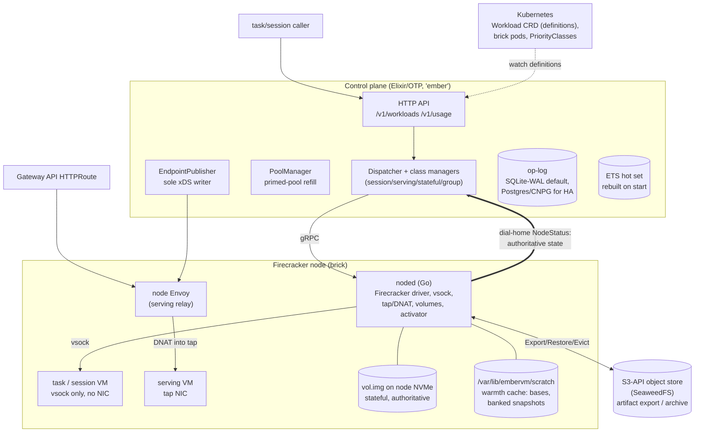
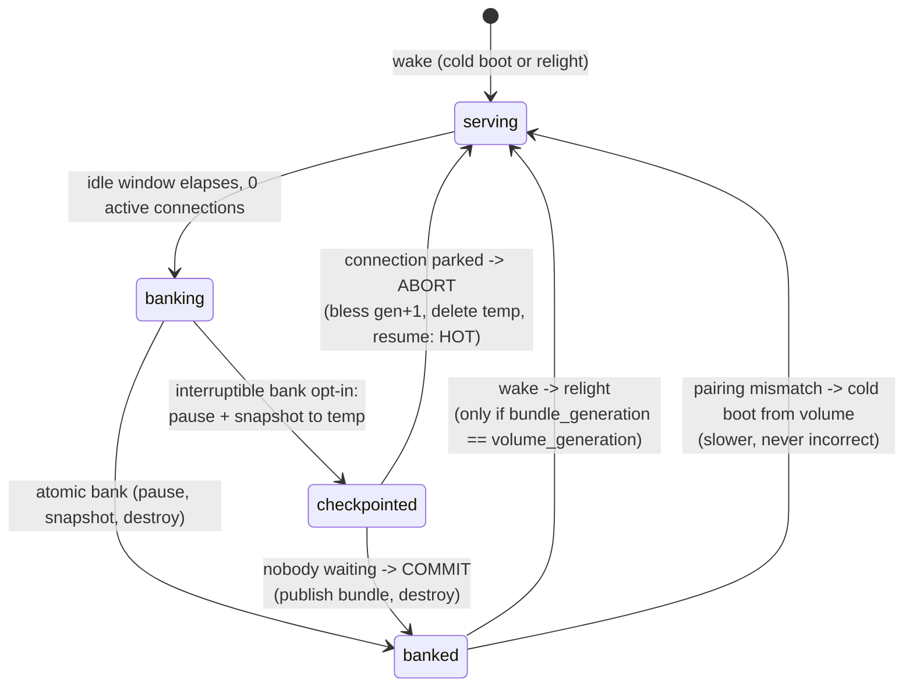

# EmberVM Architecture

A single rolled-up description of how EmberVM operates, written for an
operator or approver (human or agent) who needs to reason about the system
without re-reading 27 ADRs. **This document is the source of truth for
EmberVM's current state.** The ADRs in `docs/decisions/embervm/` record the
rationale behind decisions that are evident in this architecture; they are
history and argument, not the place to learn what is true now. Any PR that
changes a decision (new ADR, amendment, supersession, withdrawal) updates
this document in the same PR; the `adr` skill and the
`check-adr-architecture-sync` hook enforce the habit. If the two ever
disagree, treat it as a bug in whichever failed to keep the contract and
fix both.

Two kinds of statement appear here, and the distinction is the point:

- **Built**: how the system behaves today (Accepted ADRs, shipped code).
- **Decided direction**: agreed in Draft ADRs (019 through 027) but not yet
  implemented, or partially landed. These sections are marked.

Sources: ADRs embervm/001-027, the project README (goals and non-goals),
and the brick-program decision log. EmberVM generalized the fc-invoke /
FaaS line (agents/030, agents/044, agents/045); fc-invoke itself is being
deprecated, and the decisions carried over at the fork (the sandbox
isolation posture, the microVM surface, the registration contract) live on
as the invariants below, so the agents ADRs matter here only as inherited
rationale.

---

## 1. What EmberVM is

Self-hosted Firecracker orchestration: **a private Lambda equivalent on
metal you own**. An organization sizes (or elastically bounds) a Firecracker
nodepool; EmberVM provides placement, fairness, isolation, metering, and
lifecycle so internal workloads get Lambda-shaped submit / scale-to-zero /
warm-serve behaviour without a hosted FaaS product, without a Kubernetes
object per invocation, and without etcd in the execution path.

**Goals**: private Lambda ergonomics (HTTP invoke, zip or image source, caps,
quotas, internal chargeback); honest scheduling on finite capacity; isolation
by default; the control plane off the hit path; one operable component
(Elixir control plane + Go node daemon + `Workload` CRD, managed by
kubectl/Helm/ArgoCD).

**Non-goals**: a hosted multi-tenant cloud; "agent platform as the product"
(agents are dogfood consumers); every workload class as an equal pillar
(task, serving, session are the core; stateful and composite are optional
advanced classes); pretending capacity is infinite (queue depth, saturation
signals, and admission control are the product surface instead).

The displaced incumbent is Argo-Workflows-shaped orchestration, where every
job is an etcd object and every step is a pod. EmberVM keeps workload
*definitions* in Kubernetes (low churn) and execution state in its own
op-log and memory (high churn).

---

## 2. System overview



**Division of labour** (each responsibility placed where it is cheapest to
make correct):

| Component | Owns | Never does |
| --------- | ---- | ---------- |
| Control plane (Elixir) | Coordination facts: queue, placement, fairness, backpressure, lifecycle decisions, xDS publication, op-log appends | Carry steady-state payloads; sit on the serving hit path |
| noded (Go, one per brick) | Payload and OS work: Firecracker process supervision, vsock relay, tap/DNAT, volume attach, snapshot byte movement, node-local wake | Make fleet-wide decisions; join the BEAM cluster (it speaks a narrow gRPC surface instead) |
| Envoy (edge + node tier) | The serving request path, health-based ejection, rate limits | Lifecycle |
| Kubernetes | Low-churn `Workload` definitions, brick pod scheduling, PriorityClasses | Per-invocation objects, execution state |
| Object store (SeaweedFS S3) | Artifact export/archive, off-node durability | Anything on a hot path (read only on deliberate restore or local miss) |

Bricks **dial home**: on start and on a jittered interval each noded POSTs
its identity `{node, pod_uid, address, boot_id}` to `/v1/nodes/register`; the
control plane adopts it keyed by `(node, pod_uid)` and streams `WatchNode`.
The control plane never lists-and-watches daemon pods. Growing the fleet is
labelling a node (`homelab.io/firecracker=true`), not a values edit.

---

## 3. The invariants

These are the load-bearing rules. Every design change is judged against
them; each is stated with its current, post-amendment meaning.

1. **The hit/miss invariant.** The control plane is on the invocation path
   if and only if the invocation requires a lifecycle action (create,
   restore, wake). Steady-state serving requests go Envoy to VM and never
   traverse the control plane. Task execution is the degenerate all-miss
   case (fresh VM per task by policy), so the dispatcher is on that path by
   definition, bounded by fleet restore capacity rather than by BEAM.

2. **Facts through the control plane, payloads never.** Snapshot bytes move
   node-to-store via noded; serving traffic moves through Envoy; the control
   plane carries facts. The two deliberate exceptions are lifecycle-rate:
   the parked first request after a serving miss, and task dispatch/results.

3. **No VM or snapshot lineage ever crosses a principal.** A principal is
   the identity a workload runs as. Task-class VMs are single-use with no
   NIC at all (vsock only); session VMs are also vsock-only, reused only
   within one principal's own lineage; serving VMs are shared only across
   one tenant's own requests; a stateful volume is owned by one workload;
   a composite group is one principal's environment. Content-addressed dedup
   across principals is forbidden (erasure would become a cross-tenant
   reference-counting problem).

4. **Fail closed on enforcement, fail open on warmth, and metering is not
   enforcement.** Containment (concurrency caps, fair queues, admission,
   the node-side pressure predicate, node-confirmed destruction) fails
   closed. Warmth (a missing snapshot, an unreachable store) fails open to
   a cold boot: slower, never incorrect. Metering is counting, not
   enforcement, and **fails open by design** (ADR 020 decision 6): a brick
   out of contact keeps running and keeps counting, and unreconciled spend
   is written off. Cutting off a principal is an admission action (stop
   minting tokens, 402 at the edge), not a metering one.

5. **The node agent is authoritative for instance runtime state** (ADR
   014). What a brick reports over dial-home about its VMs, taps, and
   volumes is the truth; control-plane tables are a reconciled cache. The
   one carve-out is destruction: an instance is recorded destroyed only
   after the owning node confirms teardown, and reconciliation is
   fail-closed toward destruction (an unrecognised node VM is an orphan to
   destroy, unless it carries the `origin: ACTIVATOR` marker, in which case
   it is adopted and backfilled).

6. **Single-writer for stateful is a physical fact, not a protocol.** A
   volume is a raw sparse file on exactly one node's NVMe; noded's
   `volume.Manager` permits exactly one writable attach; failover is a
   deliberate operator action (`:volume_node_gone`, never automatic
   re-placement). The generation number is provenance and coherence
   ("which incarnation does the control plane trust", "does this bundle
   pair with this volume"), never the exclusion mechanism. Under partition
   the two-writer window is bounded by the brick silence timeout (ADR 023).

7. **Durable-before-observed for the journal.** Every lifecycle and
   enforcement action is an ordered op-log append; callers await their
   (group-committed) batch. The op-log doubles as the audit record.

8. **Kubernetes arbitrates pods; EmberVM arbitrates VMs; the pod is the
   ABI.** No scheduler or autoscaler code is imported and no node
   provisioning is rebuilt. EmberVM's only capacity lever toward Kubernetes
   is pod shape (honest Guaranteed requests, labels, PriorityClass), and a
   Pending brick is the scale-up signal (Karpenter on EKS) or the
   fleet-full page (homelab).

9. **Classes are reuse semantics; substrates are lanes.** New execution
   technologies (Hyperlight, wasm) enter as lanes under existing classes,
   never as new classes. Persistence is becoming an orthogonal declared
   property too (ADR 027, in review).

10. **Users express posture, never mechanics.** The user-facing surface is
    a small set of declared scalars in units the user cares about
    (`memMib`, `archiveInterval` as acceptable data loss, session duration,
    retention count), each under a platform ceiling with a non-escalation
    rule. Priority rungs, disruption budgets, grace periods, and CPU are
    platform-derived.

---

## 4. Workload classes

Definitions are Kubernetes `Workload` CRs (schema-validated, GitOps-synced);
`kubectl get workloads` reads back `snapshotRef`, `observedGeneration`, and
readiness. `source` is a oneOf ladder: `image` (bring an OCI image, no SDK;
contract is "listen on the declared port, answer a health path") and `zip`
(runtime base + Lambda-compatible `handler(event, context)` shim; archives
are fetched and unpacked inside the disposable guest).

| Class | Semantics | Network | State | First consumer |
| ----- | --------- | ------- | ----- | -------------- |
| **task** | Fresh VM per invocation from a pristine base, destroyed after one task. Dispatch is assignment-only from a primed pool | vsock only, no NIC | none | scan fleet (semgrep), zip functions |
| **session** | Bank/relight sandbox: idle snapshot to disk, restore on next invoke, principal-bound lineage | vsock only, no NIC | memory snapshot (+ workspace tier) | agent sandboxes |
| **serving** | Long-lived warm HTTP endpoint; Envoy routes hits, CP only on miss/wake | tap NIC | none durable | tenant web APIs, og-image |
| **stateful** | Scale-to-zero singleton datastore; L4 wake-on-connect; volume owns data, snapshot owns warmth | L4 via node Envoy | `vol.img` on node NVMe (authoritative) | scratch-postgres |
| **composite** | Multi-VM group, private per-group /24, all-or-none bundle-set bank/relight; warmth only, no member volumes | per-group bridge | group snapshot set | scratch-k8s (3-node k3s) |

**Decided direction, not yet built:**

- **Isolated high-throughput lane** (ADR 015): serving transport with task
  semantics. Envoy `LEAST_REQUEST` routes directly to per-brick listeners;
  the brick pops a fresh primed VM per request, destroys it after the
  response; empty pool answers 503 and Envoy retries elsewhere. The CP is a
  pure control loop for this lane.
- **Persistence as a declared property** (ADR 027): classes stop
  bundling the persistence decision. A workload declares
  `persistence: {memory: bool, filesystem: {enabled, scope: solo|shared,
  retention: latest+N}}`. This unlocks filesystem-persistence with no
  memory snapshot (application-level resume: goose `--resume`, build
  caches, WAL replay) and principal-scoped shared artifacts keyed
  `shared/<principal>/<sha256>`. Whether task and session remain distinct
  classes afterward is an open question there.
- **Composition** (ADR 022 as corrected by 024/026): multi-component apps
  are independent Workloads in one domain wired by bindings (injected
  logical names such as `DATABASE_URL`), not composite groups. One access
  fabric covers VM to VM, VM to Service, and Service to VM with deny-by
  default bindings. Composite stays for multi-kernel demos.

---

## 5. Lifecycle

Vocabulary used everywhere: a workload instance is **running**, **primed**
(live and pristine, awaiting first assignment), **banked** (suspended with a
warm snapshot, relit on demand), or **cold**. "Cold" and "warm" describe
boot mechanics only; the task-class isolation property is *no reuse*, and a
snapshot restore preserves it.

### Stateful bank/relight (with the interruptible bank, ADR 008)



Facts that make this safe:

- **Bank only starts at zero active connections**; a long-lived connection
  is never severed by an idle bank (rolls are the exception, bounded by the
  two-minute preemption contract, ADR 009).
- **Resume requires an exact (memory snapshot, volume generation) pair**;
  mismatch discards warmth and cold-boots from the durable volume.
- **The interruptible bank** (`spec.stateful.interruptibleBank: true`, off
  by default) makes steady-state wakes always hot or warm, never cold. The
  three cold exceptions: genuine first boot, explicit operator reset, and
  the max-lifetime forced roll.
- **Only a snapshot taken immediately before teardown may be kept.** Any
  snapshot whose VM resumes is discarded (the abort orders bless-generation,
  delete-temp, resume, so a surviving temp is always refused by pairing).

### Generation blessing and quarantine (ADRs 011, 017, 018)

The control plane is the adjudicator of volume generations, with exactly
three legitimate issuance shapes (the canonical exception table lives in ADR
011's 2026-07-23 amendment):

1. **CP-issued pre-dispatch**: blessed durably before a wake/attach
   (op-log-before-dispatch). The default.
2. **Checkpoint-abort auto-heal** (ADR 017): noded's resolve-timeout
   auto-abort self-bumps by exactly +1 on the same `vm_id`. A durable
   `checkpoint_dispatched{workload, vm_id, generation}` record lets a
   restarted CP prove the +1 was its own checkpoint and bless it instead of
   quarantining. Anything unproven stays quarantined; the break-glass
   runbook is `docs/runbooks/embervm-stateful-generation-quarantine.md`.
3. **Delegated advancement** (ADR 018): a durable, bounded
   `wake_grant{workload, volume_node, gen_floor, gen_ceiling, expires_at}`
   authorises the volume's anchor brick to advance the generation while the
   CP is away (Fork A: gap budget, default k=4; time-bounded class for
   sub-second-banking demos). Fork B (steady-state lease, brick-owned
   idle-bank) is the declared north star.

An advancement no grant covers is quarantined on sight. The grant changes
who may *issue* a generation, never who may *write* a volume (invariant 6).

### Wake path and the node-local activator (ADR 018, Fork A partially landed)

A request to a scaled-to-zero workload lands on a fallback endpoint, parks,
and triggers a single-flighted wake; the real endpoint is then published and
bytes splice. Historically both activators (L7 serving, L4 stateful/
composite) lived in the CP pod, so a CP `Recreate` roll black-holed cold
wakes. Fork A moves the activator into noded (stable DNAT from the node IP,
`NodeStatus` advertises the activator endpoint, `EndpointPublisher` renders
it as the fallback), mints instance ids node-side with `origin: ACTIVATOR`,
and the CP adopts and backfills on reconcile. Status: partial land, soak
ongoing.

### Sessions: the durability ladder (ADR 016, amended by ADR 027)

| Tier | Window | Artifact | Pinning |
| ---- | ------ | -------- | ------- |
| Live | 8h continuous ceiling | running VM | node-resident |
| Warm bank | 7 days from last bank | memory snapshot in S3 | CPU-vendor + base-generation |
| Durable workspace | 30 days from last use | zstd content-addressed file set | none |

Resume is one interface with four verbs: cold boot; base-snapshot restore;
warm (memory) restore; base + workspace hydration. The CP picks the cheapest
unexpired artifact. A relight starts a fresh 8h window, so a lineage spans
weeks of shorter runs. "Instant for 8h, restorable for 30 days" is strictly
more than the AWS Lambda MicroVMs offer being copied. ADR 027 amends this
ladder: capture may decouple from bank (close-triggered for
no-memory-snapshot workloads), retention becomes `latest + N`, and the
workspace size cap becomes a declared soft budget.

---

## 6. Control plane internals

- **State model**: hot working set in ETS (rebuilt on start, healed by
  adoption from node reports); durable book-of-record in the op-log behind
  the `Embervm.OpLog` behaviour. SQLite-WAL is the zero-dependency
  single-node default; batched (group-commit) Postgres via CNPG is the
  deployment default for HA. The dispatch path never reads the durable
  store.
- **Retention** (ADR 002): result TTLs enforced at read time; terminal
  tasks pruned past 7 days; the ops journal prefix-compacted past a 30-day
  horizon behind a durable `compacted_through_seq` marker; PVC usage
  alerted at 80%. Long-horizon audit is SigNoz.
- **Adoption**: noded reports `primed_vm_ids`, session VMs, checkpoint
  -pending VMs, and banked artifacts on every `NodeStatus`; the dispatcher
  and managers reconcile on boot and every sweep. This is the standing fix
  for the restart-wedge bug class, and the protocols are the subject of the
  TLA+ pilot (ADR 006: per-protocol PlusCal specs in
  `projects/embervm/specs/`, three conformance layers, deferred until the
  protocol surface is stable).
- **Cells** (ADR 007): the unit of horizontal scale is a cell, a complete
  single-writer control plane owning a bounded set of bricks and workloads,
  with one op-log appender (ordering is within-cell only). The seams exist
  now (`cell_id` in the schema, workload-to-cell assignment as data,
  per-cell dial-home address), with exactly one cell (`cell-0`) today. A
  thin stateless fleet layer (route + capacity roll-up) arrives only with a
  second cell.
- **Registry survives restarts**: noded persists its last-synced registry
  to NVMe marked stale; a restarting noded with an absent CP serves warm
  workloads from cache. No dependency's brief absence may turn a warm node
  into a dead one.

**Decided direction (Draft ADRs 019-021):**

- **Op-log restructuring** (ADR 019): payloads separate from facts
  (`payload_ref` to a side table or object store; request payloads dropped
  at terminal-success, results deleted on fetch + grace), `ops`
  range-partitioned by time (compaction becomes partition drop), and
  `principal` NOT NULL + indexed everywhere so **erasure on demand** is an
  indexed delete plus keyed payload reclaim.
- **Admission-only control plane** (ADR 020): the CP forecasts demand,
  precomputes workload-to-brick assignment at forecast cadence, mints
  encrypted (JWE) session-routing tokens carrying
  `(cell, brick, session, generation, expiry)`, publishes xDS at O(bricks)
  with scalar capacity, and applies fleet backpressure. A tokenless arrival
  costs a lookup plus a signature, never a placement computation.
  Redistribution under pressure is peer-to-peer with power-of-two-choices
  sampling (cell- and vendor-scoped); the shed ladder is destroy
  preemptible VMs, evict exported artifacts, bank durable sessions, refuse.
  Target: >90% active brick utilization (provisional).
- **Resource model** (ADR 021): a workload declares `memMib` only. CPU is
  derived (`memMib / pivot`, pivot provisionally 1,024 MiB per vCPU) and
  delivered as `ceil()` presented vCPUs plus proportional `cpu.weight`;
  capacity becomes a scalar (memory), oversubscription is derived per node
  and published as a sort key. The accounting unit is GB-seconds of
  allocated memory; billing itself is deferred.

---

## 7. Capacity, bricks, and Kubernetes

**A brick is the capacity unit everywhere** (ADR 013 section 7, as
amended): a fixed-size noded Deployment pod in a T-shirt size class (v1:
`small` for dense task packing, `large` for 1-2 serving/session VMs), with
honest Guaranteed requests, sized roughly 4-8x the largest VM of its class,
a handful per node. The daemon is budget-agnostic: it reads its ceiling from
its own cgroup, so a size class is a resources block, not a code fork.
In-place pod resize is retired on every tier.

| Layer | Owner | EmberVM's lever |
| ----- | ----- | --------------- |
| VM to brick slot | EmberVM control plane | per-brick contiguous-headroom ledger; pack-to-empty scoring; class-exact placement (no cross-class borrowing) |
| Brick pod to node | kube-scheduler | pod shape only |
| Node provisioning | Karpenter (EKS) / nobody (homelab) | brick count vector from the single-writer controller; a Pending brick is the signal |

On the homelab's fixed four-node fleet a Pending brick **is** the fleet-full
signal: the controller flags `:fleet_full`, the dispatcher refuses
placement (503), and a human is paged, rather than overcommitting.

Priority projects onto three axes: PriorityClass ranks brick pools by lane
(occupied-capable bricks always run at default non-preempting priority;
sacrificial low-priority balloon bricks are the burst headroom); QoS is
always Guaranteed; per-workload arbitration happens only in CP dispatch.
Disruption splits workloads into preemptible posture (task, isolated lane)
and durable posture (session, stateful: continuity via banked-state
durability, not node pinning). Remaining node lifetime is a placement input;
a terminating node is a placement target for work that fits its horizon.
Karpenter behaviour is drilled against kwok in CI, path-scoped to the
Karpenter-facing modules.

**Homelab cutover status** (brick-program log): noded currently runs as a
DaemonSet bridge over the FC-labelled nodes; the staged cutover to brick
Deployments (PR-1 inert plumbing, PR-2 dispatcher `BrickLedger` selection,
PR-3a controller + `:fleet_full`, PR-3b `bricks.enabled=true` canary, PR-3c
DaemonSet prune, gated on explicit go-ahead) is in flight. Desired counts
come from a per-class `desiredReplicas` values knob reconciled by
`Embervm.BrickController` through `/scale` (ArgoCD ignores `/spec/replicas`
fleet-wide, so git-declared replicas would not sync). Instance identity is
the kubelet pod UID.

---

## 8. Storage, artifacts, durability

**Artifact model** (ADR 003 generalized by ADR 009): one typed verb family,
`ExportArtifact` / `RestoreArtifact` / `EvictArtifact`, over
`ArtifactRef {kind: BASE | SESSION | SERVING | STATEFUL | GROUP_SET |
VOLUME}`. Control-plane-driven, idempotent per key; evict refuses while
referenced. Keys are namespaced by workload (and vendor, below); ADR 027 adds the principal-scoped
`shared/<principal>/<sha256>` keyspace as a deliberate, named exception.

**Vendor pinning**: Firecracker memory snapshots restore only within a CPU
vendor (and a narrow intra-vendor matrix), so all warmth artifacts are keyed
by `(vendor, template)` and never cross the boundary; the daemon refuses a
vendor-mismatched restore loudly. Volume data is fully portable. Legacy
artifacts cut before stamping existed are grandfathered: restorable on their
home node forever, never distributed.

**Stateful durability** (ADR 025, Draft; withdraws ADR 011's Longhorn
move):

- **Local disk is authoritative.** The volume is a raw sparse `vol.img` on
  node NVMe; relight is local, no network, no arbitration.
- **S3 is an archive, not a hot tier**: written as zstd content-addressed
  chunk diffs at bank commit (the bank pauses the VM, so every bank is a
  free consistency point), read only on deliberate restore.
- **`archiveInterval` is the user-facing durability control**, in units of
  acceptable loss: the scalar is a ceiling ("archive at least every N,
  forcing a bank if needed"), the floor is platform-derived rate limiting,
  and `disabled` means node loss is total loss (correct for demos, stated
  in schema docs).
- **Failover is deliberate** (operator action; loss is exactly the
  configured interval). **Node rotation is planned drain**: idle drain (RPO
  0, zero disruption) when a bank window can be found before the horizon,
  live drain otherwise; stateful workloads are excluded from spot capacity;
  the continuity contract is an 8h uptime floor (asserted, not derived).
- Three ADR 011 properties are consciously given up: bounded-seconds
  automatic failover, "a placement move is a copy, never a rebuild" (for
  stateful; it still holds for warmth), and R7's cold-node stateful-wake
  premise. Longhorn stays deployed for other cluster uses.

**Ownership arbitration is class-scoped** (ADR 023, Draft):

| Class | Exclusion | Two-incarnation cost | Mechanism |
| ----- | --------- | -------------------- | --------- |
| stateful | physical (one node, one writable attach) | cannot arise implicitly | none needed; grants are provenance |
| session | none exists | divergence from a common ancestor | durable relinquish record before handoff; divergence bounded, detected by generation comparison on reconnect |
| composite | none (warmth-only) | bundle-set divergence | inherits session rules, governed as one unit |
| serving / task | n/a | nothing durable | n/a |

The divergence bound is the **brick silence timeout**: a brick that has not
heard from the control plane for longer than the timeout (set in ADR 018's
grant-expiry range, ~6h, so a CP roll never trips it) stops serving
everything it holds. Token TTL is a convenience, never the correctness
parameter.

---

## 9. Identity, tenancy, security

**Hierarchy** (ADR 024, Draft):

```text
Account      billing / grouping, NO isolation semantics
 └ Product   grouping, NO isolation semantics
    └ Principal   THE isolation boundary (ADR 001's rule)
       └ Domain   env or grouping within exactly one principal
          └ Workload
```

Only `principal` and `domain` ship now. A domain is contained in exactly one
principal, so a same-domain-by-default binding can never cross the
isolation boundary. Shared platform definitions (sandbox-session, semgrep)
are owned by a reserved `platform` principal with an explicit broad
instantiation grant, the widest and most-reviewed grant in the system. The
op-log's existing `tenant` field is a deployment constant occupying the
Account slot.

**Definitions at scale** (ADR 026, Draft): one product template plus N
enrollment records rather than `products x tenants` stamped definitions;
one CR per product in Git (ArgoCD keeps sync/drift/rollback) expanded into
CP-datastore definitions; registration is an idempotent desired-set
reconcile (`apply(scope, generation, desired_set)`) with class inferred
from source shape. Git owns product shape; the API owns tenant population.
Only state-owning components stamp per tenant.

**Guest identity** (ADR 024): a guest never holds a cluster credential. It
asserts identity via an audience-scoped projected token (audience
`embervm`, useless against the Kubernetes API); the platform holds real
credentials and acts on the guest's behalf through the brokered egress
path.

**Credential handling** (ADR 016 security contract): material may sit where
it can be stolen only if the platform can kill its validity on demand;
otherwise the request moves to the credential. Secrets are classed:
derivable short-lived (class 1, may enter trusted guests, revoked at bank),
fixed-but-rotatable (class 2, brick-lease only, placeholder-swapped),
fixed-manual (class 3, never leaves a central key-sharded swap tier).
Guests hold per-light placeholder nonces; a brick-local proxy on every
guest egress injects real credentials from memory-only leases sealed to the
brick's dial-home identity. RAM scrubbing before snapshot is rejected as a
load-bearing mechanism; revocation at the validator is the control.

**Public surface hardening** (as shipped): the one public route
(`jomcgi.dev/functions/hot-image-demo`) is scoped at the HTTPRoute, the
node Envoy authority match, and the guest shim's reserved `/shim/` prefix,
rate-limited at Envoy and by a daily vCPU-second quota. The `/ember` Bazel
demo (ADR 010) serves each visitor query from a disposable CoW clone of a
warm-Skyframe snapshot: server-controlled argv, zero egress, reaped per
request.

---

## 10. The fleet today

| Node | CPU | Memory | Role |
| ---- | --- | ------ | ---- |
| node-1/2/3 | Intel Alder Lake-S, 12 vCPU each | ~15.3 GiB (~12.3 allocatable) | k3s control-plane/etcd masters; cold/CPU-rich tier (task-class, semgrep, bazel clones) |
| node-4 | AMD Zen4, 16 threads | 62 GiB | warm tier: banked sessions, serving, stateful volumes |

- Co-locating untrusted-code microVMs on the etcd masters is an eyes-open
  risk acceptance (ADR 012): the cluster is GitOps-reconstructible and
  durable state lives in S3, so quorum loss is bounded downtime, not data
  loss. Guests are the first OOM victims. **Do not import this clause into
  a cluster whose etcd is precious.**
- Warmth is effectively single-vendor (AMD) until the CPU-template work
  lands; the Intel pool runs cold-boot work. The vendor gate fails closed
  at the daemon.
- Scratch is a node-provisioning contract: every FC-labelled node
  bind-mounts its real device at `/var/lib/embervm/scratch` (hostPath type
  Directory fails closed if unsatisfied). Karpenter `instanceStorePolicy`
  RAID0 satisfies it on EKS.
- The FC node taint is a recorded option, not applied; co-tenancy runs on
  honest requests plus the disposable priority class.
- The control plane runs one replica with `strategy: Recreate` on the
  RWO SQLite PVC today; CP HA is the ADR 007 Postgres-cells path, and CP
  rolls are the availability events the node-local activator exists to
  survive.

**Known walls and provisional numbers** (each states what would move it):

| Item | Value | Status |
| ---- | ----- | ------ |
| `statefulTcpPortRange` | 10 ports (5400-5409), CRD-validated | hard cap on stateful workload count; remedy constrained to name-based L4 (SNI/PROXY protocol), not per-workload ClusterIP Services (ADR 024/026) |
| CPU pivot | 1,024 MiB per vCPU | provisional, tracks hand-set declarations; replace from measured utilization |
| Active brick utilization target | >90% | chosen by analogy; too high if shed events become common |
| Stateful continuity floor / session ceiling | 8h (same number, opposite meanings) | asserted for symmetry; validate against rotation cadence |
| Brick silence timeout / grant expiry | ~6h range | the divergence bound and availability trade in one number |
| Wake-grant gap budget | k=4 (default cadence class) | tolerates a CP gap with three noded restarts |
| Definitions target | 100k+ | owner-set goal, not measured demand |

---

## 11. Roadmap state

R0 Tasks, R1 Zip lane, R2 Sessions, R3 Serving, R4 Stateful, R5 Composite,
and R6 Continuity are **shipped**. R6 Facade (etcd shim, virtual control
planes, hard tenancy) is demoted to Recorded pending real demand. R7
Distribution is decided (vendor-aware placement over the export/restore
verbs; needs a second warm-capable node to matter). R8 Consumers (agent
threads on sessions, retiring fc-agentd) and R9 Packaging (standalone
open-sourceable artifact) are decided. In-flight engineering: the
DaemonSet-to-brick cutover, node-local activator soak, and the conciseness
program (issue #4009).

The availability contract is spot semantics: a routine roll gives every
workload up to two minutes of drain notice; state durability is the hard
guarantee, connection continuity is not (narrowed for stateful by ADR 025's
planned-drain contract).

---

## 12. ADR map

How to read a decision: start here, then open the ADR for rationale. Status
is the ADR's own header plus its amendment trail. "Draft" ADRs 019-027 are
one design pass answering "what changes to manage 100k+ workload
definitions" (see `docs/decisions/embervm/README.md` for their reading
order); they are decided direction, not yet built.

| ADR | Decides | Status / superseded by |
| --- | ------- | ---------------------- |
| [001](../../docs/decisions/embervm/001-embervm-beam-firecracker-workload-orchestrator.md) | EmberVM itself: BEAM CP + Go noded, hit/miss invariant, classes, isolation, roadmap | Accepted; R7 copy-never-rebuild no longer holds for stateful (025) |
| [002](../../docs/decisions/embervm/002-op-log-retention-and-compaction.md) | Op-log retention: read-time TTLs, sweeps, journal horizon + marker | Accepted; shape being restructured by 019 |
| [003](../../docs/decisions/embervm/003-control-plane-managed-snapshot-distribution.md) | CP-managed snapshot distribution; Build/Restore/Export/Evict verbs | Accepted; verbs generalized by 009, placement resolved by 011 |
| [004](../../docs/decisions/embervm/004-agent-sandbox-interface-compatibility.md) | Back kubernetes-sigs/agent-sandbox as the session interface via a deferred edge adapter | Accepted; adapter still gated on upstream traction |
| [005](../../docs/decisions/embervm/005-embervm-eks-scale-out-metal-pool-bricks.md) | EKS scale-out: metal pool, bricks, EmberPool, dial-home, snapshot keys | Accepted |
| [006](../../docs/decisions/embervm/006-tla-formal-specification-pilot.md) | Scoped TLA+ pilot with three conformance layers | Accepted; deferred until protocols stabilize |
| [007](../../docs/decisions/embervm/007-sharded-control-plane-pg-oplog-cells.md) | Batched Postgres op-log tier; cells; hot-loop corrections | Accepted; metering-write rejection reversed by 020 |
| [008](../../docs/decisions/embervm/008-interruptible-bank-stateful-datastores.md) | Opt-in two-phase interruptible bank (hot-or-warm wakes) | Accepted |
| [009](../../docs/decisions/embervm/009-roadmap-extension-continuity-before-tenancy.md) | Continuity before tenancy: R6-R9 ladder, spot availability contract, S3 seam | Accepted |
| [010](../../docs/decisions/embervm/010-bazel-skyframe-snapshot-query-demo.md) | Bazel warm-Skyframe demo as a stateless query consumer | Accepted |
| [011](../../docs/decisions/embervm/011-distribution-longhorn-fencing-cp-rollouts.md) | Vendor-bound warmth; fencing; CP-sequenced rollouts | Accepted; **stateful Longhorn withdrawn by 025**; sole-issuer rule amended by 017/018 |
| [012](../../docs/decisions/embervm/012-fleet-colocation-cp-dynamic-sizing.md) | Four-node co-located fleet; etcd blast radius accepted; grandfather rule | Accepted; dynamic sizing retired for bricks (013 §7) |
| [013](../../docs/decisions/embervm/013-substrate-lanes-brick-sizing-capacity-tiers.md) | Classes vs substrate lanes; brick sizing; bricks everywhere | Accepted (as amended) |
| [014](../../docs/decisions/embervm/014-worker-authoritative-state-hot-path-consistency.md) | Worker-authoritative state; async writes; node-confirmed destruction | Draft; decision 6 flag replaced by 015; metering clause amended by 020 |
| [015](../../docs/decisions/embervm/015-isolated-high-throughput-lane-data-plane-placement.md) | Isolated high-throughput lane; data-plane placement; quota leases | Draft; fail-closed lease guarantee withdrawn by 020 |
| [016](../../docs/decisions/embervm/016-kubernetes-scheduling-integration-contract.md) | K8s scheduling contract; priority projection; session ladder; credential invariant | Accepted; placement loop superseded by 020; durable posture amended by 025; ladder amended by 027 (PR) |
| [017](../../docs/decisions/embervm/017-checkpoint-abort-quarantine-auto-heal.md) | Bounded auto-heal of the checkpoint-abort quarantine | Accepted |
| [018](../../docs/decisions/embervm/018-node-local-activator-brick-authoritative-lifecycle.md) | Node-local activator (Fork A) and brick-authoritative lifecycle (Fork B north star) | Accepted; Fork A partially landed; posture promoted to default by 020 |
| [019](../../docs/decisions/embervm/019-op-log-data-structure-payload-separation.md) | Payload separation; time partitioning; principal-scoped erasure | Draft |
| [020](../../docs/decisions/embervm/020-admission-control-plane-token-routing-peer-redistribution.md) | Admission-only CP; JWE token routing; peer redistribution; fail-open metering | Draft; decision 3 withdrawn to 023 |
| [021](../../docs/decisions/embervm/021-workload-resource-model-memory-pivot.md) | Memory as the only dial; derived CPU; scalar capacity; GB-seconds | Draft |
| [022](../../docs/decisions/embervm/022-domain-composition-access-fabric.md) | Service composition over bindings; three-leg access fabric | Draft; superseded in part by 024 and 026 |
| [023](../../docs/decisions/embervm/023-class-scoped-ownership-arbitration.md) | Class-scoped ownership; brick silence timeout as the divergence bound | Draft |
| [024](../../docs/decisions/embervm/024-identity-hierarchy-templates-and-registration.md) | Identity hierarchy; platform principal; guest identity assertion | Draft |
| [025](../../docs/decisions/embervm/025-local-disk-authoritative-s3-archive-interval.md) | Local disk authoritative; S3 archive; `archiveInterval`; planned drain | Draft |
| [026](../../docs/decisions/embervm/026-template-composition-gitops-registration.md) | Templates not stamps; GitOps without per-workload CRs; desired-set registration | Draft |
| [027](../../docs/decisions/embervm/027-snapshot-modes-workload-property.md) | Snapshot modes as a declared workload property (persistence flags, shared keyspace) | Draft |

Operational entry points: ArgoCD and SigNoz at `private.jomcgi.dev/app/*`,
`kubectl get workloads` for definition status, `/v1/usage` for metering,
`docs/runbooks/embervm-*.md` for break-glass procedures.
