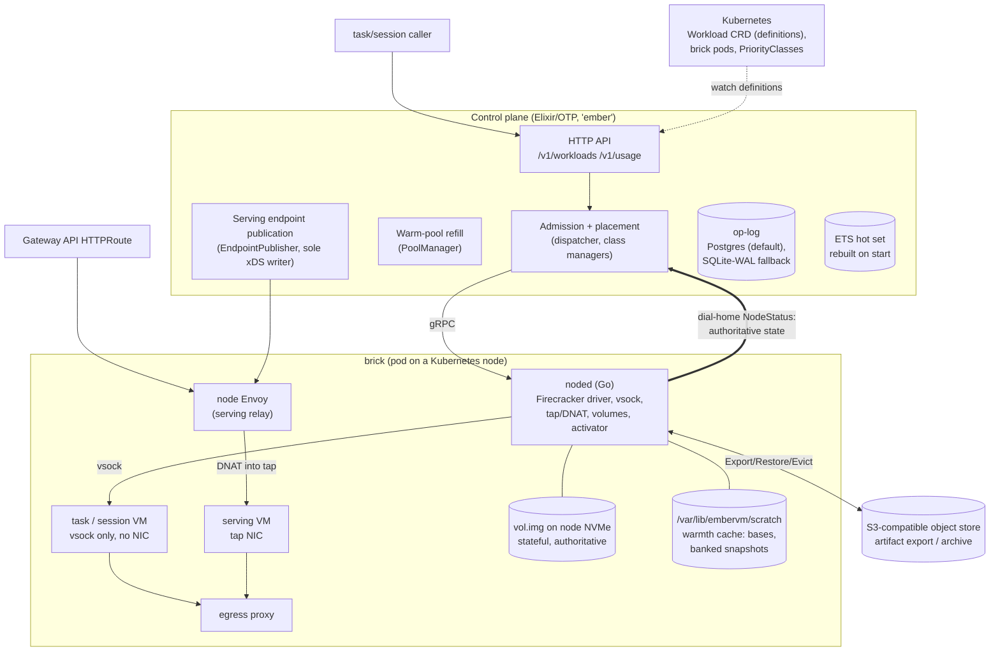
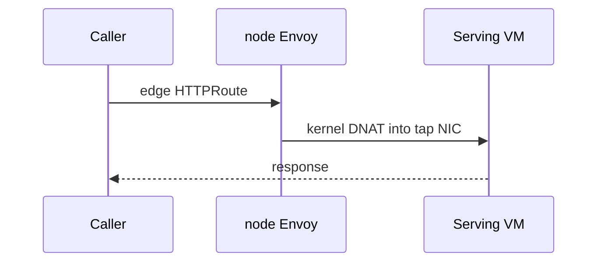
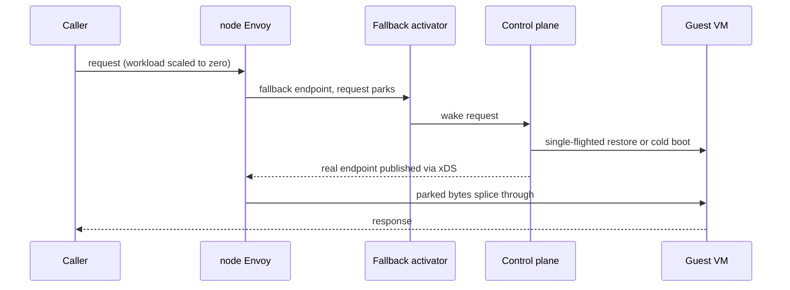
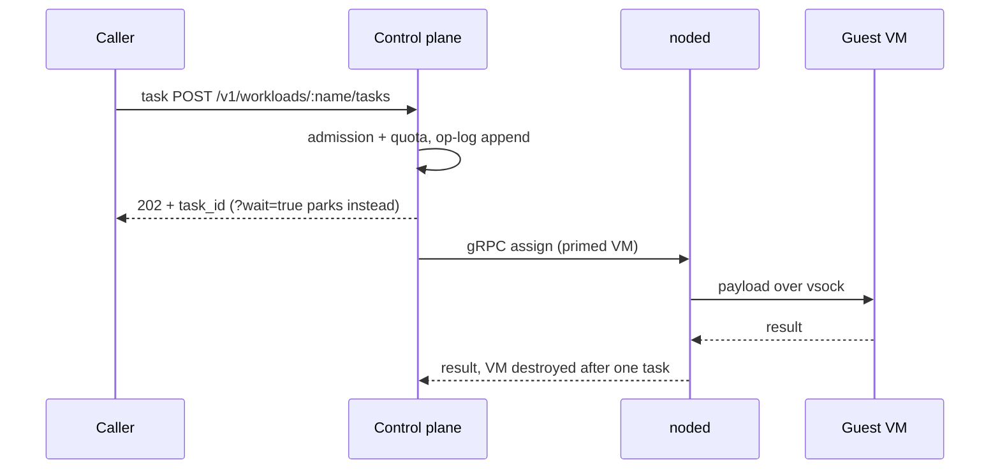
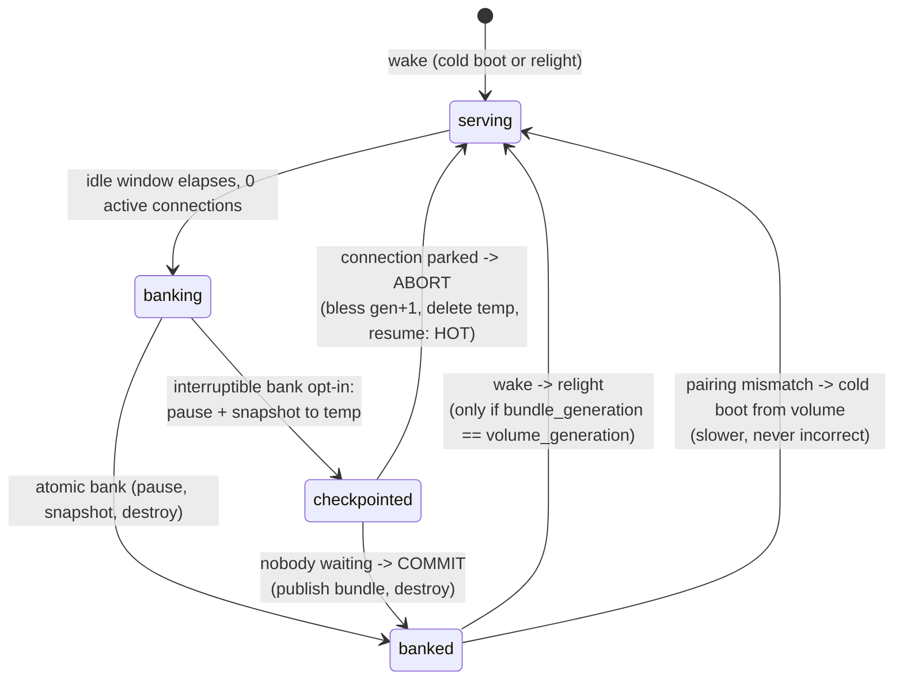
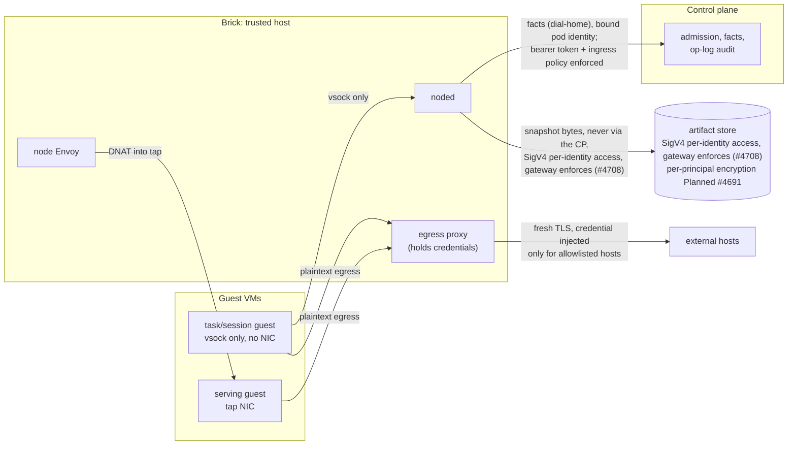

# EmberVM Architecture

How EmberVM works: the current state and the decided future, readable end
to end. Assumes Kubernetes and Linux virtualization; EmberVM terms are in
the section 2 vocabulary. Claims carry four flags:

- **Built**: current behaviour, and the default for any unflagged claim.
  If reality disagrees with this document, one of them is a bug to fix.
- **Planned**: designed, not yet or only partly landed; scheduled work
  carries its tracking issue.
- **Decided direction**: agreed design, not an implementation claim.
- **Accepted risk**: an eyes-open trade, stated where it applies.

**model-checked** means the named TLA+ spec in `projects/embervm/specs/`
satisfies the stated property under TLC in the build; implementation
conformance (trace-to-action validation) is **Planned** (#4699).

---

## 1. What EmberVM is

Self-hosted Firecracker orchestration: **a private Lambda equivalent on
metal you own**. An organization sizes (or elastically bounds) a Firecracker
nodepool; EmberVM provides placement, fairness, isolation, metering, and
lifecycle so internal workloads get Lambda-shaped submit / scale-to-zero /
warm-serve behaviour without a hosted FaaS product, without a Kubernetes
object per invocation, and without etcd in the execution path.

EmberVM deploys on any Kubernetes with KVM-capable nodes, a local scratch
disk per FC-labelled Kubernetes node, and an S3-compatible object store;
section 11
states the platform contract. The reference deployment in this monorepo is
a small on-prem cluster whose concrete shape lives in
[deploy/README.md](deploy/README.md).

**Goals**: private Lambda ergonomics (HTTP invoke, zip or image source,
caps, quotas, internal chargeback); honest scheduling on finite capacity;
isolation by default; the control plane off the hit path; one
Helm-installed system. That system comprises an Elixir control plane,
fixed-size brick pods running noded, node and edge Envoy tiers, and a
`Workload` CRD; the op-log database and the S3-compatible store are
operator-provided.

**Non-goals**: a hosted multi-tenant cloud; "agent platform as the product"
(agents are dogfood consumers); every workload class as an equal pillar
(task, serving, session are the core; stateful and composite are optional
advanced classes); pretending capacity is infinite (queue depth, saturation
signals, and admission control are the product surface instead).

EmberVM keeps workload *definitions* in Kubernetes (low churn) and
execution state in its own op-log and memory (high churn). Per-job
orchestration (an etcd object per job, a pod per step) prices out thousands
of short tasks, and nothing pod-shaped offers millisecond warm restore or
wake-on-connect at all, so the low-latency classes have no incumbent to
compare against.

### Capability matrix

| Capability | Status | Limitation / tracking |
| ---------- | ------ | ---------------------- |
| Task execution | **Built** | Fresh VM per invocation |
| Zip lane | **Built** | Runtime base and handler shim |
| Sessions (bank/relight + workspace) | **Built** | Retention TTLs apply; a workspace size budget is **Decided direction** (#5074) |
| Serving | **Built** | Control-plane lifecycle on misses |
| Stateful | **Built** | Node-local authoritative volume |
| Composite | **Built** | No current consumer |
| Node-local activator | **Planned** | Partly landed |
| Brick autoscale | **Built** at rung `up`; **Planned** scale-down | Full ladder remains |
| S3 archive-at-bank | **Decided direction** | Archive at bank commit |
| Transport auth CP-to-noded | **Built** (bearer + policy) | mTLS/SPIFFE remains the upgrade path |
| Encryption at rest | **Built** | Per-principal mutable artifacts (#4691), enabled per environment by values; Account-scoped immutable rootfs chunks remain planned (ADR 028, #4182) |
| Cells / multi-cell | **Planned** | No cell seams exist in code yet (#4753); one control plane today |
| Standalone packaging | **Decided direction** | Open-sourceable artifact |
| Website snapshotter (task guest) | **Built** | Headless Chromium screenshot over MCP (ADR embervm/035), #4994 |

**Why.** The original single-node RPC path had no durable task record, ownership,
managed retry, cross-node placement, or fairness (ADR embervm/001). Argo
Workflows was rejected because per-job Kubernetes objects move high-churn state
into etcd and add pod startup to every short task; a bare pull queue was rejected
because it discards placement and snapshot locality. A BEAM control plane over a
Firecracker data plane was chosen with an accepted Elixir toolchain cost and a
smaller contributor ecosystem (ADR embervm/001).

---

## 2. System overview

### Vocabulary

<details>
<summary><b>EmberVM terms</b>, used throughout without redefinition</summary>

- **Kubernetes node**: a KVM-capable machine.
- **brick**: a fixed-size capacity pod scheduled onto a Kubernetes node,
  several per node.
- **noded**: the Go daemon on each brick that owns Firecracker and
  node-local I/O.
- **op-log**: the durable ordered journal of lifecycle and enforcement
  actions.
- **bank / relight**: suspend a VM into a warm snapshot, then restore that
  snapshot.
- **primed / banked / cold / running**: ready pristine, snapshotted,
  fresh-boot, or actively executing instance states. Cold and warm describe
  boot mechanics only; task isolation remains no reuse, including after
  snapshot restore.
- **generation**: the volume incarnation number used to prove state
  provenance and pair a stateful volume with a memory snapshot.
- **principal**: the identity boundary a workload runs as.
- **dial-home**: noded registration and status sent to the control plane.
- **warmth**: a reusable boot artifact, such as a base or banked snapshot,
  that can make the next start faster but is never correctness-critical.
- **bundle**: the published set of artifacts needed to relight a workload.
- **blessing**: the durable control-plane act that authorizes a volume
  generation.
- **wake grant**: a bounded authorization for an activator to advance a
  workload wake during control-plane absence.

The diagrams use vsock (Firecracker's host-guest socket), DNAT (destination
network address translation), xDS (the Envoy configuration protocol), BEAM
(the Erlang virtual machine), ETS (Erlang Term Storage), and CNPG
(CloudNativePG).

</details>



Diagram edges: solid = request path; thick = facts; dotted = definitions.
The edge Envoy tier is the Gateway API ingress in front of node Envoy.

**Division of labour** (each responsibility placed where it is cheapest to
make correct):

| Component | Owns | Never does |
| --------- | ---- | ---------- |
| Control plane (Elixir) | Coordination facts: queue, placement, fairness, backpressure, lifecycle decisions, xDS publication, op-log appends | Carry steady-state payloads; sit on the serving hit path |
| noded (Go, one per brick) | Payload and OS work: Firecracker process supervision, vsock relay, tap/DNAT, volume attach, snapshot byte movement, node-local wake | Make fleet-wide decisions; join the BEAM cluster (it speaks a narrow gRPC surface instead) |
| Envoy (edge + node tier) | The serving request path, health-based ejection, rate limits | Lifecycle |
| Kubernetes | Low-churn `Workload` definitions, brick pod scheduling, PriorityClasses | Per-invocation objects, execution state |
| Object store (S3-compatible) | Artifact export/archive, off-node durability | Anything on a hot path (read only on deliberate restore or local miss) |

Bricks **dial home**: on start and on a jittered interval each noded POSTs
its identity `{node, pod_uid, address, boot_id}` to `/v1/nodes/register`;
the control plane adopts it keyed by `(node, pod_uid)` and streams
`WatchNode`. The control plane never lists-and-watches daemon pods. Growing
the fleet is labelling a node (`homelab.io/firecracker=true`), not a values
edit.

**Decided direction** (#4696): enrollment consolidates on a single
chart-configurable key, `embervm.jomcgi.dev/node`, used as both the
enrollment label and the key of the optional hard taint; the separate
serving label is retired, since every enrolled node carries the serving
relay.

### How one invocation works

**A serving hit (the steady state)**, where the control plane is not
involved at all:



**A wake (a serving or stateful miss)** is normally coordinated by the
control plane, which restores the VM and republishes the endpoint through
its EndpointPublisher:



The node-local activator (Planned, partially landed) runs the same wake
node-side during control-plane absence: parked bytes splice via stable
node-local DNAT with no mid-wake xDS republish.

**A task (the all-miss case by policy)**, a fresh VM per invocation, async
by default:



The platform contract is in section 11; the security posture summary is in
section 10.

**Why.** Per-dispatch metering and placement made control-plane work grow with
the number of sandboxes, while session endpoints in xDS would make configuration
grow with session count (ADR embervm/020). Keeping central filter, score, and bind
placement at dispatch rate was rejected as a scheduler throughput ceiling, and a
global session directory was rejected because it adds a lookup to every request.
The control plane now owns fleet facts and precomputed assignment while bricks
own runtime facts, accepting reconcile-time metering gaps and bounded stale-state
risk during partitions (ADR embervm/014, ADR embervm/018, ADR embervm/020).

---

## 3. Workload classes

Definitions are Kubernetes `Workload` CRs (schema-validated, GitOps-synced);
`kubectl get workloads` reads back `snapshotRef`, `observedGeneration`, and
readiness. Task invocation is `POST /v1/workloads/:name/tasks`. Session
invocation is `POST /v1/workloads/:name/sessions`, followed by
`POST /v1/sessions/:id/invoke`. `source` is a oneOf ladder: `image` (bring an OCI image, no SDK;
contract is "listen on the declared port, answer a health path") and `zip`
(runtime base + Lambda-compatible `handler(event, context)` shim; archives
are fetched and unpacked inside the disposable guest).

| Class | Semantics | Network | State | First consumer |
| ----- | --------- | ------- | ----- | -------------- |
| **task** | Fresh VM per invocation from a pristine base, destroyed after one task. Dispatch is assignment-only from a primed pool | vsock only, no NIC | none | scan fleet (semgrep), zip functions |
| **session** | Bank/relight sandbox: idle snapshot to disk, restore on next invoke, principal-bound lineage | vsock only, no NIC | memory snapshot (+ workspace tier) | agent sandboxes |
| **serving** | Long-lived warm HTTP endpoint; Envoy routes hits, CP only on miss/wake | tap NIC | none durable | tenant web APIs, og-image |
| **stateful** | Scale-to-zero singleton datastore; L4 wake-on-connect; volume owns data, snapshot owns warmth | L4 via node Envoy | `vol.img` on node NVMe (authoritative) | demo-postgres |
| **composite** | Multi-VM group, private per-group /24, all-or-none bundle-set bank/relight; warmth only, no member volumes | per-group bridge | group snapshot set | no current consumer |

**Planned**:

- **Isolated high-throughput lane**: Envoy routes straight to
  per-brick listeners, and each brick pops a fresh VM per request.
- **Persistence as a declared property**: workloads declare
  persistence flags; memory and filesystem persistence decouple from class.
- **Composition**: multi-component apps
  become independent Workloads wired by bindings rather than composite
  groups.

**Why.** Classes originally bundled persistence policy, leaving no class for a
filesystem-backed workload without a memory snapshot (ADR embervm/027). A new
class for each persistence shape was rejected because persistence is orthogonal
to class scheduling and network semantics; composite groups were rejected as the
default application graph because joint lifecycle and private networking couple
otherwise independent components (ADR embervm/022, ADR embervm/027). Declared
persistence properties and mediated bindings carry the added schema and migration
cost while composite remains available for multi-kernel groups.

---

## 4. Lifecycle

### Stateful bank/relight and the interruptible bank



Facts that make this safe:

- **Bank only starts at zero active connections**; a long-lived connection
  is never severed by an idle bank (rolls are the exception, bounded by the
  two-minute preemption contract).
- **Resume requires an exact (memory snapshot, volume generation) pair**;
  mismatch discards warmth and cold-boots from the durable volume.
  Model-checked (`bank_relight.tla`), including the monotonic floor: a
  lagging node report can never regress the stored pair key, so a stale
  report cannot legalise a stale snapshot.
- **The interruptible bank** (`spec.stateful.interruptibleBank: true`, off
  by default; armed in the reference deployment for demo-postgres only)
  makes steady-state wakes always hot or warm, never cold. The
  three cold exceptions: genuine first boot, explicit operator reset, and
  the max-lifetime forced roll.
- **Only a snapshot taken immediately before teardown may be kept.** Any
  snapshot whose VM resumes is discarded (the abort orders bless-generation,
  delete-temp, resume, so a surviving temp is always refused by pairing).

### Generation blessing and quarantine

The control plane is the adjudicator of volume generations, with exactly
three legitimate issuance shapes:

1. **CP-issued pre-dispatch**: blessed durably before a wake/attach
   (op-log-before-dispatch). The default.
2. **Checkpoint-abort auto-heal**: noded's resolve-timeout
   auto-abort self-bumps by exactly +1 on the same `vm_id`. A durable
   `checkpoint_dispatched{workload, vm_id, generation}` record lets a
   restarted CP prove the +1 was its own checkpoint and bless it instead of
   quarantining. Anything unproven stays quarantined; the break-glass
   runbook is `docs/runbooks/embervm-stateful-generation-quarantine.md`.
3. **Activator self-advance** (Built, Fork A): during control-plane
   absence the volume's anchor brick (the brick holding its authoritative
   volume) self-bumps the generation on wake. On CP return the fenced-writer
   anchor-adoption rule trusts a self-bump from the current anchor and
   backfills it; anything it cannot prove is quarantined. A first form of
   Fork B is **Built**: every wake grants the anchor a durable bounded
   blessing lease (the `blessing_lease_granted` op: start and lease_end
   generations, reloaded on boot) that pre-authorises the advance.
   **Decided direction** (Fork B remainder): lease expiry, moving toward a
   steady-state lease with brick-owned idle-bank.

The advance changes who may *issue* a generation, never who may *write* a
volume (invariant 6).

### Wake path and the node-local activator

A request to a scaled-to-zero workload lands on a fallback endpoint, parks,
and triggers a single-flighted wake; the real endpoint is then published and
bytes splice. The activator (L7 serving, L4 stateful/composite) belongs in
noded rather than the CP pod so that a CP `Recreate` roll cannot black-hole
cold wakes: stable DNAT inside noded's own netns, `NodeStatus` advertises
the noded pod IP and activator port as the activator endpoint,
`EndpointPublisher` renders it as the fallback, and
instance ids minted node-side carry `origin: ACTIVATOR` for the CP to adopt
and backfill on reconcile. **Planned**: partially landed, soak ongoing.

### Sessions: the durability ladder

| Tier | Window | Artifact | Pinning |
| ---- | ------ | -------- | ------- |
| Live | 6h continuous ceiling (`maxLifetimeSeconds`) | running VM | node-resident |
| Warm bank | 7 days from last bank | memory snapshot in S3 | CPU-vendor + base-generation |
| Durable workspace | 7 days from last use | zstd content-addressed file set | none |

Resume is one interface with four verbs: cold boot; base-snapshot restore;
warm (memory) restore; base + workspace hydration. The CP picks the cheapest
unexpired artifact. Two different windows apply: the same banked session
is resumable for its warm-bank TTL (an hour in the agent lane, a deploy
value, and bounded strictly below the warm-bank GC TTL: the chart render and
the CP's Workload admission both reject a `bankedTtlSeconds` greater than or
equal to `warmthS3Gc.sessionTtlMs`, because a banked snapshot has no expiry
hold in that GC), after which resume takes the session-expiry 410 path; the durable
workspace lineage is adoptable for 7 days, so a new session generation
inherits the prior workspace rather than starting blank. **Decided
direction**: capture decouples from bank
(close-triggered for no-memory-snapshot workloads), retention becomes
`latest + N`, and the workspace size cap becomes a declared soft budget.

Memory-banking session lineages have an available but dormant sequential
Firecracker dirty-page diff path. The first bank is a full; after each allowed
workload relights, snapshot load re-arms dirty tracking and the next bank writes
a diff relative to that full. `snapshot-editor` synchronously rebases the diff
onto a temporary copy of the prior full, and an atomic rename publishes the
merged full before the Bank RPC returns. Only full bundles enter the existing
zstd content-addressed archive, never diff chains. Any diff create, base lookup,
editor, merge, or publication error logs a warning and falls back to a full bank.
`noded.diffBanking` defaults false because this merge-at-bank protocol pays a
full-size copy of the previous base on ext4 scratch, which has no reflink support,
so the Bank RPC gets longer, not shorter. Enable it only after the in-place merge
design or reflink-capable scratch lands, tracked in #4970. Park-only sessions do
not enter this path.

**The 6h ceiling is a version-convergence bound, not a data lifetime.**
It exists so a session cannot ride a stale base image forever, since a
session pinned to an old base keeps that base's registry entry active and
blocks the retention sweep from reclaiming it. It is deliberately not raised
to buy continuity. Continuity comes from **adoption** instead: lineage is
decoupled from session generation, so `session_id == lineage_id` holds only
for the first generation, and a later generation inherits the prior
lineage's workspace rather than starting blank. That is why a lineage spans
weeks of shorter runs even though no single session may.

**Parked sessions count as disk, not against `concurrency.cap`.**
A session with `memory: false, filesystem: true` persistence parks to
its workspace volume holding zero RAM, so counting it as active would let
idle sessions starve the cap while nothing runs. `concurrency.cap` bounds
concurrently running VMs only, and wake does not re-check it: placement's
memory admission and the per-principal wake-rate limit are what protect the
receiving node.

The S3 artifact GC uses an 8-hour TTL for stateful warmth and 7-day TTLs for
session memory, serving snapshots, session workspaces, and group sets.

**Why.** A control-plane restart during an interruptible bank could leave a
benign generation advance indistinguishable from an unauthorized one, forcing
quarantine (ADR embervm/017). A live-volume timer snapshot was rejected because
blocks can be captured inconsistently, and keeping wake only in the control-plane
pod was rejected because a control-plane roll could black-hole cold wakes (ADR
embervm/018, ADR embervm/025). Durable checkpoint provenance and a node-local
activator preserve the fail-closed generation rule, accepting a narrow quarantine
window when provenance was never recorded and best-effort metering during a
control-plane gap.

---

## 5. The invariants

These are the rules everything else rests on. Every design change is judged
against them.

1. **The hit/miss invariant.** A task requires synchronous control-plane
   admission and assignment. A serving or stateful miss normally requires
   the control plane; the node-local activator (Planned, partially landed)
   additionally runs a bounded node-side wake during control-plane absence.
   Steady-state hits never touch the control plane.

2. **Facts through the control plane, payloads never.** Snapshot bytes move
   node-to-store via noded; serving traffic moves through Envoy; the control
   plane carries facts. The two deliberate exceptions are lifecycle-rate:
   the parked first request after a serving miss, and task dispatch/results.

3. **No mutable VM or snapshot lineage ever crosses a principal.** Memory
   snapshots, workspaces, volumes, and other mutable artifacts never deduplicate
   across principals (erasure would become a cross-tenant reference-counting
   problem). ADR 028 defines the narrow exception for immutable,
   reconstructable rootfs chunks: private chunks may deduplicate within one
   Account, explicitly published platform chunks may deduplicate globally, and
   principal-scoped mount authorization remains mandatory. The workload-class
   table in section 3 carries the per-class network and state boundaries.

4. **Fail closed on enforcement, fail open on warmth, and metering is not
   enforcement.** Containment (concurrency caps, fair queues, admission, the
   node-side pressure predicate, node-confirmed destruction) fails closed.
   Warmth (a missing snapshot, an unreachable store) fails open to a cold
   boot: slower, never incorrect. Metering is counting, not enforcement, and
   **fails open by design**: a brick out of contact
   keeps running and keeps counting, and unreconciled spend is written off.
   Cutting off a principal is an admission action (stop minting tokens, 402
   at the edge), not a metering one. The quota gate is model-checked
   (`quota.tla`): budgets are opt-in, and for a principal with a budget
   both the submit gate and the dispatch gate fail closed when the usage
   cache is unreadable.

5. **The node agent is authoritative for instance runtime state.**
   What a brick reports over
   dial-home about its VMs, taps, and volumes is the truth; control-plane
   tables are a reconciled cache. The registration route binds that authority
   to the pod UID and node name claims in the brick's bound ServiceAccount
   token, so a brick can establish only its own stream. The one carve-out is
   destruction: an instance is recorded destroyed only after the owning node
   confirms teardown (gate `nodeConfirmedDestroy`: false in production
   today, true in dev, #4758), and reconciliation is fail-closed toward destruction (an
   unrecognised node VM is an orphan to destroy, unless it carries the
   `origin: ACTIVATOR` marker, in which case it is adopted and backfilled).
   Model-checked (`adoption.tla`) against control-plane and node crashes
   between any two steps: the dispatch restart wedge, forget-before-kill
   resurrection, and reap-would-wipe-fleet bug classes are excluded by
   invariant.

6. **Single-writer for stateful is a physical fact, not a protocol.** The
   storage section explains the raw sparse file, one-writable-attach rule,
   and generation-as-provenance detail; failover remains a deliberate
   operator action and the partition window is bounded by the brick silence
   timeout.

7. **Durable-before-observed for the journal.** Every lifecycle and
   enforcement action is an ordered op-log append; callers await their
   (group-committed) batch. The op-log doubles as the audit record.

8. **Kubernetes arbitrates pods; EmberVM arbitrates VMs; the pod is the
   ABI.** No scheduler or autoscaler code is imported and no node
   provisioning is rebuilt. The capacity section's three-layer table shows
   the levers, and a Pending brick is the scale-up signal or the fleet-full
   page.

9. **Classes are reuse semantics; substrates are lanes.** New execution
   technologies (Hyperlight, wasm) enter as lanes under existing classes,
   never as new classes.

10. **Users express posture, never mechanics.** The surface is a small set
    of declared scalars in user-facing units, each under a platform ceiling
    with a non-escalation rule. Priority rungs, disruption budgets, grace
    periods, and CPU are platform-derived; users do not select those
    mechanics. The scalar details are carried by the storage and
    control-plane sections.

**Why.** Worker runtime state changed faster than synchronous durable writes
could support, while stale reports could otherwise resurrect destroyed VMs or
regress a generation (ADR embervm/014). Writing every transition before the
worker acts was rejected because it keeps Postgres on boot and wake paths;
vocabulary-only conformance was also insufficient because a modeled action can
exist in an enum and never be emitted (ADR embervm/034). Worker-authoritative
runtime state, forward-only reconciliation, and model-checked invariants accept
late durable records while keeping enforcement fail-closed and warmth
discardable (ADR embervm/006, ADR embervm/014).

---

## 6. Control plane internals

- **State model**: hot working set in ETS (rebuilt on start, healed by
  adoption from node reports); durable book-of-record in the op-log behind
  the `Embervm.OpLog` behaviour. Postgres is the default backend (CNPG in
  the reference deployment); SQLite-WAL is the zero-dependency single-node
  fallback, and
  `Embervm.Application.op_log_mod/0` selects between them purely on
  `EMBERVM_OPLOG_DSN` being set, so the pod spec names the current backend.
  Either adapter creates its own schema on boot, so there is nothing to
  migrate. The dispatch path never reads the durable store.
- **Retention**: result TTLs enforced at read time; terminal tasks
  pruned past 7 days; the ops journal prefix-compacted past a 30-day horizon
  behind a durable `compacted_through_seq` marker; a PVC usage alert at
  80% never shipped and would be moot in the reference deployment, whose
  Postgres op-log renders no embervm PVC.
  Long-horizon audit lives in the observability stack.
- **Adoption**: noded reports `primed_vm_ids`, session VMs,
  checkpoint-pending VMs, and banked artifacts on every `NodeStatus`; the
  dispatcher and managers reconcile on boot and every sweep. This is the
  standing fix for the restart-wedge bug class, and the protocols are
  model-checked: three PlusCal specs in `projects/embervm/specs/`
  (`adoption`, `bank_relight`, `quota`) run under TLC in the build, so a
  spec violation is a red build rather than a report, and the vocabulary
  guard (`vocabulary.exs`) keeps the specs honest against the code, though
  only against the spec text: it cannot see whether a modeled op kind is
  ever appended (#4756) or whether the gate it needs is armed in the
  deployed config (#4758), and it passed on both.
  **Planned**: trace validation, op-log events checked against TLA+
  actions. The debug-gated SpecTrace implementation (#4770) ships and runs
  in dev with `specTrace.enabled`; production keeps it off. ADR embervm/034
  records the full delivery path and is still a draft.
- **Cells**: the unit of horizontal scale is a cell, a complete
  single-writer control plane owning a bounded set of bricks and workloads,
  with one op-log appender (ordering is within-cell only). **Planned**
  (#4753): no `cell_id`, workload-to-cell assignment, or per-cell
  dial-home address exists in code yet; there is exactly one control
  plane today. A
  thin stateless fleet layer (route + capacity roll-up) arrives only with a
  second cell.
- **Registry survives restarts**: noded persists its last-synced registry to
  NVMe marked stale; a restarting noded with an absent CP serves warm
  workloads from cache. No dependency's brief absence may turn a warm node
  into a dead one.
- **Bounded node dials**: every node dial carries a 3 s TCP connect timeout,
  and channel dials run in callers so they never block the `NodeChannel`
  process (#5124).

**Decided direction:**

- **Op-log restructuring**: payloads separate from facts and `ops` are
  time-partitioned, making principal-scoped erasure an indexed delete.
- **Admission-only control plane**: the CP admits and mints encrypted
  session-routing tokens; peers redistribute under pressure and metering
  fails open.
- **Resource model**: `memMib` is the only declared dial, CPU is derived
  from it, and GB-seconds is the accounting unit.

**Why.** The original journal retained request payloads without a bound, and a
full durable volume would stop submissions because lifecycle writes fail closed
(ADR embervm/002). A larger unbounded volume was rejected because it delays the
same outage; central placement and metering on every dispatch were rejected as
control-plane throughput ceilings (ADR embervm/002, ADR embervm/020). Projections,
prefix compaction, group commit, and forecast-time assignment keep durable work
off dispatch. Separating payloads from journal facts adds a second write and an
orphan-reclamation path, an accepted consequence of shorter payload retention
and principal-scoped erasure (ADR embervm/019).

---

## 7. Capacity, bricks, and Kubernetes

**A brick is the capacity unit everywhere**: a fixed-size noded
Deployment pod in a T-shirt size class (`2gi` through `16gi`; small classes
pack tasks densely, the largest hold 1-2 serving/session VMs), with honest
Guaranteed requests, sized roughly 4-8x the largest VM of its class, a
handful per node. The daemon is budget-agnostic: it reads its ceiling from
its own cgroup, so a size class is a resources block, not a code fork, and
a brick's size is fixed for its lifetime.

| Layer | Owner | EmberVM's lever |
| ----- | ----- | --------------- |
| VM to brick slot | EmberVM control plane | per-brick contiguous-headroom ledger; pack-to-empty scoring; class-exact placement (no cross-class borrowing) |
| Brick pod to node | kube-scheduler | pod shape only |
| Node provisioning | Karpenter or equivalent (cloud) / none (fixed fleet) | brick count vector from the single-writer controller; a Pending brick is the signal |

On a fixed fleet a Pending brick **is** the fleet-full signal: the
controller flags `:fleet_full`, the dispatcher refuses placement (503), and
a human is paged, rather than overcommitting.

**Built**: every brick and the serving relay run the cluster's disposable
priority class, so guests are the first to yield under node memory
pressure; QoS is Burstable (memory request==limit, CPU request-only);
per-workload arbitration happens only
in CP dispatch.

**Decided direction**: PriorityClass ranking of brick
pools by lane with sacrificial balloon bricks for burst headroom, and
remaining-node-lifetime as a placement input so a terminating node takes
only work that fits its horizon. Disruption splits workloads into
preemptible posture (task, isolated lane) and durable posture (session,
stateful: continuity via banked-state durability, not node pinning).

**Brick discovery and scale**: bricks are the only source of node capacity,
so the control plane picks the brick mix from placement demand rather than
running one fixed daemon per node; discovery is dial-home, never a Service
or a per-node DaemonSet. Desired per-class counts are a values knob
reconciled by `Embervm.BrickController` through `/scale`, because ArgoCD
ignores `/spec/replicas` fleet-wide and git-declared replicas would not
sync; instance identity is the kubelet pod UID. Brick autoscale runs at
rung `up` on the `observe -> up -> full` ladder: denial-driven scale-up
acts, clamped to the chart's maxReplicas. **Planned**: promoting to `full`
adds drain-aware scale-down. The current brick mix is deployment state and
lives in the fleet section.

**Why.** Per-invocation pods and Kubernetes objects made pod churn and etcd the
ceiling for short work, yet bypassing Kubernetes meant its autoscaler could no
longer observe Firecracker demand (ADR embervm/001, ADR embervm/005). A pod per
VM was rejected for restoring that churn, while whole-node daemons were rejected
because they make capacity changes too coarse for mixed workload lanes (ADR
embervm/013, ADR embervm/016). Fixed-size bricks expose schedulable capacity to
Kubernetes and keep VM placement inside EmberVM, accepting bin-fragmentation and
drain coordination as explicit costs.

---

## 8. Storage, artifacts, durability

**Artifact model**: one typed verb family,
`ExportArtifact` / `RestoreArtifact` / `EvictArtifact`, over `ArtifactRef
{kind: BASE | SESSION | SERVING | STATEFUL | GROUP_SET | VOLUME}`.
Control-plane-driven, idempotent per key; evict refuses while referenced, and
base retention holds when the current base is unverified (#4401). Keys are
namespaced by workload (and vendor, below); a principal-scoped
`shared/<principal>/<sha256>` keyspace is **Planned** (#5075), not
implemented: `ArtifactRef` is `{kind, workload, ref}` with keys
`<kind>/<vendor>/<workload>/<ref>/<file>`.

**Planned rootfs plane (ADR 028, #4182)**: OCI images convert to deterministic
flattened EROFS manifests and immutable chunks. Private chunks deduplicate under
`rootfs/account/<account>/...`; allow-listed published platform chunks may use
`rootfs/platform/...`. A brick fully hydrates and verifies every chunk of an
active manifest before reporting the rootfs READY, then presents a local-only
read-only ublk device. The object store is a preparation dependency, never a
live guest block-read dependency.

| Failure | task | session | serving | stateful |
| ------- | ---- | ------- | ------- | -------- |
| VM process | Fresh VM is discarded; **Built** cold boot fallback | Lineage restores from warmth; **Built** | Endpoint wakes a replacement; **Built** | Volume remains authoritative; **Built** |
| brick | Assignment and primed pool reconcile; **Built** | Banked state can relight; **Built** | Cold wake fallback; **Built** | Volume is node-resident; failover is the **Built** manual handover RPC (`POST /v1/stateful/:name/handover/:target`, a banked-volume move to a peer anchor) |
| Kubernetes node | Recreate on another brick; **Built** | S3 warmth is available on deliberate restore; **Built** | Cold wake fallback; **Built** | S3 export at bank commit is **Decided direction**; failover is the **Built** handover RPC (brick row) |
| control plane | No new task admission; **Built** | Existing local state continues; **Built** | Hits continue; misses wait, node-local activator **Planned** | Existing local state continues; **Built** |
| object store | Local execution continues; **Built** | Local warmth continues, restore falls back cold; **Built** | Local warmth continues, restore falls back cold; **Built** | Local volume remains authoritative; archive is **Decided direction** |

State durability within the stated archive interval is the guarantee. The
matrix defines the current recovery and the gaps in automated recovery.

**Vendor pinning**: Firecracker memory snapshots restore only within a CPU
vendor (and a narrow intra-vendor matrix), so all warmth artifacts are keyed
by `(vendor, template)` and never cross the boundary; the daemon refuses a
vendor-mismatched restore loudly. Volume data is fully portable. Legacy
artifacts cut before stamping existed are grandfathered: restorable on their
home node forever, never distributed.

**Principal artifact envelope encryption** is **Built, inert until enabled per
environment** (#4691). Each principal artifact file is zstd-encoded,
then streamed through chunk-framed AES-256-GCM with a per-file nonce; `meta.json`
holds the opaque control-plane envelope while SHA-256 remains over plaintext.
Restore accepts legacy plaintext unconditionally. Enveloped restores require a
request-field capability carrying the data key and an HMAC-authenticated tuple
scoped to the principal, lineage, brick, workload, ref, kind, and generation.
The control plane exposes a node-authenticated wrap endpoint and unwraps the
stored envelope only while minting a five-minute capability for the exact target
brick. The first principal use establishes epoch 1, and any malformed or
below-floor envelope suppresses the restore so the existing cold-boot fallback
runs. The rollout order is deliberate: configure `kekRoot`, enable
`EMBERVM_ARTIFACT_ENCRYPTION`, enable `store.encrypt`, then enable
`requireRestoreCapability`. Each step is controlled by environment values and
all flags remain false by default. Root, epoch, customer-key, and custody
transitions use a bounded control-plane sweep that lists only mutable artifact
markers and rewrites the envelope without reading payload objects. Every
`meta.json` replacement carries the exact S3 ETag from its preceding GET as an
`If-Match` guard, so a concurrent newer export wins instead of having its
generation and file manifest overwritten. Only an uncapped sweep with no
conflicts, refusals, invalid markers, or store errors reports complete; raising
an epoch floor or retiring a previous root or source-custody grant remains a
separate operator action. Successful access provides a second convergence path:
an enveloped inline restore, an already-local authenticated restore, or a
checksum-skipped export schedules the same envelope-only operation in noded.
That lazy request is detached from access latency, bounded to 15 seconds, and
uses noded's signed S3 client with the same exact-ETag compare-and-swap. It
preserves unknown marker fields and never reads an artifact payload object.

**Decided direction:**

- **Local disk is authoritative**: local node NVMe relight needs no network.
- **S3 is a zstd content-addressed archive**, written at bank commit, not a
  hot tier.
- **`archiveInterval`** is the user-facing durability control in
  acceptable-loss units.
- **Failover and node rotation** are deliberate operator actions; the
  banked-volume handover RPC that implements them is **Built**
  (`POST /v1/stateful/:name/handover/:target`).

**Ownership arbitration is class-scoped** (**Decided direction**):

| Class | Exclusion | Two-incarnation cost | Mechanism |
| ----- | --------- | -------------------- | --------- |
| stateful | physical (one node, one writable attach) | cannot arise implicitly | none needed; grants are provenance |
| session | none exists | divergence from a common ancestor | durable relinquish record before handoff; divergence bounded, detected by generation comparison on reconnect |
| composite | none (warmth-only) | bundle-set divergence | inherits session rules, governed as one unit |
| serving / task | n/a | nothing durable | n/a |

The divergence bound is the **brick silence timeout**: a brick that has not
heard from the control plane for longer than the timeout (~6h, in the
grant-expiry range, so a CP roll never trips it) stops serving
everything it holds. Token TTL is a convenience, never the correctness
parameter. **Built** (ADR 037, #5073): noded tracks last control-plane
contact from its dial-home Register responses and WatchNode stream activity
and refuses new node-local work (activator wakes, group wakes,
blessing-lease self-advance) once silence exceeds the bound; live VMs keep
running and warmth stays intact, and blessing-lease exhaustion remains the
generation-count complement for quiet lineages.

**Why.** ADR embervm/011 chose replicated block storage to avoid whole-volume
exports, then ADR embervm/025 superseded it for stateful storage because the CSI
path added another placement owner and imposed the same replication cost on
every workload; the reasoning against whole-file write amplification still
holds. Timer-driven copies of live volumes were rejected as crash-inconsistent,
and network demand-loading of root filesystems was rejected because an object
store outage could stall a running guest (ADR embervm/025, ADR embervm/028).
Authoritative local volumes, bank-time archives, and eager local chunk hydration
accept an archive-interval loss window and slower restore after node loss. Mutable
warmth is encrypted per principal because storage ACLs alone expose process
memory to a compromised storage reader, accepting that loss of the platform root
forces cold boot (ADR embervm/033, ADR embervm/036).

---

## 9. Identity, tenancy, security

Only `principal` ships now: it is the TokenReview-authenticated caller
identity, and the op-log's existing `tenant` field is a deployment constant
occupying the Account slot. **Planned** (#5072): `domain` (env or grouping
within exactly one principal, so a same-domain-by-default binding can never
cross the isolation boundary), and shared platform definitions (such as the
sandbox-session and scan-fleet templates) owned by a reserved `platform`
principal with an explicit broad instantiation grant, the widest and
most-reviewed grant in the system. Neither exists in code today.

`Embervm.KeyService` is the platform key custodian from ADR embervm/036. It
derives per-principal, per-epoch KEKs on demand from one current root and stores
only the current epoch and minimum accepted epoch, whose floor is the revocation
fact. Root generation 1 remains the implicit version 1 envelope; later roots use
an explicit version 3 generation, and exactly one previous root can coexist
during rewrap. Mutable principal artifacts are encrypted in dev and production,
and an enveloped restore requires a five-minute tuple-scoped brick capability.
Customer-managed principals instead use a Secret-configured HTTPS KMS oracle:
the customer service retains the KEK and returns only a plaintext data key plus
an opaque wrapped key. Disabling the customer key or grant refuses unwrap and
the normal restore-on-miss path degrades to cold boot. A custody switch declares
the target `mode` plus the opposite `transition_from`; only that bounded window
accepts old-custody envelopes, and rewrap changes the envelope without touching
artifact ciphertext. The background reconciler persists that replacement with
an ETag compare-and-swap, isolates customer KMS calls with bounded concurrency,
and refuses to claim transition completion after any capped, conflicted, or
failed pass. Noded also attempts the same CAS asynchronously after successful
artifact access, so hot artifacts converge promptly while the background pass
continues to cover cold artifacts. No customer oracle is configured in the
reference deployment, so the mode is available but inert.

**Decided direction:**

**Hierarchy**:

```text
Account      billing / grouping, NO isolation semantics
 └ Product   grouping, NO isolation semantics
    └ Principal   THE isolation boundary
       └ Domain   env or grouping within exactly one principal
          └ Workload
```

**Definitions at scale**: one product template plus N enrollment
records, one Git CR per product expanded into CP definitions, and idempotent
registration as a desired-set reconcile.

**Credential handling** (class taxonomy **Decided direction**; the
brick-local proxy's `egressTo`-gated header injection, sidecar-only key
material, and the TLS-MITM CA lane are **Built** in the reference
deployment): material may sit where
it can be stolen only if the platform can kill its validity on demand;
otherwise the request moves to the credential. Secrets are classed:
derivable short-lived (class 1, may enter PLATFORM-TRUSTED guest classes only,
revoked at bank), fixed-but-rotatable (class 2, brick-lease only, injected at
the egress hop),
fixed-manual (class 3, never leaves a central key-sharded swap tier). A
UNTRUSTED workload guest never receives any credential class. The brick-local
proxy on every guest
egress reads the plaintext request, sets the configured header to the real
value (mounted only in the sidecar), and originates a fresh verified TLS
connection onward. Injection fires only when the destination is in that
secret's `egressTo`, so the credential is unreachable at every other host
(`projects/firecracker/substrate/egress-proxy/cmd/swap.go`). Header
injection is used rather than placeholder substitution because a
guest-controlled placeholder can be spliced into a URL and reflect the
credential into a request line. RAM scrubbing before snapshot is rejected
as a mechanism to rely on; revocation at the validator is the control.

**Public surface hardening** (**Built**): the public routes are scoped at their
HTTPRoutes, with serving routes additionally constrained by node Envoy authority
matches and the guest shim's reserved `/shim/` prefix. The pattern's proof
is a public Bazel-query demo that serves each visitor query from a
disposable CoW clone of a warm-Skyframe snapshot: server-controlled argv,
zero egress, reaped per request.

**Guest identity**: a guest never holds a cluster credential (**Built**, by
construction: no NIC, no mounted ServiceAccount); the
platform holds real credentials and acts on the guest's behalf through
the brokered egress path. **Decided direction**: an audience-scoped
projected guest token (audience `embervm`), **Planned**.

**Decided direction:** GitHub leaves the agent egress
catalog. Host-keyed injection bounds which host a credential reaches, never
which request reaches it, so a prompt-injected guest can shape any GitHub API
call and have the token attached to it. Agent principals instead reach GitHub
through MCP tools whose URLs name the target repo, entitled per
identity-provider group and backed by a per-group fine-grained PAT, so what a
guest can reach is a fixed tool set rather than an API surface. The egress
broker keeps the credentials that genuinely need host-keyed injection, the
model providers among them.

**Why.** The original Kubernetes identity string conflated the credential holder,
the isolation principal, and permission to use management actions, leaving object
ownership checks unsafe for additional users (ADR embervm/032). TokenReview-only
identity was rejected because it has no browser or device flow, while per-request
identity-provider introspection was rejected because it adds a network dependency
to every request. Provider-neutral actors, explicit principals, local token
verification, and object-level authorization accept expiry-bounded revocation and
loss of new login during an identity-provider outage (ADR embervm/024, ADR
embervm/032).

---

## 10. Threat model

- **Built**: Firecracker boundary; no NIC for task/session guests;
  principal-bound lineage; no cluster credential in guests; Envoy-only
  serving ingress; bound dial-home registration identity.
- **Accepted risk**: privileged noded with /dev/kvm; external-allow guest
  egress via the broker; taint optional.
- **Planned**: mTLS/SPIFFE as the noded transport-auth upgrade; per-principal
  envelope encryption and tuple-authorized restore (#4691); granular
  containment.

EmberVM evaluates itself against the threat model published by
[agent-substrate/substrate](https://github.com/agent-substrate/substrate/blob/main/docs/threat-model.md),
adopted as the external conformance frame (ADR embervm/033). Substrate
attacks the same problem from the density side (many actors multiplexed
onto shared warm worker pods); its threat enumeration is the most complete
public statement of what a multi-tenant agent execution plane must defend.

The enumeration is condensed in the tables below. Shared-worker threats
with no Ember analogue are answered by the "no reuse across principals"
row. Five threats remain unmapped and do bind on Ember, tracked as open
mapping work, not implied conformance: 8 (template-author reach into
storage), 21 (worker privilege: noded runs privileged with /dev/kvm), 26
(policy propagated out of band with scheduling), 31 (image-extraction
resource limits), and 42 (detection integrations).

<details>
<summary><b>Substrate mapping</b>: vocabulary and threat numbering</summary>

Their *actor* is Ember's guest workload, their *worker pod* is a
Firecracker slot on a brick, their *atelet* is noded, their *snapshot* is
Ember's warmth artifact (memory snapshot, session bundle, volume archive).
The threat numbering is ours: upstream rows are unnumbered, so threats are
numbered 1 to 43 in upstream document order as of its 2026-06-25 revision.

</details>

The boundary in one picture: what untrusted code can reach, and what
never crosses toward it.



Trust diagram legend: every edge is a current path; the remaining labelled
exposure is per-principal encryption at rest (#4691).

### Attacks from guests

| Requirement (external mapping #) | Ember state |
| ---------------------------- | ----------- |
| Hardened sandbox, never bare containers (15) | **Built.** Every guest is a Firecracker microVM; there is no container lane. New execution technologies enter as lanes under existing classes (invariant 9), so the sandbox floor is a platform decision, never a workload one. |
| Default-deny actor networking (17) | **Built** for the cross-actor half: task and session guests have no NIC at all, vsock only, so no actor-to-actor network path exists. Serving guests get a tap device reachable solely via node Envoy authority matches and kernel DNAT (section 2). Egress is the deliberate exception: the brokered proxy lane defaults internal-deny but external-allow (`EGRESS_EXTERNAL: allow`), so guests read the public internet by design, and the credential boundary rather than reachability is the control there (section 9). |
| No guest access to node services, metadata, or cluster DNS (16, 19, 34) | **Built**, with named exceptions: a vsock guest reaches the shim contract plus the deployment-declared internal egress allowlist (two entries in the reference deployment; the values file records that adding an entry is a security decision). No host network namespace, no metadata service, no cluster DNS inside the guest. |
| No Kubernetes or management-API escalation from guests (20, 22) | **Built**: a guest holds no cluster credential by construction (no NIC, no mounted ServiceAccount). The audience-scoped projected guest token is **Planned**. Definitions are CP-owned and there is no self-modification verb. |
| Worker state fully reset between actors (18, 27, 30) | **Built**: Ember never reuses an execution environment across principals: a task gets a fresh VM, a session restores only its own lineage, and no mutable VM or snapshot lineage ever crosses a principal (invariant 3). There is no scrubbed-shared-worker path to get wrong, placement is CP-owned, never guest-chosen, and each VM sees an immutable rootfs plus private scratch. ADR 028's Planned physical chunk sharing cannot expose another manifest or writable filesystem. |
| Credentials never inside the sandbox by default (28, 29) | **Built**: class 1 derivable short-lived credentials may enter PLATFORM-TRUSTED guest classes only and are revoked at bank; the brick-local egress proxy holds other real credentials and injects them only at the sidecar hop, only for hosts in that secret's `egressTo`. UNTRUSTED workload guests never receive any credential class. Revocation at the validator is the control, and RAM scrubbing is rejected as a mechanism (section 9). **Planned**: per-principal grants at the credential broker and request-scoped GitHub tool mediation replacing host-keyed injection. |
| Quotas and rate limits on creation and spend (9, 33) | **Built** as enforcement machinery, model-checked (`quota.tla`): admission fails closed, a configured quota of 0 is a hard stop at submit, and metering rides the operation (invariant 4). The per-principal daily budget is deliberately unset in the reference deployment (`deploy/values.yaml`), so spend is bounded by admission caps and concurrency, not by a per-principal quota, until a budget is set. |
| Snapshot theft, substitution, or self-written snapshots (23, 24, 25, 32) | **Built**: the object store gateway enforces SigV4 and the `embervm` identity alone may write the ember buckets (#4708). Per-principal envelope encryption and restore authorization bind mutable warmth to the tuple (principal, lineage, brick, workload, generation, lease) (#4691), gated off by default for environment rollout. Digest-verified manifests remain planned. |

### Attacks from clients and the internal network

| Requirement (external mapping #) | Ember state |
| ---------------------------- | ----------- |
| No direct internet exposure of guests, nodes, or the CP (1, 2, 3) | **Built.** Nothing faces the internet directly; ingress rides the deployment's zero-trust edge tunnel, public routes are scoped at their HTTPRoutes, and the serving shim's reserved `/shim/` prefix is unreachable from outside (section 9). |
| Mutual authentication and encrypted transport between components (4, 10) | **Built** for CP-to-noded authentication and ingress confinement: one bearer Secret is rendered into the control plane and every noded pod from the same values keys and enabled flag, and the control plane attaches it to every unary and streaming gRPC request. An ingress-only CiliumNetworkPolicy allow-lists each noded listener by its caller. Both controls are enforced in production and dev (#4693, 2026-08-22). mTLS/SPIFFE remains the additive upgrade path (`proto/embervm/node/v1/node.proto`). Encrypted session-routing tokens are **Decided direction**. Management callers authenticate via Kubernetes TokenReview against an allow-list; the actor / principal / permission split with per-verb authorization is **Decided direction**. |
| Control plane isolated from the data plane (6) | **Built** as a seam: the CP runs on Kubernetes, noded runs on bricks, and payloads never traverse the CP (invariant 2). **Accepted risk** in the reference deployment: guests co-locate with the etcd masters (section 11); do not import that clause into a cluster whose etcd is precious. |
| Runtime configurable only by administrators (7) | **Built.** A workload chooses class and source (zip or image); the sandbox technology, kernel, and platform bases are CI-built platform artifacts it cannot substitute. |
| A sanctioned, secure path for secrets (11) | **Built.** The cluster's secret operator is the only secret source, and guests receive none (the section 9 credential classes). |

### Attacks from nodes and insiders

| Requirement (external mapping #) | Ember state |
| ---------------------------- | ----------- |
| Node storage access scoped to actors scheduled on it (36, 37) | **Built**: the gateway enforces SigV4 and only the `embervm` identity reaches the ember buckets (#4708). For encrypted mutable warmth, a brick receives a five-minute decryption capability for exactly the tuple it is waking (#4691); enforcement is armed in dev and production. |
| Node API access scoped to its own actors (38) | **Built**: node reports are authoritative only for instances anchored to that node, wake grants are gated on the volume's anchor (section 4), and the bound token's TokenReview pod-uid and node-name claims must match the claimed (node, pod uid). A brick can register only itself. |
| Granular admin access and envelope encryption at rest (39, 40) | **Built** for mutable principal warmth (#4691): platform-managed KEKs derive per epoch from a generation-numbered root, with one previous generation accepted during rotation, while customer-managed envelopes call the principal's HTTPS KMS oracle for issue and unwrap so unilateral key or grant revocation makes warmth unrestorable. No customer oracle is configured in the reference deployment. Immutable private rootfs chunk encryption remains planned (ADR 028, #4182). The op-log deliberately shares a Postgres cluster (section 11); payload separation and principal-scoped erasure are **Decided direction**. |
| Audit logging of all control actions (41) | **Built.** Every lifecycle and enforcement action is an ordered op-log append, and the op-log doubles as the audit record (invariant 7). The journal is prefix-compacted past 30 days; older audit lives only in the observability stack. |
| Containment of a detected-bad actor (43) | **Built** for one lever: principal cutoff as an admission action, stop minting tokens, 402 at the edge. The volume quarantine is a data-integrity guard against generation divergence, not an adversary control; no brick- or principal-level quarantine primitive exists, and an automatic containment policy is not decided. |

**Why.** Runtime isolation did not protect banked memory from a compromised brick,
storage reader, or insider with object-store access (ADR embervm/033). A
self-authored threat list was rejected because it could be shaped around existing
choices, and storage ACLs alone were rejected because they authorize more than a
specific principal, lineage, and generation. The external conformance frame and
per-principal envelope encryption make those gaps explicit, accepting restore
latency, key-count growth, and cold boot when a key is unavailable (ADR
embervm/033, ADR embervm/036).

---

## 11. Deployment shape

### Minimum platform contract

| Requirement | Why | Fails how if absent |
| ----------- | --- | ------------------- |
| KVM-capable Kubernetes nodes with `/dev/kvm` | Firecracker execution | Bricks cannot start guests |
| Privileged noded | Firecracker, tap, and local device access | VM and network setup fails |
| Local scratch bind-mount at `/var/lib/embervm/scratch` | Warmth cache and local artifacts | Pod fails closed on missing scratch |
| S3-compatible object store | Artifact export and deliberate restore | Archive or restore is unavailable |
| Postgres (or SQLite-WAL single-node) | Durable op-log | Control plane cannot persist facts |
| Gateway API ingress | Edge serving route | Public serving ingress is unavailable |
| CNI permitting tap/DNAT on the Kubernetes node | Serving and broker network paths | Guest network paths fail |
| Secret operator | Platform secret source | Credential setup fails closed |

EmberVM asks for the platform contract above. The reference deployment uses
KVM-capable nodes, a local scratch disk per Kubernetes node, and an
S3-compatible object store.

- **Scratch is a node-provisioning contract**: every FC-labelled Kubernetes
  node
  bind-mounts its real device at `/var/lib/embervm/scratch` (hostPath type
  Directory fails closed if unsatisfied). Karpenter `instanceStorePolicy`
  RAID0 satisfies it on EKS; local NVMe elsewhere.
- **Warmth never crosses a CPU vendor** (until CPU templates land):
  artifacts are keyed per vendor, the gate fails closed at the daemon, and
  each vendor pool holds its own warmth.
  `noded.warmRestoreWithVolumeClasses` arms uniformly across the size
  classes, never partially, per the rollback contract; measured
  load-to-resume is 2.5ms on both vendor pools.
- **The control plane runs one replica** with `strategy: Recreate`; its
  op-log is a Postgres database (a shared cluster is acceptable: a CP
  outage is a designed-for state, and CP rolls are the availability events
  the node-local activator exists to survive). Multi-replica needs the
  single-writer-per-cell appender.
- **Small fleets may co-locate guests with control-plane nodes** as an
  eyes-open risk acceptance, provided the cluster is GitOps-reconstructible
  and durable state lives in S3: quorum loss is bounded downtime, not data
  loss, and guests are the first OOM victims. **Do not import this clause
  into a cluster whose etcd is precious.**
- **A hard node taint is a recorded option, not required**: co-tenancy runs
  on honest requests plus a disposable priority class for guests.

The reference deployment's concrete fleet (node roles, current brick mix,
shared Postgres) is in [deploy/README.md](deploy/README.md).

**Known walls and provisional numbers** (each states what would move it):

| Item | Value | Status | Confidence |
| ---- | ----- | ------ | ---------- |
| `statefulTcpPortRange` | 10 ports (5400-5409), CRD-validated | **Built** | asserted; hard cap, remedy constrained to name-based L4 (SNI/PROXY protocol) |
| CPU pivot | 1,024 MiB per vCPU | **Built** | provisional; replace from measured utilization |
| Active brick utilization target | >90% | **Built** | asserted; too high if shed events become common |
| Stateful continuity floor | 8h (also the S3 stateful warmth TTL) | **Built** | asserted; validate against rotation cadence |
| Session lifetime ceiling | 6h (`maxLifetimeSeconds`) | **Built** | asserted; version-convergence bound, not a durability claim |
| Brick silence timeout | 21600s armed | **Built** | asserted; the divergence bound for the ownership-arbitration design (ADR 037) |
| Wake-grant gap budget | k=4 (default cadence class) | **Decided direction** | the Fork B grant; Fork A activator self-advance is what is Built |
| Definitions target | 100k+ | **Planned** | provisional; owner-set goal, not measured demand |

**Why.** Per-workload Helm templates fail as an authoring surface well before a
large informer relist makes etcd a recurring hazard (ADR embervm/026). A larger
etcd with one CR per workload was rejected because it leaves the earlier authoring
failure, and a pod or Service per execution was rejected because it restores the
object churn EmberVM was created to remove (ADR embervm/001, ADR embervm/026).
Kubernetes therefore owns low-churn definitions and brick scheduling while the
standalone chart owns the execution plane, accepting KVM-capable nodes, local
scratch, and an external durable store as the minimum deployment contract.

---

## 12. Roadmap state

The section 1 capability matrix carries per-capability status; this section
is the current work and the decided directions behind it.

**Decided direction**:

- distribution: vendor-aware placement over the export/restore verbs
  (needs a second warm-capable node to matter)
- standalone packaging
- per-principal envelope encryption at rest and verified tuple-authorized
  restore (#4691)
- the management-surface actor / principal / permission split

Hard multi-tenancy (virtual control planes) is deferred pending real
demand. Internal rung IDs R0-R9 map onto the capabilities.

**Current work**: promoting brick autoscale from `up` to `full`,
node-local activator soak, and the conciseness program (#4009).

The availability contract is spot semantics: a routine roll gives every
workload up to two minutes of drain notice; state durability within the
stated archive interval is the guarantee, connection continuity is not
(narrowed for stateful by the planned-drain contract). Artifact retention
TTLs and the GC sweep behaviour are in
[deploy/README.md](deploy/README.md).
