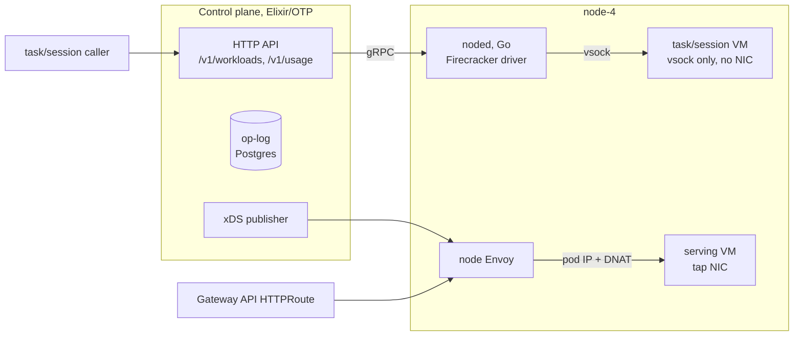

# EmberVM

EmberVM runs untrusted code in Firecracker microVMs behind an HTTP control
plane. An Elixir/OTP control plane schedules work onto a Go node daemon
(noded, forked from the [fc-invoke substrate](../firecracker/)) that drives
Firecracker directly on node-4. Workloads are
declared as Kubernetes `Workload` CRs in one of three classes:

- **task**: one-shot execution in a fresh or snapshot-restored VM. No NIC.
  The guest speaks only vsock to the daemon.
- **session**: a stateful sandbox that survives across invocations. Idle
  sessions are banked (snapshotted to disk) and relit (restored) on the next
  invoke.
- **serving**: a warm HTTP endpoint. The guest answers TCP over a tap NIC and
  a per-node Envoy routes to it. The control plane programs that Envoy over
  xDS and stays off the request hit path.

## Architecture



Task and session requests go through the control plane, which dispatches over
gRPC to noded; noded talks to those guests over vsock. Serving requests never
touch the control plane: the edge gateway routes to the node Envoy, which the
control plane has already programmed via xDS, and the node's kernel DNATs the
connection into the VM's tap network. State lives in a Postgres op-log
(30-day journal, 7-day terminal-task retention), not in etcd.

## Isolation model

No VM and no snapshot lineage ever crosses a principal. The task class has no
network device at all. Quotas fail closed: a principal with quota 0 is
hard-stopped at submit, and metering rides the operation itself rather than a
flush timer, so a crash cannot lose usage. Usage is billed per task on both
success and failure and is queryable at `/v1/usage`.

The one public route (jomcgi.dev/functions/hot-image-demo, an image
renderer served warm) is scoped at
three layers: the HTTPRoute pins the Host rewrite and matches a single path,
the node Envoy exact-matches that internal authority and og-image is the only
serving-class workload on it, and the guest shim reserves the `/shim/` prefix
so hydration and health endpoints are unreachable from outside. The route is
rate-limited at Envoy (120/min) and by a daily 3600 vCPU-second quota.

The full threat model is in
[ADR embervm/001](../../docs/decisions/embervm/001-embervm-beam-firecracker-workload-orchestrator.md).

## Node labelling (one-time operator action)

noded is a DaemonSet over the FC node pool: it runs one daemon per node carrying
the label `homelab.io/firecracker=true`, and the control plane discovers each
daemon's pod endpoint (via EndpointSlices) and dials it individually. Growing the
fleet is therefore a LABEL, not a values edit: label a node and a noded pod
schedules onto it; the control plane discovers it on its next (re)start.

A node label is node-lifecycle config (the same class as joining the node), not a
GitOps-managed resource, so the "never kubectl-mutate managed resources" rule
does not apply. Label each FC node once:

```bash
kubectl label nodes node-1 node-2 node-3 homelab.io/firecracker=true
```

Where serving redundancy is wanted, also label the serving-capable nodes so the
serving relay schedules there too:

```bash
kubectl label nodes node-1 node-2 node-3 embervm.io/serving=true
```

### CPU vendor boundary during fleet expansion

Firecracker memory snapshots are non-portable across the AMD/Intel boundary, so
warmth (bases, sessions, serving/stateful bundles) is keyed and validated per CPU
vendor. Until the CPU-template work (PR-E) lands, the fleet is a single vendor
(AMD) and there is no Intel-pool warmth to place onto. The hard boundary is
enforced FAIL-CLOSED at the daemon regardless of fleet size: a restore of a
snapshot whose stamped vendor differs from the node's is refused with a loud
`vendor mismatch` error (never a silent wrong-vendor boot), so labelling a node
of a different vendor into the pool can never cross-place snapshot-restoring work,
it just fails that restore loudly. Do not add a mixed-vendor node to the FC label
set before PR-E without expecting those restores to (correctly) refuse.

### Node taint: recorded option, not applied (ADR embervm/012)

An earlier plan gave noded and the serving relay a toleration for an FC-node
taint (`embervm.jomcgi.dev/node=true:NoSchedule`) so general workloads could be
locked off the guest-memory hosts. Per ADR embervm/012 (fleet colocation) that
taint is a **recorded option, not an applied one**: the fleet colocates ordinary
workloads with guest memory and relies on the disposable priority class (microVM
workloads die first under memory pressure), not a hard taint, so the taint is
NOT applied today. The tolerations remain in the chart so the option can be taken
later without a code change. If a node ever needs the hard taint (reclaiming it
purely for guest memory), apply it only AFTER confirming the tolerations are live
(tolerations first, taint second, never the reverse):

```bash
# Recorded option, not applied by default:
kubectl taint nodes <node> embervm.jomcgi.dev/node=true:NoSchedule
# Remove: kubectl taint nodes <node> embervm.jomcgi.dev/node=true:NoSchedule-
```

## Roadmap

The milestone log with full candour, including post-ship defects and what
each live drill caught, is [DECISIONS.md](../../DECISIONS.md) at the repo
root.

- [x] **R0 tasks**: dispatch, fair round-robin pooling, metering and quotas,
      OTLP tracing, semgrep scan cutover from fc-invoke.
- [x] **R1 FaaS**: function registry, zip-lane hydration over vsock, public
      og-image function, op-log retention and compaction (ADR embervm/002).
- [x] **R2 sessions**: bank/relight, primed-VM adoption across control-plane
      restarts, sandbox consumer. The live drill then caught four real defects
      that CI-green unit tests missed (session registry adoption, guest path
      default, rootfs versioning, console logging); all fixed and recorded in
      DECISIONS.md D-R2.7.2 through D-R2.7.5.
- [x] **R3 serving**: xDS endpoint publishing, per-node Envoy, DNAT data
      path, operator-owned Gateway API exposure, public warm og-image route.
- [ ] **Goosecracker migration** onto the session class, retiring the
      fc-invoke substrate (the R2.x follow-on in DECISIONS.md).
- [ ] **Offsite snapshot distribution** and rootfs reaping
      (ADR embervm/003; designed, not built).
- [ ] **EKS scale-out**: multi-daemon bricks and the EmberPool CRD
      (ADR embervm/005; designed, not built).
- [ ] **CPU headroom reporting** from cgroups in NodeStatus (memory headroom
      is reported today; CPU reports 0).

## Layout

| Directory   | What it is                                                              |
| ----------- | ----------------------------------------------------------------------- |
| `control/`  | Elixir control plane: dispatcher, op-log, sessions, serving manager     |
| `noded/`    | Forked Go node daemon: Firecracker driver, vsock, tap/DNAT serving      |
| `crd/`      | Workload CRD and sample resources                                      |
| `proto/`    | gRPC contract between the control plane and noded                      |
| `runtimes/` | Guest runtimes (Python zip lane; vsock guest contract in its README)   |
| `xds/`      | Envoy endpoint publisher                                               |
| `chart/`, `deploy/` | Helm chart and ArgoCD wiring                                   |

Everything builds in Bazel, including the Elixir control plane via a hermetic
OTP toolchain with pinned hex dependencies. Images are apko-based; noded
ships dual-arch.

## Scratch disk (FC nodes)

noded's `firecracker.nvmeRoot` (chart value) points at the logical path
`/var/lib/embervm/scratch`, not a device-specific mount. Any node labeled
`homelab.io/firecracker=true` MUST bind-mount its real scratch disk at that
path (fstab entry or a systemd `.mount` unit) before it is labeled, since the
DaemonSet hostPath is uniform across nodes but the physical device differs
per node. Use a separate disk from the etcd WAL disk per ADR embervm/012.
On EKS the same logical path is satisfied by Karpenter's
`instanceStorePolicy` RAID0.
