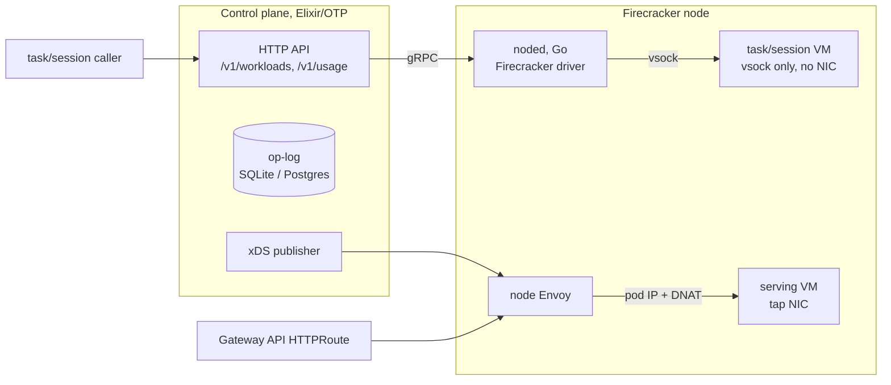

# EmberVM

Self-hosted Firecracker orchestration with **Lambda-shaped ergonomics on metal
you already own**.

An organization sizes (or elastically bounds) a Firecracker nodepool. EmberVM
provides placement, fairness, isolation, metering, and lifecycle so internal
workloads get predictable Lambda-like submit / scale-to-zero / warm-serve
behaviour without a public FaaS product and without putting every invocation
through etcd or a per-job pod.

The reference deployment in this monorepo is the homelab (control plane on
Kubernetes, noded on labelled Firecracker hosts). The product shape is the
installable control plane + node daemon, not a hosted multi-tenant cloud.

## Goals and non-goals

### Goals

- **Private Lambda-equiv:** run untrusted or tenant-scoped code on *your*
  nodes with Lambda-style contracts (HTTP invoke, zip or image source, caps,
  quotas, usage for internal chargeback).
- **Org-bounded capacity:** the adopter owns the nodepool; EmberVM schedules
  honestly on finite capacity (fair queues, admission, fail-closed quotas).
- **Isolation by default:** no VM or snapshot lineage crosses a principal;
  task-class VMs are vsock-only with no NIC.
- **Control plane off the hit path:** steady-state serving traffic is Envoy to
  the VM; the control plane is only on lifecycle actions (create, wake, bank).
- **One operable component:** BEAM control plane + Go node daemon + Workload
  CRD; kubectl / Helm / ArgoCD as the management surface.
- **Correctness over infinite scale theater:** durable task records, worker-
  authoritative runtime state, and continuity across routine rolls where the
  architecture permits.

### Non-goals

- **Not a hosted FaaS product.** No multi-tenant public Lambda, no customer
  isolation as a cloud, no virtual control planes until real demand (facade
  demoted in [ADR embervm/009](../../docs/decisions/embervm/009-roadmap-extension-continuity-before-tenancy.md)).
- **Not “agent platform as the product.”** Agents (e.g. goosecracker on
  sessions) are valuable dogfood and internal consumers, not the definition of
  success. Success is an org can run scan fleets and internal functions on
  their own pool.
- **Not every advanced class as equal pillars.** Task, serving, and session
  form the Lambda-shaped core. Stateful and composite are optional advanced
  classes (scale-to-zero datastores, multi-VM groups) with named consumers;
  they are not required for the private-Lambda pitch.
- **Not infinite capacity.** Queue depth, saturation, and admission control
  are the product surface instead of pretending the pool is unbounded.

Design rationale: [ADR embervm/001](../../docs/decisions/embervm/001-embervm-beam-firecracker-workload-orchestrator.md).

## Workload classes

Workloads are Kubernetes `Workload` CRs. **Zip is a source lane**
(`source.zip` or `source.image`), not a class.

| Class | Role | When it matters |
| ----- | ---- | --------------- |
| **task** | One-shot execution in a fresh or snapshot-restored VM. Vsock only, no NIC. | Core private-Lambda path (scans, jobs, zip functions). |
| **serving** | Warm HTTP endpoint. Guest on a tap NIC; node Envoy routes hits; CP only on miss/wake. | Core warm HTTP / scale-to-zero APIs. |
| **session** | Bank/relight sandbox; idle snapshotted to disk, restored on next invoke. | Long sandboxes, agent threads, notebook-shaped work. |
| **stateful** | Singleton L4 scale-to-zero with a durable volume (wake-on-connect). | Optional: scratch DBs and similar (e.g. scratch-postgres). |
| **composite** | Multi-VM group with a private subnet; whole-set bank/relight. | No live consumer currently. |

## Architecture



Task and session requests go through the control plane, which dispatches over
gRPC to noded; noded talks to those guests over vsock. Serving requests never
touch the control plane on a hit: the edge gateway routes to the node Envoy,
which the control plane has already programmed via xDS, and the node's kernel
DNATs the connection into the VM's tap network. Execution state lives in an
op-log (SQLite-WAL by default for a single-active control plane; Postgres
available for HA cells) plus an ETS hot set, not in etcd.

## Isolation model

No VM and no snapshot lineage ever crosses a principal. The task class has no
network device at all. Quotas fail closed: a principal with quota 0 is
hard-stopped at submit, and metering rides the operation itself rather than a
flush timer, so a crash cannot lose usage. Usage is billed per task on both
success and failure and is queryable at `/v1/usage`.

Public routes are scoped at the HTTPRoute and, for serving workloads, at the
node Envoy authority match and the guest shim's reserved `/shim/` prefix, so
hydration and health endpoints are unreachable from outside. Rate limits and
quotas are applied according to each route's configuration.

The full threat model is in
[ADR embervm/001](../../docs/decisions/embervm/001-embervm-beam-firecracker-workload-orchestrator.md).

## Node labelling (one-time operator action)

noded is a DaemonSet over the FC node pool: it runs one daemon per node carrying
the label `homelab.io/firecracker=true`. Each daemon DIALS HOME (R0 PR-2, ADR
embervm/005): on start and on a jittered interval it POSTs its identity
(`{node, pod_uid, address, boot_id}`) to the control plane's `/v1/nodes/register`
route, and the control plane adopts it keyed by `(node, pod_uid)` and dials the
advertised address for `WatchNode`. The control plane never lists-and-watches
daemon pods (the retired EndpointSlice discovery), so it needs no discovery RBAC.
Growing the fleet is therefore a LABEL, not a values edit: label a node, a noded
pod schedules onto it, and it registers itself within one interval. Because the
registry key is the pod UID, two noded instances on one node during a surge roll
are simultaneously representable (the draining old instance and the fresh one
never alias).

A node label is node-lifecycle config (the same class as joining the node), not a
GitOps-managed resource, so the "never kubectl-mutate managed resources" rule
does not apply. Label each FC node once:

```bash
kubectl label nodes node-1 node-2 node-3 homelab.io/firecracker=true
```

Where serving redundancy is wanted, also label the serving-capable nodes so the
serving relay schedules there too:

```bash
kubectl label nodes node-1 node-2 node-3 embervm.io/serving=true
```

### CPU vendor boundary during fleet expansion

Firecracker memory snapshots are non-portable across the AMD/Intel boundary, so
warmth (bases, sessions, serving/stateful bundles) is keyed and validated per CPU
vendor. Until the CPU-template work (PR-E) lands, the fleet is a single vendor
(AMD) and there is no Intel-pool warmth to place onto. The hard boundary is
enforced FAIL-CLOSED at the daemon regardless of fleet size: a restore of a
snapshot whose stamped vendor differs from the node's is refused with a loud
`vendor mismatch` error (never a silent wrong-vendor boot), so labelling a node
of a different vendor into the pool can never cross-place snapshot-restoring work,
it just fails that restore loudly. Do not add a mixed-vendor node to the FC label
set before PR-E without expecting those restores to (correctly) refuse.

### Node taint: recorded option, not applied (ADR embervm/012)

An earlier plan gave noded and the serving relay a toleration for an FC-node
taint (`embervm.jomcgi.dev/node=true:NoSchedule`) so general workloads could be
locked off the guest-memory hosts. Per ADR embervm/012 (fleet colocation) that
taint is a **recorded option, not an applied one**: the fleet colocates ordinary
workloads with guest memory and relies on the disposable priority class (microVM
workloads die first under memory pressure), not a hard taint, so the taint is
NOT applied today. The tolerations remain in the chart so the option can be taken
later without a code change. If a node ever needs the hard taint (reclaiming it
purely for guest memory), apply it only AFTER confirming the tolerations are live
(tolerations first, taint second, never the reverse):

```bash
# Recorded option, not applied by default:
kubectl taint nodes <node> embervm.jomcgi.dev/node=true:NoSchedule
# Remove: kubectl taint nodes <node> embervm.jomcgi.dev/node=true:NoSchedule-
```

## Roadmap

The product bar is **private Lambda on your nodepool**, not more workload
classes. Capability rungs R0–R5 and R6 Continuity are shipped; remaining work
is adopters (packaging, multi-node), dogfood (agents on sessions), and
continuity polish. Full milestone candour lives in
[DECISIONS.md](../../DECISIONS.md).

- [x] **R0 tasks**: dispatch, fair pooling, metering and quotas, OTLP, semgrep
      cutover from fc-invoke.
- [x] **R1 zip lane**: runtime bases, zip hydration, public og-image function,
      op-log retention (ADR embervm/002).
- [x] **R2 sessions**: bank/relight, adoption across CP restarts, sandbox
      consumer.
- [x] **R3 serving**: xDS, per-node Envoy, DNAT data path, public warm route.
- [x] **R4 stateful**: volume-backed L4 scale-to-zero (scratch-postgres).
- [x] **R5 composite**: multi-VM groups. The code path currently has no live
      consumer after the scratch-k8s retirement.
- [x] **R6 Continuity**: drain, artifact export/restore; routine rolls do not
      cold-boot committed stateful state (ADR embervm/009).
- [ ] **R7 Distribution**: multi-node pre-warm and copy-not-rebuild placement
      (needs more than one FC node to matter).
- [ ] **R8 Consumers**: agent-thread tier on EmberVM sessions; retire
      fc-invoke for goosecracker (dogfood, not product definition).
- [ ] **R9 Packaging**: standalone install / quickstart for external adopters
      (closer to the product than more classes).
- [x] **CPU headroom reporting** from cgroups in NodeStatus.
- [ ] **Node-local activator (ADR embervm/018 Fork A)**: brick-side wake so
      demos survive CP Recreate; partial land, soak ongoing.
- [ ] **Conciseness** (shared wake/adopt/drain, placement collapse, dual-path
      cleanup): tracking [#4009](https://github.com/jomcgi/homelab/issues/4009).

## Layout

| Directory   | What it is                                                              |
| ----------- | ----------------------------------------------------------------------- |
| `control/`  | Elixir control plane: dispatcher, op-log, class managers, xDS publisher |
| `noded/`    | Go node daemon: Firecracker driver, vsock, tap/DNAT, node-local activators |
| `crd/`      | Workload CRD samples                                                   |
| `proto/`    | gRPC contract between the control plane and noded                      |
| `runtimes/` | Guest runtimes (Python zip lane; vsock guest contract in its README)   |
| `xds/`      | Envoy endpoint publisher sidecar                                       |
| `chart/`, `deploy/` | Helm chart and ArgoCD wiring                                   |
| `specs/`    | TLA+ pilots for adoption and bank/relight protocols                    |

Everything builds in Bazel, including the Elixir control plane via a hermetic
OTP toolchain with pinned hex dependencies. Images are apko-based; noded
ships dual-arch.

## Scratch disk (FC nodes)

noded's `firecracker.nvmeRoot` (chart value) points at the logical path
`/var/lib/embervm/scratch`, not a device-specific mount. Any node labeled
`homelab.io/firecracker=true` MUST bind-mount its real scratch disk at that
path (fstab entry or a systemd `.mount` unit) before it is labeled, since the
DaemonSet hostPath is uniform across nodes but the physical device differs
per node. Use a separate disk from the etcd WAL disk per ADR embervm/012.
On EKS the same logical path is satisfied by Karpenter's
`instanceStorePolicy` RAID0.
