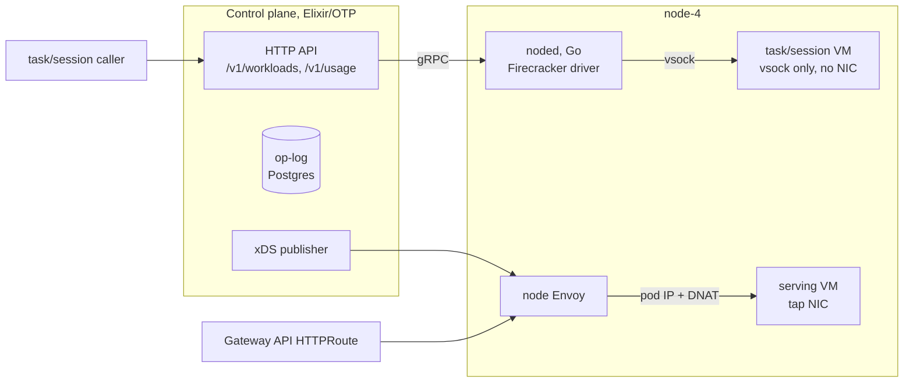

# EmberVM

EmberVM runs untrusted code in Firecracker microVMs behind an HTTP control
plane. An Elixir/OTP control plane schedules work onto a Go node daemon
(noded, forked from the [fc-invoke substrate](../firecracker/)) that drives
Firecracker directly on node-4. Workloads are
declared as Kubernetes `Workload` CRs in one of three classes:

- **task**: one-shot execution in a fresh or snapshot-restored VM. No NIC.
  The guest speaks only vsock to the daemon.
- **session**: a stateful sandbox that survives across invocations. Idle
  sessions are banked (snapshotted to disk) and relit (restored) on the next
  invoke.
- **serving**: a warm HTTP endpoint. The guest answers TCP over a tap NIC and
  a per-node Envoy routes to it. The control plane programs that Envoy over
  xDS and stays off the request hit path.

## Architecture



Task and session requests go through the control plane, which dispatches over
gRPC to noded; noded talks to those guests over vsock. Serving requests never
touch the control plane: the edge gateway routes to the node Envoy, which the
control plane has already programmed via xDS, and the node's kernel DNATs the
connection into the VM's tap network. State lives in a Postgres op-log
(30-day journal, 7-day terminal-task retention), not in etcd.

## Isolation model

No VM and no snapshot lineage ever crosses a principal. The task class has no
network device at all. Quotas fail closed: a principal with quota 0 is
hard-stopped at submit, and metering rides the operation itself rather than a
flush timer, so a crash cannot lose usage. Usage is billed per task on both
success and failure and is queryable at `/v1/usage`.

The one public route (jomcgi.dev/functions/hot-image-demo, an image
renderer served warm) is scoped at
three layers: the HTTPRoute pins the Host rewrite and matches a single path,
the node Envoy exact-matches that internal authority and og-image is the only
serving-class workload on it, and the guest shim reserves the `/shim/` prefix
so hydration and health endpoints are unreachable from outside. The route is
rate-limited at Envoy (120/min) and by a daily 3600 vCPU-second quota.

The full threat model is in
[ADR embervm/001](../../docs/decisions/embervm/001-embervm-beam-firecracker-workload-orchestrator.md).

## Node taint (one-time operator action)

FC nodes carry guest memory, so general workloads must never compete for it.
The chart gives noded and the serving relay a toleration for the FC-node taint
(`embervm.jomcgi.dev/node=true:NoSchedule`); the taint itself is applied to the
node by hand, once, because a node taint is node-lifecycle config (the same
class as joining the node), not a GitOps-managed resource, so the "never
kubectl-mutate managed resources" rule does not apply.

**Ordering matters: tolerations first, taint second, never the reverse.** Apply
the taint only AFTER the chart version carrying the tolerations is live,
otherwise Kubernetes evicts noded and the relay off the node the moment it is
tainted. Once the tolerations are rolled out:

```bash
kubectl taint nodes node-4 embervm.jomcgi.dev/node=true:NoSchedule
```

To remove it (e.g. reclaiming the node): `kubectl taint nodes node-4
embervm.jomcgi.dev/node=true:NoSchedule-`.

## Roadmap

The milestone log with full candour, including post-ship defects and what
each live drill caught, is [DECISIONS.md](../../DECISIONS.md) at the repo
root.

- [x] **R0 tasks**: dispatch, fair round-robin pooling, metering and quotas,
      OTLP tracing, semgrep scan cutover from fc-invoke.
- [x] **R1 FaaS**: function registry, zip-lane hydration over vsock, public
      og-image function, op-log retention and compaction (ADR embervm/002).
- [x] **R2 sessions**: bank/relight, primed-VM adoption across control-plane
      restarts, sandbox consumer. The live drill then caught four real defects
      that CI-green unit tests missed (session registry adoption, guest path
      default, rootfs versioning, console logging); all fixed and recorded in
      DECISIONS.md D-R2.7.2 through D-R2.7.5.
- [x] **R3 serving**: xDS endpoint publishing, per-node Envoy, DNAT data
      path, operator-owned Gateway API exposure, public warm og-image route.
- [ ] **Goosecracker migration** onto the session class, retiring the
      fc-invoke substrate (the R2.x follow-on in DECISIONS.md).
- [ ] **Offsite snapshot distribution** and rootfs reaping
      (ADR embervm/003; designed, not built).
- [ ] **EKS scale-out**: multi-daemon bricks and the EmberPool CRD
      (ADR embervm/005; designed, not built).
- [ ] **CPU headroom reporting** from cgroups in NodeStatus (memory headroom
      is reported today; CPU reports 0).

## Layout

| Directory   | What it is                                                              |
| ----------- | ----------------------------------------------------------------------- |
| `control/`  | Elixir control plane: dispatcher, op-log, sessions, serving manager     |
| `noded/`    | Forked Go node daemon: Firecracker driver, vsock, tap/DNAT serving      |
| `crd/`      | Workload CRD and sample resources                                      |
| `proto/`    | gRPC contract between the control plane and noded                      |
| `runtimes/` | Guest runtimes (Python zip lane; vsock guest contract in its README)   |
| `xds/`      | Envoy endpoint publisher                                               |
| `chart/`, `deploy/` | Helm chart and ArgoCD wiring                                   |

Everything builds in Bazel, including the Elixir control plane via a hermetic
OTP toolchain with pinned hex dependencies. Images are apko-based; noded
ships dual-arch.
