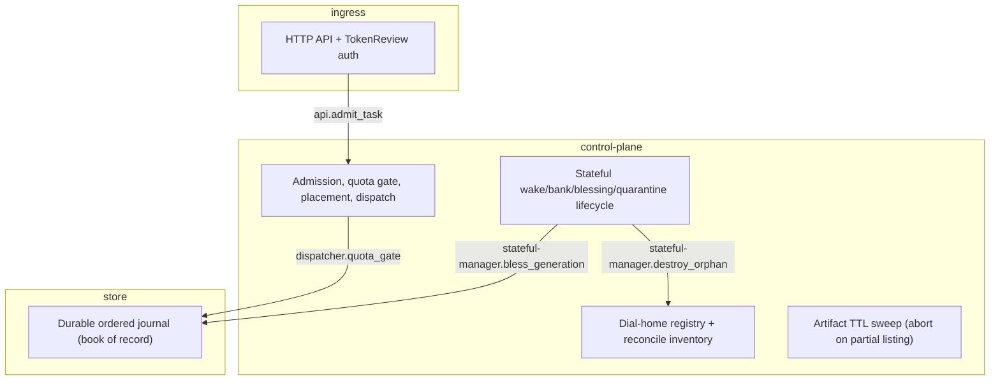
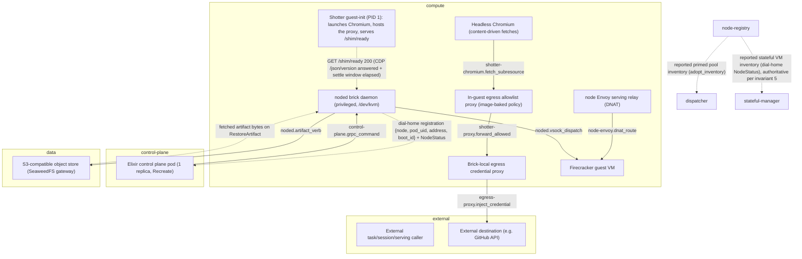

# STPA Control Analysis: EmberVM @ 55ca7188a

_Auto-generated STPA safety model: the unsafe states this system can reach and the control actions that get it there. Two views: logical (functional control flow) and physical (deployment)._

<b>How to read this</b>: STPA primer and diagram legend

**STPA** (System-Theoretic Process Analysis) treats the system as *controllers* issuing *control actions* to *controlled processes*, with *feedback* flowing back up. Instead of "what component can fail," it asks "what control action, given or withheld at the wrong time, drives the system into an unsafe state?" "Unsafe" means a violation of this system's reason to exist, not merely a crash.

Read top-down: **Losses** are outcomes we must never cause; **Hazards** are system states that lead to a loss; the **control-structure diagrams** (one per view) show who commands whom (solid arrows = control actions, dashed = feedback, a node tagged `(designed)` is in the architecture but **not yet built**); the **Unsafe Control Actions** table is the core, and **Unsafe Feedback** covers the dashed arrows: data channels whose absence, staleness, corruption, or spoofing drives a controller into a hazard. Every claim cites `path:line`; unbuilt elements are marked. Semantic, stable IDs mean regenerating changes only the findings that changed.

**Scope.** EmberVM's Elixir control plane and Go noded daemons implement a well-verified lifecycle core (three TLA+ specs, fail-closed admission/destroy/quarantine paths), but three deployment-time trust boundaries default open: unauthenticated noded gRPC, self-asserted dial-home identity under a shared ServiceAccount, and an anonymous default object-store gateway.

Maturity detail

- **Built:** task/session/serving/stateful/composite lifecycle managers; admission quota gate (fail-closed per-principal when a budget is configured); generation blessing (CP-issued pre-dispatch and checkpoint-abort self-heal via durable checkpoint_dispatched); delegated generation leases (BlessingLease, bounded and monotonic); orphan-destroy reconcile with an ACTIVATOR-origin adoption guard that runs before the destroy pass; S3 warmth GC that aborts the whole sweep on a partial listing; dial-home registration; brick-local egress credential injection scoped by egressTo; the shotter task-class guest (ADR embervm/035): a warm headless Chromium snapshot base behind an in-guest, image-baked, hard-allowlisted egress proxy that is the first EmberVM guest whose outbound requests are shaped by content it fetched rather than a fixed program
- **Designed-only:** mTLS/SPIFFE transport auth and NetworkPolicy for noded (#4693); per-principal envelope encryption and tuple-authorized restore (#4691); node-local activator for stateful/composite wake (partially landed, stateful activator currently only cold-boots); audience-scoped guest token; request-scoped GitHub tool mediation replacing host-keyed injection (ADR 055)
- **Note:** The interruptible-bank checkpoint commit/abort sub-protocol (noded/server/stateful.go) is exercised in production and depends on a hand-reasoned crash-ordering argument, but has no TLA+ coverage, unlike the top-level bank/relight pairing invariant it sits underneath (specs/bank_relight.tla has zero mentions of checkpoint/interruptible). Separately, shotter (ADR embervm/035, PR #4998, not yet on main) widens egress.internal.allowlist, a value global to the shared sidecar, so its two new entries become reachable by every other egress-enabled workload, not only shotter.

## Control structure

### Logical view

### Physical view

## Losses

| ID | Loss |
|----|------|
| `L.integrity-loss` | Stored or served state (volume, snapshot, generation, artifact) diverges from truth and is acted on as correct |
| `L.liveness-loss` | The fleet, a brick, or a workload becomes unable to admit or serve legitimate work |
| `L.provenance-loss` | State, credentials, or execution history become attributed to the wrong principal, brick, or generation |
| `L.secret-exposure` | Credential or key material becomes reachable by an unauthorized principal or guest |
| `L.silent-incorrectness` | A caller receives a served or resumed result derived from stale, forged, or wrong state with no signal |
| `L.unauthorized-access` | An actor obtains a capability, credential reach, or execution path beyond its principal or role |

## Hazards

| ID | View | Hazard (unsafe state) | → Losses | Maturity |
|----|----|----|----|----|
| `anonymous-store-access` | physical | the reference deployment's default S3 gateway accepts unauthenticated requests, so any pod-network caller can write, substitute, or delete warmth and archive objects directly, bypassing every noded-enforced artifact-verb safety check; restore authorization today is storage-ACL-only, not scoped by (principal, lineage, brick, workload, generation, lease) | L.integrity-loss, L.secret-exposure, L.silent-incorrectness | built |
| `egress-workload-derivation-gap` | physical | the per-workload egress forwarder allowlist noded receives is a hand-written if-chain over named workloads in the chart template, not a true derivation, so a future task/session/stateful workload that enables egress but is not added to this chain gets no forwarder and dial-times-out inside the guest instead of a loud, diagnosable deny | L.liveness-loss | built |
| `host-keyed-credential-overreach` | physical | host-keyed egress credential injection authorizes by destination host only, so a prompt-injected or compromised guest can shape any request to an allowlisted host and have the credential attached to it | L.secret-exposure, L.unauthorized-access | built |
| `identity-hijack` | physical | an actor holding the shared noded ServiceAccount token can re-register an existing brick's (node, pod_uid) at an address it controls and become the dial-home source the control plane treats as authoritative for that brick | L.unauthorized-access, L.integrity-loss, L.provenance-loss | built |
| `open-node-control-channel` | physical | noded's gRPC surface accepts BuildBase/Prime/Assign/Destroy/DeleteVolume/RestoreArtifact from any caller reachable on the pod network, because the bearer-token interceptor and the covering NetworkPolicy are both off by default | L.unauthorized-access, L.integrity-loss | built |
| `shared-egress-allowlist-widening` | physical | egress.internal.allowlist is global to the shared sidecar rather than scoped per workload, so shotter's two new frontend destinations become reachable by every other egress-enabled workload (today the claude runtime, later pi if granted egress) with no per-workload authorization check | L.unauthorized-access | built |
| `shotter-broken-base-snapshot` | physical | shotter's base snapshot is cut the instant /shim/ready first returns 200, and that signal only proves Chromium's CDP HTTP endpoint answered, not that the renderer can actually navigate and capture a page, so a control-plane-reachable but functionally broken browser is baked into every clone restored from that base | L.liveness-loss, L.silent-incorrectness | built |
| `shotter-memmib-tmpfs-coupling` | physical | the shotter workload's memMib budget and its guest-init tmpfs size are a YAML integer and a Go string literal in different directories with nothing in the build enforcing their relation, so raising either alone silently trades a legible ENOSPC on /tmp for an opaque guest OOM kill under load, or leaves /tmp undersized without freeing any more memMib | L.liveness-loss, L.silent-incorrectness | built |
| `shotter-policy-drift` | physical | the guest's baked destination policy (/etc/shotter-egress.json, a checked-in file copied verbatim into the image) and the sidecar's chart-driven egress.internal.allowlist are two independently hand-maintained sources of egress truth with no build-time check that they agree, so they can diverge in either direction: the guest could deny a destination the chart already permits (silent functional failure), or a future image rebuild could widen the baked allowlist beyond what any ADR or chart review anticipated | L.unauthorized-access, L.silent-incorrectness | built |
| `unmodeled-checkpoint-abort` | logical | the interruptible-bank checkpoint commit/abort protocol (generation-advance-then-delete-temp-then-resume ordering, resolve-timeout auto-abort, blessed-vs-self-bump discrimination) governs whether a resumed VM's generation pairing stays trustworthy, but is verified only by code comments, unlike the bank/relight pairing invariant it sits underneath | L.integrity-loss, L.silent-incorrectness | built |

## Control actions

| ID | View | Control action | Controller → Process | Maturity | Evidence |
|----|----|----|----|----|----|
| `api.admit_task` | logical | Authenticate + admit a task/session submission | `api` → `dispatcher` | built | projects/embervm/control/lib/embervm/router.ex:33 |
| `control-plane.grpc_command` | physical | BuildBase / Prime / Assign / Destroy / DeleteVolume / RestoreArtifact | `control-plane` → `noded` | built | projects/embervm/proto/embervm/node/v1/node.proto:57 |
| `dispatcher.quota_gate` | logical | Fail-closed per-principal budget check before dispatch | `dispatcher` → `op-log` | built | projects/embervm/control/lib/embervm/dispatcher.ex:258 |
| `egress-proxy.inject_credential` | physical | Header-inject a credential, host-keyed by egressTo | `egress-proxy` → `external-host` | built | projects/embervm/ARCHITECTURE.md:642 |
| `node-envoy.dnat_route` | physical | Kernel DNAT of serving traffic into guest tap | `node-envoy` → `guest-vm` | built | projects/embervm/ARCHITECTURE.md:145 |
| `noded.artifact_verb` | physical | ExportArtifact / RestoreArtifact / EvictArtifact | `noded` → `s3-store` | built | projects/embervm/proto/embervm/node/v1/node.proto:463 |
| `noded.vsock_dispatch` | physical | Dispatch payload to guest over vsock (no NIC) | `noded` → `guest-vm` | built | projects/embervm/ARCHITECTURE.md:142 |
| `shotter-chromium.fetch_subresource` | physical | Browser-issued HTTP/CONNECT request driven by fetched page content, forced through the local proxy with no direct-network fallback | `shotter-chromium` → `shotter-proxy` | built | projects/embervm/runtimes/shotter/guest-init/cmd/main.go:132 |
| `shotter-proxy.forward_allowed` | physical | Forward only a resolved, allowlisted destination over vsock; refuse before any vsock dial | `shotter-proxy` → `egress-proxy` | built | projects/embervm/runtimes/shotter/guest-init/cmd/proxy.go:356 |
| `stateful-manager.bless_generation` | logical | Durably bless the next volume generation before dispatch | `stateful-manager` → `op-log` | built | projects/embervm/control/lib/embervm/stateful_manager.ex:676 |
| `stateful-manager.destroy_orphan` | logical | Fail-closed destroy of an unrecognized node-reported VM | `stateful-manager` → `node-registry` | built | projects/embervm/control/lib/embervm/stateful_manager.ex:2027 |

## Unsafe control actions

*The core of the analysis. Each row: a control action made unsafe via one guideword, the hazard/loss it causes, and where in the code it lives.*

| ID | View | Control action | Guideword | Unsafe condition | Severity | → Hazards | Evidence |
|----|----|----|----|----|----|----|----|
| `control-plane.grpc_command.providing` | physical | `control-plane.grpc_command` | providing | an actor other than the control plane issues BuildBase/Prime/Assign/Destroy/DeleteVolume/RestoreArtifact to a brick, since noded runs with no bearer token and no NetworkPolicy selects it | high | open-node-control-channel | projects/embervm/noded/cmd/main.go:245 |
| `egress-proxy.inject_credential.providing` | physical | `egress-proxy.inject_credential` | providing | the proxy injects a real credential into any request whose destination host is allowlisted, regardless of what the guest-originated request actually asks that host to do, so a prompt-injected guest can direct the credentialed call | medium | host-keyed-credential-overreach | projects/embervm/ARCHITECTURE.md:667 |

## Unsafe feedback

*Feedback and data channels whose absence, staleness, corruption, or spoofed origin drives a controller into a hazard. This is where data-integrity failures live.*

| ID | View | Channel | Guideword | Unsafe condition | Severity | → Hazards | Evidence |
|----|----|----|----|----|----|----|----|
| `dial-home.unauthorized-source` | physical | `noded` → `control-plane`: dial-home registration {node, pod_uid, address, boot_id} | unauthorized-source | re-registering an existing (node, pod_uid) at a different address is accepted unconditionally and expires the prior instance, so identity is self-asserted under a ServiceAccount shared by every brick rather than bound to the actual brick | high | identity-hijack | projects/embervm/control/lib/embervm/node_registry.ex:1320 |
| `shotter-readiness.corrupted` | physical | `shotter-guest-init` → `noded`: GET /shim/ready 200 (CDP /json/version answered + settle window elapsed) | corrupted | readiness is gated on Chromium's CDP HTTP endpoint answering /json/version with a non-empty browser identity and websocket URL, which proves the control protocol is alive but not that the renderer can actually navigate and capture a page; noded snapshots the base the instant that 200 lands, so a browser that is control-plane-reachable but functionally broken (e.g. a stalled renderer process) is baked into every restored clone and fails per-invocation instead of failing once, loudly, at BuildBase | medium | shotter-broken-base-snapshot | projects/embervm/runtimes/shotter/guest-init/cmd/main.go:180; tracked as issue #4999 |
| `warmth-fetch.unauthorized-source` | physical | `s3-store` → `noded`: fetched artifact bytes on RestoreArtifact | unauthorized-source | SigV4 per-identity access is built and enabled per environment by values, but the default SeaweedFS S3 gateway still has authentication disabled until the coordinated flip, so an object noded restores as warmth may have been written by any pod-network caller rather than exported by a legitimate bank; the same-vendor case passes the vendor-stamp check silently | high | anonymous-store-access | projects/embervm/chart/templates/_noded-pod.tpl:328 |

<b>Not UCAs</b>: 9 examined and rejected

- **a leaked Chromium CDP target accumulating across shotter invocations**: each invocation restores its own CoW clone that is destroyed after the response, so a leak cannot outlive one clone; within a clone, closeCDPTarget runs on every return path via defer, including navigation and capture errors (projects/embervm/chart/templates/workload-shotter.yaml, guest-init/cmd/cdp.go:395-399)
- **a redirect or subresource on a mapped page escaping the shotter-proxy allowlist**: the proxy is the only egress path (--proxy-server with no direct network fallback), so a redirect or a subresource fetch to an unmapped host issues a fresh CONNECT/absolute request through the same proxy and is checked by the same resolve() call as any other request, never trusted because it originated from an already-allowed page (projects/embervm/runtimes/shotter/guest-init/cmd/main.go:132, guest-init/cmd/proxy.go:262-290)
- **a restored clone resuming a page or CDP target left over from a prior invocation**: createCDPTarget opens a fresh about:blank target per invocation specifically so an hours-later restore never inherits a stale page or target (projects/embervm/runtimes/shotter/guest-init/cmd/cdp.go:44-47)
- **checkpoint-abort auto-bump producing an unblessed generation**: the resolve-timeout auto-abort lane (blessedGeneration: 0) is the ONLY case that produces it, and StatefulStore correctly quarantines it as a fail-closed signal rather than treating it as a bug (noded/server/stateful.go:605-610)
- **no per-principal daily budget configured in the reference deployment**: spend is still bounded by admission caps and concurrency, not unbounded; cutoff is an admission action by design (invariant 4), and quota fails closed the moment a budget IS set (control/lib/embervm/dispatcher.ex:1341, deploy/values.yaml)
- **node-local activator on stateful defaults BlessedGeneration to 0 during control-plane absence**: a zero generation fails pairing and forces a cold boot rather than an incorrect relight, matching invariant 4's fail-open-to-cold-boot rule (noded/server/stateful_activator.go:361)
- **orphan-destroy racing a live node-woken (ACTIVATOR-origin) stateful VM**: adopt_activator_stateful_vms runs on the same reconcile pass before the orphan-destroy loop, and the loop explicitly skips activator_origin? vms as belt-and-suspenders (control/lib/embervm/stateful_manager.ex:2031-2038)
- **shotter-proxy refusing every destination when /etc/shotter-egress.json is missing or malformed**: LoadProxyConfig returns a zero-value config on any read or parse error, and the zero value's nil maps make resolve() refuse everything; the failure mode is fail-closed and surfaces as a bounded per-request refusal, not a silent bypass (projects/embervm/runtimes/shotter/guest-init/cmd/proxy.go:78-99)
- **shotter-proxy.forward_allowed checked against the requested top-level host instead of the actually-dialled destination**: resolve() applies the host mapping first and validates the resulting mapped destination against the allowlist for both CONNECT targets and Host-header-derived absolute-form requests, so the value checked and the value dialled are always the same one; a request for an unmapped or mismatched host fails resolve() before any vsock dial (projects/embervm/runtimes/shotter/guest-init/cmd/proxy.go:180-199)

## Open questions

- Whether egress.internal.allowlist should become scoped per egress-enabled workload rather than global to the sidecar (ADR embervm/035 open question 1); shared-egress-allowlist-widening tracks the safety consequence of leaving it global.
- Whether shotter's readiness check should include an actual navigate-and-render self-test (not only CDP /json/version) before flipping /shim/ready, to close the gap unsafe_feedback shotter-readiness.corrupted describes.
