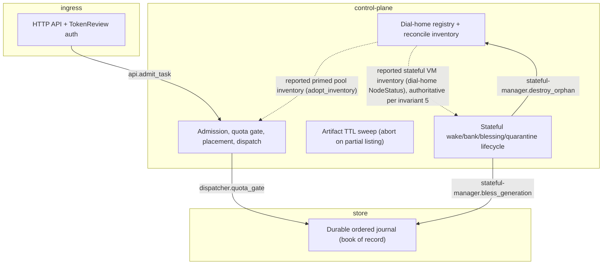
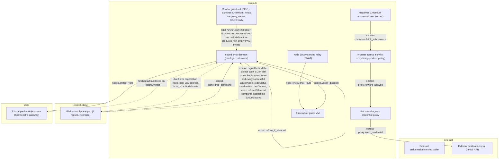

# STPA Control Analysis: embervm @ b1514fe38

_Auto-generated STPA safety model: the unsafe states this system can reach and the control actions that get it there. Two views: logical (functional control flow) and physical (deployment)._

<b>How to read this</b>: STPA primer and diagram legend

**STPA** (System-Theoretic Process Analysis) treats the system as *controllers* issuing *control actions* to *controlled processes*, with *feedback* flowing back up. Instead of "what component can fail," it asks "what control action, given or withheld at the wrong time, drives the system into an unsafe state?" "Unsafe" means a violation of this system's reason to exist, not merely a crash.

Read top-down: **Losses** are outcomes we must never cause; **Hazards** are system states that lead to a loss; the **control-structure diagrams** (one per view) show who commands whom (solid arrows = control actions, dashed = feedback, a node tagged `(designed)` is in the architecture but **not yet built**); the **Unsafe Control Actions** table is the core, and **Unsafe Feedback** covers the dashed arrows: data channels whose absence, staleness, corruption, or spoofing drives a controller into a hazard. Every claim cites `path:line`; unbuilt elements are marked. Semantic, stable IDs mean regenerating changes only the findings that changed.

**Scope.** EmberVM is a Firecracker microVM platform: an Elixir control plane admits and dispatches task, session, serving, and stateful workloads onto brick pods, each run by a privileged Go noded daemon that supervises guest VMs over vsock and dial-homes to register with the control plane. The lifecycle core (admission, generation blessing, delegated leases, orphan destroy, quarantine) is TLA+ verified and fail-closed. Built deployment controls as of this commit: the noded gRPC channel is bearer-token authenticated and NetworkPolicy-scoped to the control plane and enabled in production (#4693); the S3 artifact-store gateway enforces SigV4 identity authentication (#4708), leaving a residual fleet-shared credential tracked as store-credential-unscoped; the ADR embervm/037 brick silence timeout is armed at 21600s in both deploy and dev, bounding how long a partitioned brick keeps exercising node-local authority while preserving warmth fail-open; the #4962 warmth ownership guard writes .alive claims on every brick and reaps only unclaimed pre-heartbeat warmth; shotter readiness requires a real CDP trial capture, closing the formerly designed-only render-proof gap. Still designed-only: mTLS/SPIFFE certificate mutual auth, armed enforcement of per-principal envelope encryption (ADR embervm/033 built but inert, #4691), the node-local activator beyond cold boot, audience-scoped guest tokens, and request-scoped GitHub tool mediation.

Maturity detail

- **Built:** task/session/serving/stateful/composite lifecycle managers, admission quota gate (fail-closed per-principal when a budget is configured), generation blessing (CP-issued pre-dispatch and checkpoint-abort self-heal via durable checkpoint_dispatched), delegated generation leases (BlessingLease, bounded and monotonic), orphan-destroy reconcile with an ACTIVATOR-origin adoption guard that runs before the destroy pass, S3 warmth GC that aborts the whole sweep on a partial listing, dial-home registration, brick-local egress credential injection scoped by egressTo, the shotter task-class guest (ADR embervm/035): a warm headless Chromium snapshot base behind an in-guest, image-baked, hard-allowlisted egress proxy, whose readiness is now gated on one real trial capture before /shim/ready flips, the noded gRPC control channel, authenticated by a static bearer token and scoped by a CiliumNetworkPolicy to control-plane-only ingress, enabled in production (#4693), SigV4-authenticated access to the S3 artifact store enforced by the gateway (enableAuth: true), enabled in production (#4708); the surviving embervm identity is one credential shared by every brick and the control plane, the brick silence timeout (ADR embervm/037) bounding node-local authority (activator wakes, group wakes, blessing-lease self-advance) once control-plane contact goes stale, armed at 21600s in production and dev, the warmth ownership transition guard (#4962): every brick refreshes a .alive claim per warmth segment and startup GC reaps only unclaimed pre-heartbeat directories or claims older than WarmthStaleAfter, principal-artifact envelope encryption and capability-gated restore in noded, reader path unconditional, writer and enforcement gated inert by default pending environment rollout (ADR embervm/033, #4691)
- **Designed-only:** mTLS/SPIFFE certificate-based mutual transport auth for noded (#4693 delivered the bearer-token-plus-NetworkPolicy interim), per-principal envelope encryption enforcement and tuple-authorized restore armed (kekRoot, EMBERVM_ARTIFACT_ENCRYPTION, store.encrypt, requireRestoreCapability all default false, #4691), node-local activator for stateful/composite wake beyond cold boot (partially landed, stateful activator currently only cold-boots), audience-scoped guest token, request-scoped GitHub tool mediation replacing host-keyed injection (ADR 055)
- **Note:** ARCHITECTURE.md:672-674 still marks the brick silence timeout as Planned (#5073); the code (noded/server/server.go silenced/refuseIfSilenced, config.go SilenceTimeoutSeconds, deploy and dev values armed 21600) shipped at commit 248acd648, so this analysis trusts code over the stale doc pending the doc-flip PR. Separately, egress.internal.allowlist remains one global list shared by the sidecar rather than scoped per workload, so shotter destinations stay reachable by every other egress-enabled workload; see hazard shared-egress-allowlist-widening.

## Control structure

### Logical view

### Physical view

## Losses

| ID | Loss |
|----|------|
| `L.integrity-loss` | Stored or served state (volume, snapshot, generation, artifact) diverges from truth and is acted on as correct |
| `L.liveness-loss` | The fleet, a brick, or a workload becomes unable to admit or serve legitimate work |
| `L.provenance-loss` | State, credentials, or execution history become attributed to the wrong principal, brick, or generation |
| `L.secret-exposure` | Credential or key material becomes reachable by an unauthorized principal or guest |
| `L.silent-incorrectness` | A caller receives a served or resumed result derived from stale, forged, or wrong state with no signal |
| `L.unauthorized-access` | An actor obtains a capability, credential reach, or execution path beyond its principal or role |

## Hazards

| ID | View | Hazard (unsafe state) | → Losses | Maturity |
|----|----|----|----|----|
| `egress-workload-derivation-gap` | physical | the per-workload egress forwarder allowlist noded receives is a hand-written if-chain over named workloads in the chart template, not a true derivation, so a future task/session/stateful workload that enables egress but is not added to this chain gets no forwarder and dial-times-out inside the guest instead of a loud, diagnosable deny | L.liveness-loss | built |
| `host-keyed-credential-overreach` | physical | host-keyed egress credential injection authorizes by destination host only, so a prompt-injected or compromised guest can shape any request to an allowlisted host and have the credential attached to it | L.secret-exposure, L.unauthorized-access | built |
| `identity-hijack` | physical | an actor holding the shared noded ServiceAccount token can re-register an existing brick's (node, pod_uid) at an address it controls and become the dial-home source the control plane treats as authoritative for that brick | L.unauthorized-access, L.integrity-loss, L.provenance-loss | built |
| `shared-egress-allowlist-widening` | physical | egress.internal.allowlist is global to the shared sidecar rather than scoped per workload, so shotter's two new frontend destinations become reachable by every other egress-enabled workload (today the claude runtime, later pi if granted egress) with no per-workload authorization check | L.unauthorized-access | built |
| `shotter-broken-base-snapshot` | physical | shotter's base snapshot is cut when /shim/ready first returns 200; readiness now proves more than protocol liveness because guest-init must answer CDP /json/version and then complete one real trial capture (navigate about:blank, screenshot, non-empty PNG bytes within 15s) before flipping ready, so a globally broken renderer or GL stack fails loudly at warm-up instead of baking into every clone, but the trial exercises only about:blank, so a page-specific rendering failure can still be baked into the base and fail per-invocation instead of failing once, loudly, at BuildBase | L.liveness-loss, L.silent-incorrectness | built |
| `shotter-memmib-tmpfs-coupling` | physical | the shotter workload's memMib budget and its guest-init tmpfs size are a YAML integer and a Go string literal in different directories with nothing in the build enforcing their relation, so raising either alone silently trades a legible ENOSPC on /tmp for an opaque guest OOM kill under load, or leaves /tmp undersized without freeing any more memMib | L.liveness-loss, L.silent-incorrectness | built |
| `shotter-policy-drift` | physical | the guest's baked destination policy (/etc/shotter-egress.json, a checked-in file copied verbatim into the image) and the sidecar's chart-driven egress.internal.allowlist are two independently hand-maintained sources of egress truth with no build-time check that they agree, so they can diverge in either direction: the guest could deny a destination the chart already permits (silent functional failure), or a future image rebuild could widen the baked allowlist beyond what any ADR or chart review anticipated | L.unauthorized-access, L.silent-incorrectness | built |
| `store-credential-unscoped` | physical | the S3 gateway now requires a valid SigV4-signed identity, but the embervm identity's credential is one secret rendered into every noded pod and the control plane, with bucket-wide read/write/list/tag reach over both the embervm and embervm-dev buckets; restore authorization is still storage-ACL-only, not scoped by (principal, lineage, brick, workload, generation, lease), so any brick holding the shared credential can write, substitute, or delete another principal's artifacts, bypassing noded's per-request artifact-verb checks entirely | L.integrity-loss, L.silent-incorrectness | built |
| `unmodeled-checkpoint-abort` | logical | the interruptible-bank checkpoint commit/abort protocol (generation-advance-then-delete-temp-then-resume ordering, resolve-timeout auto-abort, blessed-vs-self-bump discrimination) governs whether a resumed VM's generation pairing stays trustworthy, but is verified only by code comments, unlike the bank/relight pairing invariant it sits underneath | L.integrity-loss, L.silent-incorrectness | built |

## Control actions

| ID | View | Control action | Controller → Process | Maturity | Evidence |
|----|----|----|----|----|----|
| `api.admit_task` | logical |  | `api` → `dispatcher` |  | projects/embervm/control/lib/embervm/router.ex:33 |
| `control-plane.grpc_command` | physical |  | `control-plane` → `noded` |  | projects/embervm/proto/embervm/node/v1/node.proto:57 |
| `dispatcher.quota_gate` | logical |  | `dispatcher` → `op-log` |  | projects/embervm/control/lib/embervm/dispatcher.ex:258 |
| `egress-proxy.inject_credential` | physical |  | `egress-proxy` → `external-host` |  | projects/embervm/ARCHITECTURE.md:710 |
| `node-envoy.dnat_route` | physical |  | `node-envoy` → `guest-vm` |  | projects/embervm/ARCHITECTURE.md:193 |
| `noded.artifact_verb` | physical |  | `noded` → `s3-store` |  | projects/embervm/proto/embervm/node/v1/node.proto:463 |
| `noded.refuse_if_silenced` | physical |  | `noded` → `noded` |  | projects/embervm/noded/server/server.go:619 |
| `noded.vsock_dispatch` | physical |  | `noded` → `guest-vm` |  | projects/embervm/ARCHITECTURE.md:234 |
| `shotter-chromium.fetch_subresource` | physical |  | `shotter-chromium` → `shotter-proxy` |  | projects/embervm/runtimes/shotter/guest-init/cmd/main.go:168 |
| `shotter-proxy.forward_allowed` | physical |  | `shotter-proxy` → `egress-proxy` |  | projects/embervm/runtimes/shotter/guest-init/cmd/proxy.go:391-405 |
| `stateful-manager.bless_generation` | logical |  | `stateful-manager` → `op-log` |  | projects/embervm/control/lib/embervm/stateful_manager.ex:676 |
| `stateful-manager.destroy_orphan` | logical |  | `stateful-manager` → `node-registry` |  | projects/embervm/control/lib/embervm/stateful_manager.ex:2027 |

## Unsafe control actions

*The core of the analysis. Each row: a control action made unsafe via one guideword, the hazard/loss it causes, and where in the code it lives.*

| ID | View | Control action | Guideword | Unsafe condition | Severity | → Hazards | Evidence |
|----|----|----|----|----|----|----|----|
| `egress-proxy.inject_credential.providing` | physical | `null` | providing | the proxy injects a real credential into any request whose destination host is allowlisted, regardless of what the guest-originated request actually asks that host to do, so a prompt-injected guest can direct the credentialed call | medium | host-keyed-credential-overreach | projects/embervm/ARCHITECTURE.md:745 |

## Unsafe feedback

*Feedback and data channels whose absence, staleness, corruption, or spoofed origin drives a controller into a hazard. This is where data-integrity failures live.*

| ID | View | Channel | Guideword | Unsafe condition | Severity | → Hazards | Evidence |
|----|----|----|----|----|----|----|----|
| `dial-home.unauthorized-source` | physical | `noded` → `control-plane`: dial-home registration {node, pod_uid, address, boot_id} + NodeStatus | unauthorized-source | re-registering an existing (node, pod_uid) at a different address is accepted unconditionally and expires the prior instance, so identity is self-asserted under a ServiceAccount shared by every brick rather than bound to the actual brick | high | identity-hijack | projects/embervm/control/lib/embervm/node_registry.ex:1320 |
| `shotter-readiness.corrupted` | physical | `shotter-guest-init` → `noded`: GET /shim/ready 200 (CDP /json/version answered and one real trial capture produced non-empty PNG bytes) | corrupted | readiness no longer gates on protocol liveness alone: guest-init runs one real trial capture (navigate about:blank over CDP, screenshot, non-empty PNG bytes required within 15s) before /shim/ready flips, so a globally non-rendering browser now fails BuildBase loudly; the residual staleness is that the trial page is static about:blank, so readiness still cannot prove rendering of real fetched pages, and a page-specific break baked into the base surfaces per invocation instead of once at BuildBase | low | shotter-broken-base-snapshot | projects/embervm/runtimes/shotter/guest-init/cmd/main.go:127-139,183-206 |
| `warmth-fetch.unauthorized-source` | physical | `s3-store` → `noded`: fetched artifact bytes on RestoreArtifact | unauthorized-source | the gateway now enforces SigV4 (enableAuth: true) and rejects requests signed by no identity, but the embervm identity's access key is one credential shared by every brick and the control plane rather than scoped per principal, lineage, brick, workload, or generation, so an object noded restores as warmth may have been written by any brick holding that shared credential, not necessarily the legitimate owner of the lineage being restored; the finer per-principal binding (envelope encryption plus capability-gated restore) is built but disabled by default | medium | store-credential-unscoped | projects/embervm/chart/templates/_noded-pod.tpl:353 |

<b>Not UCAs</b>: 13 examined and rejected

- **a fleet-wide freeze of new session/serving/stateful placement during a genuine control-plane outage longer than the 6h brick silence bound (ADR embervm/037)**: a deliberate, accepted trade-off (ADR embervm/037 consequences): the gate only refuses NEW work, never banks or destroys anything, so live VMs keep running and held warmth stays intact; normal service resumes immediately once contact returns (noded/server/server.go:608-625), and 6h was sized specifically to exceed a routine control-plane roll
- **a leaked Chromium CDP target accumulating across shotter invocations**: each invocation restores its own CoW clone that is destroyed after the response, so a leak cannot outlive one clone; within a clone, closeCDPTarget runs on every return path via defer immediately after target creation, including navigation and capture errors (projects/embervm/chart/templates/workload-shotter.yaml, guest-init/cmd/cdp.go:467-481)
- **a redirect or subresource on a mapped page escaping the shotter-proxy allowlist**: the proxy is the only egress path (--proxy-server with loopback-only bypass, no direct-network fallback), so a redirect or a subresource fetch to an unmapped host issues a fresh CONNECT/absolute request through the same proxy, is re-parsed and refused per connection by handleConnection, and is checked by the same resolve() call as any other request, never trusted because it originated from an already-allowed page (projects/embervm/runtimes/shotter/guest-init/cmd/main.go:168-175, guest-init/cmd/proxy.go:293-313,391-405)
- **a restored clone resuming a page or CDP target left over from a prior invocation**: createCDPTarget opens a fresh about:blank target per invocation specifically so an hours-later restore never inherits a stale page or target (projects/embervm/runtimes/shotter/guest-init/cmd/cdp.go:46-47)
- **checkpoint-abort auto-bump producing an unblessed generation**: the resolve-timeout auto-abort lane (blessedGeneration: 0) is the ONLY case that produces it, and StatefulStore correctly quarantines it as a fail-closed signal rather than treating it as a bug (noded/server/stateful.go:605-610)
- **no per-principal daily budget configured in the reference deployment**: spend is still bounded by admission caps and concurrency, not unbounded; cutoff is an admission action by design (invariant 4), and quota fails closed the moment a budget IS set (control/lib/embervm/dispatcher.ex:265-269, deploy/values.yaml)
- **node-local activator on stateful defaults BlessedGeneration to 0 during control-plane absence**: a zero generation fails pairing and forces a cold boot rather than an incorrect relight, matching invariant 4's fail-open-to-cold-boot rule (noded/server/stateful_activator.go:361)
- **orphan-destroy racing a live node-woken (ACTIVATOR-origin) stateful VM**: adopt_activator_stateful_vms runs on the same reconcile pass before the orphan-destroy loop, and the loop explicitly skips activator_origin? vms as belt-and-suspenders (control/lib/embervm/stateful_manager.ex:2031-2038)
- **shotter-proxy refusing every destination when /etc/shotter-egress.json is missing or malformed**: LoadProxyConfig returns a zero-value config on any read or parse error, and the zero value's nil maps make resolve() refuse everything; the failure mode is fail-closed and surfaces as a bounded per-request refusal, not a silent bypass (projects/embervm/runtimes/shotter/guest-init/cmd/proxy.go:78-99)
- **shotter-proxy.forward_allowed checked against the requested top-level host instead of the actually-dialled destination**: resolve() applies the host mapping first and validates the resulting mapped destination against the allowlist for both CONNECT targets and Host-header-derived absolute-form requests, so the value checked and the value dialled are always the same one; a request for an unmapped or mismatched host fails resolve() before any vsock dial (projects/embervm/runtimes/shotter/guest-init/cmd/proxy.go:211-247)
- **the S3 artifact-store gateway accepting anonymous, unsigned requests (formerly hazard anonymous-store-access)**: closed in production: SeaweedFS S3 auth is enabled (enableAuth: true, projects/platform/seaweedfs/values.yaml:181) with the embervm identity policy (s3-identities.json), so an unsigned request is now rejected at the gateway; the residual gap, that the surviving identity is shared fleet-wide rather than scoped per principal, is tracked separately as hazard store-credential-unscoped (#4708, closed)
- **the brick silence gate firing while the control plane is actually alive, wrongly refusing activator wakes, group wakes, or blessing-lease self-advancement (ADR embervm/037 wrong-timing)**: rejected: lastContact advances only on authenticated control-plane contact through two independent channels, a 2xx dial-home POST on the roughly 30s jittered register loop (noded/server/register.go:96-98,198-203) and every successful WatchNode NodeStatus send on the 2s liveness interval (noded/server/server.go:70,1801), compared with time.Now's monotonic reading so an NTP step cannot arm or disarm the gate (noded/server/server.go:595-597); tripping it requires both channels to fail simultaneously for the full 21600s bound (deploy/values.yaml:195), which is itself the brick partition the gate exists to catch, and even a false trip is bounded refusal of NEW work with live VMs, banks, and held warmth untouched until contact returns
- **the noded gRPC control channel accepting BuildBase/Prime/Assign/Destroy/DeleteVolume/RestoreArtifact from any pod-network caller (formerly hazard open-node-control-channel)**: closed in production: the gRPC surface is now bearer-token authenticated (EMBERVM_NODED_BEARER_TOKEN gates unaryAuthInterceptor/streamAuthInterceptor, noded/cmd/main.go:286-293) AND a CiliumNetworkPolicy restricts gRPC-port ingress to only the control-plane pod's own selector labels, excluding noded's own brick labels (chart/templates/noded-networkpolicy.yaml:14-23); both bearerTokenSecret.enabled and networkPolicy.enabled are true in deploy/values.yaml (#4693, closed)

## Open questions

- Whether a chart conformance test should pin the stateful/composite activator port ranges (5400-5419) into noded-networkpolicy.yaml: the 2026-08-22 first enable omitted them and dropped a cold wake to noded:5401 for 14 minutes (deploy/values.yaml:163-166), and nothing structural prevents a repeat edit from doing the same.
- Whether egress.internal.allowlist should become scoped per egress-enabled workload rather than global to the sidecar (ADR embervm/035 open question 1); shared-egress-allowlist-widening tracks the safety consequence of leaving it global.
- Whether the store-credential-unscoped residual (a shared, bucket-wide S3 identity) should be closed by prioritizing the ADR embervm/033 rollout (kekRoot, EMBERVM_ARTIFACT_ENCRYPTION, store.encrypt, requireRestoreCapability) ahead of other work, since the mechanism is already built and inert (#4691).
