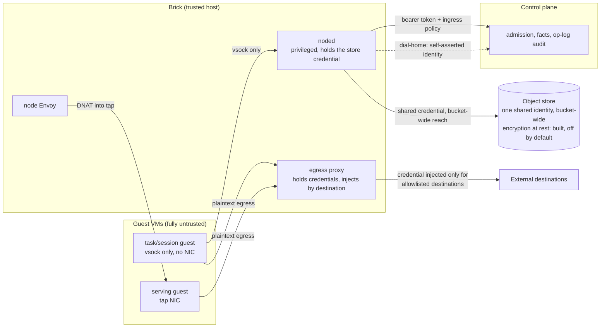

# EmberVM Threat Model

_@ 3592d6f61_

STPA-Sec evaluation of EmberVM's substrate: an adversary who deliberately
issues or suppresses control actions, forges feedback, or sits on a
channel. Companion to [STPA.md](STPA.md), which covers safety (unsafe
control actions and unsafe feedback from an honest but imperfect system).
This document covers security (the same control structure, attacked on
purpose). Controller and channel names match STPA.md's control structure
so the two documents cross-reference; hazard IDs referenced here (for
example `store-credential-unscoped`, `identity-hijack`) are defined there.

This document is honest about what is not mitigated. Findings reference
GitHub issue numbers, never secrets: no hostnames, bucket names,
1Password item paths, or node names appear below. See
[ARCHITECTURE.md](ARCHITECTURE.md) section 10 for the living conformance
mapping against the external threat-model frame this analysis draws on
(ADR [embervm/033](../../docs/decisions/embervm/033-substrate-threat-model-conformance-encryption-at-rest.md)),
and ADR [embervm/036](../../docs/decisions/embervm/036-platform-kek-custody-derived-control-plane.md)
for the key-custody decision behind several findings below.

## 1. Scope and trust boundaries

EmberVM's control structure crosses six boundaries where an untrusted or
lower-trust actor meets a component that holds more authority, capacity,
or credential reach than the actor should have. Every attack in section 4
crosses one of these.

| Boundary | What crosses it | Trust assumption |
| --- | --- | --- |
| Edge to serving guest | HTTP request, DNAT into the guest's tap NIC | The caller is fully untrusted. Public routes are scoped at their HTTPRoutes, node Envoy additionally constrains by authority match, and the guest shim's reserved prefix is unreachable from outside; three independent layers rather than one |
| Control plane to node daemon | gRPC lifecycle commands (BuildBase, Prime, Assign, Destroy, DeleteVolume, RestoreArtifact) | The control plane is trusted to issue only correct commands; noded is trusted to execute them faithfully. Both directions are authenticated: a bearer token gates every call and a CiliumNetworkPolicy restricts ingress to the control-plane pod's own selector |
| Node daemon to guest | vsock dispatch (task/session, no NIC) or tap NIC (serving) | noded is fully trusted: privileged, holds `/dev/kvm`. The guest is fully untrusted and has no network path to anything except what the brokered egress lane explicitly permits |
| Guest to object store | Nothing directly; a guest never addresses the store | noded is the sole store client. A guest that wants artifact bytes gets them only via noded's vsock or tap path, never a store credential |
| Operator to control plane | `kubectl` is read-only cluster-wide; Helm and ArgoCD GitOps is the only mutation path | The management API additionally authenticates callers via Kubernetes TokenReview against an allow-list |
| Tenant to tenant | No direct channel exists | Isolation is enforced by invariant (no mutable VM or snapshot lineage ever crosses a principal), not by network segmentation between tenants sharing the same brick pool and object store |

The last row is the one this document returns to most: several findings
below are cases where the invariant is enforced by code discipline and a
shared credential, not by a boundary a network attacker or a compromised
component cannot cross by construction.

The picture matches STPA.md's physical view. Two edges carry this
document's largest findings: noded's reach into the object store is one
credential shared fleet-wide rather than scoped per principal (finding
1, section 5), and the dashed dial-home edge is accepted from whoever
holds the shared brick ServiceAccount with no binding to which physical
brick is actually speaking (finding 2, section 5).

## 2. Adversaries

**Untrusted code inside a guest.** A prompt-injected agent, a malicious
task payload, or attacker-controlled content rendered by a browser-driven
workload. Capability: full code execution inside its own Firecracker VM,
whatever network reachability its workload class and the brokered egress
configuration grant. Goal: exfiltrate a credential the egress broker
holds, pivot toward another tenant's data or the host, or shape a
credentialed request to do something its issuer did not intend.

**An authenticated but malicious tenant principal.** A legitimate,
TokenReview-authenticated caller abusing its own admission rights, or
attempting to reach past its principal boundary through the API rather
than through a guest. Capability: submit workloads, invoke sessions,
consume its own admitted quota and concurrency. Goal: read or write
another principal's artifacts, exhaust shared capacity, or escalate
beyond its principal without ever compromising a component.

**A compromised node daemon or brick.** An attacker with code execution
on a brick pod, whether through a noded vulnerability or a stolen bound
ServiceAccount token. Capability: everything noded itself can do,
privileged host access, the shared store credential, the bearer token,
the ability to dial home. Goal: read or write any principal's artifacts
reachable via the shared credential, impersonate another brick to the
control plane, or exercise node-local authority for longer than intended.

**An attacker on the cluster network.** Someone who has landed a pod or
gained network position elsewhere in the cluster, without a brick's
identity or a tenant's credentials. Capability: bounded by whatever the
CiliumNetworkPolicy and the mesh permit from that vantage. Goal: reach
the noded gRPC surface, the object-store gateway, or the control-plane
API without holding a legitimate identity for either.

**An attacker with object-store read access.** Holds or has stolen the
shared store credential, or has otherwise gained read access to a bucket,
for example through an operator mistake outside EmberVM's own controls.
Capability: read, and because the credential is bucket-wide, also write
and delete, any artifact in either bucket. Goal: read another principal's
memory snapshot (the full process state of that workload) or substitute
a snapshot that gets trusted on restore.

## 3. Assets

| Asset | Wanted by |
| --- | --- |
| Other tenants' snapshots and workspaces (memory snapshots, session workspaces, stateful volume archives) | The object-store adversary directly; the compromised-brick adversary via the credential it already holds |
| Egress credentials (model-provider and git tokens held only by the brokered sidecar) | The guest adversary, who cannot reach them directly but can try to shape what an already-injected credential is attached to |
| Placement capacity (quota, concurrency slots, brick capacity) | The malicious-tenant adversary, whose goal is consuming more than its principal was admitted for |
| The host (a brick's privileged process, `/dev/kvm`, the ability to run arbitrary Firecracker guests) | The guest adversary, as an escalation target; not analyzed here (see section 6) |

## 4. Attack analysis

One table per adversary. Status values: **enforced prod** (the control is
armed in the reference production deployment), **enforced dev** (armed in
dev only), **shipped off** (the code exists, disabled by default in every
environment), **designed** (an ADR decides it, no code yet), **none** (no
control exists).

### Untrusted code inside a guest

| Control action / feedback attacked | How | Consequence | Current control | Status | Reference |
| --- | --- | --- | --- | --- | --- |
| `egress-proxy.inject_credential` | Issue: shape a request to an allowlisted destination however the guest chooses; the proxy injects the real credential regardless of what the request asks the destination to do | A prompt-injected guest gets a real credential attached to a request it authored, not one the operator intended | `egressTo` bounds which destination a credential can reach, not what the request does once there | shipped, enforced prod | STPA `host-keyed-credential-overreach`, `egress-proxy.inject_credential.providing` |
| `shotter-chromium.fetch_subresource` / `shotter-proxy.forward_allowed` | Issue: content-driven fetch tries to reach an unmapped or internal host from inside a rendered page | Pivot from browsed content into the cluster or an unintended destination | Every request, including redirects and subresources, is checked against the resolved destination by the same allowlist call; no direct-network fallback exists | enforced prod | STPA "Not UCAs": redirect/subresource escape examined and closed |
| Internal egress reachability (indirect, via the shared sidecar) | Issue: a guest on one egress-enabled workload benefits from a destination that was added to the allowlist for a different workload | The allowlist is global to the sidecar, so widening it for one workload widens it for every other egress-enabled workload today and in the future | None; the allowlist has no per-workload scope | shipped, no isolation control | STPA `shared-egress-allowlist-widening` |
| Restore of another principal's warmth via a guest-submitted request | Issue: none available; a guest has no store credential and cannot address the store or call `RestoreArtifact` directly | n/a, this path does not exist for this adversary | noded is the sole store client; guests hold no cluster credential by construction | enforced prod | ARCHITECTURE.md section 9, "Guest identity" |

### An authenticated but malicious tenant principal

| Control action / feedback attacked | How | Consequence | Current control | Status | Reference |
| --- | --- | --- | --- | --- | --- |
| `api.admit_task` | Issue: submit a workload that references another principal's artifact ref or lineage | If accepted, cross-principal read of another tenant's state | No mutable VM or snapshot lineage ever crosses a principal (invariant 3); a principal-scoped keyspace for the shared prefix remains planned, not implemented | built (invariant) / designed (keyspace) | ADR embervm/027 open question 3, ARCHITECTURE.md section 8 |
| `dispatcher.quota_gate` | Suppress: run up spend with no per-principal budget configured | Unbounded spend for a principal the operator never set a budget for; metering is counting, not enforcement, by design | Fails closed only once a budget is set; the reference deployment ships with none set. Cutting off a principal is an admission action (stop minting tokens, 402 at the edge), not a metering one | designed / none enforced by default | STPA "Not UCAs": "no per-principal daily budget configured" is a deliberate accepted state, not a bug |
| `noded.artifact_verb` (indirect) | Issue: a submitted workload's artifact reference targets a lineage the principal does not own | Storage-ACL authorization is per-identity, not per-tuple; a malicious principal cannot supply the shared store credential itself, but the gap this depends on is the same one that lets a credential holder ignore lineage ownership | Requires also compromising a brick or the store credential; see the compromised-brick and object-store adversaries | shipped off (the tuple-authorized fix, #4691) | STPA `store-credential-unscoped` |

### A compromised node daemon or brick

| Control action / feedback attacked | How | Consequence | Current control | Status | Reference |
| --- | --- | --- | --- | --- | --- |
| Dial-home registration | Forge: re-register an existing `(node, pod_uid)` at an address the attacker controls, using the shared ServiceAccount every brick already holds | The control plane adopts the impostor as the authoritative source for that brick's reported instance state (invariant 5) | None; re-registration is accepted unconditionally and expires the prior instance. The bound token's claims match only `(node, pod_uid)`, which the compromised ServiceAccount already satisfies | none | STPA `identity-hijack`, `dial-home.unauthorized-source`, #4707 |
| `noded.artifact_verb` | Issue: write, evict, or substitute another principal's artifact | Since the store credential is bucket-wide and shared by every brick and the control plane, a compromised brick already holds valid signing keys for every principal's artifacts, not only its own | The gateway enforces per-identity SigV4 authentication, which stops an unsigned caller but not a caller signing with the fleet-shared identity | shipped (auth) / shipped off (per-tuple scoping, #4691) | STPA `store-credential-unscoped` |
| `noded.refuse_if_silenced` | Delay: keep the dial-home or WatchNode channel alive (or fake liveness on it) to avoid tripping the silence gate | Node-local authority (activator wake, blessing-lease self-advance) continues past the intended six-hour bound | The gate is keyed off noded's own record of last live contact; a brick that can still speak on either channel is, by the gate's own definition, not silenced, so a compromised brick that keeps faking contact is not caught by this control | enforced prod (ADR embervm/037) for a genuinely partitioned brick; does not defend against a brick that fakes liveness | ADR embervm/037 |
| Restore integrity | Issue: a compromised brick writes a substituted snapshot for a lineage it does not anchor | Vendor-mismatch stamps and base keys catch an accidental wrong-vendor or stale-digest restore, not a deliberate write by a credential holder; digest-verified manifests remain planned | Content digest verification described in ADR embervm/033 decision 3 is not yet built | designed | ADR embervm/033 decision 3 |

### An attacker on the cluster network

| Control action / feedback attacked | How | Consequence | Current control | Status | Reference |
| --- | --- | --- | --- | --- | --- |
| `control-plane.grpc_command` | Issue: call noded's gRPC surface (BuildBase, Assign, Destroy, RestoreArtifact) directly from anywhere on the pod network | Full lifecycle control over a brick's guests without any legitimate identity | Bearer-token authentication on every unary and streaming call, plus a CiliumNetworkPolicy restricting ingress to the control-plane pod's own selector labels | enforced prod (#4693) | STPA "Not UCAs": formerly hazard `open-node-control-channel`, closed |
| `noded.artifact_verb` via the object-store gateway | Issue: address the store gateway anonymously | Unrestricted read/write against the buckets | SigV4 authentication is required; the gateway rejects unsigned requests | enforced prod (#4708) | STPA "Not UCAs": formerly hazard `anonymous-store-access`, closed |
| `api.admit_task` | Issue: call the HTTP API without a legitimate identity | Unauthorized admission | TokenReview-authenticated caller identity | enforced prod | ARCHITECTURE.md section 9 |

### An attacker with object-store read access

| Control action / feedback attacked | How | Consequence | Current control | Status | Reference |
| --- | --- | --- | --- | --- | --- |
| `s3-store` → `noded` fetched artifact bytes | Unauthorized-source: bytes restored were written by whoever held the shared credential, not necessarily the lineage's legitimate owner | Silent-incorrectness: a caller receives a restored state that may not be theirs, with no signal | SigV4 stops fully anonymous access; it does not scope the credential itself, which is one identity with bucket-wide read, write, list, and tag reach over both buckets | enforced (auth) / none (scoping) | STPA `store-credential-unscoped`, `warmth-fetch.unauthorized-source` |
| Confidentiality of memory snapshots at rest | Read: a memory snapshot is the full process state of a principal's workload; anyone who can read the bucket can read it in plaintext | Direct disclosure of another tenant's data, credentials the workload was handling, and execution history | Per-principal envelope encryption (unique data key per artifact, wrapped by a principal-scoped KEK derived per ADR embervm/036) is built. Every enforcement flag (the KEK root, the control-plane encryption gate, the node writer, the restore-capability check) defaults false and is off in every environment today, including dev | shipped off, everywhere | ADR embervm/033, ADR embervm/036, #4691 |
| Restore authorization | Issue: restore any artifact the credential can reach, regardless of which principal, lineage, brick, workload, generation, or lease it belongs to | A storage-ACL pass is treated as sufficient authorization | The tuple-authorized capability decided in ADR embervm/033 decision 3 (`principal, lineage, brick, workload, generation, lease`) exists as a design, not as an armed check | shipped off | ADR embervm/033 decision 3, #4691 |

## 5. Unmitigated and partially mitigated findings

Ranked by blast radius.

1. **The store credential is bucket-wide, not scoped per principal.**
   Any actor holding it, a compromised brick, an insider with bucket
   access, or a leaked credential, can read, write, or delete any
   principal's memory snapshot, session bundle, or stateful volume
   archive across both buckets. The built fix, per-principal envelope
   encryption plus tuple-authorized restore, ships with every
   enforcement flag off by default in production and in dev. Tracked in
   #4691.
2. **Dial-home brick identity is self-asserted.** Any actor holding the
   ServiceAccount shared by the whole fleet can re-register an existing
   brick's identity at an address it controls, and the control plane
   accepts the re-registration unconditionally, treating the impostor as
   authoritative for that brick going forward. Tracked in #4707.
3. **Host-keyed egress credential injection authorizes by destination
   only.** The proxy attaches a real credential to any request whose
   destination host is allowlisted, regardless of what the request
   actually asks that host to do, so a prompt-injected guest can shape
   the call a credential rides on. The decided direction (request-scoped
   tool mediation for at least the git credential class) is drafted in
   ADR agents/055 and not yet the default for every credential.
4. **The internal egress allowlist is global to the shared sidecar, not
   scoped per workload.** Every entry added for one workload's benefit
   becomes reachable by every other egress-enabled workload. Recorded as
   an accepted, shrinking-but-not-zero cost in ADR embervm/035, still
   open.
5. **Restored artifacts are not integrity-checked against deliberate
   substitution.** The stamps that exist today (CPU-vendor keying, base
   digest checks) catch accidents, not a write by whoever holds the
   shared credential from finding 1. Digest-verified manifests are
   described in ADR embervm/033 decision 3 and not yet built.
6. **Quota is opt-in.** The reference deployment ships with no
   per-principal budget configured, so a malicious or runaway principal's
   spend is bounded by admission caps and concurrency, never by cost,
   until an operator sets one. This is a deliberate design choice
   (metering fails open by design, invariant 4), not an oversight, but it
   is a residual an operator must actively close per principal.

## 6. What this model does not cover

- **Kernel and hypervisor escape from Firecracker.** This document
  assumes the Firecracker boundary itself holds; Firecracker's own
  security model is out of scope here.
- **Supply chain of guest images.** Base image build pipeline, package
  provenance, and dependency compromise are not analyzed in this
  document.
- **The cluster layers below EmberVM.** The ingress tunnel, CNI policy
  enforcement, admission control, and the secret operator are the
  cluster's baseline; [docs/security.md](../../docs/security.md) owns
  them.
- **Kubernetes control-plane compromise.** This analysis assumes
  Kubernetes RBAC and admission hold; an attacker who already controls
  `kube-apiserver` or `etcd` is outside every boundary in section 1.
- **Cluster-wide capacity exhaustion.** Denial-of-service via resource
  pressure outside the modeled admission and quota gates is not analyzed
  here.

## 7. Maintenance

Regenerate this document by hand when a control in section 4 changes
status, the same trigger STPA.md uses for its own refresh. Stamp the
commit as a line under the H1 (`@ <short sha>`), never inside the H1
itself, since the docs site strips it from page titles.
