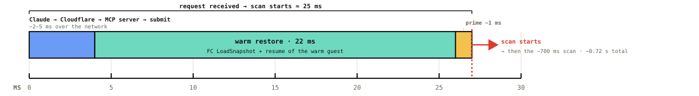
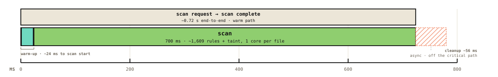
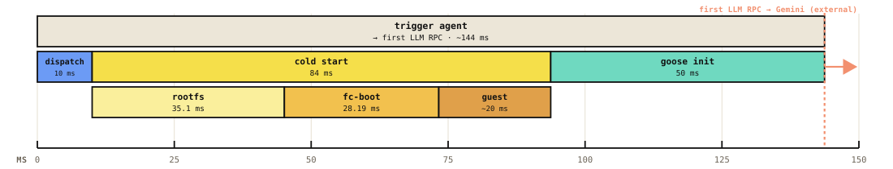
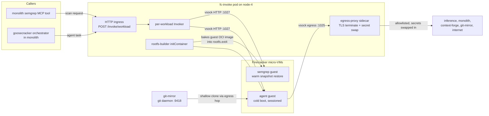

# Firecracker Agent Substrate

Everything under this directory runs untrusted or latency-critical workloads inside
[Firecracker](https://firecracker-microvm.github.io/) micro-VMs on node-4, managed
directly (FC-direct, no Kubernetes runtime class) by a single daemon: **fc-invoke**.

The pitch: every request gets a fresh micro-VM with a read-only rootfs, a vsock-only
network boundary, and no real secrets inside the guest. Snapshot restore makes this
cheap enough for synchronous calls: see [Performance](#performance) for the numbers.

**Status: frozen.** [EmberVM](../embervm/)'s node daemon began as a fork of
this substrate, and all new work lands there. Semgrep scan traffic has already
cut over to EmberVM (DECISIONS.md Task 16). The goose agent is the last
fc-invoke consumer; when it migrates onto EmberVM's session class this
substrate is retired. The daemon still runs in production and the latency
numbers below were measured on it.

## Performance

Two headline paths, measured on node-4. Both keep Kubernetes out of the per-request
hot path (no apiserver, no scheduler, no CRD reconcile): a caller's HTTP request lands
directly on the long-lived fc-invoke daemon, which restores or boots a micro-VM itself.

**Semgrep (warm, snapshot-restore).** From a request hitting the daemon to the guest
actively scanning is **~25 ms** (a few ms of network plus a ~22 ms in-memory snapshot
restore), with no apiserver, scheduler, or reconcile loop in the path:

The full synchronous call is ~0.72 s, but that tail is almost entirely the scan
itself (~1,609 rules plus taint); the substrate's whole contribution is the ~25 ms
above, and the restore replaces a ~6.7 s cold boot on every call:

**Goose agent (cold, fresh-brain).** A fresh VM per run is the point, so there is no
snapshot to restore; even so it is **~144 ms** from trigger to the agent's first LLM
call, of which the Firecracker cold start (CoW rootfs + boot + guest init) is 84 ms:

Deeper breakdowns live with each guest: the semgrep
[why-snapshot](semgrep/README.md#latency) chart (warm restore vs the ~6.7 s cold-boot
fallback vs the ~14.3 s base build), and the goose
[cold-start breakdown](goosecracker/README.md#latency). Raw Firecracker restore is
~28 ms cold / 6 ms warm (ADR 022); the numbers above are end-to-end from the caller.

## Layout

| Directory                        | What it is                                                                                                                                |
| -------------------------------- | ----------------------------------------------------------------------------------------------------------------------------------------- |
| [`substrate/`](substrate/)       | The fc-invoke daemon: HTTP ingress, Firecracker driver, vsock transport, egress-proxy sidecar, Helm chart. Workload-agnostic.             |
| [`semgrep/`](semgrep/)           | Semgrep scanner guest: snapshot-warm micro-VM with a resident `semgrep lsp` and all rules baked in. Serves the synchronous MCP scan tool. |
| [`goosecracker/`](goosecracker/) | Goose agent guest: cold-boot, session-resumable coding agent with recipe routing, driven from Discord via the monolith.                   |
| [`git-mirror/`](git-mirror/)     | Hot in-cluster git mirror so agent guests clone workspaces node-locally instead of hitting GitHub on every spin-up.                       |

## Architecture

Key properties, in one place:

- **Isolation.** Each invocation is a dedicated micro-VM booted from a read-only ext4
  rootfs; all mutable state lives in guest tmpfs. Guests have no NIC, only vsock.
- **Secrets never enter the guest.** Guests hold high-entropy placeholders
  (`kloak:...`). The egress-proxy sidecar terminates TLS outside the guest and swaps
  the placeholder for the real value only on that secret's allowlisted destinations
  (ADR 023).
- **Snapshot economics.** Workloads with `warmBase: true` pay init cost once (build a
  memory snapshot after the readiness probe) and restore it per request. Workloads
  where a fresh brain is the point (the agent) cold-boot instead.
- **GitOps like everything else.** Guest images are apko-built, dual-arch, and
  Bazel-pinned into the substrate chart; ArgoCD deploys the chart; the rootfs-builder
  initContainer bakes the images into ext4 on node-4's NVMe at pod startup.

## Hazard analysis

The STPA safety model for this substrate (secret exposure, cluster pivot,
cross-invocation contamination, false-clean scan results) is in
[STPA.md](STPA.md), with evidence lines cited into the code.

## Design history (ADRs)

The decision trail lives in `docs/decisions/agents/` (plus one platform ADR):

| ADR                                                                                                  | Decision                                                                                                            |
| ---------------------------------------------------------------------------------------------------- | ------------------------------------------------------------------------------------------------------------------- |
| [022](../../docs/decisions/agents/022-firecracker-snapshot-restore-controller.md)                    | FC-direct snapshot/restore controller; drop Argo Workflows from the hot path. Measured restore ~28 ms.              |
| [023](../../docs/decisions/agents/023-egress-secret-proxy.md)                                        | Egress secret proxy: placeholder substitution, split-horizon policy (external allow, internal deny-by-default).     |
| [024](../../docs/decisions/agents/024-discord-agent-hosted-model-tiers-and-artifacts.md)             | Discord agent, hosted-model tiers as credential trust boundaries, isolated live artifacts.                          |
| [025](../../docs/decisions/agents/025-three-layer-agent-stack-goosecracker.md)                       | Three-layer stack (substrate / goosecracker / consumers). Layout superseded by ADR 030.                             |
| [026](../../docs/decisions/agents/026-fast-microvm-starts-and-stateful-artifact-iteration.md)        | Fast cold starts (devmapper copy-on-write rootfs provisioning) and stateful artifact iteration.                     |
| [041](../../docs/decisions/agents/041-hot-git-mirror-agent-workspaces.md)                            | Hot git mirror for agent workspaces; scratch-ref recording under `refs/agents/**`.                                  |
| [028](../../docs/decisions/agents/028-elastic-agent-microvm-capacity-and-reclaim.md)                 | Elastic capacity and state-preserving reclaim ladder for agent micro-VMs.                                           |
| [030](../../docs/decisions/agents/030-fc-invoke-configurable-firecracker-surface.md)                 | fc-invoke: one daemon, workloads as Helm values, warm base vs state hydration split. Defines this directory layout. |
| [031](../../docs/decisions/agents/031-cluster-node-control-data-plane-split.md)                      | Control-plane (`cluster/`) vs data-plane (`node/`) package split behind the `substrate.NodeExecutor` seam.          |
| [platform/010](../../docs/decisions/platform/010-memory-oversubscription-burstable-priorityclass.md) | Memory oversubscription on node-4; micro-VMs run in the disposable OOM-victim tier.                                 |
