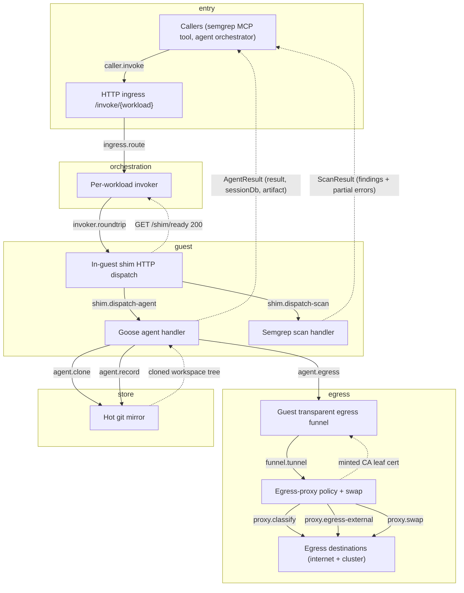
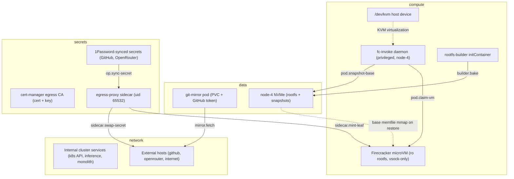

# STPA Control Analysis: firecracker @ 2c0401ea7

_Auto-generated STPA safety model: the unsafe states this system can reach and the control actions that get it there. Two views: logical (functional control flow) and physical (deployment)._

<b>How to read this</b>: STPA primer and diagram legend

**STPA** (System-Theoretic Process Analysis) treats the system as *controllers* issuing *control actions* to *controlled processes*, with *feedback* flowing back up. Instead of "what component can fail," it asks "what control action, given or withheld at the wrong time, drives the system into an unsafe state?" "Unsafe" means a violation of this system's reason to exist, not merely a crash.

Read top-down: **Losses** are outcomes we must never cause; **Hazards** are system states that lead to a loss; the **control-structure diagrams** (one per view) show who commands whom (solid arrows = control actions, dashed = feedback, a node tagged `(designed)` is in the architecture but **not yet built**); the **Unsafe Control Actions** table is the core, and **Unsafe Feedback** covers the dashed arrows: data channels whose absence, staleness, corruption, or spoofing drives a controller into a hazard. Every claim cites `path:line`; unbuilt elements are marked. Semantic, stable IDs mean regenerating changes only the findings that changed.

**Scope.** fc-invoke runs untrusted or latency-critical workloads in single-use Firecracker microVMs on node-4, isolated behind a read-only rootfs, a vsock-only boundary, and a secret-holding egress-proxy sidecar; the unsafe states are secret exposure, cluster pivot, cross-invocation contamination, and false-clean results, not mere crashes.

Maturity detail

- **Built:** fc-invoke daemon (single privileged pod, node-4): HTTP ingress, per-workload invoker (warm-base restore + cold-boot fallback), FC-direct driver + vsock transport, raw egress tunnel, egress-proxy sidecar (split-horizon classify + secret placeholder-swap), semgrep warm-snapshot guest, goosecracker cold sessioned agent guest, hot git-mirror
- **Designed-only:** physical control-plane/data-plane split (ADR 031: packages split, one pod today), elastic capacity + state-preserving reclaim ladder (ADR 028), DB-backed git-mirror repo registry
- **Note:** Ingress has no caller authentication in code, and the chart ships no NetworkPolicy or Linkerd AuthorizationPolicy, so who may reach the fc-invoke Service is unconfirmed.

## Control structure

### Logical view

### Physical view

## Losses

| ID | Loss |
|----|------|
| `L.integrity-loss` | State from one invocation or session contaminates another (session db, workspace, snapshot) |
| `L.liveness-loss` | The substrate cannot serve synchronous invocations (daemon down, slots exhausted, base build wedged) |
| `L.provenance-loss` | Agent scratch work masquerades as a real upstream branch, or the audit trail is corrupted or spoofed |
| `L.secret-exposure` | A real credential (GitHub token, OpenRouter key) or cloned private source reaches an untrusted guest or an unintended destination |
| `L.silent-incorrectness` | A scan or agent run returns a wrong or empty result that a caller trusts as authoritative |
| `L.unauthorized-access` | A guest or unauthenticated caller reaches an internal cluster service or capability it should not |

## Hazards

| ID | View | Hazard (unsafe state) | → Losses | Maturity |
|----|----|----|----|----|
| `ca-key-exposure` | physical | The sidecar CA is trusted by the guest for all hosts, so a CA-key leak lets any guest TLS be MITM'd | L.secret-exposure | built |
| `cross-invocation-state` | logical | State from one session or invocation contaminates another via a mis-keyed externalized session db or reused bundle | L.integrity-loss | built |
| `empty-workspace-run` | logical | A swallowed clone failure runs the agent on an empty tree, producing confident output made without the source | L.silent-incorrectness | built |
| `false-clean-scan` | logical | A scan returns empty or partial findings at HTTP 200 that a caller reads as a clean result | L.silent-incorrectness | built |
| `internal-egress-classification-gap` | logical | A cluster-reachable destination not on a private/loopback/link-local range is classified external and permitted | L.unauthorized-access | built |
| `privileged-daemon-blastradius` | physical | The fc-invoke container runs privileged with /dev/kvm and host paths, so a daemon compromise is a node compromise | L.unauthorized-access | built |
| `scratch-ref-masquerade` | logical | An agent push overwrites an upstream ref or another session's audit ref | L.provenance-loss | built |
| `secret-reflected-to-guest` | logical | The real secret is injected into a request to an egressTo host that the agent can shape to reflect or redirect it back | L.secret-exposure | built |
| `slot-exhaustion` | logical | Leaked microVMs and concurrency slots when a caller never closes the response body | L.liveness-loss | built |
| `unauthenticated-invoke` | logical | Any in-cluster client reaching the Service invokes a workload and drives sidecar-swapped credential privileges | L.unauthorized-access, L.secret-exposure | built |
| `workspace-exfil` | logical | External allow-by-default lets a compromised agent send the cloned (possibly private) workspace to an arbitrary internet host | L.secret-exposure | built |

## Control actions

| ID | View | Control action | Controller → Process | Maturity | Evidence |
|----|----|----|----|----|----|
| `agent.clone` | logical | Clone workspace from mirror | `agent-handler` → `git-mirror` | built | projects/firecracker/goosecracker/guest-init/internal/handler/handler.go:141 |
| `agent.egress` | logical | Outbound goose/tool calls captured by funnel | `agent-handler` → `egress-funnel` | built | projects/firecracker/goosecracker/guest-init/cmd/main.go:297 |
| `agent.record` | logical | Push scratch ref refs/agents/{session} | `agent-handler` → `git-mirror` | built | projects/firecracker/substrate/shim/capabilities/git.go:126 |
| `builder.bake` | physical | Crane-pull guest image, bake ext4 rootfs | `rootfs-builder` → `nvme` | built | projects/firecracker/substrate/chart/templates/deployment.yaml:68 |
| `caller.invoke` | logical | POST /invoke/{workload}[/{session}] | `caller` → `ingress` | built | projects/firecracker/substrate/cluster/ingress/server.go:69 |
| `funnel.tunnel` | logical | Tunnel guest TCP over vsock with host:port preamble | `egress-funnel` → `egress-proxy` | built | projects/firecracker/goosecracker/guest-init/cmd/main.go:553 |
| `ingress.route` | logical | Route to workload executor, 8 MiB body cap | `ingress` → `invoker` | built | projects/firecracker/substrate/cluster/ingress/server.go:103 |
| `invoker.roundtrip` | logical | Reverse-proxy POST /invoke over vsock | `invoker` → `guest-shim` | built | projects/firecracker/substrate/node/invoker/invoker.go:357 |
| `mirror.fetch` | physical | Fetch heads + tags every 60s | `git-mirror-pod` → `upstream-ext` | built | projects/firecracker/git-mirror/chart/templates/configmap.yaml:161 |
| `op.sync-secret` | physical | Deliver real secret value to sidecar env | `op-secrets` → `egress-sidecar` | built | projects/firecracker/substrate/deploy/values.yaml:74 |
| `pod.claim-vm` | physical | Boot or restore single-use microVM | `fc-invoke-pod` → `microvm` | built | projects/firecracker/substrate/node/fcvm/driver/driver.go:289 |
| `pod.snapshot-base` | physical | Pause/snapshot/resume warm base to disk | `fc-invoke-pod` → `nvme` | built | projects/firecracker/substrate/node/fcvm/driver/driver.go:435 |
| `proxy.classify` | logical | Resolve + classify + pin IP, allow/deny | `egress-proxy` → `upstream` | built | projects/firecracker/substrate/egress-proxy/cmd/classify.go:22 |
| `proxy.egress-external` | logical | Allow public destinations by default | `egress-proxy` → `upstream` | built | projects/firecracker/substrate/egress-proxy/cmd/classify.go:38 |
| `proxy.swap` | logical | TLS-terminate + swap placeholder for real secret | `egress-proxy` → `upstream` | built | projects/firecracker/substrate/egress-proxy/cmd/swap.go:185 |
| `shim.dispatch-agent` | logical | Dispatch to agent handler | `guest-shim` → `agent-handler` | built | projects/firecracker/substrate/shim/server.go:106 |
| `shim.dispatch-scan` | logical | Dispatch to scan handler | `guest-shim` → `semgrep-handler` | built | projects/firecracker/substrate/shim/server.go:106 |
| `sidecar.mint-leaf` | physical | Mint CA leaf for guest SNI | `egress-sidecar` → `microvm` | built | projects/firecracker/substrate/egress-proxy/cmd/swap.go:129 |
| `sidecar.swap-secret` | physical | Inject real secret, re-originate TLS | `egress-sidecar` → `upstream-ext` | built | projects/firecracker/substrate/egress-proxy/cmd/swap.go:185 |

## Unsafe control actions

*The core of the analysis. Each row: a control action made unsafe via one guideword, the hazard/loss it causes, and where in the code it lives.*

| ID | View | Control action | Guideword | Unsafe condition | Severity | → Hazards | Evidence |
|----|----|----|----|----|----|----|----|
| `agent.clone.not-providing` | logical | `agent.clone` | not-providing | a mirror clone failure is swallowed and goose runs on an empty workspace, so results look valid but were produced without the source | medium | empty-workspace-run | projects/firecracker/goosecracker/guest-init/internal/handler/handler.go:141 |
| `ingress.route.providing` | logical | `ingress.route` | providing | the handler performs no caller authentication, so any client that can reach the Service invokes any workload and drives swapped GitHub/OpenRouter privileges | high | unauthenticated-invoke | projects/firecracker/substrate/cluster/ingress/server.go:64 |
| `invoker.roundtrip.wrong-duration` | logical | `invoker.roundtrip` | wrong-duration | VM, slot, and forwarder teardown is transferred to the response body Close, so a caller that never closes the body pins them indefinitely and RequestTimeout does not force teardown | medium | slot-exhaustion | projects/firecracker/substrate/node/invoker/invoker.go:410 |
| `proxy.classify.providing` | logical | `proxy.classify` | providing | isInternal fences only RFC1918/ULA, loopback, link-local, and operator-configured extra CIDRs, so a cluster or metadata service reachable on any IP outside those ranges is classified external and allowed | high | internal-egress-classification-gap | projects/firecracker/substrate/egress-proxy/cmd/classify.go:50 |
| `proxy.egress-external.providing` | logical | `proxy.egress-external` | providing | external allow-by-default lets a prompt-injected agent exfiltrate the cloned private workspace to any internet host | high | workspace-exfil | projects/firecracker/substrate/deploy/values.yaml:46 |
| `proxy.swap.providing` | logical | `proxy.swap` | providing | the real secret is written into the headers, URL query, and URL path of any guest-shaped request to the egressTo host, so an open-redirect or reflecting endpoint there exfiltrates it | high | secret-reflected-to-guest | projects/firecracker/substrate/egress-proxy/cmd/swap.go:237 |

## Unsafe feedback

*Feedback and data channels whose absence, staleness, corruption, or spoofed origin drives a controller into a hazard. This is where data-integrity failures live.*

| ID | View | Channel | Guideword | Unsafe condition | Severity | → Hazards | Evidence |
|----|----|----|----|----|----|----|----|
| `scan-result.corrupted` | logical | `semgrep-handler` → `caller`: ScanResult findings + partial errors | corrupted | findings can be empty (cold LSP target cache) or partial (12s per-file timeout) yet returned at HTTP 200, so a caller ignoring ScanResult.Errors reads a false-clean | high | false-clean-scan | projects/firecracker/semgrep/guest-init/internal/handler/handler.go:37 |
| `session-db.corrupted` | logical | `caller` → `agent-handler`: base64 prior sessions.db in AgentRequest | corrupted | the guest resumes whatever sessions.db the request carries with no binding to the requester, so a mis-keyed db replays a different session's conversation | medium | cross-invocation-state | projects/firecracker/goosecracker/guest-init/internal/handler/handler.go:152 |

<b>Not UCAs</b>: 8 examined and rejected

- **base rebuild overwriting a live mmapped memfile**: SnapshotBase writes to temp paths and renames into place to avoid SIGBUS (driver.go:445)
- **crafted session id pushing to refs/heads**: rejected by the pre-receive hook (refs/agents/** only) plus sanitizeRefComponent (git.go:182)
- **hostile guest naming an internal host to reach it**: classification is on the resolved and pinned IP, not the guest-claimed name (classify.go:22)
- **missed /shim/ready during the post-restore vsock RX-queue race**: WaitReady retries per-attempt within the readiness budget (invoker.go:99)
- **rotated secret not yet resynced into the sidecar**: the stale token is swapped and GitHub auth fails closed, no silent bad state
- **undecodable or corrupt session db on resume**: handler falls back to a cold run with resume=false (handler.go:152)
- **warm restore reports /shim/ready from snapshot-time warmth**: a warm-path round-trip failure invalidates the base and falls back to cold boot (invoker.go:361)
- **workspace up to 60s stale versus GitHub**: bounded by the 60s mirror refresh (refreshIntervalSeconds, git-mirror/chart/values.yaml:40; fetch loop configmap.yaml:151)

## Open questions

- Does any consumer of the semgrep scan result inspect ScanResult.Errors, or is a partial scan silently treated as clean?
- Does egress classification cover every internal destination reachable from node-4 (host-network services, cloud metadata off 169.254, IPv6 global-unicast fronting cluster services)?
- Is external allow-by-default an accepted risk for the agent tier given it permits exfiltration of cloned private source, or should external egress be narrowed?
- Is there a Linkerd AuthorizationPolicy or NetworkPolicy gating which pods may reach the fc-invoke Service, or is /invoke reachable by any in-cluster client?
- The secret placeholder strings are duplicated between fc-invoke deploy values and the monolith tier config; what prevents drift that would silently disable the swap?

