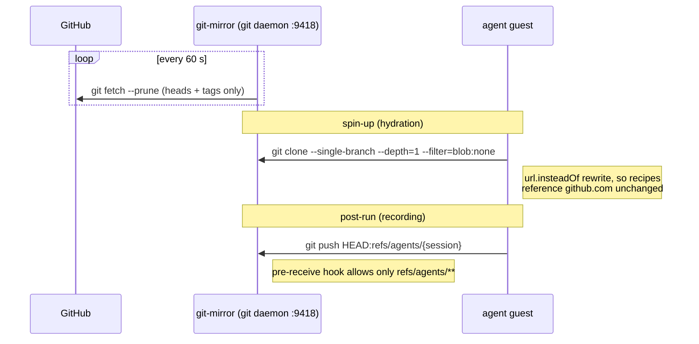

# git-mirror

A hot, in-cluster git mirror (ADR 041) pinned to node-4, so Firecracker agent
guests clone their workspace from a node-local source in well under a second
instead of cold-cloning GitHub on every spin-up. It also decouples agent spin-up
from GitHub availability and gives every run an audit trail via scratch refs.

## How guests use it

Three properties make this safe and fast:

- **Read-mostly.** The fetch refspec only mirrors `refs/heads/*` and `refs/tags/*`;
  a pre-receive hook rejects any push outside `refs/agents/**`, so upstream refs
  are read-only and agent scratch work can never masquerade as a real branch.
- **Shallow, partial clones.** `--depth=1 --filter=blob:none --single-branch` keeps
  guest hydration sub-second even for large repos.
- **No credentials in the path.** The daemon serves `git://` unauthenticated; guests
  reach it through the egress-proxy's node-local hop (internal allowlist entry, ADR
  023). The GitHub token for mirroring private repos lives only in this pod's
  ephemeral HOME, never on the PVC and never near a guest.

Scratch refs under `refs/agents/<session>` are the recording half: each agent run
pushes its working-tree state there, so any session can be audited or replayed
without touching upstream.

## Contents

| Path        | Purpose                                                                                                                                                                                   |
| ----------- | ----------------------------------------------------------------------------------------------------------------------------------------------------------------------------------------- |
| `apko.yaml` | Wolfi image: git plus `git-daemon` (not in the base git package), non-root uid 65532.                                                                                                     |
| `chart/`    | Deployment (single replica, Recreate, pinned to node-4), ClusterIP Service with `internalTrafficPolicy: Local`, 10Gi Longhorn PVC for the bare clones, and the `supervisor.sh` ConfigMap. |
| `deploy/`   | ArgoCD Application and cluster values.                                                                                                                                                    |

`supervisor.sh` does the actual work: bare-clones registered repos on first start,
configures the restricted fetch refspecs, installs the pre-receive hook, runs
`git daemon` on :9418, and loops `git fetch --prune` on the refresh interval.

## Configuration (`chart/values.yaml`)

| Value                    | Default              | Meaning                                                                                                                                                                                                                                 |
| ------------------------ | -------------------- | --------------------------------------------------------------------------------------------------------------------------------------------------------------------------------------------------------------------------------------- |
| `repos`                  | `owner/repo` list    | Static list of `{name, url}` to mirror. `name` follows the GitHub `owner/repo` convention (it is also the ACL scope + `/agent` label); a slash just nests the bare clone. A DB-backed registry is deferred until the static list hurts. |
| `refreshIntervalSeconds` | 60                   | Fetch loop cadence (freshness vs GitHub rate limits).                                                                                                                                                                                   |
| `gitDaemonPort`          | 9418                 | The `git://` listener.                                                                                                                                                                                                                  |
| `gcRetentionDays`        | 0 (off)              | Optional auto-expiry of old scratch refs.                                                                                                                                                                                               |
| `githubToken`            | 1Password secret ref | Mirror-side read access for private repos.                                                                                                                                                                                              |

Service address (also on the fc-invoke internal egress allowlist):
`git-mirror.monolith.svc.cluster.local:9418`. Liveness is delayed 120 s so the
initial clones can finish; the PVC means repos survive pod restarts without
re-cloning.
