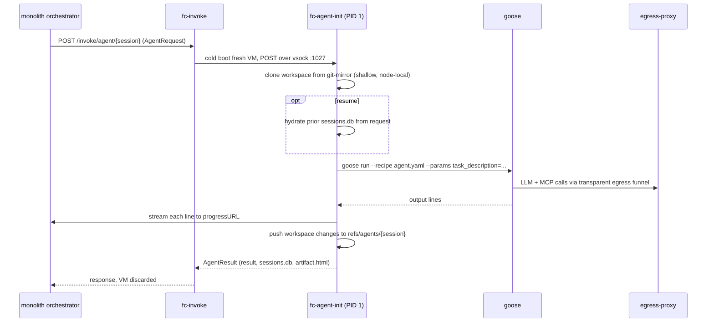
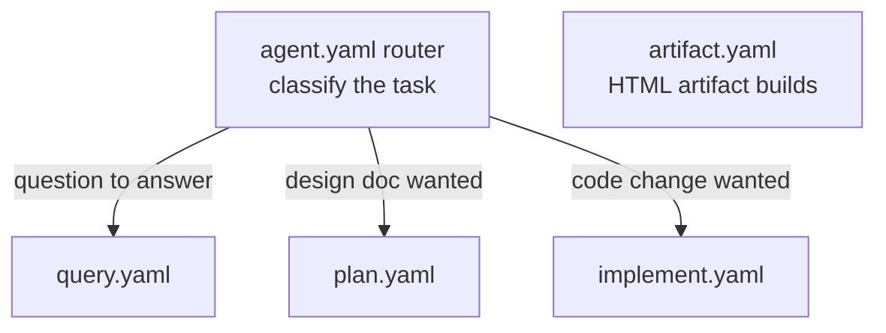

# goosecracker guest

A [goose](https://github.com/block/goose) coding agent that runs one task per
Firecracker micro-VM. Every request gets a fresh VM (cold boot is the point: no
state leaks between runs), a read-only rootfs, and vsock-only networking where a
TLS-terminating proxy swaps placeholder secrets outside the guest, so the guest
never holds a real credential.

This directory holds the guest image and its PID-1 harness. The host side is the
workload-agnostic [`substrate/`](../substrate/) daemon; the agent is the `agent`
entry in its `workloads:` values (`warmBase: false`, `sessioned: true`,
`egressEnabled: true`). The orchestrator (Discord thread handling, session
registry, retries) lives in the monolith per ADR 024/030.

## Latency

Cold boot is cheap enough to not need snapshots here: ~144 ms from trigger to the
agent's first LLM call, of which the Firecracker cold start (copy-on-write rootfs,
boot, guest init) is 84 ms:

## How a run works

Session resume without a warm VM: the goose `sessions.db` (WAL-checkpointed via
sqlite3, base64-encoded) rides back in the `AgentResult`, and the orchestrator
sends it with the next request for the same session. State is externalized; the VM
stays disposable.

## Recipe routing

The baked recipe library (`guest/recipes/`) uses a router model: the top-level
`agent.yaml` classifies the task and dispatches to a sub-recipe.

The model is not baked into the image: `GOOSE_PROVIDER` and `GOOSE_MODEL` arrive in
`AgentRequest.Env`, so the same guest serves in-cluster Qwen via `inference` or any
OpenRouter model, per the caller's per-thread tier (the tier is a credential trust
boundary, ADR 024). Recipe changes deploy by rebuilding the guest image and bumping
the substrate chart (automated via the chart-version `--keep_going` path).

## Egress funnel

The guest has no NIC. `fc-agent-init` builds a transparent funnel so unmodified
tools (goose, git, gh, curl) just work: a synthetic DNS resolver hands every name a
unique 127.0.0.0/8 address, outbound TCP to those addresses is intercepted, the
original destination is recovered, and each flow is tunneled over vsock :1025 to
the egress-proxy sidecar. The sidecar enforces policy (internal deny-by-default
with an allowlist: inference, monolith, context-forge, SigNoz, git-mirror) and
swaps `kloak:` placeholders for real secrets only on their allowlisted hosts. See
the [substrate README](../substrate/README.md#egress-guests-never-hold-real-secrets)
and ADR 023.

## Contents

| Path                           | Purpose                                                                                                                                                                      |
| ------------------------------ | ---------------------------------------------------------------------------------------------------------------------------------------------------------------------------- |
| `guest/apko.yaml`              | Wolfi rootfs: goose runtime deps plus a working toolbox (git, gh, go, node, pnpm, sqlite3). Runs as uid 65532. Entrypoint is the init.                                       |
| `guest/config.yaml`            | Baked goose config: developer extension scoped to `/workspace`, context-forge remote MCP gateway. No model entry.                                                            |
| `guest/recipes/`               | Recipe library baked to `/home/goose-agent/recipes/` (router + query/plan/implement + artifact).                                                                             |
| `guest/BUILD`                  | Cross-compiles the init, layers the goose binary (`@goose//:tar`), config, and recipes into the dual-arch apko image; pinned into the substrate chart as `agent.guestImage`. |
| `guest-init/cmd/`              | PID 1: tmpfs over `/tmp` and `/workspace`, loopback, egress funnel, then the vsock shim server. Cold-ready immediately.                                                      |
| `guest-init/internal/handler/` | Decodes `AgentRequest`, clones/hydrates, runs goose, streams progress, exports session db and artifact, records the scratch ref.                                             |
| `guest-init/internal/harness/` | Pure function building the goose argv (recipe vs bare-text, cold vs `--resume`).                                                                                             |
