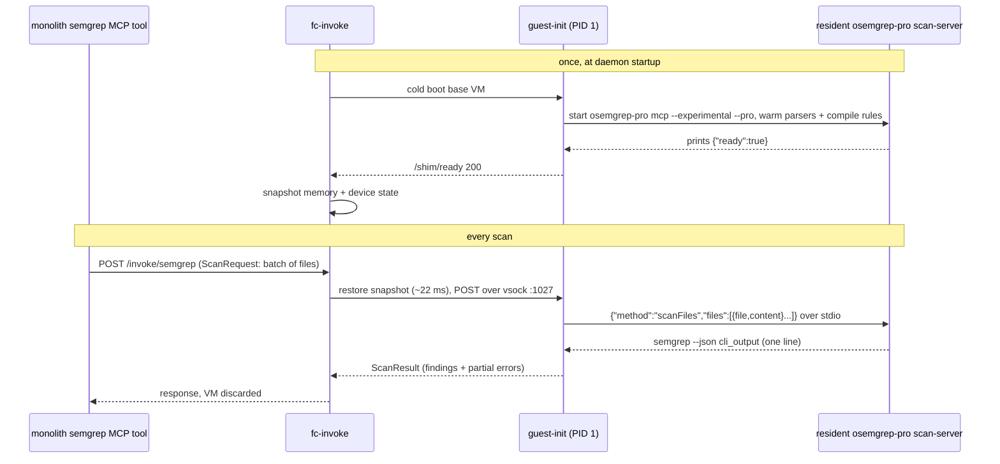

# semgrep guest

Sandboxed Semgrep execution for synchronous MCP calls, where latency is critical:
the caller is blocked on the scan result. Micro-VM snapshots pay for CLI startup
and rule compilation once, so every scan gets an in-memory restore in ~22 ms
instead of a multi-second cold start.

This directory holds the guest image and its PID-1 harness. The host side (VM
lifecycle, snapshots, vsock) is the workload-agnostic [`substrate/`](../substrate/)
daemon; semgrep is just a `workloads:` entry with `warmBase: true`.

## Latency

Request received to scan start is ~25 ms, dominated by the 22 ms snapshot restore:

The warm end-to-end path is ~0.72 s, and it is almost entirely the scan itself
(~1,609 rules plus taint analysis). VM cleanup happens off the critical path:

Why snapshot at all: the warm restore replaces a ~6.7 s cold boot (scan-server
startup, rule compilation, parser warmup) on every scan. The ~14.3 s base build
runs once at daemon startup, asynchronously. (Figures predate the scan-server
migration and are pending re-measurement.)

## How a scan works

The scan-server takes each file's content inline in the `scanFiles` request, so
there is no on-disk workspace and no git target discovery: the engine runs Pro
interprocedural taint analysis directly on the submitted sources. It replaced the
resident `semgrep lsp`, whose in-process OSS engine could not run Pro taint at all
(`semgrep lsp` ignores `SEMGREP_CORE_BIN`).

## Contents

| Path                             | Purpose                                                                                                                                                                                                                                            |
| -------------------------------- | -------------------------------------------------------------------------------------------------------------------------------------------------------------------------------------------------------------------------------------------------- |
| `guest/apko.yaml`                | Wolfi-based rootfs: runtime libs for the offline-Pro engine (osemgrep-pro + co-located semgrep-core). Entrypoint is the guest-init.                                                                                                                |
| `guest/BUILD`                    | Cross-compiles the init per arch, layers the offline-Pro engine (`//bazel/semgrep/guest:engine_tar`, amd64 only) and merged rules (`rules_tar`, baked to `/etc/semgrep/rules`), builds the apko image.                                             |
| `guest-init/cmd/`                | PID 1: mounts tmpfs for HOME, brings up loopback, writes the offline placeholder-token settings file, starts the warm scan-server (which self-warms and prints `{"ready":true}`), then serves the shim protocol on vsock :1027.                    |
| `guest-init/internal/scandriver/`| Newline-delimited-JSON-over-stdio client for the resident `osemgrep-pro mcp` scan-server: one `scanFiles` request -> one `semgrep --json` response, normalised to findings.                                                                        |
| `guest-init/internal/handler/`   | Decodes `vsockproto.ScanRequest`, runs the scan, returns `vsockproto.ScanResult` with partial-result semantics.                                                                                                                                    |

Offline mode is deliberate: no `SEMGREP_APP_TOKEN` is set, and a 3-field
placeholder-token settings file unlocks the Pro engine without any network call,
so the engine never phones home inside the no-network guest.

## Build and deploy

The guest image is apko-built (dual-arch) and Bazel-pinned into the substrate
chart (`substrate/chart/BUILD` pins `semgrep.guestImage` from this target's
`image.info`). At pod startup the rootfs-builder initContainer crane-pulls the
image and bakes it into `/disks/nvme-02/fc-invoke/semgrep/rootfs.ext4` on node-4.
Shipping a rules or engine change is therefore: merge, CI rebuilds the image, bump
the substrate chart.
