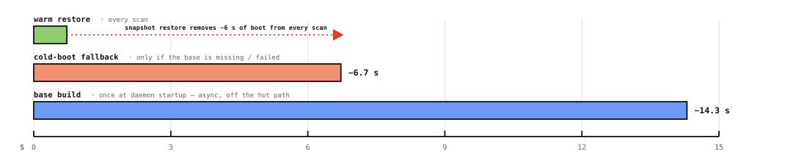
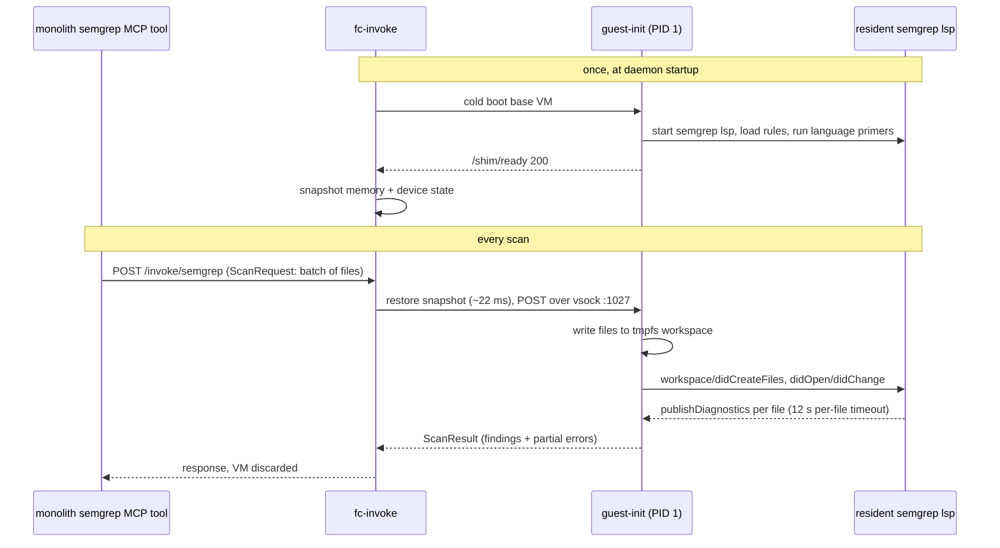

# semgrep guest

Sandboxed Semgrep execution for synchronous MCP calls, where latency is critical:
the caller is blocked on the scan result. Micro-VM snapshots pay for CLI startup
and rule compilation once, so every scan gets an in-memory restore in ~22 ms
instead of a multi-second cold start.

This directory holds the guest image and its PID-1 harness. The host side (VM
lifecycle, snapshots, vsock) is the workload-agnostic [`substrate/`](../substrate/)
daemon; semgrep is just a `workloads:` entry with `warmBase: true`.

## Latency

Request received to scan start is ~25 ms, dominated by the 22 ms snapshot restore:

The warm end-to-end path is ~0.72 s, and it is almost entirely the scan itself
(~1,609 rules plus taint analysis). VM cleanup happens off the critical path:

Why snapshot at all: the warm restore replaces a ~6.7 s cold boot (resident LSP
startup, rule compilation, language primers) on every scan. The ~14.3 s base build
runs once at daemon startup, asynchronously:

## How a scan works

The `didCreateFiles` notification before `didOpen` matters: it forces osemgrep to
recompute its target cache, without which the LSP reports zero findings for files
created after startup.

## Contents

| Path                             | Purpose                                                                                                                                                                                                                                            |
| -------------------------------- | -------------------------------------------------------------------------------------------------------------------------------------------------------------------------------------------------------------------------------------------------- |
| `guest/apko.yaml`                | Wolfi-based rootfs: pysemgrep CLI, OSS semgrep-core, runtime libs for the Pro engine. Entrypoint is the guest-init.                                                                                                                                |
| `guest/BUILD`                    | Cross-compiles the init per arch, layers the Pro engine (`//bazel/semgrep/guest:engine_tar`) and merged rules (`rules_tar`, baked to `/etc/semgrep/rules`), builds the dual-arch apko image.                                                       |
| `guest-init/cmd/`                | PID 1: mounts tmpfs for workspace and HOME, brings up loopback, forces offline mode (empty `SEMGREP_APP_TOKEN`, isolated settings file), starts the LSP, warms it with one primer file per language, then serves the shim protocol on vsock :1027. |
| `guest-init/internal/lspdriver/` | JSON-RPC-over-stdio client for the resident `semgrep lsp`: file writes, target-cache refresh, diagnostics collation.                                                                                                                               |
| `guest-init/internal/handler/`   | Decodes `vsockproto.ScanRequest`, runs the scan, returns `vsockproto.ScanResult` with partial-result semantics.                                                                                                                                    |

Offline mode is deliberate: a non-empty `SEMGREP_APP_TOKEN` makes the CLI phone
home and hang inside the no-network guest.

## Build and deploy

The guest image is apko-built (dual-arch) and Bazel-pinned into the substrate
chart (`substrate/chart/BUILD` pins `semgrep.guestImage` from this target's
`image.info`). At pod startup the rootfs-builder initContainer crane-pulls the
image and bakes it into `/disks/nvme-02/fc-invoke/semgrep/rootfs.ext4` on node-4.
Shipping a rules or engine change is therefore: merge, CI rebuilds the image, bump
the substrate chart.
