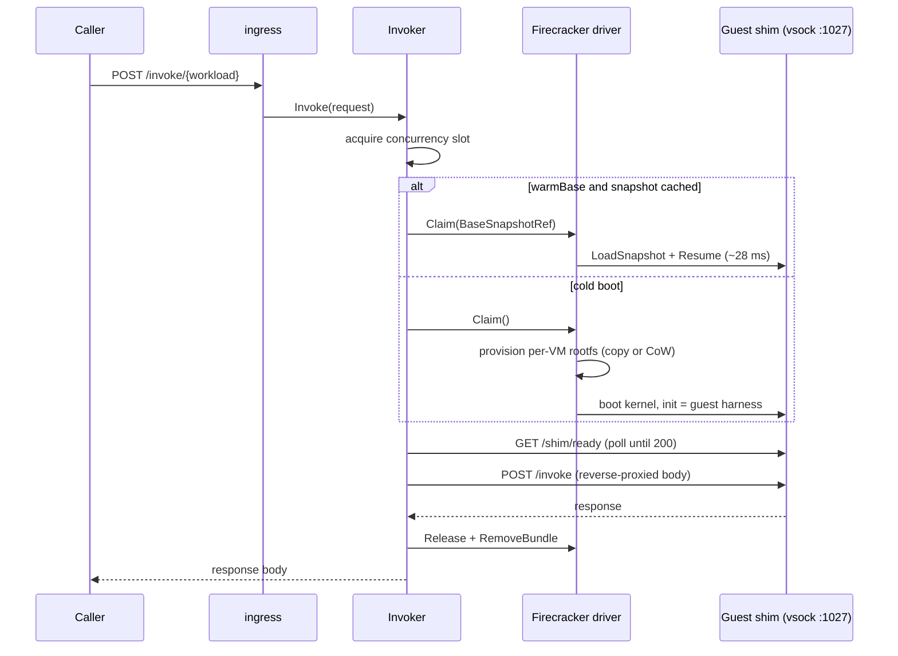
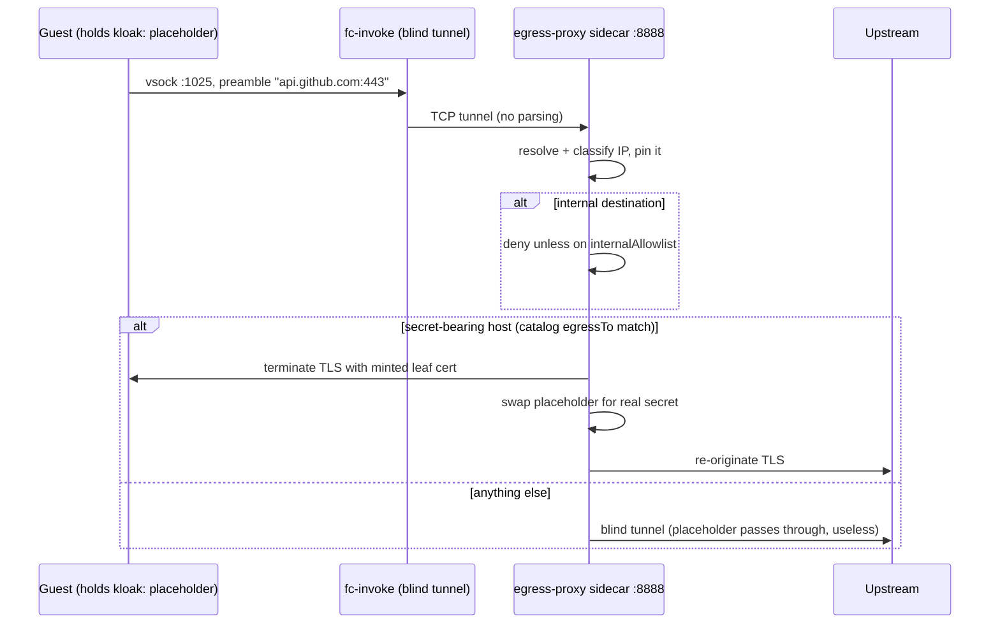

# substrate (fc-invoke)

The host-side daemon that runs configured workloads inside Firecracker micro-VMs
(ADR 030). Callers `POST /invoke/{workload}[/{session}]`; fc-invoke claims a
micro-VM (warm snapshot restore or cold boot), reverse-proxies the HTTP request to
the guest over vsock, streams the response back, and discards the VM. fc-invoke is
stateless: session registries and retries belong to the orchestrators that call it.

## Package layout

The Go code follows the control-plane / data-plane split from ADR 031. `cluster/`
and `node/` both depend on `substrate/`; neither depends on the other, so the
physical split (central agent + per-node DaemonSet) is a wiring change later.

| Package             | Role                                                                                                                                                                                               |
| ------------------- | -------------------------------------------------------------------------------------------------------------------------------------------------------------------------------------------------- |
| `substrate/`        | Neutral seam: `Substrate`, `Snapshotable`, `Handle`, `Workload`, and the `NodeExecutor` interface. Fakes for testing without Firecracker.                                                          |
| `cluster/ingress/`  | HTTP handler for `/invoke/{workload}[/{session}]` and `/healthz`. Routes to the workload's `NodeExecutor`; 8 MiB body cap; 503 on guest unavailability.                                            |
| `cluster/catalog/`  | Loads config from `FC_INVOKE_*` env vars and the JSON workload table (`FC_INVOKE_WORKLOADS[_FILE]`), applies defaults.                                                                             |
| `node/invoker/`     | Per-workload orchestration: concurrency semaphore, warm-base build and cache, restore-vs-cold-boot with fallback, readiness budget (2 s restore, 60 s cold).                                       |
| `node/fcvm/`        | FC-direct driver (`driver/`) and Firecracker API client (`fcclient/`): machine config, boot, drives, vsock, pause/resume, snapshot create/load. E2B-style memfile + snapfile bundles.              |
| `node/vsockhttp/`   | `net/http.Transport` over the Firecracker host-initiated vsock handshake; `WaitReady` polls `/shim/ready`.                                                                                         |
| `node/egress/`      | Stateless tunnel: forwards guest vsock egress connections (port 1025) to the egress-proxy sidecar over TCP.                                                                                        |
| `shim/`             | In-guest HTTP server wrapper used by guest-init binaries: `/invoke` dispatch, `/shim/healthz`, `/shim/ready`, hook chains, and workload-agnostic capabilities (git clone, object-store pull/push). |
| `egress-proxy/`     | Sidecar container implementing ADR 023 (see below).                                                                                                                                                |
| `rootfs-builder/`   | apko initContainer image (crane + e2fsprogs) that exports each guest OCI image and bakes it into `rootfs.ext4` on node-4's NVMe at pod startup.                                                    |
| `vsockproto/`       | Guest-host wire contract: message types plus the vsock port constants.                                                                                                                             |
| `invoke/cmd/`       | The daemon `main`: builds one Invoker per configured workload, kicks off warm-base builds in the background, serves ingress.                                                                       |
| `chart/`, `deploy/` | Helm chart with Bazel-pinned guest image digests, and the ArgoCD Application + cluster values.                                                                                                     |

## Request flow



Warm-base lifecycle: at startup, for each workload with `warmBase: true`, a
background goroutine boots a VM, waits for readiness (the guest does its expensive
init before flipping ready), snapshots memory + device state, and caches the
`SnapshotRef`. If a restore ever fails, the invoker falls back to cold boot and
rebuilds the base asynchronously.

## Egress: guests never hold real secrets

Guests have no network device. Outbound traffic exists only because the guest-init
sets up a transparent funnel (synthetic DNS plus redirect of outbound TCP) that
tunnels each connection over vsock port 1025 with a `host:port` preamble. The
daemon blind-forwards that tunnel to the egress-proxy sidecar, which is where all
policy lives (ADR 023):



Split-horizon policy: external destinations are allow-by-default (the placeholder
is worthless without the swap), internal cluster destinations are deny-by-default
with an explicit allowlist (`inference`, `monolith`, `context-forge`, SigNoz OTLP,
`git-mirror`). Real secrets are mounted into the sidecar only, via the usual
1Password operator path.

## Workload configuration

Workloads are pure Helm values (`chart/values.yaml`, overridden in
`deploy/values.yaml`), passed to the daemon as JSON via `FC_INVOKE_WORKLOADS`:

```yaml
workloads:
  semgrep:
    image: semgrep-guest
    rootfsPath: /disks/nvme-02/fc-invoke/semgrep/rootfs.ext4
    harnessInit: /usr/local/bin/semgrep-guest-init
    vcpus: 4
    memMib: 2048
    concurrency: 4
    warmBase: true # snapshot after readiness, restore per request
    requestTimeout: 90s
  agent:
    image: agent-guest
    rootfsPath: /disks/nvme-02/fc-invoke/agent/rootfs.ext4
    harnessInit: /usr/local/bin/fc-agent-init
    vcpus: 4
    memMib: 4096
    concurrency: 2
    egressEnabled: true # tunnel vsock :1025 to the sidecar
    warmBase: false # fresh brain per run is the point
    sessioned: true # /invoke/agent/{session} reuse
    requestTimeout: 600s
```

Adding a workload is: build a guest image with a guest-init that serves the shim
protocol, pin it in `chart/BUILD`, add a `workloads:` entry, bump the chart.

## Reference

Vsock ports (`vsockproto`):

| Port | Purpose                                                                |
| ---- | ---------------------------------------------------------------------- |
| 1024 | Control channel (hello, idle, wake, heartbeat; newline-delimited JSON) |
| 1025 | Egress tunnel (one connection per outbound TCP flow)                   |
| 1027 | Guest shim HTTP server (the reverse-proxy target)                      |

Host paths on node-4:

| Path                                                | Purpose                                                                                         |
| --------------------------------------------------- | ----------------------------------------------------------------------------------------------- |
| `/opt/kata/bin/firecracker`                         | Firecracker binary (reused from the kata install)                                               |
| `/opt/kata/share/kata-containers/vmlinux.container` | Guest kernel                                                                                    |
| `/disks/nvme-02/fc-invoke/{workload}/rootfs.ext4`   | Per-workload base rootfs (built by rootfs-builder)                                              |
| `/disks/nvme-02/fc-invoke/snapshots/`               | Snapshot bundles (snapfile, memfile, vsock.sock, api.sock)                                      |
| `/disks/nvme-02/fc-invoke-vsock/`                   | Canonical vsock dir the base snapshot embeds; bind-mounted per VM via a mount-namespace re-exec |

Guest processes run with `oom_score_adj 1000`: under node memory pressure the
micro-VMs are the designated OOM victims, per ADR platform/010.
