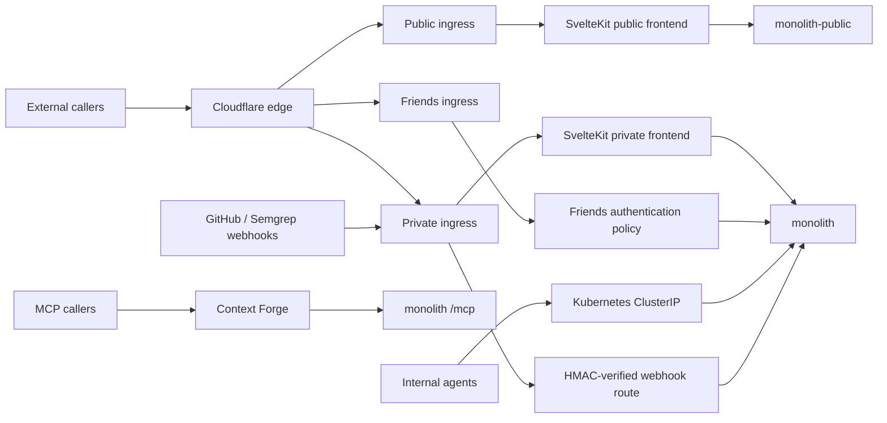

# Monolith Architecture

The monolith is the FastAPI and SvelteKit application suite for the knowledge
graph, conversational agents, isolated agent sessions, and small public data
products. It is deployed as separate private and public compositions over a
shared Postgres data plane, with a separately gated friends surface.
(see: /projects/monolith/app/main.py)
(see: /projects/monolith/app/main_public.py)
(see: /projects/monolith/deploy/values.yaml)

Current as of ad2a24e2d (2026-08-22)

## 1. What it is and request paths

The backend is a FastAPI application assembled from domain modules, while the
browser application is SvelteKit. Together they host the knowledge graph,
Discord agent, agent console, Grimoire, and public applications.
(see: /projects/monolith/framework/core.py)
(see: /projects/monolith/frontend/src/routes)

The deployed service has three audience tiers. The private monolith carries the
full route and MCP surface. The public deployment is a pruned composition that
uses a read-only database role for most requests and a separately scoped writer
for the two public chat domains. The friends tier exposes only the moving
planner, its browser API, and the SvelteKit bundle. That hostname has no
Cloudflare Access application in front of it: an Envoy `SecurityPolicy` doing
authentik OIDC plus a `groups` claim check with `defaultAction: Deny` is the
only thing between it and the internet, and a `SecurityPolicy` is a separate
object from the route it targets, so verify the deny path against the live URL
rather than the manifest.
(see: /projects/monolith/app/modules_private.py)
(see: /projects/monolith/app/modules_public.py)
(see: /projects/monolith-public/chart/values.yaml)
(see: /projects/monolith/chart/templates/httproute-friends.yaml)

The public and private ingress split, the friends policy, and the internal
service ports are rendered by the Helm chart. Context Forge reaches the
monolith MCP mount through the cluster network.
(see: /projects/monolith/deploy/values.yaml)
(see: /projects/monolith/chart/templates/httproute-private.yaml)
(see: /projects/monolith/chart/templates/httproute-friends.yaml)
(see: /projects/monolith/chart/templates/service.yaml)
(see: /projects/mcp/ARCHITECTURE.md)

Two routes on the private hostname carry no `SecurityPolicy` on purpose. The
GitHub and Semgrep webhook paths reach the backend through a Cloudflare Access
IP bypass and are authenticated by the handler's HMAC verification alone, which
is why they live on their own HTTPRoute rather than as rules on the private one.
(see: /projects/monolith/chart/templates/httproute-private.yaml)

The application pod is default-deny for ingress. A `CiliumNetworkPolicy`
allow-lists each caller by namespace and port: the gateway on 3000 and 8000,
Context Forge on 8000, the workflows namespace on 8000, and EmberVM on 8091 and
3000. A caller that is not listed fails as a silent dial timeout rather than a
readable deny, so a new in-cluster consumer needs an entry in the same change.
The public tier carries the equivalent ingress policy plus off-cluster
default-deny egress with a single Turnstile allow.
(see: /projects/monolith/chart/templates/cilium-ingress-policy.yaml)
(see: /projects/monolith-public/chart/templates/cilium-policy.yaml)
(see: /projects/monolith-public/deploy/values.yaml)

## 2. Modular framework

`framework/core.py` defines the registry contract through `Tier`, `Profile`,
`Module`, and `build_app`. A profile selects public or private behavior and
controls MCP, telemetry, static frontend, deep health, and leader singleton
wiring.
(see: /projects/monolith/framework/core.py)

Each domain exports a `Module` and contributes private routes, public routes,
MCP registration, startup work, leader hooks, or health checks. Registration
uses module hooks, while MCP tools themselves use FastMCP decorators.
(see: /projects/monolith/app/modules_private.py)
(see: /projects/monolith/app/modules_public.py)
(see: /projects/monolith/core/mcp_app.py)

Cross-domain imports must enter another domain through its `api` module. The
boundary test parses every non-test Python file and reports internal imports,
with no standing exceptions.
(see: /projects/monolith/import_boundaries_test.py)

The public profile registers only `register_public` hooks and has no private
lifespan, MCP mount, telemetry setup, or static frontend mount. The public
binary also prunes private domains and private write paths from its file set,
and a subprocess test checks that forbidden modules never enter its import
closure.
(see: /projects/monolith/framework/core.py)
(see: /projects/monolith/BUILD)
(see: /projects/monolith/app/main_public_imports_test.py)

## 3. Data

One CloudNativePG cluster holds the monolith data. Production sets two
instances, which gives one primary and one streaming hot standby for
availability and read traffic.
(see: /projects/monolith/deploy/values.yaml)
(see: /projects/monolith/chart/templates/cnpg-cluster.yaml)

Atlas owns schema migration from the SQL files in `chart/migrations`. The
database is divided into domain schemas including `knowledge`, `chat`,
`agent_sessions`, `grimoire`, `ships`, `stars`, `trips`, `campsites`, and
`swarm`.
(see: /projects/monolith/chart/templates/atlas-migration.yaml)
(see: /projects/monolith/chart/migrations)

Application sessions use a cached SQLModel engine configured for psycopg.
Domain code opens bounded session contexts around database work.
(see: /projects/monolith/core/db.py)

Knowledge chunks store 1,024-dimensional pgvector embeddings. A cosine HNSW
index supports approximate nearest-neighbor retrieval, and the knowledge store
ranks semantic matches before hydrating note and graph context.
(see: /projects/monolith/chart/migrations/20260408000000_knowledge_schema.sql)
(see: /projects/monolith/knowledge/store.py)

The migration bundle is rendered into a ConfigMap for Atlas. Bulk seed data is
kept out of that bundle because client-side apply records the manifest in an
annotation with a 256 KiB ceiling.
(see: /projects/monolith/chart/templates/migrations-configmap.yaml)
(see: /bazel/tools/hooks/check-large-migration-sql.sh)

The public read role receives explicit schema and object grants, including
definer's-rights views (deliberately not `security_invoker`) that expose only
public knowledge rows. The public write role has DML only on the bounded public
chat schemas and specific demo latch tables.
(see: /projects/monolith/chart/migrations/20260617000000_public_reader_role.sql)
(see: /projects/monolith/chart/migrations/20260617020000_public_api_knowledge_views.sql)
(see: /projects/monolith/chart/migrations/20260617030000_chat_public.sql)
(see: /projects/monolith/chat_public_grants_test.py)

Production owns a nightly logical refresh into the disposable development
database. The dump reads from the production primary, not the read replica: a
standby cancels any query whose snapshot blocks WAL replay, and the COPY of
knowledge.chunks was long enough to hit that on every run. The development
overlay disables duplicate refresh ownership and all external-identity
singletons.
(see: /projects/monolith/deploy/values.yaml)
(see: /projects/monolith/chart/templates/cnpg-dev-refresh-cronworkflow.yaml)
(see: /projects/monolith/dev/deploy/values.yaml)

Production enables Barman base backups and continuous WAL archiving to the
in-cluster SeaweedFS object store. This protects against logical loss and
Postgres volume corruption, but it is not protection against loss of the whole
cluster because both systems share the cluster failure domain.
(see: /projects/monolith/deploy/values.yaml)
(see: /projects/monolith/chart/templates/cnpg-cluster.yaml)

## 4. Agents

`agent_sessions` persists sessions, turns, pending messages, progress, model
selection, workflow ownership, and EmberVM lineage in Postgres. Pending turns
are claimed in sequence by one replica, refreshed by heartbeat, and reclaimed
after a stale lease so a crashed worker does not strand work.
(see: /projects/monolith/agent_sessions/models.py)
(see: /projects/monolith/agent_sessions/mcp.py)
(see: /projects/monolith/agent_sessions/store.py)

DBOS is the durable orchestration layer for bounded swarm workflows, not the
claim implementation itself. DBOS workflows queue agent-session steps,
checkpoint waits, record plans and decisions, and resume after process
restart.
(see: /projects/monolith/swarm/workflows.py)
(see: /projects/monolith/swarm/steps.py)
(see: /projects/monolith/swarm/runtime.py)

Agent turns cross the EmberVM boundary through a session API. The Claude and Pi
runtimes are `session` class guests, while `run_code` selects disposable
language-specific task workloads. Task and session guests are vsock-only and
receive no NIC.
(see: /projects/monolith/agent_sessions/transport.py)
(see: /projects/monolith/sandbox/mcp.py)
(see: /projects/embervm/chart/templates/workload-claude-runtime.yaml)
(see: /projects/embervm/chart/templates/workload-pi-runtime.yaml)
(see: /projects/embervm/ARCHITECTURE.md)

There are two separate scheduling planes. Repository files under
`claude_routines` describe account-hosted Claude.ai routines and are reconciled
to that service. Monolith batch work is rendered as Argo CronWorkflows, whose
controller owns cadence, concurrency, deadlines, and history.
(see: /projects/monolith/claude_routines/README.md)
(see: /projects/monolith/chart/values.yaml)
(see: /projects/monolith/chart/templates/cronworkflows.yaml)

Suspended entries remain available for manual submission without reactivating
an in-process loop.

The agent console is served at `/agents` on the private hostname. Its
SvelteKit route is internally grouped under the private tree, and the private
ingress authentication policy guards the browser surface.
(see: /projects/monolith/frontend/src/routes/private/agents/+page.svelte)
(see: /projects/monolith/frontend/src/hooks.js)
(see: /projects/monolith/chart/templates/httproute-private.yaml)

Model names map to three runtime families. `qwen` selects the Pi family and its
dedicated workload, `luna`, `terra`, and `sol` select Codex dispatch, and
`opus`, `sonnet`, and `fable` select Claude dispatch.
(see: /projects/monolith/agent_sessions/__init__.py)
(see: /projects/monolith/agent_sessions/transport.py)
(see: /projects/embervm/runtimes/claude/shim.py)

The Pi runtime bounds its usable context at 30,000 tokens against the deployed
model server's 32,768-token window. A per-turn reasoning flag maps to high
thinking or thinking off.
(see: /projects/embervm/chart/values.yaml)
(see: /projects/monolith/agent_sessions/transport.py)

Leader election scopes side-effecting singleton hooks to one API replica. The
hook set currently covers the Discord bot, Discord outbox drain, message-lock
sweep, AIS ingest, agent pending-message reclaim, session title refresh, DBOS
runtime, and the continuous-delivery probe writer.
(see: /projects/monolith/framework/core.py)
(see: /projects/monolith/chat/leader.py)
(see: /projects/monolith/ships/leader.py)
(see: /projects/monolith/agent_sessions/module.py)
(see: /projects/monolith/swarm/module.py)
(see: /projects/monolith/cluster/module.py)

## 5. Chat

The Discord bot handles direct messages, mentions, replies, ambient engagement,
slash commands, thread sessions, and streamed response edits. The bot and its
two supporting loops run only on the elected leader.
(see: /projects/monolith/chat/bot.py)
(see: /projects/monolith/chat/leader.py)
(see: /projects/monolith/chat/outbox.py)

Trust and safety is a per-server, per-user ledger with three detection lanes:
narrow regex heuristics on every observed message, an asynchronous LLM intent
classifier on relevant messages, and an offline-trained random forest that is
shadow-only until a model row is promoted to live.
(see: /projects/monolith/chat/safeguards.py)
(see: /projects/monolith/chat/safeguards_train_job.py)
(see: /projects/monolith/chart/migrations/20260711220000_chat_safeguards.sql)

Scores start at a ceiling, decay back on a fixed per-day recovery, and soft-lock
engagement below a threshold; the constants live in `chat/safeguards.py` and are
environment-overridable. A pardon restores the score and relabels recent
training events as benign, turning a false positive into supervised feedback.
(see: /projects/monolith/chat/safeguards.py)

Public chat v3 verifies a Turnstile challenge before minting a session and
applies turn, token, prompt-size, concurrency, and shared GPU admission limits.
The write path uses its restricted public database identity.
(see: /projects/monolith/chat_public/turnstile.py)
(see: /projects/monolith/chat_public/limits.py)
(see: /projects/monolith/chat_public/db.py)

Grimoire chat is a parallel public chat surface grounded by pgvector retrieval
over the Grimoire corpus. It streams model output, compacts long conversations,
and shares the same admission and resource-control pattern, but its chat input
is text rather than a multimodal message payload.
(see: /projects/monolith/grimoire_chat/retrieval.py)
(see: /projects/monolith/grimoire_chat/router.py)
(see: /projects/monolith/grimoire_chat/summarizer.py)

## 6. Knowledge and Grimoire

Knowledge maintenance is split across the two planes from section 4. Graph
layout, repo documentation reconciliation, ingest-queue drain, and gap discovery
run as off-pod Argo CronWorkflows. Gap classification, research, consolidation,
distillation, and gardening run as account-hosted Claude.ai routines that reach
the graph through MCP; the in-process gardener is disabled in production.
(see: /projects/monolith/chart/values.yaml)
(see: /projects/monolith/app/jobs_main.py)
(see: /projects/monolith/claude_routines)

Knowledge RAG embeds a query, performs cosine retrieval over HNSW-indexed
chunks, ranks matching notes, and returns note, section, snippet, and edge
context. Public retrieval reads only the `public_api` views, never the
`knowledge` schema.
(see: /projects/monolith/knowledge/mcp.py)
(see: /projects/monolith/knowledge/store.py)
(see: /projects/monolith/chart/migrations/20260618230000_public_api_chunks.sql)

The note visibility predicate is fail-closed: only an explicit `public` value
is public. Public routes also strip links to anything outside the known public
note set, and database views repeat the same visibility condition.
(see: /projects/monolith/knowledge/visibility.py)
(see: /projects/monolith/knowledge/public_router.py)
(see: /projects/monolith/chart/migrations/20260617020000_public_api_knowledge_views.sql)

Grimoire implements the typed Postgres hot-tier schema described by Services
ADR 011 and the Postgres-first delivery sequence from Services ADR 012. The
shared corpus, typed entity details, embeddings, mentions, relationships,
campaign state, and knowledge grants all live in Postgres today.
(see: /docs/decisions/services/011-grimoire-hot-tier-schema.md)
(see: /docs/decisions/services/012-grimoire-postgres-first-loom-shaped.md)
(see: /projects/monolith/grimoire/models.py)

Campaign reads centralize the viewer predicate: global entities are visible to
everyone in the campaign, while non-global entities require a matching grant.
Projection then applies full, partial, or recognition-only scope.
(see: /projects/monolith/grimoire/visibility.py)
(see: /projects/monolith/grimoire/router.py)

The Grimoire ingest path converts extracted documents into ordered text and
image-derived chunks, records section hierarchy and image references, embeds
chunks, and extracts typed entities and relationships. Post-extraction stat
verification and alias merging remain accepted design work rather than current
runtime passes.
(see: /projects/monolith/grimoire/marker.py)
(see: /projects/monolith/grimoire/ingest.py)
(see: /projects/monolith/grimoire/extract.py)
(see: /docs/decisions/services/014-grimoire-post-extraction-quality-passes.md)

The general knowledge pipeline separately records research gaps, supports
chunked note indexing, and feeds gardener and human-review loops.
(see: /projects/monolith/knowledge/gaps.py)
(see: /projects/monolith/knowledge/indexing.py)
(see: /projects/monolith/knowledge/gardener.py)

## 7. MCP surface

Context Forge remains the MCP front door and stores the monolith `/mcp` server
as a registered streamable-HTTP upstream. The monolith mount is one shared
FastMCP instance populated by modules whose profile enables MCP.
(see: /projects/mcp/ARCHITECTURE.md)
(see: /projects/monolith/core/mcp_app.py)
(see: /projects/monolith/framework/core.py)

The registered monolith domains are cluster, agent, agent sessions, knowledge,
sandbox, Semgrep scanning, and screenshotting. Most register by a side-effect
import of their decorated tool module during application composition; shotter
calls an explicit `register_mcp_tools()` instead, so its BDD specs can attach
the tools deterministically.
(see: /projects/monolith/shotter/module.py)

Context Forge filters tool visibility tags against caller team membership,
which is tool-granular authorization. The monolith validates any bearer token
on each stateless MCP message, but anonymous discovery remains allowed and
per-caller result scoping is not live because caller tokens have not been
observed on the Claude.ai path.
(see: /projects/mcp/ARCHITECTURE.md)
(see: /projects/monolith/framework/core.py)
(see: /projects/monolith/auth/middleware.py)

The broader gateway architecture, identity limitations, and catalogue refresh
behavior are documented in [MCP architecture](../mcp/ARCHITECTURE.md).
(see: /projects/mcp/ARCHITECTURE.md)

## 8. Public apps

- `/health`: same-origin proxy to composite backend health, with healthy-only edge caching. (see: /projects/monolith/frontend/src/routes/public/health/+server.js)

- `/app/hikes`: walk catalogue and forecasts, served as cacheable public data. (see: /projects/monolith/hikes/router.py)

- `/app/trips`: geotagged trip and photo feed with a private ingest path and public cached reads. (see: /projects/monolith/trips/read_router.py)

- `/app/stars`: astronomy forecasts and historical climatology heatmaps. (see: /projects/monolith/stars/router.py)

- `/app/ships`: current and historical maritime tracks and heat cells. (see: /projects/monolith/ships/router.py)

- `/app/wc2026`: cached dynamic tournament summary and odds data. (see: /projects/monolith/worldcup/router.py)

- `/app/campsites`: cached recreation-area search with weather-enriched snapshots. (see: /projects/monolith/campsites/router.py)

- `/app/grimoire`: public knowledge graph, entity explorer, adventure index, and open-book reader with extracted illustrations. (see: /projects/monolith/grimoire/router_public.py)

- `/app/notes`: Turnstile-gated, rate-limited public chat over the public knowledge graph, with a lazy graph view. (see: /projects/monolith/chat_public/router.py)

- `/app/grimoire/chat`: Turnstile-gated Grimoire RAG chat. (see: /projects/monolith/grimoire_chat/router.py)

- `/agents` (private hostname): authenticated agent console for sessions, schedules, run history, progress, and companion state. (see: /projects/monolith/frontend/src/routes/private/agents/+page.svelte)

- `/app/dr-jobs`: NHS job search over the scraped listings feed. (see: /projects/monolith/dr_jobs/router.py)

- `/app/llm-leaderboard`: model-bench results scatter. (see: /projects/monolith/frontend/src/routes/public/app/llm-leaderboard/+page.svelte)

- `/ember/{bazel,semgrep,postgres,agents}`: the EmberVM demo pages the synthetic probes in section 9 exercise. (see: /projects/monolith/ember_public/bazel_router.py)

Public application responses follow the anonymous cache pattern established by
the platform CDN decisions, with route handlers declaring cache and ETag
semantics where their data permits it.
(see: /docs/decisions/platform/003-cdn-cache-hostname-rule.md)
(see: /projects/platform/ARCHITECTURE.md)
(see: /projects/monolith/hikes/router.py)
(see: /projects/monolith/stars/router.py)

## 9. Observability and health

`/healthz` is process liveness. `/api/health` executes a database query and all
registered module checks concurrently, returns 503 for fatal failures, and
reports advisory degradation without changing the 200 response.
(see: /projects/monolith/framework/core.py)

The public `/health` route proxies `/api/health`, hides internal detail strings,
lists only failing component names, caches only healthy responses, and returns
an uncached 503 when the backend is unhealthy or unreachable.
(see: /projects/monolith/frontend/src/routes/public/health/+server.js)

Current fatal components are stars health plus the EmberVM synthetic latches
for Bazel, Semgrep, pages, Postgres, and Qwen. Continuous-delivery health is a
separate advisory latch computed by a private leader and read by both tiers.
(see: /projects/monolith/stars/module.py)
(see: /projects/monolith/ember_public/module.py)
(see: /projects/monolith/home/module.py)
(see: /projects/monolith/core/platform_probe.py)

The original four EmberVM synthetic probes run every five minutes. Qwen uses a
separate hourly CronWorkflow and a correspondingly longer staleness allowance,
but it now contributes to the same fatal composite health decision.
(see: /projects/monolith/ember_public/health.py)
(see: /projects/monolith/chart/values.yaml)

The private profile instruments FastAPI and outbound HTTP calls and exports
OpenTelemetry spans through the deployed SigNoz infrastructure collector. The
public backend profile intentionally omits in-process telemetry setup.
(see: /projects/monolith/framework/core.py)
(see: /projects/monolith/deploy/values.yaml)

Operational dashboards are shipped with the chart for CloudNativePG, agent
execution, and red-state overview.
(see: /projects/monolith/chart/dashboards/cnpg-overview.json)
(see: /projects/monolith/chart/dashboards/goosecracker-overview.json)
(see: /projects/monolith/chart/dashboards/monolith-red.json)

## 10. Delivery

The monolith Helm chart is published as an OCI artifact. The production ArgoCD
Application uses the OCI chart as one source and a Git source, named through a
`$values` reference, as the second source for environment values.
(see: /projects/monolith/deploy/application.yaml)
(see: /projects/monolith/chart/Chart.yaml)

Pull requests do not change the chart version or production target revision.
After merge, the publishing workflow calculates the next version, publishes
the chart, and writes the version back on the main branch.
(see: /docs/decisions/platform/009-post-merge-chart-versioning-kargo-promotion.md)
(see: /bazel/helm/write-back-versions.sh)

For the monolith that written-back value is not what is deployed. Kargo owns
`targetRevision` at runtime for both `monolith` and `monolith-dev`, patching the
live Application, and the root Application carries an `ignoreDifferences` entry
for that field plus `RespectIgnoreDifferences=true` so the patch survives. Git
differing from the live value is correct here rather than a stuck deploy. Read
the live one:

    kubectl get application monolith -n argocd \
      -o jsonpath='{.spec.sources[0].targetRevision}'

The write-back still maintains production's copy deliberately. That is the
revert lever: drop the root Application's `ignoreDifferences` entry for
`monolith` and production is handed back a current, bot-maintained value with
nothing to reconstruct.
(see: /projects/monolith/deploy/application.yaml)

Kargo discovers monolith chart freight and promotes the same artifact first to
development and then to production. Development auto-promotes from the
warehouse, production consumes only freight held by development for a two
minute settling window, and each promotion waits for ArgoCD to become synced
and healthy.
(see: /projects/platform/kargo/values.yaml)
(see: /projects/platform/kargo/templates/promotion.yaml)

The development Application's checked-in `0.293.0` revision is a frozen
bootstrap floor, not its runtime revision. Kargo owns the live revision, while
the development overlay keeps side-effecting singletons and external
identities disabled.
(see: /projects/monolith/dev/deploy/application.yaml)
(see: /projects/monolith/dev/deploy/values.yaml)

Production refreshes the development database nightly from the production
primary. This gives development representative data without making it another
backup target or another owner of production side effects.
(see: /projects/monolith/deploy/values.yaml)
(see: /projects/monolith/dev/deploy/values.yaml)
(see: /projects/monolith/chart/templates/cnpg-dev-refresh-cronworkflow.yaml)

## 11. ADR map

The status text below starts with each ADR header. `Accepted, shipped` and
`Accepted, not shipped` are reconciliation annotations based on the cited
current code. A `Draft, code exists` row records a header and implementation
mismatch without silently rewriting the decision record.
(see: /docs/decisions/index.md)

### Services

| ADR | Title | Status |
| --- | --- | --- |
| [001](../../docs/decisions/services/001-discord-history-backfill.md) | Discord History Backfill | Accepted, shipped (see: /projects/monolith/chat/backfill.py) |
| [002](../../docs/decisions/services/002-discord-chat-automation.md) | Discord Chat Automation & Reactivity | Draft, code exists (see: /projects/monolith/chat/bot.py) |
| [003](../../docs/decisions/services/003-knowledge-search-overlay.md) | Knowledge Search Overlay | Deprecated (see: /docs/decisions/services/003-knowledge-search-overlay.md) |
| [004](../../docs/decisions/services/004-dnd-sourcebook-knowledge-integration.md) | D&D Sourcebook Knowledge Graph Integration | Deprecated (see: /docs/decisions/services/004-dnd-sourcebook-knowledge-integration.md) |
| [005](../../docs/decisions/services/005-repo-docs-knowledge-sync.md) | Repo Markdown Knowledge Graph Sync via OCI Volume | Implemented (see: /projects/monolith/knowledge/repo_docs.py) |
| [006](../../docs/decisions/services/006-stars-grid-ingest.md) | Stars grid ingest via a dedicated job writing to the monolith DB | Accepted, shipped (see: /projects/monolith/stars/grid_gen) |
| [007](../../docs/decisions/services/007-stars-quality-model-and-heatmap.md) | Stars quality model and heatmap | Accepted, shipped (see: /projects/monolith/stars/models.py) |
| [008](../../docs/decisions/services/008-stars-live-historical-heatmaps.md) | Stars live and historical heatmaps via month-bucketed accumulate-at-drop | Superseded in part by 009 (see: /docs/decisions/services/008-stars-live-historical-heatmaps.md) |
| [009](../../docs/decisions/services/009-stars-climatology-backfill.md) | Stars historical climatology backfill from ERA5 | Accepted, shipped (see: /projects/monolith/stars/router.py) |
| [010](../../docs/decisions/services/010-fastmonolith-modular-framework.md) | FastMonolith Modular Framework | Accepted, shipped (see: /projects/monolith/framework/core.py) |
| [011](../../docs/decisions/services/011-grimoire-hot-tier-schema.md) | Grimoire Hot-Tier Schema on Postgres | Accepted, shipped (see: /projects/monolith/grimoire/models.py) |
| [012](../../docs/decisions/services/012-grimoire-postgres-first-loom-shaped.md) | Grimoire Postgres-First, Loom-Shaped | Accepted, shipped (see: /projects/monolith/grimoire/ingest.py) |
| [013](../../docs/decisions/services/013-grimoire-knowledge-audiences.md) | Grimoire Knowledge Audiences: Corpus-Derived Character Knowledge as Compiled Grants | Accepted, shipped (see: /projects/monolith/grimoire/visibility.py) |
| [014](../../docs/decisions/services/014-grimoire-post-extraction-quality-passes.md) | Grimoire post-extraction quality passes (stat verifier, alias merge) | Accepted, not shipped (see: /docs/decisions/services/014-grimoire-post-extraction-quality-passes.md) |

### Chat

| ADR | Title | Status |
| --- | --- | --- |
| [001](../../docs/decisions/chat/001-improve-ambient-loop.md) | Ambient Feedback Loop and Directive Autopilot | Accepted, shipped (see: /projects/monolith/chat/ambient_analysis.py) |
| [002](../../docs/decisions/chat/002-structured-channel-history-query.md) | Structured, Scope-Locked Channel-History Query for the Chat Agent | Accepted, shipped (see: /projects/monolith/chat/channel_data.py) |
| [003](../../docs/decisions/chat/003-trust-safety-safeguards.md) | Trust & Safety Safeguards (Ledger, Lockout, Shadow Forest) | Accepted, shipped (see: /projects/monolith/chat/safeguards.py) |

### Agents

| ADR | Title | Status | Tracking |
| --- | --- | --- | --- |
| [001](../../docs/decisions/agents/001-background-agents.md) | Self-Hosted Autonomous Coding Agents via OpenHands | Superseded by 004 (see: /docs/decisions/agents/001-background-agents.md) |  |
| [002](../../docs/decisions/agents/002-openhands-agent-sandbox.md) | Kubernetes-Native OpenHands Sandboxes via agent-sandbox | Superseded by 004 (see: /docs/decisions/agents/002-openhands-agent-sandbox.md) |  |
| [003](../../docs/decisions/agents/003-context-forge.md) | MCP Context Forge as Agent Tool Gateway | Superseded by 020, deployment remains live (see: /projects/mcp/ARCHITECTURE.md) |  |
| [004](../../docs/decisions/agents/004-autonomous-agents.md) | Autonomous Coding Agents | Deprecated (see: /docs/decisions/agents/004-autonomous-agents.md) |  |
| [005](../../docs/decisions/agents/005-role-based-mcp-access.md) | Role-Based MCP Access | Deprecated (see: /docs/decisions/agents/005-role-based-mcp-access.md) |  |
| [006](../../docs/decisions/agents/006-oidc-auth-mcp-gateway.md) | OIDC Authentication for MCP Gateway | Superseded by 011 (see: /docs/decisions/agents/006-oidc-auth-mcp-gateway.md) |  |
| [007](../../docs/decisions/agents/007-agent-orchestrator.md) | Agent Run Orchestration Service | Implemented, later execution path evolved (see: /projects/monolith/agent_sessions) |  |
| [008](../../docs/decisions/agents/008-cluster-patrol-loop-resilience.md) | Cluster Patrol Loop Resilience | Accepted, not shipped in the current monolith (see: /docs/decisions/agents/008-cluster-patrol-loop-resilience.md) |  |
| [009](../../docs/decisions/agents/009-automated-test-generation.md) | Automated Test Generation Bots | Deprecated (see: /docs/decisions/agents/009-automated-test-generation.md) |  |
| [010](../../docs/decisions/agents/010-recipe-driven-agent-registry.md) | Recipe-Driven Agent Registry | Deprecated (see: /docs/decisions/agents/010-recipe-driven-agent-registry.md) |  |
| [011](../../docs/decisions/agents/011-cloudflare-managed-oauth.md) | Cloudflare Managed OAuth for MCP Gateway | Deprecated (see: /docs/decisions/agents/011-cloudflare-managed-oauth.md) |  |
| [012](../../docs/decisions/agents/012-knowledge-gardener-model-pipeline.md) | Knowledge Gardener Two-Tier Model Pipeline | Superseded by 013 (see: /docs/decisions/agents/012-knowledge-gardener-model-pipeline.md) |  |
| [013](../../docs/decisions/agents/013-knowledge-gardener-gemma4-only.md) | Knowledge Gardener Gemma4-Only Pipeline | Deprecated (see: /docs/decisions/agents/013-knowledge-gardener-gemma4-only.md) |  |
| [014](../../docs/decisions/agents/014-ax-substrate-agent-runtime.md) | AX + Substrate as the Agent Runtime Substrate | Deprecated (see: /docs/decisions/agents/014-ax-substrate-agent-runtime.md) |  |
| [015](../../docs/decisions/agents/015-temporal-orchestration-substrate.md) | Temporal as the Orchestration Substrate | Deprecated (see: /docs/decisions/agents/015-temporal-orchestration-substrate.md) |  |
| [016](../../docs/decisions/agents/016-nats-canonical-event-stream.md) | NATS as the Canonical Event Stream | Accepted, built then retired (see: /projects/monolith/agent_sessions/router.py) |  |
| [017](../../docs/decisions/agents/017-domain-event-schema.md) | Domain Event Schema and Tombstone Semantics | Accepted, not shipped (see: /docs/decisions/agents/017-domain-event-schema.md) |  |
| [018](../../docs/decisions/agents/018-event-driven-gardener-trigger.md) | Event-Driven Gardener Triggering via Remote-Trigger Runs | Deprecated (see: /docs/decisions/agents/018-event-driven-gardener-trigger.md) |  |
| [019](../../docs/decisions/agents/019-substrate-executor-agentworkflow.md) | Substrate Executor Interface and AgentWorkflow over Argo | Accepted, not shipped as designed (see: /projects/monolith/swarm/workflows.py) | [argo-workflows#7891](https://github.com/argoproj/argo-workflows/issues/7891) |
| [020](../../docs/decisions/agents/020-deprecate-context-forge-mcp-gateway.md) | Deprecate Context Forge, Serve MCP Directly from the Monolith | Superseded by 059 (see: /docs/decisions/agents/020-deprecate-context-forge-mcp-gateway.md) |  |
| [021](../../docs/decisions/agents/021-discord-triggered-agentworkflow-fast-model.md) | Discord-Triggered AgentWorkflow with a Fast Hosted Model and Snapshot/Resume for Smooth Multi-Thread Work | Draft, evolved into agent sessions (see: /projects/monolith/agent_sessions) |  |
| [022](../../docs/decisions/agents/022-firecracker-snapshot-restore-controller.md) | Firecracker Snapshot/Restore Controller for AgentWorkflow (FC-Direct) | Accepted, shipped through EmberVM (see: /projects/embervm/ARCHITECTURE.md) |  |
| [023](../../docs/decisions/agents/023-egress-secret-proxy.md) | Egress Secret Proxy for Agent Sandboxes (Placeholder Substitution) | Draft, generic egress shipped (see: /projects/firecracker/substrate/egress-proxy) |  |
| [024](../../docs/decisions/agents/024-discord-agent-hosted-model-tiers-and-artifacts.md) | Productive Discord Agent, Hosted-Model Tiers, and Isolated Live Artifacts | Draft, code exists (see: /projects/monolith/chat/bot.py) |  |
| [025](../../docs/decisions/agents/025-three-layer-agent-stack-goosecracker.md) | Three-Layer Agent Stack (firecracker-substrate, goosecracker, discord-agent) | Draft, evolved into EmberVM (see: /projects/embervm/ARCHITECTURE.md) |  |
| [026](../../docs/decisions/agents/026-fast-microvm-starts-and-stateful-artifact-iteration.md) | Fast MicroVM Cold Starts and Stateful Artifact Iteration | Accepted, shipped through EmberVM (see: /projects/embervm/ARCHITECTURE.md) |  |
| [027](../../docs/decisions/agents/027-agent-github-app-roles.md) | Agent GitHub App Roles: Implementer and Reviewer | Draft, not shipped (see: /projects/monolith/deploy/values.yaml) |  |
| [028](../../docs/decisions/agents/028-elastic-agent-microvm-capacity-and-reclaim.md) | Elastic Agent-MicroVM Capacity and State-Preserving Reclaim | Draft header, shipped through EmberVM (see: /projects/embervm/control/lib/embervm/scheduler) |  |
| [029](../../docs/decisions/agents/029-discord-bot-feature-acl.md) | Discord Bot Feature ACL (per-server command and repo grants) | Accepted, shipped (see: /projects/monolith/chat/acl.py) |  |
| [030](../../docs/decisions/agents/030-fc-invoke-configurable-firecracker-surface.md) | fc-invoke, a Single Configurable Surface for Running Workloads in Firecracker | Draft, evolved into EmberVM (see: /projects/embervm/ARCHITECTURE.md) |  |
| [031](../../docs/decisions/agents/031-cluster-node-control-data-plane-split.md) | Control-Plane / Data-Plane Split for the Agent Substrate (cluster + node) | Accepted, shipped through EmberVM (see: /projects/embervm/ARCHITECTURE.md) |  |
| [032](../../docs/decisions/agents/032-warm-bazel-worker-mcp.md) | Warm-Snapshot Bazel Worker as an MCP Tool Surface | Draft, partially shipped as an EmberVM demo (see: /projects/monolith/ember_public/bazel_router.py) |  |
| [033](../../docs/decisions/agents/033-golden-template-distribution-daemon-pulled-oci.md) | Golden-Template Distribution via Daemon-Pulled OCI Artifacts | Accepted, shipped through EmberVM (see: /projects/embervm/noded/image) |  |
| [034](../../docs/decisions/agents/034-per-tier-guest-mcp-acl.md) | Per-Tier MCP Tool ACLs for Goosecracker Guests | Draft, not shipped (see: /docs/decisions/agents/034-per-tier-guest-mcp-acl.md) |  |
| [035](../../docs/decisions/agents/035-discord-multiplayer-agent-ux.md) | Discord Multiplayer Agent UX (Ambient Classifier, Thread Sessions, Live Task Checklist) | Accepted, shipped (see: /projects/monolith/chat/bot.py) |  |
| [036](../../docs/decisions/agents/036-orchestrator-brief-compiler-tier.md) | Orchestrator Brief-Compiler Tier via OpenRouter | Accepted, shipped (see: /projects/monolith/chat/orchestrator_client.py) |  |
| [037](../../docs/decisions/agents/037-label-driven-firecracker-node-enrollment.md) | Label-Driven Firecracker Node Enrollment | Accepted, shipped through EmberVM (see: /projects/embervm/chart/templates/brick-deployment.yaml) |  |
| [038](../../docs/decisions/agents/038-autonomous-work-queue-tiered-gating.md) | Autonomous Work Queue with Capability-Tier Routing and Reviewer-Verdict Feedback | Accepted, shipped in bounded form (see: /projects/monolith/swarm) |  |
| [039](../../docs/decisions/agents/039-whatsapp-channel-gateway.md) | WhatsApp Channel Gateway (whatsmeow) for the Household Agent | Accepted, shipped (see: /projects/monolith/whatsapp) |  |
| [040](../../docs/decisions/agents/040-caller-provided-context-injection.md) | Caller-Provided Context Injection for Agent Guests (`/injected-context/`) | Draft, not shipped (see: /projects/monolith/chat/bot_on_message_test.py) |  |
| [041](../../docs/decisions/agents/041-hot-git-mirror-agent-workspaces.md) | Hot Git Mirror for goosecracker Agent Workspaces | Draft, not shipped (see: /projects/embervm/runtimes/claude/shim.py) |  |
| [042](../../docs/decisions/agents/042-agent-mcp-v1-followons.md) | Agent MCP v1 Follow-ons and Deferred Self-Improvement Loop | Accepted, partially shipped (see: /projects/monolith/agent/mcp.py) | [#3844](https://github.com/jomcgi-org/homelab/issues/3844) |
| [043](../../docs/decisions/agents/043-ambient-assistant-parity.md) | Ambient Assistant Parity (Channel-Data Tools, Reminders, Directive Evolution) | Accepted, shipped (see: /projects/monolith/chat/reminders.py) |  |
| [044](../../docs/decisions/agents/044-code-executor-sandbox.md) | Code Executor Sandbox Workload and Self-Describing Guest Runtimes | Accepted, shipped (see: /projects/monolith/sandbox/mcp.py) |  |
| [045](../../docs/decisions/agents/045-faas-on-fc-invoke-sandbox-runtime.md) | FaaS on the fc-invoke Sandbox Runtime | Accepted, shipped through EmberVM (see: /projects/monolith/faas) |  |
| [046](../../docs/decisions/agents/046-mmds-dynamic-workload-env.md) | MMDS for Dynamic Per-Workload Guest Env | Accepted, shipped as the EmberVM metadata seam (see: /projects/embervm/noded/fcvm/driver/driver.go) |  |
| [047](../../docs/decisions/agents/047-per-principal-egress-credential-broker.md) | Per-Principal Egress Credentials and the Broker Identity Envelope | Draft, not shipped (see: /projects/embervm/ARCHITECTURE.md) |  |
| [048](../../docs/decisions/agents/048-codex-oauth-token-broker.md) | Codex Subscription OAuth, a Single-Owner Token Broker for Guest Turns | Accepted, shipped (see: /projects/embervm/tokenbroker) |  |
| [049](../../docs/decisions/agents/049-turn-granular-poll-shaped-agent-ui.md) | Turn-Granular, Poll-Shaped Agent Session UI on Durable Postgres, Not a Live Event Stream | Accepted, shipped (see: /projects/monolith/agent_sessions/router.py) |  |
| [050](../../docs/decisions/agents/050-workspace-hydration-from-git-mirror.md) | Workspace Hydration for Agent Sessions from the Hot Git Mirror | Accepted, hydration shipped with direct HTTPS instead of the mirror (see: /projects/embervm/runtimes/claude/shim.py) |  |
| [051](../../docs/decisions/agents/051-guest-pushed-mid-turn-progress.md) | Mid-Turn Session Progress Pushed by the Guest, Not Polled Through the Control Plane | Accepted, shipped (see: /projects/monolith/agent_sessions/progress_ingest.py) |  |
| [052](../../docs/decisions/agents/052-cross-family-handoff-brief.md) | Cross-Family Agent Session Handoff via a Luna-Compiled Brief | Accepted, not shipped (see: /docs/decisions/agents/052-cross-family-handoff-brief.md) | [#4350](https://github.com/jomcgi-org/homelab/issues/4350) |
| [053](../../docs/decisions/agents/053-swarm-orchestration-bounded-conductor.md) | Swarm Development, Bounded Conductor Orchestration for Feature-Scale Agent DAGs | Draft, code exists (see: /projects/monolith/swarm/workflows.py) |  |
| [054](../../docs/decisions/agents/054-run-view-pinned-plans-epistemic-registers.md) | The Run View: Pinned Plans, Epistemic Registers, and Recorded-Not-Inferred Data | Draft, partially shipped (see: /projects/monolith/swarm/view.py) | [#4625](https://github.com/jomcgi-org/homelab/issues/4625) |
| [055](../../docs/decisions/agents/055-tool-mediated-github-access.md) | Tool-Mediated GitHub Access for Agent Principals | Superseded by 059 (see: /docs/decisions/agents/055-tool-mediated-github-access.md) |  |
| [056](../../docs/decisions/agents/056-agent-authored-walkthroughs.md) | Agent-Authored Walkthroughs: the Diff is Fact, the Points are Testimony | Draft, code exists (see: /projects/monolith/frontend/src/routes/private/agents/SessionWalkthrough.svelte) | [#4600](https://github.com/jomcgi-org/homelab/issues/4600), [#4614](https://github.com/jomcgi-org/homelab/issues/4614), [#4625](https://github.com/jomcgi-org/homelab/issues/4625) |
| [057](../../docs/decisions/agents/057-per-language-sandbox-guests.md) | Per-Language Sandbox Guests and the Retirement of Sessioned Execution | Draft header, shipped (see: /projects/embervm/chart/templates/workload-sandbox-languages.yaml) |  |
| [058](../../docs/decisions/agents/058-voice-driven-companion-screen.md) | The Voice Companion: a Ledger-First Screen the Conversation Drives, Never Load-Bearing | Accepted, shipped (see: /projects/monolith/agent_sessions/voice.py) |  |
| [059](../../docs/decisions/agents/059-authentik-federates-monolith-serves-mcp.md) | Authentik Federates MCP Identity; the Monolith Serves MCP Directly | Draft, not shipped (see: /projects/mcp/ARCHITECTURE.md) | [#3832](https://github.com/jomcgi-org/homelab/issues/3832), [#3833](https://github.com/jomcgi-org/homelab/issues/3833) |
