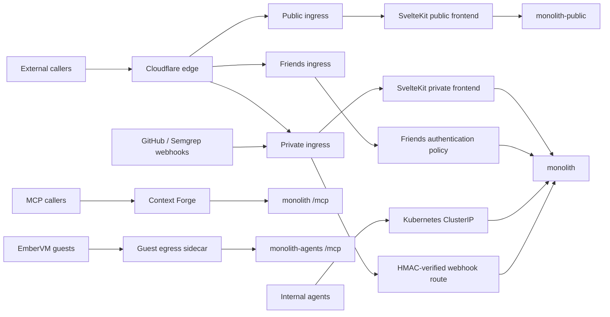

# Monolith Architecture

The monolith is the FastAPI and SvelteKit application suite for the knowledge
graph, conversational agents, isolated agent sessions, and small public data
products. It is deployed as separate private, public, and agent compositions
over a shared Postgres data plane, with a separately gated friends surface.
Production serves from the GKE hub since the September 2026 cutover; the home
cluster deployment is dormant.
(see: /projects/monolith/app/main.py)
(see: /projects/monolith/app/main_public.py)
(see: /projects/monolith/app/agents_main.py)
(see: /projects/gke-apps/monolith/application.yaml)

Current as of a93980260 (2026-09-05)

## 1. What it is and request paths

The backend is a FastAPI application assembled from domain modules, while the
browser application is SvelteKit. Together they host the knowledge graph,
Discord agent, agent console, Grimoire, and public applications.
(see: /projects/monolith/framework/core.py)
(see: /projects/monolith/frontend/src/routes)

The deployed service has three audience tiers, plus the agents tier of sections
2 and 7: the private monolith carries the full route and MCP surface, the public
deployment is a pruned composition on a read-only database role with a
separately scoped writer for the two public chat domains, and the friends tier
exposes only the moving planner, its browser API, and the SvelteKit bundle. The
friends hostname has no Cloudflare Access application in front of it, only an
authentik `SecurityPolicy` that is a separate object from its route, so verify
the deny path against the live URL with the checklist kept beside the
`cfIngress.friends` values rather than trusting the manifest.
(see: /projects/monolith/app/modules_private.py)
(see: /projects/monolith/app/modules_public.py)
(see: /projects/monolith/deploy/values.yaml)
(see: /projects/monolith/chart/templates/httproute-friends.yaml)

The public and private ingress split, the friends policy, and the internal
service ports are rendered by the Helm chart. Two routes on the private
hostname carry no `SecurityPolicy` on purpose: the GitHub and Semgrep webhook
paths reach the backend through a Cloudflare Access IP bypass and are
authenticated by the handler's HMAC verification alone, which is why they live
on their own HTTPRoute rather than as rules on the private one.
(see: /projects/monolith/chart/templates/httproute-private.yaml)
(see: /projects/monolith/chart/templates/service.yaml)
(see: /projects/mcp/ARCHITECTURE.md)

Where the Cilium CRDs exist, the application pod is default-deny for ingress. A
`CiliumNetworkPolicy` allow-lists each caller by namespace and port: the
gateway on 3000 and 8000, Context Forge on 8000, the workflows namespace on
8000, and EmberVM on 8091 and 3000. A caller that is not listed fails as a
silent dial timeout rather than a readable deny, so a new in-cluster consumer
needs an entry in the same change. The public tier carries the equivalent
ingress policy plus off-cluster default-deny egress with a single Turnstile
allow. None of these policies render on the GKE hub, which ships Cilium without
its CRDs, so every tier there runs with no network policy until a native
replacement lands (#5656 for the agents tier; the private tier's default-deny
egress was already open as #5143).
(see: /projects/monolith/chart/templates/cilium-ingress-policy.yaml)
(see: /projects/monolith-public/chart/templates/cilium-policy.yaml)
(see: /projects/monolith/deploy/values-gke.yaml)

**Why.** The anonymous SSR surface once shared a pod, backend, database role,
and full secret set with the private application, so an ingress mistake or
public-process compromise crossed every boundary at once (ADR security/004).
A feature-flagged full application and a replica without scoped grants were
rejected because both retain that escalation path. Separate compositions,
database identities, and fixed audience routes make private exposure the
default, accepting another deployment and several policy bindings to operate
(ADR networking/002, ADR services/010).

## 2. Modular framework

`framework/core.py` defines the registry contract through `Tier`, `Profile`,
`Module`, and `build_app`. A profile selects public or private behavior and
controls MCP, telemetry, static frontend, deep health, and leader singleton
wiring. Each domain exports a `Module` and contributes private routes, public
routes, MCP registration, startup work, leader hooks, or health checks.
Registration uses module hooks, while MCP tools themselves use FastMCP
decorators.
(see: /projects/monolith/framework/core.py)
(see: /projects/monolith/app/modules_private.py)
(see: /projects/monolith/core/mcp_app.py)

Cross-domain imports must enter another domain through its `api` module. The
boundary test parses every non-test Python file and reports internal imports,
with no standing exceptions.
(see: /projects/monolith/import_boundaries_test.py)

The public profile registers only `register_public` hooks and has no private
lifespan, MCP mount, telemetry setup, or static frontend mount. The public
binary also prunes private domains and private write paths from its file set,
and a subprocess test checks that forbidden modules never enter its import
closure.
(see: /projects/monolith/BUILD)
(see: /projects/monolith/app/main_public_imports_test.py)

The agents tier is a third composition with no registry at all. Its entrypoint
builds a Starlette app that serves exactly four knowledge tools over stateless
MCP plus one health route, behind identity middleware that rejects anonymous
callers. The binary is pruned by source glob, and an import test proves the
private domains never enter its closure.
(see: /projects/monolith/app/agents_main.py)
(see: /projects/monolith/app/main_agents_imports_test.py)

**Why.** Domain boundaries originally existed only by convention, allowing
internal imports and composition glue to spread while public and private
entrypoints risked drifting (ADR platform/008, ADR services/010). Independent
services and databases per domain were rejected as disproportionate, and a
base-class or dependency-injection framework was rejected because it would
couple every domain to more machinery. Plain module descriptors, one
`build_app`, endpoint-shaped `api.py` seams, and an AST boundary test preserve
one deployable system while making future extraction and review explicit. The
agents tier applies the same rule to guests: a pruned binary with its own
database identity, rather than an MCP sidecar inside the private pod, bounds
what an agent can write by a grant set and a source glob instead of by trust
in the guest.

## 3. Data

One CloudNativePG cluster holds the monolith data. Production sets two
instances, which gives one primary and one streaming hot standby for
availability and read traffic. The hub's cluster was bootstrapped by recovery
from the home cluster's Barman archive in Google Cloud Storage and keeps
archiving there under its own server name, so the two archives never share a
prefix. Daily base backups plus continuous WAL archiving keep fourteen days.
(see: /projects/monolith/deploy/values-gke.yaml)
(see: /projects/monolith/chart/templates/cnpg-cluster.yaml)
(see: /projects/monolith/deploy/cnpg-gcs-backup-secret.md)

Atlas owns schema migration from the SQL files in `chart/migrations`. The
database is divided into domain schemas including `knowledge`, `chat`,
`agent_sessions`, `claude_agent`, `grimoire`, `ships`, `stars`, `trips`,
`campsites`, and `swarm`. The migration bundle is rendered into a ConfigMap for
Atlas, and bulk seed data is kept out of it because client-side apply records
the manifest in an annotation with a 256 KiB ceiling.
(see: /projects/monolith/chart/templates/atlas-migration.yaml)
(see: /projects/monolith/chart/templates/migrations-configmap.yaml)
(see: /bazel/tools/hooks/check-large-migration-sql.sh)

Application sessions use a cached SQLModel engine configured for psycopg, and
domain code opens bounded session contexts around database work. Knowledge
chunks store 1,024-dimensional pgvector embeddings under a cosine HNSW index,
and the knowledge store ranks semantic matches before hydrating note and graph
context.
(see: /projects/monolith/core/db.py)
(see: /projects/monolith/chart/migrations/20260408000000_knowledge_schema.sql)
(see: /projects/monolith/knowledge/store.py)

The public read role receives explicit schema and object grants, including
definer's-rights views (deliberately not `security_invoker`) that expose only
public knowledge rows. The public write role has DML only on the bounded public
chat schemas and specific demo latch tables. The agents tier connects as
`agents_writer`, whose grant set is read across `knowledge` plus insert on four
tables and nothing at all on the private application schemas. Each of these
roles takes its password from an out-of-band basic-auth Secret because the
1Password operator cannot emit the Secret type CNPG requires.
(see: /projects/monolith/chart/migrations/20260617000000_public_reader_role.sql)
(see: /projects/monolith/chart/migrations/20260904180000_agents_writer_role.sql)
(see: /projects/monolith/chat_public_grants_test.py)
(see: /projects/monolith/deploy/agents-writer-secret.md)

The home overlay's nightly logical refresh into a development database (dumped
from the primary, because a standby cancels any query that blocks WAL replay)
is off on the hub, which has no development database.
(see: /projects/monolith/chart/templates/cnpg-dev-refresh-cronworkflow.yaml)

**Why.** Keeping Obsidian and Postgres as writable peers created synchronization,
conflict, and recovery questions, while a filesystem mount inside every replica
expanded the serving path and security surface (ADR platform/006). Postgres was
chosen as the body of record and as Grimoire's hot tier so transactions,
pgvector, grants, and backups share one operational substrate rather than adding
a service or datastore per domain (ADR services/011, ADR services/012). Schemas,
roles, and definer's-rights views provide the isolation; the physical standby is
accepted for availability and load isolation, not confidentiality (ADR
security/004).

## 4. Agents

`agent_sessions` persists sessions, turns, pending messages, progress, model
selection, workflow ownership, and EmberVM lineage in Postgres. Pending turns
are claimed in sequence by one replica, refreshed by heartbeat, and reclaimed
after a stale lease so a crashed worker does not strand work. A turn whose
brick is preempted mid-flight is resumed or re-issued rather than lost, and the
model the guest actually ran is persisted on the turn.
(see: /projects/monolith/agent_sessions/models.py)
(see: /projects/monolith/agent_sessions/store.py)
(see: /projects/monolith/chart/migrations/20260903030000_agent_session_recovery.sql)

Model names map to three runtime families. `spark` selects the Pi family and
its dedicated workload (`qwen` survives only as a legacy alias for persisted
sessions), `luna`, `terra`, and `sol` select Codex dispatch, and `opus`,
`sonnet`, and `fable` select Claude dispatch. The production list is explicit
in chart values, so a newly supported model never appears in the console or the
Discord command without a values change. Turns cross the EmberVM boundary
through a session API: the Claude, Codex and Pi runtimes are `session` class
guests, while `run_code` selects disposable language-specific task workloads,
and both kinds are vsock-only with no NIC.
(see: /projects/monolith/agent_sessions/__init__.py)
(see: /projects/monolith/agent_sessions/transport.py)
(see: /projects/monolith/sandbox/mcp.py)
(see: /projects/embervm/ARCHITECTURE.md)

Swarm is the DBOS layer that composes sessions into durable workflows. The one
engine today is `implement_then_review`: a Luna implementer session, an Opus
review session, bounded attempts and review cycles, and a plan pinned into a
step record at start so replay can never see a budget move. The pinned
`budget_usd` is enforced at node boundaries. Every structured output an agent
makes, review verdict and rationale record alike, arrives through one typed
artifact channel validated at ingestion; nothing structured is parsed out of
prose. The orchestration-level mutable DAG that ADR agents/062 decided is not
built: the workflow's Python control flow is still the graph (#5419, #4781).
(see: /projects/monolith/swarm/workflows.py)
(see: /projects/monolith/swarm/budget.py)
(see: /projects/monolith/swarm/turn_artifact.py)

Escalation is a pause, not a return. At each escalate point the workflow
writes a `swarm.swarm_decision` row and polls it on the cadence it already
polls session turns; a human answers through the console, the run decision
endpoint, or the `agent_run_decide` MCP tool, with the actor recorded
best-effort the way `cancel_run` records one. An unanswered row expires after
`swarm.decisionTimeoutSeconds` and the run ends the way an unwatched gate
always did. Swarm deliberately stops short of merging: the role-separated
review gate that ADR agents/027 describes does not exist in code, so nothing
autonomous lands on main, and the only agent-merged path is docfix auto-merge,
off by default and refusing agent instructions, skills, runbooks and ADRs even
when on.
(see: /projects/monolith/chart/migrations/20260822230000_swarm_decision.sql)
(see: /projects/monolith/swarm/router.py)
(see: /projects/monolith/deploy/values.yaml)

The work-queue drainer turns a standing backlog into continuous progress. An
Argo tick every fifteen minutes asks the leader to start `drain_cycle`, a
leader-owned DBOS workflow that claims `claude_agent.routine_jobs` rows under
the existing skip-locked lease, runs each as one fresh Luna session, and
completes it. Two job kinds are claimed: the general lane (`qwen-drain`, a
legacy name kept so registered rows stay claimable) and knowledge extraction
(`kg-drain`, capped per day with manual burst grants). Draining is serial by
design, the tick's suspend and the `agents.drainer.enabled` value are the two
kill switches, and a stall advisory rather than a Discord notify is the default
failure surface.
(see: /projects/monolith/swarm/drainer.py)
(see: /projects/monolith/agent/routine_jobs.py)
(see: /projects/monolith/chart/values.yaml)

The agent console is served at `/agents` on the private hostname as an
inbox-first surface: rows state the ask, a run view draws the plan, decision
records and walkthrough, a drain lane shows the queue, a VM map reads the
control plane and is deliberately empty when it is unreachable, and the voice
companion is a ledger-first screen the conversation drives. The route is
grouped under the private tree behind the private ingress authentication
policy. Session output reaches Discord only when a turn needs a human, unless
the session is bound to a thread.
(see: /projects/monolith/frontend/src/routes/private/agents/+page.svelte)
(see: /projects/monolith/agent_sessions/voice.py)
(see: /projects/monolith/chart/values.yaml)

Monolith batch work is rendered as Argo CronWorkflows in the workflows
namespace, whose controller owns cadence, concurrency, deadlines, and history.
Each entry runs the digest-pinned jobs image with one `jobs_main.py`
subcommand. A job pod gets `DATABASE_URL` from a Kyverno-cloned Secret plus
whatever the entry declares, never the deployment's environment. Entries marked
`internalApi` only POST a private endpoint on the leader (the drain tick, the
synthetic probes, the Semgrep harvest), so that work runs inside the API pod
where the credentials already live. Suspended entries remain available for
manual submission.
(see: /projects/monolith/chart/templates/cronworkflows.yaml)
(see: /projects/monolith/app/jobs_main.py)

Leader election scopes side-effecting singleton hooks to one API replica: the
Discord bot, outbox drain and message-lock sweep, AIS ingest, the agent-session
loops (pending-message sweep, title refresh, Ember-session export into the
knowledge graph), the DBOS runtime, and the continuous-delivery probe writer. A
failing singleton resigns and retries rather than ending leader election, and a
failed acquire backs off while followers keep serving.
(see: /projects/monolith/framework/core.py)
(see: /projects/monolith/chat/leader.py)
(see: /projects/monolith/agent_sessions/module.py)

**Why.** Terminal-lived runs and process-local queues could not survive a
restart, support multiple frontends, or provide a queryable history (ADR
agents/007). Putting every idle or short turn into an Argo Workflow was rejected
because each run becomes a high-churn etcd object and snapshot-backed sessions
wait on events rather than run to completion (ADR agents/019, ADR agents/022).
Leased Postgres rows own ordered turn dispatch, EmberVM owns isolated execution,
and short DBOS workflows own bounded multi-step recovery. This accepts polling
and reconciliation latency in exchange for one durable record shared by MCP,
the browser UI, and swarm orchestration (ADR agents/049, ADR agents/053).
Escalation waits on a polled row rather than a DBOS message because the
codebase's one rule about waiting is poll-shaped end to end and the audit
fields have to live somewhere durable regardless (ADR agents/060). The drainer
composes an Argo tick, a leader-owned workflow and the routine-job lease that
already existed rather than a new queue table or a hosted routine, because ADR
agents/038's work queue was never built and a hosted routine spends Claude
quota to babysit work billed elsewhere (ADR agents/061). Graph mutation belongs
at the orchestration level and never inside a durable workflow, because a
workflow that reads mutable state recovers wrongly on replay (ADR agents/062).

## 5. Chat

The Discord bot handles direct messages, mentions, replies, ambient engagement,
slash commands, thread sessions, and streamed response edits. The bot and its
two supporting loops run only on the elected leader. Synchronous replies use a
hosted route pinned to one OpenRouter provider for speed; clearing the model
and base URL in values reverts to the Spark path without a code deploy, and on
the hub that path is Meta's hosted API rather than an in-cluster server.
(see: /projects/monolith/chat/bot.py)
(see: /projects/monolith/deploy/values.yaml)
(see: /projects/monolith/deploy/values-gke.yaml)

Proactive work is scheduled rather than reactive: hourly changelog summaries
for three repositories, a reminders drain every two minutes, a weekly directive
observation pass and a daily directive autopilot, daily channel summaries, and
weekly safeguards training, all as CronWorkflows. The orchestrator brief
compiler decides chat against task submission on channels that hold the
`orchestrator` consent grant, with an ordered provider fallback chain that
fails open to direct submit.
(see: /projects/monolith/chart/values.yaml)
(see: /projects/monolith/chat/orchestrator_client.py)
(see: /projects/monolith/chat/acl.py)

Trust and safety is a per-server, per-user ledger with three detection lanes:
narrow regex heuristics on every observed message, an asynchronous LLM intent
classifier on relevant messages, and an offline-trained random forest that is
shadow-only until a model row is promoted to live. Scores start at a ceiling,
decay back on a fixed per-day recovery, and soft-lock engagement below a
threshold; the constants live in `chat/safeguards.py` and are
environment-overridable. A pardon restores the score and relabels recent
training events as benign, turning a false positive into supervised feedback.
(see: /projects/monolith/chat/safeguards.py)
(see: /projects/monolith/chart/migrations/20260711220000_chat_safeguards.sql)

Public chat v3 verifies a Turnstile challenge before minting a session and
applies turn, token, prompt-size, concurrency, and shared GPU admission limits.
The write path uses its restricted public database identity. On the hub its
inference is the hosted Spark API at a global concurrency of one, set as a
whole environment list in the GKE overlay because the chart carries that list
as a literal. Grimoire chat is a parallel public chat surface grounded by
pgvector retrieval over the Grimoire corpus; it streams model output, compacts
long conversations, and shares the same admission and resource-control pattern,
but its chat input is text rather than a multimodal message payload.
(see: /projects/monolith/chat_public/limits.py)
(see: /projects/monolith-public/deploy/values-gke.yaml)
(see: /projects/monolith/grimoire_chat/router.py)

The WhatsApp gateway is a transport-only Go service in its own single-replica
Deployment with a household agent path behind it. It holds an external session
singleton, so it is parked during the cutover window and comes back on the hub
only once the home deployment is off.
(see: /projects/monolith/whatsapp)
(see: /projects/monolith/deploy/values.yaml)

**Why.** LLM-only abuse detection was rejected because it charges a model call
for every message and lets a flood turn the detector into the resource drain;
hard bans and deletion were rejected because recoverable red-team play is part
of the friends surface (ADR chat/003). One ledger and one enforcement choke point
combine cheap deterministic signals, asynchronous semantic judgment, and a
shadow-first learned model. The design accepts delayed LLM verdicts and tunable
false positives, with score recovery and pardon providing the correction path.
Anonymous chat adds Turnstile and bounded admission because its GPU and write
paths cannot rely on an authenticated principal (ADR security/005).

## 6. Knowledge and Grimoire

The knowledge graph learns from evidence lanes. Every input becomes an
immutable `knowledge.raw_inputs` row, body content-addressed in object storage,
with a `source` naming its lane: finished Ember sessions (a leader loop with a
per-session watermark and a pinned since-floor), local Claude and Codex
sessions uploaded by a collector on the Mac over the tailnet, an hourly
read-only repository diff scout, and the intentional reports
`report_knowledge`, `dispute_fact`, and `report_distress`. Extraction is a
`kg-drain` job on the drainer: the monolith builds the prompt with a
source-specific lens, Luna returns candidate assertions, and the monolith
parses them and writes atoms and provenance server-side through
precision-first gates. Guests never write the graph. The account-hosted
routines and the in-process gardener that preceded this are retired, and no
knowledge CronWorkflow remains.
(see: /projects/monolith/knowledge/extraction.py)
(see: /projects/monolith/agent_sessions/kg_feed.py)
(see: /projects/monolith/chart/migrations/20260903000000_knowledge_scoped_assertions.sql)
(see: /projects/monolith/deploy/values.yaml)

Derived facts carry `scope`, `verification_state`, `confidence`, and a validity
window as columns. A dispute opens a `knowledge.disputes` row keyed by the
stable note id, so it survives a reindex, and never deletes the disputed fact;
a distress report notifies Discord and is retained but never extracted. Doc
drift found by the repository diff feed opens human-reviewed documentation PRs
on the routine lane, a demand-driven review turn verifies them against main,
and the switch that would let it enqueue one stays off. Recall closes the loop:
every new Ember session except a `kg-drain` one gets the top facts by embedding
similarity written into its system prompt once, from its first prompt, each
marked with its verification state, and the block does not refresh as the task
evolves.
(see: /projects/monolith/knowledge/mcp.py)
(see: /projects/monolith/knowledge/docfix.py)
(see: /projects/monolith/knowledge/recall.py)

Knowledge RAG embeds a query, performs cosine retrieval over HNSW-indexed
chunks, ranks matching notes, and returns note, section, snippet, and edge
context. Public retrieval reads only the `public_api` views, never the
`knowledge` schema. The note visibility predicate is fail-closed: only an
explicit `public` value is public, public routes strip links to anything
outside the known public note set, and database views repeat the same
visibility condition.
(see: /projects/monolith/knowledge/store.py)
(see: /projects/monolith/knowledge/visibility.py)
(see: /projects/monolith/chart/migrations/20260617020000_public_api_knowledge_views.sql)

Grimoire is Postgres-first: a typed hot-tier schema (a CTI entity spine with
typed detail tables, jsonb only for irregular display payloads) rather than a
document store. The shared corpus, typed entity details, embeddings, mentions,
relationships, campaign state, and knowledge grants all live in Postgres today.
Campaign reads centralize the viewer predicate: global entities are visible to
everyone in the campaign, while non-global entities require a matching grant,
and projection then applies full, partial, or recognition-only scope.
(see: /projects/monolith/grimoire/models.py)
(see: /projects/monolith/chart/migrations/20260703070000_grimoire_schema.sql)
(see: /projects/monolith/grimoire/visibility.py)

The Grimoire ingest path converts extracted documents into ordered text and
image-derived chunks, records section hierarchy and image references, embeds
chunks, and extracts typed entities and relationships through a hosted model
whose endpoint, model and concurrency are values. Chunk loading runs daily;
extraction and hierarchy backfill are suspended, manual-only jobs.
Post-extraction stat verification and alias merging remain accepted design
work rather than current runtime passes (#3912, #3913).
(see: /projects/monolith/grimoire/ingest.py)
(see: /projects/monolith/grimoire/extract.py)
(see: /projects/monolith/deploy/values.yaml)

**Why.** Postgres replaced the vault as the served-content authority because
two writable stores made synchronization and conflict policy load-bearing (ADR
platform/006). Grimoire reused that typed, pgvector-capable hot tier instead of
adding a standalone service, and compiles audience rules into grants rather than
growing every read predicate with contextual logic (ADR services/011, ADR
services/012, ADR services/013). Extraction moved from account-hosted routines
to a queue lane on the drainer because a hosted hourly routine spent Claude
quota to schedule work Luna bills elsewhere, and a queue consumer can be
paused, capped and reasoned about with the same levers as every other drainer
job (ADR agents/063). Guests never write the graph because identity and
provenance are server-stamped: the guest that produced a candidate fact must
not be the party that asserts its provenance.

## 7. MCP surface

Two MCP surfaces exist. Context Forge remains the front door for people and
hosted agents and stores the private monolith `/mcp` server as a registered
streamable-HTTP upstream. That mount is one shared FastMCP instance populated
by modules whose profile enables MCP: cluster, agent, agent sessions, chat
directives and trust, knowledge and tasks, sandbox, Semgrep scanning,
screenshotting, and the updates journal. Most register by a side-effect import
of their decorated tool module during application composition; shotter calls
an explicit `register_mcp_tools()` instead, so its BDD specs can attach the
tools deterministically.
(see: /projects/mcp/ARCHITECTURE.md)
(see: /projects/monolith/core/mcp_app.py)
(see: /projects/monolith/shotter/module.py)

The agents tier is the second surface, for guests. `monolith-agents` runs in
its own namespace and serves four knowledge tools (`search_knowledge`,
`report_knowledge`, `dispute_fact`, `report_distress`) over stateless MCP.
Identity middleware rejects anonymous callers, the tokens are minted by
authentik's agent provider, and an Ember guest reaches the tier only through
its egress sidecar, since the guest itself has no network. The tier holds its
own database and object-storage credentials, synced into its namespace, and a
ServiceAccount with no cluster RBAC. Its chart pin on the hub is advanced by
hand.
(see: /projects/monolith/app/agents_main.py)
(see: /projects/monolith-agents/chart/values.yaml)
(see: /projects/gke-apps/monolith-agents/application.yaml)
(see: /projects/embervm/ARCHITECTURE.md)

Context Forge filters tool visibility tags against caller team membership,
which is tool-granular authorization. The monolith validates any bearer token
on each stateless MCP message, but anonymous discovery remains allowed, and
per-caller result scoping is not built (#4569), although caller tokens now
reach the monolith on the Claude.ai path. The broader gateway architecture, identity
limitations, and catalogue refresh behavior are documented in
[MCP architecture](../mcp/ARCHITECTURE.md).
(see: /projects/monolith/auth/middleware.py)
(see: /projects/mcp/ARCHITECTURE.md)

**Why.** A federating gateway originally replaced one authentication workaround
and local proxy per backend, giving remote agents one catalogue and one place for
tool-level entitlement (ADR agents/003). Per-domain MCP servers were rejected
because they duplicate deployment and access plumbing, but gateway ACLs cannot
decide whether a returned domain object belongs to the caller. The caller's
verifiable identity therefore has to reach the monolith, and ADR agents/059
chooses a direct monolith endpoint once authentik federation is ready. The live
gateway is an accepted transition cost, including catalogue refresh and a
tool-wide failure domain (ADR agents/055, ADR agents/059). Guests got a pruned
tier with its own identity instead of a sidecar in the private pod, so that
what a guest can write is bounded by a grant set and a source glob rather than
by trust in the guest.

## 8. Public apps

- `/app/hikes`: walk catalogue and forecasts, served as cacheable public data. (see: /projects/monolith/hikes/router.py)
- `/app/trips`: geotagged trip and photo feed with a private ingest path and public cached reads. (see: /projects/monolith/trips/read_router.py)
- `/app/stars`: astronomy forecasts and historical climatology heatmaps. (see: /projects/monolith/stars/router.py)
- `/app/ships`: current and historical maritime tracks and heat cells. (see: /projects/monolith/ships/router.py)
- `/app/wc2026`: cached dynamic tournament summary and odds data. (see: /projects/monolith/worldcup/router.py)
- `/app/campsites`: cached recreation-area search with weather-enriched snapshots. (see: /projects/monolith/campsites/router.py)
- `/app/grimoire`: public knowledge graph, entity explorer, adventure index, and open-book reader with extracted illustrations. (see: /projects/monolith/grimoire/router_public.py)
- `/app/notes`: Turnstile-gated, rate-limited public chat over the public knowledge graph, with a lazy graph view. (see: /projects/monolith/chat_public/router.py)
- `/app/grimoire/chat`: Turnstile-gated Grimoire RAG chat. (see: /projects/monolith/grimoire_chat/router.py)
- `/app/dr-jobs`: NHS job search over the scraped listings feed. (see: /projects/monolith/dr_jobs/router.py)
- `/app/llm-leaderboard`: model-bench results scatter. (see: /projects/monolith/frontend/src/routes/public/app/llm-leaderboard/+page.svelte)
- `/ember/{bazel,semgrep,postgres,agents,firecracker}`: the EmberVM demo pages the synthetic probes in section 9 exercise, which say when a brick was preempted and recovery is under way. (see: /projects/monolith/ember_public/bazel_router.py)
- `/artifact/{id}`: agent-built HTML served from object storage in a sandboxed opaque origin. (see: /projects/monolith/artifact/router.py)
- `/blog`, `/docs`, `/engineering`: the posts, the published repository documents (this file among them), and the engineering index. (see: /projects/monolith/frontend/src/routes/public/docs)
- `/agents` (private hostname): the agent console of section 4. (see: /projects/monolith/frontend/src/routes/private/agents/+page.svelte)

Public application responses follow the anonymous cache pattern established by
the platform CDN decisions, with route handlers declaring cache and ETag
semantics where their data permits it.
(see: /projects/platform/ARCHITECTURE.md)
(see: /projects/monolith/hikes/router.py)

**Why.** These data products share the monolith's typed data, composition,
frontend, and operational controls, so splitting each into a service would add
deployment boundaries without removing their shared storage dependency (ADR
services/010). Anonymous reads use explicit origin cache semantics and a
hostname-scoped CDN rule; per-path rules were rejected once the public hostname
became the stronger routing boundary (ADR platform/002, ADR platform/003).
Authenticated or writable features stay on private routes or use narrowly scoped
public writers, accepting the public route composition as a load-bearing review
and test boundary (ADR security/004).

## 9. Observability and health

`/healthz` is process liveness. `/api/health` executes a database query and all
registered module checks concurrently, returns 503 for fatal failures, and
reports advisory degradation without changing the 200 response. The public
`/health` route proxies it, hides internal detail strings, lists only failing
component names, caches only healthy responses, and returns an uncached 503
when the backend is unhealthy or unreachable.
(see: /projects/monolith/framework/core.py)
(see: /projects/monolith/frontend/src/routes/public/health/+server.js)

Current fatal components are stars health plus the EmberVM synthetic latches
for Bazel, Semgrep, pages, Postgres, and the Spark session. Continuous-delivery
health and the drainer's stall signal are advisory latches computed by a
private leader and read by both tiers. The original four EmberVM synthetic
probes run every five minutes; the Codex and Spark session probes each run
their own hourly CronWorkflow, whole guest turns with a correspondingly longer
staleness allowance.
(see: /projects/monolith/ember_public/health.py)
(see: /projects/monolith/core/platform_probe.py)
(see: /projects/monolith/swarm/health.py)
(see: /projects/monolith/chart/values.yaml)

The private profile instruments FastAPI and outbound HTTP calls and exports
spans over HTTP/protobuf to the platform's OpenTelemetry collector, which
forwards to Honeycomb. The endpoint value must spell out the collector's HTTP
port and the full traces path, because the exporter posts to it verbatim, and
the service name must stay on the collector's allow list or the spans are
dropped after they arrive. The frontend exports nothing, and the demo trace
waterfall returns no spans until a span store is connected (#5363). The public
stats ticker scrapes the DCGM exporter directly for GPU utilization and frame
buffer usage.
(see: /projects/monolith/deploy/values.yaml)
(see: /projects/monolith/home/observability/traces.py)
(see: /projects/monolith/home/observability/stats.py)
(see: /projects/platform/ARCHITECTURE.md)

**Why.** Process liveness alone stayed green through downstream failures, while
alert-only maintenance failures could remain unread for days (ADR embervm/031).
Composite checks therefore classify immediate serving failures as fatal and
slower debt as advisory, rather than making every degraded dependency trigger a
rollback. Healthy-only edge caching prevents an old green result from hiding an
outage, and the public response strips internal details. The private profile
exports its spans through the shared collector, while the public profile
accepts less in-process detail to keep the anonymous runtime's dependency and
credential surface smaller (ADR security/004).

## 10. Delivery

The monolith Helm chart is published as an OCI artifact. Every ArgoCD
Application for it uses the OCI chart as one source and a Git source, named
through a `$values` reference, as the second source for environment values.
Pull requests do not change the chart version or production target revision:
after merge, the publishing workflow calculates the next version, publishes the
chart, and writes the version back on the main branch.
(see: /projects/monolith/chart/Chart.yaml)
(see: /bazel/helm/write-back-versions.sh)
(see: /projects/platform/ARCHITECTURE.md)

Production is the GKE hub. Its Application layers the shared production values
and then a GKE overlay that restores replicas, turns off the Cilium policies
and the development refresh, points chat at hosted inference, and exposes the
API port on the tailnet. The checked-in `targetRevision` there is a frozen
bootstrap floor that the write-back does not maintain. Kargo owns the live
revision for `monolith` and `monolith-public`: with no development stage on the
hub, production subscribes to the chart warehouse directly, promotes
automatically, and gates only on ArgoCD reaching synced and healthy at that
moment. Git differing from the live value is correct here rather than a stuck
deploy. Read the live one:

    kubectl get application monolith -n argocd \
      -o jsonpath='{.spec.sources[0].targetRevision}'

(see: /projects/gke-apps/monolith/application.yaml)
(see: /projects/monolith/deploy/values-gke.yaml)
(see: /projects/platform/kargo/values.yaml)

The home Application is dormant (backend replicas zero by values commit,
WhatsApp off) and keeps its write-back-maintained revision as the revert lever
until the home cluster is wiped (#4964); the development overlays are inert
until development Applications exist on the hub.
(see: /projects/monolith/deploy/application.yaml)

**Why.** Branch-side version bumps made concurrent pull requests collide and
could leave a merged change unpublished, while floating OCI revisions are not
supported by ArgoCD's Helm range handling (ADR platform/009, ADR platform/011).
Post-merge, commit-derived publishing and monotonic write-back remove shared
version lines from feature branches. Kargo owns live promotion so a promotion
that cannot come up stops rather than sitting half-rolled, accepting that
runtime `targetRevision` is cluster state and, on the hub, that a point-in-time
health wait stands in for a settling window until a development stage exists
there (ADR platform/009).

## 11. ADR map

The status text below starts with each ADR header. `Accepted, shipped` and
`Accepted, not shipped` are reconciliation annotations based on the cited
current code. A `Draft, code exists` row records a header and implementation
mismatch without silently rewriting the decision record.

Rows with a plain code and no link were harvested into this document by the
#4667 rollup and deleted; `git log --all --full-history -- docs/decisions/<path>`
recovers the text. Linked rows are ADRs another domain also claims, ADRs that
belong to another domain's rollup, or retained drafts whose execution an open
issue still tracks.
(see: /docs/decisions/index.md)

### Services

| ADR | Title | Status | Disposition |
| --- | --- | --- | --- |
| `services/001` | Discord History Backfill | Accepted, shipped (see: /projects/monolith/chat/backfill.py) | deleted in this PR |
| `services/002` | Discord Chat Automation & Reactivity | Draft, superseded in practice: reminders, ambient engagement, thread sessions and changelog posts shipped through chat/001, agents/035 and agents/043; #3901 to #3904 hold the remainder | deleted in this PR |
| `services/003` | Knowledge Search Overlay | Deprecated | deleted in this PR |
| `services/004` | D&D Sourcebook Knowledge Graph Integration | Deprecated | deleted in this PR |
| `services/005` | Repo Markdown Knowledge Graph Sync via OCI Volume | Implemented (see: /projects/monolith/knowledge/repo_docs.py) | deleted in this PR |
| `services/006` | Stars grid ingest via a dedicated job writing to the monolith DB | Accepted, shipped (see: /projects/monolith/stars/grid_gen) | deleted in this PR |
| `services/007` | Stars quality model and heatmap | Accepted, shipped (see: /projects/monolith/stars/models.py) | deleted in this PR |
| `services/008` | Stars live and historical heatmaps via month-bucketed accumulate-at-drop | Superseded in part by 009 | deleted in this PR |
| `services/009` | Stars historical climatology backfill from ERA5 | Accepted, shipped (see: /projects/monolith/stars/router.py) | deleted in this PR |
| `services/010` | FastMonolith Modular Framework | Accepted, shipped (see: /projects/monolith/framework/core.py) | deleted in this PR |
| `services/011` | Grimoire Hot-Tier Schema on Postgres | Accepted, shipped (see: /projects/monolith/grimoire/models.py) | deleted in this PR |
| `services/012` | Grimoire Postgres-First, Loom-Shaped | Accepted, shipped (see: /projects/monolith/grimoire/ingest.py) | deleted in this PR |
| `services/013` | Grimoire Knowledge Audiences: Corpus-Derived Character Knowledge as Compiled Grants | Accepted, shipped (see: /projects/monolith/grimoire/visibility.py) | deleted in this PR |
| `services/014` | Grimoire post-extraction quality passes (stat verifier, alias merge) | Accepted, not shipped (#3912, #3913) | deleted in this PR |

### Chat

| ADR | Title | Status | Disposition |
| --- | --- | --- | --- |
| `chat/001` | Ambient Feedback Loop and Directive Autopilot | Accepted, shipped (see: /projects/monolith/chat/ambient_analysis.py) | deleted in this PR |
| `chat/002` | Structured, Scope-Locked Channel-History Query for the Chat Agent | Accepted, shipped (see: /projects/monolith/chat/channel_data.py) | deleted in this PR |
| `chat/003` | Trust & Safety Safeguards (Ledger, Lockout, Shadow Forest) | Accepted, shipped (see: /projects/monolith/chat/safeguards.py) | deleted in this PR |

### Security

| ADR | Title | Status | Disposition |
| --- | --- | --- | --- |
| `security/004` | Public Read-Only Service Isolation | Accepted, shipped: separate pruned binary, `public_reader` on the CNPG standby, ingress and egress policy where the CRDs exist (see: /projects/monolith-public/chart/values.yaml). Private-tier default-deny egress still open (#5143) | deleted in this PR |
| `security/005` | Public Chat Adversarial Hardening | Implemented: Turnstile, per-session and global admission limits, single-host egress allow (see: /projects/monolith/chat_public/limits.py). Retention and takedown still open (#3899) | deleted in this PR |
| [006](../../docs/decisions/security/006-moving-friends-authorization-lane.md) | Crossing (`moving`) on `friends.jomcgi.dev` as a second authentik lane | Accepted, shipped (see: /projects/monolith/chart/templates/httproute-friends.yaml) | shared with platform, left in place |

### Platform

| ADR | Title | Status | Disposition |
| --- | --- | --- | --- |
| `platform/001` | Migrate Obsidian Vault into Monolith with TigerFS | Superseded by 006; Obsidian, TigerFS and Qdrant are gone | deleted in this PR |
| `platform/006` | Decommission Obsidian, Postgres as the Body of Record | Accepted, shipped: `knowledge.notes.content` in CNPG is the body of record (see: /projects/monolith/chart/migrations/20260408000000_knowledge_schema.sql) | deleted in this PR |
| `platform/008` | Monolith Module Boundaries | Accepted, shipped: `<domain>/api.py` is the only cross-domain import seam (see: /projects/monolith/import_boundaries_test.py) | deleted in this PR |

### Agents

| ADR | Title | Status | Disposition |
| --- | --- | --- | --- |
| `agents/001` | Self-Hosted Autonomous Coding Agents via OpenHands | Superseded by 004 | deleted in this PR |
| [002](../../docs/decisions/agents/002-openhands-agent-sandbox.md) | Kubernetes-Native OpenHands Sandboxes via agent-sandbox | Superseded by 004 | shared with embervm, left in place |
| [003](../../docs/decisions/agents/003-context-forge.md) | MCP Context Forge as Agent Tool Gateway | Superseded by 020, deployment remains live (see: /projects/mcp/ARCHITECTURE.md) | shared with mcp, left in place |
| `agents/004` | Autonomous Coding Agents | Deprecated | deleted in this PR |
| [005](../../docs/decisions/agents/005-role-based-mcp-access.md) | Role-Based MCP Access | Deprecated | shared with mcp, left in place |
| [006](../../docs/decisions/agents/006-oidc-auth-mcp-gateway.md) | OIDC Authentication for MCP Gateway | Superseded by 011 | shared with mcp, left in place |
| `agents/007` | Agent Run Orchestration Service | Implemented, later execution path evolved (see: /projects/monolith/agent_sessions) | deleted in this PR |
| `agents/008` | Cluster Patrol Loop Resilience | Accepted, not shipped in the current monolith | deleted in this PR |
| `agents/009` | Automated Test Generation Bots | Deprecated | deleted in this PR |
| `agents/010` | Recipe-Driven Agent Registry | Deprecated | deleted in this PR |
| [011](../../docs/decisions/agents/011-cloudflare-managed-oauth.md) | Cloudflare Managed OAuth for MCP Gateway | Deprecated | shared with mcp, left in place |
| `agents/012` | Knowledge Gardener Two-Tier Model Pipeline | Superseded by 013 | deleted in this PR |
| `agents/013` | Knowledge Gardener Gemma4-Only Pipeline | Deprecated; the routines it fed were retired 2026-09-04 | deleted in this PR |
| [014](../../docs/decisions/agents/014-ax-substrate-agent-runtime.md) | AX + Substrate as the Agent Runtime Substrate | Deprecated | shared with embervm, left in place |
| `agents/015` | Temporal as the Orchestration Substrate | Deprecated | deleted in this PR |
| `agents/016` | NATS as the Canonical Event Stream | Accepted, built then retired (see: /projects/monolith/agent_sessions/router.py) | deleted in this PR |
| `agents/017` | Domain Event Schema and Tombstone Semantics | Accepted, not shipped | deleted in this PR |
| `agents/018` | Event-Driven Gardener Triggering via Remote-Trigger Runs | Deprecated; the routines are retired | deleted in this PR |
| [019](../../docs/decisions/agents/019-substrate-executor-agentworkflow.md) | Substrate Executor Interface and AgentWorkflow over Argo | Accepted, not shipped as designed (see: /projects/monolith/swarm/workflows.py) | shared with embervm, left in place |
| [020](../../docs/decisions/agents/020-deprecate-context-forge-mcp-gateway.md) | Deprecate Context Forge, Serve MCP Directly from the Monolith | Superseded by 059 | shared with mcp, left in place |
| [021](../../docs/decisions/agents/021-discord-triggered-agentworkflow-fast-model.md) | Discord-Triggered AgentWorkflow with a Fast Hosted Model and Snapshot/Resume | Draft, evolved into agent sessions (see: /projects/monolith/agent_sessions) | shared with embervm, left in place |
| 022 | Firecracker Snapshot/Restore Controller for AgentWorkflow (FC-Direct) | Accepted, shipped through EmberVM (see: /projects/embervm/ARCHITECTURE.md) | embervm's, left in place |
| 023 | Egress Secret Proxy for Agent Sandboxes (Placeholder Substitution) | Draft, generic egress shipped | embervm's, left in place |
| `agents/024` | Productive Discord Agent, Hosted-Model Tiers, and Isolated Live Artifacts | Draft, shipped in evolved form: hosted tiers became the model families, the artifact store serves `/artifact/{id}` (see: /projects/monolith/artifact/router.py); the goosecracker agent it rode on is retired | deleted in this PR |
| 025 | Three-Layer Agent Stack (firecracker-substrate, goosecracker, discord-agent) | Draft, evolved into EmberVM | embervm's, left in place |
| 026 | Fast MicroVM Cold Starts and Stateful Artifact Iteration | Accepted, shipped through EmberVM | embervm's, left in place |
| [027](../../docs/decisions/agents/027-agent-github-app-roles.md) | Agent GitHub App Roles: Implementer and Reviewer | Draft, not shipped: no `agent-review/gate` exists, which is why swarm stops short of merging | retained draft, #3835 |
| 028 | Elastic Agent-MicroVM Capacity and State-Preserving Reclaim | Draft header, shipped through EmberVM | embervm's, left in place |
| `agents/029` | Discord Bot Feature ACL (per-server command and repo grants) | Accepted, shipped (see: /projects/monolith/chat/acl.py) | deleted in this PR |
| 030 | fc-invoke, a Single Configurable Surface for Running Workloads in Firecracker | Draft, evolved into EmberVM | embervm's, left in place |
| 031 | Control-Plane / Data-Plane Split for the Agent Substrate (cluster + node) | Accepted, shipped through EmberVM | embervm's, left in place |
| [032](../../docs/decisions/agents/032-warm-bazel-worker-mcp.md) | Warm-Snapshot Bazel Worker as an MCP Tool Surface | Draft, partially shipped as an EmberVM demo (see: /projects/monolith/ember_public/bazel_router.py) | shared with embervm, left in place |
| 033 | Golden-Template Distribution via Daemon-Pulled OCI Artifacts | Accepted, shipped through EmberVM | embervm's, left in place |
| [034](../../docs/decisions/agents/034-per-tier-guest-mcp-acl.md) | Per-Tier MCP Tool ACLs for Goosecracker Guests | Draft, not shipped (#3838) | shared with mcp, left in place |
| `agents/035` | Discord Multiplayer Agent UX (Ambient Classifier, Thread Sessions, Live Task Checklist) | Accepted, shipped (see: /projects/monolith/chat/bot.py) | deleted in this PR |
| `agents/036` | Orchestrator Brief-Compiler Tier via OpenRouter | Accepted, shipped (see: /projects/monolith/chat/orchestrator_client.py) | deleted in this PR |
| 037 | Label-Driven Firecracker Node Enrollment | Accepted, shipped through EmberVM | embervm's, left in place |
| `agents/038` | Autonomous Work Queue with Capability-Tier Routing and Reviewer-Verdict Feedback | Accepted, shipped in bounded form (see: /projects/monolith/swarm); its `work_queue` table was never built, `routine_jobs` took the role (#3839) | deleted in this PR |
| `agents/039` | WhatsApp Channel Gateway (whatsmeow) for the Household Agent | Accepted, shipped, parked during the cutover window (see: /projects/monolith/whatsapp) | deleted in this PR |
| 040 | Caller-Provided Context Injection for Agent Guests (`/injected-context/`) | Draft, not shipped | embervm's, left in place |
| 041 | Hot Git Mirror for goosecracker Agent Workspaces | Draft, not shipped | embervm's, left in place |
| [042](../../docs/decisions/agents/042-agent-mcp-v1-followons.md) | Agent MCP v1 Follow-ons and Deferred Self-Improvement Loop | Accepted, partially shipped (see: /projects/monolith/agent/mcp.py) (#3844) | shared with mcp, left in place |
| `agents/043` | Ambient Assistant Parity (Channel-Data Tools, Reminders, Directive Evolution) | Accepted, shipped (see: /projects/monolith/chat/reminders.py) | deleted in this PR |
| 044 | Code Executor Sandbox Workload and Self-Describing Guest Runtimes | Accepted, shipped (see: /projects/monolith/sandbox/mcp.py) | embervm's, left in place |
| 045 | FaaS on the fc-invoke Sandbox Runtime | Accepted, shipped through EmberVM (see: /projects/monolith/faas) | embervm's, left in place |
| 046 | MMDS for Dynamic Per-Workload Guest Env | Accepted, shipped as the EmberVM metadata seam | embervm's, left in place |
| 047 | Per-Principal Egress Credentials and the Broker Identity Envelope | Draft, not shipped | embervm's, left in place |
| [048](../../docs/decisions/agents/048-codex-oauth-token-broker.md) | Codex Subscription OAuth, a Single-Owner Token Broker for Guest Turns | Accepted, shipped (see: /projects/embervm/tokenbroker) | shared with embervm, left in place |
| `agents/049` | Turn-Granular, Poll-Shaped Agent Session UI on Durable Postgres, Not a Live Event Stream | Accepted, shipped (see: /projects/monolith/agent_sessions/router.py) | deleted in this PR |
| 050 | Workspace Hydration for Agent Sessions from the Hot Git Mirror | Accepted, hydration shipped with direct HTTPS instead of the mirror | embervm's, left in place |
| [051](../../docs/decisions/agents/051-guest-pushed-mid-turn-progress.md) | Mid-Turn Session Progress Pushed by the Guest, Not Polled Through the Control Plane | Accepted, shipped (see: /projects/monolith/agent_sessions/progress_ingest.py) | shared with embervm, left in place |
| [052](../../docs/decisions/agents/052-cross-family-handoff-brief.md) | Cross-Family Agent Session Handoff via a Luna-Compiled Brief | Accepted, not shipped: no handoff code exists | retained draft, #4350 |
| `agents/053` | Swarm Development, Bounded Conductor Orchestration for Feature-Scale Agent DAGs | Draft, partially shipped (plan pin, recording schema, `implement_then_review`) and amended by 062, whose engine rewrite is pending (#4584, #5419) | deleted in this PR |
| `agents/054` | The Run View: Pinned Plans, Epistemic Registers, and Recorded-Not-Inferred Data | Draft header, shipped in the console redesign (see: /projects/monolith/swarm/view.py); #4625 closed | deleted in this PR |
| [055](../../docs/decisions/agents/055-tool-mediated-github-access.md) | Tool-Mediated GitHub Access for Agent Principals | Superseded by 059 | shared with mcp and embervm, left in place |
| `agents/056` | Agent-Authored Walkthroughs: the Diff is Fact, the Points are Testimony | Draft header, shipped (see: /projects/monolith/swarm/walkthrough_composer.py); #4600 and #4614 closed | deleted in this PR |
| 057 | Per-Language Sandbox Guests and the Retirement of Sessioned Execution | Draft header, shipped | embervm's, left in place |
| `agents/058` | The Voice Companion: a Ledger-First Screen the Conversation Drives, Never Load-Bearing | Accepted, shipped (see: /projects/monolith/agent_sessions/voice.py) | deleted in this PR |
| [059](../../docs/decisions/agents/059-authentik-federates-monolith-serves-mcp.md) | Authentik Federates MCP Identity; the Monolith Serves MCP Directly | Draft, not shipped (#3832, #3833) | shared with mcp, left in place |
| `agents/060` | Escalation as a Pause, Not a Return, With a Decision Row | Accepted, shipped: decision row, endpoint, `agent_run_decide`, console buttons (see: /projects/monolith/swarm/router.py) | deleted in this PR |
| `agents/061` | The Qwen Work-Queue Drainer | Accepted, shipped; the drained sessions moved from qwen to Luna on 2026-09-01 and the `qwen-drain` kind is a legacy name (see: /projects/monolith/swarm/drainer.py) | deleted in this PR |
| `agents/062` | A Mutable DAG Owned by an Opus Conductor, Executed Per-Node in VMs | Accepted, partially shipped: typed artifact channel and rationale records exist, the orchestration-level graph and per-node dispatch do not (#5419, #4781) | deleted in this PR |
| `agents/063` | The Factory Knowledge Graph Learns From Evidence Lanes | Accepted, shipped with its 2026-09-03 amendment: schema, `kg-drain` lane, feeds, report tools, recall (see: /projects/monolith/knowledge/extraction.py); #5527 tracks the program | deleted in this PR |
| 064 | A factory conductor coordinating conductors under a charter | Proposed in PR #5792 (#5784) | pending, not touched by this rollup |
