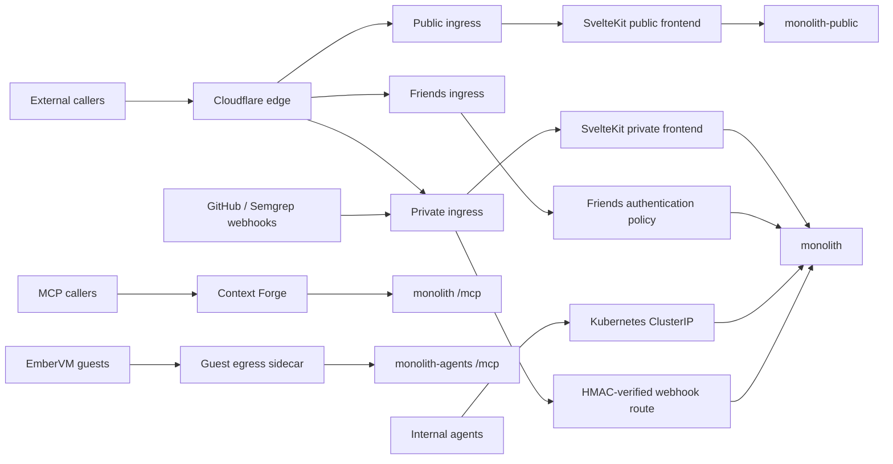

# Monolith Architecture

The monolith is the FastAPI and SvelteKit application suite for the knowledge
graph, conversational agents, isolated agent sessions, and small public data
products. It is deployed as separate private, public, and agent compositions
over a shared Postgres data plane, with a separately gated friends surface.
Production serves from the GKE hub since the September 2026 cutover; the home
cluster deployment is dormant.
(see: /projects/monolith/app/main.py)
(see: /projects/monolith/app/main_public.py)
(see: /projects/monolith/app/agents_main.py)
(see: /projects/gke-apps/monolith/application.yaml)

Current as of a93980260 (2026-09-05)

## 1. What it is and request paths

The backend is a FastAPI application assembled from domain modules, while the
browser application is SvelteKit. Together they host the knowledge graph,
Discord agent, agent console, Grimoire, and public applications.
(see: /projects/monolith/framework/core.py)
(see: /projects/monolith/frontend/src/routes)

The deployed service has three audience tiers, plus the agents tier of sections
2 and 7: the private monolith carries the full route and MCP surface, the public
deployment is a pruned composition on a read-only database role with a
separately scoped writer for the two public chat domains, and the friends tier
exposes only the moving planner, its browser API, and the SvelteKit bundle. The
friends hostname has no Cloudflare Access application in front of it, only an
authentik `SecurityPolicy` that is a separate object from its route, so verify
the deny path against the live URL with the checklist kept beside the
`cfIngress.friends` values rather than trusting the manifest.
(see: /projects/monolith/app/modules_private.py)
(see: /projects/monolith/app/modules_public.py)
(see: /projects/monolith/deploy/values.yaml)
(see: /projects/monolith/chart/templates/httproute-friends.yaml)

The public and private ingress split, the friends policy, and the internal
service ports are rendered by the Helm chart. Two routes on the private
hostname carry no `SecurityPolicy` on purpose: the GitHub and Semgrep webhook
paths reach the backend through a Cloudflare Access IP bypass and are
authenticated by the handler's HMAC verification alone, which is why they live
on their own HTTPRoute rather than as rules on the private one.
(see: /projects/monolith/chart/templates/httproute-private.yaml)
(see: /projects/monolith/chart/templates/service.yaml)
(see: /projects/mcp/ARCHITECTURE.md)

Where the Cilium CRDs exist, the application pod is default-deny for ingress. A
`CiliumNetworkPolicy` allow-lists each caller by namespace and port: the
gateway on 3000 and 8000, Context Forge on 8000, the workflows namespace on
8000, and EmberVM on 8091 and 3000. A caller that is not listed fails as a
silent dial timeout rather than a readable deny, so a new in-cluster consumer
needs an entry in the same change. The public tier carries the equivalent
ingress policy plus off-cluster default-deny egress with a single Turnstile
allow. None of these policies render on the GKE hub, which ships Cilium without
its CRDs, so every tier there runs with no network policy until a native
replacement lands (#5656 for the agents tier; the private tier's default-deny
egress was already open as #5143).
(see: /projects/monolith/chart/templates/cilium-ingress-policy.yaml)
(see: /projects/monolith-public/chart/templates/cilium-policy.yaml)
(see: /projects/monolith/deploy/values-gke.yaml)

**Why.** The anonymous SSR surface once shared a pod, backend, database role,
and full secret set with the private application, so an ingress mistake or
public-process compromise crossed every boundary at once (ADR security/004).
A feature-flagged full application and a replica without scoped grants were
rejected because both retain that escalation path. Separate compositions,
database identities, and fixed audience routes make private exposure the
default, accepting another deployment and several policy bindings to operate
(ADR networking/002, ADR services/010).

## 2. Modular framework

`framework/core.py` defines the registry contract through `Tier`, `Profile`,
`Module`, and `build_app`. A profile selects public or private behavior and
controls MCP, telemetry, static frontend, deep health, and leader singleton
wiring. Each domain exports a `Module` and contributes private routes, public
routes, MCP registration, startup work, leader hooks, or health checks.
Registration uses module hooks, while MCP tools themselves use FastMCP
decorators.
(see: /projects/monolith/framework/core.py)
(see: /projects/monolith/app/modules_private.py)
(see: /projects/monolith/core/mcp_app.py)

Cross-domain imports must enter another domain through its `api` module. The
boundary test parses every non-test Python file and reports internal imports,
with no standing exceptions.
(see: /projects/monolith/import_boundaries_test.py)

The public profile registers only `register_public` hooks and has no private
lifespan, MCP mount, telemetry setup, or static frontend mount. The public
binary also prunes private domains and private write paths from its file set,
and a subprocess test checks that forbidden modules never enter its import
closure.
(see: /projects/monolith/BUILD)
(see: /projects/monolith/app/main_public_imports_test.py)

The agents tier is a third composition with no registry at all. Its entrypoint
builds a Starlette app that serves exactly four knowledge tools over stateless
MCP plus one health route, behind identity middleware that rejects anonymous
callers. The binary is pruned by source glob, and an import test proves the
private domains never enter its closure.
(see: /projects/monolith/app/agents_main.py)
(see: /projects/monolith/app/main_agents_imports_test.py)

**Why.** Domain boundaries originally existed only by convention, allowing
internal imports and composition glue to spread while public and private
entrypoints risked drifting (ADR platform/008, ADR services/010). Independent
services and databases per domain were rejected as disproportionate, and a
base-class or dependency-injection framework was rejected because it would
couple every domain to more machinery. Plain module descriptors, one
`build_app`, endpoint-shaped `api.py` seams, and an AST boundary test preserve
one deployable system while making future extraction and review explicit. The
agents tier applies the same rule to guests: a pruned binary with its own
database identity, rather than an MCP sidecar inside the private pod, bounds
what an agent can write by a grant set and a source glob instead of by trust
in the guest.

## 3. Data

One CloudNativePG cluster holds the monolith data. Production sets two
instances, which gives one primary and one streaming hot standby for
availability and read traffic. The hub's cluster was bootstrapped by recovery
from the home cluster's Barman archive in Google Cloud Storage and keeps
archiving there under its own server name, so the two archives never share a
prefix. Daily base backups plus continuous WAL archiving keep fourteen days.
(see: /projects/monolith/deploy/values-gke.yaml)
(see: /projects/monolith/chart/templates/cnpg-cluster.yaml)
(see: /projects/monolith/deploy/cnpg-gcs-backup-secret.md)

Atlas owns schema migration from the SQL files in `chart/migrations`. The
database is divided into domain schemas including `knowledge`, `chat`,
`agent_sessions`, `claude_agent`, `grimoire`, `ships`, `stars`, `trips`,
`campsites`, and `swarm`. The migration bundle is rendered into a ConfigMap for
Atlas, and bulk seed data is kept out of it because client-side apply records
the manifest in an annotation with a 256 KiB ceiling.
(see: /projects/monolith/chart/templates/atlas-migration.yaml)
(see: /projects/monolith/chart/templates/migrations-configmap.yaml)
(see: /bazel/tools/hooks/check-large-migration-sql.sh)

Application sessions use a cached SQLModel engine configured for psycopg, and
domain code opens bounded session contexts around database work. Knowledge
chunks store 1,024-dimensional pgvector embeddings under a cosine HNSW index,
and the knowledge store ranks semantic matches before hydrating note and graph
context.
(see: /projects/monolith/core/db.py)
(see: /projects/monolith/chart/migrations/20260408000000_knowledge_schema.sql)
(see: /projects/monolith/knowledge/store.py)

The public read role receives explicit schema and object grants, including
definer's-rights views (deliberately not `security_invoker`) that expose only
public knowledge rows. The public write role has DML only on the bounded public
chat schemas and specific demo latch tables. The agents tier connects as
`agents_writer`, whose grant set is read across `knowledge` plus insert on four
tables and nothing at all on the private application schemas. Each of these
roles takes its password from an out-of-band basic-auth Secret because the
1Password operator cannot emit the Secret type CNPG requires.
(see: /projects/monolith/chart/migrations/20260617000000_public_reader_role.sql)
(see: /projects/monolith/chart/migrations/20260904180000_agents_writer_role.sql)
(see: /projects/monolith/chat_public_grants_test.py)
(see: /projects/monolith/deploy/agents-writer-secret.md)

The home overlay's nightly logical refresh into a development database (dumped
from the primary, because a standby cancels any query that blocks WAL replay)
is off on the hub, which has no development database.
(see: /projects/monolith/chart/templates/cnpg-dev-refresh-cronworkflow.yaml)

**Why.** Keeping Obsidian and Postgres as writable peers created synchronization,
conflict, and recovery questions, while a filesystem mount inside every replica
expanded the serving path and security surface (ADR platform/006). Postgres was
chosen as the body of record and as Grimoire's hot tier so transactions,
pgvector, grants, and backups share one operational substrate rather than adding
a service or datastore per domain (ADR services/011, ADR services/012). Schemas,
roles, and definer's-rights views provide the isolation; the physical standby is
accepted for availability and load isolation, not confidentiality (ADR
security/004).

## 4. Agents

`agent_sessions` persists sessions, turns, pending messages, progress, model
selection, workflow ownership, and EmberVM lineage in Postgres. Pending turns
are claimed in sequence by one replica, refreshed by heartbeat, and reclaimed
after a stale lease so a crashed worker does not strand work. A turn whose
brick is preempted mid-flight is resumed or re-issued rather than lost, and the
model the guest actually ran is persisted on the turn.
(see: /projects/monolith/agent_sessions/models.py)
(see: /projects/monolith/agent_sessions/store.py)
(see: /projects/monolith/chart/migrations/20260903030000_agent_session_recovery.sql)

Model names map to three runtime families. `spark` selects the Pi family and
its dedicated workload (`qwen` survives only as a legacy alias for persisted
sessions), `luna`, `terra`, and `sol` select Codex dispatch, and `opus`,
`sonnet`, and `fable` select Claude dispatch. The production list is explicit
in chart values, so a newly supported model never appears in the console or the
Discord command without a values change. Turns cross the EmberVM boundary
through a session API: the Claude, Codex and Pi runtimes are `session` class
guests, while `run_code` selects disposable language-specific task workloads,
and both kinds are vsock-only with no NIC.
(see: /projects/monolith/agent_sessions/__init__.py)
(see: /projects/monolith/agent_sessions/transport.py)
(see: /projects/monolith/sandbox/mcp.py)
(see: /projects/embervm/ARCHITECTURE.md)

Swarm is the DBOS layer that composes sessions into durable workflows. The one
engine today is `implement_then_review`: a Luna implementer session, an Opus
review session, bounded attempts and review cycles, and a plan pinned into a
step record at start so replay can never see a budget move. The pinned
`budget_usd` is enforced at node boundaries. Every structured output an agent
makes, review verdict and rationale record alike, arrives through one typed
artifact channel validated at ingestion; nothing structured is parsed out of
prose. For a legacy swarm run the workflow's Python control flow is still the
graph, so the orchestration-level mutable DAG that ADR agents/062 decided
reaches those runs only when this engine is retired (#5419, #4781).
(see: /projects/monolith/swarm/workflows.py)
(see: /projects/monolith/swarm/budget.py)
(see: /projects/monolith/swarm/turn_artifact.py)

The factory lane is where that mutable DAG does exist. `swarm/factory_conductor.py`
reconciles a versioned graph outside durable replay, and `swarm/graph.py` owns
the versions, cycle and dependency checks, protected acted nodes and immutable
dispatch pins. The planner builds the whole DAG at plan time through one `plan`
decision whose edits apply atomically under a single expected revision, the
reconciler dispatches each ready node as its own pinned unit, and a review that
returns `changes_requested` opens a correction and re-review pair the engine
appends itself, bounded by the policy's `max_review_rounds` (default 2). A round
that fails is reopened the same way, against the same reviewed head and
findings, with the failed round counted against the bound. The
planner is called back only for a named deviation: no plan applied yet, a node
that failed or escalated with no runnable retry, review rounds spent, a fan-in
the engine could not open, or a settled graph with no verified delivery.

The accepted plan sizes the task. Its allowance is the sum over live
unsucceeded nodes of `max_attempts`, plus the work turns history already spent,
plus what the engine may still insert on its own. Review rounds are reserved one
at a time: the next round only, at the two turns it costs, because the engine
inserts its correction and its re-review at one attempt each. Each inserted
round is then counted like any other live node while the round behind it is
reserved, so the allowance grows by one round at a time. A fan-out wave reserves
its one fan-in node at the policy's `max_attempts`, exactly as the inserted node
will carry, so that insertion is turn-neutral. Every insertion is checked
against the envelope as it happens, and an engine insertion is checked on the
nodes it really adds, with no forward reserve counted on top: that reserve is
headroom for the planner's next edit, not a charge against the round the engine
is opening. Money is the same sum over node cost
ceilings plus charged history. Review rounds are reserved only when the plan
holds a review node. That allowance is
persisted on the receipt with the graph revision it came from, re-derived and
audited on every accepted plan, add, discard and engine round, and it is the
bound `authorize_start` and the board actually read. Policy keeps only an
envelope, `max_task_turns_hard` beside `task_budget_usd` and the deadline. An
edit whose derived allowance would exceed either is refused whole with
`envelope_exceeded` and the excess named as needed against allowed, beside the
spare turns and dollars the graph still leaves under the reserve that edit
implies, which reaches the planner as decision feedback so it can shrink the
edit, split the work, or pause.

Nodes that can start together fan out, up to `max_parallel_nodes`. A wave is
read from the live graph rather than from the plan as a whole: source-writing
nodes that have never run, whose dependencies are all already on the task
branch, and that no dependency path connects to each other. Each member works on
`factory/<task-id>-<node key>`, a sibling of the task branch rather than a path
below it, and an `integrate` node depending on all of them merges those branches
into the task branch and reports the integrated head. The planner may name that
node itself; otherwise the engine inserts `integrate_<n>` over the wave and
repoints whatever depended on those branches at it. A node only takes a branch
of its own once the fan-in that will merge it exists, so a refused fan-in asks
the planner rather than stranding work, and the branch a node first ran on is
pinned for every later attempt. While a wave is open it is the only source of
source-writing work that may start, so a node outside it waits rather than
becoming a second writer on the task branch. Fan-out is off entirely at a
parallel limit of one, a planner-authored integrate node included: its members
run serially on the task branch and it merges nothing.
The lane is two lanes. A task's lane follows its class: work that ends in a
pull request is delivery, work that ends in a comment is advisory. The policy's
`max_tasks` bounds each separately, the chart's `swarm.factoryMaxConcurrentTasks`
bounds their sum, and intake fills at most one candidate per lane per tick, so a
full delivery lane never starves advisory work and the reverse. A `quota_guard`
block watches the shared Claude 7-day window and, while it is nearly spent,
routes review down the `reviewer` pool instead of spending it: nothing is held,
admission is untouched, and Opus returns on its own below the resume threshold.
The model is chosen when a review is dispatched rather than when it was
planned, so the node keeps the planner's preference and the immutable pin
records what really ran. Judgment work waits for Opus instead of falling back,
and so does any review when no pool member has quota, because review is the
gate. Transitions are recorded once each in the audit ledger, so a replica
restart cannot forget a fallback mid-task, and an unknown or stale reading
neither starts nor ends one.
(see: /projects/monolith/swarm/factory_conductor.py)
(see: /projects/monolith/swarm/factory_quota_guard.py)
(see: /projects/monolith/swarm/graph.py)
(see: /projects/monolith/swarm/deviations.py)
(see: /projects/monolith/swarm/FACTORY.md)

**Why.** Autonomous intake lets the bounded lane discover delivery-ready work
without making the operator continually copy issue numbers into policy, while
keeping that authority inert by default and capped by labels, cooldown, and a
daily limit. Issues that are not ready can take a separate refine-or-escalate
path: one bounded node writes a structured brief, and the server trusts only
the label and comment it re-reads from GitHub. This makes readiness evidence an
observable issue state and keeps an unresolved human decision from entering the
delivery DAG (#6002). The receipt stores the task class because intake decides
it once and routing and audits must retain it across later policy changes. ADR
agents/038 decision 5 gives judgment work an Opus-or-better implementer floor
because no machine oracle can verify its correctness; quota pressure parks that
work instead of demoting it.

**Why.** The chart ceiling and the per-lane maxima are set in two places and
neither said which was binding, so a ceiling of 4 under lanes of 4 and 8 gave
the advisory lane nothing: the limits handed delivery its whole maximum first
and one sweep excluded 272 advisory candidates as lane_full. The ceiling is now
12, high enough to cover both lanes, and when it is not, the free part of it is
dealt to whichever lane is furthest from its own maximum rather than reserved
for delivery, with delivery keeping the first slot so it is never unable to
start. The sweep names the mismatch as lane_ceiling_below_lanes. Twelve tasks could
also hold every slot in the background session pool the drainers and the probes
share, so factory dispatch now leaves a reserve there and every node is gated on
it, the first node of a settled graph included: the factory is the only member
of that pool whose work can simply wait for a later tick, so it is the one that
yields. The same lanes
also filled at one slot an hour, because a sweep takes one candidate per lane
and the sweep clock only re-opened on the hour or on a settlement. An admission
re-opens it too, which costs one extra sweep per admission and lets a lane fill
over consecutive ticks (#6002).

**Why.** Landing exists because approval was not delivery: #3877 was shipped as
PR #6007 whose body carried no closing keyword, so the issue stayed open with
`agent-ready` intact and the next generation's sweep admitted it again as fresh
work. The fix is three separate facts rather than one. Intake excludes any issue
with a succeeded receipt, so the lane's own delivery record is what says work is
done and the issue's labels are not. The delivery gate reads the pull request
body back from GitHub and refuses a body that does not close its issue, naming
the refusal so the planner can act on it. And landing, behind an `auto_merge`
flag that defaults off, arms the merge and closes the issue against the merge
it observes, one pull request at a time because the merge queue ejects
everything behind a failed candidate. That holder is read from GitHub as well as
from the lane's own audits, because an operator arming a factory pull request by
hand puts it in the same queue, and landing selects on landing state rather than
recency so a burst of newer settlements cannot evict the armed delivery from the
batch that observes it. An ejection is a state the lane names and re-arms once
rather than a wedge, and a head that moves under an armed pull request takes the
arming back off. Landing stops at the merge: verifying the
chart write-back and the live rollout is a node that does not exist yet
(#6002).

**Why.** The factory has two lanes because Opus review is the only scarce
input it has. Implementation capacity is three spot brick nodes behind the
autoscaler, and the implementers on the other end of it bill someone else or
almost nothing, so a single concurrency number was rationing the wrong thing:
it held back advisory work, which passes no review gate at all, in order to
protect a reviewer that advisory work never calls. Splitting the bound lets
delivery stay as narrow as review can sustain while advisory work runs at
whatever the platform holds. The quota guard applies the same reasoning to the
window rather than to the count. Review is what spends the shared Claude
subscription, and running it to zero would cost the operator their own sessions
rather than only the factory's, so a nearly spent window buys a cheaper
reviewer rather than stopping delivery: the work that does not need Opus was
never the thing to hold. Independence is what a review gate is actually for,
and that is a property of the session, so a cheaper reviewer is a weaker
opinion rather than a weaker gate. The two things that do wait are the two
where no substitute exists: judgment work, whose floor is a capability and not
a price, and a pool with nothing left in it. An unknown reading neither starts
nor ends a fallback, because reacting to an unreachable token broker in either
direction is acting on something nobody has read (#6002).

**Why.** The bootstrap asked the planner for one graph edit at a time, so a
single task (#5981) spent nine starts on five pieces of work: five were planner
turns that added one node each, and a review that requested changes went back
to the planner to restate findings the review had already written. Planning is
the most expensive turn in the lane and the one least able to add information
when the next step is mechanical, so both the shape and the loop moved into the
server. A plan-time DAG lets one planner turn express the dependencies the
graph machinery already enforced but never saw, and a bounded review loop runs
the deterministic part with no model in it. The round bound is server policy,
counted from the version ledger rather than from live nodes, so a planner
cannot replenish it by renaming or discarding a correction node, and
`correct_<n>` and `review_<n>` are refused as decision node keys for the same
reason. Those same two refusals are why the engine, not the planner, reopens a
round that failed: a `correct_<n>` whose guest ended its turn without pushing
leaves a node the planner may not name and, because it has a run, may not
discard either, so handing that back to the planner asked it for an edit no
edit could express and the task only paused. Delivery stays with the planner because `verify_delivery` is the gate a
completion claim has to pass, and an exhausted loop returns to the planner with
the evidence instead of failing the task (#5419).

Escalation is a pause, not a return. At each escalate point the workflow
writes a `swarm.swarm_decision` row and polls it on the cadence it already
polls session turns; a human answers through the console, the run decision
endpoint, or the `agent_run_decide` MCP tool, with the actor recorded
best-effort the way `cancel_run` records one. An unanswered row expires after
`swarm.decisionTimeoutSeconds` and the run ends the way an unwatched gate
always did. Swarm deliberately stops short of merging: the role-separated
review gate that ADR agents/027 describes does not exist in code, so nothing
autonomous lands on main, and the only agent-merged path is docfix auto-merge,
off by default and refusing agent instructions, skills, runbooks and ADRs even
when on.
(see: /projects/monolith/chart/migrations/20260822230000_swarm_decision.sql)
(see: /projects/monolith/swarm/router.py)
(see: /projects/monolith/deploy/values.yaml)

The work-queue drainer turns a standing backlog into continuous progress. An
Argo tick every fifteen minutes asks the leader to start `drain_cycle`, a
leader-owned DBOS workflow that claims `claude_agent.routine_jobs` rows under
the existing skip-locked lease, runs each as one fresh Luna session, and
completes it. Two job kinds are claimed: the general lane (`qwen-drain`, a
legacy name kept so registered rows stay claimable) and knowledge extraction
(`kg-drain`, capped per day with manual burst grants). Draining is serial by
design, the tick's suspend and the `agents.drainer.enabled` value are the two
kill switches, and a stall advisory rather than a Discord notify is the default
failure surface.
(see: /projects/monolith/swarm/drainer.py)
(see: /projects/monolith/agent/routine_jobs.py)
(see: /projects/monolith/chart/values.yaml)

The agent console is served at `/agents` on the private hostname as an
inbox-first surface: rows state the ask, a run view draws the plan, decision
records and walkthrough, a knowledge extraction queue lane shows the drainer's
backlog, a VM map reads the control plane and is deliberately empty when it is
unreachable, and the voice companion is a ledger-first screen the conversation
drives. The route is grouped under the private tree behind the private ingress
authentication policy. Session output reaches Discord only when a turn needs a
human, unless the session is bound to a thread.

The factory board at `/agents/factory` is the operator's view of the factory:
a state strip, then in flight, queue and recent panels, each task drawn as its
plan (nodes ranked by dependency, one attempt row per node with the session it
ran in) beside its starts and stop events. It reads one board endpoint,
`GET /api/agents/factory`, a read-only join of the factory status, plan graph,
node runs and session summaries that sits beside `/api/agents/sessions` rather
than under the operator-gated `/api/swarm/factory` routes, because the browser
on the private tier carries no bearer and the board is a view, not a control.
A card's "Discuss with the conductor" link opens the console with an Astra
session prefilled with that task's plan, so a sync with the conductor is an
ordinary session rather than a second chat surface. The launcher leads with a
factory strip above the knowledge extraction queue strip.
(see: /projects/monolith/frontend/src/routes/private/agents/+page.svelte)
(see: /projects/monolith/frontend/src/routes/private/agents/factory/+page.svelte)
(see: /projects/monolith/agent_sessions/factory_view.py)
(see: /projects/monolith/agent_sessions/voice.py)
(see: /projects/monolith/chart/values.yaml)

A factory start reserves a ceiling and settles at the cost its node result
reports. Codex-backed models report no provider cost, so a result falls back to
the list price the turn store computed from token usage, and every result
carries the basis it settled on: provider, list, or unknown. The graph surfaces
that as an accounting basis of reported or list_priced beside the reserved and
accounted figures. Only known completions settle at a priced amount. Unknown
execution retains its whole reservation, and a completion with no price at all
still consumes its ceiling. The receipt counts work starts as `turns_used` and
conductor rounds separately as `planner_turns_used`. Work starts meet
`max_turns_per_task` and planning rounds meet `max_planner_turns`, an optional
policy field that inherits the work cap when a policy predates it.
(see: /projects/monolith/swarm/factory_controls.py)
(see: /projects/monolith/swarm/node_workflows.py)
(see: /projects/monolith/shared/pricing.py)

**Why.** Booking an unpriced completion at its full ceiling is the conservative
choice when nothing is known about the spend, but a Codex turn is not unknown:
its token usage is recorded and priceable, so charging the ceiling overstated a
task by more than an order of magnitude and retired it with most of its real
budget unspent. A list price is an estimate, so it settles the ledger but never
fails a delivery; only a provider-measured overrun does that. Counting planner
rounds against the delivery cap let a task exhaust itself deciding, but the task
budget alone is not the answer either: a planning round costs a few cents, so
the budget would admit hundreds of them and a refused decision mints the next
planner every tick. `max_planner_turns` bounds deliberation on its own count,
leaving the work bound to the plan.

**Why.** A fixed `max_turns_per_task` is a guess made before anyone knows what
the task is. It stranded a well-formed plan that needed one more node and it
funded a trivial one at ten times its size, and neither failure told the
planner anything. The plan is the only artifact that knows how much work there
is, so it derives the allowance and policy keeps the envelope that plan has to
fit inside. Refusing an over-envelope plan whole, with the excess named, is
what makes the bound actionable: the planner can split the work into a
follow-up task or pause for orchestration review instead of discovering the
wall one turn at a time. `max_turns_per_task` is still accepted and read as the
envelope, so a live policy needs no re-post. Reserving every remaining review
round up front then reintroduced the same failure from the other side: at two
nodes of `max_attempts` per round, two rounds cost eight turns of allowance on
top of the plan, so a nine-turn envelope could not hold a three-node plan and a
task with any history could not add a review node at all (t-5e48b6e1, #5981).
The reserve is lazy instead, the next round only and at the two turns the engine
really inserts, and the envelope is checked again at each insertion, which is
the check that was doing the work all along. The same reasoning keeps the
reserve out of the engine's own check: headroom the planner needs for sizing
would otherwise refuse a round the envelope can afford because of a round that
may never open. Naming the spare turns and dollars in the refusal is the other
half, computed under the reserve the refused edit implies: a planner that only
hears no, or that shrinks to a figure which ignored the reserve its own review
node brings, re-proposes until `max_planner_turns` pauses the task (#5419).

**Why.** Nodes were serial because every node pushed to the one branch
`factory/<task-id>` and the reconciler dispatched one active run per task, not
because the plan said they depended on each other. Giving concurrent
implementations their own branch and fanning them back in through one integrate
node before review is the shape #5861 point 5 asks for: parallel contributors
feed one integration branch per coherent slice, with the required checks at the
integrated head. The branch is a sibling name rather than a path under the task
branch because git cannot hold `refs/heads/factory/<id>` and a ref below it at
the same time. Which nodes fan out is read from the dependencies the planner
already wrote rather than from a separate marker, so the branch a node pushes to
and the order the graph enforces can never disagree. Reading it as a wave rather
than as plan-wide concurrency is what keeps a node added by a later replan off a
branch of its own: its siblings have already run and been integrated, so it has
nobody to run beside and works on the task branch serially. Fan-out is off until
an operator raises `max_parallel_nodes`, and the extra concurrent guests are
gated on the shared session pool first, so a node the pool cannot hold stays
ready for the next tick rather than failing (#5419, #5861).

**Why.** An unconfirmed delivery error is one hold represented consistently
across the turn, capacity reservation, routine job and health views. Capacity
is released only by the explicit reconciliation owner after fresh authoritative
terminal proof for the exact guest, generation, session and turn. Uncertain
permit cessation settlement is behind
`agents.sessions.uncertainPermitSupervisionEnabled`, which defaults off. It
covers kg and project drainer permits, interactive permits, and factory-owned
project permits. When probe supervision is also enabled, it extends probes to
destroyed and no-guest proof. A bound guest requires exact control-plane
eviction or timestamped destruction after the failed turn, and a guest that
ceased without ever being stopped reports no stop precondition, so the factory
path takes its identity from the committed stop intent or from the observed
invocation. Both loops order that invocation against the failed turn rather
than against the dispatch, because the dispatch stamp is written when the
executor claims the turn and so lands before the guest is ever invoked. A
no-guest permit requires durable
claim evidence with no guest, binding or residual lineage evidence, and an
operator destroy no longer clears a binding under an unresolved outcome, so a
cleared binding cannot masquerade as one that never existed. A drainer permit
whose routine job row is still parked on the attempt is left to the operator
reconciliation path, and that path only handles kg jobs: it refuses any
`routine_kind` other than `kg-drain`. `swarm/drainer.py` holds the job on every
`InvocationOutcomeUnknown`, so the held row is the rule for drainer permits
rather than the exception, and a held non-kg job currently has no owner at all
(#5983). What this loop covers for drainers is the narrower shape where the
workflow died before the hold was written, leaving the job row still armed. The
two KG permits from the 2026-09-09 stall are held rows and still need the
operator path. The shared settler preserves the session binding, while
factory-owned sessions use the factory settlement path. Factory attempts with
no bound guest remain held until that path can prove no delivery. Legacy swarm
`implement_then_review` sessions stay a residual:
they are project tier with no routine job and no factory pin, so nothing
settles them, and covering them needs a check that their DBOS workflow is
terminal, which this loop does not have.
(see: /projects/monolith/agent_sessions/permit_supervision.py)

**Why.** A lost invoke response is not a lost invocation. Every monolith
rollout cancelled the executor watching an in-flight turn, and the guest went
on working while the executor recorded `invocation_outcome_unknown`, failed the
session and left supervision to destroy a guest that was mid-turn. Three
factory attempts died that way in under an hour on 2026-09-11, which made the
factory's own deploys its largest self-inflicted loss (#5938, #4322). The guest
already publishes its complete native record to a result receipt before it
writes the synchronous response, so the evidence survives the observer. What
was missing was a state between "finished" and "unknown". A dispatch whose
response is lost while the control plane still shows its guest running, with an
invoke started and no invoke completion, is now held: an interrupted turn with
stop reason `response_lost`, the pending row keeping its claim so nothing
re-dispatches the prompt, and the permit keeping its state so nothing releases
capacity the guest is still consuming. The recovered attempt is finished from
the committed receipt through the ordinary turn writer, so the recovered result
passes the same parser, diff, artifact and permit validation the synchronous
response would have, and the model runs once. The live thirty-second claim
stamp used to be the only thing authorizing a receipt read, and an executor
that lost its response stops refreshing it, so the durable hold takes its place:
it is dispatch-exact, bounded and names one receipt, and every other ownership
condition is unchanged. A held adoption sets no guest reuse fence, because the
fence exists so a follow-up waits for the original POST's own response and after
a replica loss nobody is left to clear one. Holds are bounded by the invoke
budget clamped to the twelve-hour workload backstop, and a guest that has ceased
or that completed its invoke without publishing ends the hold early, both into
the same unknown outcome reconciliation already handles. Replica shutdown
writes the hold synchronously from the executor's own cancellation handler
rather than from a lifespan hook: the pod has a thirty-second grace with no
preStop and `DBOS.destroy()` waits zero seconds for workflow completion, so a
hook has no way to reach the in-flight calls and a second cancellation would
take away one more await. A replica killed outright writes no marker at all,
so the claim lease is the backstop: a stale claim that already has an
unconsumed committed receipt is held, and one with no receipt settles unknown
exactly as before. Behind `agents.sessions.responseLostRecoveryEnabled`, which
defaults off and needs `resultReceiptsEnabled`, since without a receipt a hold
would only delay the same unknown outcome.
(see: /projects/monolith/agent_sessions/store.py)

Monolith batch work is rendered as Argo CronWorkflows in the workflows
namespace, whose controller owns cadence, concurrency, deadlines, and history.
Each entry runs the digest-pinned jobs image with one `jobs_main.py`
subcommand. A job pod gets `DATABASE_URL` from a Kyverno-cloned Secret plus
whatever the entry declares, never the deployment's environment. Entries marked
`internalApi` only POST a private endpoint on the leader (the drain tick, the
synthetic probes, the Semgrep harvest), so that work runs inside the API pod
where the credentials already live. Suspended entries remain available for
manual submission.
(see: /projects/monolith/chart/templates/cronworkflows.yaml)
(see: /projects/monolith/app/jobs_main.py)

Leader election scopes side-effecting singleton hooks to one API replica: the
Discord bot, outbox drain and message-lock sweep, AIS ingest, the agent-session
loops (pending-message sweep, title refresh, Ember-session export into the
knowledge graph), the DBOS runtime, and the continuous-delivery probe writer. A
failing singleton resigns and retries rather than ending leader election, and a
failed acquire backs off while followers keep serving.
(see: /projects/monolith/framework/core.py)
(see: /projects/monolith/chat/leader.py)
(see: /projects/monolith/agent_sessions/module.py)

**Why.** Terminal-lived runs and process-local queues could not survive a
restart, support multiple frontends, or provide a queryable history (ADR
agents/007). Putting every idle or short turn into an Argo Workflow was rejected
because each run becomes a high-churn etcd object and snapshot-backed sessions
wait on events rather than run to completion (ADR agents/019, ADR agents/022).
Leased Postgres rows own ordered turn dispatch, EmberVM owns isolated execution,
and short DBOS workflows own bounded multi-step recovery. This accepts polling
and reconciliation latency in exchange for one durable record shared by MCP,
the browser UI, and swarm orchestration (ADR agents/049, ADR agents/053).
Escalation waits on a polled row rather than a DBOS message because the
codebase's one rule about waiting is poll-shaped end to end and the audit
fields have to live somewhere durable regardless (ADR agents/060). The drainer
composes an Argo tick, a leader-owned workflow and the routine-job lease that
already existed rather than a new queue table or a hosted routine, because ADR
agents/038's work queue was never built and a hosted routine spends Claude
quota to babysit work billed elsewhere (ADR agents/061). Graph mutation belongs
at the orchestration level and never inside a durable workflow, because a
workflow that reads mutable state recovers wrongly on replay (ADR agents/062).

## 5. Chat

The Discord bot handles direct messages, mentions, replies, ambient engagement,
slash commands, thread sessions, and streamed response edits. The bot and its
two supporting loops run only on the elected leader. Synchronous replies use a
hosted route pinned to one OpenRouter provider for speed; clearing the model
and base URL in values reverts to the Spark path without a code deploy, and on
the hub that path is Meta's hosted API rather than an in-cluster server.
(see: /projects/monolith/chat/bot.py)
(see: /projects/monolith/deploy/values.yaml)
(see: /projects/monolith/deploy/values-gke.yaml)

Proactive work is scheduled rather than reactive: hourly changelog summaries
for three repositories, a reminders drain every two minutes, a weekly directive
observation pass and a daily directive autopilot, daily channel summaries, and
weekly safeguards training, all as CronWorkflows. The orchestrator brief
compiler decides chat against task submission on channels that hold the
`orchestrator` consent grant, with an ordered provider fallback chain that
fails open to direct submit.
(see: /projects/monolith/chart/values.yaml)
(see: /projects/monolith/chat/orchestrator_client.py)
(see: /projects/monolith/chat/acl.py)

Trust and safety is a per-server, per-user ledger with three detection lanes:
narrow regex heuristics on every observed message, an asynchronous LLM intent
classifier on relevant messages, and an offline-trained random forest that is
shadow-only until a model row is promoted to live. Scores start at a ceiling,
decay back on a fixed per-day recovery, and soft-lock engagement below a
threshold; the constants live in `chat/safeguards.py` and are
environment-overridable. A pardon restores the score and relabels recent
training events as benign, turning a false positive into supervised feedback.
(see: /projects/monolith/chat/safeguards.py)
(see: /projects/monolith/chart/migrations/20260711220000_chat_safeguards.sql)

Public chat v3 verifies a Turnstile challenge before minting a session and
applies turn, token, prompt-size, concurrency, and shared GPU admission limits.
The write path uses its restricted public database identity. On the hub its
inference is the hosted Spark API at a global concurrency of one, set as a
whole environment list in the GKE overlay because the chart carries that list
as a literal. Grimoire chat is a parallel public chat surface grounded by
pgvector retrieval over the Grimoire corpus; it streams model output, compacts
long conversations, and shares the same admission and resource-control pattern,
but its chat input is text rather than a multimodal message payload.
(see: /projects/monolith/chat_public/limits.py)
(see: /projects/monolith-public/deploy/values-gke.yaml)
(see: /projects/monolith/grimoire_chat/router.py)

The WhatsApp gateway is a transport-only Go service in its own single-replica
Deployment with a household agent path behind it. It holds an external session
singleton, so it is parked during the cutover window and comes back on the hub
only once the home deployment is off.
(see: /projects/monolith/whatsapp)
(see: /projects/monolith/deploy/values.yaml)

**Why.** LLM-only abuse detection was rejected because it charges a model call
for every message and lets a flood turn the detector into the resource drain;
hard bans and deletion were rejected because recoverable red-team play is part
of the friends surface (ADR chat/003). One ledger and one enforcement choke point
combine cheap deterministic signals, asynchronous semantic judgment, and a
shadow-first learned model. The design accepts delayed LLM verdicts and tunable
false positives, with score recovery and pardon providing the correction path.
Anonymous chat adds Turnstile and bounded admission because its GPU and write
paths cannot rely on an authenticated principal (ADR security/005).

## 6. Knowledge and Grimoire

The knowledge graph learns from evidence lanes. Every input becomes an
immutable `knowledge.raw_inputs` row, body content-addressed in object storage,
with a `source` naming its lane: finished Ember sessions (a leader loop with a
per-session watermark and a pinned since-floor), local Claude and Codex
sessions uploaded by a collector on the Mac over the tailnet, an hourly
read-only repository diff scout, and the intentional reports
`report_knowledge`, `dispute_fact`, and `report_distress`. Extraction is a
`kg-drain` job on the drainer: the monolith builds the prompt with a
source-specific lens, Luna returns candidate assertions, and the monolith
parses them and writes atoms and provenance server-side through
precision-first gates. Guests never write the graph. The account-hosted
routines and the in-process gardener that preceded this are retired. No
knowledge CronWorkflow remains today except the publication lane (15-minute
visibility flip for verified/unverified agent facts).
(see: /projects/monolith/knowledge/extraction.py)
(see: /projects/monolith/agent_sessions/kg_feed.py)
(see: /projects/monolith/chart/migrations/20260903000000_knowledge_scoped_assertions.sql)
(see: /projects/monolith/deploy/values.yaml)

Facts are anchored to entities seeded from a committed manifest
(`projects/monolith/entities.yaml`); `note_entities` edges link facts to subjects
(projects, orgs, environments) with role constraints, and extraction uses the
closed subject vocabulary and scope grammar to derive facts about the repository
rather than hallucinations.

**Why.** Facts needed a subject so the public record and the extraction lens
could speak about tangible entities (projects, organizations) rather than
hypothetical ones, and a committed manifest keeps the extraction anchors derived
from the repository rather than from model inference.

**Why.** Facts publish automatically so the public tier reflects what agents
record without a human gate on every row, while the audit queue and human holds
keep the human in the loop for review and override.

Derived facts carry `scope`, `verification_state`, `confidence`, and a validity
window as columns. A dispute opens a `knowledge.disputes` row keyed by the
stable note id, so it survives a reindex, and never deletes the disputed fact;
a distress report notifies Discord and is retained but never extracted. Doc
drift found by the repository diff feed opens human-reviewed documentation PRs
on the routine lane, a demand-driven review turn verifies them against main,
and the switch that would let it enqueue one stays off. Recall closes the loop:
every new Ember session except a `kg-drain` one gets the top facts by embedding
similarity written into its system prompt once, from its first prompt, each
marked with its verification state, and the block does not refresh as the task
evolves.
(see: /projects/monolith/knowledge/mcp.py)
(see: /projects/monolith/knowledge/docfix.py)
(see: /projects/monolith/knowledge/recall.py)

Knowledge RAG embeds a query, performs cosine retrieval over HNSW-indexed
chunks, ranks matching notes, and returns note, section, snippet, and edge
context. Public retrieval reads only the `public_api` views, never the
`knowledge` schema. The note visibility predicate is fail-closed: only an
explicit `public` value is public, public routes strip links to anything
outside the known public note set, and database views repeat the same
visibility condition.
(see: /projects/monolith/knowledge/store.py)
(see: /projects/monolith/knowledge/visibility.py)
(see: /projects/monolith/chart/migrations/20260617020000_public_api_knowledge_views.sql)

Grimoire is Postgres-first: a typed hot-tier schema (a CTI entity spine with
typed detail tables, jsonb only for irregular display payloads) rather than a
document store. The shared corpus, typed entity details, embeddings, mentions,
relationships, campaign state, and knowledge grants all live in Postgres today.
Campaign reads centralize the viewer predicate: global entities are visible to
everyone in the campaign, while non-global entities require a matching grant,
and projection then applies full, partial, or recognition-only scope.
(see: /projects/monolith/grimoire/models.py)
(see: /projects/monolith/chart/migrations/20260703070000_grimoire_schema.sql)
(see: /projects/monolith/grimoire/visibility.py)

The Grimoire ingest path converts extracted documents into ordered text and
image-derived chunks, records section hierarchy and image references, embeds
chunks, and extracts typed entities and relationships through a hosted model
whose endpoint, model and concurrency are values. Chunk loading runs daily;
extraction and hierarchy backfill are suspended, manual-only jobs.
Post-extraction stat verification and alias merging remain accepted design
work rather than current runtime passes (#3912, #3913).
(see: /projects/monolith/grimoire/ingest.py)
(see: /projects/monolith/grimoire/extract.py)
(see: /projects/monolith/deploy/values.yaml)

**Why.** Postgres replaced the vault as the served-content authority because
two writable stores made synchronization and conflict policy load-bearing (ADR
platform/006). Grimoire reused that typed, pgvector-capable hot tier instead of
adding a standalone service, and compiles audience rules into grants rather than
growing every read predicate with contextual logic (ADR services/011, ADR
services/012, ADR services/013). Extraction moved from account-hosted routines
to a queue lane on the drainer because a hosted hourly routine spent Claude
quota to schedule work Luna bills elsewhere, and a queue consumer can be
paused, capped and reasoned about with the same levers as every other drainer
job (ADR agents/063). Guests never write the graph because identity and
provenance are server-stamped: the guest that produced a candidate fact must
not be the party that asserts its provenance.

## 7. MCP surface

Two MCP surfaces exist. Context Forge remains the front door for people and
hosted agents and stores the private monolith `/mcp` server as a registered
streamable-HTTP upstream. That mount is one shared FastMCP instance populated
by modules whose profile enables MCP: cluster, agent, agent sessions, chat
directives and trust, knowledge and tasks, sandbox, Semgrep scanning,
screenshotting, and the updates journal. Most register by a side-effect import
of their decorated tool module during application composition; shotter calls
an explicit `register_mcp_tools()` instead, so its BDD specs can attach the
tools deterministically.
(see: /projects/mcp/ARCHITECTURE.md)
(see: /projects/monolith/core/mcp_app.py)
(see: /projects/monolith/shotter/module.py)

The agents tier is the second surface, for guests. `monolith-agents` runs in
its own namespace and serves four knowledge tools (`search_knowledge`,
`report_knowledge`, `dispute_fact`, `report_distress`) over stateless MCP.
Identity middleware rejects anonymous callers, the tokens are minted by
authentik's agent provider, and an Ember guest reaches the tier only through
its egress sidecar, since the guest itself has no network. The tier holds its
own database and object-storage credentials, synced into its namespace, and a
ServiceAccount with no cluster RBAC. Its chart pin on the hub is advanced by
hand.
(see: /projects/monolith/app/agents_main.py)
(see: /projects/monolith-agents/chart/values.yaml)
(see: /projects/gke-apps/monolith-agents/application.yaml)
(see: /projects/embervm/ARCHITECTURE.md)

Context Forge filters tool visibility tags against caller team membership,
which is tool-granular authorization. The monolith validates any bearer token
on each stateless MCP message, but anonymous discovery remains allowed, and
per-caller result scoping is not built (#4569), although caller tokens now
reach the monolith on the Claude.ai path. The broader gateway architecture, identity
limitations, and catalogue refresh behavior are documented in
[MCP architecture](../mcp/ARCHITECTURE.md).
(see: /projects/monolith/auth/middleware.py)
(see: /projects/mcp/ARCHITECTURE.md)

**Why.** A federating gateway originally replaced one authentication workaround
and local proxy per backend, giving remote agents one catalogue and one place for
tool-level entitlement (ADR agents/003). Per-domain MCP servers were rejected
because they duplicate deployment and access plumbing, but gateway ACLs cannot
decide whether a returned domain object belongs to the caller. The caller's
verifiable identity therefore has to reach the monolith, and ADR agents/059
chooses a direct monolith endpoint once authentik federation is ready. The live
gateway is an accepted transition cost, including catalogue refresh and a
tool-wide failure domain (ADR agents/055, ADR agents/059). Guests got a pruned
tier with its own identity instead of a sidecar in the private pod, so that
what a guest can write is bounded by a grant set and a source glob rather than
by trust in the guest.

## 8. Public apps

- `/app/hikes`: walk catalogue and forecasts, served as cacheable public data. (see: /projects/monolith/hikes/router.py)
- `/app/trips`: geotagged trip and photo feed with a private ingest path and public cached reads. (see: /projects/monolith/trips/read_router.py)
- `/app/stars`: astronomy forecasts and historical climatology heatmaps. (see: /projects/monolith/stars/router.py)
- `/app/ships`: current and historical maritime tracks and heat cells. (see: /projects/monolith/ships/router.py)
- `/app/wc2026`: cached dynamic tournament summary and odds data. (see: /projects/monolith/worldcup/router.py)
- `/app/campsites`: cached recreation-area search with weather-enriched snapshots. (see: /projects/monolith/campsites/router.py)
- `/app/grimoire`: public knowledge graph, entity explorer, adventure index, and open-book reader with extracted illustrations. (see: /projects/monolith/grimoire/router_public.py)
- `/app/notes`: Turnstile-gated, rate-limited public chat over the public knowledge graph, with a lazy graph view. (see: /projects/monolith/chat_public/router.py)
- `/app/grimoire/chat`: Turnstile-gated Grimoire RAG chat. (see: /projects/monolith/grimoire_chat/router.py)
- `/app/dr-jobs`: NHS job search over the scraped listings feed. (see: /projects/monolith/dr_jobs/router.py)
- `/app/llm-leaderboard`: model-bench results scatter. (see: /projects/monolith/frontend/src/routes/public/app/llm-leaderboard/+page.svelte)
- `/ember/{bazel,semgrep,postgres,agents,firecracker}`: the EmberVM demo pages the synthetic probes in section 9 exercise, which say when a brick was preempted and recovery is under way. (see: /projects/monolith/ember_public/bazel_router.py)
- `/artifact/{id}`: agent-built HTML served from object storage in a sandboxed opaque origin. (see: /projects/monolith/artifact/router.py)
- `/blog`, `/docs`, `/engineering`: the posts, the published repository documents (this file among them), and the engineering index. (see: /projects/monolith/frontend/src/routes/public/docs)
- `/agents` (private hostname): the agent console of section 4. (see: /projects/monolith/frontend/src/routes/private/agents/+page.svelte)

Public application responses follow the anonymous cache pattern established by
the platform CDN decisions, with route handlers declaring cache and ETag
semantics where their data permits it.
(see: /projects/platform/ARCHITECTURE.md)
(see: /projects/monolith/hikes/router.py)

**Why.** These data products share the monolith's typed data, composition,
frontend, and operational controls, so splitting each into a service would add
deployment boundaries without removing their shared storage dependency (ADR
services/010). Anonymous reads use explicit origin cache semantics and a
hostname-scoped CDN rule; per-path rules were rejected once the public hostname
became the stronger routing boundary (ADR platform/002, ADR platform/003).
Authenticated or writable features stay on private routes or use narrowly scoped
public writers, accepting the public route composition as a load-bearing review
and test boundary (ADR security/004).

## 9. Observability and health

`/healthz` is process liveness. `/api/health` executes a database query and all
registered module checks concurrently, returns 503 for fatal failures, and
reports advisory degradation without changing the 200 response. The public
`/health` route proxies it, hides internal detail strings, lists only failing
component names, caches only healthy responses, and returns an uncached 503
when the backend is unhealthy or unreachable.
(see: /projects/monolith/framework/core.py)
(see: /projects/monolith/frontend/src/routes/public/health/+server.js)

Current fatal components are stars health plus the EmberVM synthetic latches
for Bazel, Semgrep, pages, Postgres, and the Codex session. Continuous-delivery
health and the drainer's stall signal are advisory latches computed by a
private leader and read by both tiers. The combined demo probes run one hourly
CronWorkflow and the Codex lane probe runs its own hourly CronWorkflow, each
with a 2.5x staleness allowance. Codex is the one automatically scheduled
agent probe; the Spark session probe is manual-only with no health component.
(see: /projects/monolith/ember_public/health.py)
(see: /projects/monolith/core/platform_probe.py)
(see: /projects/monolith/swarm/health.py)
(see: /projects/monolith/chart/values.yaml)

The private profile instruments FastAPI and outbound HTTP calls and exports
spans over HTTP/protobuf to the platform's OpenTelemetry collector, which
forwards to Honeycomb. The endpoint value must spell out the collector's HTTP
port and the full traces path, because the exporter posts to it verbatim, and
the service name must stay on the collector's allow list or the spans are
dropped after they arrive. The frontend exports nothing, and the demo trace
waterfall returns no spans until a span store is connected (#5363). The public
stats ticker scrapes the DCGM exporter directly for GPU utilization and frame
buffer usage.
(see: /projects/monolith/deploy/values.yaml)
(see: /projects/monolith/home/observability/traces.py)
(see: /projects/monolith/home/observability/stats.py)
(see: /projects/platform/ARCHITECTURE.md)

**Why.** Process liveness alone stayed green through downstream failures, while
alert-only maintenance failures could remain unread for days (ADR embervm/031).
Composite checks therefore classify immediate serving failures as fatal and
slower debt as advisory, rather than making every degraded dependency trigger a
rollback. Healthy-only edge caching prevents an old green result from hiding an
outage, and the public response strips internal details. The private profile
exports its spans through the shared collector, while the public profile
accepts less in-process detail to keep the anonymous runtime's dependency and
credential surface smaller (ADR security/004).

## 10. Delivery

The monolith Helm chart is published as an OCI artifact. Every ArgoCD
Application for it uses the OCI chart as one source and a Git source, named
through a `$values` reference, as the second source for environment values.
Pull requests do not change the chart version or production target revision:
after merge, the publishing workflow calculates the next version, publishes the
chart, and writes the version back on the main branch.
(see: /projects/monolith/chart/Chart.yaml)
(see: /bazel/helm/write-back-versions.sh)
(see: /projects/platform/ARCHITECTURE.md)

Production is the GKE hub. Its Application layers the shared production values
and then a GKE overlay that restores replicas, turns off the Cilium policies
and the development refresh, points chat at hosted inference, and exposes the
API port on the tailnet. The checked-in `targetRevision` there is a frozen
bootstrap floor that the write-back does not maintain. Kargo owns the live
revision for `monolith` and `monolith-public`: with no development stage on the
hub, production subscribes to the chart warehouse directly, promotes
automatically, and gates only on ArgoCD reaching synced and healthy at that
moment. Git differing from the live value is correct here rather than a stuck
deploy. Read the live one:

    kubectl get application monolith -n argocd \
      -o jsonpath='{.spec.sources[0].targetRevision}'

(see: /projects/gke-apps/monolith/application.yaml)
(see: /projects/monolith/deploy/values-gke.yaml)
(see: /projects/platform/kargo/values.yaml)

The home Application is dormant (backend replicas zero by values commit,
WhatsApp off) and keeps its write-back-maintained revision as the revert lever
until the home cluster is wiped (#4964); the development overlays are inert
until development Applications exist on the hub.
(see: /projects/monolith/deploy/application.yaml)

**Why.** Branch-side version bumps made concurrent pull requests collide and
could leave a merged change unpublished, while floating OCI revisions are not
supported by ArgoCD's Helm range handling (ADR platform/009, ADR platform/011).
Post-merge, commit-derived publishing and monotonic write-back remove shared
version lines from feature branches. Kargo owns live promotion so a promotion
that cannot come up stops rather than sitting half-rolled, accepting that
runtime `targetRevision` is cluster state and, on the hub, that a point-in-time
health wait stands in for a settling window until a development stage exists
there (ADR platform/009).

## 11. Direction

Decided and not yet built, each with the issue that tracks it. A row leaves
this table when the work ships or the issue closes without it.

| Direction | Decided in | Tracks | State |
| --- | --- | --- | --- |
| The orchestration-level graph becomes a mutable DAG dispatched per node, replacing the workflow's Python control flow | section 4 | #5419 | in progress: the factory lane plans its DAG at plan time and runs engine-owned review rounds; legacy swarm runs are still `implement_then_review` |
| One factory conductor above every per-run conductor selects and coordinates work under a versioned charter, acting on Joe's behalf | The factory conductor | #5784 | not started |
| The charter document and its loader govern what the conductor may read, coordinate, or act on | The factory conductor | #5785 | not started |
| Product-goal records, the factory index, and acceptance evidence drive work selection | The factory conductor | #5786 | not started |
| Conductor journal, memory assembly, and session lifecycle persist across restarts | The factory conductor | #5787 | not started |
| One factory conversation spans web, Discord, and voice for the same conductor | The factory conductor | #5788 | not started |
| Conductor mutations are server-gated by tier, ledgered, and stoppable, with health gates before autonomous action | The factory conductor | #5789 | not started |
| Shared admission and reservations schedule product-goal work across lanes with downstream backpressure | The factory conductor | #5804 | not started |
| Autonomous intake selects bounded issue work and refines or escalates issues that are not delivery-ready | section 4 | #6002 | in progress: policy, intake selection, and the refine path are implemented behind disabled defaults |
| Per-caller result scoping restricts what each MCP caller's tool calls can return | section 7 | #4569 | not started |
| Discord chat automation gets persisted scheduled tasks, configurable message triggers, and per-channel memory notes | Decision history (services/002) | #3901 | not started |
| Grimoire post-extraction quality passes (evidence-grounded stat verification, review-approved alias merges) ship | Decision history (services/014) | #3912 | not started |
| Public chat retention and takedown purge tooling ships | Decision history (security/005) | #3899 | not started |
| A role-separated GitHub App review gate lets swarm merge autonomously | Decision history (agents/027) | #3835 | not started |

### The factory conductor

One logical conductor per operator sits above every per-run conductor and drain
lane. It runs in a replaceable fenced EmberVM session, starting on Opus, and
selects and coordinates work on Joe's behalf under a versioned charter. An
escalation means Joe is needed. Its default view answers what advanced, what is
running, what needs Joe, and why capacity is idle. Its objective is to keep all
safely available subscription quota doing useful work toward agreed product
goals while preserving platform health, interactive responsiveness, and the
capacity to finish and verify what it started. The monolith owns the durable
state and the deterministic enforcement; planning and execution stay in EmberVM
guests. Tracked by #5784 and the six sub-issues in the table below; the full
design text is on #5784.

| Aspect | Decision | Owner |
| --- | --- | --- |
| Entry point | One factory conversation across web, Discord, and voice, integrating the existing launcher (#4781) on the private agents page; no choice of model, session, run, or conductor is required | #5788 |
| Responsiveness | Input is persisted and acknowledged before model execution; one durable ordered queue feeds one executor, operator input ahead of coalesced background events; pause and stop are authenticated deterministic controls that bypass the model; status reads from records when the model is busy | #5787 |
| Charter | A versioned document under `projects/monolith`, changed by reviewed PR, with a stable identifier per clause; goals in priority order are platform stability, useful product progress, efficient quota use; the loader, prompt, admission layer and ledger expose the same version hash; a retained prompt or a replaced session cannot preserve revoked authority; the ask-first set is charter or quota-policy changes, security-relevant changes, anything needing a new or amended decision record, and irreversible or production-impacting actions outside the allowed GitOps operations, and no clause authorises a cluster write the GitOps invariant forbids | #5785 |
| Work selection | Durable records link product outcome to milestone, task, and acceptance evidence; a completion claim or a session count does not satisfy acceptance; every selected task advances an agreed goal or has a bounded maintenance allocation | #5786 |
| Factory index | A materialised join of goal and task records, sessions, runs, drainer jobs, issues and PRs, decision rows, distress, platform health, provider quota, and reservations, served as MCP tools (`factory_status`, `task_status`, `queue_next`, `overlaps`), where `queue_next` only recommends; every row carries source time and freshness, and cloud sessions are an explicit coverage gap; index rows are untrusted evidence, so every mutation revalidates target state, ownership, health, and reservations at execution time | #5786 |
| Scheduling | The conductor proposes work through #3840's existing dispatch boundary, with no second queue; the server admits it against every active provider window, observation freshness, in-flight reservations, VM and CI and review throughput, and work-in-progress limits; capacity for Joe's interactive work, the conductor, and the review and correction needed to finish admitted work is reserved first, and unknown capacity is not headroom; reservations are atomic and shared across lanes; a reset permits only a probe | #5804 |
| Continuity | Journal plus KG recall (#5680); pending actions, task focus, and operator decisions are persisted before summarisation; one active executor per operator with ownership fencing, and replacement reconciles action IDs and reservations before retrying | #5787 |
| Authority | Read, coordinate, act, and escalate are separately gated tiers; every mutation validates principal, target, tier, charter version, executor ownership, and control generation on the server; every tool call has a ledger row with intent persisted before the side effect; timestamped health inputs drive normal, reduced-concurrency, admissions-paused, and recovering behaviour | #5789 |
| Stop | Pause admissions, pause task, and stop factory have distinct semantics; stop fences the conductor and its descendants, cancels queued starts, and survives any wakeup or restart; an unreachable worker stays explicitly unconfirmed | #5789 |

Rollout priority is quota routing and observation recovery (#5753, #5803), the
message board (#5704), goal records and the read-only conductor, coordinate
with its controls, then act. Read-only index and recommendation work does not
wait for the mutation gates. Act waits on the conductor's own budget line,
shared reservations across every covered dispatch path, the health gates, and
an STPA governance pass. Reserve values, estimation margins, freshness and
probe intervals, health thresholds, work-in-progress limits, and receipt and
control latency targets are chosen and validated by the implementing issues
before the matching autonomous control is enabled. Fable is evaluated against
recorded coordination correctness, unnecessary escalations, latency, and cost
before any switch from Opus.

**Why.** A per-run conductor owns one DAG and cannot pick priorities or
reconcile overlap across local and cloud Claude sessions, Codex workers,
drainer lanes, and swarm runs, so every added run adds coordination work for
Joe. Quota observation and per-lane routing (#5752, #5753) see headroom but do
not decide what should fill it, and independent dispatchers reading the same
headroom oversubscribe it while starving review and CI. The node-boundary
budget check that closed #4784 is a building block for this, since it bounds
one run only. A second chat box beside the launcher was rejected because it
makes the operator choose an execution abstraction before describing the work.
A single unbounded conversation carrying work and controls was rejected because
a long turn delays a correction; controls therefore bypass the model.
Destroying the conductor session as the stop was rejected because it leaves
delegated work and uncertain side effects unaccounted for. The design amends
ADR agents/062 by adding coordination above individual runs and ADR agents/060
by resolving delegated decisions inside the charter before anything reaches
Joe.

---

## 12. Decision history

The ADR files were removed on 2026-09-06 (#4667); `git log -- docs/decisions/`
has the full text. ADR 064 never reached main; its text is a comment on
#5784.

The status text below starts with each historical record. `Accepted, shipped` and
`Accepted, not shipped` are reconciliation annotations based on the cited
current code. A `Draft, code exists` row records a header and implementation
mismatch without silently rewriting the decision record.

### Services

| ADR | Title | Status | Disposition |
| --- | --- | --- | --- |
| `services/001` | Discord History Backfill | Accepted, shipped (see: /projects/monolith/chat/backfill.py) | deleted |
| `services/002` | Discord Chat Automation & Reactivity | Draft, superseded in practice: reminders, ambient engagement, thread sessions and changelog posts shipped through chat/001, agents/035 and agents/043; #3901 to #3904 hold the remainder | deleted |
| `services/003` | Knowledge Search Overlay | Deprecated | deleted |
| `services/004` | D&D Sourcebook Knowledge Graph Integration | Deprecated | deleted |
| `services/005` | Repo Markdown Knowledge Graph Sync via OCI Volume | Implemented (see: /projects/monolith/knowledge/repo_docs.py) | deleted |
| `services/006` | Stars grid ingest via a dedicated job writing to the monolith DB | Accepted, shipped (see: /projects/monolith/stars/grid_gen) | deleted |
| `services/007` | Stars quality model and heatmap | Accepted, shipped (see: /projects/monolith/stars/models.py) | deleted |
| `services/008` | Stars live and historical heatmaps via month-bucketed accumulate-at-drop | Superseded in part by 009 | deleted |
| `services/009` | Stars historical climatology backfill from ERA5 | Accepted, shipped (see: /projects/monolith/stars/router.py) | deleted |
| `services/010` | FastMonolith Modular Framework | Accepted, shipped (see: /projects/monolith/framework/core.py) | deleted |
| `services/011` | Grimoire Hot-Tier Schema on Postgres | Accepted, shipped (see: /projects/monolith/grimoire/models.py) | deleted |
| `services/012` | Grimoire Postgres-First, Loom-Shaped | Accepted, shipped (see: /projects/monolith/grimoire/ingest.py) | deleted |
| `services/013` | Grimoire Knowledge Audiences: Corpus-Derived Character Knowledge as Compiled Grants | Accepted, shipped (see: /projects/monolith/grimoire/visibility.py) | deleted |
| `services/014` | Grimoire post-extraction quality passes (stat verifier, alias merge) | Accepted, not shipped (#3912, #3913) | deleted |

### Chat

| ADR | Title | Status | Disposition |
| --- | --- | --- | --- |
| `chat/001` | Ambient Feedback Loop and Directive Autopilot | Accepted, shipped (see: /projects/monolith/chat/ambient_analysis.py) | deleted |
| `chat/002` | Structured, Scope-Locked Channel-History Query for the Chat Agent | Accepted, shipped (see: /projects/monolith/chat/channel_data.py) | deleted |
| `chat/003` | Trust & Safety Safeguards (Ledger, Lockout, Shadow Forest) | Accepted, shipped (see: /projects/monolith/chat/safeguards.py) | deleted |

### Security

| ADR | Title | Status | Disposition |
| --- | --- | --- | --- |
| `security/004` | Public Read-Only Service Isolation | Accepted, shipped: separate pruned binary, `public_reader` on the CNPG standby, ingress and egress policy where the CRDs exist (see: /projects/monolith-public/chart/values.yaml). Private-tier default-deny egress still open (#5143) | deleted |
| `security/005` | Public Chat Adversarial Hardening | Implemented: Turnstile, per-session and global admission limits, single-host egress allow (see: /projects/monolith/chat_public/limits.py). Retention and takedown still open (#3899) | deleted |
| 006 | Crossing (`moving`) on `friends.jomcgi.dev` as a second authentik lane | Accepted, shipped (see: /projects/monolith/chart/templates/httproute-friends.yaml) | deleted |

### Platform

| ADR | Title | Status | Disposition |
| --- | --- | --- | --- |
| `platform/001` | Migrate Obsidian Vault into Monolith with TigerFS | Superseded by 006; Obsidian, TigerFS and Qdrant are gone | deleted |
| `platform/006` | Decommission Obsidian, Postgres as the Body of Record | Accepted, shipped: `knowledge.notes.content` in CNPG is the body of record (see: /projects/monolith/chart/migrations/20260408000000_knowledge_schema.sql) | deleted |
| `platform/008` | Monolith Module Boundaries | Accepted, shipped: `<domain>/api.py` is the only cross-domain import seam (see: /projects/monolith/import_boundaries_test.py) | deleted |

### Agents

| ADR | Title | Status | Disposition |
| --- | --- | --- | --- |
| `agents/001` | Self-Hosted Autonomous Coding Agents via OpenHands | Superseded by 004 | deleted |
| 002 | Kubernetes-Native OpenHands Sandboxes via agent-sandbox | Superseded by 004 | deleted |
| 003 | MCP Context Forge as Agent Tool Gateway | Superseded by 020, deployment remains live (see: /projects/mcp/ARCHITECTURE.md) | deleted |
| `agents/004` | Autonomous Coding Agents | Deprecated | deleted |
| 005 | Role-Based MCP Access | Deprecated | deleted |
| 006 | OIDC Authentication for MCP Gateway | Superseded by 011 | deleted |
| `agents/007` | Agent Run Orchestration Service | Implemented, later execution path evolved (see: /projects/monolith/agent_sessions) | deleted |
| `agents/008` | Cluster Patrol Loop Resilience | Accepted, not shipped in the current monolith | deleted |
| `agents/009` | Automated Test Generation Bots | Deprecated | deleted |
| `agents/010` | Recipe-Driven Agent Registry | Deprecated | deleted |
| 011 | Cloudflare Managed OAuth for MCP Gateway | Deprecated | deleted |
| `agents/012` | Knowledge Gardener Two-Tier Model Pipeline | Superseded by 013 | deleted |
| `agents/013` | Knowledge Gardener Gemma4-Only Pipeline | Deprecated; the routines it fed were retired 2026-09-04 | deleted |
| 014 | AX + Substrate as the Agent Runtime Substrate | Deprecated | deleted |
| `agents/015` | Temporal as the Orchestration Substrate | Deprecated | deleted |
| `agents/016` | NATS as the Canonical Event Stream | Accepted, built then retired (see: /projects/monolith/agent_sessions/router.py) | deleted |
| `agents/017` | Domain Event Schema and Tombstone Semantics | Accepted, not shipped | deleted |
| `agents/018` | Event-Driven Gardener Triggering via Remote-Trigger Runs | Deprecated; the routines are retired | deleted |
| 019 | Substrate Executor Interface and AgentWorkflow over Argo | Accepted, not shipped as designed (see: /projects/monolith/swarm/workflows.py) | deleted |
| 020 | Deprecate Context Forge, Serve MCP Directly from the Monolith | Superseded by 059 | deleted |
| 021 | Discord-Triggered AgentWorkflow with a Fast Hosted Model and Snapshot/Resume | Draft, evolved into agent sessions (see: /projects/monolith/agent_sessions) | deleted |
| 022 | Firecracker Snapshot/Restore Controller for AgentWorkflow (FC-Direct) | Accepted, shipped through EmberVM (see: /projects/embervm/ARCHITECTURE.md) | deleted |
| 023 | Egress Secret Proxy for Agent Sandboxes (Placeholder Substitution) | Draft, generic egress shipped | deleted |
| `agents/024` | Productive Discord Agent, Hosted-Model Tiers, and Isolated Live Artifacts | Draft, shipped in evolved form: hosted tiers became the model families, the artifact store serves `/artifact/{id}` (see: /projects/monolith/artifact/router.py); the goosecracker agent it rode on is retired | deleted |
| 025 | Three-Layer Agent Stack (firecracker-substrate, goosecracker, discord-agent) | Draft, evolved into EmberVM | deleted |
| 026 | Fast MicroVM Cold Starts and Stateful Artifact Iteration | Accepted, shipped through EmberVM | deleted |
| 027 | Agent GitHub App Roles: Implementer and Reviewer | Draft, not shipped: no `agent-review/gate` exists, which is why swarm stops short of merging (#3835) | deleted |
| 028 | Elastic Agent-MicroVM Capacity and State-Preserving Reclaim | Draft header, shipped through EmberVM | deleted |
| `agents/029` | Discord Bot Feature ACL (per-server command and repo grants) | Accepted, shipped (see: /projects/monolith/chat/acl.py) | deleted |
| 030 | fc-invoke, a Single Configurable Surface for Running Workloads in Firecracker | Draft, evolved into EmberVM | deleted |
| 031 | Control-Plane / Data-Plane Split for the Agent Substrate (cluster + node) | Accepted, shipped through EmberVM | deleted |
| 032 | Warm-Snapshot Bazel Worker as an MCP Tool Surface | Draft, partially shipped as an EmberVM demo (see: /projects/monolith/ember_public/bazel_router.py) | deleted |
| 033 | Golden-Template Distribution via Daemon-Pulled OCI Artifacts | Accepted, shipped through EmberVM | deleted |
| 034 | Per-Tier MCP Tool ACLs for Goosecracker Guests | Draft, not shipped (#3838) | deleted |
| `agents/035` | Discord Multiplayer Agent UX (Ambient Classifier, Thread Sessions, Live Task Checklist) | Accepted, shipped (see: /projects/monolith/chat/bot.py) | deleted |
| `agents/036` | Orchestrator Brief-Compiler Tier via OpenRouter | Accepted, shipped (see: /projects/monolith/chat/orchestrator_client.py) | deleted |
| 037 | Label-Driven Firecracker Node Enrollment | Accepted, shipped through EmberVM | deleted |
| `agents/038` | Autonomous Work Queue with Capability-Tier Routing and Reviewer-Verdict Feedback | Accepted, shipped in bounded form (see: /projects/monolith/swarm); its `work_queue` table was never built, `routine_jobs` took the role (#3839) | deleted |
| `agents/039` | WhatsApp Channel Gateway (whatsmeow) for the Household Agent | Accepted, shipped, parked during the cutover window (see: /projects/monolith/whatsapp) | deleted |
| 040 | Caller-Provided Context Injection for Agent Guests (`/injected-context/`) | Draft, not shipped | deleted |
| 041 | Hot Git Mirror for goosecracker Agent Workspaces | Draft, not shipped | deleted |
| 042 | Agent MCP v1 Follow-ons and Deferred Self-Improvement Loop | Accepted, partially shipped (see: /projects/monolith/agent/mcp.py) (#3844) | deleted |
| `agents/043` | Ambient Assistant Parity (Channel-Data Tools, Reminders, Directive Evolution) | Accepted, shipped (see: /projects/monolith/chat/reminders.py) | deleted |
| 044 | Code Executor Sandbox Workload and Self-Describing Guest Runtimes | Accepted, shipped (see: /projects/monolith/sandbox/mcp.py) | deleted |
| 045 | FaaS on the fc-invoke Sandbox Runtime | Accepted, shipped through EmberVM (see: /projects/monolith/faas) | deleted |
| 046 | MMDS for Dynamic Per-Workload Guest Env | Accepted, shipped as the EmberVM metadata seam | deleted |
| 047 | Per-Principal Egress Credentials and the Broker Identity Envelope | Draft, not shipped | deleted |
| 048 | Codex Subscription OAuth, a Single-Owner Token Broker for Guest Turns | Accepted, shipped (see: /projects/embervm/tokenbroker) | deleted |
| `agents/049` | Turn-Granular, Poll-Shaped Agent Session UI on Durable Postgres, Not a Live Event Stream | Accepted, shipped (see: /projects/monolith/agent_sessions/router.py) | deleted |
| 050 | Workspace Hydration for Agent Sessions from the Hot Git Mirror | Accepted, hydration shipped with direct HTTPS instead of the mirror | deleted |
| 051 | Mid-Turn Session Progress Pushed by the Guest, Not Polled Through the Control Plane | Accepted, shipped (see: /projects/monolith/agent_sessions/progress_ingest.py) | deleted |
| 052 | Cross-Family Agent Session Handoff via a Luna-Compiled Brief | Accepted, not shipped: no handoff code exists (#4350) | deleted |
| `agents/053` | Swarm Development, Bounded Conductor Orchestration for Feature-Scale Agent DAGs | Draft, partially shipped (plan pin, recording schema, `implement_then_review`) and amended by 062, whose engine rewrite is pending (#4584, #5419) | deleted |
| `agents/054` | The Run View: Pinned Plans, Epistemic Registers, and Recorded-Not-Inferred Data | Draft header, shipped in the console redesign (see: /projects/monolith/swarm/view.py); #4625 closed | deleted |
| 055 | Tool-Mediated GitHub Access for Agent Principals | Superseded by 059 | deleted |
| `agents/056` | Agent-Authored Walkthroughs: the Diff is Fact, the Points are Testimony | Draft header, shipped (see: /projects/monolith/swarm/walkthrough_composer.py); #4600 and #4614 closed | deleted |
| 057 | Per-Language Sandbox Guests and the Retirement of Sessioned Execution | Draft header, shipped | deleted |
| `agents/058` | The Voice Companion: a Ledger-First Screen the Conversation Drives, Never Load-Bearing | Accepted, shipped (see: /projects/monolith/agent_sessions/voice.py) | deleted |
| 059 | Authentik Federates MCP Identity; the Monolith Serves MCP Directly | Draft, not shipped (#3832, #3833) | deleted |
| `agents/060` | Escalation as a Pause, Not a Return, With a Decision Row | Accepted, shipped: decision row, endpoint, `agent_run_decide`, console buttons (see: /projects/monolith/swarm/router.py) | deleted |
| `agents/061` | The Qwen Work-Queue Drainer | Accepted, shipped; the drained sessions moved from qwen to Luna on 2026-09-01 and the `qwen-drain` kind is a legacy name (see: /projects/monolith/swarm/drainer.py) | deleted |
| `agents/062` | A Mutable DAG Owned by an Opus Conductor, Executed Per-Node in VMs | Accepted, partially shipped: typed artifact channel, rationale records, and the factory lane's plan-time graph with per-node dispatch exist; legacy swarm runs still execute `implement_then_review` (#5419, #4781) | deleted |
| `agents/063` | The Factory Knowledge Graph Learns From Evidence Lanes | Accepted, shipped with its 2026-09-03 amendment: schema, `kg-drain` lane, feeds, report tools, recall (see: /projects/monolith/knowledge/extraction.py); #5527 tracks the program | deleted |
| 064 | A factory conductor coordinating conductors under a charter | Proposed in PR #5792, never merged; rolled into the Direction subsection above on 2026-09-06 and the full text preserved on #5784 | not merged |
