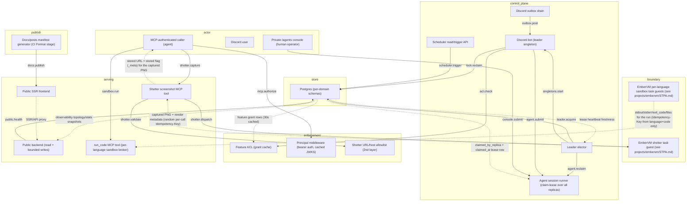
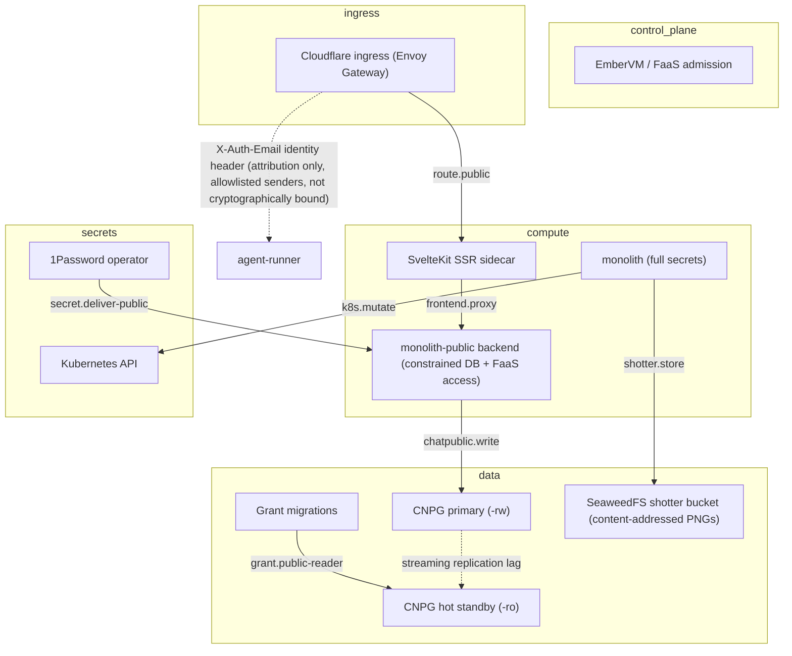

# STPA Control Analysis: monolith @ 248acd648

_Auto-generated STPA safety model: the unsafe states this system can reach and the control actions that get it there. Two views: logical (functional control flow) and physical (deployment)._

<b>How to read this</b>: STPA primer and diagram legend

**STPA** (System-Theoretic Process Analysis) treats the system as *controllers* issuing *control actions* to *controlled processes*, with *feedback* flowing back up. Instead of "what component can fail," it asks "what control action, given or withheld at the wrong time, drives the system into an unsafe state?" "Unsafe" means a violation of this system's reason to exist, not merely a crash.

Read top-down: **Losses** are outcomes we must never cause; **Hazards** are system states that lead to a loss; the **control-structure diagrams** (one per view) show who commands whom (solid arrows = control actions, dashed = feedback, a node tagged `(designed)` is in the architecture but **not yet built**); the **Unsafe Control Actions** table is the core, and **Unsafe Feedback** covers the dashed arrows: data channels whose absence, staleness, corruption, or spoofing drives a controller into a hazard. Every claim cites `path:line`; unbuilt elements are marked. Semantic, stable IDs mean regenerating changes only the findings that changed.

**Scope.** A single Postgres-backed personal platform served as two composed binaries: a private read-write binary (full app capabilities, private.jomcgi.dev) and an isolated public binary (jomcgi.dev via the separate monolith-public chart). The public binary is read-only for public datasets with two constrained write/invocation paths, the private binary now also serves an agent-session console, a six-language code sandbox, a screenshot tool, and MCP over native streamable HTTP; safety is governed data access, bounded public capabilities, the secret boundary, and correct claim/lease ownership of queued agent work.

Maturity detail

- **Built:** framework/core.py composition and profiles, separate private/public module registries, Postgres leader-lease singletons (Discord bot, AIS ingest, outbox drain, message-lock sweep), the agent_sessions claim-lease turn engine (atomic per-message claiming across all replicas plus a leader-owned stale-claim sweep) backing both the Discord bot and the private /agents console HTTP API, goosecracker recipe/repo catalog, chat feature ACL with 30s grant cache, public_reader/public_writer roles with schema/view confinement, public/private HTTPRoutes, Turnstile secret isolation, public chat admission/concurrency limits, public FaaS identity gate, observability snapshot rollup, the shotter MCP domain (URL/host validation, EmberVM task dispatch, best-effort SeaweedFS PNG storage with a random per-call Idempotency-Key), the sandbox MCP domain (run_code, six per-language EmberVM task workloads, zero-egress except an optional scratch-Postgres credential), the native /mcp mount on stateless streamable HTTP with PrincipalMiddleware authenticating every message via cached JWKS, and the docs/posts manifest generators that publish an exact allowlist of committed repository documents to the public site.
- **Designed-only:** Strict per-domain database isolation and the ADR 010 cross-domain contract remain architectural goals; the Module/build_app framework itself is built. ADR 059 (Draft) proposes removing Context Forge entirely as the MCP entry point and serving /mcp directly behind Cloudflare; only the first, independently-sequenced slice (the stateless-HTTP transport switch) has landed, Context Forge is still deployed and still in the request path. The Context Forge tool-visibility reconcile pass (#4569) that would scope which principal may call which tool is designed, not built, so per-tool authorization beyond bearer-token authentication does not exist for any MCP tool yet.

## Control structure

### Logical view

### Physical view

## Losses

| ID | Loss |
|----|------|
| `L.integrity-loss` | Data is corrupted, or a side-effecting action (Discord post, agent run, chat_public write) is duplicated or forged |
| `L.liveness-loss` | A queued turn or locked message never makes progress |
| `L.provenance-loss` | An agent acts on incomplete or misattributed context, losing lineage of what it was told |
| `L.secret-exposure` | A secret or token reaches a tier or surface that must not hold it |
| `L.silent-incorrectness` | A controller serves stale or wrong data while believing it correct |
| `L.unauthorized-access` | Anonymous or public-tier caller reads data it is not entitled to (private rows, ungoverned paths) |

## Hazards

| ID | View | Hazard (unsafe state) | → Losses | Maturity |
|----|----|----|----|----|
| `duplicate-agent-run` | logical | An agent turn runs twice: a stale-claim sweep reclaims a lease still held by an actively-executing replica, or a manual resubmission overlaps a guest-side invoke the monolith timed out on without confirming it stopped | L.integrity-loss | built |
| `header-authz-drift` | physical | X-Auth-Email is forwarded by several allowlisted in-cluster senders (gateway, MCP gateway, Argo job pods, the WhatsApp gateway, the EmberVM progress-ingest sidecar) that do not all cryptographically bind the claim to a verified caller; today it is read only for attribution (agent_sessions triggered_by), but nothing stops a future authorization decision from keying on it without also verifying the caller's JWT | L.unauthorized-access | built |
| `over-broad-public-grant` | physical | public_reader is granted on a schema or view that includes non-public rows | L.unauthorized-access, L.secret-exposure | built |
| `phantom-stored-artifact` | logical | A caller treats the returned content-addressed URL as a durable reference when the SeaweedFS write actually failed, because the URL is computed from the content hash before the upload is attempted and is returned either way | L.silent-incorrectness | built |
| `private-capture-retained` | physical | A captured screenshot, including of the private tier, is written to SeaweedFS with no expiry policy and persists indefinitely at a stable content-addressed URL after the request that produced it | L.unauthorized-access | built |
| `public-route-exposes-private-path` | physical | The public HTTPRoute forwards an internal or unfiltered path to a served handler | L.unauthorized-access | built |
| `public-write-admission-bypass` | physical | The internet-adjacent public tier can write outside the intended chat_public path, or bypasses Turnstile, per-session limits, and the cluster-wide inference cap | L.integrity-loss | built control; hazard remains if miswired |
| `sandbox-credential-egress` | logical | The scratch-Postgres feature, when enabled, injects a database DSN into the executed code's own process environment, so a Python run in the advertised zero-network sandbox gains credentialed, in-cluster network reach to a shared datastore; the tool's own docstring still claims there is no network at all | L.secret-exposure, L.unauthorized-access | built; feature disabled in production today (scratchPostgres.enabled: false) |
| `second-layer-validation-gap` | logical | The monolith-side host/scheme allowlist is weakened, widened without an ADR amendment, or bypassed, letting an out-of-policy top-level URL reach the EmberVM dispatch call; the guest-side in-guest proxy allowlist (projects/embervm/STPA.md) is the actual control on what gets fetched, so this alone does not open egress | L.unauthorized-access | built |
| `secret-in-wrong-tier` | physical | A private secret or a K8s token is delivered to the public or frontend tier | L.secret-exposure | built |
| `split-brain-singletons` | logical | Two replicas both believe they are leader and run duplicate bot/ingest/drain | L.integrity-loss | built |
| `stale-authz` | logical | A revoked feature grant keeps authorizing an action from the 30s ACL cache | L.unauthorized-access | built |
| `stale-public-snapshot` | logical | The public stats endpoint serves an old observability snapshot after the rollup job stops | L.silent-incorrectness | built, bounded by route behavior |
| `stale-sandbox-result` | logical | A caller re-invoking run_code with the same code but different input files receives a cached result computed against a prior submission's files instead of a fresh run | L.silent-incorrectness | built |
| `unbounded-capture-queueing` | logical | No rate limit gates shotter.capture or sandbox.run, so a caller can queue captures/runs faster than the workload's own cap admits, consuming brick memMib capacity shared with other task-class workloads | L.liveness-loss | built |
| `unredacted-public-doc` | logical | The docs/posts manifest generators copy an allowlisted document's full body into the public site verbatim, gating only on which path may be published, never on what the content contains, so an internal-only identifier (a cluster-internal hostname, a secret env var name) left in a published project's README/ARCHITECTURE/STPA/THREAT-MODEL reaches the public docs route | L.secret-exposure | built |
| `unrestricted-tool-visibility` | logical | PrincipalMiddleware authenticates every MCP message (a valid authentik bearer token is required), but no monolith tool authorizes on the resulting Principal: the Context Forge tool-visibility reconcile pass that would scope who may call a given tool is still designed, not built (#4569), so any authenticated caller, not only ones entitled to the private tier, can invoke shotter.capture, sandbox.run, or k8s_sync_argocd_app | L.unauthorized-access | built |
| `wedged-turn` | logical | A queued agent turn never progresses because no replica ever holds leadership to run the stale-claim sweep, and the replica that would have executed it directly crashed or restarted before claiming it | L.liveness-loss | built |

## Control actions

| ID | View | Control action | Controller → Process | Maturity | Evidence |
|----|----|----|----|----|----|
| `acl.check` | logical | Authorize a Discord feature action | `bot` → `acl` | built | projects/monolith/chat/acl.py:68 |
| `agent.reclaim` | logical | Reclaim stale turn claims left by a crashed replica (leader-owned 5s sweep) | `leader-elector` → `agent-runner` | built | projects/monolith/agent_sessions/store.py:772 |
| `agent.submit` | logical | Submit a Discord-triggered agent turn to the runner | `bot` → `agent-runner` | built | projects/monolith/chat/bot.py:1172 |
| `chatpublic.write` | physical | Write a bounded chat_public row to the primary as public_writer | `public-binary` → `pg-primary` | built | projects/monolith-public/chart/values.yaml:82 |
| `console.submit` | logical | Start or continue an agent session from the private console | `console-caller` → `agent-runner` | built | projects/monolith/agent_sessions/router.py:544 |
| `docs.publish` | logical | Copy an allowlisted repo doc's full body into the public docs/posts manifest | `docs-manifest-gen` → `public-frontend` | built | projects/monolith/knowledge/tools/gen_docs_manifest.py:123 |
| `frontend.proxy` | physical | Proxy SSR/API calls from the frontend to the public backend, in-cluster only | `frontend-ssr` → `public-binary` | built | projects/monolith-public/chart/templates/httproute-public.yaml:33 |
| `grant.public-reader` | physical | Grant public_reader SELECT on a schema/view | `migrations` → `pg-replica` | built | projects/monolith/chart/migrations/20260617000000_public_reader_role.sql:24 |
| `k8s.mutate` | physical | Mutate cluster state via private MCP (ArgoCD sync) | `private-binary` → `k8s-api` | built | projects/monolith/cluster/mcp.py:163 |
| `leader.acquire` | logical | Acquire/renew/steal the singleton lease | `leader-elector` → `postgres` | built | projects/monolith/core/leadership.py:56 |
| `lock.reclaim` | logical | Reclaim an expired message-processing lock | `bot` → `postgres` | built | projects/monolith/chat/leader.py:109 |
| `mcp.authorize` | logical | Verify the bearer token on every MCP message (stateless streamable HTTP) | `mcp-caller` → `principal-mw` | built | projects/monolith/framework/core.py:543 |
| `outbox.post` | logical | Drain and post a queued Discord message/edit/reaction | `outbox` → `bot` | built | projects/monolith/chat/outbox.py:146 |
| `public.health` | logical | Probe the public database as public_reader (SELECT 1) | `public-api` → `postgres` | built | projects/monolith/framework/core.py:322 |
| `route.public` | physical | Route the public hostname to the frontend SSR (no direct backend route) | `cf-ingress` → `frontend-ssr` | built | projects/monolith-public/chart/templates/httproute-public.yaml:13 |
| `sandbox.run` | logical | Run short code in a per-language zero-egress guest | `mcp-caller` → `sandbox-tool` | built | projects/monolith/sandbox/mcp.py:14 |
| `scheduler.trigger` | logical | Mark a job for immediate run | `scheduler-api` → `postgres` | built | projects/monolith/scheduler/service.py:35 |
| `secret.deliver-public` | physical | Deliver only the public backend's constrained DB, Turnstile, and signing material | `onepassword` → `public-binary` | built | projects/monolith-public/chart/templates/onepassworditem.yaml:1 |
| `shotter.capture` | logical | Request a rendered screenshot of a public/private page | `mcp-caller` → `shotter-tool` | built | projects/monolith/shotter/mcp.py:123 |
| `shotter.dispatch` | logical | Dispatch a fresh task-class guest to render the URL | `shotter-tool` → `embervm-shotter` | built | projects/monolith/shotter/client.py:91 |
| `shotter.store` | physical | Best-effort content-addressed upload of the captured PNG | `private-binary` → `shotter-store` | built | projects/monolith/shotter/s3.py:83 |
| `shotter.validate` | logical | Validate scheme/host/dimensions before dispatch (2nd, defense-in-depth layer) | `shotter-tool` → `shotter-validate` | built | projects/monolith/shotter/mcp.py:56 |
| `singletons.start` | logical | Start leader-only singletons (bot, ingest, drain, sweep) | `leader-elector` → `bot` | built | projects/monolith/framework/core.py:236 |

## Unsafe control actions

*The core of the analysis. Each row: a control action made unsafe via one guideword, the hazard/loss it causes, and where in the code it lives.*

| ID | View | Control action | Guideword | Unsafe condition | Severity | → Hazards | Evidence |
|----|----|----|----|----|----|----|----|
| `agent.reclaim.wrong-timing` | logical | `agent.reclaim` | wrong-timing | The reclaim lease and the local heartbeat check are computed from two different clocks (the lease cutoff from the pod's own monotonic-adjacent wall clock, the claimed_at write from the database's); a pod running ahead of the database clock reclaims a lease that is still being actively refreshed elsewhere, and the reclaiming replica's own self-check ("claim was stolen") only protects the replica that LOST the claim, not the window before the next 10s heartbeat catches it, so both replicas can execute the same turn concurrently for up to that window | medium | duplicate-agent-run, split-brain-singletons | projects/monolith/agent_sessions/store.py:791 |
| `chatpublic.write.providing` | physical | `chatpublic.write` | providing | The public tier accepts a write without the Turnstile/IP-hash admission gate or writes outside the constrained chat_public schema, poisoning or escaping the public boundary | high | public-write-admission-bypass | projects/monolith-public/chart/values.yaml:146 |
| `docs.publish.providing` | logical | `docs.publish` | providing | The generator's only gate is an exact repo-path allowlist (seven projects times four doc kinds); it performs no content scan, so an internal-only identifier committed into one of those documents is published to the internet on the next regeneration with no reviewer prompt beyond an ordinary PR diff, and the currently-live manifest already carries a cluster-internal hostname from a prior STPA.md revision | medium | unredacted-public-doc | projects/monolith/knowledge/tools/gen_docs_manifest.py:123 |
| `grant.public-reader.providing` | physical | `grant.public-reader` | providing | A grant on ALL TABLES or a view lacking the visibility filter exposes private rows to the anonymous tier | high | over-broad-public-grant | projects/monolith/chart/migrations/20260617000000_public_reader_role.sql:24 |
| `k8s.mutate.providing` | physical | `k8s.mutate` | providing | An MCP caller with a valid bearer token issues an ArgoCD sync or resource mutation with no additional per-tool authorization of which Principal may trigger it; the delegation seam (#4940) exists but this tool does not consume it | medium | unrestricted-tool-visibility, secret-in-wrong-tier | projects/monolith/cluster/mcp.py:163 |
| `lock.reclaim.wrong-timing` | logical | `lock.reclaim` | wrong-timing | A slow handler still processing past the 30s TTL is reclaimed and the message is reprocessed concurrently | medium | duplicate-agent-run | projects/monolith/chat/leader.py:109 |
| `route.public.providing` | physical | `route.public` | providing | A public HTTPRoute sends an unapproved backend path to the internet, or the frontend SSR proxy exposes a private-only route | high | public-route-exposes-private-path | projects/monolith-public/chart/templates/httproute-public.yaml:20 |
| `sandbox.run.providing` | logical | `sandbox.run` | providing | When the scratch-Postgres feature is enabled, run_code's own docstring still advertises "there is no network at all" for every language while the Python path silently gains a credentialed connection string to an in-cluster datastore, so a caller relies on an isolation guarantee the tool does not actually provide for that one language | medium | sandbox-credential-egress | projects/monolith/sandbox/client.py:40 |
| `secret.deliver-public.providing` | physical | `secret.deliver-public` | providing | A private credential, Kubernetes API-capable token, or Turnstile secret is wired into the public frontend or public backend beyond its explicitly constrained use | high | secret-in-wrong-tier | projects/monolith/public_turnstile_secret_isolation_test.py:76 |
| `shotter.capture.providing` | logical | `shotter.capture` | providing | PrincipalMiddleware verifies the caller holds a valid authentik-issued token, but no per-tool authorization scopes who may invoke shotter.capture: any authenticated MCP caller, not only ones entitled to the private tier, can render private.jomcgi.dev pages | high | unrestricted-tool-visibility | projects/monolith/shotter/mcp.py:120 |
| `shotter.store.wrong-duration` | physical | `shotter.store` | wrong-duration | The stored PNG is retained indefinitely with no expiry policy, so a private-tier capture remains fetchable at its content-addressed URL by anything that can reach the SeaweedFS S3 endpoint and obtain the hash, long after the request that produced it | medium | private-capture-retained | projects/monolith/shotter/s3.py:99 |
| `shotter.validate.not-providing` | logical | `shotter.validate` | not-providing | HOST_SERVICE_MAP is widened past its documented exactly-two-entries invariant, or validate_screenshot_url is bypassed, without an accompanying ADR amendment; the two allowlists (monolith host map, guest-side hard allowlist) are not tied by any build-time invariant, so they can drift independently | low | second-layer-validation-gap | projects/monolith/shotter/hosts.py:20 |

## Unsafe feedback

*Feedback and data channels whose absence, staleness, corruption, or spoofed origin drives a controller into a hazard. This is where data-integrity failures live.*

| ID | View | Channel | Guideword | Unsafe condition | Severity | → Hazards | Evidence |
|----|----|----|----|----|----|----|----|
| `claim-lease.stale` | logical | `postgres` → `agent-runner`: claimed_by_replica + claimed_at lease row | stale | A pod's own clock running ahead of the database's is the dangerous skew direction named in the reclaim function's own docstring: it sees a live claim as older than it is and reclaims a turn that is still being actively executed by its true owner. NTP keeps this far inside the 30s lease in practice, but the failure is explicitly documented as silent | medium | duplicate-agent-run | projects/monolith/agent_sessions/store.py:794 |
| `grants-cache.stale` | logical | `postgres` → `acl`: feature grant rows for guild+subject+scope | stale | A revoked or newly added grant is not seen for up to the 30s cache TTL, so the ACL authorizes on old policy | medium | stale-authz | projects/monolith/chat/acl.py:59 |
| `lease-heartbeat.stale` | logical | `postgres` → `leader-elector`: leader_lease.heartbeat_at freshness | stale | A leader whose event loop stalls past the 5s TTL (e.g. a sync Session call in async) is stolen from while still holding live singletons, so two replicas run them | high | split-brain-singletons | projects/monolith/core/leadership.py:31 |
| `obs-snapshot.stale` | logical | `postgres` → `public-api`: observability topology/stats snapshot rows | stale | If the Argo rollup stops, the public stats endpoint can serve an old snapshot without an age field or freshness error | medium | stale-public-snapshot | projects/monolith/home/observability/router.py:24 |
| `run-ack.missing` | logical | `embervm-sandbox` → `agent-runner`: run-accepted / result acknowledgement from the EmberVM shim invoke | missing | A read timeout raised as EmberVMTimeout leaves the monolith unable to confirm whether the guest actually started or is still running the turn; the pending row is deleted and the turn recorded as a terminal error either way, so a caller who resubmits the same prompt can produce a second guest-side run for what they perceive as one request | low | duplicate-agent-run | projects/monolith/agent_sessions/transport.py:646 |
| `sandbox-dedupe.stale` | logical | `embervm-sandbox` → `sandbox-tool`: stdout/stderr/exit_code/files for a (language, code) key | stale | The Idempotency-Key hashes only language and code, not the optional input files; EmberVM's task store dedupes a resubmit against the existing task's stored result for its result TTL (CRD default 86400s, not overridden for the sandbox workloads), so a caller who resubmits identical code with different input files within that window silently receives the first submission's output computed against the first submission's files. Shotter had the identical bug (a URL-only key colliding across distinct captures) and was fixed by switching to a random per-call nonce; that fix's own comment explains a params-derived key is only correct when EVERY input that affects the result is part of the key, which this key does not satisfy | medium | stale-sandbox-result | projects/monolith/sandbox/client.py:97 |
| `stored-metadata.corrupted` | logical | `shotter-tool` → `mcp-caller`: content-addressed screenshot URL + stored flag in tool metadata | corrupted | put_screenshot derives the URL from the content hash before attempting the upload and returns it unconditionally; when the upload fails, stored is false but the URL still looks like a valid, resolvable pointer. A caller that does not check _meta.stored persists or shares a link that 404s, indistinguishable at a glance from one that resolves | medium | phantom-stored-artifact | projects/monolith/shotter/s3.py:126 |
| `triggered-by-header.unauthorized-source` | physical | `cf-ingress` → `agent-runner`: X-Auth-Email identity header | unauthorized-source | The header is forwarded by several allowlisted in-cluster senders behind a default-deny ingress NetworkPolicy, but the policy narrows WHO can reach the pod, not whether the value each of those senders sends is itself verified; the only current consumer records it as attribution with no authorization decision resting on it, so the gap is dormant rather than exploitable today, but nothing in the code enforces that boundary if a future authorization check starts keying on the header directly instead of verifying the underlying JWT | low | header-authz-drift | projects/monolith/agent_sessions/router.py:546 |

<b>Not UCAs</b>: 10 examined and rejected

- **a rendered public doc linking out to a non-public repository document**: buildPathIndex only maps allowlisted manifest paths to slugs; a link to anything else is stripped to plain text rather than left live (projects/monolith/frontend/src/lib/server/docs.js:9)
- **a repeat POST of the same shotter.capture request colliding across two unrelated captures**: Fixed: the Idempotency-Key is now a random per-call nonce, so it only buys transport-retry safety within one call and cannot collapse two distinct captures of the same URL onto one cached result (projects/monolith/shotter/client.py:82)
- **a repo doc outside the seven PUBLIC_PROJECTS directories reaching the docs manifest**: The generator indexes only exact path matches built from a fixed PUBLIC_PROJECTS x DOC_KINDS product, not a directory walk, so nothing else in the repo, including ADRs and nested READMEs, is reachable through this generator regardless of what git ls-files returns (projects/monolith/knowledge/tools/gen_docs_manifest.py:49)
- **a single missed leadership heartbeat**: Bounded by 2s renew inside the 5s TTL, and any error resolves to follower fail-safe (projects/monolith/core/leadership.py:29)
- **an ungated docs/posts draft (no public key, or public: false) reaching the public site**: Fails closed: _declared_public_value returns None for an ungated file and it is skipped, and a strict literal-match check on the public key raises rather than guessing (projects/monolith/knowledge/tools/gen_posts_manifest.py:64)
- **outbox at-least-once duplicate on crash between post and mark**: Bounded and mostly idempotent: reactions/edits resolve missing targets, a duplicate notify is a rare nuisance (projects/monolith/chat/outbox.py:135)
- **public_reader denied on a private schema**: Not a hazard but the enforced control: DB permission denies the read; asserted by projects/monolith/public_reader_grants_test.py:44
- **scheduler.trigger marks a job that never dispatches**: Inert, not unsafe for currently Argo-owned jobs: ARGO_JOBS prevents duplicate in-process registration and active CronWorkflows own execution (projects/monolith/scheduler/api.py:23)
- **shotter.capture exceeding its render budget**: Bounded by the nested timeout chain (Context Forge 60s > client read 55s > workload 50s > guest handler 45s > CDP navigate), converted into a ToolTimeout rather than an indefinite hold (projects/monolith/shotter/client.py:96)
- **two replicas racing to claim the same pending message**: claim_pending_message_for_session_sync is a single atomic UPDATE ... WHERE claimed_by_replica IS NULL, so only one of two concurrent claimants can succeed (projects/monolith/agent_sessions/store.py:634)

## Open questions

- ADR 059 is still Draft: does the full Context Forge removal change anything about the ingestion allowlist in cilium-ingress-policy.yaml (the mcp entry), or does the direct-mount path simply add a second ingress source alongside it?
- Does any workload other than shotter and the six sandbox languages share the same EmberVM Idempotency-Key-from-request-parameters pattern, and if so does its key cover every parameter that affects the result?
- In production, can a chat message handler (LLM summarizer) exceed the 30s message-lock TTL under load and trip lock.reclaim.wrong-timing, or is processing reliably shorter?
- Is the X-Auth-Email header ever going to gate an authorization decision, or does #4940's delegation model deliberately avoid keying on inbound headers at all? If the latter, header-authz-drift can be downgraded once that is documented somewhere durable.
- Is the shotter SeaweedFS bucket's read path gated the way artifact's is (proxied through a monolith-mediated read), or does anything with in-cluster network reach get an anonymous GET against the S3 endpoint once it has or guesses a content hash?
- Now that PrincipalMiddleware authenticates every MCP message, when does #4569's tool-visibility reconcile pass land, and will it gate shotter.capture, sandbox.run, and k8s_sync_argocd_app by Principal scope, or only by the coarser tool-granular ACL ADR 059 compares Context Forge against?
- The framework is now built, but strict per-domain schema isolation and the cross-domain contract are still conventions. Re-run this analysis when those controls become enforceable rather than merely compositional.
- The private chart enables HPA from 1 to 3 replicas; verify claim-lease behavior under real scale-out and termination, especially whether a terminating pod's in-flight claims are released promptly enough for the 30s lease to matter in practice.
- The public backend has a deliberate primary write path and public FaaS invocation path. Confirm production Cilium/EmberVM policy matches the chart claims: public_writer must remain limited to chat_public, and the public service account must remain identity-only with no Kubernetes RBAC.
- When the scratch-Postgres feature is re-enabled (embervm side), should run_code's docstring be corrected to stop claiming zero network for python, or should the DSN injection move behind a separate, explicitly-network-capable tool so the isolation claim stays true for the tool most callers reach for?
