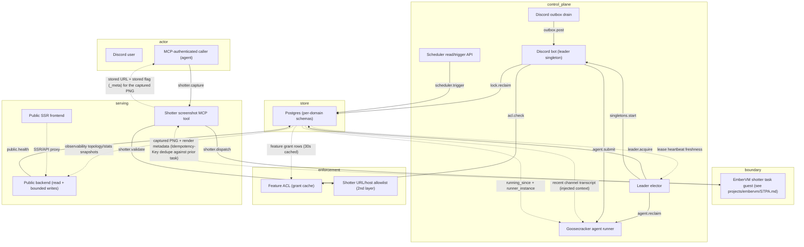
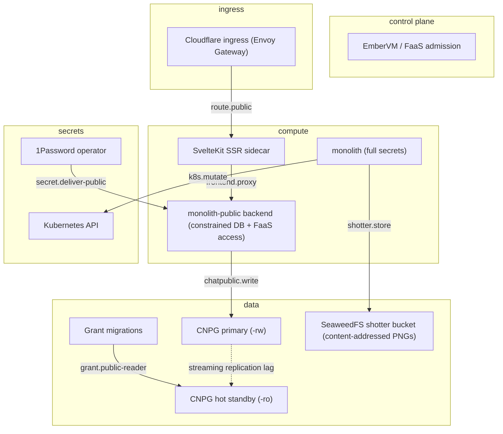

# STPA Control Analysis: monolith @ 55ca7188a

_Auto-generated STPA safety model: the unsafe states this system can reach and the control actions that get it there. Two views: logical (functional control flow) and physical (deployment)._

<b>How to read this</b>: STPA primer and diagram legend

**STPA** (System-Theoretic Process Analysis) treats the system as *controllers* issuing *control actions* to *controlled processes*, with *feedback* flowing back up. Instead of "what component can fail," it asks "what control action, given or withheld at the wrong time, drives the system into an unsafe state?" "Unsafe" means a violation of this system's reason to exist, not merely a crash.

Read top-down: **Losses** are outcomes we must never cause; **Hazards** are system states that lead to a loss; the **control-structure diagrams** (one per view) show who commands whom (solid arrows = control actions, dashed = feedback, a node tagged `(designed)` is in the architecture but **not yet built**); the **Unsafe Control Actions** table is the core, and **Unsafe Feedback** covers the dashed arrows: data channels whose absence, staleness, corruption, or spoofing drives a controller into a hazard. Every claim cites `path:line`; unbuilt elements are marked. Semantic, stable IDs mean regenerating changes only the findings that changed.

**Scope.** A single Postgres-backed personal platform served as two composed binaries: a private read-write binary (full app capabilities, `private.jomcgi.dev`) and an isolated public binary (`jomcgi.dev` via the separate monolith-public chart). The public binary is read-only for the public datasets, but intentionally has two constrained write/invocation paths: `chat_public` through `public_writer` on the primary, and public FaaS invocation through an allow-listed EmberVM identity. The frontend is a separate SSR component. The private binary now also exposes shotter, an MCP tool that dispatches a rendered screenshot of a deployed page to an EmberVM task-class guest. Safety = governed data access, bounded public capabilities, the secret boundary, and (new) bounded and authorized invocation of a cluster-fetching tool call.

Maturity detail

- **Built:** `framework/core.py` composition and profiles, separate private/public module registries, Postgres leader-lease singletons (Discord bot, AIS ingest, outbox drain, message-lock sweep, agent-session reclaim), goosecracker runner + orphan reclaim, chat feature ACL with 30s grant cache, `public_reader`/`public_writer` roles with schema/view confinement, public/private HTTPRoutes, Turnstile secret isolation, public chat admission/concurrency limits, public FaaS identity gate, observability snapshot rollup, and the shotter MCP domain (URL/host validation, EmberVM task dispatch client, best-effort SeaweedFS PNG storage), private-binary only.
- **Designed-only:** strict per-domain database isolation and the ADR 010 cross-domain contract remain architectural goals; the `Module`/`build_app` framework itself is built. The database still has shared cross-domain access in the private binary. The Context Forge tool-visibility reconcile pass (#4569) that would scope who can see a newly federated tool is designed, not built.
- **Note:** `scheduler/api.py` still contains the full SKIP-LOCKED dispatch loop, but no API lifespan starts it. Active jobs are rendered as Argo CronWorkflows and skipped in-process through `ARGO_JOBS`; the scheduler read/trigger API and dormant legacy loop remain. The private chart enables HPA from 1 to 3 replicas, so leader election is an active horizontal-scaling control rather than merely a future hazard. The public web and frontend also each have HPA up to 3 replicas. Shotter's in-guest primary egress control (the Go allowlist inside the EmberVM guest, issue #4994 T2) and the guest-side render/timeout handler are modeled in `projects/embervm/STPA.md`, not here: this file scopes the monolith-side half of the control loop (the MCP tool, its second-layer URL validation, the EmberVM dispatch client, and SeaweedFS storage) and references the guest-side boundary rather than duplicating it.

## Control structure

### Logical view

### Physical view

## Losses

| ID | Loss |
|----|------|
| `L.integrity-loss` | Data is corrupted, or a side-effecting action (Discord post, agent run, chat_public write) is duplicated or forged |
| `L.liveness-loss` | A queued turn or locked message never makes progress |
| `L.provenance-loss` | An agent acts on incomplete or misattributed context, losing lineage of what it was told |
| `L.secret-exposure` | A secret or token reaches a tier or surface that must not hold it |
| `L.silent-incorrectness` | A controller serves stale or wrong data while believing it correct |
| `L.unauthorized-access` | Anonymous or public-tier caller reads data it is not entitled to (private rows, ungoverned paths) |

## Hazards

| ID | View | Hazard (unsafe state) | → Losses | Maturity |
|----|----|----|----|----|
| `context-blind-turn` | logical | An agent turn runs without the injected context it should have had | L.provenance-loss | built |
| `duplicate-agent-run` | logical | An agent turn runs twice (reclaim of a still-live turn, or ambiguous run-accepted ack) | L.integrity-loss | built |
| `lock-reclaim-live` | logical | A message lock is reclaimed while its original processing is still in flight | L.integrity-loss | built |
| `over-broad-public-grant` | physical | public_reader is granted on a schema or view that includes non-public rows | L.unauthorized-access, L.secret-exposure | built |
| `phantom-stored-artifact` | logical | A caller treats the returned content-addressed URL as a durable reference when the SeaweedFS write actually failed, because the URL is computed from the content hash before the upload is attempted and is returned either way | L.silent-incorrectness | built |
| `private-capture-retained` | physical | A captured screenshot, including of the private tier, is written to SeaweedFS with no expiry policy and persists indefinitely at a stable content-addressed URL after the request that produced it | L.unauthorized-access | built |
| `public-route-exposes-private-path` | physical | The public HTTPRoute forwards an internal or unfiltered path to a served handler | L.unauthorized-access | built |
| `public-write-admission-bypass` | physical | The internet-adjacent public tier can write outside the intended `chat_public` path, or bypasses Turnstile, per-session limits, and the cluster-wide inference cap | L.integrity-loss | built control; hazard remains if miswired |
| `second-layer-validation-gap` | logical | The monolith-side host/scheme allowlist is weakened, widened without an ADR amendment, or bypassed, letting an out-of-policy top-level URL reach the EmberVM dispatch call; the guest-side in-guest proxy allowlist (`projects/embervm/STPA.md`) is the actual control on what gets fetched, so this alone does not open egress | L.unauthorized-access | built |
| `secret-in-wrong-tier` | physical | A private secret or a K8s token is delivered to the public or frontend tier | L.secret-exposure | built |
| `split-brain-singletons` | logical | Two replicas both believe they are leader and run duplicate bot/ingest/drain | L.integrity-loss | built |
| `stale-authz` | logical | A revoked feature grant keeps authorizing an action from the 30s ACL cache | L.unauthorized-access | built |
| `stale-capture-served` | logical | A caller re-invoking shotter to check a page again receives a cached render from a prior, no-longer-representative state of that page instead of a fresh one | L.silent-incorrectness | built |
| `stale-public-snapshot` | logical | The public stats endpoint serves an old observability snapshot after the rollup job stops | L.silent-incorrectness | built, bounded by route behavior |
| `unbounded-capture-queueing` | logical | No rate limit gates `shotter.capture`, so a caller can queue captures faster than the workload's own cap admits, consuming brick memMib capacity shared with other task-class workloads | L.liveness-loss | built |
| `unrestricted-tool-visibility` | logical | A newly federated monolith MCP tool defaults to Context Forge visibility=public with no per-tool authorization inside monolith itself, so any authenticated caller, not only ones entitled to the private tier, can invoke shotter and render `private.jomcgi.dev` | L.unauthorized-access | built |
| `wedged-turn` | logical | A queued agent turn never progresses because no leader ever reclaims it | L.liveness-loss | built |

## Control actions

| ID | View | Control action | Controller → Process | Maturity | Evidence |
|----|----|----|----|----|----|
| `acl.check` | logical | Authorize a Discord feature action | `bot` → `acl` | built | projects/monolith/chat/acl.py:68 |
| `agent.reclaim` | logical | Re-dispatch an orphaned agent turn on leader acquire | `leader-elector` → `agent-runner` | built | projects/monolith/chat/goosecracker.py:512 |
| `agent.submit` | logical | Submit an agent turn to the runner | `bot` → `agent-runner` | built | projects/monolith/chat/goosecracker.py:273 |
| `chatpublic.write` | physical | Write a bounded chat_public row to the primary as public_writer | `public-binary` → `pg-primary` | built | projects/monolith-public/chart/values.yaml:82 |
| `frontend.proxy` | physical | Proxy SSR/API calls from the frontend to the public backend, in-cluster only | `frontend-ssr` → `public-binary` | built | projects/monolith-public/chart/templates/httproute-public.yaml:33 "reached only by the frontend in-cluster" |
| `grant.public-reader` | physical | Grant public_reader SELECT on a schema/view | `migrations` → `pg-replica` | built | projects/monolith/chart/migrations/20260617000000_public_reader_role.sql:24 |
| `k8s.mutate` | physical | Mutate cluster state via private MCP (ArgoCD sync) | `private-binary` → `k8s-api` | built | projects/monolith/cluster/mcp.py:163 |
| `leader.acquire` | logical | Acquire/renew/steal the singleton lease | `leader-elector` → `postgres` | built | projects/monolith/core/leadership.py:56 |
| `lock.reclaim` | logical | Reclaim an expired message-processing lock | `bot` → `postgres` | built | projects/monolith/chat/leader.py:124 |
| `outbox.post` | logical | Drain and post a queued Discord message/edit/reaction | `outbox` → `bot` | built | projects/monolith/chat/outbox.py:157 |
| `public.health` | logical | Probe the public database as public_reader (SELECT 1) | `public-api` → `postgres` | built | projects/monolith/framework/core.py:282 |
| `route.public` | physical | Route the public hostname to the frontend SSR (no direct backend route) | `cf-ingress` → `frontend-ssr` | built | projects/monolith-public/chart/templates/httproute-public.yaml:13 |
| `scheduler.trigger` | logical | Mark a job for immediate run | `scheduler-api` → `postgres` | built | projects/monolith/scheduler/service.py:35 |
| `secret.deliver-public` | physical | Deliver only the public backend's constrained DB, Turnstile, and signing material | `onepassword` → `public-binary` | built | projects/monolith-public/chart/templates/onepassworditem.yaml:1 |
| `shotter.capture` | logical | Request a rendered screenshot of a jomcgi.dev/private.jomcgi.dev page | `mcp-caller` → `shotter-tool` | built | projects/monolith/shotter/mcp.py:94 |
| `shotter.dispatch` | logical | Dispatch a fresh task-class guest to render the URL | `shotter-tool` → `embervm-shotter` | built | projects/monolith/shotter/client.py:91 |
| `shotter.store` | physical | Best-effort content-addressed upload of the captured PNG | `private-binary` → `shotter-store` | built | projects/monolith/shotter/s3.py:83 |
| `shotter.validate` | logical | Validate scheme/host/dimensions before dispatch (2nd, defense-in-depth layer) | `shotter-tool` → `shotter-validate` | built | projects/monolith/shotter/mcp.py:124 |
| `singletons.start` | logical | Start leader-only singletons (bot, ingest, drain, sweep) | `leader-elector` → `bot` | built | projects/monolith/framework/core.py:213 |

## Unsafe control actions

*The core of the analysis. Each row: a control action made unsafe via one guideword, the hazard/loss it causes, and where in the code it lives.*

| ID | View | Control action | Guideword | Unsafe condition | Severity | → Hazards | Evidence |
|----|----|----|----|----|----|----|----|
| `agent.reclaim.providing` | logical | `agent.reclaim` | providing | Reclaim re-dispatches a turn whose old owner is still tearing down or still running it, so the turn executes twice | high | duplicate-agent-run, split-brain-singletons | projects/monolith/chat/goosecracker.py:512 |
| `chatpublic.write.providing` | physical | `chatpublic.write` | providing | The public tier accepts a write without the Turnstile/IP-hash admission gate or writes outside the constrained chat_public schema, poisoning or escaping the public boundary | high | public-write-admission-bypass | projects/monolith-public/chart/values.yaml:146 |
| `grant.public-reader.providing` | physical | `grant.public-reader` | providing | A grant on ALL TABLES or a view lacking the visibility filter exposes private rows to the anonymous tier | high | over-broad-public-grant | projects/monolith/chart/migrations/20260617000000_public_reader_role.sql:24 |
| `k8s.mutate.providing` | physical | `k8s.mutate` | providing | An LLM-driven MCP call issues an ArgoCD sync or resource mutation without the private-tier authorization boundary | medium | secret-in-wrong-tier | projects/monolith/cluster/mcp.py:163 |
| `lock.reclaim.wrong-timing` | logical | `lock.reclaim` | wrong-timing | A slow handler still processing past the 30s TTL is reclaimed and the message is reprocessed concurrently | medium | lock-reclaim-live | projects/monolith/chat/leader.py:124 |
| `route.public.providing` | physical | `route.public` | providing | A public HTTPRoute sends an unapproved backend path to the internet, or the frontend SSR proxy exposes a private-only route | high | public-route-exposes-private-path | projects/monolith-public/chart/templates/httproute-public.yaml:20 |
| `secret.deliver-public.providing` | physical | `secret.deliver-public` | providing | A private credential, Kubernetes API-capable token, or Turnstile secret is wired into the public frontend or public backend beyond its explicitly constrained use | high | secret-in-wrong-tier | projects/monolith/public_turnstile_secret_isolation_test.py:76 |
| `shotter.capture.providing` | logical | `shotter.capture` | providing | Context Forge federates a newly registered tool at `visibility=public` and monolith performs no per-tool authorization of its own (the forwarded authentik token is not validated yet, #4569), so any authenticated MCP caller, not only ones entitled to the private tier, can invoke `shotter.capture` and receive a render of `private.jomcgi.dev` | high | unrestricted-tool-visibility | projects/mcp/README.md:72 |
| `shotter.store.wrong-duration` | physical | `shotter.store` | wrong-duration | The stored PNG is retained indefinitely with no expiry policy, so a private-tier capture remains fetchable at its content-addressed URL by anything that can reach the SeaweedFS S3 endpoint and obtain the hash, long after the request that produced it | medium | private-capture-retained | projects/monolith/shotter/s3.py:99 |
| `shotter.validate.not-providing` | logical | `shotter.validate` | not-providing | `HOST_SERVICE_MAP` is widened past its documented exactly-two-entries invariant, or `validate_screenshot_url` is bypassed, without an accompanying ADR amendment; the two allowlists (monolith host map, guest-side hard allowlist) are not tied by any build-time invariant, so they can drift independently | low | second-layer-validation-gap | projects/monolith/shotter/hosts.py:20 |

## Unsafe feedback

*Feedback and data channels whose absence, staleness, corruption, or spoofed origin drives a controller into a hazard. This is where data-integrity failures live.*

| ID | View | Channel | Guideword | Unsafe condition | Severity | → Hazards | Evidence |
|----|----|----|----|----|----|----|----|
| `capture-dedupe.stale` | logical | `embervm-shotter` → `shotter-tool`: captured PNG + render metadata for a (url,width,height,full_page,wait_until) key | stale | The Idempotency-Key is derived purely from `(url,width,height,full_page,wait_until)` with no nonce or timestamp, and EmberVM dedupes a resubmit against the existing task for its stored-result TTL (default 86400s, not overridden for `shotterWorkload`). A caller re-invoking the tool with the same arguments to check a page after a deploy, within that window, silently receives the prior render as if it were current | medium | stale-capture-served | projects/monolith/shotter/client.py:74 |
| `grants-cache.stale` | logical | `postgres` → `acl`: feature grant rows for guild+subject+scope | stale | A revoked or newly added grant is not seen for up to the 30s cache TTL, so the ACL authorizes on old policy | medium | stale-authz | projects/monolith/chat/acl.py:41 |
| `injected-context.missing` | logical | `postgres` → `agent-runner`: recent channel transcript for the turn | missing | Context assembly fails best-effort and the turn proceeds context-blind, losing the provenance it should have acted on | low | context-blind-turn | projects/monolith/chat/goosecracker.py:865 |
| `lease-heartbeat.stale` | logical | `postgres` → `leader-elector`: leader_lease.heartbeat_at freshness | stale | A leader whose event loop stalls past the 5s TTL (e.g. a sync Session call in async) is stolen from while still holding live singletons, so two replicas run them | high | split-brain-singletons | projects/monolith/core/leadership.py:31 |
| `obs-snapshot.stale` | logical | `postgres` → `public-api`: observability topology/stats snapshot rows | stale | If the Argo rollup stops, the public stats endpoint can serve an old snapshot without an age field or freshness error | medium | stale-public-snapshot | projects/monolith/home/observability/router.py:24 |
| `run-ack.missing` | logical | `postgres` → `agent-runner`: run-accepted acknowledgement from fc-invoke | missing | A read timeout after the run was accepted off-host leaves the runner unable to confirm it ran, so a manual resume can duplicate it | low | duplicate-agent-run | projects/monolith/goosecracker/runner.py:533 |
| `stored-metadata.corrupted` | logical | `shotter-tool` → `mcp-caller`: content-addressed screenshot URL + stored flag in tool metadata | corrupted | `put_screenshot` derives the URL from the content hash before attempting the upload and returns it unconditionally; when the upload fails, `stored` is false but the URL still looks like a valid, resolvable pointer. A caller that does not check `_meta.stored` persists or shares a link that 404s, indistinguishable at a glance from one that resolves | medium | phantom-stored-artifact | projects/monolith/shotter/s3.py:126 |

<b>Not UCAs</b>: 8 examined and rejected

- **a single missed leadership heartbeat**: Bounded by 2s renew inside the 5s TTL, and any error resolves to follower fail-safe (projects/monolith/core/leadership.py:29)
- **drain_agent_queue re-own race after handover**: The whole read-check-modify-write runs under with_for_update=True opened at projects/monolith/chat/goosecracker.py:471
- **message-lock reclaim double-claim across pods**: `FOR UPDATE SKIP LOCKED` rows are held to session.commit(), and the reclaim update is transactional (projects/monolith/chat/store.py:701)
- **outbox at-least-once duplicate on crash between post and mark**: Bounded and mostly idempotent: reactions/edits resolve missing targets, a duplicate notify is a rare nuisance (projects/monolith/chat/outbox.py:135)
- **public_reader denied on a private schema**: Not a hazard but the enforced control: DB permission denies the read; asserted by projects/monolith/public_reader_grants_test.py:44
- **scheduler.trigger marks a job that never dispatches**: Inert, not unsafe for currently Argo-owned jobs: `ARGO_JOBS` prevents duplicate in-process registration and active CronWorkflows own execution (projects/monolith/scheduler/api.py:23)
- **shotter.capture exceeding its render budget**: Bounded by the nested timeout chain (Context Forge 60s > client read 55s > workload 50s > guest handler 45s > CDP navigate), converted into a `ToolTimeout` rather than an indefinite hold (projects/monolith/shotter/client.py:96)
- **shotter.dispatch retried after a transient network error**: The `Idempotency-Key` on the POST means a client-side retry of the same request resolves to the same task rather than launching a second guest (projects/monolith/shotter/client.py:74)

## Open questions

- Does the #4569 Context Forge tool-visibility reconcile pass, once built, default a newly federated tool like shotter to a restricted group before or after it is first callable? `shotter.capture.providing` assumes the current gap (`visibility=public` with no monolith-side authorization) persists until #4569 ships.
- In production, can a chat message handler (LLM summarizer) exceed the 30s message-lock TTL under load and trip `lock.reclaim.wrong-timing`, or is processing reliably shorter?
- Is the private cluster-mutating MCP surface (`k8s-sync-argocd-app`, `cluster.mcp`) authorization-gated for every verb, or does composition into the private binary alone grant it?
- Is the shotter SeaweedFS bucket's read path gated the way artifact's is (proxied through `get_artifact`/`head_artifact` on the monolith), or does anything with in-cluster network reach get an anonymous GET against `seaweedfs-s3.seaweedfs.svc.cluster.local` once it has or guesses a sha256? The returned `_meta.url` is a raw cluster-internal endpoint, not a monolith-mediated read path, a different shape than `artifact.s3`.
- The framework is now built, but strict per-domain schema isolation and the cross-domain contract are still conventions. Re-run this analysis when those controls become enforceable rather than merely compositional.
- The private chart enables HPA from 1 to 3 replicas (`projects/monolith/chart/values.yaml:12`); verify leader handover under real scale-out and termination, especially the gap between lease loss and singleton shutdown.
- The public backend has a deliberate primary write path and public FaaS invocation path. Confirm production Cilium/EmberVM policy matches the chart claims: `public_writer` must remain limited to `chat_public`, and the public service account must remain identity-only with no Kubernetes RBAC.
